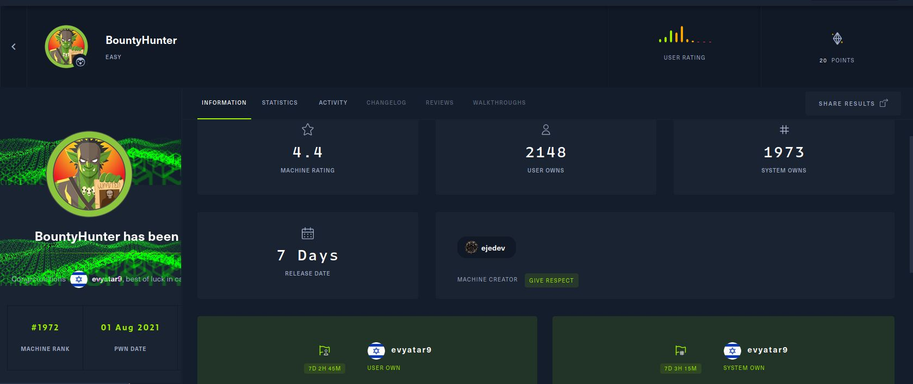

# BountyHunter - HackTheBox - Writeup
Linux, 20 Base Points, Easy

## Machine


 
 
## BountyHunter Solution


### User

Let's start with ```nmap``` scanning:

```console
┌─[evyatar@parrot]─[/hackthebox/BountyHunter]
└──╼ $ nmap -sC -sV -oA nmap/BountyHunter 10.10.11.100
Starting Nmap 7.80 ( https://nmap.org ) at 2021-07-30 17:17 IDT
Nmap scan report for 10.10.11.100
Host is up (0.077s latency).
Not shown: 998 closed ports
PORT   STATE SERVICE VERSION
22/tcp open  ssh     OpenSSH 8.2p1 Ubuntu 4ubuntu0.2 (Ubuntu Linux; protocol 2.0)
80/tcp open  http    Apache httpd 2.4.41 ((Ubuntu))
|_http-server-header: Apache/2.4.41 (Ubuntu)
|_http-title: Bounty Hunters
Service Info: OS: Linux; CPE: cpe:/o:linux:linux_kernel
```

By observing port 80 [http://10.10.11.100/](http://10.10.11.100/):


## BountyHunter is still active machine - [Full writeup](BountyHunter-Writeup.pdf) avaliable with root hash password only.

Telegram: [@evyatar9](https://t.me/evyatar9)

Discord: [evyatar9](https://discordapp.com/users/812805349815091251)

