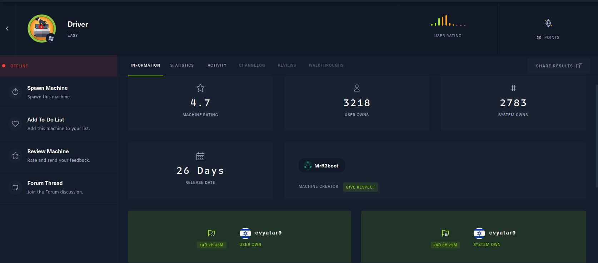
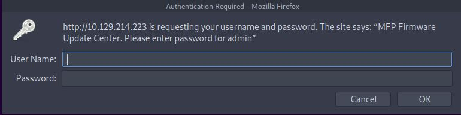
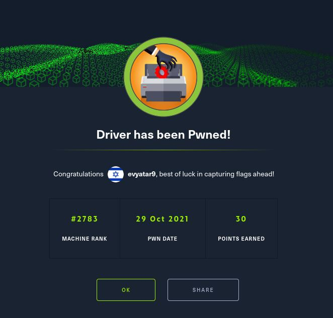

# Driver - HackTheBox - Writeup
Windows, 20 Base Points, Easy

## Machine


 
## Driver Solution

### User

Let's start with ```nmap``` scanning:

```console
┌─[evyatar@parrot]─[/hackthebox/Driver]
└──╼ $ nmap -sV -sC -oA nmap/Driver 10.129.214.223
Starting Nmap 7.80 ( https://nmap.org ) at 2021-10-04 23:47 IDT
Nmap scan report for 10.129.214.223
Host is up (0.16s latency).
Not shown: 997 filtered ports
PORT    STATE SERVICE      VERSION
80/tcp  open  http         Microsoft IIS httpd 10.0
| http-auth: 
| HTTP/1.1 401 Unauthorized\x0D
|_  Basic realm=MFP Firmware Update Center. Please enter password for admin
| http-methods: 
|_  Potentially risky methods: TRACE
|_http-server-header: Microsoft-IIS/10.0
|_http-title: Site doesn't have a title (text/html; charset=UTF-8).
135/tcp open  msrpc        Microsoft Windows RPC
445/tcp open  microsoft-ds Microsoft Windows 7 - 10 microsoft-ds (workgroup: WORKGROUP)
Service Info: Host: DRIVER; OS: Windows; CPE: cpe:/o:microsoft:windows

Host script results:
|_clock-skew: mean: 7h00m51s, deviation: 0s, median: 7h00m50s
|_smb-os-discovery: ERROR: Script execution failed (use -d to debug)
| smb-security-mode: 
|   authentication_level: user
|   challenge_response: supported
|_  message_signing: disabled (dangerous, but default)
| smb2-security-mode: 
|   2.02: 
|_    Message signing enabled but not required
| smb2-time: 
|   date: 2021-10-05T03:49:02
|_  start_date: 2021-10-05T01:48:09
5985/tcp open  wsman

```

By observing port 80 we get the following web page:



## Driver is still active machine - [Full writeup](Driver-Writeup.pdf) avaliable with root hash password only.

Telegram: [@evyatar9](https://t.me/evyatar9)

Discord: [evyatar9](https://discordapp.com/users/812805349815091251)

