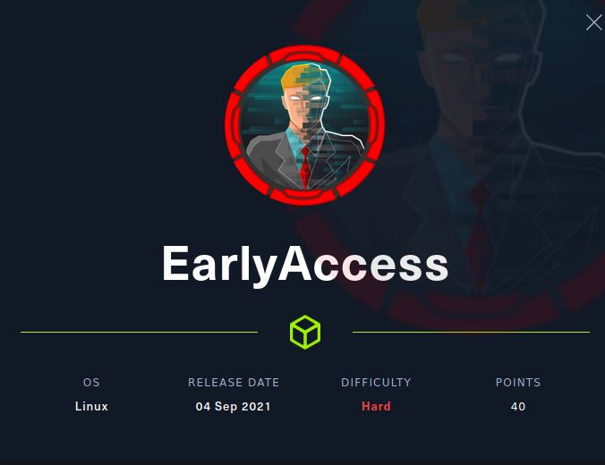
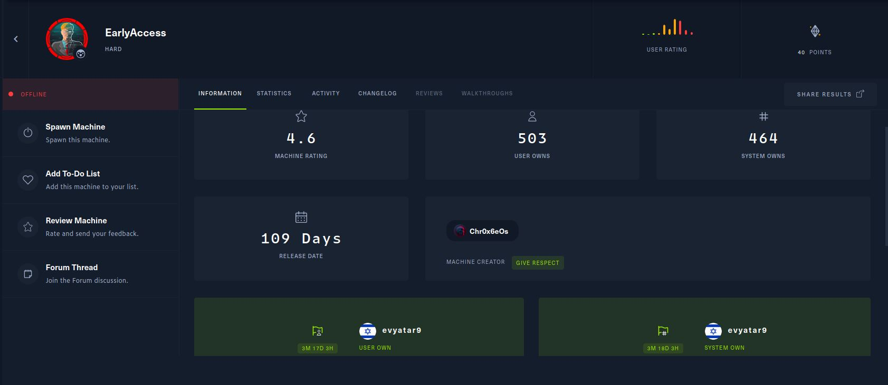
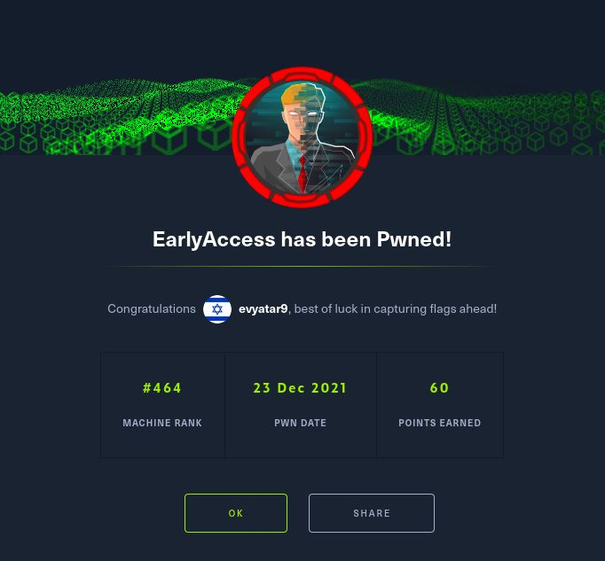

# EarlyAccess - HackTheBox - Writeup
Linux, 40 Base Points, Hard



## Machine


 
## EarlyAccess Solution

### User 

Let's start with ```nmap``` scanning:

```console
┌─[evyatar@parrot]─[/hackthebox/EarlyAccess]
└──╼ $ nmap -sV -sC -oA nmap/EarlyAccess 10.10.11.110
Starting Nmap 7.80 ( https://nmap.org ) at 2021-12-06 22:31 IST
Nmap scan report for 10.10.11.110
Host is up (0.13s latency).
Not shown: 997 closed ports
PORT    STATE SERVICE  VERSION
22/tcp  open  ssh      OpenSSH 7.9p1 Debian 10+deb10u2 (protocol 2.0)
| ssh-hostkey: 
|   2048 e4:66:28:8e:d0:bd:f3:1d:f1:8d:44:e9:14:1d:9c:64 (RSA)
|   256 b3:a8:f4:49:7a:03:79:d3:5a:13:94:24:9b:6a:d1:bd (ECDSA)
|_  256 e9:aa:ae:59:4a:37:49:a6:5a:2a:32:1d:79:26:ed:bb (ED25519)
80/tcp  open  http     Apache httpd 2.4.38
|_http-server-header: Apache/2.4.38 (Debian)
|_http-title: Did not follow redirect to https://earlyaccess.htb/
443/tcp open  ssl/http Apache httpd 2.4.38 ((Debian))
|_http-server-header: Apache/2.4.38 (Debian)
|_http-title: EarlyAccess
| ssl-cert: Subject: commonName=earlyaccess.htb/organizationName=EarlyAccess Studios/stateOrProvinceName=Vienna/countryName=AT
| Not valid before: 2021-08-18T14:46:57
|_Not valid after:  2022-08-18T14:46:57
|_ssl-date: TLS randomness does not represent time
| tls-alpn: 
|_  http/1.1
Service Info: Host: 172.18.0.102; OS: Linux; CPE: cpe:/o:linux:linux_kernel
```


Let's add ```earlyaccess.htb`` to hosts file and browse to [https://earlyaccess.htb/](https://earlyaccess.htb/):


## EarlyAccess is still active machine - [Full writeup](EarlyAccess-Writeup.pdf) available with root hash password only.

Telegram: [@evyatar9](https://t.me/evyatar9)

Discord: [evyatar9](https://discordapp.com/users/812805349815091251)

