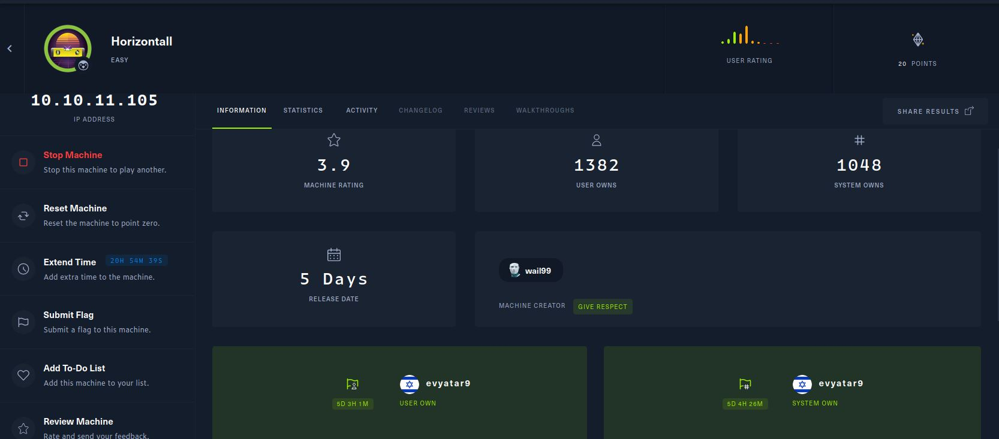

# Horizontall - HackTheBox - Writeup
Linux, 20 Base Points, Easy

## Machine


 
## Horizontall Solution

### User

Let's start with ```nmap``` scanning:

```console
┌─[evyatar@parrot]─[/hackthebox/Horizontall]
└──╼ $ nmap -sV -sC -oA nmap/Horizontall 10.10.11.105
Starting Nmap 7.80 ( https://nmap.org ) at 2021-09-02 23:47 IDT
Nmap scan report for 10.10.11.105
Host is up (0.16s latency).
Not shown: 998 closed ports
PORT   STATE SERVICE VERSION
22/tcp open  ssh     OpenSSH 7.6p1 Ubuntu 4ubuntu0.5 (Ubuntu Linux; protocol 2.0)
| ssh-hostkey: 
|   2048 ee:77:41:43:d4:82:bd:3e:6e:6e:50:cd:ff:6b:0d:d5 (RSA)
|   256 3a:d5:89:d5:da:95:59:d9:df:01:68:37:ca:d5:10:b0 (ECDSA)
|_  256 4a:00:04:b4:9d:29:e7:af:37:16:1b:4f:80:2d:98:94 (ED25519)
80/tcp open  http    nginx 1.14.0 (Ubuntu)
|_http-server-header: nginx/1.14.0 (Ubuntu)
|_http-title: Did not follow redirect to http://horizontall.htb
Service Info: OS: Linux; CPE: cpe:/o:linux:linux_kernel

```

By observing port 80 we get the following web page (Redirected to [http://horizontall.htb/](http://horizontall.htb/)):


## Horizontall is still active machine - [Full writeup](Horizontall-Writeup.pdf) avaliable with root hash password only.

Telegram: [@evyatar9](https://t.me/evyatar9)

Discord: [evyatar9](https://discordapp.com/users/812805349815091251)


