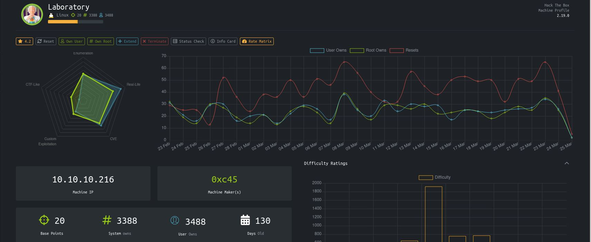

# Laboratory - HackTheBox
Linux, 20 Base Points, Easy

## Machine


 
## Laboratory Solution

### User

So let's start with ```nmap``` scanning:

```console
┌─[evyatar@parrot]─[/hackthebox/Laboratory]
└──╼ $nmap -sC -sV -oA nmap/Laboratory 10.10.10.216
# Nmap 7.80 scan initiated Thu Jan 28 14:05:29 2021 as: nmap -sC -sV -oA Laboratory 10.10.10.216
Nmap scan report for 10.10.10.216
Host is up (0.074s latency).
Not shown: 997 filtered ports
PORT    STATE SERVICE  VERSION
22/tcp  open  ssh      OpenSSH 8.2p1 Ubuntu 4ubuntu0.1 (Ubuntu Linux; protocol 2.0)
80/tcp  open  http     Apache httpd 2.4.41
|_http-server-header: Apache/2.4.41 (Ubuntu)
|_http-title: Did not follow redirect to https://laboratory.htb/
443/tcp open  ssl/http Apache httpd 2.4.41 ((Ubuntu))
|_http-server-header: Apache/2.4.41 (Ubuntu)
|_http-title: The Laboratory
| ssl-cert: Subject: commonName=laboratory.htb
| Subject Alternative Name: DNS:git.laboratory.htb
| Not valid before: 2020-07-05T10:39:28
|_Not valid after:  2024-03-03T10:39:28
| tls-alpn: 
|_  http/1.1
Service Info: Host: laboratory.htb; OS: Linux; CPE: cpe:/o:linux:linux_kernel

Service detection performed. Please report any incorrect results at https://nmap.org/submit/ .
# Nmap done at Thu Jan 28 14:05:52 2021 -- 1 IP address (1 host up) scanned in 22.72 seconds

```

So we can see port 80 redirect to ```https://laboratory.htb/``` and we can see the DNS: ```DNS:git.laboratory.htb``` , Let's add ```laboratory.htb``` and ```git.laboratory.htb``` domains to ```/etc/hosts```:
```console
10.10.10.216	laboratory.htb git.laboratory.htb
```


## Laboratory is still active machine -  avaliable with root password only.

[@evyatar9](https://t.me/evyatar9)