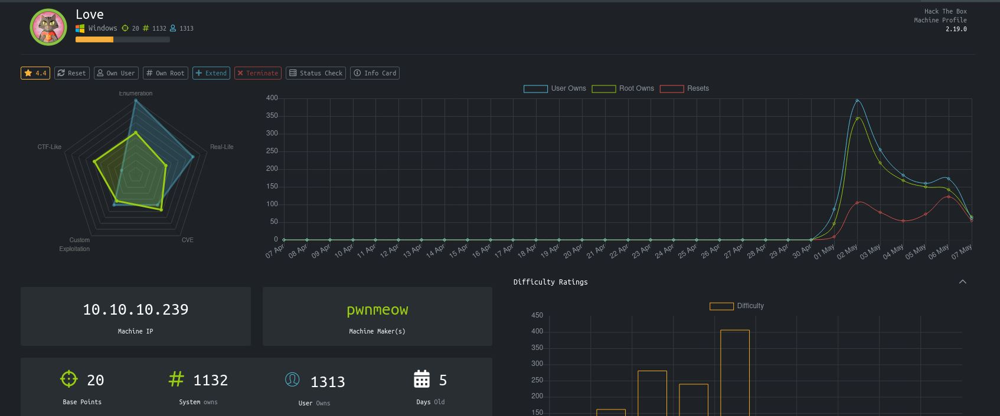
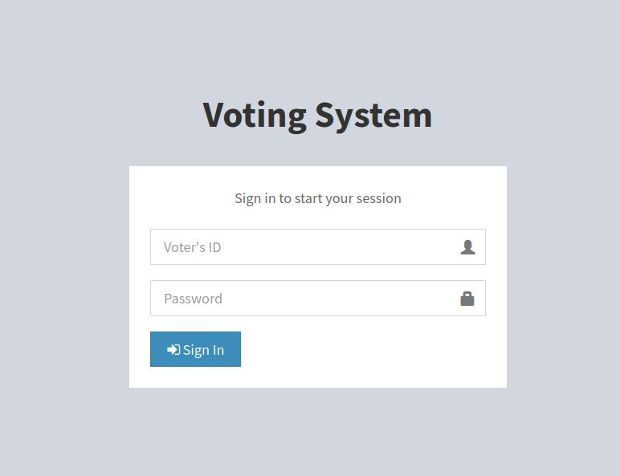

# Love - HackTheBox
Windows, 30 Base Points, Easy

## Machine


 
## Love Solution

### User

So let's start with ```nmap``` scanning:

```console
┌─[evyatar@parrot]─[/hackthebox/Love]
└──╼ $ nmap -sC -sV -oA nmap/Love 10.10.10.239
Starting Nmap 7.80 ( https://nmap.org ) at 2021-05-07 16:07 IDT
Nmap scan report for 10.10.10.239
Host is up (0.092s latency).
Not shown: 993 closed ports
PORT     STATE SERVICE      VERSION
80/tcp   open  http         Apache httpd 2.4.46 ((Win64) OpenSSL/1.1.1j PHP/7.3.27)
| http-cookie-flags: 
|   /: 
|     PHPSESSID: 
|_      httponly flag not set
|_http-server-header: Apache/2.4.46 (Win64) OpenSSL/1.1.1j PHP/7.3.27
|_http-title: Voting System using PHP
135/tcp  open  msrpc        Microsoft Windows RPC
139/tcp  open  netbios-ssn  Microsoft Windows netbios-ssn
443/tcp  open  ssl/http     Apache httpd 2.4.46 (OpenSSL/1.1.1j PHP/7.3.27)
|_http-server-header: Apache/2.4.46 (Win64) OpenSSL/1.1.1j PHP/7.3.27
|_http-title: 403 Forbidden
| ssl-cert: Subject: commonName=staging.love.htb/organizationName=ValentineCorp/stateOrProvinceName=m/countryName=in
| Not valid before: 2021-01-18T14:00:16
|_Not valid after:  2022-01-18T14:00:16
|_ssl-date: TLS randomness does not represent time
| tls-alpn: 
|_  http/1.1
445/tcp  open  microsoft-ds Windows 10 Pro 19042 microsoft-ds (workgroup: WORKGROUP)
3306/tcp open  mysql?
| fingerprint-strings: 
|   Help: 
|_    Host '10.10.14.23' is not allowed to connect to this MariaDB server
5000/tcp open  http         Apache httpd 2.4.46 (OpenSSL/1.1.1j PHP/7.3.27)
|_http-server-header: Apache/2.4.46 (Win64) OpenSSL/1.1.1j PHP/7.3.27
|_http-title: 403 Forbidden
1 service unrecognized despite returning data. If you know the service/version, please submit the following fingerprint at https://nmap.org/cgi-bin/submit.cgi?new-service :
SF-Port3306-TCP:V=7.80%I=7%D=5/7%Time=60953B94%P=x86_64-pc-linux-gnu%r(Hel
SF:p,4A,"F\0\0\x01\xffj\x04Host\x20'10\.10\.14\.23'\x20is\x20not\x20allowe
SF:d\x20to\x20connect\x20to\x20this\x20MariaDB\x20server");
Service Info: Hosts: www.example.com, LOVE, www.love.htb; OS: Windows; CPE: cpe:/o:microsoft:windows

Host script results:
|_clock-skew: mean: 2h45m28s, deviation: 4h02m30s, median: 25m27s
| smb-os-discovery: 
|   OS: Windows 10 Pro 19042 (Windows 10 Pro 6.3)
|   OS CPE: cpe:/o:microsoft:windows_10::-
|   Computer name: Love
|   NetBIOS computer name: LOVE\x00
|   Workgroup: WORKGROUP\x00
|_  System time: 2021-05-07T06:33:06-07:00
| smb-security-mode: 
|   account_used: <blank>
|   authentication_level: user
|   challenge_response: supported
|_  message_signing: disabled (dangerous, but default)
| smb2-security-mode: 
|   2.02: 
|_    Message signing enabled but not required
| smb2-time: 
|   date: 2021-05-07T13:33:07
|_  start_date: N/A

Service detection performed. Please report any incorrect results at https://nmap.org/submit/ .
Nmap done: 1 IP address (1 host up) scanned in 29.68 seconds


```

Let's try to observe port 80:



From ```nmap``` scan we can see the following domain: ```staging.love.htb```, Let's try to add this domain to ```/etc/hosts``` and browse it at [http://staging.love.htb](http://staging.love.htb):


## Love is still active machine - [Full writeup](Love-Writeup.pdf) avaliable with root hash password only.

Telegram: [@evyatar9](https://t.me/evyatar9)

Discord: [evyatar9](https://discordapp.com/users/812805349815091251)