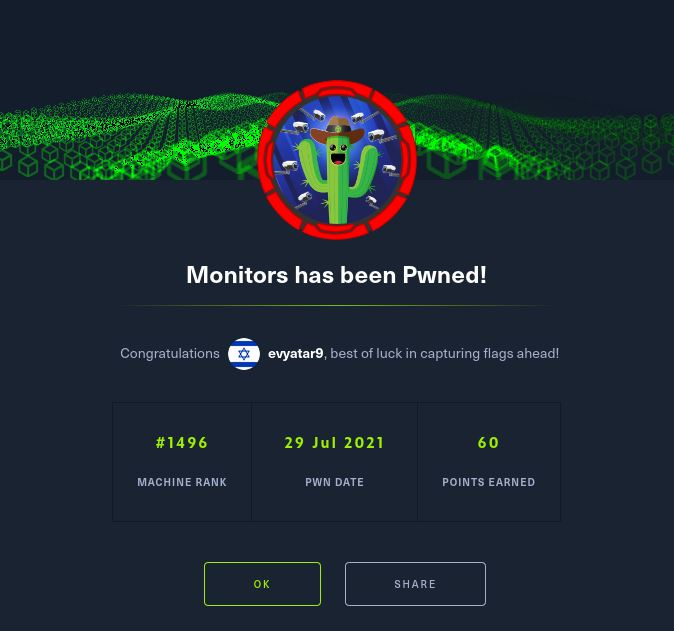

# Monitors - HackTheBox - Writeup
Linux, 40 Base Points, Hard

## Machine


## Monitors Solution

### User

Let's try with ```nmap``` scanning:

```console
┌─[evyatar@parrot]─[/hackthebox/Monitors]
└──╼ $ nmap -sC -sV -oA nmap/Monitors 10.10.10.238
Starting Nmap 7.80 ( https://nmap.org ) at 2021-07-26 14:44 IDT
Nmap scan report for 10.10.10.238
Host is up (0.079s latency).
Not shown: 998 closed ports
PORT   STATE SERVICE VERSION
22/tcp open  ssh     OpenSSH 7.6p1 Ubuntu 4ubuntu0.3 (Ubuntu Linux; protocol 2.0)
| ssh-hostkey: 
|   2048 ba:cc:cd:81:fc:91:55:f3:f6:a9:1f:4e:e8:be:e5:2e (RSA)
|   256 69:43:37:6a:18:09:f5:e7:7a:67:b8:18:11:ea:d7:65 (ECDSA)
|_  256 5d:5e:3f:67:ef:7d:76:23:15:11:4b:53:f8:41:3a:94 (ED25519)
80/tcp open  http    Apache httpd 2.4.29 ((Ubuntu))
|_http-server-header: Apache/2.4.29 (Ubuntu)
|_http-title: Site doesn't have a title (text/html; charset=iso-8859-1).
Service Info: OS: Linux; CPE: cpe:/o:linux:linux_kernel

Service detection performed. Please report any incorrect results at https://nmap.org/submit/ .
Nmap done: 1 IP address (1 host up) scanned in 11.85 second
```

By observing port 80 [http://10.10.10.238/](http://10.10.10.238/) we can see:


## Monitors is still active machine - [Full writeup](Monitors-Writeup.pdf) avaliable with root hash password only.

Telegram: [@evyatar9](https://t.me/evyatar9)

Discord: [evyatar9](https://discordapp.com/users/812805349815091251)

