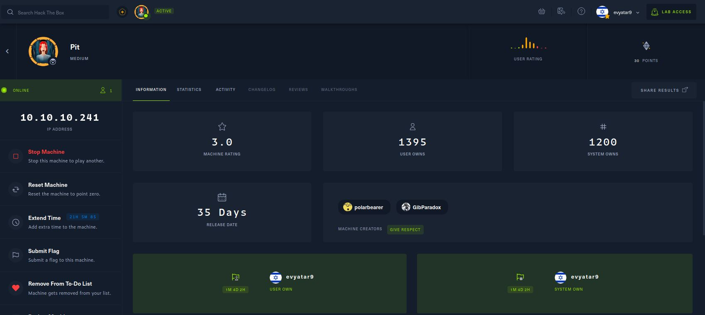
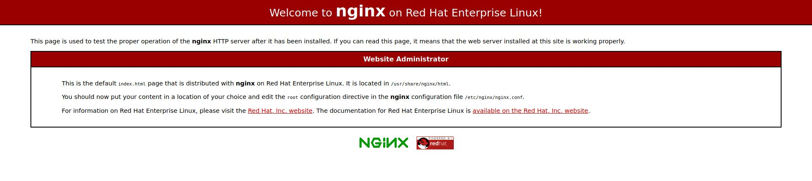
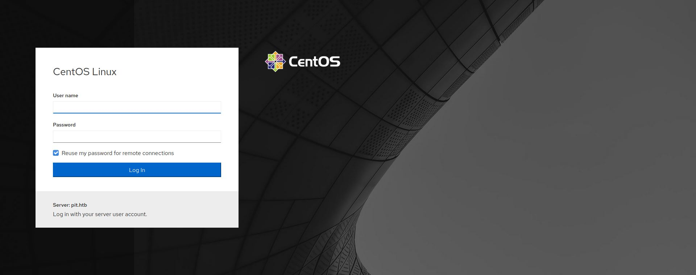

# Pit - HackTheBox - Writeup
Linux, 30 Base Points, Medium

## Machine


 
## Pit Solution

### User

So let's start with ```nmap``` scanning:

```console
┌─[evyatar@parrot]─[/hackthebox/Pit]
└──╼ $ nmap -sC -sV -oA nmap/Pit 10.10.10.241
Starting Nmap 7.80 ( https://nmap.org ) at 2021-06-17 23:46 IDT
Nmap scan report for 10.10.10.241
Host is up (0.082s latency).
Not shown: 997 filtered ports
PORT     STATE SERVICE         VERSION
22/tcp   open  ssh             OpenSSH 8.0 (protocol 2.0)
| ssh-hostkey: 
|   3072 6f:c3:40:8f:69:50:69:5a:57:d7:9c:4e:7b:1b:94:96 (RSA)
|   256 c2:6f:f8:ab:a1:20:83:d1:60:ab:cf:63:2d:c8:65:b7 (ECDSA)
|_  256 6b:65:6c:a6:92:e5:cc:76:17:5a:2f:9a:e7:50:c3:50 (ED25519)
80/tcp   open  http            nginx 1.14.1
|_http-server-header: nginx/1.14.1
|_http-title: Test Page for the Nginx HTTP Server on Red Hat Enterprise Linux
9090/tcp open  ssl/zeus-admin?
| fingerprint-strings: 
|   GetRequest, HTTPOptions: 
|     HTTP/1.1 400 Bad request
|     Content-Type: text/html; charset=utf8
|     Transfer-Encoding: chunked
|     X-DNS-Prefetch-Control: off
|     Referrer-Policy: no-referrer
|     X-Content-Type-Options: nosniff
|     Cross-Origin-Resource-Policy: same-origin
|     <!DOCTYPE html>
|     <html>
|     <head>
|     <title>
|     request
|     </title>
|     <meta http-equiv="Content-Type" content="text/html; charset=utf-8">
|     <meta name="viewport" content="width=device-width, initial-scale=1.0">
|     <style>
|     body {
|     margin: 0;
|     font-family: "RedHatDisplay", "Open Sans", Helvetica, Arial, sans-serif;
|     font-size: 12px;
|     line-height: 1.66666667;
|     color: #333333;
|     background-color: #f5f5f5;
|     border: 0;
|     vertical-align: middle;
|     font-weight: 300;
|_    margin: 0 0 10p
| ssl-cert: Subject: commonName=dms-pit.htb/organizationName=4cd9329523184b0ea52ba0d20a1a6f92/countryName=US
| Subject Alternative Name: DNS:dms-pit.htb, DNS:localhost, IP Address:127.0.0.1
| Not valid before: 2020-04-16T23:29:12
|_Not valid after:  2030-06-04T16:09:12
|_ssl-date: TLS randomness does not represent time
1 service unrecognized despite returning data. If you know the service/version, please submit the following fingerprint at https://nmap.org/cgi-bin/submit.cgi?new-service :
SF-Port9090-TCP:V=7.80%T=SSL%I=7%D=6/17%Time=60CBB4DB%P=x86_64-pc-linux-gn
SF:u%r(GetRequest,E70,"HTTP/1\.1\x20400\x20Bad\x20request\r\nContent-Type:
SF:\x20text/html;\x20charset=utf8\r\nTransfer-Encoding:\x20chunked\r\nX-DN
SF:S-Prefetch-Control:\x20off\r\nReferrer-Policy:\x20no-referrer\r\nX-Cont
SF:ent-Type-Options:\x20nosniff\r\nCross-Origin-Resource-Policy:\x20same-o
SF:rigin\r\n\r\n29\r\n<!DOCTYPE\x20html>\n<html>\n<head>\n\x20\x20\x20\x20
SF:<title>\r\nb\r\nBad\x20request\r\nd08\r\n</title>\n\x20\x20\x20\x20<met
SF:a\x20http-equiv=\"Content-Type\"\x20content=\"text/html;\x20charset=utf
SF:-8\">\n\x20\x20\x20\x20<meta\x20name=\"viewport\"\x20content=\"width=de
SF:vice-width,\x20initial-scale=1\.0\">\n\x20\x20\x20\x20<style>\n\tbody\x
SF:20{\n\x20\x20\x20\x20\x20\x20\x20\x20\x20\x20\x20\x20margin:\x200;\n\x2
SF:0\x20\x20\x20\x20\x20\x20\x20\x20\x20\x20\x20font-family:\x20\"RedHatDi
SF:splay\",\x20\"Open\x20Sans\",\x20Helvetica,\x20Arial,\x20sans-serif;\n\
SF:x20\x20\x20\x20\x20\x20\x20\x20\x20\x20\x20\x20font-size:\x2012px;\n\x2
SF:0\x20\x20\x20\x20\x20\x20\x20\x20\x20\x20\x20line-height:\x201\.6666666
SF:7;\n\x20\x20\x20\x20\x20\x20\x20\x20\x20\x20\x20\x20color:\x20#333333;\
SF:n\x20\x20\x20\x20\x20\x20\x20\x20\x20\x20\x20\x20background-color:\x20#
SF:f5f5f5;\n\x20\x20\x20\x20\x20\x20\x20\x20}\n\x20\x20\x20\x20\x20\x20\x2
SF:0\x20img\x20{\n\x20\x20\x20\x20\x20\x20\x20\x20\x20\x20\x20\x20border:\
SF:x200;\n\x20\x20\x20\x20\x20\x20\x20\x20\x20\x20\x20\x20vertical-align:\
SF:x20middle;\n\x20\x20\x20\x20\x20\x20\x20\x20}\n\x20\x20\x20\x20\x20\x20
SF:\x20\x20h1\x20{\n\x20\x20\x20\x20\x20\x20\x20\x20\x20\x20\x20\x20font-w
SF:eight:\x20300;\n\x20\x20\x20\x20\x20\x20\x20\x20}\n\x20\x20\x20\x20\x20
SF:\x20\x20\x20p\x20{\n\x20\x20\x20\x20\x20\x20\x20\x20\x20\x20\x20\x20mar
SF:gin:\x200\x200\x2010p")%r(HTTPOptions,E70,"HTTP/1\.1\x20400\x20Bad\x20r
SF:equest\r\nContent-Type:\x20text/html;\x20charset=utf8\r\nTransfer-Encod
SF:ing:\x20chunked\r\nX-DNS-Prefetch-Control:\x20off\r\nReferrer-Policy:\x
SF:20no-referrer\r\nX-Content-Type-Options:\x20nosniff\r\nCross-Origin-Res
SF:ource-Policy:\x20same-origin\r\n\r\n29\r\n<!DOCTYPE\x20html>\n<html>\n<
SF:head>\n\x20\x20\x20\x20<title>\r\nb\r\nBad\x20request\r\nd08\r\n</title
SF:>\n\x20\x20\x20\x20<meta\x20http-equiv=\"Content-Type\"\x20content=\"te
SF:xt/html;\x20charset=utf-8\">\n\x20\x20\x20\x20<meta\x20name=\"viewport\
SF:"\x20content=\"width=device-width,\x20initial-scale=1\.0\">\n\x20\x20\x
SF:20\x20<style>\n\tbody\x20{\n\x20\x20\x20\x20\x20\x20\x20\x20\x20\x20\x2
SF:0\x20margin:\x200;\n\x20\x20\x20\x20\x20\x20\x20\x20\x20\x20\x20\x20fon
SF:t-family:\x20\"RedHatDisplay\",\x20\"Open\x20Sans\",\x20Helvetica,\x20A
SF:rial,\x20sans-serif;\n\x20\x20\x20\x20\x20\x20\x20\x20\x20\x20\x20\x20f
SF:ont-size:\x2012px;\n\x20\x20\x20\x20\x20\x20\x20\x20\x20\x20\x20\x20lin
SF:e-height:\x201\.66666667;\n\x20\x20\x20\x20\x20\x20\x20\x20\x20\x20\x20
SF:\x20color:\x20#333333;\n\x20\x20\x20\x20\x20\x20\x20\x20\x20\x20\x20\x2
SF:0background-color:\x20#f5f5f5;\n\x20\x20\x20\x20\x20\x20\x20\x20}\n\x20
SF:\x20\x20\x20\x20\x20\x20\x20img\x20{\n\x20\x20\x20\x20\x20\x20\x20\x20\
SF:x20\x20\x20\x20border:\x200;\n\x20\x20\x20\x20\x20\x20\x20\x20\x20\x20\
SF:x20\x20vertical-align:\x20middle;\n\x20\x20\x20\x20\x20\x20\x20\x20}\n\
SF:x20\x20\x20\x20\x20\x20\x20\x20h1\x20{\n\x20\x20\x20\x20\x20\x20\x20\x2
SF:0\x20\x20\x20\x20font-weight:\x20300;\n\x20\x20\x20\x20\x20\x20\x20\x20
SF:}\n\x20\x20\x20\x20\x20\x20\x20\x20p\x20{\n\x20\x20\x20\x20\x20\x20\x20
SF:\x20\x20\x20\x20\x20margin:\x200\x200\x2010p");

Service detection performed. Please report any incorrect results at https://nmap.org/submit/ .
Nmap done: 1 IP address (1 host up) scanned in 214.52 seconds

```

Let's add the domains ```dms-pit.htb```, ```pit.htb``` to ```/etc/hosts``` and browse to ports 9090 and 80.

Port 80 [http://10.10.10.241/](http://10.10.10.241/):



Port 9090 [https://dms-pit.htb:9090/](https://dms-pit.htb:9090/):




## Pit is still active machine - [Full writeup](Pit-Writeup.pdf) avaliable with root hash password only.

Telegram: [@evyatar9](https://t.me/evyatar9)

Discord: [evyatar9](https://discordapp.com/users/812805349815091251)