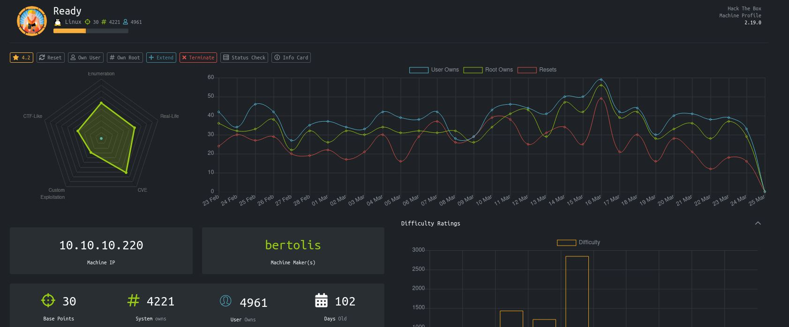
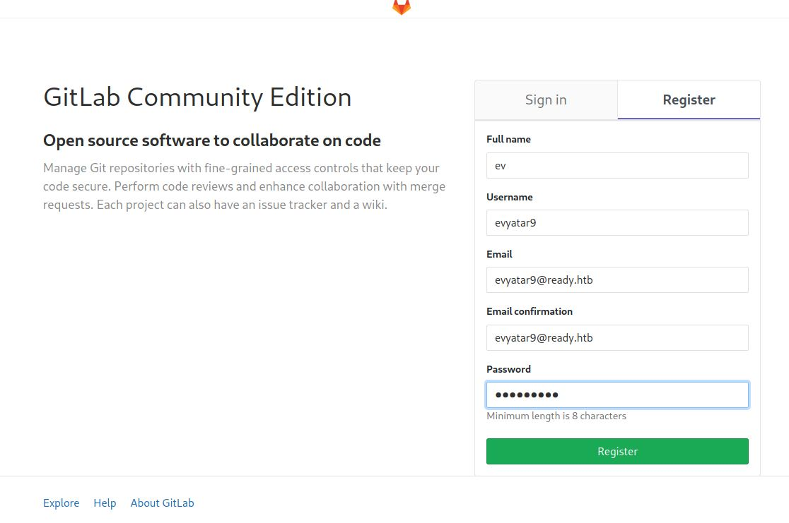

# Ready - HackTheBox
Linux, 30 Base Points, Medium

## Machine


 
## Ready Solution

### User

So let's start with ```nmap``` scanning:

```console
┌─[evyatar@parrot]─[/hackthebox/Ready]
└──╼ $nmap -sC -sV -oA nmap/Ready 10.10.10.220
Starting Nmap 7.80 ( https://nmap.org ) at 2021-03-24 23:57 IST
Nmap scan report for 10.10.10.220
Host is up (0.54s latency).
Not shown: 998 closed ports
PORT     STATE SERVICE VERSION
22/tcp   open  ssh     OpenSSH 8.2p1 Ubuntu 4 (Ubuntu Linux; protocol 2.0)
5080/tcp open  http    nginx
| http-robots.txt: 53 disallowed entries (15 shown)
| / /autocomplete/users /search /api /admin /profile 
| /dashboard /projects/new /groups/new /groups/*/edit /users /help 
|_/s/ /snippets/new /snippets/*/edit
| http-title: Sign in \xC2\xB7 GitLab
|_Requested resource was http://10.10.10.220:5080/users/sign_in
|_http-trane-info: Problem with XML parsing of /evox/about
Service Info: OS: Linux; CPE: cpe:/o:linux:linux_kernel

Service detection performed. Please report any incorrect results at https://nmap.org/submit/ .
Nmap done: 1 IP address (1 host up) scanned in 18.27 seconds

```

Let's browse to ```http://10.10.10.220:5080``` and register to Gitlab:



## Ready is still active machine - [Full writeup](Ready-Writeup.pdf) avaliable with root password only.

Telegram: [@evyatar9](https://t.me/evyatar9)

Discord: [evyatar9](https://discordapp.com/users/812805349815091251)