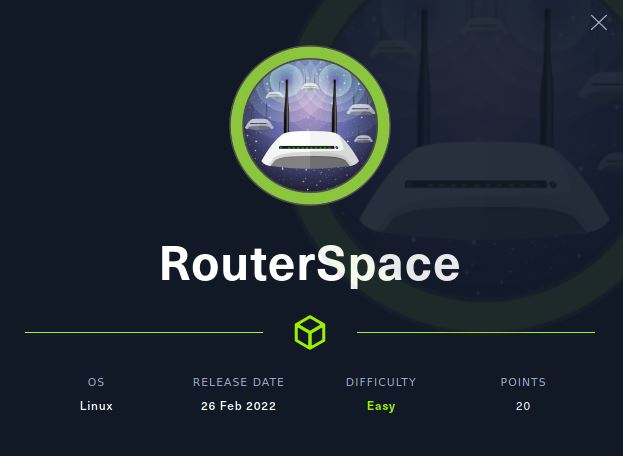
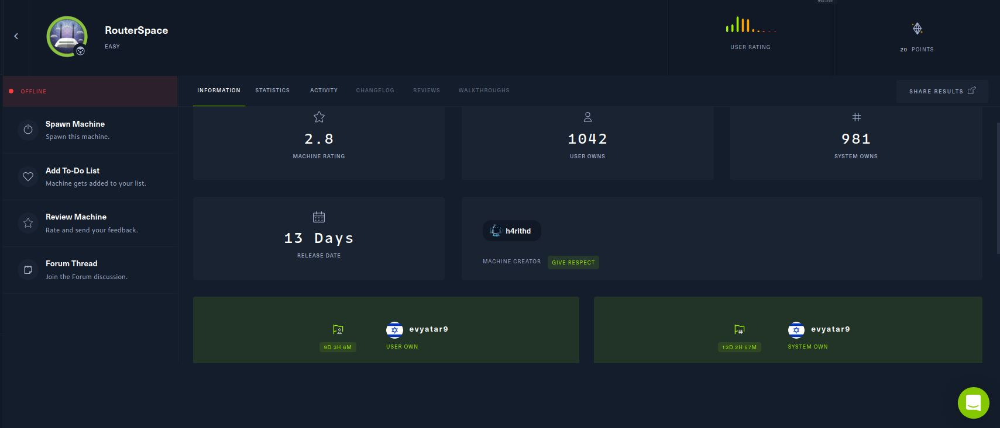
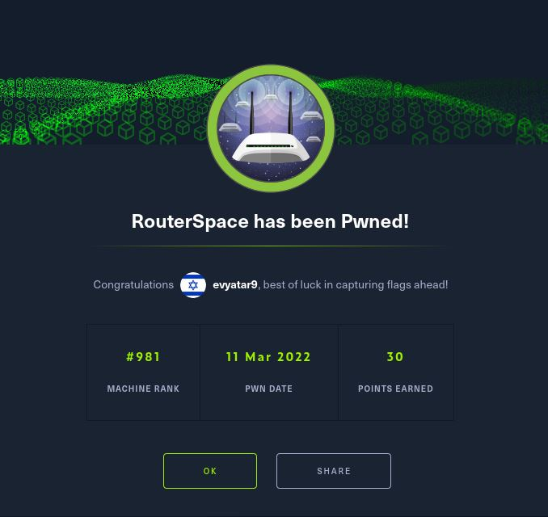

# RouterSpace - HackTheBox - Writeup
Linux, 20 Base Points, Easy



## Machine


 

## RouterSpace Solution

### User

Let's start with ```nmap``` scanning:

```console
┌─[evyatar@parrot]─[/hackthebox/RouterSpace]
└──╼ $ nmap -sV -sC -oA nmap/RouterSpace 10.10.11.148
Starting Nmap 7.80 ( https://nmap.org ) at 2022-03-07 22:52 IST
Nmap scan report for 10.10.11.148
Host is up (0.12s latency).
Not shown: 998 filtered ports
PORT   STATE SERVICE VERSION
22/tcp open  ssh     (protocol 2.0)
| fingerprint-strings: 
|   NULL: 
|_    SSH-2.0-RouterSpace Packet Filtering V1
80/tcp open  http

Service detection performed. Please report any incorrect results at https://nmap.org/submit/ .

```

By observing port 80 we get the following web page:


## RouterSpace is still an active machine - [Full writeup](RouterSpace-Writeup.pdf) available with root hash password only.

Telegram: [@evyatar9](https://t.me/evyatar9)

Discord: [evyatar9#5800](https://discordapp.com/users/812805349815091251)

