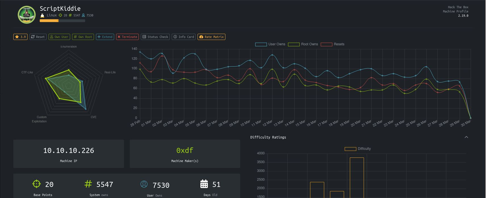
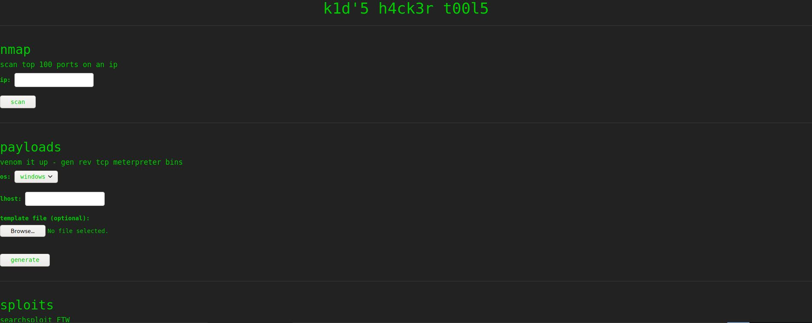

# ScriptKiddie - HackTheBox
Linux, 20 Base Points, Easy

## Machine


  
## ScriptKiddie Solution

### User

So let's start with ```nmap``` scanning:

```console
┌─[evyatar@parrot]─[/hackthebox/ScriptKiddie]
└──╼ $nmap -sC -sV -oA nmap/ScriptKiddie 10.10.10.226
Starting Nmap 7.80 ( https://nmap.org ) at 2021-03-30 00:08 IDT
Nmap scan report for 10.10.10.226
Host is up (0.13s latency).
Not shown: 998 closed ports
PORT     STATE SERVICE VERSION
22/tcp   open  ssh     OpenSSH 8.2p1 Ubuntu 4ubuntu0.1 (Ubuntu Linux; protocol 2.0)
5000/tcp open  http    Werkzeug httpd 0.16.1 (Python 3.8.5)
|_http-server-header: Werkzeug/0.16.1 Python/3.8.5
|_http-title: k1d'5 h4ck3r t00l5
Service Info: OS: Linux; CPE: cpe:/o:linux:linux_kernel

Service detection performed. Please report any incorrect results at https://nmap.org/submit/ .
Nmap done: 1 IP address (1 host up) scanned in 12.52 second

```

Let's see what port ```5000``` contains:


 
## ScriptKiddie is still active machine - [Full writeup](ScriptKiddie-Writeup.pdf) avaliable with root password only.

Telegram: [@evyatar9](https://t.me/evyatar9)

Discord: [evyatar9](https://discordapp.com/users/812805349815091251)
